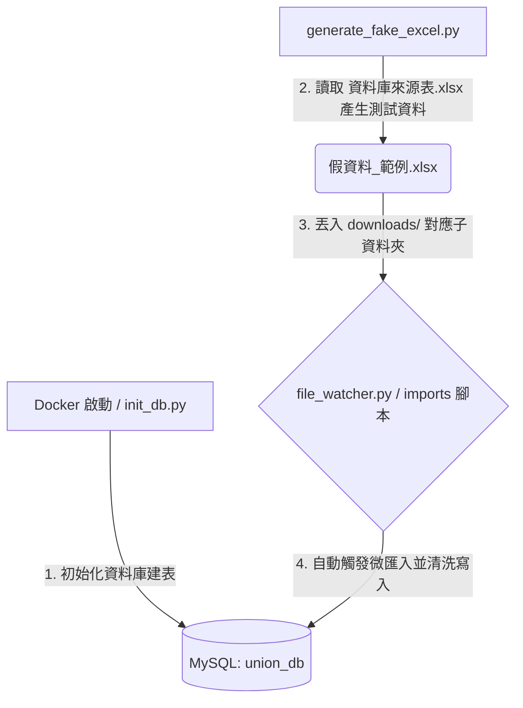

# 新竹市月子照顧服務人員職業工會 - LINE 應用與行政流程自動化系統

本專案旨在為「新竹市月子照顧服務人員職業工會」開發地端運作的 **LINE 客服與行政流程自動化系統**。透過將行政人員手動下載的 Excel 名冊自動化匯入資料庫，未來將延伸串接 LINE Messaging API 實現半自動化客戶配對、合約發送與 RAG 客服問答。

---

## 📂 專案檔案結構與設計緣由

本專案的目錄與檔案結構設計如下，以下說明各檔案的存在目的與設計考量：

```text
Lobar_union/
├── .venv/                      # Python 虛擬環境 (Git 已忽略)
├── .github/                    # Git/GitHub 相關配置
├── .obsidian/                  # Obsidian 筆記軟體配置 (用於閱讀與編輯 document 下的 markdown)
├── db/                         # 資料庫 Schema
│   └── schema.sql              # MySQL 資料庫建表語句 (含 5 階段狀態機、對帳 payments 表與防編碼截斷重置設定)
├── document/                   # 專案設計與規格說明文件
│   ├── API/                    # API 整合設計文件
│   ├── line/                   # LINE 平台整合相關說明
│   ├── 地端部屬/               # 地端部署指南與安全架構
│   ├── 管理端UI/               # Streamlit 管理介面原型與規格
│   │   └── 表格需求模板/       # 管理端所需的 Excel 報表設計模板 (帳務.xlsx、所需表格.xlsx、週報.xlsx)
│   └── 資料庫、資料處理/        # 資料庫欄位對應、SSOT 業務規則與 Data Pipeline 設計
│       ├── 資料庫來源表.xlsx    # 最新官方提供的欄位模板與參照來源表
│       ├── 假資料_範例.xlsx     # 模擬測試用的客戶與月嫂名冊 Excel 檔案
│       ├── 帳務.xlsx            # 自動生成且帶有雜訊的模擬對帳流水帳與對照表
│       ├── 帳務與訂單業務規則.md # SSOT：14 碼虛擬帳號公式與 5 階段訂單狀態機
│       └── 帳務假數據生成與關聯測試規格.md # 模擬財務流水帳與 JOIN 邏輯之設計原則
├── downloads/                  # 檔案監控下載根目錄 (由 File Watcher 監聽，行政人員將 Excel 丟入對應目錄即可)
│   ├── hcm/                    # 存放 HCM 月子平台 - 市府 Excel 來源檔
│   ├── client_beclass/         # 存放客戶 BeClass Excel 來源檔
│   ├── staff_beclass/          # 存放月嫂 BeClass Excel 來源檔
│   └── bank/                   # 存放銀行對帳單 Excel 來源檔
├── scripts/                    # 核心 Python 運作與資料處理腳本
│   ├── imports/                # 微匯入 Pipeline 專屬目錄 (Micro-Pipelines)
│   │   ├── import_client_hcm.py     # 處理 HCM 客戶匯入 (以案件編號為唯一鍵，初始化訂單為「洽談中」)
│   │   ├── import_client_beclass.py # 處理 BeClass 客戶匯入 (以「姓名+生日」複合作業唯一鍵去重更新)
│   │   ├── import_staff_beclass.py  # 處理 BeClass 月嫂匯入 (以身分證字號為唯一鍵，支援 7 個子表 Delete-and-Insert)
│   │   └── import_finance_excel.py  # 處理銀行對帳流水單 (過濾托育課程等雜訊，虛擬帳號解碼核銷 payments 表)
│   ├── file_watcher.py         # 地端檔案自動監控服務，使用 watchdog 監控 downloads/ 子目錄變更並分發執行
│   ├── generate_fake_data.py   # 統一生成系統測試所需假資料 (名冊 Excel 與財務對帳 Excel)
│   └── init_db.py              # 執行 schema.sql 初始化/重建資料庫結構，並強制指定連線 utf8mb4 防止編碼錯誤
├── tests/                      # 單元測試與整合測試目錄
├── .dockerignore               # Docker 建置時忽略的檔案清單
├── .env                        # 本地環境變數設定檔 (已在 .gitignore 中，含 LINE 密鑰等，需自行建立)
├── .env.example                # 環境變數範本檔
├── .gitignore                  # Git 忽略檔案清單
├── .python-version             # 指定本專案使用的 Python 版本 (3.14)
├── docker-compose.yml          # Docker Compose 配置文件，一鍵啟動 MySQL 資料庫服務
├── last_count.txt              # 記錄上一次處理的資料筆數 (由舊腳本自動維護)
├── main.py                     # 專案主程式入口 (已依賴 FileWatcher 背景執行，待後續打包落地)
├── pyproject.toml              # uv 專案管理配置文件 (定義專案元數據與頂層依賴，新增 watchdog 等)
├── requirements.txt            # 從 pyproject.toml 自動編譯導出的相容性依賴清單
└── uv.lock                     # uv 依賴鎖定檔，確保所有開發者安裝完全相同的套件版本
```

## 📄 本次更新說明 (開發實作收尾)

在此次大更新中，我們針對資料庫底層、資料 Pipeline 以及行政人員地端操作流程，完成了以下的結構性優化與模組部署：

### 1. 微服務 Pipeline 拆分與專屬目錄 (`scripts/imports/`)
為符合工會行政人員從不同平台下載 Excel 且存放於不同資料夾的真實情境，我們將原本大而臃腫的匯入腳本拆分為 4 個獨立運作、低耦合的微 Pipeline：
*   **[import_client_hcm.py](file:///c:/Users/chris/Desktop/project/Lobar_union%20-%20solo/scripts/imports/import_client_hcm.py)**：匯入 HCM 政府平台案件。
    *   *去重唯一鍵*：**9 碼「查詢序號(案件編號)」** (排除覆寫 LINE 平台關聯資料)。
    *   *生命週期同步*：在 INSERT 新客戶時，會自動在 `orders` 專案表中建立對應資料，並初始化狀態為 **`洽談中`**。
*   **[import_client_beclass.py](file:///c:/Users/chris/Desktop/project/Lobar_union%20-%20solo/scripts/imports/import_client_beclass.py)**：匯入 BeClass 客戶名冊。
    *   *去重組合唯一鍵*：**`姓名 (name) + 出生年月日 (birth_date)`**，避開修改 Schema 新增身分證欄位的需求。
    *   *問卷處理*：將 60+ 個彈性的問卷調查選項全部打包為單一 `survey_details` JSON 欄位寫入。
*   **[import_staff_beclass.py](file:///c:/Users/chris/Desktop/project/Lobar_union%20-%20solo/scripts/imports/import_staff_beclass.py)**：匯入 BeClass 服務人員（月嫂）。
    *   *去重唯一鍵*：身分證字號。
    *   *多表聯動*：支援月嫂核心檔案、銀行帳戶、服務地區、時段、餐點料理、交通工具、節日上班意願等 7 張子表的 `Delete-and-Insert` 對齊策略。
*   **[import_finance_excel.py](file:///c:/Users/chris/Desktop/project/Lobar_union%20-%20solo/scripts/imports/import_finance_excel.py)**：讀取銀行下載之帳單流水帳。
    *   *對帳核銷*：自動過濾出前綴為 `997816` 且分類碼為 `99` (月子服務) 的虛擬帳號。
    *   *解碼還原*：將後半部的 6 碼（如 `115001`）解碼還原為 9 碼的「查詢序號」，比對存入金額 12,000 元（訂金）、68,000 元（尾款）與月嫂撥款支出 60,000 元，並執行 payments 財務核銷。

### 2. 地端檔案自動監控服務 (`scripts/file_watcher.py`)
*   使用 `watchdog` 庫監控 `downloads/` 根目錄。
*   **運作機制**：不限檔名，只要行政人員向 `downloads/hcm/`、`downloads/client_beclass/`、`downloads/staff_beclass/` 或 `downloads/bank/` 任一子資料夾丟入新下載的 `.xlsx`，服務就會自動捕捉，並拉起 Python 子進程調用對應的微匯入腳本進行**增量更新與舊資料複寫**。
*   內置 **5 秒防重複觸發冷卻機制**，防止 Windows 在檔案寫入未完成時連續發送修改事件。

### 3. 資料庫 ENUM 編碼與重建機制優化
*   **解決雙重 UTF-8 編碼錯誤**：發現先前舊表建立時，`orders.status` 的 `ENUM` 值在 Windows PowerShell 內被 double-encoded 寫入，導致程式碼傳入 `'洽談中'` 被判定為資料截斷錯誤。
*   **解決方案**：
    1.  優化了 `db/schema.sql`，加上 `DROP DATABASE IF EXISTS` 以確保執行時舊快取被清理乾淨。
    2.  修正 `scripts/init_db.py`，在資料庫連接建立後，強制執行 `SET NAMES utf8mb4;` 宣告，確保建表與寫入時編碼通道 100% 準確。
    3.  將 `orders.status` 的 `ENUM` 補齊為業務規格定義的 5 個狀態：`洽談中`、`訂單成立`、`服務中`、`訂單完成`、`訂單取消`。
*   **主鍵重構備註標記**：在 `schema.sql` 中對 `case_no` 進行了重構警告注釋，指出其目前實體儲存的是 9 碼查詢序號，舊式案號已作廢，未來大改版將重命名。

---

### 💡 核心依賴套件選型緣由
*   **`pandas` 與 `openpyxl`**：處理行政人員下載的 Excel 資料，提供強大的資料清洗、欄位映射與去重能力。
*   **`pymysql`**：Python 連接 MySQL 的輕量化驅動程式。
*   **`watchdog`**：實現低延遲、無輪詢（No-Polling）的地端檔案目錄變更偵測監控服務。
*   **`playwright`**：預留用於後續網頁自動化或爬蟲任務。

---

## 🛠️ 開發環境架設指南

### 1. 前置準備
*   安裝 **Git**。
*   安裝 **Docker** 與 **Docker Desktop** (用於在本機啟動資料庫)。
*   安裝 **Python 3.14** (或使用 Python 版本管理工具如 `pyenv`、`uv` 等)。

### 2. 安裝 Python 依賴環境

#### 💡 方式 A：使用 `uv`（強烈推薦）
1. 安裝 `uv`（若尚未安裝）：
   ```powershell
   irm https://astral.sh/uv/install.ps1 | iex
   ```
2. 同步並安裝依賴（含最新 `watchdog` 套件）：
   ```powershell
   uv sync
   ```
3. 初始化 Playwright 瀏覽器驅動：
   ```powershell
   uv run playwright install
   ```

#### 💡 方式 B：使用傳統 `pip`
1. 建立並啟用虛擬環境：
   ```powershell
   python -m venv .venv
   # 啟用虛擬環境 (Windows PowerShell)
   .\.venv\Scripts\Activate.ps1
   ```
2. 使用編譯好的 `requirements.txt` 安裝依賴：
   ```powershell
   pip install -r requirements.txt
   ```
3. 初始化 Playwright 瀏覽器驅動：
   ```powershell
   playwright install
   ```

### 3. 複製並設定環境變數
將專案根目錄下的 `.env.example` 複製一份並命名為 `.env`：
```powershell
cp .env.example .env
```
用文字編輯器開啟 `.env`，填入您的 LINE Messaging API 的 `Channel ID` 與 `Channel Secret` 等私密資訊。

### 4. 啟動 Docker 服務（MySQL）
在專案根目錄下，執行以下命令啟動容器：
```powershell
docker-compose up -d
```
這會啟動以下服務：
*   **MySQL 資料庫 (`mysql_db`)**：
    *   連接埠：`3306`
    *   資料庫名稱：`union_db`
    *   預設 root 密碼：`1234`
    *   **自動建表**：首次啟動時，Docker 會自動掛載並執行 `db/schema.sql` 完成資料表的建立。

---

## 🔄 數據流與運作工作流程

當環境架設完畢後，您可以按照以下流程進行開發測試：



### 步驟 1：初始化/建置資料庫表格
在開始進行資料測試前，必須先確保資料庫內已建立好對應的資料表。
*   **自動建表**：若您是以 `docker-compose up -d` 首次啟動容器，Docker 會自動掛載並執行 `db/schema.sql` 完成建表，此時可跳過此步驟。
*   **手動重新整理/清空重來**：若您在開發過程中修改了 `db/schema.sql`，或者想要清空資料庫重新開始，可以執行以下腳本：
    ```powershell
    # 使用 uv
    uv run scripts/init_db.py

    # 或使用啟用虛擬環境後的 python
    python scripts/init_db.py
    ```

### 步驟 2：生成測試 Excel 檔案
由於真實客戶與財務資料具備隱私，請使用模擬腳本統一產生測試假資料：
```powershell
# 使用 uv
uv run scripts/generate_fake_data.py

# 或使用啟用虛擬環境後的 python
python scripts/generate_fake_data.py
```
這會讀取最新欄位模板 [資料庫來源表.xlsx](document/資料庫、資料處理/資料庫來源表.xlsx)，並在 `document/資料庫、資料處理/` 下同時產生包含名冊的 [假資料_範例.xlsx](document/資料庫、資料處理/假資料_範例.xlsx) 與包含財務對帳的 [帳務.xlsx](document/資料庫、資料處理/帳務.xlsx)，且兩者的測試案號與姓名已 100% 關聯對齊。

### 步驟 3：執行 Excel 資料匯入 (Data Pipeline)
當資料庫初始化完成，且測試資料 Excel 已生成後，您可以透過以下兩種方式之一將資料清洗並寫入資料庫：

#### 方法 A：啟動檔案自動監控服務（推薦）
啟動 `file_watcher.py` 背景服務，當您將 Excel 檔案丟入 `downloads/` 的對應子目錄時，服務會自動偵測變更並觸發匯入：
```powershell
# 啟動自動監控服務 (請保持此命令列視窗開啟)
python scripts/file_watcher.py
```
接著，將產生的 [假資料_範例.xlsx](document/資料庫、資料處理/假資料_範例.xlsx) 重新命名或放入以下 `downloads/` 對應專屬目錄：
*   **HCM 客戶資料**：放入 `downloads/hcm/` (觸發 `import_client_hcm.py`)
*   **BeClass 客戶資料**：放入 `downloads/client_beclass/` (觸發 `import_client_beclass.py`)
*   **BeClass 服務人員資料**：放入 `downloads/staff_beclass/` (觸發 `import_staff_beclass.py`)

#### 方法 B：手動執行專屬微匯入腳本
您也可以直接手動執行 `scripts/imports/` 下對應的腳本進行資料庫增量匯入：
```powershell
# 匯入 HCM 客戶資料
python scripts/imports/import_client_hcm.py

# 匯入 BeClass 客戶資料
python scripts/imports/import_client_beclass.py

# 匯入 BeClass 服務人員資料
python scripts/imports/import_staff_beclass.py
```

**導入邏輯特性：**
*   微匯入腳本會進行資料清洗（去除非法字元、格式化電話與日期、將問卷轉為 JSON 欄位等）。
*   在寫入 MySQL 前會以唯一識別鍵（如身分證字號、案件編號或姓名+生日組合鍵）進行去重比對：若資料已存在則執行 `UPDATE`，若為全新資料則執行 `INSERT`，確保資料不重複。

---

## 🚀 後續接手與開發藍圖

本專案目前已完成**地端資料庫容器化、初始化 Schema 與 Excel 數據清洗匯入 (Data Pipeline)** 的基礎建設。後續接手開發人員可參考 `document/自動化系統設計規格書(總覽).md`，依序實作以下模組：

1.  **FastAPI Webhook 服務**：
    *   撰寫 FastAPI 服務對接 LINE Messaging API。
    *   接收使用者的訊息，並引導繳款或發送服務人員履歷。
2.  **RAG 語意檢索客服核心**：
    *   建置地端向量資料庫 (例如 ChromaDB)。
    *   將工會知識庫 (FAQ) 向量化 (Embedding) 存入。
    *   串接 Embedding API / 地端輕量模型，實作相似度比對與防幻覺客服自動回覆。
3.  **地端檔案自動監控服務 (File Watcher)**：
    *   使用 `watchdog` 庫監控 `downloads/` 資料夾。
    *   當行政人員下載新的 Excel 並丟入資料夾時，背景服務自動偵測並觸發對應的微匯入腳本進行資料更新。
4.  **Streamlit 管理 UI**：
    *   設計視覺化的 Web 介面，供工會行政人員手動調整「服務人員行事曆」及執行「案件與配對中心」的四步配對流程。
    *   串接「好好簽 (Breezysign)」等線上契約 API 進行電子合約發送與狀態追蹤。
5.  **地端部署與邊界網路防護**：
    *   架設地端實體伺服器，配置 Nginx 作為反向代理。
    *   設定防火牆僅允許 LINE 官方 Webhook IP 連入 Port 443。
    *   設定 WireGuard VPN，確保 Streamlit 管理介面僅能在 VPN 內網存取。
