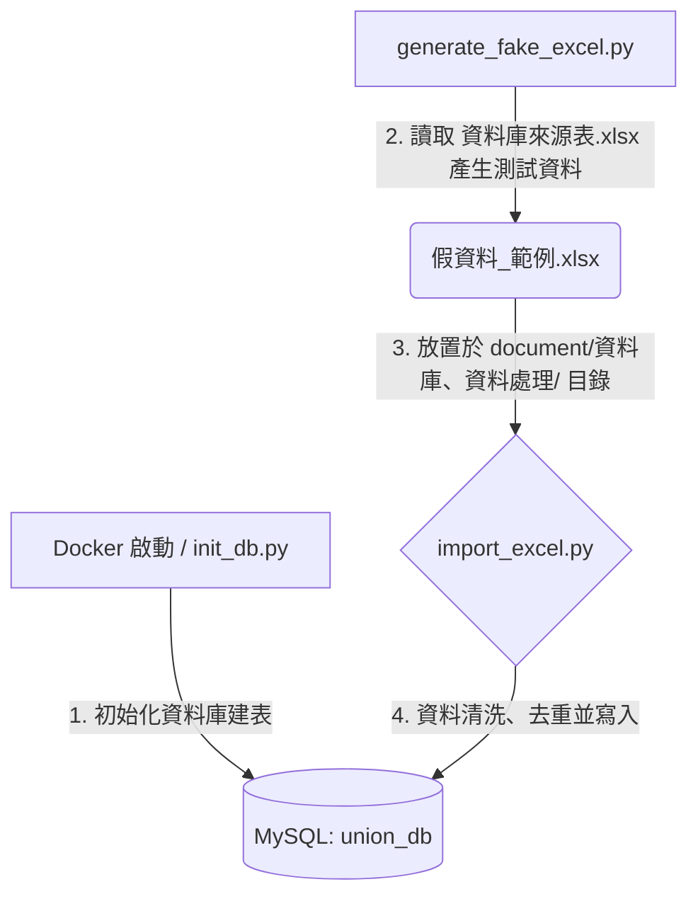

# 新竹市月子照顧服務人員職業工會 - LINE 應用與行政流程自動化系統

本專案旨在為「新竹市月子照顧服務人員職業工會」開發地端運作的 **LINE 客服與行政流程自動化系統**。透過將行政人員手動下載的 Excel 名冊自動化匯入資料庫，未來將延伸串接 LINE Messaging API 實現半自動化客戶配對、合約發送與 RAG 客服問答。

---

## 📂 專案檔案結構與設計緣由

本專案的目錄與檔案結構設計如下，以下說明各檔案的存在目的與設計考量：

```text
Lobar_union/
├── .venv/                      # Python 虛擬環境 (Git 已忽略)
├── .github/                    # Git/GitHub 相關配置 (選填)
├── .obsidian/                  # Obsidian 筆記軟體配置 (主要用於閱讀與編輯 document 下的 markdown)
├── db/                         # 資料庫 Schema
│   └── schema.sql              # MySQL 資料庫建表語句 (包含主外鍵、狀態約束與欄位擴充)
├── document/                   # 專案設計與規格說明文件
│   ├── API/                    # API 整合設計文件
│   ├── line/                   # LINE 平台整合相關說明
│   ├── 地端部屬/               # 地端部署指南與安全架構
│   ├── 管理端UI/               # Streamlit 管理介面原型與規格
│   │   └── 表格需求模板/       # 管理端所需的 Excel 報表設計模板 (帳務.xlsx、所需表格.xlsx、週報.xlsx)
│   └── 資料庫、資料處理/        # 資料庫欄位對應與 Data Pipeline 設計
│       ├── 資料庫來源表.xlsx    # 最新官方提供的欄位模板與參照來源表 (取代舊根目錄 欄位.xlsx)
│       └── 假資料_範例.xlsx     # 模擬測試用的範例 Excel 檔案，供開發測試參考 (取代舊根目錄 欄位_測試用.xlsx)
├── downloads/                  # 放置行政人員手動下載之原始 Excel 檔案的目錄 (供 File Watcher/Pipeline 讀取)
├── scripts/                    # 核心 Python 運作與資料處理腳本
│   ├── generate_fake_excel.py  # 隨機生成無隱私疑慮的測試 Excel 資料 (讀取「資料庫來源表.xlsx」生成)
│   ├── import_excel.py         # 核心 Data Pipeline：解析範例 Excel、清洗資料並去重匯入 MySQL
│   └── init_db.py              # 手動執行 schema.sql 初始化/重建資料庫結構的本機腳本
├── tests/                      # 單元測試與整合測試目錄
├── .dockerignore               # Docker 建置時忽略的檔案清單
├── .env                        # 本地環境變數設定檔 (已在 .gitignore 中，含 LINE 密鑰等，需自行建立)
├── .env.example                # 環境變數範本檔
├── .gitignore                  # Git 忽略檔案清單
├── .python-version             # 指定本專案使用的 Python 版本 (3.14)
├── docker-compose.yml          # Docker Compose 配置文件，一鍵啟動 MySQL 資料庫服務
├── last_count.txt              # 記錄上一次處理的資料筆數 (由腳本自動維護)
├── main.py                     # 專案主程式入口 (目前為 Hello World 骨架)
├── pyproject.toml              # uv 專案管理配置文件 (定義專案元數據與頂層依賴)
├── requirements.txt            # 從 pyproject.toml 自動編譯導出的相容性依賴清單 (供傳統 pip 使用)
└── uv.lock                     # uv 依賴鎖定檔，確保所有開發者安裝完全相同的套件版本
```

## 📄 2026/07/01 文件與欄位更新說明

在此次大更新中，專案移除了原根目錄下的舊範本與草稿，並於 `document/` 資料夾下新增了以下核心規劃與設計模板，方便後續開發與工會行政流程對接：

### 1. 管理端 UI 表格需求模板 (`document/管理端UI/表格需求模板/`)
為確保後續開發之管理 UI 與工會現行行政流程無縫接軌，特別新增了以下三個 Excel 模板：
*   **[帳務.xlsx](file:///c:/Users/chris/Desktop/project/Lobar_union/document/管理端UI/表格需求模板/帳務.xlsx)**：規範行政與服務人員（月嫂）拆帳、行政服務費請款等管理端帳務報表格式。
*   **[所需表格.xlsx](file:///c:/Users/chris/Desktop/project/Lobar_union/document/管理端UI/表格需求模板/所需表格.xlsx)**：梳理資料庫與 Streamlit 前端介面呈現所需之核心數據表格式。
*   **[週報.xlsx](file:///c:/Users/chris/Desktop/project/Lobar_union/document/管理端UI/表格需求模板/週報.xlsx)**：定義每週固定生成之媒合進度、案件統計與工會行政指標統計週報格式。

### 2. 最新資料庫來源表與範例資料 (`document/資料庫、資料處理/`)
作為取代舊 `欄位.xlsx` 的最新核心欄位參照表，相較於舊版，此最新版本發生了以下重要異動，後續開發資料庫 Schema 時需特別注意：
*   **[資料庫來源表.xlsx](file:///c:/Users/chris/Desktop/project/Lobar_union/document/資料庫、資料處理/資料庫來源表.xlsx)**：
    *   **新增 `保險表` 分頁**：全新規劃了 17 個保險相關欄位，主要用於記錄服務人員（被保人）投保與退保資訊。
    *   **`beclass` 分頁新增與修正欄位**：
        1.  *餐點調理喜好*：新增了 `不用料理/訂月餐` 的選項。
        2.  *樓層計費選項文字調整*：將透天樓層服務選項由 `1-2樓`、`1-3樓` 修正為 `服務範圍2層樓`、`服務範圍3層樓`，以更符合實際服務範圍計費。
        3.  *新增政府補助款退費欄位*：新增了政府到宅月子服務補助款申請與退款所需的銀行資訊及條款聲明（共 7 個新欄位，包括 `補助款退款:銀行代號+分行代號`、`銀行帳號`、`我確實了解並願意遵照辦理以上相關規定` 等），以驅動未來的自動化退費核准作業。
*   **[假資料_範例.xlsx](file:///c:/Users/chris/Desktop/project/Lobar_union/document/資料庫、資料處理/假資料_範例.xlsx)**：作為 Data Pipeline 匯入測試用之最新模擬 Excel 範例資料。

---

### 💡 核心依賴套件選型緣由

為了讓後續開發者理解為什麼引入了這些套件，以下為主要依賴的選型說明：
*   **`pandas` 與 `openpyxl`**：專案需要處理行政人員從政府平台及 BeClass 下載的 Excel 資料。`pandas` 提供強大的資料清洗、欄位映射與去重能力；`openpyxl` 則是 `pandas` 讀寫 `.xlsx` 格式檔案所必須的底層引擎。
*   **`pymysql`**：用作 Python 連接 MySQL 資料庫的輕量化驅動程式。用於 `import_excel.py` 與 `init_db.py` 直接執行 SQL 查詢與寫入。
*   **`playwright`**：預留用於後續網頁自動化或爬蟲任務。例如：當未來需要自動化登入政府登記網站抓取名冊，或是自動化執行某些瀏覽器流程時使用。

---

## 🛠️ 開發環境架設指南

### 1. 前置準備
*   安裝 **Git**。
*   安裝 **Docker** 與 **Docker Desktop** (用於在本機啟動資料庫)。
*   安裝 **Python 3.14** (或使用 Python 版本管理工具如 `pyenv`、`uv` 等)。

### 2. 安裝 Python 依賴環境

本專案推薦使用現代 Python 包管理工具 **`uv`** 以獲得極速且一致的依賴同步體驗。同時亦保留了傳統的 `pip` 安裝方式。

#### 💡 方式 A：使用 `uv`（強烈推薦）
1. 安裝 `uv`（若尚未安裝）：
   ```powershell
   # Windows PowerShell
   irm https://astral.sh/uv/install.ps1 | iex
   ```
2. 在專案根目錄下同步依賴（會自動讀取 `.python-version` 並建立虛擬環境）：
   ```powershell
   uv sync
   ```
3. 初始化 Playwright 瀏覽器驅動：
   ```powershell
   uv run playwright install
   ```

#### 💡 方式 B：使用傳統 `pip`
1. 建立並啟用虛擬環境：
   ```powershell
   python -m venv .venv
   # 啟用虛擬環境 (Windows PowerShell)
   .\.venv\Scripts\Activate.ps1
   ```
2. 使用編譯好的 `requirements.txt` 安裝依賴：
   ```powershell
   pip install -r requirements.txt
   ```
3. 初始化 Playwright 瀏覽器驅動：
   ```powershell
   playwright install
   ```

### 3. 複製並設定環境變數
將專案根目錄下的 `.env.example` 複製一份並命名為 `.env`：
```powershell
cp .env.example .env
```
用文字編輯器開啟 `.env`，填入您的 LINE Messaging API 的 `Channel ID` 與 `Channel Secret` 等私密資訊。

### 4. 啟動 Docker 服務（MySQL）
在專案根目錄下，執行以下命令啟動容器：
```powershell
docker-compose up -d
```
這會啟動以下服務：
*   **MySQL 資料庫 (`mysql_db`)**：
    *   連接埠：`3306`
    *   資料庫名稱：`union_db`
    *   預設 root 密碼：`1234`
    *   **自動建表**：首次啟動時，Docker 會自動掛載並執行 `db/schema.sql` 完成資料表的建立。

---

## 🔄 數據流與運作工作流程

當環境架設完畢後，您可以按照以下流程進行開發測試：



### 步驟 1：初始化/建置資料庫表格
在開始進行資料測試前，必須先確保資料庫內已建立好對應的資料表。
*   **自動建表**：若您是以 `docker-compose up -d` 首次啟動容器，Docker 會自動掛載並執行 `db/schema.sql` 完成建表，此時可跳過此步驟。
*   **手動重新整理/清空重來**：若您在開發過程中修改了 `db/schema.sql`，或者想要清空資料庫重新開始，可以執行以下腳本：
    ```powershell
    # 使用 uv
    uv run scripts/init_db.py

    # 或使用啟用虛擬環境後的 python
    python scripts/init_db.py
    ```

### 步驟 2：生成測試 Excel 檔案
由於真實客戶資料具備隱私，請使用模擬腳本產生符合工會欄位格式的測試資料：
```powershell
# 使用 uv
uv run scripts/generate_fake_excel.py

# 或使用啟用虛擬環境後的 python
python scripts/generate_fake_excel.py
```
這會讀取最新欄位模板 [資料庫來源表.xlsx](file:///c:/Users/chris/Desktop/project/Lobar_union/document/資料庫、資料處理/資料庫來源表.xlsx) 的表頭結構，並產生含有模擬資料的 [假資料_範例.xlsx](file:///c:/Users/chris/Desktop/project/Lobar_union/document/資料庫、資料處理/假資料_範例.xlsx)，作為後續匯入測試的資料來源。

### 步驟 3：執行 Excel 資料匯入 (Data Pipeline)
當資料庫初始化完成，且測試資料 Excel 已生成後，即可執行匯入腳本將資料清洗並寫入資料庫：
```powershell
# 使用 uv
uv run scripts/import_excel.py

# 或使用啟用虛擬環境後的 python
python scripts/import_excel.py
```
**導入邏輯特性：**
*   腳本會自動解析 [假資料_範例.xlsx](file:///c:/Users/chris/Desktop/project/Lobar_union/document/資料庫、資料處理/假資料_範例.xlsx) 中的 `HCM 月子平台 -市府`、`beclass`、`服務人員` 等工作表 (Sheets)。
*   進行資料清洗（去除非法字元、格式化日期、轉換身分狀態等）。
*   在寫入 MySQL 前會以 `case_no` (案件編號) 等關鍵欄位進行去重比對：若資料已存在則執行 `UPDATE`，若為全新資料則執行 `INSERT`，確保不會產生重複資料。

---

## 🚀 後續接手與開發藍圖

本專案目前已完成**地端資料庫容器化、初始化 Schema 與 Excel 數據清洗匯入 (Data Pipeline)** 的基礎建設。後續接手開發人員可參考 `document/自動化系統設計規格書(總覽).md`，依序實作以下模組：

1.  **FastAPI Webhook 服務**：
    *   撰寫 FastAPI 服務對接 LINE Messaging API。
    *   接收使用者的訊息，並引導繳款或發送服務人員履歷。
2.  **RAG 語意檢索客服核心**：
    *   建置地端向量資料庫 (例如 ChromaDB)。
    *   將工會知識庫 (FAQ) 向量化 (Embedding) 存入。
    *   串接 Embedding API / 地端輕量模型，實作相似度比對與防幻覺客服自動回覆。
3.  **地端檔案自動監控服務 (File Watcher)**：
    *   使用 `watchdog` 庫監控 `downloads/` 資料夾。
    *   當行政人員下載新的 Excel 並丟入資料夾時，背景服務自動偵測並觸發 `import_excel.py` 進行資料更新。
4.  **Streamlit 管理 UI**：
    *   設計視覺化的 Web 介面，供工會行政人員手動調整「服務人員行事曆」及執行「案件與配對中心」的四步配對流程。
    *   串接「好好簽 (Breezysign)」等線上契約 API 進行電子合約發送與狀態追蹤。
5.  **地端部署與邊界網路防護**：
    *   架設地端實體伺服器，配置 Nginx 作為反向代理。
    *   設定防火牆僅允許 LINE 官方 Webhook IP 連入 Port 443。
    *   設定 WireGuard VPN，確保 Streamlit 管理介面僅能在 VPN 內網存取。
