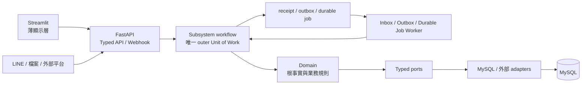

# 新竹市月子照顧服務人員職業工會－行政流程系統

此專案提供 LINE 整合、案件與月嫂排班、訂單生命週期、客戶帳務、薪資、月嫂應付、
銀行流水匯入與政府補助的地端行政系統。管理端是 Streamlit；正式業務操作透過 FastAPI、
application workflow 與 MySQL 完成。

目前的開發主線是「架構重整」：系統以 `Global → Domain → Subsystem → Module` 分層，
並以明確的根事實、typed command、Preview／Apply、outer Unit of Work、receipt 與 outbox
維持可重播、可稽核的業務操作。版本與驗收狀態以 Git、release manifest 及架構文件內的
evidence 為準；不要以本 README 的文字代替實際驗收。

## 給開發者與 Agent 的開始方式

1. 先讀 [`AGENTS.md`](AGENTS.md)：工作區、dirty worktree、測試與 Git 規則。
2. 讀 [`document/架構重整/00_開發者與Agent導覽.md`](document/架構重整/00_開發者與Agent導覽.md)：程式定位與修改邊界。
3. 讀 [`00_Global_共同契約.md`](document/架構重整/01_規格基線/00_Global_共同契約.md) 與對應 Domain 規格。
4. 查閱對應 Work Package／evidence，再檢查 live schema、route、workflow、repository 與測試是否有漂移。

`system_map*.md`、`system_map*.yaml`、ADAD 記錄與歷史文件僅供追溯，**不是** SSOT、授權或實作 gate。

## 架構速覽


```mermaid
flowchart LR
  UI["Streamlit\n薄顯示層"] --> API["FastAPI\nTyped API / Webhook"]
  INPUT["LINE / 檔案 / 外部平台"] --> API
  API --> APP["Subsystem workflow\n唯一 outer Unit of Work"]
  WORKER["Inbox / Outbox / Durable Job Worker"] --> APP
  APP --> DOMAIN["Domain\n根事實與業務規則"]
  DOMAIN --> PORT["Typed ports"] --> INFRA["MySQL / 外部 adapters"]
  INFRA --> DB[(MySQL)]
  APP --> RECEIPT["receipt / outbox / durable job"] --> WORKER
```

核心規則：

- Query 唯讀；Preview 零寫入；Apply 重新讀取最新鎖定的根事實後才提交。
- 一個業務命令只有一個 outer Unit of Work owner；repository 與 adapter 不可自行 commit。
- 同一命令以 correlation、fingerprint、idempotency 與 receipt 支援安全重播。
- UI、route、webhook、file watcher 與外部平台不得直接改寫 Domain 根事實。
- 外部副作用只可由已提交的 outbox、inbox 或 durable job worker 執行。

## 專案地圖

```text
api/                 FastAPI routes、dependencies、Pydantic schemas
ui/                  Streamlit 頁面與 typed API clients；不放業務規則
domains/             Domain 根事實、狀態機與 business rules
subsystems/          Preview／Apply workflow、跨 Domain 協調、query models、workers
infrastructure/      MySQL 與外部 provider 的 typed-port 實作
shared_kernel/       共用 command、durable job、typed error 等 Global primitives
db/schema_parts/     依序套用的 additive schema parts
db/migration_releases/  release manifest 與 migration descriptors
scripts/             匯入、migration、維運與 worker 入口
line/                LINE adapter、Webhook 和執行程序
tests/               Module、Subsystem、Domain、Global 層級驗證
fixtures/            僅供測試的版本化快照，禁止任意刪除或套用至正式資料
document/架構重整/  正式規格、決策／退役記錄、追蹤清單與 evidence
```

### Domain 對照

| Domain | 主要位置 | 責任摘要 |
|---|---|---|
| Orders | `domains/orders/`、`subsystems/orders/` | 條款、服務開始／完成、取消、reopen 與 lifecycle |
| Assignments／Scheduling | `domains/scheduling/`、`subsystems/scheduling/` | assignment generation、服務日、檔期、請假與代班 |
| Payroll | `domains/payroll/`、`subsystems/payroll/` | assignment-owned 薪資義務與調整 |
| Client Finance | `domains/client_finance/`、`subsystems/client_finance/` | 客戶應收、收款、退款、沖正、調整與核銷 |
| Staff Payables | `domains/staff_payables/`、`subsystems/staff_payables/` | 月嫂應付、出款與退匯／沖正 |
| Finance Import | `domains/finance_import/`、`subsystems/finance_import/` | 銀行來源事實、分類與委派至 owning Domain |
| Government Subsidy | `domains/government_subsidy/`、`subsystems/government_subsidy/` | 補助申請、核准、撥款、allocation 與 reversal |
| Anomalies | `domains/anomalies/`、`subsystems/anomalies/` | 異常 projection、告警與人工處理進度 |
| Case Import | `domains/case_import/`、`subsystems/case_import/` | BeClass／HCM 驗證、review 與 case bootstrap |
| Access／LINE／Jobs | `subsystems/access/`、`subsystems/line/`、`subsystems/jobs/` | 管理權限、webhook／delivery、durable worker |

完整 ownership、SSOT、狀態機與跨域不變量請以
[`15_正式規格索引與裁決總表.md`](document/架構重整/01_規格基線/15_正式規格索引與裁決總表.md)
及各 Domain 規格為準。

## 本機開發

### 必要設定

建立本機 `.env`（已被 Git 忽略）。至少設定：

```env
APP_ENV=development
ENABLE_ADMIN_AUTH=false
INTERNAL_API_KEY=<本機專用的長隨機字串>
```

`ENABLE_ADMIN_AUTH=false` 只適用於 development／dev／local／test；`INTERNAL_API_KEY` 仍會驗證。
production 必須啟用管理員 session，且不得將 `.env`、token、私鑰或正式資料提交至 Git。

### 啟動服務

先確認 Docker 與 MySQL 狀態，再視需求分別啟動服務：

```powershell
docker compose up -d

# FastAPI
.\.venv\Scripts\python.exe -m uvicorn api.main:app --reload

# Streamlit
.\.venv\Scripts\python.exe -m streamlit run ui/app.py

# Durable Job Worker
.\.venv\Scripts\python.exe scripts/run_durable_job_worker.py
```

[`online.bat`](online.bat) 是上線啟動入口：它會啟動 MySQL、API、Streamlit、檔案監控與互動式
Durable Job Worker，但**不會**自動套用資料庫 schema。正式 24/7 部署使用 Windows Task Scheduler
監督 worker：

```powershell
.\scripts\install_durable_job_worker_task.ps1 -StartNow
.\scripts\get_durable_job_worker_task_status.ps1
```

## 資料庫與資料安全

- Schema 調整先新增 `db/schema_parts/`，再同步 `db/schema.sql` 與對應的 migration release metadata。
- 保留資料升級、cutover、回復與目標主機操作必須依 Work Package／runbook 執行，不可自行套用 migration。
- `online.bat` 不初始化、不重建也不假資料化正式資料庫。
- `fixtures/db_snapshot_v2/v3` 是測試快照；只能在隔離的測試／本機資料庫流程使用，禁止自行刪除、整理或用於正式資料庫。
- 銀行檔、LINE webhook、BeClass／HCM 與其他外部輸入先進 inbox／import workflow，再由 owning Domain 寫入正式事實。

## 驗證

使用專案虛擬環境；先跑受影響範圍，再依 Module → Subsystem → Domain → Global 擴大：

```powershell
# 單一測試檔
.\.venv\Scripts\python.exe -m pytest tests/test_order_auto_completion_workflow.py

# 指定測試案例
.\.venv\Scripts\python.exe -m pytest tests/test_order_auto_completion_workflow.py -k stale

# 提交前格式檢查
git diff --check
```

需要 MySQL 的 integration／E2E 測試只能使用明確設定的 disposable 資料庫；不要將測試、candidate、
fixture 或 production database 混用。

## 文件導航與權威順序

1. 人工最新明確裁決。
2. [`document/架構重整/01_規格基線/`](document/架構重整/01_規格基線/) 中已確認的正式規格與裁決。
3. 既有業務規格、狀態機與欄位權威文件，作為追溯來源。
4. live schema、production code、API、SQL writer 與 production caller，作為現況證據。
5. [`02_決策與退役執行記錄/`](document/架構重整/02_決策與退役執行記錄/) 的 Work Package／驗收記錄與 [`03_追蹤清單與證據/`](document/架構重整/03_追蹤清單與證據/) 的 evidence，需依各自 declared status 解讀。

規格與現況不一致時，必須明確揭露漂移；不得以程式目前能執行為由覆蓋已確認的業務語意。

## 協作與交付

- 開始前讀取 branch、HEAD、status 與相鄰檔案；現有未提交變更屬於使用者成果。
- 只修改本次任務直接需要的檔案；不要 reset、clean、stash、切換分支或順便重構。
- 以名稱、型別、短函式與 guard clause 表達意圖；Streamlit 永遠是可替換的薄顯示層。
- 修改 API、資料模型、業務規則、migration 或外部副作用時，同步更新相應的規格、決策或 evidence 索引。
- 未經明確要求，不得自行 stage、commit、push 或建立 PR。
