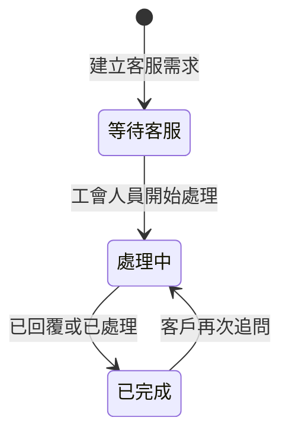

# LINE「服務說明」規則書

本文件定義一般用戶點擊 LINE 下方選單「服務說明」後，系統應如何回覆、如何建立客服需求，以及工會人員後台應如何處理。此規則書作為後續開發、測試與營運交接的共同依據。

---

## 1. 功能定位

「服務說明」是一般用戶進入工會服務諮詢的入口，目的不是立即指定專人，而是先讓用戶清楚選擇需求類型，系統再依需求自動回覆、建立客服紀錄，或交由工會人員接續處理。

此功能服務對象為：

1. 尚未登記的新客戶。
2. 已完成服務登記但尚未確認案件的客戶。
3. 已有案件編號、想了解進度或修改資料的客戶。
4. 想詢問收費、補助、媒合流程或其他服務內容的一般用戶。

---

## 2. LINE 選單行為

一般用戶選單包含兩個按鈕：

| 按鈕名稱 | 點擊後動作 | 用途 |
| --- | --- | --- |
| 服務登記 | 開啟服務登記入口 | 讓客戶選擇「已填過資料，要綁定帳號」或「我是新客戶，要填寫服務登記」 |
| 服務說明 | 發送文字「服務說明」 | 顯示服務說明選項，讓客戶選擇需要的協助 |

「服務說明」不得直接跳轉到尚未完成的頁面，也不得只回覆單一句「請等待專員」。系統必須提供可辨識的下一步選項。

---

## 3. 服務說明回覆內容

當用戶送出「服務說明」時，系統應回覆下列內容：

```text
您好，請選擇您想了解或需要協助的項目：

1. 服務流程
2. 收費與補助
3. 查詢服務進度
4. 修改登記資料
5. 聯絡工會人員
6. 其他問題

請直接回覆項目名稱，例如：服務流程、收費與補助。
```

此處應使用 LINE 訊息內的按鈕卡片，讓用戶直接點選分類。若用戶端版本不支援按鈕或按鈕消失，仍可手動輸入上述項目名稱或輸入 1 到 6。

---

## 4. 問題分類規則

系統收到「服務說明」後，必須回覆以下六個訊息內分類按鈕。用戶點選按鈕後，LINE 會送出對應文字，系統再依該文字進行後續處理。不得只使用容易和下方選單混淆的文字提示。

| 按鈕文字 | 送出的文字 | 後續處理 |
| --- | --- | --- |
| 服務流程 | 服務流程 | 自動回覆服務流程說明 |
| 收費與補助 | 收費與補助 | 自動回覆收費與補助說明，必要時建立可追蹤紀錄 |
| 查詢進度 | 查詢服務進度 | 若已綁定客戶，回覆案件摘要；若未綁定，引導至服務登記 |
| 修改資料 | 修改登記資料 | 建立客服需求，等待工會人員處理 |
| 聯絡工會 | 聯絡工會人員 | 建立客服需求，提示服務時間 |
| 其他問題 | 其他問題 | 建立客服需求，請用戶補充問題內容 |

為了避免按鈕消失後無法操作，系統也必須接受使用者手動輸入下列文字，並接受數字 1 到 6。

| 類型 | 可接受文字 | 系統處理 |
| --- | --- | --- |
| 服務流程 | 服務流程、流程、怎麼申請、如何登記、怎麼媒合 | 自動回覆服務流程說明 |
| 收費與補助 | 收費、費用、價格、補助、政府補助、要付多少 | 自動回覆收費與補助說明，並建立可追蹤紀錄 |
| 查詢服務進度 | 查詢進度、服務進度、案件進度、訂單進度、目前狀態 | 若已綁定客戶，回覆案件摘要；若未綁定，引導至服務登記 |
| 修改登記資料 | 修改資料、改資料、電話錯誤、地址錯誤、日期要改 | 建立客服需求，等待工會人員處理 |
| 聯絡工會人員 | 聯絡工會、找人、找專員、人工客服、我要問人 | 建立客服需求，提示服務時間 |
| 其他問題 | 其他、不是以上、問題、詢問 | 建立客服需求，請用戶補充問題內容 |

若用戶輸入無法判斷，系統應再次顯示服務說明選項，不得直接忽略。

---

## 5. 自動回覆規則

### 5.1 服務流程

回覆重點：

1. 客戶先完成服務登記。
2. 工會人員確認資料與服務期程。
3. 系統篩選期程符合的月嫂。
4. 月嫂同意接案後，工會提供月嫂資料給客戶確認。
5. 客戶確認後進入後續媒合與簽約流程。

建議回覆：

```text
服務流程如下：

1. 先完成服務登記。
2. 工會確認您的資料與服務期程。
3. 系統篩選可配合的月嫂。
4. 月嫂同意接案後，工會提供月嫂資料給您確認。
5. 雙方確認後，進入後續媒合與簽約流程。

如您尚未登記，請點選下方「服務登記」。
```

### 5.2 收費與補助

回覆重點：

1. 收費會依服務天數、每日時數、身分資格與樓層費計算。
2. 補助資格需由工會依資料確認。
3. 未完成資料確認前，不提供最終金額承諾。

建議回覆：

```text
收費會依服務天數、每日時數、身分資格與樓層費計算。

補助資格需由工會依您的登記資料確認；在資料確認完成前，系統僅能提供初步說明，實際金額以工會確認結果為準。

如您尚未登記，請先點選「服務登記」完成資料填寫。
```

### 5.3 查詢服務進度

處理規則：

1. 若 LINE 帳號已綁定客戶，系統回覆最新案件摘要。
2. 若已有多筆案件，優先顯示最新一筆進行中案件。
3. 若尚未綁定，提示用戶點選「服務登記」完成綁定或登記。

未綁定時建議回覆：

```text
目前尚未找到您綁定的服務資料。

若您已填過資料，請點選「服務登記」後選擇「已填過資料，要綁定帳號」。
若您是新客戶，請選擇「我是新客戶，要填寫服務登記」。
```

### 5.4 修改登記資料

此類型不得由系統直接覆蓋客戶資料，必須建立客服需求，交由工會人員確認後處理。

建議回覆：

```text
已收到您的修改資料需求。

請回覆您想修改的內容，例如：服務日期、服務地址、聯絡電話或其他資料。工會人員確認後會協助處理。
```

### 5.5 聯絡工會人員

此類型必須建立客服需求，狀態為「等待客服」。

建議回覆：

```text
已收到您的聯絡需求，工會人員將盡快回覆。

服務時間：週一至週五 09:00-18:00。
若目前非服務時間，我們將於上班後回覆。
```

### 5.6 其他問題

建議回覆：

```text
請簡單描述您想詢問的問題，工會人員會依內容協助您。
```

---

## 6. 建立客服需求規則

下列情況必須建立客服需求：

1. 用戶選擇「修改登記資料」。
2. 用戶選擇「聯絡工會人員」。
3. 用戶選擇「其他問題」並補充內容。
4. 用戶詢問收費或補助，但系統無法依現有資料給出明確說明。
5. 用戶查詢服務進度，但資料異常或無法判斷案件。
6. 用戶連續兩次輸入無法辨識的問題。

客服需求至少需保存：

| 欄位 | 說明 |
| --- | --- |
| 來源 LINE userId | 用於回覆客戶 |
| 客戶資料 | 若已綁定，帶入客戶姓名、電話與客戶編號 |
| 案件編號 | 若已綁定案件，帶入案件編號 |
| 問題類型 | 服務流程、收費與補助、查詢服務進度、修改登記資料、聯絡工會人員、其他問題 |
| 問題內容 | 用戶實際輸入內容 |
| 處理狀態 | 等待客服、處理中、已完成 |
| 內部備註 | 工會人員處理紀錄 |
| 建立時間 | 系統自動記錄 |
| 更新時間 | 系統自動記錄 |

---

## 7. 客服管理中心規則

客服管理中心是工會人員使用的內部介面，不顯示給一般 LINE 用戶。

介面至少需包含：

1. 客服需求列表。
2. 狀態篩選：等待客服、處理中、已完成。
3. 問題類型篩選。
4. 客戶姓名、電話、LINE userId 與案件編號。
5. 客戶最近一筆案件摘要。
6. 用戶原始訊息。
7. 內部備註。
8. 回覆客戶的訊息輸入框。
9. 送出 LINE 回覆按鈕。
10. 完成處理按鈕。

客服管理中心不得以「開發測試」或「模擬」文字呈現，應使用正式營運語言。

---

## 8. 狀態流程



狀態定義：

| 狀態 | 意義 |
| --- | --- |
| 等待客服 | 系統已收到需求，尚未由工會人員處理 |
| 處理中 | 工會人員已開始查看或回覆 |
| 已完成 | 本次需求已回覆或處理完畢 |

---

## 9. 服務時間規則

預設服務時間：

```text
週一至週五 09:00-18:00
時區：Asia/Taipei
```

服務時間內建立客服需求時，回覆：

```text
已收到您的訊息，客服人員將盡快回覆。
```

非服務時間建立客服需求時，回覆：

```text
目前非服務時間，我們將於上班後回覆。
```

---

## 10. 防呆與限制

1. 「服務說明」不得更改客戶、訂單、月嫂或帳務資料。
2. 修改資料需求必須經工會人員確認，不得由用戶聊天訊息直接覆蓋正式資料。
3. 收費與補助回覆不得承諾最終金額，最終結果以工會確認為準。
4. 未綁定 LINE 帳號的用戶，不得顯示他人的案件資料。
5. 若用戶同一時間已有未完成客服需求，系統應優先延續原需求，不重複建立多筆相同需求。
6. 工會人員回覆客戶時，需保留操作紀錄。

---

## 11. 後續開發驗收標準

完成「服務說明」功能時，至少需通過以下測試：

1. 一般用戶點擊「服務說明」後，LINE 回覆六個服務選項。
2. 回覆「服務流程」時，系統自動回覆流程說明。
3. 回覆「收費與補助」時，系統自動回覆收費與補助說明。
4. 未綁定用戶回覆「查詢服務進度」時，系統引導至「服務登記」。
5. 已綁定用戶回覆「查詢服務進度」時，系統回覆自己的案件摘要。
6. 回覆「修改登記資料」時，系統建立客服需求。
7. 回覆「聯絡工會人員」時，系統建立客服需求。
8. 工會人員可在客服管理中心看到新需求。
9. 工會人員可從客服管理中心回覆 LINE 用戶。
10. 工會人員可將客服需求標示為已完成。

---

## 12. 第一階段實作範圍

第一階段完成最小可用版本：

1. LINE 收到「服務說明」後回覆六個選項。
2. 建立「修改登記資料」、「聯絡工會人員」、「其他問題」三種客服需求。
3. 在工會後台新增「客服管理中心」頁面。
4. 工會人員可查看、備註、回覆與完成客服需求。
5. 已綁定客戶可查詢自己的最新案件摘要。

第二階段再補上：

1. 自動判斷更多自然語句的問題分類。
2. 客服需求指派給指定工會人員。
3. 常用回覆模板。
4. 客服處理統計報表。
5. 客服對話完整歷史紀錄。
