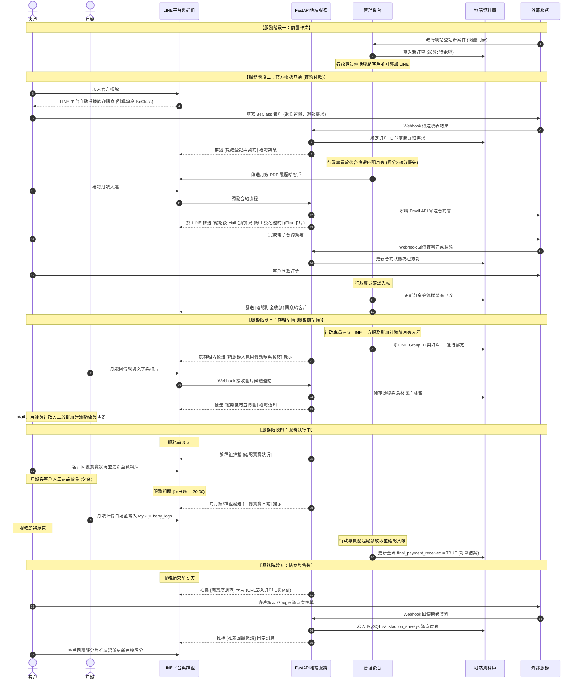

# LINE 平台與客服系統 

本文件基於 [[自動化系統設計規格書(總覽)]] 的規劃，針對 **LINE 平台與客服系統** 的功能細節、API 規格、對話流、Rich Menu 佈局與 RAG 檢索邏輯進行詳細定義。

---

## 1. 月子媒合服務流程詳細描述

本節詳述使用者在月子媒合服務生命週期中，各個階段在 LINE 平台與相關系統上的業務流程，並特別標記出需要串接外部資料與資料庫的關鍵節點。

### 一、 服務階段一：前置作業 (地端與人工)
1.  **資料庫自動同步**：
    地端的 Data Pipeline 或自動化爬蟲定期偵測政府官方登記網站。當確認有新登記的客戶訂單時，系統自動將資料解析並同步更新至地端 MySQL 資料庫。
    *   🏷️ **[資料庫寫入]** `MySQL: orders` (建立新登記訂單，狀態設為待電聯)
    *   🏷️ **[外部資料串接]** `政府官方登記網站 ➔ 爬蟲解析`
2.  **人工聯絡與引導**：
    公會行政專員由後台取得新訂單資料後，主動以電話聯絡客戶進行初步需求核對，確認基本狀況，並指引客戶搜尋或掃碼加入公會的 **LINE 官方帳號**。
    *   🏷️ **[資料庫讀取]** `MySQL: orders` (提取新登記客戶的電話與需求明細)

### 二、 服務階段二：官方帳號互動 (簽約與付款)
3.  **歡迎與填表引導**：
    客戶添加官方帳號（或解除封鎖）後，由 LINE 平台自動推播已在官方帳號後台設定好的歡迎訊息 (Greeting Message)，此步驟不需經由地端 API 呼叫發送。
    *   **BeClass 表單填寫引導**：歡迎訊息將引導客戶線上填寫 BeClass 表單，以確認飲食習慣、詳細訂單資料與週報需求。
    *   *註：表單跳轉入口目前規劃雙方案（方案 A：直接內嵌於歡迎文字訊息中；方案 B：設計在 Rich Menu 的常駐按鈕中），規格設計上均予保留。*
    *   🏷️ **[外部資料串接]** `BeClass API / Webhook` (客戶送出表單後，系統將資料解析並回填)
    *   🏷️ **[資料庫更新]** `MySQL: orders` (串接 BeClass 表單更新詳細需求、建立週報配置與飲食習慣)
4.  **媒合簽約與收款流程**：
    *   **資料確認**：系統發送 `[提醒登記, 契約]` 固定訊息，與客戶進行前置資料核對。
        *   🏷️ **[資料庫讀取]** `MySQL: orders` (提取客戶訂單 ID、登記資訊與姓名進行對話驗證)
    *   **履歷傳送**：管理者從後台篩選並傳送符合條件的月嫂資料（以 PDF 履歷檔案形式發送至客戶 LINE 視窗）。
        *   🏷️ **[資料庫讀取]** `MySQL: workers` (讀取匹配成功的月嫂基本資料、評分與履歷 PDF 檔案路徑)
    *   **合約發送**：客戶確認人選後，系統自動發送 `[確認後 mail 合約]` 固定訊息，並由系統自動將合約書寄至客戶的 Email 信箱。
        *   🏷️ **[資料庫讀取]** `MySQL: orders, workers` (讀取客戶的 Email、月嫂名稱及報價條件以生成合約)
        *   🏷️ **[外部資料串接]** `Email 發送服務 API`
    *   **線上簽約**：系統發送 `[線上簽名邀約]` 固定訊息，引導客戶完成線上合約簽署。
        *   🏷️ **[外部資料串接]** `電子簽章系統 API` (監聽合約簽署狀態，如已簽署則自動回傳)
        *   🏷️ **[資料庫更新]** `MySQL: orders` (更新合約簽署狀態為 `已簽訂`)
    *   **訂金收款**：客戶匯款後，系統在確認款項入帳後，發送 `[確認訂金收款]` 固定訊息給客戶，完成簽約對接。
        *   🏷️ **[資料庫更新]** `MySQL: orders` (更新金流狀態 `deposit_received = TRUE`)

### 三、 服務階段三：群組準備 (服務前準備)
5.  **月嫂入群**：
    公會行政專員建立「客戶、月嫂、公會三方專屬 LINE 服務群組」，並協助將媒合成功的月嫂邀請入群。
    *   🏷️ **[資料庫更新]** `MySQL: orders` (綁定此案件的 **LINE Group ID**，作為群組自動推播的唯一識別)
6.  **環境與食材調查**：
    月嫂加入群組後，系統自動在群組發送 `[請服務人員回傳動線與食材]` 固定訊息。
7.  **食材確認與討論**：
    月嫂依照指示，上傳家中的廚工作動線照片及食材準備照片，並發送 `[確認食材並傳圖]` 通知；三方於群組中進行人工討論，確認動線及實際服務時間。
    *   🏷️ **[資料庫寫入]** `MySQL: project_files / project_preparations` (儲存月嫂上傳的動線照片與食材圖片的 LINE 雲端媒體連結)

### 四、 服務階段四：服務執行中 (服務期間)
8.  **寶寶狀況確認 (服務前 3 天)**：
    在正式服務開始前 3 天，系統自動於群組推播 `[確認寶寶狀況]` 固定訊息，詢問新生兒出院及身體狀況。
    *   🏷️ **[資料庫寫入]** `MySQL: orders` (寫入或更新新生兒出院日與身體狀況備註)
9.  **餐食與日誌追蹤 (服務期間)**：
    *   月嫂與客戶人工討論每日月子餐食（夕食）調配。
    *   服務期間內，月嫂每日需依指示發送 `[上傳寶寶日誌]` 固定訊息，回報嬰兒照顧日誌。
        *   🏷️ **[資料庫寫入]** `MySQL: baby_logs` (每日儲存月嫂填報的寶寶大小便、飲食量、睡眠等照顧日誌數據)
10. **收取尾款**：
    服務即將結尾時，由系統或管理端發起通知，引導客戶支付服務尾款，並確認收款完成。
    *   🏷️ **[資料庫更新]** `MySQL: orders` (更新金流狀態 `final_payment_received = TRUE`，將訂單狀態更新為已結案)

### 五、 服務階段五：結案與售後 (結案階段)
11. **滿意度調查 (結案前 5 天)**：
    在服務結束前 5 天，系統自動推播 `[滿意度調查]` 固定訊息，引導客戶填寫 Google 滿意度問卷。
    *   *註：為簡化填寫流程，系統發送問卷連結時，需自動在 URL 參數中帶入該案的 **訂單 ID** 與客戶 **Mail**，實現免填登入。*
    *   🏷️ **[資料庫讀取]** `MySQL: orders` (提取該案的 **訂單 ID** 與客戶 **Mail** 以自動拼裝問卷網址)
    *   🏷️ **[外部資料串接]** `Google 表單 Webhook / Data Pipeline` (監聽客戶完成問卷事件，自動將滿意度內容寫回)
    *   🏷️ **[資料庫寫入]** `MySQL: satisfaction_surveys` (寫入滿意度問卷結果)
12. **推薦與回饋**：
    系統推播 `[推薦回饋邀請]` 固定訊息，引導客戶為月嫂填寫評分，並徵詢是否願意公開推薦。
    *   🏷️ **[資料庫更新]** `MySQL: workers / ratings` (更新該月嫂的平均評分與客戶推薦語，作為後續優先媒合的依據)

---

## 2. LINE 自動化流程需求與狀態追蹤表

本表用於追蹤月子媒合服務生命週期中，各項自動固定訊息與手動/後台動作的開發與技術實作進度，並將其與 **1. 月子媒合服務流程詳細描述** 中的各個服務階段與步驟進行規格上的嚴格連動對照。

### 2.1 自動固定訊息需求 (11項)

| 需求編號 | 需求名稱 | 觸發時機與機制 | 接收對象 | 優先級 | 對應流程步驟 | 備註與關聯模組 |
| :--- | :--- | :--- | :---: | :---: | :---: | :--- |
| **REQ-AUTO-001** | 加入好友歡迎訊息 | 使用者首次加 LINE 或解除封鎖時，由 LINE 平台自動推送。 | 客戶 | **高** | 服務階段二 第 3 步 | LINE 後台直接設定，不經由地端 API 呼叫 |
| **REQ-AUTO-002** | 提醒登記與契約通知 | 客戶填寫 BeClass 表單完成，經系統 Webhook 自動觸發。 | 客戶 | **高** | 服務階段二 第 3 步 | 用於核對基本需求，資料庫讀取驗證 |
| **REQ-AUTO-003** | 確認後 Mail 合約通知 | 管理端在後台確定月嫂並點擊發送合約時觸發。 | 客戶 | **高** | 服務階段二 第 4 步 | 連動 Email API (SendGrid) 發送實體合約書 |
| **REQ-AUTO-004** | 線上簽名邀約卡片 | 合約 Email 送出後，系統自動於 LINE 推送 Flex 卡片。 | 客戶 | **高** | 服務階段二 第 4 步 | 內嵌電子簽章網址，監聽簽署 Webhook 狀態 |
| **REQ-AUTO-005** | 確認訂金收款通知 | 行政專員於後台確認入帳並更新狀態時觸發。 | 客戶 | **高** | 服務階段二 第 4 步 | 更新訂單金流狀態為已收訂金 |
| **REQ-AUTO-006** | 回傳動線與食材提示 | 行政專員將月嫂加入服務群組後，系統自動於群組內推播。 | 服務群組 | **中** | 服務階段三 第 6 步 | 針對月嫂發送，引導其回報工作環境與食材 |
| **REQ-AUTO-007** | 確認食材並傳圖提醒 | 月嫂回覆環境文字後 (或服務前一週) 由系統自動推播。 | 服務群組 | **中** | 服務階段三 第 7 步 | 引導月嫂上傳食材照片，儲存照片連結 |
| **REQ-AUTO-008** | 確認寶寶狀況詢問 | 正式服務開始前 3 天早上 9:00 由系統定時推播。 | 服務群組 | **高** | 服務階段四 第 8 步 | 針對客戶發送，確認新生兒出院日與健康狀況 |
| **REQ-AUTO-009** | 上傳寶寶日誌提醒 | 服務期間內，每日晚上 20:00 由系統定時推播。 | 服務群組 | **中** | 服務階段四 第 9 步 | 針對月嫂發送，內含每日照顧日誌填報入口 |
| **REQ-AUTO-010** | 滿意度調查 Google 表單 | 服務結案前 5 天由系統定時推播。 | 客戶 | **高** | 服務階段五 第 11 步 | 自動在 URL 中帶入 **訂單 ID** 與 **Mail** 以免密登入 |
| **REQ-AUTO-011** | 推薦與回饋邀請 | 滿意度調查填寫完成後觸發，或服務結案當日定時發送。 | 客戶 | **低** | 服務階段五 第 12 步 | 引導客戶評分，回寫月嫂平均分數與推薦語 |

### 2.2 手動 / 後台動作需求 (10項)

| 需求編號 | 需求名稱 | 操作機制與功能描述 | 執行角色 | 優先級 | 對應流程步驟 | 備註與關聯模組 |
| :--- | :--- | :--- | :---: | :---: | :---: | :--- |
| **REQ-MAN-001** | 政府表單資料同步 | 地端爬蟲定時爬取政府登記網站，同步建立 MySQL 訂單。 | 系統 | **高** | 服務階段一 第 1 步 | 自動化爬蟲 / MySQL 資料庫 |
| **REQ-MAN-002** | 電話聯絡與引導加 LINE | 行政專員撥打電話核對需求，並引導客戶掃碼加入 LINE。 | 行政人員 | **高** | 服務階段一 第 2 步 | 客戶關係前置作業 |
| **REQ-MAN-003** | BeClass 客戶資料確認 | 檢視客戶填寫的需求資料是否齊全，進行後台建檔。 | 行政人員 | **高** | 服務階段二 第 3 步 | 後台管理 UI / MySQL |
| **REQ-MAN-004** | 篩選並傳送月嫂履歷 | 後台自動匹配符合條件月嫂，一鍵推播 PDF 履歷至 LINE。 | 行政人員 | **高** | 服務階段二 第 4 步 | 優先篩選評分 **9 分以上** 月嫂 |
| **REQ-MAN-005** | 月嫂加入三方服務群組 | 手動建立 LINE 服務群組，並將月嫂與客戶邀請入群。 | 行政人員 | **中** | 服務階段三 第 5 步 | 將群組 ID 與 MySQL 訂單進行綁定 |
| **REQ-MAN-006** | 群組人工討論動線食材 | 於群組內審查月嫂回傳之相片，並人工協調服務細節。 | 三方角色 | **中** | 服務階段三 第 7 步 | 人工確認動線及實際服務時間 |
| **REQ-MAN-007** | 月嫂餐食討論 | 於群組中商議月嫂每日月子餐食 (夕食) 的烹調細節。 | 客戶/月嫂 | **中** | 服務階段四 第 9 步 | 人工對話細節 |
| **REQ-MAN-008** | 收取尾款與確認結案 | 確認尾款入帳後更新後台訂單金流狀態，完成收款。 | 行政人員 | **高** | 服務階段四 第 10 步 | 更新資料庫 final_payment_received = TRUE |
| **REQ-MAN-009** | 例外人工客服處理 | 人工介入催款、休假請假協調、時程變更、車位協調等。 | 行政人員 | **高** | 非線性隨時觸發 | 後台客服流轉 / 4 大人工處理事項 |
| **REQ-MAN-010** | 媒合最終派案指派 | 同時意願詢問多位月嫂後，由專員老師決定最終指派人選。 | 指派老師 | **高** | 服務階段二 第 4 步 | 更新 MySQL 訂單中月嫂的關聯狀態 |

---

## 3. 端到端資料流與系統時序圖

本節以「月子媒合服務生命週期」為主軸，繪製客戶、月嫂、LINE平台與群組、FastAPI後端、後台管理端、地端資料庫與外部服務之間在各個服務階段的端到端資料傳遞與系統觸發時序圖：



---

## 4. LINE 官方帳號與 Rich Menu 配置設計(未定案)

常駐於官方帳號底部的 Rich Menu，寬度採預設的 `2500x1686` 像素（6 格版面），版面佈局規劃如下：

```
+------------------+------------------+------------------+
|                  |                  |                  |
|    A. 公會簡介   |   B. 常見問題    |   C. 托育登記    |
|   (引導對話 FAQ) |   (引導對話 FAQ) |   (外部政府連結) |
|                  |                  |                  |
+------------------+------------------+------------------+
|                  |                  |                  |
|    D. 繳費專區   |   E. 月嫂配對    |   F. 聯絡公會    |
|   (引導對話/表單) |   (引導對話/表單) |   (點擊撥號/聯絡) |
|                  |                  |                  |
+------------------+------------------+------------------+
```

### 4.1 區塊動作定義

| 區塊 | 名稱 | 觸發動作類型 | 具體執行內容 |
| :--- | :--- | :--- | :--- |
| **A** | **公會簡介** | `message` | 發送文字：`公會服務介紹` (觸發 RAG 標準回覆) |
| **B** | **常見問題** | `message` | 發送文字：`常見問題選單` (回覆常見分類訊息) |
| **C** | **托育登記** | `uri` | 開啟 LINE 內建瀏覽器，導向新竹市政府托育登記頁面：<br/> `https://hsinchu-nanny.hccg.gov.tw/` |
| **D** | **繳費專區** | `message` | 發送文字：`如何繳交會費` (觸發繳費引導流) |
| **E** | **月嫂配對** | `message` | 發送文字：`我想找月嫂` (引導填寫登記或填寫 BeClass 表單雙方案) |
| **F** | **聯絡公會** | `uri` | 撥打公會電話：`tel:035xxxxxxx` 或開啟官方地圖 |

---

## 5. FastAPI Webhook 與外部系統整合介面(未定案)

地端後端需暴露一條對外 API 接收 LINE 的 Webhook 事件。

### 5.1 服務端點
*   **Protocol**: HTTPS (Port 443 由 Nginx 做反向代理並配置 SSL)
*   **Path**: `/webhook`
*   **Method**: `POST`

### 5.2 安全防護 (X-Line-Signature 驗證)
每次收到 Webhook 請求時，FastAPI 必須：
1.  從 HTTP Header 中取得 `x-line-signature`
2.  使用 `LINE_CHANNEL_SECRET` 對 Request Body 計算 HMAC-SHA256 簽章。
3.  比對兩者是否一致。若不一致，回傳 `HTTP 400 Bad Request` 並阻擋連線。

### 5.3 異常與非文字訊息處理
*   **貼圖 (Sticker)**、**圖片 (Image)**、**語音 (Audio)**、**影片 (Video)**：
    *   系統不進行語意分析。
    *   預設回覆：「感謝您的訊息！若有公會業務相關問題，請直接輸入文字，或點擊下方選單進行查詢。如有緊急事宜，請直接來電公會。」

---

## 6. RAG 知識庫與 FAQ 例外人工客服流(未定案)

為防止 AI 幻覺，本專案採用 **基於相似度比對的嚴格 RAG FAQ 回覆機制**，不使用大型語言模型（LLM）進行隨機生成。

### 6.1 知識庫資料結構 (MySQL)
FAQ 知識庫存於 MySQL 中，結構如下：

```sql
CREATE TABLE faq_knowledge (
    id INT AUTO_INCREMENT PRIMARY KEY,
    category VARCHAR(50) NOT NULL,          -- 問題分類，例如：入會申請、繳費、福利互助
    standard_question TEXT NOT NULL,       -- 標準問題 (用於向量化與比對)
    standard_answer TEXT NOT NULL,         -- 標準答案 (回覆給使用者的文字)
    redirect_url VARCHAR(255),             -- 選擇性附加連結 (如申請書下載地址)
    created_at TIMESTAMP DEFAULT CURRENT_TIMESTAMP,
    updated_at TIMESTAMP DEFAULT CURRENT_TIMESTAMP ON UPDATE CURRENT_TIMESTAMP
);
```

### 6.2 向量資料庫與相似度計算 (ChromaDB)
*   **Embedding Model**: 採用地端輕量化模型 `sentence-transformers/all-MiniLM-L6-v2` (向量維度 384) 或是串接外部 API。
*   **向量更新機制**: 當管理員在 Streamlit 增刪改 `faq_knowledge` 時，系統自動觸發 Data Pipeline，將 `standard_question` 重新向量化並同步至 ChromaDB。
*   **相似度閾值 (Similarity Threshold)**:
    *   預設值為 `0.75` (Cos-Similarity)。
    *   **比對分數 >= 0.75**: 系統判定為「已命中標準問題」，取出資料庫中的 `standard_answer` 回覆。
    *   **比對分數 < 0.75**: 系統判定為「未命中」，回覆：「抱歉，我無法完全理解您的問題。以下是可能對您有幫助的常用資訊：[常見問題選單]；或您也可以輸入『聯絡專員』，我們將有專人為您服務。」

---

## 7. 安全防護與隱私規範

1.  **資料隱私**：LINE Webhook 接收到的所有使用者 `userId` 與對話紀錄，均不得傳輸至 any 未授權的第三方雲端分析平台（除了 Embedding API 呼叫，且 Embedding API 只傳送提問文字，不包含 `userId` 等個資）。
2.  **速率限制 (Rate Limiting)**：FastAPI 對單一 `userId` 設定限流，每分鐘限制最多 30 次請求，防範惡意刷訊息造成地端伺服器資源過載 or API 費用暴增。
3.  **錯誤嘗試紀錄**：低於相似度閥值的提問會記錄在 `unresolved_questions` 資料表中，供管理員於 Streamlit 後台定期檢視，以手動補齊 FAQ 知識庫。
