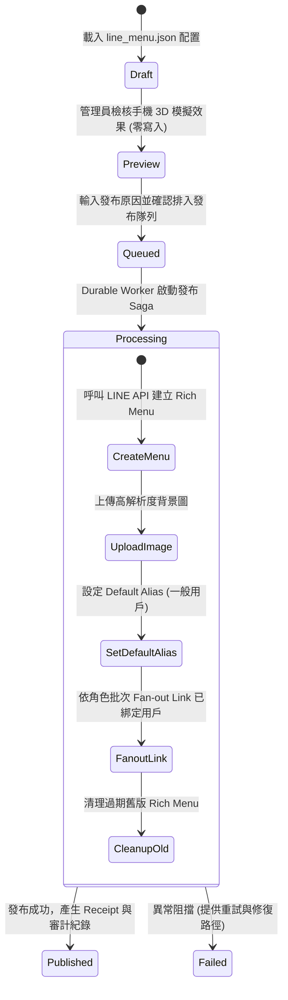

# 📱 LINE Rich Menu 多角色圖文選單與互動中心正式規範

## 一、 規格定位與核心目的

本文件為新竹市月子工會 LINE 官方帳號 **多角色圖文選單（Rich Menu）** 與 **前端視覺化管理中心** 之正式業務規格書。

由於管理員在後台 Web 端已具備「多角色圖文選單預覽工作室」，在手機 LINE 端無須透過複雜的頂部 Tab 別名（Alias Switch）反覆切換模擬其他身分。系統已精簡收斂為 **3 大乾淨、純粹的核心角色選單**：

1. 👥 **一般用戶 / 訪客選單 (`default_menu`)**
2. 👩‍🍼 **線上月嫂專屬選單 (`staff_menu`)**
3. 🛡️ **工會人員專屬管理選單 (`union_staff_menu`)**

---

## 二、 3 大核心角色選單規格與按鈕熱區清單

### 1. 👥 一般用戶 / 訪客選單 (`default_menu`)
* **適用角色**：尚未簽約之一般民眾、產婦新客、訪客。
* **版面規格**：`2500 x 1686` (4 格直覺版)。
* **預設屬性**：`set_as_default = true`。
* **底部聊天列文字 (`chat_bar_text`)**：`用戶選單`。

| 熱區位置 | 按鈕標題 | 動作類型 | 目標參數 / URI 路由 | 業務功能說明 |
| :--- | :--- | :--- | :--- | :--- |
| **左上 (1)** | 📝 **服務登記** | `URI (LIFF)` | `?entry=registration` | 開啟產婦 91 項照護需求、預產期與服務登記表單 |
| **右上 (2)** | ✏️ **修改登記資料** | `URI (LIFF)` | `?target=profile_update` | 修改預產期、服務地址、料理偏好等異動申請 |
| **左下 (3)** | 🔍 **服務說明** | `Message` | `"服務說明"` | 查詢新竹市月子補助折抵試算、常見 QA 知識庫 |
| **右下 (4)** | 💬 **專人客服諮詢** | `Message` | `"專人客服"` | 呼叫真人值班秘書協處或啟動 AI 智能助理服務 |

---

### 2. 👩‍🍼 線上月嫂專屬選單 (`staff_menu`)
* **適用角色**：通過工會審核認證之線上在職月嫂（已綁定 Staff Identity）。
* **版面規格**：`2500 x 1686` (4 格工作台)。
* **底部聊天列文字 (`chat_bar_text`)**：`月嫂專區`。

| 熱區位置 | 按鈕標題 | 動作類型 | 目標參數 / URI 路由 | 業務功能說明 |
| :--- | :--- | :--- | :--- | :--- |
| **左上 (1)** | 📦 **訂單查詢** | `URI (LIFF)` | `?target=staff_order_search` | 安全查閱【訂單資訊 -1/-2】產婦服務地址、熱炒備註與特殊產婦需求 |
| **右上 (2)** | 📅 **排班資訊** | `URI (LIFF)` | `?target=staff_schedule` | 查閱個人當月服務天數、7天 Buffer 鎖定期、公休日與代班案件 |
| **左下 (3)** | 🏖️ **請假代班申請** | `URI (LIFF)` | `?target=staff_leave_apply` | 提出病假/事假申請，觸發工會代班媒合與產婦順延確認流程 |
| **右下 (4)** | 💵 **薪資請款明細** | `URI (LIFF)` | `?target=staff_payout` | 查看各案完工結算金額、工時津貼核算與撥款進度明細 |

---

### 3. 🛡️ 工會人員專屬管理選單 (`union_staff_menu`)
* **適用角色**：工會秘書、理事長、督導人員與值班管理員。
* **版面規格**：`2500 x 1686` (4 格管理中心)。
* **底部聊天列文字 (`chat_bar_text`)**：`工會管理`。

| 熱區位置 | 按鈕標題 | 動作類型 | 目標參數 / URI 路由 | 業務功能說明 |
| :--- | :--- | :--- | :--- | :--- |
| **左上 (1)** | 📋 **待確認審核** | `URI (LIFF)` | `?target=staff_review` | 手機端一鍵審核月嫂認證、月嫂履歷資料、產婦異動申請與 Diff 比對 |
| **右上 (2)** | 🎧 **客服中心** | `URI (LIFF)` | `?target=customer_service` | 處理線上民眾即時諮詢、進件工單與 AI 轉真人接管 |
| **左下 (3)** | 🚨 **重大異常通報** | `URI (LIFF)` | `?target=anomalies_center` | 即時監控財務短溢繳、重複排班衝突與急件客訴 |
| **右下 (4)** | 📊 **即時營運看板** | `URI (LIFF)` | `?target=dashboard` | 查閱今日出勤月嫂數、待派單量與當日營運數據指標 |

---

## 三、 Rich Menu 異步發布與狀態機 (Durable Saga)

