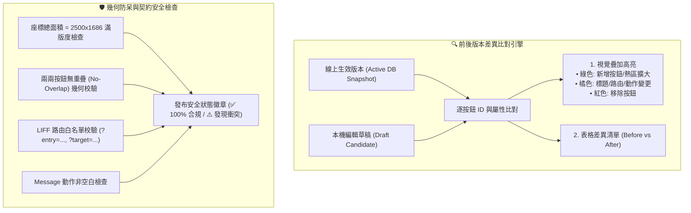

# 📱 LINE Rich Menu 本機視覺比對與互動模擬工作室正式規範

## 一、 規格定位與核心目的

本文件為新竹市月子工會 LINE 官方帳號 **Rich Menu 本機互動模擬器（Interactive Sandbox）與前後版本視覺比對（Visual Diff Engine）** 之正式規格書。

借鑑「AI 事件工作室」之純前端記憶體沙盒機制，讓工會管理員在發布圖文選單至 LINE 正式環境之前，能夠在後台達成以下 **4 大核心目標**：
1. **熱區點擊互動模擬**：直接在 3D 手機模擬器中點擊選單按鈕，模擬真實手機上的 LIFF 表單開啟、文字推播發送與機器人自動回覆。
2. **前後版本視覺與屬性比對（Visual & JSON Diff）**：即時比對「線上現行版本（Active DB Snapshot）」與「編輯中草稿（Draft）」，並在手機上高亮顯示變更熱區。
3. **幾何防呆與契約安全檢查（Geometry & Contract Guard）**：本機即時校驗熱區重疊（Overlap）、滿版尺寸（2500x1686）、LIFF 路由白名單與空值檢查，杜絕錯誤推播。
4. **多角色身分模擬沙盒（Audience Role Sandbox）**：一鍵切換預覽一般民眾、認證月嫂與工會幹部之不同視角。

---

## 二、 3 大核心角色選單之按鈕功能與互動模擬詳解

### 1. 👥 一般用戶 / 訪客選單 (`default_menu`)
* **適用對象**：一般民眾、產婦新客、尚未登入/綁定身分之訪客。
* **版面規格**：`2500 x 1686` (4 格直覺版)。
* **預設屬性**：`set_as_default = true`。
* **底部聊天列文字 (`chat_bar_text`)**：`用戶選單`。

```
+-----------------------------------+-----------------------------------+
| 📝 服務登記                       | ✏️ 修改登記資料                   |
| (URI: ?entry=registration)        | (URI: ?target=profile_update)     |
+-----------------------------------+-----------------------------------+
| 🔍 服務說明                       | 💬 專人客服諮詢                   |
| (Message: "服務說明")              | (Message: "專人客服")             |
+-----------------------------------+-----------------------------------+
```

#### 按鈕詳情與模擬效果：
1. **📝 服務登記 (`service_registration`)**
   * **動作類型**：`URI (LIFF)` ➔ `?entry=registration`
   * **業務功能**：提供新客線上登記 91 項產婦照護需求、預產期、地址、照護天數與料理偏好。
   * **手機模擬效果**：手機模擬器內滑出「產婦服務線上登記先行表單」，可預覽填寫產婦姓名、聯絡電話、預產期、服務地址（新竹市各區）、葷素藥膳需求等欄位。
2. **✏️ 修改登記資料 (`profile_update`)**
   * **動作類型**：`URI (LIFF)` ➔ `?target=profile_update`
   * **業務功能**：產婦已送出登記後，若遇預產期提早/延後、地址變更或天數增減，可透過此安全通道提出異動。
   * **手機模擬效果**：手機模擬器內彈出「客戶資料異動申請表」，展示原資料與修改欄位對比，送出後模擬產生 Diff 待審核狀態。
3. **🔍 服務說明 (`contact_staff`)**
   * **動作類型**：`Message` ➔ 發送文字 `"服務說明"`
   * **業務功能**：查詢新竹市月子補助折抵標準、服務工時規範與常見問題 QA。
   * **手機模擬效果**：手機對話視窗即時增加使用者訊息氣泡「服務說明」，小幫手自動回覆：「親愛的家長您好！新竹市到宅月子補助標準：自 115 年 1 月 1 日起，每日最高補助 4 小時、每戶最高上限 40 小時...」。
4. **💬 專人客服諮詢 (`help_desk`)**
   * **動作類型**：`Message` ➔ 發送文字 `"專人客服"`
   * **業務功能**：呼叫工會值班秘書與督導人員進行真人諮詢或急件處理。
   * **手機模擬效果**：手機對話視窗發送「專人客服」，小幫手回覆：「已為您通報工會值班秘書！秘書將於上班時間（週一至週五 09:00-18:00）透過此對話為您服務；若有緊急照護狀況請撥打工會專線。」

---

### 2. 👩‍🍼 線上月嫂專屬選單 (`staff_menu`)
* **適用對象**：通過工會審核認證之在職月嫂（已綁定月嫂身分）。
* **版面規格**：`2500 x 1686` (4 格月嫂工作台)。
* **底部聊天列文字 (`chat_bar_text`)**：`月嫂專區`。

```
+-----------------------------------+-----------------------------------+
| 📦 訂單查詢                       | 📅 排班資訊                       |
| (URI: ?target=staff_order_search) | (URI: ?target=staff_schedule)     |
+-----------------------------------+-----------------------------------+
| 🏖️ 請假代班申請                   | 💵 薪資請款明細                   |
| (URI: ?target=staff_leave_apply)  | (URI: ?target=staff_payout)       |
+-----------------------------------+-----------------------------------+
```

#### 按鈕詳情與模擬效果：
1. **📦 訂單查詢 (`order_query`)**
   * **動作類型**：`URI (LIFF)` ➔ `?target=staff_order_search`
   * **業務功能**：查閱個人承接之產婦服務案件細節，包括服務地址、特殊照護需求（雙胞胎/早產兒）、產婦料理禁忌與注意事項。
   * **手機模擬效果**：手機模擬器內彈出「月嫂訂單照護資訊工作台」，顯示【訂單資訊 -1/-2】案件摘要、產婦偏好與緊急聯絡電話。
2. **📅 排班資訊 (`schedule_query`)**
   * **動作類型**：`URI (LIFF)` ➔ `?target=staff_schedule`
   * **業務功能**：查閱個人當月與次月排班月曆、前後 7 天 Buffer 鎖定保護期、公休日與代班時程。
   * **手機模擬效果**：手機模擬器內彈出「服務排班日曆」，以顏色標註服務日（藍）、公休日（灰）、Buffer 緩衝期（橘）與代班日（紫）。
3. **🏖️ 請假代班申請 (`leave_apply`)**
   * **動作類型**：`URI (LIFF)` ➔ `?target=staff_leave_apply`
   * **業務功能**：提出病假/事假申請，啟動工會代班媒合或產婦服務順延簽核機制。
   * **手機模擬效果**：手機模擬器內彈出「請假代班申請單」，可選擇請假假別、起訖日期與順延/代班偏好。
4. **💵 薪資請款明細 (`payout_query`)**
   * **動作類型**：`URI (LIFF)` ➔ `?target=staff_payout`
   * **業務功能**：查閱歷史案件完工結算金額、工時津貼明細、代扣勞健保與工會撥款進度。
   * **手機模擬效果**：手機模擬器內彈出「薪資津貼明細表」，列出各期案件之完工時數、撥款狀態（已撥款 / 審核中）與入帳金額。

---

### 3. 🛡️ 工會人員專屬選單 (`union_staff_menu`)
* **適用對象**：工會秘書、理事長、督導人員與值班管理員。
* **版面規格**：`2500 x 1686` (4 格管理中心)。
* **底部聊天列文字 (`chat_bar_text`)**：`工會管理`。

```
+-----------------------------------+-----------------------------------+
| 📋 待確認審核                     | 🎧 客服中心                       |
| (URI: ?target=staff_review)       | (URI: ?target=customer_service)   |
+-----------------------------------+-----------------------------------+
| 🚨 重大異常通報                   | 📊 即時營運看板                   |
| (URI: ?target=anomalies_center)   | (URI: ?target=dashboard)          |
+-----------------------------------+-----------------------------------+
```

#### 按鈕詳情與模擬效果：
1. **📋 待確認審核 (`staff_review`)**
   * **動作類型**：`URI (LIFF)` ➔ `?target=staff_review`
   * **業務功能**：工會幹部在手機端審核月嫂證照認證（保母證/良民證/體檢表）、產婦資料變更申請與月嫂請假代班指派。
   * **手機模擬效果**：手機模擬器內彈出「行動審核中心」，顯示待審核案件清單，提供「一鍵核准」與「退回補件」按鈕與 Diff 比對檢視。
2. **🎧 客服中心 (`customer_service`)**
   * **動作類型**：`URI (LIFF)` ➔ `?target=customer_service`
   * **業務功能**：即時查看民眾線上進件提問、AI 轉真人接管對話與指派客服工單。
   * **手機模擬效果**：手機模擬器內彈出「行動客服工單中心」，列出待回覆對話與即時接管切換開關。
3. **🚨 重大異常通報 (`anomalies_center`)**
   * **動作類型**：`URI (LIFF)` ➔ `?target=anomalies_center`
   * **業務功能**：監控財務短溢繳（定金/尾款未入帳）、重複排班衝突（同一月嫂重疊）與急件客訴。
   * **手機模擬效果**：手機模擬器內彈出「異常警示面板」，展示紅/橘色警示卡片與快速調度處理按鈕。
4. **📊 即時營運看板 (`ops_dashboard`)**
   * **動作類型**：`URI (LIFF)` ➔ `?target=dashboard`
   * **業務功能**：查閱今日出勤月嫂數、進行中案件數、待派單量與當月市府補助核銷進度。
   * **手機模擬效果**：手機模擬器內彈出「當日營運看板」，以統計數字卡片展示今日派工、待配對與營運總額。

---

## 三、 視覺 Diff 比對與幾何安全檢核機制



---

## 四、 零副作用安全保證

1. **瀏覽器記憶體隔離**：所有按鈕點擊模擬、表單彈出、對話回覆與 Diff 比對，均在前端 React 本機記憶體（`useState`）中運行，**不產生任何後端資料庫寫入或真實 LINE 推播**。
2. **Durable Saga 發布規範**：僅在管理員主動於發布卡片輸入原因並按下「🚀 發布」時，才觸發後端正式發布流程。
