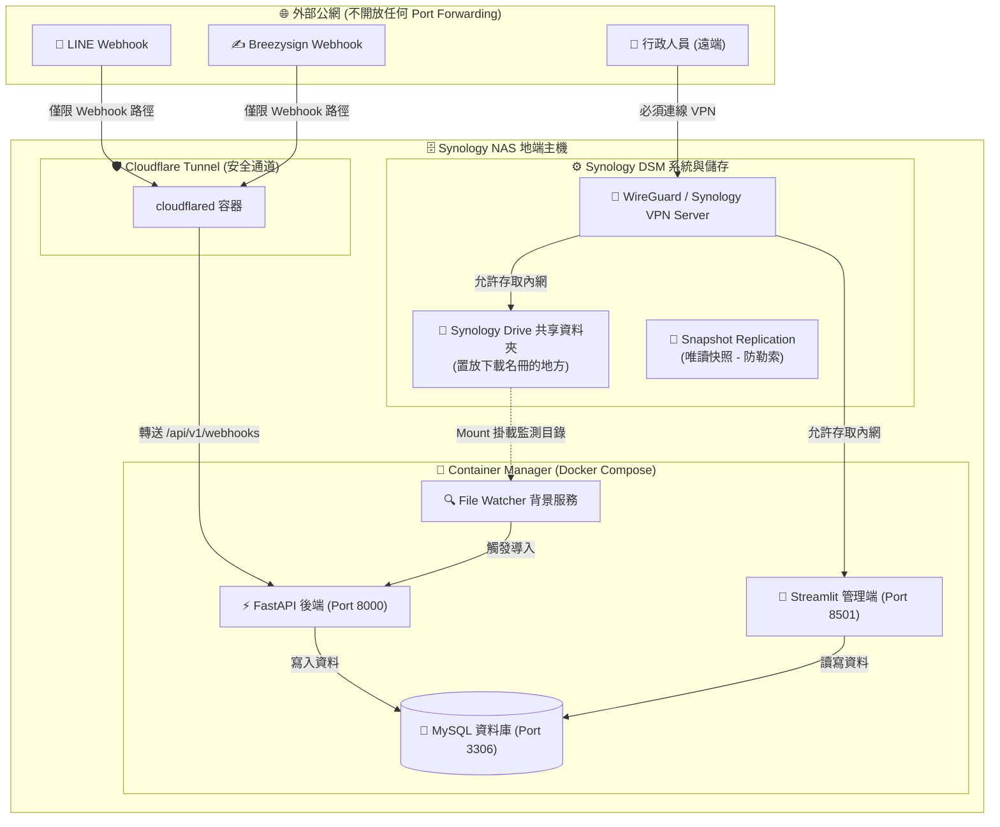

# Synology NAS 地端資安防護與部署建置指南

本指南針對工會未來規劃使用 **Synology NAS (DSM 系統)** 作為地端伺服器與 **Synology Drive** 進行檔案同步的架構，分析潛在的資安風險，並提供針對性的資安防護設定與 Docker 容器部署方案。

---

## 一、 Synology NAS 核心資安風險分析

Synology NAS 在台灣中小企業與工會非常普及，但也因此成為勒索軟體（如 DeadBolt、eCh0raix）與駭客暴力破解的熱門目標。常見的被駭途徑包括：

1. **直接暴露 DSM 管理埠 (5000/5001)**：
   * 許多單位為了方便遠端管理，在分享器上設定連接埠轉送 (Port Forwarding)，將 5000/5001 埠對外公開。駭客可透過掃描工具尋找 DSM 系統漏洞，或進行帳密暴力破解。
2. **直接暴露資料庫埠 (MySQL 3306)**：
   * 若將 MySQL 連接埠直接暴露於公網，極易遭受自動化腳本的 SQL 注入攻擊或字典破解。
3. **預設帳號與弱密碼**：
   * 未禁用預設的 `admin` 帳號，且未使用雙重驗證 (2FA)，導致帳號被輕易攻破。
4. **勒索軟體加密共享資料夾 (Ransomware)**：
   * 駭客一旦透過漏洞取得 DSM 系統權限或 SSH 權限，便會對所有共享資料夾（包含 Synology Drive 的同步資料夾）內的檔案進行加密勒索。

---

## 二、 系統部署架構設計 (Docker / Container Manager)

為了將專案的 FastAPI、Streamlit、MySQL 與 File Watcher 部署在 Synology NAS 上，同時確保檔案能透過 Synology Drive 同步，我們建議採用 **容器化隔離部署**：

### 部署機制說明
* **Synology Drive 與 File Watcher 串接**：
  行政人員從自己的電腦透過 Synology Drive 客戶端上傳 Excel 名冊至 NAS 的同步資料夾。該資料夾以唯讀或讀寫模式掛載 (Mount Volume) 至 Docker 的 `File Watcher` 容器中。當 Drive 完成同步時，容器內的 `watchdog` 立即偵測到變更並觸發導入。
* **容器隔離**：
  FastAPI、Streamlit 與 MySQL 均運行在獨立的 Docker 容器中，與 DSM 系統檔案完全隔離，即使應用程式有漏洞，駭客也無法輕易取得 NAS 系統 root 權限。

---

## 三、 資安硬防護：五大防禦策略

### 策略 1：零外部連接埠開放 (Zero Inbound Ports via Cloudflare Tunnel)
這是防範網路掃描與直接攻擊最有效的方法。**不要在分享器上做任何 Port Forwarding！**

*   **實作方式**：
    1. 在 Synology Container Manager 中部署 `cloudflare/cloudflared` 官方容器。
    2. 使用 **Cloudflare Tunnel (Cloudflare One)** 建立一條從 NAS 主機向外的安全通道，並將專屬域名指向該通道。
    3. **路徑精確限制 (URL Path Path Filtering)**：在 Cloudflare 後台設定，僅允許公網流量存取 Webhook 路由：
       * 允許：`https://your-domain.com/api/v1/webhooks/*` (供 LINE & Breezysign 回傳)
       * **阻擋所有其他路徑**（包含 `/docs`、`/api/v1/admin/*` 等）。
    4. **Streamlit UI 隱蔽**：Streamlit（頁面三）不要透過 Cloudflare 公開。行政人員必須使用工會內網 (LAN) 或透過 **WireGuard VPN** 連線後，才能在瀏覽器輸入 `http://<NAS_LAN_IP>:8501` 進行存取。

### 策略 2：唯讀快照防範勒索軟體 (Snapshot Replication)
防止駭客或惡意軟體將 NAS 資料加密。快照是系統底層的唯讀區塊複製，勒索軟體無法修改快照。

*   **實作方式**：
    1. 在 DSM 中安裝套件 **Snapshot Replication (快照與複製)**。
    2. 針對「Synology Drive 共享資料夾」與「Docker 數據資料夾」設定**每小時自動快照**。
    3. 保留策略設定：保留過去 24 小時的每小時快照，以及過去 14 天的每日快照。
    4. **優點**：一旦檔案被加密或誤刪，行政專員可在數秒內將資料夾還原至一小時前的狀態。

### 策略 3：帳戶防護與防禦暴力破解 (Account Hardening)
防範駭客嘗試用字典檔或流出密碼暴力登入 DSM 系統。

*   **實作方式**：
    1. **禁用預設管理員**：新增一個自訂名稱的管理員帳號，並徹底**停用/禁用預設的 `admin` 帳號**。
    2. **強制雙重驗證 (2FA)**：為所有管理員與行政人員帳號啟用 DSM 的雙重驗證 (可以使用 Synology Secure SignIn App 或 Google Authenticator)。
    3. **啟用自動封鎖 (Auto Block)**：
       * 路徑：`控制台 ➔ 安全性 ➔ 自動封鎖`。
       * 設定：若 IP 在 5 分鐘內登入失敗達 5 次，即永久封鎖該 IP。
    4. **啟用帳戶保護**：防範針對單一帳號的持續嘗試。

### 策略 4：關閉不必要的系統服務
減少暴露的攻擊面。

*   **實作方式**：
    1. **關閉 SSH 服務**（如非得使用，應修改預設 Port 22 為自訂隨機埠，且限制僅內網 IP 可連線）。
    2. **關閉 SFTP / FTP / TFTP** 等老舊且不安全的傳輸協定。
    3. **啟用 DSM 自帶防火牆**：設定僅允許台灣地區 IP 存取（若未用 Cloudflare Tunnel），並限制特定內網網段才能連線 DSM 管理頁面 (5001)。

### 策略 5：3-2-1 備份原則 (Hyper Backup)
確保在硬體損壞或發生災難時（如火災或整台 NAS 被盜），資料不遺失。

*   **實作方式**：
    1. 安裝 **Hyper Backup** 套件。
    2. 設定每日排程，將資料庫備份檔 (`.sql`) 與 Synology Drive 目錄進行**加密備份**。
    3. **備份目的地**：備份至另一個異地空間（如 Synology C2 雲端、Google Drive，或是辦公室內另一台獨立的 NAS/外接硬碟）。
    4. 啟用**版本控制與備份加密**，防止備份檔在傳輸或雲端儲存時外洩。

---

## 四、 Synology DSM 安全設定檢查清單 (Checklist)

行政人員或運維人員部署時，應逐一確認以下設定：

- [ ] **帳號安全**：已禁用預設 `admin`，且所有帳號皆強制啟用 2FA 雙重驗證。
- [ ] **連線埠安全**：路由器/分享器上**無**設定轉送 DSM 5000/5001、SSH 22、MySQL 3306 至外網。
- [ ] **安全通道**：對外 Webhook 連線僅經由 `cloudflared` (Cloudflare Tunnel) 安全穿透。
- [ ] **自動封鎖**：DSM 已啟用自動封鎖（5 分鐘內 5 次失敗則封鎖 IP）。
- [ ] **安全性諮詢**：已運行 DSM 的「安全性諮詢 (Security Advisor)」套件，且評估結果為「安全」。
- [ ] **快照設定**：已對放置名冊的資料夾與 Docker 資料夾設定每小時自動快照（快照保留天數 $\ge 14$ 天）。
- [ ] **異地備份**：Hyper Backup 已設定每日加密備份至異地雲端空間。
