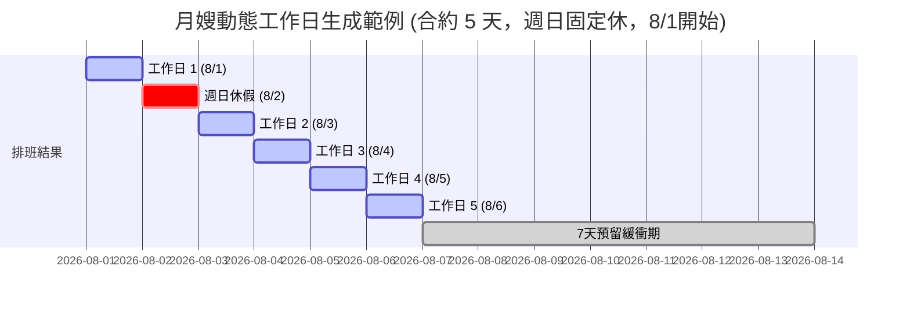
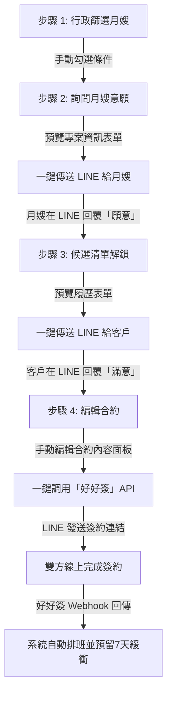
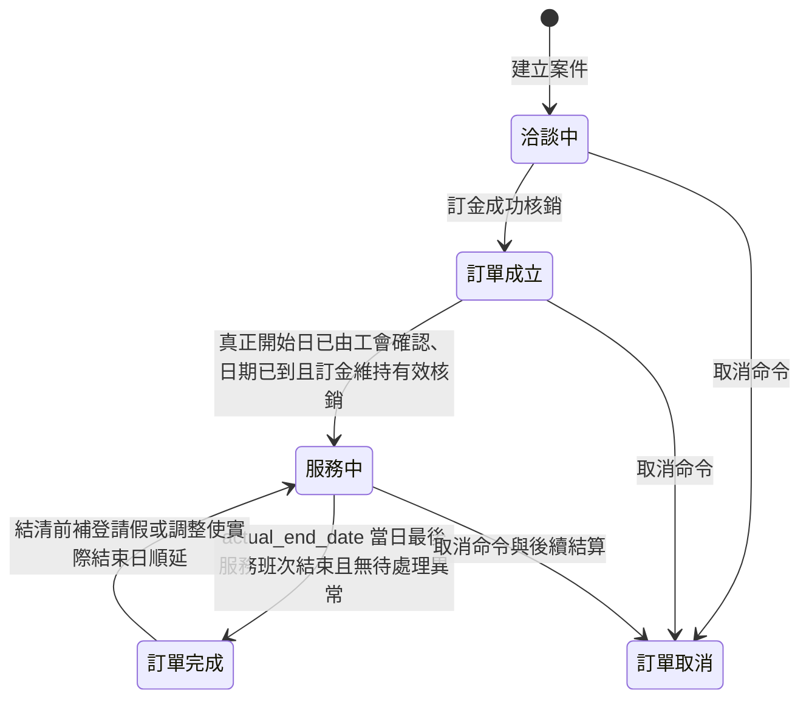

# 01_管理端UI與排班_無損合併稿

> 狀態：第一階段無損合併稿。此檔案尚未去重、整理或裁決衝突，也不取代原始文件或 system_map.yaml。

## 來源清單

| # | 來源路徑 | 行數 | Bytes | SHA-256 |
|---:|---|---:|---:|---|
| 1 | document/UI頁面分割規格與Agent執行清單.md | 417 | 19974 | 55330867105F63B9111A11C01B2071B5D6211C381C2AB5CB83A33883C4F957C9 |
| 2 | document/管理端UI/設計規格書(Streamlit UI).md | 273 | 22117 | AD874D6E531864320C8420F7EC1E66953D9B0C2C2402B6E2CC96CBA8B8EBB889 |
| 3 | document/管理端UI/可替換前端與Streamlit薄顯示層重整計畫.md | 622 | 60452 | D1CD679B29A28CE8EBF7814302EDB88D109C0514ACDC639B5D01837D067A80C2 |
| 4 | document/管理端UI/出勤天數精算與動態排假業務規則.md | 51 | 4731 | B3A2E733758377271EAEC3B16736255FCD98B56470F1E0A03A97F426D4F3DB81 |
| 5 | document/管理端UI/配對與時程調控規則.md | 80 | 6121 | E9B8C2D18C735332C225A674EB939D4A5C88D4D512699061B6DBC9B738C8F0A7 |
| 6 | document/管理端UI/多月嫂排班UX目標指南.md | 241 | 24720 | BF36057E6BC9B467A835C10AF49778179732A5DDD528CD2FF4601F4100C42008 |
| 7 | document/管理端UI/多月嫂排班UX改善討論紀錄.md | 790 | 36321 | E20B879B8E96D55547333416982DBA945FB899D946941E938E00454010F76BD3 |
| 8 | document/管理端UI/多月嫂排班UX驗收矩陣.md | 86 | 12594 | 0523008D3CC8DC61C40B030DF92C034217BBF5876E0527714967F14627EE3780 |
| 9 | document/管理端UI/多月嫂排班與行事曆規格.md | 124 | 8747 | 9F13CCB68975ADF6AF24942BF6D8AE87335172743AEF9B6B9AE8584E8FA14286 |
| 10 | document/管理端UI/系統異常警示中心規格書.md | 273 | 33759 | 1D1065E956F4A7415063DD711199177CB74907D5AFD16EFC67EF83E64A065D12 |
| 11 | document/管理端UI/異常狀態總表.md | 44 | 5807 | 12BE8A0CD2478D9AD04BACB4995D2A8D6275C628E67A32573AF3DD99C780B828 |

## 原文完整收錄

<!-- BEGIN SOURCE 1: document/UI頁面分割規格與Agent執行清單.md -->

### 來源 1：document/UI頁面分割規格與Agent執行清單.md

- 原始 SHA-256：55330867105F63B9111A11C01B2071B5D6211C381C2AB5CB83A33883C4F957C9

---

# UI 頁面分割規格與 Agent 執行清單

## 0. 文件狀態

- 狀態：Phase 1 規劃草案，等待人工 Checkpoint 1。
- 適用分支：`codex/split-ui-pages-small-tables`。
- 基準提交：`5e29179`。
- 目的：把大型 Streamlit page 拆成可獨立維護、獨立驗證、可由不同 Agent 依序施工的 page shell、tab renderer 與小型 table/component。
- 本文件不是施工授權。Checkpoint 1 通過、SSOT 更新並重新核發 Task 前，Agent 不得套用 `stash@{0}` 或修改 UI 實作。

## 1. 現況與問題

### 1.1 Page 2 訂單與帳務

`ui/pages/02_orders.py` 同時承載：

- Page 入口與資料載入。
- 固定五個 Tab 的殼層。
- Tab 1 訂單總覽。
- Tab 2 案件配對。
- Tab 3 帳務總覽與交易操作。
- Tab 4 應付帳款預覽／下載。
- Tab 5 核銷補助清冊預覽／下載。
- 日期、金額、HTTP 與帳務表格共用 helper。

SSOT 已將上述行為拆成多個逐函式 Source 節點，但 Source 仍集中在同一檔案，導致：

- 同一來源檔無法同時核發多個開放 Task。
- 修改單一 Tab 容易碰到其他已部署節點。
- AST 測試容易只檢查殼層文字，沒有檢查真正 renderer。

### 1.2 Page 5 表單管理

`ui/pages/05_form_management.py` 同時承載：

- Page 入口、資料載入與三個 Tab 的調度。
- 表單建立器。
- 模板庫管理。
- 契約管理與 Excel mirror。
- JSON 持久化、contract context、HTML／PDF／Excel rendering helper。

目前只有 `FormManagementUI::show` 與 `StaffContractExcelMirror::render_excel_contract_mirror` 有明確 Source 所有權，其餘 Tab 與 helper 尚未形成可獨立核發的架構節點。

## 2. 分割原則

1. 本次只做結構搬移與依賴顯式化，不改 UI 文案、欄位、API 路徑、payload、排序、下載格式或商業規則。
2. Page shell 只負責資料載入、建立 Tab、傳遞已載入 context 與呼叫 renderer。
3. 一個 Tab renderer 只屬於一個架構節點與一個 Source。
4. 小型 table/component 只有在符合下列任一條件時才獨立：
   - 有獨立輸入／輸出與讀寫邊界。
   - 可被兩處以上重用，符合 Rule of Two。
   - 有獨立的安全性規則，例如「唯讀、不得 POST」。
   - 可用單獨測試直接驗收。
5. 只被單一 Tab 使用、沒有獨立契約的微小格式化函式留在該 Tab，不為了縮短行數過度拆分。
6. 禁止 `from ... import *`；所有跨檔依賴使用顯式 import。
7. 禁止 circular import。子模組不得反向 import page shell。
8. 禁止在 wrapper 註解或無效字串中保留測試關鍵字來通過 AST 測試。
9. Streamlit widget key、session state key、Tab 標題及順序必須保持不變。
10. 舊入口的公開函式若需暫時相容，只能做一次 delegation，且簽章、位置參數語意、預設值與回傳值必須完全相容。

## 2.1 已發現問題與實際影響

### `_payment_api_request` 位置參數不相容

既有契約是 `(path, method="GET", payload=None)`；先前草稿改成
`(method="GET", path="", payload=None, json_body=None)`。

影響：

- 舊呼叫 `_payment_api_request("/x", "POST", payload)` 會把 `"/x"` 當成 method、`"POST"` 當成 path。
- 最終可能呼叫錯誤 URL／HTTP method，或在 wrapper 與 implementation 之間發生 `TypeError`。
- 帳務交易可能完全送不出去；更危險的是錯誤被 wrapper 吞掉後只呈現一般 UI 錯誤。
- 舊測試若只搜尋函式名稱或 payload 字串，不一定能抓到位置參數語意已經交換。

處理原則：保留既有簽章與位置參數語意；若要加入 `json_body`，必須另做經核准的介面變更，不能夾在搬檔中。

### `_finance_report_request` 遺失 `params`／`download`

既有契約是 `(path, params=None, download=False)`；先前草稿 wrapper 只接受 `path`。

影響：

- Tab 4 無法傳月份等 query params，可能讀到錯誤月份或 API 預設資料。
- Tab 4／5 無法要求 binary download，XLSX 可能被當 JSON 解析或下載功能直接失效。
- 預覽仍可能顯示，使問題只在使用者按下載時才暴露。

處理原則：完整保留 `params`、`download`、回傳 bytes 與錯誤語意，並以直接呼叫測試驗證。

### Form 子模組 wildcard import

先前草稿使用 `from ...shared import *`。

影響：

- 每個 Tab 實際依賴哪些 helper 無法從 import 看出，容易漏搬或誤用隱式 global。
- shared 新增名稱可能無意間改變 child module 行為。
- ADAD `deny_imports`、Source 所有權、依賴審查與 circular import 分析失準。
- 測試 monkeypatch 可能 patch 錯 module namespace，造成看似通過但 runtime 使用另一個物件。

處理原則：改用顯式 import；shared 的公開介面需列入節點契約。

### wrapper 註解造成 AST 測試假陽性

先前草稿把舊測試會搜尋的 API path、payload 或關鍵字放在 wrapper 註解中。

影響：

- 測試會因「文字存在」而通過，即使真正 child renderer 已漏掉 API 呼叫、欄位或 guardrail。
- CI 顯示綠燈，但使用者操作時才發現功能消失。
- Agent 會把假通過當成可提交證據，污染後續 Task 與 Checkpoint 判斷。

處理原則：行為／AST 測試必須直接讀真正 implementation module；shell 只驗 delegation 與相容簽章。禁止用註解、死碼或常數字串滿足 assertion。

### Tab 3 節點重疊

目前 `OrderUI_Tab3_Finance` 綁定未使用的 legacy placeholder，
`LegacyPaymentUIFreeze` 才綁定實際 `_render_tab3_finance`。

影響：

- 節點名稱與實際畫面所有權相反，Agent 可能修改錯函式。
- Task、Source lock、dirty cascade 與 verification 可能落在未被 shell 呼叫的 placeholder。
- 真正 Tab 3 發生回歸時，錯誤節點的測試仍可能通過。

處理原則：退役 placeholder，讓 `OrderUI_Tab3_Finance` 成為實際 Tab 3 renderer 的唯一節點；舊節點只保留遷移紀錄，不再核發實作 Task。

## 3. 目標檔案結構

```text
ui/pages/
├── 02_orders.py
├── order/
│   ├── __init__.py
│   ├── shared.py
│   ├── editor.py
│   ├── tab1_overview.py
│   ├── tab2_assign.py
│   ├── tab3_finance.py
│   ├── tab4_accounts_payable.py
│   └── tab5_subsidy_reconciliation.py
├── 05_form_management.py
└── form_management/
    ├── __init__.py
    ├── shared.py
    ├── tab1_form_builder.py
    ├── tab2_template_library.py
    └── tab3_contract_management.py
```

若 `shared.py` 在規劃時需要承載多個不同責任，應進一步拆成具名模組，例如 `contract_context.py`、`template_repository.py`、`rendering.py`；不得形成第二個大型 page。

### 3.1 移除獨立 Page 4

本節的「Page 4」指 `ui/pages/04_edit_order.py` 的獨立側欄頁面，不是 Page 2 的第 4 個「應付帳款」Tab。

現況：

- `ui/app.py` 掃描 `ui/pages/*.py`；模組同時提供 `title` 與 `show()` 就會出現在側欄。
- `04_edit_order.py::show()` 只重複載入訂單、顯示簡化版訂單選單，再呼叫 `render_editor()`。
- Page 2 Tab 1 已提供狀態篩選、搜尋、完整訂單選單，並呼叫同一個 `render_editor()`。

目標：

- 移除 Page 4 的 `title`、`show()`、重複 `get_order_details()` 與 `guardrail_order_picker`。
- 將 `render_editor()`、必要 constants 與 helper 搬到 `ui/pages/order/editor.py`。
- Page 2 Tab 1 成為訂單編輯的唯一 UI 入口。
- `EditOrderUI` 從獨立 `ui_page` 改成 Page 2 使用的 `ui_component`。
- `AppShellUI` 移除對 `EditOrderUI` 的直接依賴；依賴路徑改為
  `AppShellUI → OrderUI → OrderUI_Tab1_Overview → EditOrderUI`。
- 更新 `EditOrderDerivedDateHelpers`、`LegacyPaymentEditFreeze` 的 Source。
- 最終刪除 `ui/pages/04_edit_order.py`；不得留下仍具 `title + show` 的相容 shim。

必須保留：

- `render_editor()` 的 38 欄位試算與公式鎖定。
- assignment synchronization preview／apply。
- 完整 assignment plan、排班移除確認、applied_by 與 blocking reason。
- `key_prefix + case_no` 的 widget/session-state 隔離。
- Page 2 Tab 1 的篩選、搜尋與選取後單次委派。

不可隨 Page 4 一起移除：

- Page 2 的第 4 個「應付帳款」Tab。
- `render_editor()` 中的同步安全門檻。
- `payments_raw=[]` 所暴露的 legacy 實收欄位問題；該問題不是 Page 4 專屬，若要清理必須另立節點與 Task。

## 4. Page 2 契約

### 4.1 `02_orders.py` shell

- 保留 Streamlit page title 與 `show()` 入口。
- `show()` 只載入 orders、clients、staff，處理初始化錯誤後委派 page shell。
- page shell 固定建立五個 Tab，順序不得改變：
  1. 訂單資訊總覽
  2. 案件與配對中心
  3. 帳務總覽
  4. 應付帳款
  5. 核銷補助清冊
- 每個 renderer 恰好呼叫一次。
- `ui/app.py` 只註冊 `02_orders.py`，不得把 `order/` 子模組當成獨立 page。

### 4.2 Order shared

- 數值／日期 helper 保留既有回傳與例外語意。
- `_payment_api_request` 相容簽章固定為：
  `(_path_, method="GET", payload=None)`，不得交換 path 與 method 的位置參數語意。
- `_finance_report_request` 相容簽章固定為：
  `(path, params=None, download=False)`，不得遺失 query params 或 binary download。
- HTTP helper 不得直接寫入 Streamlit session state。
- 若共用檔由多個 SSOT 節點擁有，必須使用互斥的逐函式 Source 綁定；禁止多節點整檔綁定。

### 4.3 Tab 1

- 保留全部訂單的狀態篩選、搜尋、單一下拉選單與 EditOrderUI 委派。
- 身分資格只讀取 `clients.identity_status`。
- 不得新增 DB 寫入或帳務 API 呼叫。

### 4.4 Tab 2

- 僅處理「洽談中」案件與既有配對流程。
- 不得在選取月嫂時預先建立資料；只允許在明確動作發生時寫入。
- 保留既有 callback、widget key、篩選條件與 DB 呼叫時機。

### 4.5 Tab 3

- 客戶收款與月嫂應付維持兩張獨立表格及兩個操作區。
- 明細維持按案件 lazy load，不得預讀所有案件交易。
- 人工補登交易必須保留 external reference 與 notes。
- 不得查詢或寫入 legacy `payments`。
- 必須先釐清 `OrderUI_Tab3_Finance` placeholder 與 `LegacyPaymentUIFreeze` 真正 renderer 的命名／退役策略，避免兩個節點聲稱擁有 Tab 3。

### 4.6 Tab 4

- 僅透過 FinanceReportRouter 讀取月度預覽與 XLSX。
- 保留 `params` 與 `download`。
- 完全唯讀；不得 POST，不得標記 transferred、paid、refunded 或 submitted。

### 4.7 Tab 5

- 僅透過 FinanceReportRouter 讀取季度／年度預覽與 XLSX。
- 空資料時不顯示不適用的下半部區塊。
- 完全唯讀；不得 POST 或修改核銷狀態。

## 5. Page 5 契約

### 5.1 `05_form_management.py` shell

- 保留 page title、`show()`、資料載入、scope／order 選擇與 global stats。
- 固定建立三個 Tab，順序不得改變。
- shell 與 child renderer 只能有一層 `with tab:`；不得雙重進入相同 tab context。
- 三個 renderer 恰好呼叫一次。
- `ui/app.py` 只註冊 `05_form_management.py`。

### 5.2 Form shared

- 公開 helper 必須列出顯式 import/export contract。
- JSON template CRUD、contract context、HTML rendering、Excel mirror 不得透過 wildcard import 洩漏全域名稱。
- Draft Buffer 取消時不得落盤。
- template delete 仍需二次確認。
- `identity_status` 仍為唯讀資料來源。

### 5.3 Tab 1 表單建立器

- 保留欄位新增、移動、資料型態、DB 欄位綁定、即時預覽及取消草稿行為。
- 傳入的 helper 必須實際使用；禁止參數存在但改讀隱式 global。

### 5.4 Tab 2 模板庫

- 保留模板載入、儲存、刪除、排序與預覽。
- 二次刪除確認與取消不落盤必須可獨立測試。

### 5.5 Tab 3 契約管理

- 保留 Excel `{P1}`、`{P2}` 掃描、contract context、A4 預覽與下載。
- `StaffContractExcelMirror` 維持唯讀，不得修改原始 workbook。
- case／assignment context 只從既有 Router 取得，不得在 UI 自行拼接 DB 真相。

## 6. Agent 原子任務順序

每項任務都必須是新核發的 Task；舊的 approved Task 不可重用。

| 順序 | 原子節點／任務 | 允許範圍 | 完成門檻 |
|---|---|---|---|
| A0 | UI SSOT 規劃 | `ui/ui_system_map.md` 與編譯 IR | CP-1 核准、Source 無歧義 |
| P4-1 | EditOrder core 搬移 | `order/editor.py` 與必要直接測試 | 編輯／同步契約完整保留 |
| P4-2 | Page 2 Tab 1 接線 | Tab 1 import／delegation 與必要測試 | Tab 1 仍可編輯且只委派一次 |
| P4-3 | 移除獨立 Page 4 | `04_edit_order.py`、AppShell 導覽與必要測試 | 側欄無 Page 4、Page 2 正常 |
| A1 | Order shared | `order/shared.py` 與必要直接測試 | 簽章相容、helper 測試通過 |
| A2 | Order Tab 1 | `order/tab1_overview.py` 與必要測試 | 真實 renderer 測試通過 |
| A3 | Order Tab 2 | `order/tab2_assign.py` 與必要測試 | callback／寫入時機不變 |
| A4 | Order Tab 3 | `order/tab3_finance.py` 與必要測試 | client/staff 邊界與 payload 不變 |
| A5 | Order Tab 4 | `order/tab4_accounts_payable.py` 與必要測試 | params/download 保留且無 POST |
| A6 | Order Tab 5 | `order/tab5_subsidy_reconciliation.py` 與必要測試 | 季／年下載保留且無 POST |
| A7 | Order shell | `02_orders.py` 與 wiring/AppTest | 五 Tab 固定且各委派一次 |
| B1 | Form shared | `form_management/shared.py` 與必要測試 | 無 wildcard/circular import |
| B2 | Form Tab 1 | `tab1_form_builder.py` 與必要測試 | Draft Buffer 與欄位操作不變 |
| B3 | Form Tab 2 | `tab2_template_library.py` 與必要測試 | CRUD／二次刪除不變 |
| B4 | Form Tab 3 | `tab3_contract_management.py` 與必要測試 | context／preview／download 不變 |
| B5 | Form shell | `05_form_management.py` 與 wiring/AppTest | 三 Tab 固定且各委派一次 |
| C1 | 整合驗證 | 原則上唯讀 | 全部檢查通過，失敗只回報 |

任務執行規則：

- P4-1 至 P4-3 必須依序執行；A1 至 A7 必須依序執行；B1 至 B5 必須依序執行。
- P4-1 應在 A2（Order Tab 1）之前完成，避免 Tab 1 繼續依賴數字 page module。
- Order 與 Form 在 Source lock 不衝突且 CP-1 已核准後可由不同 Agent 平行執行。
- 同一序列中不得同時修改 shell 與 child renderer。
- 每個 Agent 只能讀自己的 Task 快照；缺少 Task 或 Task stale 必須停止。
- 發現需要改 API、payload、DB schema、欄位或商業規則時，立即提出 Schema Update Request。

## 7. 每個 Agent 的必要檢查

### 7.1 開工前

- [ ] 確認目前分支為 `codex/split-ui-pages-small-tables`。
- [ ] 確認工作區沒有不屬於自己 Task 的變更。
- [ ] 讀取 `.agents/tasks/<node>.task.json`，確認 status 為 assigned／in_progress。
- [ ] 確認 Task 的 Source 與實際目標檔一致。
- [ ] 確認沒有同 Source 的 active lock。
- [ ] 不直接套用整包 `stash@{0}`。

### 7.2 實作期間

- [ ] 只搬移自己節點的函式與必要 import。
- [ ] 不改公開簽章、widget key、session state key、API path 或 payload。
- [ ] 不使用 wildcard import。
- [ ] 不讓 child import shell。
- [ ] 不用註解、死碼或字串滿足 AST assertion。
- [ ] 不順手格式化或清理其他 Tab。

### 7.3 節點驗收

- [ ] 新模組與既有 page entry 均可 import。
- [ ] 目標檔與 shell 均通過 `py_compile`。
- [ ] 原有行為測試改為直接檢查真正 implementation module。
- [ ] shell 測試只驗 wiring、delegation、順序與相容簽章。
- [ ] 空資料與最小非空資料皆無 Streamlit exception。
- [ ] renderer 產生自己的專屬 heading 或 widget，禁止空殼通過。
- [ ] widget key 唯一，rerun 後 session state 不漂移。
- [ ] `check_invariants.py` 與 `verify_implementation.py` 通過後才 submit。

## 8. 整合驗證矩陣

### 8.1 ADAD／架構

- `.venv\Scripts\python.exe .agents\skills\adad-workflow\scripts\compile_map.py`
- `.venv\Scripts\python.exe .agents\skills\adad-workflow\scripts\check_source_binding.py`
- `.venv\Scripts\python.exe .agents\skills\adad-workflow\scripts\check_domain_boundary.py`
- 每個被改節點執行 `read_context.py`，確認 Source、state、dependencies 與 verification。

### 8.2 Import／compile

- `importlib.import_module("ui.pages.02_orders")`
- `importlib.import_module("ui.pages.05_form_management")`
- 逐一 import 所有 `order.*` 與 `form_management.*` 子模組。
- 對兩個 shell 與所有子模組執行 `py_compile`。
- 驗證 `ui/app.py` 不會把子目錄註冊為額外 page。

### 8.3 Order UI

- 既有 focused baseline：
  - `test_order_ui_shell_ownership.py`
  - `test_payment_management_ui.py`
  - `test_order_overview_ui.py`
  - `test_order_assign_identity_status_ui.py`
- 新增五 Tab AppTest：空資料、最小非空資料、五個標題／renderer 均存在。
- `_payment_api_request`：path、method、payload 與錯誤語意。
- `_finance_report_request`：params、download、bytes 與錯誤語意。
- Tab 3：client／staff payload、lazy load、交易原因。
- Tab 4／5：唯讀、無 POST、下載參數完整。
- AppShell discovery 不包含「訂單動態試算與維護」，但仍包含 Page 2。
- Page 2 Tab 1 仍能載入並單次委派 `order/editor.py::render_editor`。
- `test_edit_order_synchronization_ui.py` 必須改為讀取新 Source，不得硬編舊 `04_edit_order.py`。

### 8.4 Form UI

- `test_form_management_identity_status_ui.py`
- 三 Tab AppTest：空資料與單一案件。
- 每個 Tab 的專屬 heading／widget。
- 表單欄位新增、移動、取消草稿不落盤。
- 模板 save/load/delete 與二次確認。
- contract context、HTML／A4 預覽、Excel mirror、下載。
- session state key 與 rerun。

### 8.5 回歸順序

1. 節點 focused tests。
2. Order 或 Form 的相關 UI tests。
3. 全部 UI tests。
4. 全專案 pytest；若 Windows cache／basetemp 權限失敗，依專案規範使用新的可寫 `--basetemp` 與 `-p no:cacheprovider` 重試。

## 9. 已知禁止事項與停止條件

- 先前 `stash@{0}` 只可作為差異參考，不可整包套回後宣稱完成。
- 草稿中的 `_payment_api_request` 交換了位置參數語意，必須拒絕。
- 草稿中的 `_finance_report_request` 遺失 `params`／`download`，必須拒絕。
- 草稿中的 Form wildcard import 必須拒絕。
- 只用 wrapper 註解讓舊 AST 測試通過，必須拒絕。
- 新增 Source 沒有 SSOT 節點、Source 重複綁定或 Task stale 時立即停止。
- 測試沒有可靠 exit code時不得宣稱 verified。
- 任一行為、欄位、API 或商業契約需要改動時立即停止並提出 Schema Update Request。
- 禁止直接刪除 `04_edit_order.py` 後才修 Page 2；必須先搬 editor、驗證 Tab 1，再移除 page entry。
- 禁止把「移除 Page 4」誤解成刪除 Page 2 的第 4 個應付帳款 Tab。

## 10. Checkpoint 1 審查項目

人工核准前需確認：

- [ ] 接受本文件的「只搬結構、不改行為」範圍。
- [ ] 決定 Tab 3 placeholder `OrderUI_Tab3_Finance` 的保留／退役策略。
- [ ] 核准新增 Form 三個 Tab 節點與必要 helper 節點。
- [ ] 核准既有 deployed／validated 節點的 Source 搬移與 dirty cascade。
- [ ] 核准 Order 與 Form 可在不同 Source lock 下平行施工。
- [ ] 核准每個節點重新產生 Task，不沿用舊 approved Task。
- [ ] 核准移除獨立 Page 4，並採完整分割方案：editor 搬到非 page 子模組後刪除 `04_edit_order.py`。

Checkpoint 1 通過後，Planning Agent 才能更新 `ui/ui_system_map.md`、編譯 IR、執行 cascade、核發第一批原子 Task。

<!-- END SOURCE 1: document/UI頁面分割規格與Agent執行清單.md -->

<!-- BEGIN SOURCE 2: document/管理端UI/設計規格書(Streamlit UI).md -->

### 來源 2：document/管理端UI/設計規格書(Streamlit UI).md

- 原始 SHA-256：AD874D6E531864320C8420F7EC1E66953D9B0C2C2402B6E2CC96CBA8B8EBB889

---

# Streamlit 管理後台 細部設計規格書

本文件基於 [[自動化系統設計規格書(綜覽)]] 的規劃，針對工會管理端使用的 **Streamlit 後台管理系統** 進行介面佈局、操作流程與後端/資料庫連動規格定義。

本文件採用 **UI 驅動設計 (UI-Driven Design)**，先定義前端介面與使用者操作流，再倒推後台資料讀寫需求。

---

## 1. 管理後台頁面大綱與架構

管理後台採用 Streamlit 內建的側邊欄導覽 (Sidebar Navigation)，共規劃以下五個核心功能頁面：

1.  **頁面一：🔍 資料庫原始資料瀏覽 (01_data_browser.py)**
    *   提供各資料表（如客戶、月嫂、訂單、財務、國定假日等）之原始資料瀏覽與檢索對照。其中包含 **國定假日管理面板**，可手動新增、更新與刪除核心國定假日設定。
2.  **頁面二：📦 訂單與帳務管理系統 (02_orders.py)**
    *   整合「金流與狀態更新」及「期款薪資對帳總覽」，包含確認收到訂金以將狀態由「洽談中」推進為「訂單成立」、確認尾款、一站式配對操作等。
3.  **頁面三：📅 出勤與請假精算行事曆 (03_calendar.py)**
    *   視覺化月嫂行程。依據 [出勤天數精算與動態排假業務規則](../管理端UI/出勤天數精算與動態排假業務規則.md) 與已併入本稿的歷史來源 `配對與時程調控規則.md`，實作綠底休假與紅底動態排班順延。
4.  **頁面四：✏️ 編輯訂單詳細資訊 (04_edit_order.py)**
    *   供行政人員覆寫與微調特定訂單的實際參數（如合約天數、補助資格、額外加價等）並更新回寫資料庫。
5.  **頁面五：📋 表單與履歷問卷管理 (05_form_management.py)**
    *   實作 **EPPP 變數代理引擎** 與 **表單編輯沙盒**。支持 HTML 格式 1:1 解析渲染實體 Excel 契約範本，提供雙視窗實時預覽、拖拉排序與草稿隔離機制。

---

## 2. 頁面一：🔍 資料庫原始資料瀏覽 (細部設計)

本頁面主要供行政專員查詢系統中各資料表的原始數據狀態，並支援中文欄位映射與核心國定假日配置管理。

### 2.1 介面佈局與元件設計

```
+---------------------------------------------------------------------------------+
|                                🔍 資料庫原始資料瀏覽                            |
+---------------------------------------------------------------------------------+
|  選擇要瀏覽的資料表: [ 客戶名冊 (clients) ▽ ]  欄位顯示模式: [ 中文標籤(含英文) ▽ ] |
|                                                                                 |
|  [🔍 搜尋表格內容:                       ]                                      |
|                                                                                 |
|  +--------+--------+--------------------+----------------+--------------------+ |
|  | 資料ID | 項次   | 姓名               | 行動電話       | 預產期             | |
|  +--------+--------+--------------------+----------------+--------------------+ |
|  | 1      | 1      | 王小姐             | 0912345678     | 2026-08-10         | |
|  +--------+--------+--------------------+----------------+--------------------+ |
+---------------------------------------------------------------------------------+
```

### 2.2 國定假日管理面板 (當選取 holidays 資料表時呈現)

當行政專員選取「國定假日設定 (holidays)」資料表時，介面會動態展開管理區塊，允許新增、更新或刪除特定的國定假日：
*   **新增 / 更新假日**：行政專員可以輸入「假日日期」、「假日名稱」並儲存。既有 `is_double_pay_default` 為相容欄位，預設 `false`，不得自動套用至每日排班；個別案件若另有加倍約定，必須到指定 assignment-owned 排班日人工勾選並留下備註。
*   **刪除假日**：下拉選擇已存在的國定假日，點選「確認刪除此假日」將其自資料庫刪除。

### 2.3 資料表讀寫連動點
*   **讀取標籤**：`🏷️ [資料庫讀取] MySQL: clients / staff / orders / payments / beclass_records / matching_records / holidays` (讀取全量表數據)。
*   **寫入標籤**：`🏷️ [資料庫寫入/更新] MySQL: holidays` (新增或更新國定假日)。
*   **刪除標籤**：`🏷️ [資料庫刪除] MySQL: holidays` (刪除選取之國定假日)。

---

## 2. 頁面二：月嫂行事曆與排班 (細部設計)

本頁面旨在提供行政專員視覺化管理所有月嫂的服務檔期、請假狀態，並實作符合真實業務變動的動態排班算法。

### 2.1 介面佈局與元件設計

```
+---------------------------------------------------------------------------------+
|                               📅 月嫂行事曆與排班                               |
+---------------------------------------------------------------------------------+
|                                                                                 |
|  [🔍 選擇月嫂: 陳大姐 (ID: 005) ▽ ]          [ 固定休假偏好: 週日固定休 ]       |
|                                                                                 |
|  📅 2026年 7月 - 9月 排班狀態時間軸 (Timeline View)                             |
|  +---------------------------------------------------------------------------+  |
|  | [ 7月 ] ■■■■■■■■■ (7/1-7/10 實派: 林小姐)  🌲🌲 (7/11-12 休)  □□□□ (7/13-31 空) |  |
|  | [ 8月 ] □□□□□ (8/1-8/15 空)  ✖✖✖✖ (8/16-20 請假)  🟠🟠🟠 (8/21-31 預排緩衝)|  |
|  +---------------------------------------------------------------------------+  |
|                                                                                 |
|  🛠️ 手動調整/新增排班與請假時段                                                 |
|  +---------------------------------------------------------------------------+  |
|  | * 狀態類型: ( ) 🟢 空檔  ( ) 🔵 預排案件  (●) 🟡 請假/不可工作               |  |
|  | * 開始日期: [ 2026-08-16 ▽ ]      * 結束日期: [ 2026-08-20 ▽ ]                |  |
|  | * 關聯案件: [ 無 (請假不需關聯) ▽ ]                                           |  |
|  | * 備註說明: [ 安排出國旅遊 ]                                                 |  |
|  |                                                                           |  |
|  | [ ⚠️ 系統防呆警告：此請假期間與 8/18 - 8/25 的「張小姐預排案」重疊！ ]         |  |
|  | [ 💾 驗證並儲存排班 (目前因衝突鎖定) ]                                           |  |
|  +---------------------------------------------------------------------------+  |
+---------------------------------------------------------------------------------+
```

### 2.2 核心業務邏輯與排班算法

為了應對實際生產日的變動性與月嫂個別的休假制度，系統實作以下核心算法：

#### (1) 資料庫驅動之「動態工作日計算」 (Exclude Rest Days)
*   **機制**：當指派一個合約天數為 $N$ 天（例如 24 天）的案件給月嫂時，系統不能直接以 `開始日期 + N` 來計算結束日。
*   **算法**：
    1. 讀取該月嫂於 `caregivers.weekly_rest_days` 儲存的固定休假偏好（如：`["Sunday"]` 示週日休，或 `["Saturday", "Sunday"]` 示週休二日）。
    2. 自「開始服務日」起算，每日遞增。
    3. 若該日期為該月嫂的固定休假日，則該日標示為 `🌲 固定休假`（不計入合約服務天數），合約結束日期順延一天。
    4. 重複此步驟，直到扣除休假後的工作日累計達到 $N$ 天，得出最終的「合約預定結束日」。



#### (2) 動態預留緩衝期 (Buffer Period)
*   **機制**：在任何`預排`或`實派`案件結束後，系統會自動在時間軸上向後標示 **7 天的橘色 `🟠 緩衝預留期`**。此區間旨在吸收因提早或延後生產造成的檔期波動。

#### (3) 雙層衝突驗證 (Conflict Whitelist)
*   **🔴 強制阻擋 (Hard Block)**：若手動排班期間與該月嫂的 **`實派案件`**、**`固定休假`** 或 **`已核准請假`** 重疊，系統即時跳出紅色警報並**鎖死儲存按鈕**。
*   **🟡 彈性警告 (Soft Warning)**：若排班期間與其他客戶的 **`預排案件`** 或 **`7天預留緩衝期`** 重疊，系統跳出黃色警報，但**允許**行政人員勾選「忽略警告並強行排班」進行強行寫入，保留人工作業彈性。

#### (4) 生產日平移自動建議 (Auto-Shifting)
*   **機制**：當客戶實際生產日確定時，行政人員修改該案件的「實際開始日」，系統會依此日重新執行上述 (1) 的工作日計算，得出新的結束日，並動態將「預留緩衝期」同步平移，最後自動提示是否調整後續受影響的預排案件。

### 2.3 資料表讀寫連動點
*   **讀取標籤**：`🏷️ [資料庫讀取] MySQL: caregivers` (讀取 `weekly_rest_days` 欄位)。
*   **讀取標籤**：`🏷️ [資料庫讀取] MySQL: caregiver_schedules` (讀取已存在的所有日程狀態)。
*   **寫入標籤**：`🏷️ [資料庫寫入/更新] MySQL: caregiver_schedules` (寫入更動後的排班日程)。

---

## 3. 頁面三：案件與配對中心 (細部設計)

本頁面將客戶/訂單管理與智慧配對工作流整合至同一個操作介面。行政專員可在此頁面一站式完成金流確認、手動取消與資料檢視，並針對「洽談中」的案件一鍵展開配對工作流。

### 3.1 介面佈局與元件設計

```
+---------------------------------------------------------------------------------+
|                               🤝 案件與配對中心                                 |
+---------------------------------------------------------------------------------+
|  [🔍 搜尋客戶姓名/電話/案件編號:             ]        [篩選狀態: 所有狀態 ▽ ]   |
|                                                                                 |
|  +------------+----------+------------+------------+-------------------------+  |
|  | 案件編號   | 客戶姓名 | 預產期     | 目前狀態   | 操作                    |  |
|  +------------+----------+------------+------------+-------------------------+  |
|  | HC115628   | 林小姐   | 2026-08-10 | 洽談中     | [👁️ 檢視] [⚡ 配對] [❌ 取消]|  |
|  | HC115620   | 陳小姐   | 2026-07-15 | 待付款     | [👁️ 檢視] [💰 訂金] [❌ 取消]|  |
|  | HC115610   | 張小姐   | 2026-06-01 | 服務中     | [👁️ 檢視]           [❌ 取消]|  |
|  | HC115605   | 王小姐   | 2026-05-10 | 服務結束   | [👁️ 檢視] [💵 尾款]           |  |
|  +------------+----------+------------+------------+-------------------------+  |
|                                                                                 |
|  [🔍 點擊 HC115628 的 [⚡ 配對] 按鈕，於表格下方展開配對面板]                    |
|  +---------------------------------------------------------------------------+  |
|  | 待配對案件：林小姐 (預產期 8/10, 竹北市)                                  |  |
|  | [步驟 1: 條件篩選] -> [步驟 2: 詢問意願] -> [步驟 3: 傳送履歷] -> [步驟 4: 傳送契約] |  |
|  |                                                                           |  |
|  | 【目前展示：步驟 2: 詢問意願】                                              |  |
|  | 篩選出的合格服務人員名單：                                                |  |
|  | +--------+----------+------------+--------------------+-----------------+  |
|  | | 姓名   | 服務地區 | 大寶餐專長 | 寵物友善狀態       | 操作            |  |
|  | +--------+----------+------------+--------------------+-----------------+  |
|  | | 陳大姐 | 竹北市   | 有證照     | 接受貓狗           | [👁️預覽] [詢問] |  |
|  | | 王大姐 | 新竹市   | 無證照     | 接受貓狗           | [👁️預覽] [詢問] |  |
|  | +--------+----------+------------+--------------------+-----------------+  |
|  |                                                                           |  |
|  | [🔍 點擊 陳大姐 [👁️ 預覽] 展開專案資訊預覽]                                 |  |
|  | - 服務對象：林小姐 (新竹竹北市)                                           |  |
|  | - 預排期間：2026-08-10 起 24 工作日 (週日休，預計 9/10 結束)              |  |
|  |                                                                           |  |
|  |             [ 💾 儲存並一鍵傳送意願詢問 (需連結月嫂 LINE) ]               |  |
|  +---------------------------------------------------------------------------+  |
+---------------------------------------------------------------------------------+
```

### 3.2 四步媒合工作流與 API 串接規格



#### 步驟 1：自訂條件篩選 (Manual Filtering)
*   **UI 機制**：取消自動分數推薦。提供多個 `st.checkbox` 供行政人員手動勾選（如：`[x] 檔期完全無衝突`、`[x] 服務地區符合`、`[x] 需做大寶餐`）。
*   **列表呈現**：在表格中直觀展示這些勾選的條件欄位值，供行政專員自行依經驗判斷人選。

#### 步驟 2：詢問服務人員接案意願 (Caregiver Consent)
*   **前提條件**：需要服務人員已連結其 LINE 帳號（系統內存有其 `caregiver_line_id`）。
*   **UI 機制**：點擊 `[👁️ 預覽專案]`，彈出預填的專案資訊表單，行政專員可微調金額或備註，點擊 `[一鍵傳送意願詢問]`。
*   **後端與 LINE 整合**：
    *   在 `line_push_tasks` 寫入任務，透過 LINE 發送詢問卡片（內含「我願意接案」與「無意願」兩個按鈕）。
    *   服務人員在 LINE 點擊「我願意接案」後，Webhook 服務會將此媒合紀錄狀態更新為 `caregiver_accepted = 1`。

#### 步驟 3：履歷預覽並傳送給客戶 (Client Resume Review)
*   **前提條件**：僅有在步驟 2 中，月嫂回覆「願意接案」者，才會出現在步驟 3 的選單中。
*   **UI 機制**：行政專員點擊 `[👁️ 預覽履歷]`，確認月嫂基本自傳、照護經歷與證照等表單內容，確認無誤後，點擊 `[一鍵傳送履歷]`（需連結客戶之 `client_line_id`）。
*   **後端與 LINE 整合**：向客戶的 LINE 官方帳號發送該月嫂的結構化履歷卡片。

#### 步驟 4：合約手動編輯與「好好簽」線上簽名整合 (E-Contract)
*   **UI 機制**：當確認選定人選後，由於每個專案皆有不可控因素（例如客戶早產需彈性改期、或因服務人員不足需安排雙月嫂分攤工作），系統不採用全自動生成。行政專員點擊 **`[✍️ 編輯並傳送契約]`**，系統將展開一個**「合約詳細內容編輯面板」**。
*   **手動調整能力**：行政人員可在此自由微調合約所有條款，包括：開始與結束日期、合約金額、是否安排雙月嫂分工（天數拆分）等。
*   **好好簽與 LINE API 連動**：
    1.  行政專員手動微調合約內容確認無誤後，點擊 `[一鍵送出契約]`，後端即時呼叫 **「好好簽 (breezysign) API」** 建立電子契約物件，並取得專屬簽署網址。
    2.  系統寫入 `line_push_tasks`，由 LINE Bot 發送「簽約提醒與連結」給客戶與月嫂。
    3.  當雙方在線上完成簽署後，好好簽透過 **Webhook** 通知系統的 FastAPI 後端。
    4.  系統收到通知後，自動將訂單狀態改為「實派」，並自動在 `caregiver_schedules` 寫入該月嫂的行程（已排除固定休假），並在結束日後自動產生 `🟠 7 天預留緩衝期`。

### 3.3 資料表讀寫連動點
*   **讀取標籤**：`🏷️ [資料庫讀取] MySQL: caregivers / matching_records` (篩選狀態與意願)。
*   **寫入標籤**：`🏷️ [資料庫寫入] MySQL: line_push_tasks` (非同步發送詢問、履歷、合約)。
*   **寫入標籤**：`🏷️ [資料庫寫入/更新] MySQL: caregiver_schedules / orders` (合約簽署成功後寫入排班與更新狀態)。

---

## 4. 頁面四：✏️ 編輯訂單詳細資訊 (04_edit_order.py) (細部設計)

本頁面主要提供行政專員隨時微調或覆寫特定訂單詳細參數的功能，以彈性對接產婦與月嫂各類臨時狀況。

### 4.1 介面佈局與功能描述
*   **案件選擇**：提供下拉選單選取欲編輯之案件編號（`clients.case_no`）/客戶姓名。
*   **數值覆寫表單**：包含服務天數、每日服務時數、補助資格、樓層費用、其他加價（AE）、實際開始服務日等欄位，點擊保存即時更新資料庫。
*   **寫入連動**：`🏷️ [資料庫更新] MySQL: orders` (更新對應參數並重新計算財務資料)。

---

## 5. 頁面五：📋 表單與履歷問卷管理 (05_form_management.py) (細部設計)

本頁面集中管理工會對應業務流程所需的各式表單與定型化契約範本。

### 5.1 介面佈局與功能描述
1.  **動態表單草稿設計沙盒**：
    - 提供 5:5 左右雙視窗 Side-by-Side 佈局，左側編輯問卷欄位（新增、刪除、拖拉修改順序），右側即時實時 Preview生成效果。
    - 採用 Draft Buffer 隔離機制，若取消編輯則完全丟棄草稿不寫入資料庫。
2.  **定型化契約變數代理管理引擎 (EPPP Engine)**：
    - 支持高精度鏡像解析 Excel 合約範本（如 `contract_client_copy.xlsx`）的背景色、欄寬與邊框，在網頁上以 A4 1:1 紙本 HTML 格式高精度渲染。
    - 管理員可設定變數映射，一鍵綁定系統資料庫欄位，套印導出為 PDF / 印表機套印 HTML 檔。
3.  **資料表讀寫連動點**：
    - **讀取標籤**：`🏷️ [資料庫讀取] MySQL: orders / clients / staff / payments` (加載變數綁定對照)。
    - **寫入標籤**：`🏷️ [本地檔案寫入]` `db/form_templates.json` (保存動態表單與契約映射對照配置)。

---

## 6. 技術選型備註：Streamlit 與 React 的對比與升級路徑

為了評估原型（Prototype）與最終產品（Production）的技術路線，本節針對 Streamlit 與 React 進行多維度分析，作為後續團隊分工與系統升級之依據。

### 6.1 技術對比分析

| 評估維度 | Streamlit (原型對接) | React (潛在最終產品) | 對使用者的影響 / 備註 |
| :--- | :--- | :--- | :--- |
| **開發效率 (Dev Speed)** | **極高**。全 Python 開發，無需寫 HTML/CSS/JS。 | **中低**。需前後端分離開發，維護 API 與前端路由。 | 原型階段能用最快速度修改版面，與工會溝通變更。 |
| **運行與互動效率** | **較低**。使用者每次操作皆會觸發 Python 腳本 Rerun，高頻互動時有延遲感。 | **極高**。前端狀態於瀏覽器內無感刷新，僅透過非同步 API LA取資料。 | 對行政人員來說，React 的流暢度與即時反饋更佳。 |
| **介面客製化與防呆** | **有限**。版面元件受限於內建組件，難以實作複雜互動 (如拖拽排班)。 | **無限**。可利用豐富的前端庫 (如 Tailwind, AntD, FullCalendar) 客製極致的防呆 UI。 | **關鍵影響**：對於「無程式背景使用者」(工會行政人員)，React 能提供更直覺、難以點錯的防呆介面。 |
| **用戶權限與擴展性** | **較弱**。多用戶同時在線時，Session 管理較為繁瑣，較不適合開放給大量會員使用。 | **極強**。天生適合多用戶、角色權限分明 (如行政、月嫂、客戶) 的權限防護系統。 | 若未來需要開放給月嫂/會員登入系統，React 具備絕對的架構優勢。 |

### 4.2 推薦技術實作路徑

*   **當前階段 (原型與對接)**：
    *   **維持使用 Streamlit**。工會需求尚未完全定型前，Streamlit 是低成本驗證業務邏輯（如配對演算法、行事曆生成）的最佳工具。
*   **最終產品決策點**：
    *   **情境 A (維持 Streamlit)**：若後台僅限工會 **少數 2-3 名行政人員** 使用，且他們能接受稍微陽春的版面與重新載入的短暫延遲，則 Streamlit 完全足夠，可省下昂貴的前端開發預算。
    *   **情境 B (升級 React + FastAPI)**：若工會要求極佳的操作體驗（例如月嫂行事曆需要支援「滑鼠拖曳排班」與強大防呆），或者未來計劃**開放給會員/月嫂登入後台**，則應將 Streamlit 淘汰，將 FastAPI 轉為純 API 提供給 React 前端。

<!-- END SOURCE 2: document/管理端UI/設計規格書(Streamlit UI).md -->

<!-- BEGIN SOURCE 3: document/管理端UI/可替換前端與Streamlit薄顯示層重整計畫.md -->

### 來源 3：document/管理端UI/可替換前端與Streamlit薄顯示層重整計畫.md

- 原始 SHA-256：D1CD679B29A28CE8EBF7814302EDB88D109C0514ACDC639B5D01837D067A80C2

---

# 可替換前端與 Streamlit 薄顯示層重整計畫

## 文件狀態

- 狀態：規劃紀錄，待架構提案與人工 CP-1 審核。
- 本文件不是 `system_map.yaml`，不構成程式修改、Task 核發或 Checkpoint 核准。
- 本階段只記錄目標、邊界、順序與驗收方式，不開始實作。

## 討論前的既有規格核對順序

- 後續提出業務問題前，必須先檢索 `document` 內相關規格，尤其是 `多月嫂排班UX目標指南.md`、`多月嫂排班UX改善討論紀錄.md`、`多月嫂排班與行事曆規格.md` 及 `多月嫂排班UX驗收矩陣.md`。
- 已在上述文件明確定案且彼此一致的規則直接沿用，不再次要求使用者確認。
- 文件彼此衝突時，先列出來源、差異及可能影響，再請使用者只裁決該衝突；不得把已確認內容重新發散成新問題。
- 文件沒有涵蓋且會實質改變業務結果時，才提出單一聚焦問題。
- 上述文件是本次產品規格與既有驗收證據來源；正式施工前仍須將確認結果轉成 SSOT 架構提案並通過人工 Checkpoint，不得以文件直接取代 `system_map.yaml`。

## 已確認目標

將目前 Streamlit 前端重整為可替換的 Presentation Adapter，使未來改用 React 時，只需重建畫面與互動，不必在 TypeScript 重新實作排班、帳務、媒合、文件或其他商業規則。

核心原則：

> 前端可以計算顯示方式，但不能決定正式業務結果。

Streamlit 與未來 React 必須共用相同 FastAPI 契約。所有會影響正式資料、合法性、金額、日期、資格、排班、狀態或交易結果的判斷，只能由 FastAPI 後方的 Application Service／Domain Service 執行。

## 已確認業務決策：排班試算分為兩種場景

排班試算不是單一語意，必須區分下列兩個業務場景，前端不得依欄位是否為空自行猜測模式：

### 1. 服務前規劃試算

- 適用狀態：洽談中、訂單成立，且尚未填入實際開始日。
- 基準日期：預計開始日。
- 用途：規劃預計服務日、休假、預計結束日與人力安排。
- 性質：規劃資料，不得被視為正式出勤事實。
- 不得直接成為薪資、應收、應付或其他正式帳務日期的依據。

### 2. 實際開始日後的出勤精算

- 啟用條件：工會人員已填入實際服務日期；不以訂單是否已進入「服務中」作為唯一判斷。
- 基準日期：實際開始日。
- 用途：計算正式出勤日、休假順延與實際服務結束日。
- 結果會影響後續薪資、應收／應付及其他帳務日期。
- 因結果具有正式業務影響，必須由後端 Service 統一計算；前端只提交工會人員明確填寫的實際開始日及必要操作資料。
- 實際開始日成功寫入時，系統必須在同一資料庫交易內立即完成正式出勤精算，並自動重算及寫入受影響的薪資與帳務日期。
- 本流程不採 Preview／Confirm／Apply；儲存實際開始日就是正式執行命令。
- 寫入實際開始日、正式出勤、薪資日期或帳務日期的任一步驟失敗時，整筆交易必須回滾，不得留下部分更新。

### 架構含意

- 兩種場景必須有明確、不可混淆的 API contract；不得使用同一組 optional 欄位讓後端或前端猜測模式。
- 兩者可以共用底層純計算規則，但 Application Service、輸入 schema、權限、輸出語意及副作用邊界必須分開描述。
- 服務前規劃結果與正式出勤結果不得寫入同一權威欄位而無來源／模式標記。
- 「填入並儲存實際開始日」是正式出勤精算與薪資／帳務日期重算的唯一明確觸發事件；單純查詢或重新開啟畫面不得再次產生寫入。
- 命令必須具備明確交易邊界與冪等行為；相同實際開始日的安全重送不得重複建立薪資、帳務或排班資料。
- 前端不得分別呼叫多支寫入 API 來拼湊交易；必須由單一 Application Service 在後端協調全部更新。

## 已確認業務決策：狀態變更可觸發重新計算

- 實際開始日不是一次寫入後永久不可修改；具備權限的工會人員可因事實更正再次調整。
- 修改實際開始日後，系統必須以最新已確認事實重新計算，並在同一資料庫交易內調整既有的正式出勤、排班、薪資及帳務日期等受影響衍生資料。
- 重新計算不是由畫面載入、欄位相依或前端自行偵測狀態觸發；必須由明確的後端 Command 觸發。
- 後端必須先驗證目前狀態是否允許該項變更，再決定受影響範圍；前端不能直接指定哪些正式資料要被覆寫。
- 同一筆修正命令必須具備冪等鍵或等價的版本控制；重送不得重複建立排班、薪資、帳務或調整資料。
- 每次修正必須保存操作者、原因、修正前後值、計算版本及受影響結果，不能只覆寫最新值而失去稽核軌跡。
- 若任一重算、驗證或寫入失敗，實際開始日與所有受影響資料必須一起回滾。

### 已確認財務不可變性邊界

- 「服務開始後實際收款」明確包含第一期款、第二期款及政府補助入帳；政府補助以銀行實際入帳且完成核銷為準，不以預計入帳、應收建立或人工草稿為準。
- 訂金明確排除，因訂金發生時服務尚未正式開始。
- 只有訂金紀錄不得使案件進入原交易不可覆寫狀態，也不得阻止實際開始日修正與正式資料重算。
- 一旦服務開始後已有任何實際收款、實際付款或核銷，原交易即成為不可覆寫的歷史事實。
- 交易不可覆寫採事實／紀錄層級鎖定，不採整個案件鎖死；第一期款入帳只保護該筆收款事實，不能禁止尚未完成的服務日期、請假、代班、排班及後續財務投影繼續修改或重算。
- 服務尚未完全結束前，月嫂或客戶請假可能改變後續實際服務日期與實際結束日；系統必須允許依最新已確認請假事實重新計算未完成服務區段。
- 後續因實際開始日修正或重新計算產生差額時，只能新增具關聯來源的調整或沖正紀錄，不得 UPDATE／DELETE 原實收、實付或核銷交易。
- 案件服務資料的「不可一般覆寫」與單筆金流交易不可變性是兩個不同門檻。案件必須同時符合「訂單已完成」及「客戶對本案的全部應付款項已實際結清」，才禁止一般命令改寫既有服務日、請假、assignment、工時或薪資歸屬。
- 客戶應付款結清只計入應由客戶支付的正式應收項目及其有效實收／核銷；工會應退還客戶的補助款是工會對客戶的付款義務，不屬於客戶應付款，即使尚未退還也不得阻擋案件服務資料進入不可一般覆寫。
- 客戶提前結清全部應付款但服務尚未完成時，不得提前鎖定案件；「訂單完成」與「客戶應付款結清」兩項條件缺一不可。
- 調整／沖正紀錄必須保存原交易識別、調整原因、正負金額、操作者、發生時間及冪等識別，並能由原交易與全部調整重建目前餘額。
- 重算可以更新尚未成為交易事實的應收、應付、薪資及帳務日期投影；已實現部分則以原交易加調整／沖正呈現，不得把重新計算結果覆蓋回歷史交易。

### 已確認請假操作流程：預覽後儲存生效

- 月嫂或客戶請假對使用者呈現「待確認 → 已確認」兩階段操作：輸入請假資料後先預覽影響，使用者確認並儲存後才正式生效。
- 請假者是月嫂或客戶只作為事件來源與稽核資料，不改變後續處理規則；後端不得依請假者身分建立兩套重算流程。
- 不論由月嫂或客戶請假，處理結果統一只保留「順延」或「安排代班」兩種明確選擇。
- 「順延」使受影響服務日不計入已完成服務天數，並依規則重排後續服務日期與實際結束日；「安排代班」則以指定代班者承接受影響服務日，原服務日不因請假自動順延。
- 「待確認」是操作中的預覽狀態，不是正式服務事實；預覽不得寫入正式請假、排班、出勤、薪資或帳務資料。
- 預覽必須由後端依目前正式資料與使用者輸入計算，回傳行事曆異動、受影響服務日期、預計結束日、排班／代班變化及財務影響；Streamlit 或 React 只負責顯示差異。
- 儲存就是確認命令；成功儲存時，請假立即生效，並在同一資料庫交易內完成受影響服務日期、排班、薪資與帳務投影重算。
- 儲存命令必須攜帶 Preview fingerprint 與預覽所依據的資料版本；若預覽後正式資料已變更，後端必須拒絕套用並要求重新預覽，不得把過期預覽強制寫入。
- 儲存或任一重算步驟失敗時整筆回滾，案件維持儲存前狀態；不得留下「請假已生效但排班或帳務尚未更新」的部分結果。
- 使用者取消、離開或尚未按下儲存時，預覽結果不得產生正式副作用；是否保留純 UI 草稿由前端決定。
- 已生效請假的取消或日期修改採相同流程：先由後端預覽反向／替代異動及行事曆、排班、服務結束日與財務影響，再由使用者確認儲存後立即生效並重算。
- 取消或改期不得由前端直接刪除／覆寫正式請假；後端命令必須保留原請假識別、修正前後內容、原因、操作者與時間，並清楚標示取消或取代關係。
- 取消或改期的儲存命令同樣必須驗證 Preview fingerprint、資料版本及冪等識別；過期預覽必須拒絕並要求重新預覽。
- 此 Preview／Confirm 流程適用於請假與其衍生排班變更，不改變前述「儲存實際開始日就是正式執行命令」的既定決策。

### 直接沿用既有規格：代班、薪資與批次守恆

下列規則已在 `多月嫂排班UX目標指南.md`、`多月嫂排班UX改善討論紀錄.md`、`多月嫂排班與行事曆規格.md` 及 `多月嫂排班UX驗收矩陣.md` 定案，本重整不得重新發明或要求使用者再次確認：

- 原負責月嫂的請假日不計入原 assignment 的實際服務日、`actual_hours` 或服務薪資。
- 代班日只計入獨立代班 assignment 的實際服務日、`actual_hours` 與薪資，不得與原 assignment 同日重複歸屬或計薪。
- 代班 assignment 使用原負責 assignment 的 `hourly_rate`，不得改用代班月嫂在其他案件的費率。
- 客戶總付款不得因代班增加或減少；代班 assignment 增加的服務量必須與原 assignment 減少的服務量一一抵銷。
- 樓層費依代班服務天數由原 assignment 比例分配至代班 assignment，調整前後全案樓層費總額必須守恆。
- 代班日及國定假日的 `is_double_pay` 預設皆為 `false`；只有個別案件另有明確約定時，才能由管理員針對指定 assignment-owned 排班日人工啟用並留下備註。
- 每次 Preview 與 Apply 都必須以最新 assignment-owned 排班重算 `actual_hours`；所有未取消 assignment 的總和必須精確等於 `orders.service_days × orders.service_hours_per_day`，否則 Apply 必須拒絕。
- 同一次多日期請假採單一 atomic batch：一次 Preview、一個 fingerprint、一次 Apply transaction；任一日期失敗整批回滾。每個日期仍保存獨立 append-only event，並以共同穩定 `batch_key` 串聯。
- 既有規格中的「付款、月結或人工時數鎖阻擋改寫」應解讀為保護月嫂應付款、有效月結、實際轉帳或人工時數鎖等已結算事實；不得擴張解讀為第一期／第二期客戶入款後鎖死整個案件。客戶入款本身維持不可覆寫，但未完成服務與後續投影仍依本計畫允許重算。
- 防禦順序固定在正式寫入邊界：assignment 建立／調整、請假順延、代班、實際開始日修正及其他會改變正式排班的 Apply，都必須在提交前以同一 canonical validator 驗證服務量守恆、完整覆蓋、唯一 ownership、合法 lineage 與檔期；任一不成立就整筆拒絕，不允許先保存不完整狀態再等待訂單完成時補擋。
- 因此正常流程走到完成時，狀態機應面對一個已通過不變量的合法排班 aggregate。完成評估只需處理真正的生命週期條件及較高優先命令，不應重複設計一套下游業務限制。
- 完成時仍可呼叫同一 canonical validator 作 fail-closed consistency assertion，但只用來偵測 legacy 資料、人工繞過、migration／import 缺陷或程式錯誤；這不是正常使用者流程的第二道業務門禁。命中時拒絕完成、建立資料一致性異常並要求修復來源，不得用完成 API 補寫排班。

## 提案：訂單生命週期狀態機與日期重算

本節是依已確認業務規則形成的架構提案，目的是消除目前「任何畫面都能直接改 `status`」及「日期欄位同時被當成輸入、計算結果與完成門禁」的混用。正式狀態集合、事件契約與節點 ownership 仍須寫入 `system_map.yaml` 並通過人工 CP-1，才可進入實作。

### 日期欄位的權威語意

- `end_date` 是「預計服務結束日」：以預期服務開始日為基準，依服務所需實際工作天數、已確認的預計休假／非服務日及順延規則計算。
- `actual_end_date` 是「實際服務結束日」：以 `actual_start_date` 為基準，依相同核心行事曆演算法，套用已確認的實際休假、順延、代班與實際服務天數後計算。
- 兩個結束日都是後端計算結果，不是前端可任意指定的權威輸入。服務尚未完全結束前，只要正式排班事實被合法調整，對應結束日就必須自動更新。
- 每個案件使用一組統一的每日服務開始／結束時間，作為該案件所有正常排班日、代班日及順延後服務日的權威服務時段；不支援逐日改成晚班或覆寫個別日期的開始／結束時間。
- 訂單完成的時間邊界是 `actual_end_date` 搭配案件統一服務結束時間所形成的 `Asia/Taipei` 時刻，不是該日 00:00，也不必等待隔日 00:00。此時刻必須由後端計算，前端不得自行拼接日期與時間。
- 所有服務日期、案件統一服務時段、跨日判斷及狀態機完成時刻均固定使用 IANA 時區 `Asia/Taipei`；不得依伺服器作業系統時區、資料庫 session 時區或使用者瀏覽器時區改變業務結果。若技術層以 UTC 保存時間戳，進入領域規則前仍必須明確轉換為 `Asia/Taipei`。
- 「順延」日不計入已完成服務天數，因此向後尋找下一個合法服務日；「安排代班」仍完成當日服務，不因代班本身順延結束日。
- 兩種日期可以共用同一個純計算核心，但必須傳入不同的來源事實集合，並由不同 Application Command 決定是否只回傳 Preview 或正式寫入。
- `actual_end_date` 有值不等於訂單已完成。它在服務完成前是依最新正式事實持續更新的權威結束日期；需要「已完工」語意的補助、結算、發薪或帳務流程，必須同時驗證訂單狀態為「訂單完成」，不得只判斷 `actual_end_date IS NOT NULL`。

### 自動狀態機的預設規則

訂單生命週期維持「洽談中、訂單成立、服務中、訂單完成、訂單取消」，正常案件由後端狀態機依權威事實自動判定，不由 Streamlit／React 自行推導：



狀態評估採下列優先順序：

1. 已有有效取消事件時，狀態為「訂單取消」；退款、沖正及後續結算由各自領域流程處理，不以退款結果反向推測訂單狀態。
2. 訂單目前為合法的服務中 aggregate，目前時間已到達 `actual_end_date` 當日最後一個正式服務班次的結束時刻，且沒有較高優先的正式請假／排班命令正在處理時，狀態立即自動成為「訂單完成」；不是當日 00:00，也不等待隔日或客戶款項結清，且不因轉成完成而立即鎖定案件服務資料。若 canonical consistency assertion 意外失敗，代表上游防禦被繞過，應 fail-closed 並建立資料異常，不把它視為正常完成分支。
3. 訂金已成功核銷、已有仍有效的 `actual_start_date`、沒有待重新確認真正開始日的阻擋異常，且業務日期已到實際開始日，但尚未符合完成條件時，狀態為「服務中」。
4. 業務日期已到 `actual_start_date`，但訂金仍未成功核銷或其核銷已被合法沖正時，不得進入「服務中」；案件維持原狀並建立待工會人員處理的異常。
5. 訂金已成功核銷但服務尚未開始時，狀態為「訂單成立」。
6. 其餘正常案件維持「洽談中」。

填入未來的 `actual_start_date` 會立即啟用實際排班精算與相關日期重算，但在業務日期尚未到達前，不會只因欄位已有值就提前轉成「服務中」。日期到達時仍必須驗證訂金已成功核銷，且不得存在「等待重新確認真正開始日」的阻擋異常；沒有付訂金時月嫂不提供服務，系統不得以預定日期推測服務已開始。狀態機必須至少在下列事件後重新評估：

- 訂金成功核銷或其交易被合法沖正。
- 實際開始日儲存、更正，或由工會人員完成真正開始日重新確認。
- 請假、順延、代班、出勤或 assignment 異動確認套用。
- `actual_end_date` 因行事曆重算而變動。
- 每日業務日期跨日，可能到達實際開始日或通過最後服務日。
- `actual_end_date` 當日最後一個正式服務班次結束。
- 訂單取消、人工狀態修正或異常解除。
- 客戶應付款完成核銷、沖正或因調整而重新產生未結餘額。

查詢訂單、重整頁面或 render 行事曆不能直接執行狀態轉移。跨日自動轉移應由可重試的排程／背景工作呼叫同一個狀態機 Application Service；業務事件則在自己的交易內呼叫相同評估器，避免形成兩套規則。

`actual_start_date` 已到但訂金未核銷是一個必須被看見的業務異常，不是另一個訂單狀態。異常至少應包含 `case_no`、實際開始日、訂金核銷狀態、發現時間及目前阻擋原因；解除異常前不得建立「已開始服務」事實、不得把排班日計為已完成服務，也不得觸發只適用於服務中的薪資或帳務副作用。

### 訂單完成、補登服務異動與案件鎖定

- 「訂單完成」是依當下權威排班與業務日期自動計算的生命週期狀態，不代表工會已完成最後人工核對，也不等於服務資料已鎖定。
- 完成事件的有效時間為 `actual_end_date` 加上案件統一服務結束時間所形成的 `Asia/Taipei` 時刻；排程器應在該時刻呼叫與其他業務事件相同的狀態評估器，不得用前端查詢或頁面重整觸發。
- 請假順延、安排代班或更換 assignment 只改變服務日期與歸屬，不改變案件統一服務時段；Preview 應顯示新的完成日期與依同一結束時間計算的完成時刻。
- 同一案件在完成時刻發生請假確認與自動完成競爭時，請假確認優先。判定邊界以後端受理正式 Apply 命令的時間為準：在完成時刻以前或同一時刻已受理的請假確認，必須先完成交易並重算 `actual_end_date`，自動完成評估器才能依最新結果決定狀態。
- UI 草稿、尚未確認的 Preview 或停留在確認畫面不取得優先權；只有已送達後端、具冪等鍵且通過基本命令格式驗證的正式 Apply 才參與排序。
- 每案生命週期命令必須序列化。自動完成工作若偵測到較高優先的請假 Apply 正在處理，應延後並可重試，不得搶先寫入「訂單完成」；請假交易若驗證失敗或回滾，完成工作再依未變更的最新事實重新評估。
- 完成時刻之後才由後端受理的補登請假不回溯改變事件排序；系統可先維持已完成，再依成功套用的新事實自動退回「服務中」。在客戶應付款尚未全數結清前，此流程仍屬一般可調整範圍。
- 在案件尚未同時符合「訂單完成」與「客戶應付款全部結清」前，工會人員仍可沿用相同的「待確認 → 已確認」流程，補登最後一天或其他既有日期的請假、順延或代班。Preview 必須顯示行事曆、`actual_end_date`、狀態及財務投影的變化，確認後才在同一交易生效。
- 補登的「順延」使最後服務日移到未來時，狀態機必須依新 `actual_end_date` 將案件由「訂單完成」自動退回「服務中」；這是依新事實重新評估，不是任意人工改寫狀態。後續到達新的最後服務日後再自動進入「訂單完成」。
- 案件只有在訂單已完成且客戶全部應付款均已有效實收／核銷時，才建立「案件服務資料不可一般覆寫」門禁。工會尚未退還的補助款、補助退款覆核或退款失敗均不阻擋此門禁成立。
- 門禁成立後仍發現漏登請假或其他錯誤時，不得 UPDATE／DELETE 原服務日與既有財務事實；必須使用具權限的完工後調整／沖正命令，保留原值、修正值、原因、操作者、版本與關聯交易，並依差額追加排班、薪資、應收或應付調整。
- 任一已存在的實收、實付、核銷、月結或轉帳事實，不論案件門禁是否成立，都維持原本的事實層級不可覆寫規則。

### 已確認案件鎖不可逆；退款與收款失效必須分流

- 已確認案件一旦符合「訂單完成＋客戶應付款全部結清」而建立服務資料鎖，後續任何退款、退回、沖正或收款失效都不解除服務資料鎖；訂單也不因此退回服務中。
- 「合法退回款項」與「原收款其實沒有成功」是兩種不同事件，不得共用一個模糊的退匯狀態。
- **現況確認：目前系統沒有一般客戶退款功能。** 下列退款計算是目標業務規則與 future proposal，不是現行 API／UI／Service 已能執行的能力。
- **範圍決策：一般客戶退款只保留為 deferred proposal，不納入本次 API、Server、訂單狀態機重整。** 本輪不得為 REF-01 新增 Router、Application Service、Schema、UI 或銀行退款整合。
- 在正式 Refund Application Command、交易類型、退款義務、Preview／Confirm、權限及稽核歷史完成前，不得用人工負數收款、直接修改原收款金額或挪用「收款失效／沖正」功能模擬退款。

#### 合法退款／退回款項

- 若案件原應收、有效實收均為 100,000 元，工會依法或依業務決定退回客戶 20,000 元，系統新增一筆 −20,000 元退款交易，並同時建立使案件淨應收減少 20,000 元的退款／調整義務。
- 計算結果是淨應收 80,000 元、淨實收 80,000 元，案件仍為 `paid`／已結清；流程在退款成功後結束，不重新產生 20,000 元待收款，也不需要設定補繳期限。
- 原 100,000 元收款、第一次結清事件及 20,000 元退款都保留為 append-only facts；不能把原收款直接改成 80,000 元。
- 應退補助款、客戶退款與政府補助款退回各自使用正確 obligation／transaction type，不得因金額流出就一律改成客戶未付款。

#### 原收款失效／拒付

- 只有銀行明確表示原本計入實收的 20,000 元其實未成功、被拒付或被撤銷，而且案件的應收義務並未減少時，才會形成淨應收 100,000 元、有效實收 80,000 元與未結 20,000 元。
- 這種情況才重新開啟應收並進入補繳／催收流程；它不是「把已合法退給客戶的錢再收回來」。
- 系統必須保存外部交易狀態與原因，避免工會人員把合法退款誤分類成收款失效。分類錯誤應走 correction event，不直接改寫原交易。

兩種情況都不解除服務資料鎖。若服務資料另有錯誤，仍走完工後 adjustment／reversal，而不是恢復一般排班覆寫。

若未來另案進入實作，退款功能至少需要獨立的 Preview／Apply Command：Preview 顯示退款原因、退款金額、原收款 allocation、退款後淨應收／淨實收、付款狀態及相關補助影響；Apply 才能在同一交易新增退款義務、退款交易、allocation／audit／outbox。這個節點必須另行完成正式 SSOT 與 CP-1，不能視為本次前端薄層重整或 API／Server／狀態機重整已附帶完成。

本次仍可調整既有付款事件如何委派訂單狀態機，例如訂金核銷後不得由 payment writer 直接寫 `orders.status`；這只是在收斂現有狀態副作用，不代表新增退款功能。

### 已確認納入本輪：付款事件與訂單狀態機整合

- 本輪納入所有「既有付款事實會影響訂單生命週期或案件服務資料門禁」的整合，包括訂金核銷／沖正，以及客戶應付款有效實收、失效、沖正或調整後重新出現未結餘額。
- Payment Application Service 仍擁有付款分類、金額、allocation、核銷與 append-only 金流事實；訂單狀態機不得接管金額計算、匯款處理或退款流程。
- Payment Application Service 寫入付款事實後，必須在同一資料庫交易內呼叫訂單生命週期協調器；協調器依最新付款、日期、異常、人工確認與排班事實重新評估狀態及案件門禁。
- `OrderLifecycleApplicationService` 是 `orders.status`、狀態歷史與案件服務資料門禁的唯一寫入者。Payment writer、Finance importer、reprocessor、webhook 或 UI 均不得接收目標訂單狀態，也不得直接呼叫通用 `update_order_status`。
- 付款成功但生命週期重算或狀態歷史寫入失敗時，整筆交易必須回滾；不得留下「付款已核銷但訂單狀態仍是舊值」或相反的部分成功。
- 相同付款事件重送時，依事件鍵／冪等鍵回傳既有結果，不得重複核銷、重複建立狀態歷史或重複觸發後續副作用。
- 訂金核銷只是 `deposit_reconciled = true` 的權威事實，不直接等於「服務中」。是否進入服務中仍由狀態機綜合 `actual_start_date`、台灣時間、待重新確認真正開始日異常及其他 blocker 決定。
- 第一／第二期款等客戶應付款事實只參與「客戶是否全部結清」門禁；不得因某一期入帳就提前鎖死尚未完成的服務資料。政府補助入帳及應退補助款依既定分類處理，不得誤算為客戶未結應付款。

### 訂金延遲核銷後的真正開始日重新確認

- 訂金在原 `actual_start_date` 經過後才完成核銷時，核銷事件只能重新評估並標示案件為「等待工會人員重新確認真正開始日」；不得自動解除異常、不得沿用已經過期的日期回推服務已開始，也不得直接轉成「服務中」。
- 異常解除必須由具權限的工會人員執行明確的「重新確認真正開始日」命令；一般日期欄位更新或訂金核銷不得取代此命令。
- 命令必須驗證訂金目前已成功核銷且仍有效，並記錄原因、操作者、原日期、新日期、預期資料版本及冪等鍵。
- 命令成功後，必須在同一交易更新 `actual_start_date`，重新計算實際排班、`actual_end_date`、薪資與帳務日期投影，寫入狀態／異常歷史，並解除「等待重新確認真正開始日」異常。
- 若重新確認的真正開始日已到，且沒有其他阻擋條件，案件在同一交易進入「服務中」；若重新確認的是未來日期，案件回到正常的「訂單成立／等待開始」路徑，待日期到達後再由同一狀態機評估。
- 不得把原已過期日期至新確認日期之間的排班日補記成實際服務日；任何歷史服務事實都必須來自另行確認的出勤或調整紀錄。

### 人工修改的保留方式

已確認採用「一次性 correction＋具範圍 hold」雙軌，不把兩者混成任意狀態覆寫：

#### 一次性 correction

- 保留具權限人員人工修正狀態的能力，但不得再提供可把任意字串直接寫入 `orders.status` 的通用 CRUD。
- correction 是一次業務事件，必須包含目標狀態、原因、操作者、預期資料版本及必要的生效時間；成功後不持續禁止狀態機。
- 一般自動事件可以在 correction 後依最新權威事實繼續推進。例如工會把誤設為服務中的案件修正回訂單成立，之後真正開始日再次確認且日期到達時，狀態機仍可進入服務中。
- 狀態機仍須驗證硬性不變量，例如取消必須有原因、訂單完成必須有實際開始日與可成立的 `actual_end_date`；不能用 correction 製造與權威事實矛盾的狀態，也不能藉此覆寫既有實收、實付、核銷或月結事實。
- 人工提前推進、退回或重開狀態都必須保存 append-only 狀態歷史及修正前後值；需要回復日期、排班或帳務時，由對應的正式修正／調整命令處理，不能只改一個狀態欄位假裝其他資料已同步。

#### 具範圍 hold

- hold 是獨立於 `orders.status` 的控制事實，不新增「暫停中」訂單狀態，也不是 Alert open／claimed／resolved。
- hold 只暫停明確指定的自動轉移，例如「暫停進入服務中」或「暫停自動完成」；不得以全案永久旗標封鎖所有修改。
- 建立 hold 必須記錄 `case_no`、hold type／受影響轉移、原因、操作者、建立時間、預期資料版本、解除條件，以及可選的期限。沒有設定期限時仍必須能由具權限人員明確解除，不能成為無來源的隱藏鎖。
- hold 不得阻擋用來修正底層問題的 Domain Command。例如因服務日期爭議而暫停自動完成時，仍允許請假、順延、代班或實際開始日修正 Preview／Apply。
- hold 也不能讓原本不合法的轉移變合法；解除 hold 只會移除額外暫停條件，狀態機仍須重新讀取最新 domain facts 並重新驗證所有門禁。
- 解除 hold 必須是具權限且有原因、expected version 與冪等鍵的明確命令；解除後在同一交易呼叫狀態機重新評估，不直接指定新的 target status。

#### Domain blocker 與人工 hold 的區別

- `actual_start_date` 已到但訂金尚未核銷，或延遲核銷後尚未重新確認真正開始日，是系統依權威事實產生的 domain blocker；不需要人工先建立 hold，也不能靠解除 Alert 或手動解除 hold 繞過。
- 客戶／月嫂對服務日期有爭議、款項對錯案件、合約與系統服務條款待確認等情況，可以由工會建立具範圍 hold，暫停會造成錯誤副作用的指定自動轉移。
- 修正 domain blocker 必須執行對應 Domain Command；解除人工 hold 必須執行 hold release command。兩者都可投影成警示供人員處理，但 Alert API 不擁有解除權。

自動評估若發現 correction 的人工目標與權威事實衝突，應拒絕或建立待處理的 domain anomaly，不得靜默覆蓋人工決策，也不得讓錯誤狀態繼續觸發財務副作用。

### 狀態轉移與重算交易演算法

每個會影響生命週期的正式 Command 應依固定次序執行：

1. 以 `case_no` 鎖定並讀取訂單、目前狀態、資料版本及該命令需要的相關正式事實。
2. 依後端受理時間及命令優先級序列化同案命令；完成時刻以前或同一時刻受理的請假確認優先於自動完成。
3. 驗證操作者權限、命令冪等鍵、來源狀態、版本及不可變交易邊界。
4. 先在記憶體／交易候選模型建立本次變更後的完整 aggregate，不先寫入正式表；前端不能提交自行算出的目標狀態、`end_date` 或 `actual_end_date` 取代後端計算。
5. 對候選 aggregate 套用 canonical 行事曆與排班規則，重新計算預計／實際服務日、結束日、assignment-owned `actual_hours`、coverage、ownership 與 lineage。
6. 在任何正式寫入前執行共用 canonical validator；服務量、完整覆蓋、唯一 ownership、合法 lineage、檔期或其他不變量任一失敗，就回傳 typed domain error 並零寫入。
7. 驗證通過後才寫入或更正本次命令擁有的來源事實。
8. 由訂單狀態機依最新權威事實計算建議狀態，驗證合法轉移與人工 hold／修正條件。
9. 重算尚未實現的薪資、應收、應付及帳務日期投影；已實現交易只允許新增調整／沖正。
10. 重新評估「訂單完成＋客戶應付款全部結清」案件門禁；應退補助款不得算入客戶未結應付款。
11. 寫入狀態轉移歷史、來源事件、計算版本及受影響摘要，最後在同一資料庫交易提交。

任一步驟失敗必須整筆回滾。重送相同命令只能得到相同結果或既有成功結果，不得重複建立排班、財務調整或狀態歷史。

### 現況缺口與改善方向

- `api/routes/orders.py` 目前把任意 `status` 直接傳給 `db_service.update_order_status`；`services/db_service.py` 直接執行 `UPDATE orders SET status = ...`，沒有集中式合法轉移、前置條件、版本、權限副作用或狀態歷史。
- 訂單狀態目前由訂金核銷、媒合／檔期鎖轉換、直接指派、訂單同步及一般狀態 API 等多個節點分散寫入，尚未由單一狀態機擁有；同一事實可能因入口不同得到不同結果。
- 現有部分服務只以 `actual_end_date IS NOT NULL` 篩選補助或完工資料。依本次確認，`actual_end_date` 在服務過程中就會存在並持續調整，因此所有完工型副作用都必須增加「訂單完成」及必要異常門禁。
- 現有同步節點同時接收／寫入 assignment 與實際日期，日期來源、狀態轉移及排班 ownership 過度耦合；應拆成明確 Command，再由 Application Service 協調共用重算器與狀態機。
- 現有 SQL view 仍大量以「不是洽談中／取消」作為金額與日期計算門禁，並混用 `end_date` 與完成日期。後續 SSOT 提案必須逐一分類為規劃投影、實際投影或完成後事實，不能只用粗略訂單狀態代替業務條件。
- 現況搜尋只發現 `actual_end_date` 與 `service_hours_per_day`，尚未找到訂單可作為權威來源的案件統一服務開始／結束時間欄位。正式實作必須把統一服務時段納入案件服務條款的 canonical 寫入與讀取 API，讓所有排班日繼承，並以固定 `Asia/Taipei` 產生可比較的完成時間；不得新增逐日時間覆寫，也不得退化成以 `actual_end_date` 當日 00:00 自動完成。

### 實碼確認：正式寫入尚未收斂

本輪由 API route、Streamlit caller、Service 到 SQL writer 逐條追蹤後，確認目前不能宣稱「所有正式排班 mutation 都已具備儲存前防禦」：

| 寫入路徑 | 現有防禦 | 缺口與提案判定 |
|---|---|---|
| assignment synchronization Preview／Apply | system-admin、fresh lock、候選 plan、移除集合核對、全案時數 readback、單一交易 | 可作正式命令基礎，但 Apply 未綁 preview fingerprint／資料版本／冪等鍵；`actual_start_date`、`actual_end_date` 仍由 request 傳入，且直接把狀態寫成「訂單成立」 |
| batch／single leave-resolution Preview／Apply | 目前最完整：actor、contract version、fingerprint、event／batch key、fresh facts、coverage／ownership／lineage、payroll reconciliation、單一交易 | 可作統一命令契約基準；但 Apply 後尚未推導並寫回 `orders.actual_end_date`、生命週期及全部帳務日期投影 |
| availability-lock conversion | actor、event key、exact replay、lock snapshot、coverage／ownership／時數、單一交易 | specialized command 可保留，但仍直接寫訂單狀態，未委派生命週期 owner |
| legacy assignment rest-dates PUT | 僅鎖單一 assignment 後刪除／重建其排班 | 公開且無 auth、Preview、版本、冪等；不更新全案時數、後續 assignment、order actual end、帳務投影或 lineage，依已確認決策直接移除或回 `410 Gone` |
| standalone schedule generate／single-day adjust | 有部分 assignment／付款鎖；single-day adjust 在 commit 前驗全案時數 | 無 auth、Preview、actor、版本、冪等；缺少完整 coverage／lineage／日期與帳務投影，不能作正式業務入口 |
| legacy `/schedule/save` | 無完整 aggregate 防禦 | 逐日各自 commit、沒有 assignment ownership／coverage／時數／lineage，可留下部分成功，應停止 production 寫入 |
| legacy assign-staff | route 有管理員權限 | 先 commit 訂單與狀態，再以另一交易生成無 assignment ownership 的排班；失敗可留下半完成 aggregate，應停止 production 寫入 |
| manual actual-hours adjustment | 有付款／月結鎖與事後 `can_confirm` 結果 | 即使總時數不守恆仍可 commit，直接違反「正式儲存前擋下」；不得把事後 warning 當防禦 |
| generic order status API | 無集中式防禦 | 無 auth、合法轉移、reason、版本、冪等或歷史，可直接繞過生命週期 predicates，應由 typed lifecycle commands 取代 |
| Admin Data Browser PATCH orders | system-admin 與 audit | 仍可直接修改 `service_days`、`service_hours_per_day`、`custom_rest_dates`，卻不觸發排班、actual end 或財務投影重算；這些欄位不得保留 generic PATCH |
| BreezySign webhook | 外部簽署事件可觸發正式程式 | 目前直接猜測 actual dates、寫「訂單成立」及 legacy booking；簽署不能取代訂金核銷、真正開始日確認或 canonical schedule command |
| ClientPayment writer／Finance Excel importer | 有各自付款／匯入流程 | 仍可直接把訂單推進「訂單成立」，未委派 lifecycle owner；Finance importer 更與其「薄 CLI、不得擁有 SQL／status」SSOT 契約直接衝突 |
| `fix_schedule_conflicts.py --repair` | 維運人員可執行 | 可依錯誤的固定 priority 降級案件並刪除排班，沒有付款鎖、candidate preview、逐案確認或 lifecycle history；只能保留 report／preview，修正須走正式人工 Command |
| historical／master／fixture importers | 非一般 UI，但可建立基線資料 | 必須分流：historical insert-only 需建立 imported baseline event；client master insert-only 可作 case-created；fixture-only／frozen generator 不得被誤列為 production bypass |

這代表「API 整合」不應做成一支巨大萬用 API，也不只是把重複 route 合併。正確邊界是保留各業務意圖的 typed Command，但全部委派同一組 canonical aggregate 能力：

```text
typed Command
→ 鎖定並讀取同案權威事實
→ 建立完整 candidate aggregate
→ ScheduleAggregateValidator
→ 寫入 assignment + schedule
→ 後端推導 actual_end_date
→ 重算 payroll/accounting date projections
→ OrderLifecycleApplicationService（唯一 status writer）
→ audit/outbox
→ commit
```

共用 validator 必須是 Service／Domain contract，不得只存在於某一支 API、Streamlit helper 或完成 scanner。不同 Command 可以有不同額外規則，但不能各自複製服務量、coverage、ownership、lineage、檔期與付款不可變性判斷。

### 已確認決策：legacy／bypass API 不保留相容轉接

- 專案目前仍在測試階段，不承擔既有 production client 的切換成本；已確認為 legacy、generic bypass 或沒有合法 aggregate 防禦的公開寫入入口，直接移除。
- 若為了讓舊測試、舊 client 或操作人員取得明確淘汰訊號而短期保留 route，該 route 只能固定回 `410 Gone`；不得接受 payload、不得呼叫舊 writer，也不得在內部轉接 canonical Command。
- 新前端與測試必須改呼叫正式 typed Command。不得用 `410` route 當長期 alias，也不得因舊測試失敗而恢復 legacy writer。
- 第一批適用範圍包含任意 order status PUT、legacy assignment rest-dates PUT、legacy `/schedule/save`、legacy assign-staff、standalone schedule generate／single-day adjust，以及 Admin Data Browser 對服務量／休假來源欄位的 generic PATCH。BreezySign、Finance importer 與維運修復 script 的正式副作用則必須移除，之後另以 typed Domain Command 重建。

### 已確認決策：命令分開、核心規則共用

API 整合不等於把人力配置、請假、實際開始日及檔期鎖轉換塞進一支可接受任意欄位的萬用 endpoint。這些操作的業務意圖、權限、必要輸入與額外規則不同，仍應維持獨立 typed Commands；共用的是正式結果的計算與驗證核心。

#### 1. 必須分開的 Application Commands

至少保留下列命令邊界，名稱可在正式 SSOT 提案時調整：

| Command 意圖 | 只接受的來源事實／使用者意圖 | 命令特有規則 |
|---|---|---|
| `SynchronizeCaseAssignments` | 案件服務條款變更、完整 assignment plan、變更原因 | 區段順序、整案 coverage、被移除 assignment 的精確集合 |
| `ApplyLeaveResolutionBatch` | 請假日期、`defer` 或 `substitute`、代班人員、原因 | 每個請假日只能有一個 outcome；順延與代班 lineage、跨 assignment 重排 |
| `ConfirmOrCorrectActualStartDate` | 工會人員確認的真正開始日、原因 | 訂金異常解除條件、實際出勤模式切換；後端重新推導 actual schedule／end date |
| `ConvertAvailabilityLock` | 已存在且未消耗的 matching plan／availability lock、event key | lock snapshot 必須未漂移、轉換後一次消耗、不得由 request 重建 plan |
| `CorrectScheduleAfterSettlementBoundary` | correction／adjustment 意圖及受影響事實 | 已實現交易不可覆寫，只能新增調整／沖正；不得退回一般排班覆寫 |

前端與 Integration Adapter 只能送出上述意圖，不得直接提交 `orders.status`、`actual_end_date`、assignment `actual_hours` 或逐日 canonical schedule 結果。

#### 2. 所有命令共用的 Domain 核心

共用核心不是擁有資料庫交易的巨大 Service，而是一組不寫資料庫的純規則：

1. `ScheduleCandidateBuilder`：以命令意圖及鎖定後的權威事實建立完整候選 aggregate，不接受前端提供的衍生結果。
2. canonical calendar calculator：依 planned 或 actual 模式計算服務日、休假、順延、代班與結束日；固定使用 `Asia/Taipei` 及案件統一服務時段。
3. `ScheduleAggregateValidator`：一次驗證服務量守恆、完整 coverage、每日唯一 ownership、合法 lineage、assignment 區段連續性、檔期／重疊及付款不可變性。
4. projection calculator：由驗證後候選結果推導 assignment `actual_hours`、`end_date`／`actual_end_date`、未實現薪資與帳務日期；不讀寫 UI session state。
5. lifecycle evaluator：只根據 typed domain facts 計算合法 target status；不得讀 Alert workflow 狀態。

這些純規則不得 `commit`、不得自行開新連線，也不得直接更新資料表。相同輸入必須產生相同候選結果、違規清單與 fingerprint，才能同時供 Preview 與 Apply 使用。

#### 3. 每個 Application Service 各自擁有完整交易

每一種 Command 都有自己的 Application Service，負責該意圖的授權、資料鎖與交易；不另設一個可分段 commit 的全域排班交易 Service。Apply 固定依下列順序：

1. 驗證 actor／權限、command contract version、idempotency key、reason 及 `expected_version`。
2. 以 `case_no` 鎖定 order、active assignments、assignment-owned schedules，以及該命令需要的 availability／付款／月結／人工調整資料。
3. 重新讀取 fresh facts；不得信任 Preview 時由 client 回傳的 facts 或衍生欄位。
4. 呼叫與 Preview 相同的 candidate builder、calculator 與 validator。
5. 比對 `preview_fingerprint` 及資料版本；有漂移就回 conflict，要求重新 Preview。
6. 所有 write-time invariants 通過後，才寫入本命令擁有的來源事實與 assignment／schedule。
7. 同交易寫回後端推導的日期、時數、薪資／帳務日期投影，並委派唯一 lifecycle Application Service 重新評估狀態。
8. 寫 audit、domain event／outbox 與 idempotency result，最後只 commit 一次。
9. 任一步驟失敗即整筆 rollback；不得留下「請假已保存但排班未更新」或「狀態已成立但 assignment 建立失敗」。

Application Service 是 transaction owner；Domain 核心只計算，Repository 只執行 caller 傳入 transaction／cursor 的 persistence，不得在 helper 內自行 commit。這項限制正是要消除目前 `db_service` 與 legacy helper 的隱藏交易。

#### 4. Preview 與 Apply 的關係

- Preview 可以呈現無效候選及具體錯誤，例如缺少代班人員、coverage gap 或服務量不守恆；但不得寫正式表。
- Preview 回傳 `contract_version`、`aggregate_version`、`preview_fingerprint`、候選變更摘要、domain blockers 及預計受影響的日期／薪資／帳務投影。
- Apply 只接受原始意圖、上述版本／fingerprint、idempotency key、actor 與 reason；不能接受前端修改後的 preview result 當正式結果。
- Apply 必須以鎖定後 fresh facts 重新計算。重新計算結果與 Preview 不同時拒絕，而不是悄悄套用新結果。
- Streamlit 與 React 只負責顯示同一 Preview response、讓使用者確認，再送出 Apply command；兩種前端不能各自重算。

#### 5. 共用錯誤契約

所有 Command 共用錯誤分類，但可有命令專屬 error code：

| 類型 | 例子 | 前端行為 |
|---|---|---|
| `validation` | 日期格式、缺少 defer／substitute outcome | 保留輸入並標示欄位 |
| `domain_blocked` | 服務量不守恆、coverage gap、付款不可變性 | 顯示無法套用原因；Alert 僅另列相關投影 |
| `conflict` | expected version／fingerprint 過期、檔期已被占用 | 重新讀取並要求重新 Preview |
| `authorization` | 無權修改 actual start 或 settlement 後資料 | 禁止操作 |
| `not_found`／`gone` | aggregate 不存在；legacy route 已淘汰 | 導回清單或改用新 Command |
| `unavailable` | 資料庫或外部依賴暫時不可用 | 不顯示為業務規則錯誤，可安全重試 |

#### 6. 防止共用核心再次漂移的驗收要求

- 所有 production writer inventory 必須逐項標註它使用的 candidate builder、validator、transaction owner 與 lifecycle owner。
- `ScheduleAggregateValidator` 的 contract test 必須由每一個正式 Command 共同引用；不得只測一條理想 API。
- 每個 Apply 都要有「驗證失敗零寫入」、「中途例外整筆 rollback」、「過期 Preview 拒絕」、「冪等重送不重複建立」測試。
- 靜態檢查禁止 Router、Streamlit、React adapter、Importer、Webhook、Repository helper 直接更新 `orders.status`、衍生日期、`actual_hours` 或 canonical schedule。
- 完成 scanner 只能驗證相同 invariant 並報告歷史漂移，不能成為正常流程第一次發現錯誤的地方。

### SSOT 與實作漂移：目前不能把狀態機視為已存在

- `services_system_map.yaml` 已宣告 `OrderLifecycleStateMachine` 與 `OrderLifecycleApplicationService`。本輪結束前重新核對時，facts／candidate／transition／state-machine 純函式及 lifecycle history schema 已出現在未追蹤工作樹，但 `services/order_lifecycle_application.py` 仍不存在，API／既有 writer 也沒有 production caller。因此目前只有部分提案元件，尚未形成 production owner。
- 既有正式 writer 仍各自直接更新 `orders.status`；所以即使部分 predicate 或 transition 函式已出現，也尚未形成「所有狀態變更只能經過狀態機」的實作事實。
- 目前 planned lifecycle 程式把 `blocking_anomalies`／`alert_resolved` 納入狀態判定，與已確認的「domain fact predicate 是門禁 SSOT，Alert 只作投影」衝突。正式提案應改成狀態機讀取 typed domain facts；Alert code 與處理狀態不得成為 transition input。
- `DbService`、Line webhook、Schedule Router、維運修復 script 雖有 Source ownership，但契約過寬或未描述實際 mutation 副作用；「system map 有登記整個檔案」不能證明該 writer 符合新邊界。
- 修正漂移不能只補齊元件檔名；必須同時收斂 production caller、唯一狀態 writer、history persistence、Command transaction boundary、系統圖 dependency 與驗收測試，否則只是讓文件與類別名稱看似一致。

### 與其他領域狀態機的邊界

- 系統不建立一個涵蓋所有領域的巨大單一狀態機；訂單服務生命週期、媒合／檔期鎖定、指派／排班、薪資／月結及收付款各自擁有明確狀態與合法轉移。
- 跨領域影響由 Application Service 協調：接收命令、驗證來源狀態、執行各領域規則、重算受影響投影，最後以同一交易提交。
- 每個狀態機必須明確定義狀態集合、合法轉移、前置條件、拒絕原因及轉移副作用；只有資料表中的 `status` 欄位不等於已具備狀態機。
- 「實際開始日已變更」與「請假已確認」都是明確業務事件；前者重算正式出勤與日期投影，後者只重算受影響日期之後的服務、排班與財務投影，兩者都不得讓 Query 或 UI render 產生寫入副作用。
- 正式命令應使用資料版本或等價並行控制，避免使用者依舊畫面提交後覆蓋較新的狀態。

### 已確認原則：Domain 門禁與 Alert 投影分離

- `domain fact predicate` 是訂單完成及案件鎖定門禁的唯一 SSOT。訂單狀態機必須在自己的 Application Service／交易內讀取權威服務、排班、出勤與付款事實並執行 predicate，不得呼叫 Alert API、查詢 alert 是否 open／resolved，或依警示優先度決定狀態。
- Alert 使用獨立 API 與獨立工作流狀態機，負責警示查詢、認領、轉派、解除理由及歷史；其 `open → claimed → resolved` 只描述人工處理進度，不是訂單、排班、核銷或付款狀態。
- Alert projector 可透過 transactional outbox／domain event 接收業務變化，或由可重試的唯讀掃描重新計算警示投影。Domain 交易不得依賴警示寫入成功才能提交，避免 Alert 故障阻塞正式業務。
- 修正底層事實後，projector 依最新 predicate 自動更新、解除或重新開啟警示；人工按下「解除警示」只能記錄處理結果，不能修改 domain fact、不能讓未通過的門禁變成通過。
- 同一個 predicate 可以同時供狀態機門禁與 Alert projector 使用，但必須由 Domain 層提供單一純判斷契約；Alert 端不得複製另一套相似 SQL／Python 規則。
- 訂單／排班 Command API 與 Alert workflow API 必須分開。前端可以在同一畫面同時顯示 domain blocker 與相關 alerts，但提交業務修正仍呼叫對應 Domain Command；Alert API 不提供「強制完成訂單」或「忽略門禁」能力。
- API 回應需區分 `domain_blockers` 與 `alerts`：前者是當次命令不能執行的 typed business errors，後者是可認領處理的顯示投影。兩者不得共用一個模糊的 `status` 欄位。

## 目標架構

```text
Streamlit View ─┐
                ├─> FastAPI ─> Application Service ─> Domain/Repository
React View ─────┘
```

前端框架不是商業邏輯的擁有者。Streamlit 與 React 都只負責：

1. 宣告頁面、元件與版面。
2. 收集使用者輸入與操作意圖。
3. 保存分頁、選取、展開、草稿顯示等暫時 UI 狀態。
4. 呼叫有明確型別與錯誤契約的 API。
5. 顯示 API 回傳的 ViewModel、成功、警告與失敗狀態。
6. 執行不影響正式業務結果的顯示格式化。

## Streamlit／React 可以保留的責任

- 頁面、Tab、表單、表格、對話框與導覽。
- loading、empty、success、warning、error 等畫面狀態。
- 使用者尚未送出的前端草稿。
- 欄位標籤、日期顯示格式、千分位、顏色與排序等純顯示處理。
- 將使用者明確輸入整理成不含衍生商業欄位的操作意圖。
- 顯示後端已計算完成的 Preview、差異、候選、阻擋原因與正式結果。

## 必須移出 Streamlit 的責任

- 排班區段、服務日、休假順延、代班、工時與衝突計算。
- 應收、實收、應付、實付、薪資、補助與日期推導。
- 媒合資格、候選有效性、完整期間覆蓋及 lifecycle 判斷。
- Preview fingerprint、Apply 合法性、狀態轉換與交易控制。
- request payload 中任何衍生商業欄位的建立。
- 正式資料驗證、權限判定及錯誤分類。
- JSON、Excel、契約模板及其他正式檔案的讀寫、刪除與產製。
- 資料庫存取、Service 直接呼叫或任何繞過 FastAPI 的 fallback。

## 建議分層

### 1. Presentation Adapter

- Streamlit 或 React 專屬。
- 只含畫面、元件、UI state 與事件綁定。
- 不直接使用資料庫、Service、本機正式檔案或商業計算 helper。

### 2. Framework-neutral UI Contract

- 定義 Query、Command、ViewModel 與 Typed Error。
- 不 import `streamlit`，也不依賴 React。
- 同一契約必須能被 Streamlit 與 React 使用。

### 3. API Client

- 封裝 base URL、認證、timeout、序列化與 HTTP response parsing。
- 不執行商業推導，也不自行把 API 失敗解讀為業務成功。
- Streamlit 頁面不得散落直接 `requests.*` 呼叫。

### 4. FastAPI Router

- 接收明確 Query／Command。
- 負責 request／response schema、授權與 typed error 映射。
- 不把資料庫模型直接洩漏為前端必須理解的內部格式。

### 5. Application／Domain Service

- 擁有正式商業計算、驗證、Preview、Apply、交易與 persistence 協調。
- Streamlit 與 React 必須取得相同結果。

## 重整階段

### Phase 0：架構確認

- 將本計畫轉為正式 SSOT 架構提案。
- 定義 Presentation Adapter、UI Contract、API Client、Router 與 Service 的責任。
- 盤點既有 UI 節點的 Source、Task、Checkpoint 與 Source Lock。
- 人工 CP-1 核准前不修改商業邏輯程式碼。

完成條件：

- 邊界、依賴方向與禁止事項已寫入 `system_map`。
- 確認哪些既有 UI helper 應搬往 API、Service 或文件服務。
- 形成可逐一施工、可獨立驗證的節點清單。

### Phase 1：統一 API Client 與錯誤契約

- 移除 Streamlit 頁面內散落的 URL、headers 與 `requests.*`。
- 建立 framework-neutral API client。
- 統一 timeout、認證、response envelope 與 typed errors。
- 禁止 HTTP 失敗時 fallback 直連資料庫或 Service。

完成條件：

- Streamlit page/component 不直接 import `requests`。
- 頁面只呼叫明確的 query／command client。
- React 可依相同 OpenAPI 契約建立 client。

### Phase 2：抽離正式業務運算

依風險與依賴逐一處理：

1. 先建立正式排班／日期寫入入口清冊與共用 `ScheduleAggregateValidator`；依已確認決策直接移除 legacy／generic bypass，必要的短期 route 只回 `410 Gone`。
2. Calendar／多月嫂休假、順延與代班，補齊 `actual_end_date`、生命週期及帳務日期投影。
3. Matching Center／服務區段、候選覆蓋與 lifecycle，移除 writer 直接指定 status。
4. Order Editor／服務結束日、付款日、補助日與虛擬帳號。
5. Finance／應收、實收、應付、實付與餘額。
6. LINE／排程、Rich Menu、LIFF 與訊息 payload。

完成條件：

- 正式 Preview 與 Apply 結果全部由後端產生。
- 前端移除會改變正式結果的日期、金額、資格及狀態推導。
- 相同 API 輸入在 Streamlit 與未來 React 得到相同正式結果。

### Phase 3：抽離文件與檔案處理

- 將 Excel、JSON、契約模板、HTML/PDF 產製移到專責 API／Service。
- 前端只上傳操作意圖、顯示預覽及下載成品。
- 正式模板不得由前端直接寫入或刪除本機檔案。

完成條件：

- Streamlit page/component 不直接使用 `open()`、`os.remove()` 或正式模板路徑。
- 文件產物有明確 API、錯誤與授權契約。

### Phase 4：Streamlit 薄層驗收

- 每個頁面只保留 layout、widget、UI state、client invocation 與 rendering。
- 建立靜態邊界檢查，防止商業邏輯再次流入 Streamlit。
- 保留現有可見功能與主要操作流程。

完成條件：

- Streamlit modules 不直接依賴 Service、Repository 或資料庫。
- Streamlit modules 不持有正式商業計算。
- 可用 mock API response 單獨渲染主要頁面。
- 後端契約測試不啟動 Streamlit 也能驗證所有正式結果。

### Phase 5：React 導入評估或遷移

- 以既有 API、ViewModel 與 typed errors 建立 React UI。
- 不從 Streamlit 複製任何商業計算。
- Streamlit 可在過渡期間與 React 並存，共用同一後端。

完成條件：

- React 與 Streamlit 對同一 API 回應呈現一致的正式資料。
- 下線 Streamlit 不影響任何後端商業規則、交易或檔案處理。

## 優先盤點範圍

| 優先級 | 現有範圍 | 主要問題 |
|---|---|---|
| P0 | `ui/pages/03_calendar.py` | UI 混合日期、assignment、休假 Preview／Apply 與 HTTP |
| P0 | `ui/pages/scheduling/matching_center.py` | UI 計算區段、覆蓋、候選與 lifecycle payload |
| P0 | `ui/pages/order/editor.py` | UI 推導正式日期、虛擬帳號與更新流程 |
| P0 | `ui/pages/order/tab3_finance.py` | UI 加總帳務金額與建立交易操作 |
| P1 | `ui/pages/form_management/shared.py` | UI 直接處理 Excel、JSON、HTML 與正式模板檔案 |
| P1 | `ui/components/line_*.py` | UI 建立排程、訊息、LIFF 與 Rich Menu payload |
| P2 | 其他 pages/components | 統一直連 HTTP、錯誤處理與 ViewModel |

## 跨階段驗收原則

每一個抽離節點都必須證明：

1. 前端只提交使用者意圖，不提交自行推導的正式結果。
2. Service 是正式結果的唯一計算來源。
3. Preview 與 Apply 使用相同 canonical rules。
4. Streamlit 與 React 不會各自形成一套商業規則。
5. API 契約包含 success、validation、authorization、conflict 與 unavailable 等明確錯誤。
6. 不以「畫面看起來正常」取代 Service／API contract test。
7. 不破壞既有正式資料、交易、權限與人類確認邊界。
8. 以 production caller 清冊證明沒有 route、generic admin writer、importer 或 script 可繞過 canonical mutation boundary；只搜尋新 Service 名稱不算完成。

## 本計畫不代表的事項

- 不代表已決定立即全面改寫 React。
- 不代表允許一次跨所有 UI 檔案的大型 Patch。
- 不代表可繞過既有 ADAD Task、Source Lock 或 Checkpoint。
- 不代表前端完全不能執行顯示格式化或暫時 UI 計算。
- 不允許在缺少後端契約時，先把 Python 商業邏輯逐字翻譯成 TypeScript。
- 一般客戶退款 REF-01 已明確延後；本次只保留規格，不建立退款 API、Service、Schema 或 UI。

## 下一個決策點

下一步只處理 Phase 0：將此目標轉成正式 `system_map` 架構提案，定義第一個可獨立核准與驗證的邊界節點，送交人工 CP-1。未核准前不開始 API、Service、Streamlit 或 React 實作。

<!-- END SOURCE 3: document/管理端UI/可替換前端與Streamlit薄顯示層重整計畫.md -->

<!-- BEGIN SOURCE 4: document/管理端UI/出勤天數精算與動態排假業務規則.md -->

### 來源 4：document/管理端UI/出勤天數精算與動態排假業務規則.md

- 原始 SHA-256：B3A2E733758377271EAEC3B16736255FCD98B56470F1E0A03A97F426D4F3DB81

---

# 📋 lobar Union 服務人員出勤天數精算與動態排假業務規則規範書

**文件版本**：v2.0  
**制定日期**：2026-07-06  
**適用範疇**：服務人員行事曆、放假日期 JSON 欄位持久化、出勤天數精算與完工日動態順延防呆機制  

---

## 核心原則與業務規範

### 1. 兩階段時間區隔原則 (Two-Phase Timing Rule)
* **階段一：配對與契約簽署（洽談中）**
  - 此階段離實際服務日期較遠，預產期仍有浮動空間。
  - 意願詢問表單（訂單資訊-1、訂單資訊-2）與服務契約，**統一以市府表單上的「預計服務開始時間 / 預計服務結束時間」為準**，不進行個體天數精算。
* **階段二：服務日期確定與天數精算（訂單成立 / 服務中）**
  - 當訂單已成立且確定**「實際服務開始時間 (`actual_start_date`)」**時，代表服務時間已確定正式開始！
  - **黃底轉紅底鎖定 (Yellow to Red Locking)**：行事曆上該案件的實際服務工作日，會**自動從黃底 🟡 轉為紅底 🔴 (鎖定正在服務中)**！
  - **綠底休假與順延 (Green Day & Auto-Extension)**：行事曆上經點選或選取的休假日/請假日，以 **綠底 🟢 (休假/請假)** 標示。
  - **紅底動態向後延展**：當行政專員在精算面板新增或選擇休假/請假 (🟢 綠底) 時，系統自動向後順延結束日期，**後續的紅底 🔴 服務工作日會自動向後順延延展 1 天**，確保實際工作天數足額達到 $N$ 天！

---

### 2. 足額服務保障與放假日期持久化 (Full-Service Guarantee & Leave Persistence)
* **足額天數保障**：不論是客戶請假、月嫂請假、或每週例假日休假，**實際出勤服務天數必須 100% 達到市府表單要求的總天數 $N$**（常見為 15 天或 30 天）。
* **放假日期 JSON 欄位持久化 (`orders.custom_rest_dates`)**：
  - 在 `orders` 資料表中建立 `custom_rest_dates` (JSON 格式)，專門儲存該訂單所有排定/修改之放假日期清單（如 `["2026-07-05", "2026-07-12"]`）。
  - 無論切換選單、更換選取月嫂或重新開啟系統，所有放假日期均從資料庫 100% 穩定讀取，絕不遺失。
* **「儲存放假」防呆與動態順延機制**：
  - 在介面上提供「💾 儲存放假與動態順延」按鈕。
  - 點擊儲存時，系統自動校驗放假天數 $K$，將最終服務結束日期 `end_date` 自動向後順延 $K$ 天，並顯示順延提示彈窗，防範未儲存及未順延之人工失誤。

---

### 3. 兩階段操作選單與功能邏輯隔離規範 (Operation Modes & Feature Isolation)
精算與行事曆連動介面統一提供兩個連動欄位：
1. **`1. 執行操作`**：
   - **`不連動，單純看行事曆` (預設)**：純靜態模式，僅呈現月嫂既有行程。
   - **`訂單匹配`**：僅篩選洽談中案件，於 HTML 月曆呈現 **黃底 🟡 試算預排檔期** 與 **7天黃底 🟡 預留備用期**。**此模式下完全隱藏「出勤天數精算」面板與單日排假功能**。
   - **`出勤天數精算`**：僅篩選實際服務開始日期已確認之案件，解鎖並展現「出勤天數精算」面板、四色月曆 (白/黃/紅/綠底 🟢)、放假日期持久化與完工日自動順延功能。
2. **`2. 訂單選擇`**：
   - 根據「1. 執行操作」選擇，動態過濾並呈現符合條件的訂單列表（預設第一項為 `無`）。

---

### 4. 國定假日單日個體決策規範（連假彈性排休與順延機制）
* **國定假日不自動產生雙倍薪資**：本專案屬短期委任服務契約，國定假日本身沒有自動雙倍薪資加給。所有新排班日一律以 `is_double_pay = false` 建立；假日資料只用於標示日期與判斷出勤／休假，不得自動把排班改成雙倍薪。
* **人工例外必須明確勾選**：若個別案件另有經雙方確認的特殊加倍約定，行政人員可針對明確的 `assignment_id + schedule_id + work_date` 人工勾選雙倍薪並留下備註。此為單筆排班例外，不代表國定假日預設雙倍，也不得由 `holidays.is_double_pay_default` 自動帶入。
* **單日個體獨立決策 (支援連假部分出勤)**：
  - 考量連假期間（如端午連假 3 天）月嫂可能選擇「第 1 天休假，第 2、3 天照常上班服務」，**國定假日的出勤/休假改為在行事曆上針對「每一個獨立的國定假日」進行單日個體勾選/點選**。
  - **單日出勤**：算作正常工作日 1 天，完工日不順延，雙倍薪預設為否。
  - **單日放假**：算作休假日 1 天，**系統自動將最終服務結束日期向後順延 1 天**。

<!-- END SOURCE 4: document/管理端UI/出勤天數精算與動態排假業務規則.md -->

<!-- BEGIN SOURCE 5: document/管理端UI/配對與時程調控規則.md -->

### 來源 5：document/管理端UI/配對與時程調控規則.md

- 原始 SHA-256：E9B8C2D18C735332C225A674EB939D4A5C88D4D512699061B6DBC9B738C8F0A7

---

# 🤝 月子媒合配對與時程調控規則說明書

此文件為 Lobar Union 系統對於服務人員（月嫂）配對篩選、行事曆排班以及時程調控的唯一事實來源規則。

---

## 一、 動態配對篩選規則 (Matching Algorithm)

### 1.1 排序權重 (Ranking Priority)
配對時的排序權重由高到低為：
1.  **檔期空檔 (Availability)**：月嫂在該案預產期/預估服務期間是否有空（在可工作區間內，且與已接案檔期無衝突）。
2.  **時段匹配 (Time Slot Match)**：如客戶需求 24 小時，月嫂必須接受 24 小時服務。
3.  **地區匹配 (Region Match)**：月嫂的服務地區是否涵蓋客戶所在地。

### 1.2 可選過濾條件 (Configurable Filters)
除了上述三個基本排序外，系統允許管理員手動勾選額外篩選條件（直接對比 `clients`/`beclass_records` 與 `staff` 的特性）：
*   **餐點料理限制**：如客戶吃素 $\rightarrow$ 僅過濾可料理素食的月嫂（比對 `staff_cooking_skills`）。
*   **特殊偏好 (BeClass 問卷)**：後續可勾選比對如寵物接受度、用油偏好、餐點特殊需求等。

### 1.3 兩階段意願詢問與寄表流程 (兩階段核對業務背景)
為求行政效率，配對與詢問月嫂意願分為兩個階段，系統在生成/發送表格時需支援此架構：
1.  **第一階段：粗篩意願詢問 (寄送「給服務人員的訂單資訊-1」)**
    *   **觸發時機**：通常距離服務開始時間很遠，客戶資料僅有市府表單的基礎報名資料。
    *   **業務條件**：此時由於客戶隨時可能取消，或月嫂不想接，因此**只要月嫂行事曆上有空檔**，行政專員即可針對其「預期服務開始日(預產期)、希望服務天數、服務地區」等基本資料進行初步意願詢問 (註：粗篩階段尚未開工排休，故不包含也不會有精算過的服務結束日)。
    *   **寄送表格**：[所需表格.xlsx] 中的 `給服務人員的訂單資訊-1`。
2.  **第二階段：精篩意願確認 (寄送「給服務人員的訂單資訊-2」)**
    *   **觸發時機**：客戶填寫完 BeClass 表單，有明確的細節要求（如吃素、用油、寵物接受度）。
    *   **業務條件**：系統會自動根據 BeClass 細部欄位做初步過濾，但行政仍**必須寄送此明細表格給月嫂做最終簽約前確認**。
    *   **寄送表格**：[所需表格.xlsx] 中的 `給服務人員的訂單資訊-2`。


---

## 二、 時程調控與行事曆規則 (Schedule & Calendar Management)

由於實際現場狀況複雜，系統**不進行完全自動化排班判定，而是以「行事曆視覺化呈現 + 行政手動調整」為主**，以避免程式判斷錯誤。

### 2.1 核心應對情境與操作指南

#### (1) 國定假日與放假確認 (Holiday Negotiation)
*   **規則**：若服務檔期跨越國定假日（如春節、端午），系統需在行事曆上高亮標記該日期。
*   **行政操作**：
    *   詢問月嫂與客戶雙方的上班/休假共識。
    *   若**月嫂上班**：依據 `staff_holiday_availability` 確認特殊節日上班意願，該日視為正常工作日，`is_double_pay` 預設為 `false`。國定假日本身不得自動產生雙倍薪。
    *   若個別案件另有明確的特殊加倍約定，行政可針對該筆 assignment-owned 排班日人工勾選「雙倍計費工作日」並留下備註；這是單筆例外，不是國定假日預設值。
    *   若**雙方放假**：行政手動將該日標記為「休假日」，系統將不計入服務天數，並自動將「預計結束日」往後順延一天。

#### (2) 實際起訖日調整與中途換人 (Actual Date Alignment & Reassignment)
*   **開始日漂移**：嬰兒實際出生日通常不等於預產期。當客戶通知生產時，行政專員在 UI 輸入「實際開始日」，行事曆中的所有排班檔期自動平移（維持原定服務天數）。
*   **服務中更換人員 (Split Case)**：
    *   若月嫂因故中途無法繼續服務，行政可在行事曆上將該筆訂單拆分（例如：第 1~10 天由月嫂 A 服務，第 11~20 天由月嫂 B 服務）。
    *   系統支援一筆訂單同時關聯多筆 `matching_records` 與分配不同的服務天數。

#### (3) 多人分段服務 (Multi-Staff Collaboration)
*   **規則**：當單一月嫂檔期無法滿足客戶全程天數時，系統允許指派多名月嫂共同完成一筆訂單。
*   **行政操作**：
    *   在訂單中可建立多筆排班區段（如：A月嫂 10 天，B月嫂 10 天）。
    *   行事曆會以不同顏色呈現每位月嫂的服務區間，並確保每位月嫂各自的財務明細（自費薪資與付款日）能精準拆分。

#### (4) 實際服務天數與結束日推算 (Actual Service Days Calculation)
*   **公式**：`實際服務結束日 = 服務開始日 + 服務天數 + (期間所有放假天數)`。
*   **實作**：系統依據行政在行事曆上勾選的「放假日」數量，動態計算並更新 `orders.end_date`，確保付款日期（下個月 15 號等）的基準日正確。

    *   確認後，系統重新計算 View 的財務應收金額與月嫂應付薪資，並實時反應在對帳單中。


## 三、 後續待辦事項：表單與契約公式生成管理系統

根據 2026-07-03 會議決議，後續需新增以下功能模組：

### 3.1 編輯與生成表單 (TODO)
*   **待辦任務**：建置程式自動編輯並代公式生成以下四種固定 Excel/PDF 表單與契約：
    1.  **給服務人員的訂單資訊-1** (粗篩意願詢問表)
    2.  **給服務人員的訂單資訊-2** (精篩意願確認表)
    3.  **客戶服務契約**
    4.  **服務人員(月嫂)委任契約**

### 3.2 表單管理頁面規劃 (TODO)
*   **待辦任務**：於管理端 UI 中，獨立新增「📄 表單與契約管理」專區，集中管理所有代公式自動填入生成的固定表單與合約。
*   **介面功能**：提供一鍵下載、歷史發送版本追蹤、以及模板欄位映射設定。

<!-- END SOURCE 5: document/管理端UI/配對與時程調控規則.md -->

<!-- BEGIN SOURCE 6: document/管理端UI/多月嫂排班UX目標指南.md -->

### 來源 6：document/管理端UI/多月嫂排班UX目標指南.md

- 原始 SHA-256：BF36057E6BC9B467A835C10AF49778179732A5DDD528CD2FF4601F4100C42008

---

# 多月嫂排班 UX 目標指南

版本：0.1.0-draft  
節點：`MultiCaregiverSchedulingUXProgramGoalGuide`  
來源原始記錄：`document/管理端UI/多月嫂排班UX改善討論紀錄.md`

目標：將「多月嫂排班」已確認的人機決策與驗收邏輯，版本化為可追溯的 goal／acceptance 契約，供後續 Task、Reviewer finding 與架構檢查一致引用。

## 1. 原始目標（Original Goals）

### MCSUX-G-001 三分頁集中與狀態分界
- 目標：將多月嫂場景集中於三分頁（服務人員月曆、月嫂配對中心、案件人力配置），並以 `洽談中` / `訂單成立` / `服務中` 作為顯示分界，不跨頁搬移資料。  
- 目標擴充：不得保留舊訂單頁中的舊配對或正式人力配置入口，且不能在編輯頁保留完整正式指派規劃、換月嫂、同步 preview/apply 或排班移除確認。  
- 目標補充：  
  - 分頁一以「已鎖定／待成立」與「正式服務」兩種樣式區隔待成立/正式占用，並保留 assignment-only 的正式精算入口。  
  - 精算案件來源為所選月嫂未取消的正式 `assignment_id`，不使用 `orders.staff_id` 或月嫂姓名推測正式歸屬。  
  - 同一天有多筆案件／指派時逐筆列示客戶姓名、訂單狀態、月嫂姓名，且不得以衝突隱藏訂單。  
  - 畫面一次只顯示一個月份，提供「上個月」、「下個月」、「回到本月」與直接年月選擇；月份切換保留目前所選月嫂。  
  - 存在未儲存的休假調整時，月份切換前必須先詢問放棄或留在原頁。  
- 來源證據：`### 分頁一：服務人員月曆` L20-L45, `### 分頁一：服務人員月曆` L47-L54, `#### 出勤天數精算升級方向` L56-L79, `## 三、分頁二與分頁三的切換規則` L524-L540。  

### MCSUX-G-002 分頁二多月嫂配對分段機制
- 目標：洽談中場景支援逐段配置，且在單位月嫂無法承接完整預計服務區段時才啟用多月嫂配對；最多 4 段，預設 2 段；每段需選擇月嫂與連續服務區間，並可在編輯過程暫時存在重疊、空缺與超出預計區段的草稿。  
- 目標補充：  
  - 第 N 段完成後，下一段候選月嫂與可選日期依未覆蓋剩餘區段動態更新，不顯示無法銜接的獨立候選。  
  - 未完成完整驗證前，允許人工保留草稿並調整日期；系統不得在編輯途中阻止區間變更。  
  - 「聯繫與確認意願」與「傳送履歷」為兩個獨立動作：  
    - 先逐位將「訂單資訊-1」與「訂單資訊-2」發送給所選月嫂，內容僅含該月嫂被分配的服務區段，不含整張訂單全部區段。  
    - 每次聯繫按鈕可操作，按下後先重查最新檔期並完整驗證；驗證失敗時僅回報未通過原因與待修正月嫂/日期，不執行發送。  
  - 「傳送履歷」按鈕不因意願未滿隱藏或 disabled；未滿足所有月嫂意願前點擊僅回報未同意月嫂與區段，不進行實際發送。  
  - 單月嫂配對時，履歷可基於該月嫂個別頁面補傳（例如客戶退回後）；多月嫂配對時，僅當全部已選月嫂更新為「願意」後，才可發送履歷。  
    - approved_clarification_ref: AC-clar-006  
  - 多月嫂配對不得在未通過全部意願前逐位繞過發送流程。  
    - approved_clarification_ref: AC-clar-006  
  - 履歷備註為單一共用欄位；不另設逐位備註欄位。  
    - approved_clarification_ref: AC-clar-006  
  - 多月嫂案件需在備註內容中明確揭露「由多位月嫂共同完成」。  
  - 找不到完整 X 段可行人力時，仍需顯示警示、目前已找到的部分可行結果與未覆蓋日期。  
  - 候選/檔期採混合更新：先載入基本候選與檔期，日期修改則以已載入資料本機重篩，超出範圍才重新查詢，並保留「重新查詢最新檔期」操作。  
  - 發送前必須驗證整份方案：同一月嫂只能出現於一個連續區段、各區段均位於該月嫂可配合日期內，按日期排序後彼此銜接且聯集完整覆蓋案件日期，不得有空缺或重疊；失敗時阻止發送並指出涉及的月嫂與日期。  
- 來源證據：`#### 多月嫂配對機制` L214-L258, `#### 月嫂配對中心 UI 配置` L260-L335, `#### 傳送履歷給客戶` L353-L377, `#### 客戶確認後的鎖定與回復操作` L388-L437。  

### MCSUX-G-003 分頁二與分頁三共享 assignment-aware 預覽與套用語意
- 目標：分頁二與分頁三共用同一套 assignment-aware 預覽、衝突檢查與套用流程，避免同案跨分頁產生不同計算結果。  
- 目標補充：  
  - 正式配置以 1–4 段 `selectbox` 操作，預設為目前未取消 assignment 數量；每行只代表一個 assignment，同一月嫂的不連續區段不得合併。  
  - 增加段數只在尾端新增可編輯行；減少段數只把未顯示的既有 assignment 標為取消候選，不得立即取消或刪除，受影響排班必須先進入預覽並由管理員確認。  
  - 分頁一只負責逐日休假、順延與單日代班；分頁三只負責區段新增、移除、更換與期間調整。案件已有 4 段時，分頁一不得建立第 5 段。  
  - 服務中歷史服務日不得改寫月嫂、assignment、工作狀態、工時或薪資歸屬。  
  - 已開始服務的區段若需更換月嫂，必須改為未來生效；原 assignment 保留到 D-1，新 assignment 從 D 起生效。  
  - 已有付款、有效月結或人工時數鎖時，後端必須阻止直接改寫已結算事實；正式資料只有在管理員確認預覽後才於 transaction 套用，取消畫面草稿不得改動正式資料。  
- 來源證據：`#### 案件人力配置 UI` L454-L469, `#### 案件人力配置 UI` L471-L523。  

### MCSUX-G-004 出勤天數精算採 assignment-aware 多筆彙總
- 目標：出勤天數與完工日必須按 assignment 分析（服務開始/結束、原始與補足時長、代班/休假影響）並保有全案彙總欄位。  
- 目標補充：  
  - assignment 明細至少輸出 `assignment_id`、月嫂、調整前與調整後服務開始／結束日、原排定服務天數、休假天數、代班服務天數、補足天數、實際服務天數與 `actual_hours`。  
  - 全案總覽至少輸出調整後整體開始／結束日、訂單目標服務天數／時數、所有非取消 assignment 的實際服務天數／時數總和，以及是否仍有未補足服務缺口。  
  - 任何區段缺口/重疊/超出可配時間應可定位到對應 assignment 並回報。  
- 來源證據：`#### 多月嫂出勤天數與完工日算術結果` L110-L140, `#### 休假、代班與 assignment 精確薪資規則` L185-L190。  

### MCSUX-G-005 休假日每筆列出順延或代班方案
- 目標：每個休假日期獨立顯示與決策（順延/代班），需由管理員明確選擇；`代班` 時必填代班人員。  
- 目標補充：  
  - 每個休假日期可獨立顯示「休假調整」與「代班人員」欄，`代班` 時必填代班人員。  
  - `順延` 與 `代班` 操作後需重算後續區段並重查檔期與正式/等待訂金衝突。  
  - `無人代班` 時以順延補足且不提前進入結束日，需補缺口。  
  - 候選月嫂分組先列同案件既有月嫂、再列外部可代班月嫂，外部意願為系統外人工處理。  
  - 代班/順延記錄需保存 lineage（原 assignment、代班月嫂、處理日期、操作人、時間）供稽核。  
  - 同一次選取的多個日期使用單一 atomic batch：一次 Preview、一個 fingerprint、一次 Apply transaction；任一日期失敗整批 rollback。  
    - approved_clarification_ref: AC-clar-008  
  - 每個日期仍建立獨立 append-only event，並以共同穩定 `batch_key` 串聯，供整批冪等重播與稽核。  
    - approved_clarification_ref: AC-clar-008  
- 來源證據：`#### 出勤天數精算升級方向` L56-L109, `#### 代班月嫂候選選擇流程` L151-L157, `#### 休假、代班與 assignment 精確薪資規則` L159-L170。  

### MCSUX-G-006 跨 assignment 順延與代班執行規則
- 目標：順延必須只由同一案的相關 assignment 重算；代班需建立獨立 assignment 且不得與原 assignment 同時計入單日服務。  
- 目標補充：  
  - 順延必須保持 assignment 邊界，跨 assignment 補足與順延以後段為中心重排。  
  - 代班需建立獨立代班 assignment；原 assignment 及代班 assignment 不得同日重複計費。  
  - 於 `服務中案件的歷史保護` 條件下，未來生效切段保持一致。  
- 來源證據：`#### 服務中案件的歷史保護` L471-L477, `#### 代班月嫂候選選擇流程` L151-L157, `#### 休假、代班與 assignment 精確薪資規則` L166-L171。  

### MCSUX-G-007 代班薪資與樓層費歸屬
- 目標：代班時薪資以原休假 assignment 的 `hourly_rate` 計價到代班 assignment，`代班+原` 不得重複計入同日，樓層費依代班服務天數比例分配且總和守恆。  
- 目標補充：  
  - 代班日及國定假日排班均預設 `is_double_pay = false`；國定假日不得自動加倍。只有個別案件另有明確約定時，才可由 UI 對指定排班日人工覆寫並留下備註。  
  - 客戶總付款不得因代班造成差異。  
  - 代班 assignment 增加與原 assignment 減少需一一抵銷，並維持 `actual_hours` 平衡。  
  - 若 `actual_hours` 總和與 `orders.service_days × orders.service_hours_per_day` 不一致，阻塞薪資建立與確認。  
  - approved_clarification_ref: AC-clar-003  
  - approved_clarification_ref: AC-clar-005  
  - approved_clarification_ref: AC-clar-007  
- 來源證據：`#### 休假、代班與 assignment 精確薪資規則` L163-L190, `## 五、目前已確認的核心原則` L603-L610, `## 八、2026-07-26 現況差異檢查` L745-L753。  

### MCSUX-G-008 鎖定流程與等待訂金轉正式入檔
- 目標：洽談確認後先進入等待訂金鎖定，僅在收到訂金時轉正式指派與行事曆，鎖定/解除須原子交易且不可部分完成。  
- 目標補充：  
  - 鎖定與回復使用單 API/單交易；任何步驟失敗不得部分完成。  
  - 鎖定失敗需回報衝突月嫂與日期，並保留履歷發送紀錄、意願紀錄與稽核線索。  
  - 訂金入帳前需再次驗證鎖定仍完整且全屬本訂單；不滿足則交易失敗並維持現況。  
  - `回復未綁定` 只允許訂單仍為「洽談中」且尚未收到訂金時操作；按下後必須二次確認，完成後回到「履歷已傳送、尚未確認配對」狀態，可改寄履歷或調整組合，且所有意願、履歷與操作紀錄保留。  
  - 訂金入帳或訂單成立後禁止 `回復未綁定`；正式人力變更只能走分頁三。  
  - `回復未綁定` 與 `訂單取消` 行為分流：前者只解除配對與日期鎖定，後者需取消原因與取消歷史。  
- 來源證據：`#### 客戶確認後的鎖定與回復操作` L388-L417, `#### 客戶確認後鎖定失敗` L379-L386, `## 四、正式排班與行事曆寫入時機` L548-L553, `### 鎖定解除` L568-L582。  

### MCSUX-G-009 架構與交付邊界穩定化
- 目標：將本計畫視為規格源，非目標與實作缺口明確分離；未經核准不得將尚未驗證的 DB/Service/API/UI 行為誤列為完成。  
- 目標補充：  
  - 實作前需完成人工 Checkpoint 1 及 SSOT 編譯後再開始實作。  
  - 執行順序固定為 `DB → Service → API → UI → Tests`；不得倒置。  
  - 舊契約測試僅證明舊行為，不作為本計畫目標完成證據。  
- 來源證據：`## 八、2026-07-26 現況差異檢查` L642-L646, `## 八、2026-07-26 現況差異檢查` L757-L766, `## 八、2026-07-26 現況差異檢查` L775-L784。  

## 2. 驗收目錄（Acceptance Catalog）

- MCSUX-AC-001：三分頁集中與分頁分界。  
  - 驗收：僅保留「服務人員月曆 / 月嫂配對中心 / 案件人力配置」三分頁，資料不跨頁流轉。  
  - 驗收：同一頁只顯示一個月份，支援「上個月 / 下個月 / 回到本月 / 直接年月選擇」並保留目前選定月嫂。  
  - 驗收：同日多筆正式指派逐列顯示，不以衝突隱藏訂單；已鎖定與待成立與正式服務樣式清楚區分。  
  - 驗收：編輯時不保留完整正式規劃、換月嫂、預覽套用同步、排班移除確認；分頁一僅保留 assignment-only 正式精算入口。  
  - 驗收：離開月曆前若有未儲存休假調整，需提示並可選「放棄」或「留在本頁」。  
- MCSUX-AC-002：多月嫂逐段配對與溝通/履歷分離。  
  - 驗收：每筆服務可配置 2/3/4 段（預設 2 段）；編輯過程允許重疊、空缺與超出預計區段草稿存在。  
  - 驗收：每段未完成前，候選與可選日期以未覆蓋剩餘區段動態更新，不顯示無法銜接候選。  
  - 驗收：找不到完整 X 段結果時，仍需列出目前可行部分、未覆蓋日期與警示，不得封鎖後續決策。  
  - 驗收：`聯繫與確認意願` 與 `傳送履歷` 為兩個獨立流程，先逐位發送 `訂單資訊-1/2` 並檢核最新檔期。  
  - 驗收：未通過全部意願前不得實際發送履歷；僅回報未同意月嫂與區段。  
  - 驗收：單月嫂可於客戶退回後補寄該月嫂；多月嫂需「全員意願」門檻才可發送。  
    - approved_clarification_ref: AC-clar-006  
  - 驗收：履歷採單一共用備註欄位；多月嫂案件內容含「多位月嫂共同完成」。  
    - approved_clarification_ref: AC-clar-006  
  - 驗收：發送前完整方案必須滿足每位月嫂僅一段、區段位於其可配日期、按日期連續、完整覆蓋案件且無空缺／重疊；失敗時阻止發送並指出月嫂與日期。  
- MCSUX-AC-003：分頁二與分頁三共用同一套預覽/檢查/套用。  
  - 驗收：共用 assignment-aware 預覽與衝突檢查，不因分頁不同產生結果分歧。  
  - 驗收：正式配置為 1–4 行且一行一個 assignment；預設段數為目前未取消 assignment 數量，同一月嫂不連續區段不得合併。  
  - 驗收：減少段數只建立取消候選，不能立即刪除；受影響 assignment 與排班必須先預覽並經管理員確認。  
  - 驗收：分頁一負責逐日調整、分頁三負責區段調整；已有 4 段時不得由分頁一建立第 5 段。  
  - 驗收：服務中歷史服務日不可改寫月嫂、assignment、工時、薪資歸屬。  
  - 驗收：已開始服務的切段只可未來生效，不得回溯改寫；變更僅影響 D 之後。  
  - 驗收：付款、有效月結或人工時數鎖存在時不得直接改寫已結算事實；只有確認預覽才執行 transaction，取消草稿不改正式資料。  
- MCSUX-AC-004：出勤天數與完工日彙算。  
  - 驗收：assignment 明細包含 `assignment_id`、月嫂、調整前後起訖日、原排定天數、休假天數、代班服務天數、補足天數、實際服務天數與 `actual_hours`。  
  - 驗收：全案總覽包含調整後整體起訖、訂單目標服務天數／時數、非取消 assignment 實際總量，以及未補足服務指標。  
  - 驗收：缺口、重疊、超可排範圍需能定位到對應 assignment 並可重算報告。  
- MCSUX-AC-005：休假列明與順延/代班策略。  
  - 驗收：每個休假日逐列顯示「休假調整」與「代班人員」，代班必填。  
  - 驗收：順延或代班後需重算後續區段並重查檔期與正式/等待訂金衝突。  
  - 驗收：無人代班時採順延補足且不提前結束，需補足缺口。  
  - 驗收：候選月嫂優先既有月嫂，再列外部代班人員；外部意願透過系統外處理。  
  - 驗收：代班與順延操作保存 lineage（原 assignment、代班月嫂、操作日期、操作者、時間）供稽核。  
  - 驗收：同一次多日期操作只產生一份 Preview 與一個 fingerprint，並由單一 Apply transaction 全成或全敗；任一日期驗證失敗不得留下部分寫入。  
    - approved_clarification_ref: AC-clar-008  
  - 驗收：每個日期各有 append-only event，所有子事件以同一穩定 `batch_key` 關聯，重播不得新增第二批或重複事件。  
    - approved_clarification_ref: AC-clar-008  
- MCSUX-AC-006：順延與代班的 assignment 界線。  
  - 驗收：順延只重算同案相關 assignment，保持 assignment 邊界與後段為中心重排。  
  - 驗收：代班以獨立代班 assignment 建立，原 assignment 與代班 assignment 同日不得重複歸屬與計費。  
  - 驗收：適用 `case_staff_assignments` 對齊與 `service_end_date` 邏輯，不得跨案混淆。  
- MCSUX-AC-007：代班與薪資歸屬。  
  - 驗收：代班日及國定假日 `is_double_pay` 預設 false，且不讀取假日預設值自動加倍；個別約定可透過 UI 對指定排班日人工覆寫。  
  - 驗收：客戶總付款不因代班流程產生變動；代班 assignment 增加與原 assignment 減少一一抵銷。  
  - 驗收：樓層費依代班服務天數比例分配，且本案總和守恆不遺漏不重複。  
  - 驗收：`actual_hours` 總和與 `orders.service_days × orders.service_hours_per_day` 驗證不符時，薪資建立與確認必須阻塞。  
  - approved_clarification_ref: AC-clar-003  
  - approved_clarification_ref: AC-clar-005  
  - approved_clarification_ref: AC-clar-007  
- MCSUX-AC-008：鎖定與轉正式流程。  
  - 驗收：鎖定與回復/釋放使用單 API、單交易；任一步驟失敗不得部分寫入。  
  - 驗收：鎖定失敗回報衝突月嫂與日期，並保留意願、履歷、稽核線索。  
  - 驗收：訂金確認前必須再度驗證鎖定完整性與本案歸屬，否則保留現況。  
  - 驗收：回復未綁定只限「洽談中且未收訂金」，必須二次確認；完成後回到履歷已傳送但未確認配對，可重新寄送或調整組合且歷史全部保留。  
  - 驗收：訂金入帳或訂單成立後禁止回復未綁定，正式人力變更改走分頁三。  
  - 驗收：`回復未綁定` 與 `訂單取消` 分流：前者只解除配對與日期鎖，後者記錄取消原因與歷史。  
- MCSUX-AC-009：架構邊界與驗收證據治理。  
  - 驗收：實作前需完成 Checkpoint-1 與 SSOT 編譯；執行順序固定為 `DB → Service → API → UI → Tests`。  
  - 驗收：舊契約測試僅為舊行為證據，不得被視為本計畫 AC 通過。  
  - 驗收：任何 new_requirement / responsibility_change 必須先提交澄清，不得直接寫入 AC。  

## 3. 已核准架構澄清（Approved Architecture Clarifications）

- AC-clar-001：`case_staff_assignments` 為同案多月嫂正式來源，不得以 `orders.staff_id` 推導正式服務歸屬。  
  - 來源：`多月嫂排班與行事曆規格.md` §2 L22-L24； §27。  
- AC-clar-002：`staff_schedule` 與 `assignment_id` 對齊，排班與指派不可脫鉤。  
  - 來源：`多月嫂排班與行事曆規格.md` §3.2 L50-L53；`出勤天數精算與完工日算術結果` L110-L112。  
- AC-clar-003：訂單計畫時數目前由 `orders.service_days × orders.service_hours_per_day` 計算；各 assignment 的 `actual_hours` 為薪資與總量驗證正式依據。每次調整 Preview 必須重算，未守恆的草稿可顯示但不得正式 Apply。  
  - 來源：`多月嫂排班與行事曆規格.md` §3.1 L37-L43, §5.2 L88-L90, §5.3 L94-L100。  
- AC-clar-004：跨同一天半日重疊非本計畫方案；不在行事曆層級建立分時段，配置若產生同日重疊即拒絕正式寫入。  
  - 來源：`多月嫂排班與行事曆規格.md` §1 L4-L6; §2. 非目標 L27-L31。  
- AC-clar-005（使用者修正，2026-07-31）：服務時數守恆在每次 assignment／排班／休假／順延／代班調整的 Preview 與 Apply 都必須重算；Preview 可顯示差額，Apply 必須在所有未取消 assignment 的 `actual_hours` 合計精確等於訂單計畫時數時才可執行。薪資隨成功寫入的排班自動計算，不另設人工薪資確認時間點；建立應付款／月結時只從最新正式資料重算防止 stale 結果。  
  - 來源：本次使用者明確修正；`多月嫂排班與行事曆規格.md` §5.2～§5.3。  
- AC-clar-006（人類核准，2026-07-28）：單月嫂配對可於客戶退回履歷後，對該月嫂履歷進行個別補發；多月嫂配對則必須以「全員意願」為前置門檻，不得在未達門檻下逐位繞過履歷發送。履歷備註為單一共用欄位。  
  - 來源：本次人類核准架構澄清（非原始討論紀錄）。  
- AC-clar-007（人類核准，2026-07-28）：本計畫先前使用的「額外費用」與「樓層費」為同一業務概念，canonical 欄位固定為訂單 `floor_fee`、assignment `floor_fee_allocated` 與應付快照 `floor_fee_amount`；不建立第二套 extra-fee taxonomy，也不得恢復已退休的 `orders.other_addition`。所有文件與對外顯示統一使用「樓層費」。  
  - 來源：本次人類核准架構澄清（非原始討論紀錄）。  
- AC-clar-008（人類核准，2026-07-28）：同一次多日期休假操作採 atomic batch；一次 Preview、一個 fingerprint 與一次 Apply transaction，任一日期失敗整批 rollback。每個日期仍保存獨立 append-only event，並以共同穩定 `batch_key` 串聯，作為整批冪等、重播與稽核識別。  
  - 來源：本次人類核准架構澄清（非原始討論紀錄）。  

## 4. 實作回填待辦（Implementation Backlog）

- DB：建立配對方案、區段、等待訂金與釋放鎖定、代班/休假事件與衝突稽核資料模型（含 append-only 輸入與稽核）。  
  - 來源：`## 八、2026-07-26 現況差異檢查` §7 DB-first 實作依賴順序 L775-L783, L699-L703。  
- Service/API/UI：同步完成配對 preview/apply、跨 assignment 順延與代班、歷史不可重寫、訂單成立時行事曆衝突重查、兩分頁共用同一套 preview。  
  - 來源：`## 八、2026-07-26 現況差異檢查` L684-L757。  
- UI：移除原訂單頁的「月嫂配對中心」與服務配置入口；完成三分頁頁殼與欄位字級。  
  - 來源：`## 六、既有訂單頁功能調整` L612-L630。  
- 測試：補齊 API、Service、UI、薪資與規格契約對應測試（舊契約通過不代表新規格完成）。  
  - 來源：`## 八、2026-07-26 現況差異檢查` L647-L767。  

## 5. 非目標（Out of Scope）

- 同日分時段排班與班表拖拉排程。  
- 以 `send-resume` 模擬送出成功作為完成條件；履歷傳送需有實際成功條件與備註機制。  
- 在未完成 ADAD Checkpoint 前進行 DB 或 Schema 改動。  
- 將尚未核准的 API/Service/DB 實作差距改寫為本文件目標而掩蓋實際缺口。  

## 6. 追溯模板（Traceability Templates）

### 6.1 Finding → Goal/Acceptance 對應模板
- `finding_id`: <F-FILELINE>  
- `goal_refs`: MCSUX-G-001…MCSUX-G-009  
- `acceptance_refs`: MCSUX-AC-001…MCSUX-AC-009  
- `source_refs`: `多月嫂排班UX改善討論紀錄.md` 標題與行號  
- `change_class`: implements_existing_goal / preserves_existing_goal / deviation / new_requirement / responsibility_change  
- `responsibility_delta`: 本任務責任邊界變更說明  
- `stop_rule`: 需停止/提案/上報 CP 的條件  

### 6.2 目標更新模板
- `goal_id`: MCSUX-G-00X  
- `revision_reason`: 為何需更新（僅允許 `preserves_existing_goal` / `deviation` / `implements_existing_goal`）  
- `evidence_scope`: 原始來源文件與行號  
- `status`: active / deprecated  

## 7. 變更類別與停止規則（Change Class & Stop Rules）

- 實作更改時僅允許以下 change class：`implements_existing_goal`、`preserves_existing_goal`、`deviation`、`new_requirement`、`responsibility_change`。  
- `implements_existing_goal`：新增實作項目對應既有 goal 且不改變其邊界。  
- `preserves_existing_goal`：移除冗餘、降低歧義但不新增 scope。  
- `deviation`：在保留原目標前提下更正歸一化方式或術語，需明確記錄為已知偏差。  
- `new_requirement`：出現未在 MCSUX-G-001~009 中描述的新需求時，需停止本節點修正與實作，提交架構澄清。  
- `responsibility_change`：出現責任歸屬、權責邊界改變（含目標 owner 或 owner/owner-split）時，需停止本節點修正與實作，走 Checkpoint 與責任說明流程。  

<!-- END SOURCE 6: document/管理端UI/多月嫂排班UX目標指南.md -->

<!-- BEGIN SOURCE 7: document/管理端UI/多月嫂排班UX改善討論紀錄.md -->

### 來源 7：document/管理端UI/多月嫂排班UX改善討論紀錄.md

- 原始 SHA-256：E20B879B8E96D55547333416982DBA945FB899D946941E938E00454010F76BD3

---

# 多月嫂排班 UX 改善討論紀錄

- 紀錄日期：2026-07-26
- 紀錄狀態：討論中
- 用途：保存目前已確認的 UI 操作流程決議，供後續逐項複查。
- 注意：本文件不是最終實作規格；「尚待討論」內容未視為核准方案。

## 一、改善範圍

目前與月嫂配對及排班相關的功能分散在：

- 訂單頁的月嫂配對中心。
- 編輯訂單內的「訂單、月嫂指派與行事曆同步」。
- 服務人員行事曆。

已確認應將上述人力配置相關功能集中至同一個頁面，並依實際操作場景拆成三個分頁。

## 二、已確認的頁面與分頁結構

### 分頁一：服務人員月曆

適用視角：以服務人員／月嫂為中心。

已確認用途：

- 查看每位月嫂的檔期。
- 查看每位月嫂的案件分布。
- 對照月曆執行出勤天數精算。
- 針對月曆中選定的正式案件／正式 `assignment_id` 調整休假與請假。
- 一般洽談候選不占用檔期，因此不顯示為月曆占用。
- 客戶已確認、正在等待訂金的日期鎖定，必須以「已鎖定／待成立」的非正式樣式顯示。
- 訂單成立後，以正式服務排班樣式顯示。

已確認調整：

- 出勤天數精算保留在服務人員月曆分頁，方便工會人員對照行事曆調整該訂單的休假與請假。
- 多月嫂案件執行精算或排假時，必須由月曆中選定的正式 `assignment_id` 決定調整對象，不得由 `orders.staff_id` 或月嫂姓名推測。
- 移除「不連動，單純看行事曆」操作模式；「訂單匹配」模式選擇「無（不選擇訂單）」即為單純查看行事曆。
- 出勤天數精算的案件選項，只能來自所選月嫂未取消的正式 assignment，且訂單狀態必須為「訂單成立」或「服務中」。
- 訂單匹配遇到日期重疊時，不再把該訂單從選項中隱藏；仍顯示訂單並標示檔期衝突。
- 月曆每筆案件資訊至少顯示：
  - 客戶姓名。
  - 訂單狀態。
  - 月嫂姓名。
- 同一天有多筆案件／指派時，必須逐筆顯示上述資訊，不得只保留單一 `schedule_map` 結果。

月份檢視：

- 畫面一次只顯示一個月份。
- 不使用多月份左右並排或上下連續排列，避免頁面過度擁擠。
- 提供「上個月」、「下個月」及「回到本月」快速切換。
- 保留直接選擇年份及月份的能力，供管理員跳至較遠月份。
- 切換月份時保留目前選定的月嫂。
- 若目前有尚未儲存的休假調整，切換月份前必須提示使用者確認放棄或留在原月份。

#### 出勤天數精算升級方向

調整放假日期時，不區分正常假、月嫂申請或客戶申請，統一以「休假」處理。

原有「行事曆單日排休調整」改為三個欄位：

1. 休假日期。
2. 休假調整。
3. 代班人員。

「休假調整」提供兩個選項：

1. 順延。
2. 代班。

欄位規則：

- 選擇多個休假日期後，每個日期各顯示一行。
- 每個休假日期都必須有自己的「休假調整」選擇。
- 選擇「順延」時，不要求代班人員。
- 選擇「代班」時，「代班人員」變成必填，管理員必須明確選擇代班月嫂。
- 代班人員可以是同案件其他已配置月嫂，或原本預排之外的其他月嫂。
- 若由其他月嫂代班，系統需要建立可追蹤的正式服務區段／assignment，使原單月嫂案件也能轉為多月嫂排班。
- 後續工時與薪資必須依實際提供服務的 assignment 與服務日計算，禁止把代班日同時計入原月嫂與代班月嫂薪資。
- 同一次選取的多個休假日期視為一個原子批次：後端只產生一次 Preview 與一個 fingerprint，管理員確認後以一次 Apply transaction 套用。
- 任一日期在 Apply 時驗證失敗，整批所有日期必須 rollback，不得留下部分日期成功。
- 每個日期仍保存自己的 append-only 休假／代班事件，並以共同且穩定的 `batch_key` 串聯，供重播、冪等與整批稽核。

示意：

```text
休假日期      休假調整       代班人員
2026-08-10   [順延 ▼]       不需選擇
2026-08-15   [代班 ▼]       [李月嫂 ▼]
```

已確認計算規則：

- 有月嫂代班時，該日仍算訂單的有效服務日，整張訂單服務結束日不順延。
- 原月嫂的休假日不計入原月嫂實際服務。
- 代班日只計入實際代班月嫂的正式 assignment 與薪資。
- 無人代班時，該日不算有效服務日，必須在後續日期補足一天，整張訂單服務結束日向後順延一天。
- 單月嫂案件選擇其他月嫂代班後，即形成可追蹤的多月嫂正式排班。
- 系統不得自行決定由哪位月嫂處理休假造成的服務缺口，必須由管理員選擇「順延」或「代班」。

多月嫂案件的補足方式：

1. 選擇「順延」：
   - 原月嫂服務區段向後補足一天。
   - 後續月嫂服務區段依序向後推動。
   - 所有受影響區段必須重新檢查月嫂檔期及鎖定衝突。
2. 選擇「代班」：
   - 由管理員明確選擇代班月嫂。
   - 代班月嫂在原休假日期提供服務。
   - 代班日計入代班月嫂 assignment 的實際服務日及薪資。
   - 不得將代班日同時計入原休假月嫂。

#### 多月嫂出勤天數與完工日算術結果

現有「出勤天數與完工日算術結果」必須升級為 assignment-aware 多月嫂計算。

計算時不得只輸出整張訂單的單一服務天數與完工日，至少要逐一輸出每個正式 assignment 的：

- `assignment_id`。
- 月嫂。
- 調整前服務開始日與結束日。
- 調整後服務開始日與結束日。
- 原排定服務天數。
- 休假天數。
- 代班服務天數。
- 補足服務天數。
- 調整後實際服務天數。
- 調整後實際服務時數。

整張訂單彙總至少顯示：

- 目標服務天數與目標服務時數。
- 所有非取消 assignment 的實際服務天數與實際服務時數合計。
- 調整後的整體服務開始日與完工日。
- 是否仍有未補足服務日。
- 是否有服務日期重疊、空缺或月嫂檔期衝突。

薪資銜接規則：

- 後續薪資計算以各 assignment 調整後的實際服務日／時數為來源。
- 不得依月嫂姓名、`orders.staff_id` 或整張訂單總日期平均分配薪資。
- 同一位月嫂在同一案件有多個不連續 assignment 時，各 assignment 分別計算後再依薪資流程彙總。
- 訂單實際服務總量必須與所有非取消 assignment 的實際服務量一致，避免漏算或重複計薪。
- 2026-07-31 使用者最終修正：守恆單位是整張訂單。每次 assignment／排班／休假／順延／代班調整都必須以最新資料重算；所有未取消 assignment 的 `actual_hours` 合計必須精確等於訂單計畫時數，Preview 顯示差額，正式 Apply 遇不足或超額一律阻擋。
- 訂單計畫時數目前由 `orders.service_days × orders.service_hours_per_day` 計算。每位月嫂的 `actual_hours` 來自該 assignment 自有的實際工作日；不要求每位月嫂各自等於整張訂單時數。
- 薪資隨成功寫入的 assignment-owned 排班自動計算，不另建立人工「薪資確認」時間點或按鈕；建立應付款／月結時從最新正式資料重算只作一致性防線。

以下兩項納入本次架構與實作範圍，不得延後：

- 同案既有月嫂支援及外部月嫂緊急代班的候選選擇流程。
- 休假、未服務日、代班日與各 assignment 的精確薪資規則。

上述兩項必須在 DB、Service、API、UI 各層都有正式契約、驗證及測試；不得只在 UI 顯示選項，或把薪資歸屬暫存在備註欄位。

#### 代班月嫂候選選擇流程

- 候選月嫂分成「同案件既有月嫂」與「外部可代班月嫂」兩組。
- 同案件既有月嫂優先顯示。
- 兩組候選人都必須確認休假日期沒有正式服務或等待訂金日期鎖定衝突。
- 系統不負責另外詢問外部月嫂意願；工會工作人員在系統外完成聯繫及確認支援後，才於系統選擇代班月嫂。
- 不論代班者是同案件既有月嫂或外部月嫂，都建立獨立的代班 assignment。
- 代班 assignment 必須連結原負責 assignment、休假日期、代班人員、建立人與建立時間，並能獨立計算服務日、時數與薪資。
- 找不到可代班月嫂時，只能將該休假日期的處理方式改為「順延」；不得保存未處理的服務缺口。

#### 休假、代班與 assignment 精確薪資規則

原負責月嫂：

- 休假日不計入原 assignment 的實際服務日及 `actual_hours`。
- 休假日不計原月嫂服務薪資。

代班月嫂：

- 代班日只計入獨立代班 assignment 的實際服務日及 `actual_hours`。
- 代班 assignment 使用原負責 assignment 的 `hourly_rate`，不得改用代班月嫂原有案件的費率。
- 客戶應付總額不得因更換代班人員而增加或減少。
- 代班 assignment 不得與原 assignment 同時計入同一服務日。

國定假日：

- 代班日或一般排班日即使落在國定假日，預設一律為 `is_double_pay = false`；假日資料不得自動帶入雙倍薪。
- UI 保留針對明確 assignment-owned 排班日人工切換為雙倍薪的選項，僅供個別案件另有明確加倍約定時使用，並須留下備註。
- 人工切換後才依既有雙倍薪規則計算；未切換時國定假日仍以一般薪資計算。

樓層費：

- 依代班服務天數比例，從原負責 assignment 分配至代班 assignment。
- 原 assignment 與所有代班 assignment 的樓層費加總，必須等於代班前原 assignment 的分配總額。
- 不得因代班重複新增或遺失樓層費。

全案核對：

- 所有非取消 assignment 的 `actual_hours` 總和，必須等於 `orders.service_days × orders.service_hours_per_day`。
- 順延時由原月嫂在後續補足，訂單總時數不變。
- 代班時原 assignment 減少的時數，必須等於代班 assignment 增加的時數。
- 上述總量不相等時不得 Apply；相等並成功寫入後，系統依各 assignment 的實際排班自動計算薪資。

### 分頁二：月嫂配對中心

適用訂單狀態：

- 洽談中。

已確認用途：

- 保留目前月嫂配對中心的媒合流程。
- 支援單一月嫂不足以承接完整期間時，由多位月嫂分攤服務區段。
- 支援多月嫂排班規劃。
- 支援簽約相關操作。

已確認限制：

- 洽談中的配對不占用月嫂正式檔期。
- 洽談中的配對不寫入正式行事曆。
- 同一位月嫂可以同時成為日期重疊之多張洽談中訂單的候選人。
- 尚未確認的操作草稿目前不需要另外暫存。
- 客戶看過履歷並確認月嫂後，系統保存該案件的月嫂及服務區段，並鎖定月嫂日期。
- 客戶確認後的日期鎖定不會推進訂單狀態；訂單仍維持「洽談中」並等待訂金。

#### 多月嫂配對機制

啟動條件：

- 系統查不到任何一位月嫂能獨自承接完整預計服務區段時，啟動多月嫂配對機制。

操作流程：

1. 系統顯示「分段數」選項。
2. 因進入此機制即代表至少需要兩位月嫂，分段數預設為 2。
3. 最多允許 4 段。
4. 假設使用者選擇 X 段，系統掃描是否存在 X 位月嫂，其可接案時間可以共同適配本案件。
5. 符合條件的月嫂顯示於可選擇選項，選項內容至少包含：
   - 月嫂姓名。
   - 該月嫂在本訂單中能配合接案的連續時間。
6. X 段必須顯示 X 個月嫂選擇欄位。
7. 月嫂與服務區間採「逐段選擇」，不先顯示整套固定組合方案。
8. 服務區段的操作順序由案件最早日期往後配置。
9. 第一段開始日預設為案件預計服務開始日，但不鎖定欄位，管理員仍可調整。
10. 後續每一段的開始日預設為前一段結束日的下一日，但不強制鎖定；管理員可依實際情況往前或往後調整。
11. 最後一段結束日預設為案件預計服務結束日，但不強制鎖定。
12. 使用者完成前一段月嫂及連續服務區間後，系統依剩餘尚未覆蓋的服務期間，動態更新下一段可選月嫂及可選日期。
13. 後續欄位不得顯示與前面已選區段無法銜接的獨立候選結果。
14. 選擇月嫂後，使用者必須為該月嫂指定一段連續服務區間。
15. 進入「聯繫多位月嫂」時，聯繫對象為已經被分配服務區間的月嫂。
16. 發送給各月嫂的訂單資訊，服務時間只顯示該月嫂被分配的區間，不顯示整張訂單的完整預計服務區間。
17. 日期欄位允許暫時存在重疊、空缺或超出預計區段的草稿狀態；系統不得在管理員編輯途中阻止日期調整。
18. 只有在發送訂單資訊前執行完整防護驗證；若仍有重疊、空缺、超出可接案日期或未完整覆蓋案件等問題，才阻止發送並要求修正。
19. 洽談配對階段，同一位月嫂不得出現在同一配對組合的不同區段；已在前一段選取的月嫂不再出現在後續區段候選選項。

找不到 X 段完整可行人力時：

- 顯示警示。
- 顯示目前找到的部分可行結果及尚未覆蓋的日期。
- 不允許將不完整方案直接發送。
- 提示工會人員介入處理，例如聯絡客戶調整日期或服務安排。

候選月嫂與檔期資料採混合更新機制：

1. 進入多月嫂配對機制時，先查詢並載入符合基本條件的月嫂、可接案區間、正式占用日期及等待訂金鎖定日期。
2. 管理員修改某段日期時，優先使用已載入的檔期資料在頁面內立即重新篩選候選月嫂，不因每次日期修改而重新查詢後端。
3. 畫面顯示目前候選檔期資料的更新時間，並提供「重新查詢最新檔期」操作。
4. 日期超出初次載入範圍時，必須重新查詢相應日期範圍。
5. 發送訂單資訊前，必須重新查詢最新檔期並執行完整配置驗證。
6. 客戶確認後執行日期及月嫂鎖定前，必須再次重新查詢並驗證；不得只依賴頁面暫存結果。

#### 月嫂配對中心 UI 配置

整體原則：

- 參考目前月嫂配對中心的既有操作方式。
- 減少說明文字、裝飾圖案及 Emoji。
- 標題與按鈕直接描述操作，不使用「智慧」、「控制面板」等裝飾性名稱。
- 詳細訂單資料預設收合。
- 錯誤、警告及成功狀態才使用醒目色彩。
- 避免多層巢狀分頁或重複顯示完整案件資料。

頁面頂部：

- 顯示「月嫂配對中心」純文字標題。
- 以搜尋／選擇欄位選取「洽談中」案件。
- 選定案件後顯示精簡摘要：
  - 案件編號。
  - 客戶。
  - 預計開始日。
  - 希望服務天數。
  - 休假方式。
  - 預計結束日。
  - 配對狀態。
- 完整訂單資料以收合區提供。

流程導覽固定為：

```text
1 確認服務區段
2 查詢月嫂
3 聯繫與確認意願
4 傳送履歷與鎖定
```

步驟一顯示 `clients.service_start_date`、`clients.service_days`、休假方式，以及使用同行事曆精算規則取得的預計服務區段。

步驟二：

- 查詢結果維持目前的 `selectbox` 選擇方式，不改成表格勾選。
- 查不到能獨自承接完整區段的月嫂時，顯示簡短警示、分段數選項及「開始多月嫂配對」操作。

多月嫂逐段選擇區：

- 採「一個服務區段一行」。
- 逐段配置區最上方先顯示「分段數」`selectbox`，選項為 2、3、4，預設為 2。
- 使用者選擇 X 段後，分段數選項下方顯示 X 行。
- 每一行在同一列依序顯示：
  - 月嫂查詢結果 `selectbox`。
  - 預計服務開始日期。
  - 預計服務結束日期。
- 第一行開始日預設為案件預計服務開始日。
- 後續行開始日預設為前一行結束日的下一日。
- 最後一行結束日預設為案件預計服務結束日。
- 所有日期欄位保留人工調整能力，不因預設值而鎖定。
- 前一行的月嫂或日期調整後，後續行的月嫂 `selectbox` 使用已載入檔期資料立即重新篩選。

示意：

```text
分段數  [2 ▼]

第 1 段  [月嫂查詢結果 ▼]  [開始日期]  [結束日期]
第 2 段  [月嫂查詢結果 ▼]  [開始日期]  [結束日期]
第 3 段  [月嫂查詢結果 ▼]  [開始日期]  [結束日期]
```

步驟三「聯繫與確認意願」：

- 聯繫區固定顯示，不因配對方案尚未通過驗證而隱藏。
- 發送按鈕保持可操作，不預先 disabled。
- 每次按下發送按鈕時，系統都先重新查詢最新檔期並執行完整配對驗證。
- 驗證未通過時，不執行任何發送，只顯示未通過原因及需要修正的月嫂／日期。
- 驗證通過後才實際發送。
- 保留目前複選多位月嫂發送「訂單資訊-1」及「訂單資訊-2」的能力。
- 發送內容顯示各月嫂實際被分配的服務區段。
- 發送紀錄與「更新月嫂意願」整合在同一張表中，不拆成另一個操作區。

示意：

```text
月嫂    服務區段    資訊-1    意願      更新月嫂意願
王月嫂  8/1～8/15   已發送    願意      王月嫂 [願意 ▼]
李月嫂  8/16～9/4   已發送    待回覆    李月嫂 [待回覆 ▼]
```

#### 多月嫂組合調整與重新聯繫

- 配合既有發送紀錄及「更新月嫂意願」功能處理。
- 管理員可取消目前的多月嫂組合。
- 管理員可調整月嫂、分段日期或整個組合。
- 調整後可重新發送訂單資訊並重新詢問月嫂意願。
- 既有發送及意願紀錄應保留，不因組合取消或調整而刪除。

#### 傳送履歷給客戶

- 履歷採個別傳送，不一次合併成單一履歷包。
- 新增履歷發送備註欄位。
- 管理員填寫的備註與履歷一併傳送給客戶。
- 多月嫂案件傳送履歷時，備註中應明確告知該訂單預計由多名月嫂共同完成。
- 「傳送履歷」按鈕固定顯示，不因月嫂意願尚未符合而隱藏或 disabled。
- 單月嫂配對時，該月嫂意願更新為「願意」後，才顯示履歷明細及備註欄位。
- 多月嫂配對時，組合內所有月嫂意願都更新為「願意」後，才顯示所有履歷明細及備註欄位。
- 意願條件尚未通過時，按下「傳送履歷」不得執行發送，只顯示未通過原因及尚未同意的月嫂。
- 意願條件通過後，管理員填寫備註並按下「傳送履歷」，系統才執行實際發送。

示意：

```text
傳送履歷給客戶

王月嫂  8/1～8/15
李月嫂  8/16～9/4

備註
[本案將由兩位月嫂依上述區段共同完成服務……]

[傳送履歷]
```

#### 客戶確認後鎖定失敗

鎖定月嫂服務日期前必須重新查詢最新檔期。若因管理員操作時間差或其他案件先行鎖定而失敗：

- 單月嫂配對：退回「傳送履歷給客戶」，由管理員改寄其他月嫂履歷。
- 多月嫂配對：退回多月嫂組合配置，依既有組合取消、調整及重新發送流程處理。
- 鎖定失敗不得建立部分鎖定結果。
- 錯誤訊息必須指出發生衝突的月嫂與日期。

#### 客戶確認後的鎖定與回復操作

履歷傳送且客戶確認月嫂後，在同一列顯示：

```text
[確認配對並鎖定服務日期]  [回復未綁定狀態]
```

「確認配對並鎖定服務日期」必須透過單一 API／單一交易一次完成：

- 重新查詢並檢查所有選定月嫂的最新檔期。
- 鎖定每位月嫂被分配的服務日期。
- 將訂單綁定至選定的月嫂及履歷／配對紀錄。
- 保存單月嫂或多月嫂服務區段。
- 訂單狀態仍維持「洽談中」，等待訂金。
- 任一步驟失敗時不得留下部分日期鎖定或部分月嫂綁定。

「回復未綁定狀態」用於管理員誤觸或客戶改變選擇：

- 只允許訂單仍為「洽談中」且尚未收到訂金時操作。
- 按下後先跳出一次確認訊息。
- 管理員再次確認後才解除月嫂服務日期鎖定及目前配對綁定。
- 回到履歷已傳送、但尚未確認配對的狀態。
- 訂單維持「洽談中」，可改寄其他月嫂履歷或調整多月嫂組合。
- 履歷發送紀錄、月嫂意願及操作紀錄全部保留。
- 訂金入帳、訂單成立後不得使用；正式案件的人力變更改至分頁三處理。

此操作與訂單取消不同：

- 回復未綁定：解除目前配對及日期鎖定，訂單繼續洽談。
- 訂單取消：結束洽談，必須填寫取消原因。

發送訂單資訊前，系統必須驗證整份多月嫂配對方案：

- 每位月嫂只能被指定一段連續服務區間。
- 指定區間必須位於該月嫂可配合接案的日期內。
- 所有月嫂服務區間依日期排列後必須彼此銜接。
- 所有月嫂服務區間合併後，必須完整覆蓋案件的預計服務日期。
- 不得出現未覆蓋日期。
- 不得出現服務區間重疊。

驗證失敗時：

```text
阻止發送訂單資訊
→ 顯示錯誤
→ 明確指出錯誤內容及涉及的月嫂／日期
→ 使用者修正配置
→ 重新驗證後再發送
```

### 分頁三：案件人力配置

適用訂單狀態：

- 訂單成立。
- 服務中。

已確認用途：

- 支援正式案件的多月嫂排班。
- 支援正式月嫂指派後的人力配置調整。
- 服務中若原月嫂臨時無法服務，可插入其他月嫂的緊急代班區段。
- 緊急代班結束後，原月嫂可以另一個後續區段恢復服務；因此同一位月嫂可在同一正式案件中出現於多個不連續區段。
- 薪資與工時必須依各正式 `assignment_id` 及實際服務日分開計算，禁止依月嫂姓名或整張訂單總區間重複計薪。

#### 案件人力配置 UI

- 只顯示狀態為「訂單成立」或「服務中」的案件。
- 案件選定後，正式人力配置沿用分頁二的「一個服務區段一行」形式。
- 正式人力配置最多 4 個服務區段，與分頁二相同。
- 區段數使用 `selectbox`，選項為 1、2、3、4。
- `selectbox` 預設值為案件目前未取消的正式 assignment 數量。
- 增加區段數時，在既有區段後新增可編輯行。
- 減少區段數時，未顯示的既有 assignment 只先列為取消候選，不得立即取消或刪除。
- 取消候選及其受影響排班必須經過預覽與管理員確認後才能套用。
- 每一行代表一個正式 assignment，不以月嫂姓名合併不連續區段。
- 此分頁不顯示月曆，也不提供逐日休假調整。
- 分頁一定位為單日微調：從休假日期出發，處理順延、單日代班及其日排班／assignment 影響。
- 分頁三定位為區段級調整：直接更換月嫂、新增或移除正式服務區段，以及調整各區段服務期間。
- 兩個分頁必須共用同一套 assignment-aware 預覽、衝突檢查與套用服務，避免同一案件產生不同計算結果。
- 若案件已達 4 個正式區段，分頁一不得再以單日代班建立第 5 個區段；必須提示管理員先至分頁三調整既有區段配置。

服務中案件的歷史保護：

- 已經發生的歷史服務日不得改寫月嫂、assignment、工作狀態、工時或薪資歸屬。
- 尚未開始服務的正式區段可以直接調整或更換月嫂，但仍須經過預覽、檔期檢查及確認套用。
- 已經開始服務的區段若要更換月嫂，必須選擇未來生效日。
- 系統保留原 assignment 至生效日前一日，再從生效日建立新的 assignment。
- 不得直接修改原 assignment 的月嫂，造成過去服務紀錄一起轉移。

示意：

```text
原配置：王月嫂 8/1～8/31
更換生效日：8/20

套用後：
王月嫂 8/1～8/19
李月嫂 8/20～8/31
```

付款與月結：

- 正常業務流程中，月嫂付款、有效月結及實際工時確認都應在服務結束後建立或確認。
- 因此上述鎖定不屬於分頁三處理「訂單成立／服務中」案件的常態情境。
- 後端仍須保留付款、月結及實際工時鎖定防護，避免異常資料、並行操作或狀態錯置時改寫已結算事實。

基本示意：

```text
案件
[搜尋或選擇訂單成立、服務中的案件 ▼]

第 1 段  [王月嫂 ▼]  [開始日期]  [結束日期]
第 2 段  [李月嫂 ▼]  [開始日期]  [結束日期]
```

套用前預覽採精簡的「調整前／調整後」呈現：

```text
調整前
王月嫂  8/1～8/31

調整後
王月嫂  8/1～8/19
李月嫂  8/20～8/31

[確認並套用]  [取消調整]
```

- 預覽仍須在後端完成檔期、區段、日排班、服務總量及鎖定檢查。
- 一般畫面只顯示管理員需要理解的調整前後差異與錯誤原因，不預設展開 schedule ID 等技術資料。
- 「確認並套用」才執行正式 transaction。
- 「取消調整」只清除本次尚未套用的畫面草稿，不改動正式資料。

## 三、分頁二與分頁三的切換規則

分頁二與分頁三不需要額外的交接按鈕或人工搬移操作。

兩個分頁顯示的是同一批訂單資料，僅依訂單狀態篩選：

```text
洽談中
→ 顯示於分頁二「月嫂配對中心」

收到訂金
→ 系統自動將訂單狀態改為「訂單成立」
→ 該訂單不再顯示於分頁二
→ 該訂單自動顯示於分頁三「案件人力配置」
```

「移動到分頁三」是 UI 篩選結果改變，不是複製或搬移訂單資料。

## 四、正式排班與行事曆寫入時機

已確認規則：

- 洽談中不建立正式日排班。
- 洽談中不寫入正式行事曆。
- 客戶確認履歷後，先綁定選定月嫂並鎖定其服務日期，避免其他案件再次鎖定同一月嫂的重疊區段。
- 收到訂金、訂單狀態轉為「訂單成立」時，才正式寫入月嫂行事曆。
- 訂單成立時必須重新檢查預定月嫂的正式檔期。
- 正常流程中，收到訂金時使用的是客戶確認階段已成功鎖定的月嫂與日期，因此不應再發生一般檔期競爭。
- 訂金入帳時只需驗證該鎖定仍完整屬於本訂單，再將其轉為正式指派與正式排班。
- 若鎖定資料遺失、不完整或不再屬於本訂單，視為系統／資料異常：不得部分推進狀態或建立部分正式指派；交易失敗後訂單維持原狀並提示管理員處理。

配對後的檔期分為三個階段：

```text
一般候選
→ 不占用檔期，可同時洽談其他案件

客戶已確認、等待訂金
→ 綁定月嫂並鎖定服務日期，訂單狀態仍為「洽談中」

訂金入帳
→ 訂單狀態自動改為「訂單成立」，建立正式指派並寫入行事曆
```

### 鎖定解除

不新增獨立的解除鎖定操作，沿用現有「📊 訂單資訊總覽」最下方的訂單取消功能。

已確認流程：

```text
管理員決定取消訂單
→ 必須先填寫取消原因
→ 將訂單狀態改為「訂單取消」
→ 釋放該案件已鎖定的月嫂服務日期
```

取消原因與原配對紀錄應保留供後續追查，不因釋放日期而刪除。

日期重疊範例：

```text
案件 A：7/1～7/20，候選月嫂為王月嫂
案件 B：7/5～7/25，候選月嫂亦為王月嫂
```

在兩張訂單都是「洽談中」時，兩者可以同時配對王月嫂。

若案件 A 先收到訂金並成立：

- 案件 A 建立正式指派並寫入行事曆。
- 案件 B 後續準備成立時，必須重新檢查王月嫂的正式檔期。
- 若仍有日期衝突，案件 B 不得直接建立衝突的正式服務排班。
- 案件 B 必須改選月嫂或調整服務區段。

## 五、目前已確認的核心原則

1. 月嫂配對、正式人力配置與服務人員月曆集中在同一個頁面。
2. 三個分頁分別處理「查看檔期」、「洽談配對」及「正式服務配置」。
3. 出勤天數精算放在分頁一，讓管理員直接對照月曆調整正式案件的休假與請假。
4. 多月嫂需求必須能在洽談階段處理，不能等到訂單成立後才補拆指派。
5. 洽談中的候選配對不等於正式占用檔期。
6. 客戶確認履歷後，月嫂與服務日期即進入「等待訂金鎖定」狀態。
7. 收到訂金後才建立正式指派並寫入行事曆。
8. 管理員以既有訂單取消流程解除等待訂金的日期鎖定，且必須填寫取消原因。
9. 正式檔期衝突以訂單成立時的最新行事曆為準。
10. 訂單狀態是分頁二與分頁三的唯一顯示分界。

## 六、既有訂單頁功能調整

### 訂單資訊總覽

- 移除「訂單、月嫂指派與行事曆同步」操作。
- 既有「服務人員」欄位調整為可顯示多位月嫂姓名。
- 不另外增加人力配置摘要、操作按鈕或導覽入口。
- 保留訂單資訊總覽原有的訂單管理功能，包括填寫取消原因後取消訂單。

### 編輯訂單

- 移除完整正式服務指派計畫。
- 移除更換月嫂、調整 assignment 及服務區段的操作。
- 移除指派同步 preview／apply 及排班移除確認。
- 不保留簡短提示、說明文字或前往新頁面的導覽按鈕。

### 原月嫂配對中心

- 從原訂單頁移除。
- 功能移至新頁面的分頁二「月嫂配對中心」。
- 不在原訂單頁保留第二套配對或人力配置入口。

## 七、尚待討論

目前本輪 UI 操作流程沒有尚待確認項目。進入架構與實作規劃後，如發現現有 API、Service、DB schema 或 ADAD SSOT 無法承接上述流程，必須另行提出 Schema Update Request，不得自行改變本文件的已確認業務規則。

## 八、2026-07-26 現況差異檢查

### 檢查方式

- 檢查順序：UI → API → Service → DB。
- 預定實作順序：DB → Service → API → UI。
- 本次僅唯讀檢查，未修改 SSOT、Task、Checkpoint 或程式碼。
- 對照來源：本文件、`system_map.yaml`、`ui/ui_system_map.yaml`、相關 Task 快照、現有程式與測試。

### UI 檢查結果

新三分頁尚未存在，現況仍為：

- 月嫂配對中心留在訂單頁。
- CalendarUI 為獨立頁面。
- 案件人力配置仍位於編輯訂單內。
- Page 2 仍固定建立原有五個 Tab。

主要缺口：

- 尚無「服務人員月曆／月嫂配對中心／案件人力配置」三分頁頁殼。
- 配對 UI 只能建立單一月嫂 assignment，沒有 2～4 段逐段選擇。
- 精算案件仍先使用 `orders.staff_id` 篩選，未改為正式 assignment-only。
- 訂單匹配遇到衝突時會隱藏訂單，未顯示衝突原因。
- 月曆仍使用單筆 `schedule_map`，未以 `days` 顯示同日多 assignment。
- 日期格尚未同時顯示客戶姓名、訂單狀態及月嫂姓名。
- 尚無每個休假日期一行的「休假調整／代班人員」欄位。
- 訂單總覽仍只顯示單一 `staff_name`。
- 編輯訂單仍保留應移除的正式指派同步功能。

### API 檢查結果

現有 API 缺少：

- 2～4 段多月嫂候選查詢及部分可行結果。
- 配對組合與各段服務日期 request／response schema。
- 客戶確認後的日期鎖定 API。
- 回復未綁定 API。
- 取消訂單時原子釋放鎖定。
- 多日期休假處理 preview／apply。
- `順延／代班／代班人員` 欄位。
- assignment-aware 出勤精算結果。
- 履歷備註及多月嫂說明。

現有 `send-resume` 仍是模擬成功，沒有真實傳送、備註或多月嫂全員意願 gate。舊 `assign-staff` 只支援單一 `staff_id`，且會直接把訂單推進「訂單成立」，不符合新的等待訂金鎖定流程。

### Service 檢查結果

可以沿用的既有能力：

- 完整 `assignment_plan` 的 preview／apply。
- 明確確認受影響排班移除。
- assignment-owned 日排班生成及讀取。
- 月度 `days` 多筆明細。
- 逐 assignment 的 `actual_hours`。
- 付款以 `assignment_id` 為來源。

必須新增或升級：

- 分段月嫂可用區間搜尋。
- 配對方案驗證及部分可行結果。
- 日期鎖定、回復未綁定、取消釋放及訂金轉正式指派的單一交易。
- 最多 4 段規則。
- 服務中歷史日期不可改寫及未來生效切段。
- 跨 assignment 的順延／代班 preview／apply。
- 同案既有月嫂與外部月嫂代班候選選擇。
- 逐 assignment 出勤天數、時數、休假、代班及補足結果。
- 各 assignment 的精確薪資歸屬與訂單總服務量核對。

現有單日調整服務只允許修改一個 assignment，不能直接擴充成跨 assignment 的順延／代班服務。

### DB 檢查結果

#### 配對與等待訂金鎖定

現有 `matching_records` 只有案件、月嫂、意願與 info-1／info-2 發送時間，無法保存：

- 多月嫂配對組合。
- 2～4 個服務區段。
- 履歷發送備註。
- 客戶確認。
- 等待訂金鎖定。
- 鎖定及解除的時間、操作者與原因。

需要新增正式的配對方案、配對區段、日期鎖定及稽核資料模型；不得把 `matching_records` 直接當正式 assignment。

#### 正式 assignment

`case_staff_assignments` 已可表達多段與替補，可以沿用，但缺少：

- 最多 4 段保護。
- 歷史服務日不可改寫。
- 未來生效切段。
- 完整檔期衝突保護。

#### 休假、代班與薪資歸屬

`staff_schedule` 目前無法正式記錄：

- 休假處理方式為順延或代班。
- 原休假 assignment。
- 代班 assignment。
- 代班事件。
- 代班服務日的薪資歸屬來源。

需要新增 append-only 休假調整／代班事件模型，不能把正式語意只寫在 `notes`。

薪資鏈已有 assignment-aware 基礎，可以沿用：

- `staff_payments` 以 assignment 保存服務時數與費率。
- `create_staff_payment` 由 AssignmentPayrollReconciliationService 自動重讀 assignment-owned 工作日與 `actual_hours`、費率、人工雙倍薪日及樓層費後計算；不得以 `planned_hours` fallback。
- `actual_hours_adjustments` 保存人工時數調整。

但代班日必須正式歸屬代班 assignment，不能只將原 assignment 的工作日改為休假，否則代班月嫂沒有可計薪來源。

#### 排班唯一性

目前 migration 與 Service 對「同一月嫂同日多 assignment」的語意不一致，且 DB 缺少 `UNIQUE(assignment_id, work_date)`。實作前必須收斂正式服務、衝突顯示與代班情境的同日規則。

### ADAD／SSOT 狀態

- 現有 CalendarUI、OrderUI_Tab2_Assign、EditOrderUI 等契約仍描述舊頁面職責。
- 現有 CalendarUI invariant 明定單日請假不得移動下一位月嫂區段，與本文件已確認的「順延後續區段」規則衝突。
- 案件人力配置尚無獨立 UI 節點。
- 等待訂金鎖定、配對方案、跨 assignment 休假處理、代班薪資歸屬尚無完整架構節點。
- 多個既有 Task 雖為 `approved`，其 spec 仍為 `planned`、`dirty` 或舊 `validated` 契約，不能視為新 UX 已驗收。

因此正式施工前必須先更新架構來源、編譯 SSOT、執行正規化與 Domain Boundary 檢查，並經人工 Checkpoint 1。

### 驗證證據

- UI 舊契約測試：24 passed。
- DB／排班舊契約測試：35 passed，1 warning。
- 整合 baseline 指令因不存在的 `tests/test_match_record_router.py` 停止，exit code 1，沒有執行任何測試。
- API／Service 新 UX 尚無現成測試。
- 上述通過結果只證明舊契約，不代表本文件的新 UX 已支援。

### DB-first 實作依賴順序

1. 架構規劃及人工 Checkpoint 1。
2. DB：配對方案／區段／鎖定／稽核模型。
3. DB：休假調整／代班事件、assignment 歷史與排班唯一約束。
4. Service：分段候選、鎖定／解除／訂金轉正式指派。
5. Service：跨 assignment 順延／代班、歷史保護及薪資歸屬。
6. API：新 schemas、routes、錯誤契約及原子操作入口。
7. UI：三分頁、舊入口移除、月曆與人力配置升級。
8. 測試：DB migration、Service transaction、API contract、Streamlit AppTest 及薪資回歸。

<!-- END SOURCE 7: document/管理端UI/多月嫂排班UX改善討論紀錄.md -->

<!-- BEGIN SOURCE 8: document/管理端UI/多月嫂排班UX驗收矩陣.md -->

### 來源 8：document/管理端UI/多月嫂排班UX驗收矩陣.md

- 原始 SHA-256：0523008D3CC8DC61C40B030DF92C034217BBF5876E0527714967F14627EE3780

---

# 多月嫂排班 UX 驗收矩陣

權威來源：

1. `多月嫂排班UX目標指南.md`
2. `多月嫂排班UX改善討論紀錄.md`

狀態定義：`通過`＝已有 live code 與相稱的 DB／Service／API／UI 測試；`不適用`＝本次直接實作對照實驗明確排除。

| 驗收項 | 規格要求 | Live 實作與測試證據 | 狀態 |
|---|---|---|---|
| AC-001.1 | 僅保留三個產品分頁 | `ui/pages/03_calendar.py::show`；`test_scheduling_page_owns_exact_three_product_tabs` | 通過 |
| AC-001.2 | 單月、上下月、本月、年月直選且保留月嫂 | `_render_staff_calendar` 的獨立 view year/month state；UI shell tests | 通過 |
| AC-001.3 | 同日多筆、待成立與正式服務分色 | 月度 Service `days` 保留每筆 assignment/lock；月曆逐筆顯示客戶、狀態、月嫂；calendar tests | 通過 |
| AC-001.4 | 舊訂單頁不保留配對／正式配置入口 | `ui/pages/02_orders.py` 固定四個訂單/帳務分頁；`test_order_ui_shell_ownership.py` | 通過 |
| AC-001.5 | 未套用休假草稿切月前可放棄或留頁 | `_calendar_has_unsaved_leave_changes`、`calendar_pending_month` 二次選擇；UI shell test | 通過 |
| AC-002.1 | 單人完整可行優先；否則 2/3/4 段且預設 2 | `matching_center.py` 先查 1 段，無完整人選才呈現 `[2,3,4]`；availability tests | 通過 |
| AC-002.2 | 草稿可暫時空缺／重疊／超界，候選依日期與前段更新 | UI 本機重篩 cached segment candidates、排除已選月嫂；Service 回報 draft diagnostics 而不在編輯時拒絕 | 通過 |
| AC-002.3 | 無完整組合仍顯示部分人力、未覆蓋日期與原因 | availability `partial`／`segment_candidates`／`conflicts`；UI 與 Service tests | 通過 |
| AC-002.4 | 聯繫與履歷分離，發送前重查最新檔期 | communication Service 對 info-1/2 發送前重跑完整 availability；各動作獨立 API/UI | 通過 |
| AC-002.5 | 多人未全員願意不得送履歷 | `send_matching_plan_resumes` 在任何 write 前執行 all-willing gate；Service/API tests | 通過 |
| AC-002.6 | 單人可補寄；多人只能全員同意後整批逐位寄送 | 每段衍生穩定 idempotency key；單段/多段使用同一可重播流程，多段保留全員 gate | 通過 |
| AC-002.7 | 共用備註；多人內容揭露共同完成 | 單一 `resume_note`；Service 自動補入「由多位月嫂共同完成」；communication tests | 通過 |
| AC-002.8 | 正式送出前驗證唯一月嫂、連續、完整覆蓋、無縫無重疊 | matching-plan Service 僅接受 latest complete combination；plan/service/router tests | 通過 |
| AC-003.1 | 分頁二、三共用 assignment-aware 規則 | matching conversion 與 staffing preview/apply 共用 `MultiCaregiverAssignmentRules`／assignment transition；focused rules tests | 通過 |
| AC-003.2 | 正式配置 1–4 行、一行一 assignment、預設現有數量 | `case_staffing.py` 與 assignment read API；UI/service tests | 通過 |
| AC-003.3 | 減段只列取消候選，確認 Preview 後才 Apply | staffing UI 的取消候選、preview/fingerprint/apply；synchronization tests | 通過 |
| AC-003.4 | 日調整與區段調整分工，最多四個 active assignment | calendar batch leave 與 staffing 分離；domain row-limit protection | 通過 |
| AC-003.5 | 歷史服務日不可改寫正式歸屬／工時／薪資 | preview/apply 以 DB current date 與 locked facts 阻擋；rules/synchronization tests | 通過 |
| AC-003.6 | 已開始區段只允許未來生效切段 | assignment transition 以 effective date 截斷舊段並保留 D-1；tests | 通過 |
| AC-003.7 | 付款、月結、人工時數鎖阻擋改寫；取消草稿零寫入 | synchronization/leave locked-facts 與 transaction tests | 通過 |
| AC-004.1 | assignment 明細完整列出前後日期與各類天數／時數 | `multi_caregiver_schedule_read.py` 與月曆精算表；read/UI tests | 通過 |
| AC-004.2 | 全案前後範圍、目標量、實際量與缺口 | read Service `summary` 與 UI metrics；read tests | 通過 |
| AC-004.3 | 缺口、重疊、超界可定位並重算 | summary diagnostics 連回 assignment；read/rules tests | 通過 |
| AC-005.1 | 多休假日逐列選順延／代班，代班必填人員 | calendar UI 與 strict API schemas；route/UI tests | 通過 |
| AC-005.2 | Preview 重算後段並重查正式與等待訂金占用 | locked snapshot + pure transition + fresh authorization preview；batch tests | 通過 |
| AC-005.3 | 無人代班採順延補足且不提前結束 | defer mutation projection 依精確缺日向後補足；batch tests | 通過 |
| AC-005.4 | 候選先同案既有月嫂，再列外部月嫂 | calendar UI 分組排序；UI shell/source tests | 通過 |
| AC-005.5 | lineage 保存原 assignment、日期、代班、操作者與時間 | append-only per-day event schema + payload；schema/apply tests | 通過 |
| AC-005.6 | 多日期一次 Preview/fingerprint/Apply，全成或全敗 | batch header、locked-facts authorization、單一 DB transaction；batch apply tests | 通過 |
| AC-005.7 | 每日獨立事件以穩定 batch_key 關聯且重播不重複 | batch event uniqueness/replay validation；schema/apply tests | 通過 |
| AC-006.1 | 順延限同案並保持 assignment 邊界、後段重排 | pure transition/mutation executor；batch transition tests | 通過 |
| AC-006.2 | 代班建立獨立 assignment，原/代班同日不重複 | substitute mutation + schedule invariant；integration tests | 通過 |
| AC-006.3 | assignment 與 service_end_date 不跨案混淆 | case/assignment/schedule ownership validation；read/rules tests | 通過 |
| AC-007.1 | 代班及國定假日雙倍薪預設 false，假日不得自動加倍；個別約定可由 UI 對指定排班日明確覆寫 | strict batch item `is_double_pay`、checkbox 與 executor；batch/UI tests | 通過 |
| AC-007.2 | 客戶付款不變；代班增加與原段減少抵銷 | payroll reconciliation 不寫 client payment；reconciliation tests | 通過 |
| AC-007.3 | 樓層費按代班天數分配且全案守恆 | assignment payroll reconciliation；payment tests | 通過 |
| AC-007.4 | 每次調整 Preview 重算 actual_hours；不守恆時阻擋 Apply，薪資建立／確認再次阻擋 | synchronization、conversion、payroll reconciliation tests | 通過 |
| AC-008.1 | 鎖定、回復、取消釋放、轉正式均為單 API/交易 | lock acquisition/release/cancellation/conversion Services 與固定 routes；transaction tests | 通過 |
| AC-008.2 | 鎖定衝突回報月嫂/日期且溝通歷史保留 | normalized conflict rows；events append-only；lock tests | 通過 |
| AC-008.3 | 訂金確認後再次驗證 lock、plan、日期、最新占用與本案歸屬 | conversion 在 staff mutex 下鎖讀 ledger、plan、segments、lock/days、assignments/schedules；tests | 通過 |
| AC-008.4 | 回復只限洽談中且零訂金，UI 二次確認並保留歷史 | release Service fail-closed ledger validation；matching UI；release tests | 通過 |
| AC-008.5 | 訂金後禁止回復；轉正式原子建立 assignments/schedules 並成立訂單 | payment writer 遇 active lock 不先成立；conversion 同 transaction 建檔、解除 lock、更新訂單；lifecycle tests | 通過 |
| AC-008.6 | 回復未綁定與訂單取消分流 | matching UI 只呼叫 release；鎖定後取消導向既有訂單取消流程；cancellation tests | 通過 |

`MCSUX-AC-009` 的 ADAD Checkpoint／SSOT lifecycle 條目，本次依使用者明確要求的直接實作對照實驗不執行；它不作為本分支產品完成的阻擋條件。

## 2026-07-30 補充改善驗收

| 改善項 | 改善後契約 | Live 實作與測試證據 | 狀態 |
|---|---|---|---|
| IMP-001 | 原始與 worktree 啟動檔不修改；合併後沿用正式啟動方式 | 使用者明確排除本輪修改 | 不適用 |
| IMP-002 | `/calendar` 直接入口與主導覽都顯示同一個三分頁產品頁 | `ui/pages/03_calendar.py::show` 與 `__main__` entrypoint；UI shell/browser 驗收 | 通過 |
| IMP-003 | Order assignment Preview／Apply 都要求 system-admin，Apply actor 綁定 principal | `api/routes/orders.py`；router spoofing tests | 通過 |
| IMP-004 | Matching plan 建立要求 system-admin，created_by 綁定 principal，ValueError 穩定映射 404／409／422 | `api/routes/matches.py`；`test_caregiver_matching_plan_router.py` | 通過 |
| IMP-005 | 單日與 Batch leave Preview／Apply 都要求 system-admin；typed domain error 由中央 handler 唯一映射 | `api/routes/assignment_schedule_rest_dates.py`、`api/exception_handlers/assignment_leave_resolution.py`；handler/route tests | 通過 |
| IMP-006 | `/full-details` 不再寫入服務日期、天數、時數、樓層費與訂金日期；正式人力敏感欄位只走 Preview／Apply | `api/schemas/orders.py`、`services/db_service.py`、`ui/pages/order/editor.py`；editor/router tests | 通過 |
| IMP-007 | 公開多人 availability 只接受 2／3／4 段；單人完整覆蓋改用專用 eligibility endpoint，segment_count=1 僅為內部委派 | `api/routes/caregiver_segment_availability.py`、`ui/pages/order/tab2_assign.py`；router/UI tests | 通過 |
| IMP-008 | 代班 lineage 採 event-only canonical source；不在 case_staff_assignments 重複建立第二套 lineage 欄位 | append-only batch/event schema；`system_map.md` 現況契約 | 通過 |
| IMP-009 | MatchRouter 不直接取得 DB connection 或執行 SQL；原四步單月嫂相容行為移至 LegacyCaregiverMatchingService | `services/legacy_caregiver_matching_service.py`；service source-boundary tests | 通過 |
| IMP-010 | 舊 `OrderUI_Tab2_Assign` 架構節點改名為 `LegacySingleCaregiverMatchingRenderer`，模組路徑保留相容 | `ui/ui_system_map.md` 編譯結果；source-binding check | 通過 |
| IMP-011 | 專案根目錄具備 `system_map.schema.json`，編譯 IR 通過 JSON Schema、source binding 與 domain boundary | `system_map.schema.json`；ADAD compiler/validator checks | 通過 |
| IMP-012 | 年月標題與 selectbox 同步；正式服務日不得同時顯示可接案 | `03_calendar.py` 的單一 view state 與 JSON 日期鍵正規化；helper/UI/browser tests | 通過 |
| IMP-013 | 當月正式服務日關聯的已完成訂單保留在出勤精算選單，並以唯讀方式查看 | 賴琪 `#115000026` 顯示實際區間 2026-06-05～2026-07-03；browser 驗收 | 通過 |
| IMP-014 | 單月嫂正式 gate 不變；非 production 提供零寫入的 2／3／4 段測試預覽 | development preview button、disabled 聯繫、no-write 提示；UI/browser tests | 通過 |
| IMP-015 | 未來 legacy 案件可從零筆正式 assignment 建立第一份完整配置；legacy staff_id 只作 UI 建議 | Rules／Synchronization bootstrap tests；案件 `115000002` browser Preview | 通過 |
| IMP-016 | 排班時數未達目標時 Preview 顯示 requires_allocation 與差額，但不得 Apply；每次 Apply 都以最新資料重算所有有效 assignment 的 actual_hours 加總，精確等於訂單計畫時數才可寫入 | Case staffing、synchronization、conversion、schedule adjustment、leave/substitution tests | 通過 |
| IMP-017 | 國定假日只標示日期、不自動套用雙倍薪；新排班預設 false，人工例外須指定 assignment/schedule/date 並留備註 | holiday schema/API 預設、batch executor、規格文件與回歸測試 | 通過 |
| IMP-018 | 多月嫂轉正式時，個別 actual_hours 由 assignment-owned 工作日生成，不直接複製 planned_hours；全案 actual 合計須等於訂單目標時數 | conversion service 與差異案例測試 | 通過 |
| IMP-019 | 薪資隨成功排班結果自動計算，不設人工薪資確認時間點；應付款／月結從最新正式 assignment-owned 排班重算並再次守恆 | payroll reconciliation、payment service、leave/substitution payroll snapshot tests | 通過 |

最終驗證證據（2026-07-30）：

- 產品範圍 service／API／UI／schema／integration 測試：`795 passed`；國定假日雙倍薪新契約聚焦驗證 `2 passed`。
- `/calendar` 瀏覽器驗收：月份標題／選單同步；正式服務日無「可接案」矛盾；已完成賴琪訂單可選；多人測試預覽零寫入；案件人力配置 Preview 顯示「調整前／調整後」，且不再出現 `current assignments missing ownership on 2026-10-10`。
- System Map：編譯成功；JSON Schema、source binding、domain boundary 全部通過，且無 orphan、misplaced、untracked 或 unbound module。

<!-- END SOURCE 8: document/管理端UI/多月嫂排班UX驗收矩陣.md -->

<!-- BEGIN SOURCE 9: document/管理端UI/多月嫂排班與行事曆規格.md -->

### 來源 9：document/管理端UI/多月嫂排班與行事曆規格.md

- 原始 SHA-256：9F13CCB68975ADF6AF24942BF6D8AE87335172743AEF9B6B9AE8584E8FA14286

---

# 多月嫂排班、行事曆與薪資自動計算規格

> 狀態：現行實作契約。
> 適用範圍：同一 `case_no` 有兩位以上月嫂服務指派的案件。

## 1. 決策摘要

系統支援同一訂單由多位月嫂以**服務區段**完成服務，例如交接、替補或連續分段服務。行事曆與排班採**日粒度**，不建立同一天的分時段排班功能。

現行功能不支援同一天由兩位月嫂分時段服務；若配置產生同日重疊，系統直接拒絕正式寫入，不以人工時數調整繞過日期 ownership。

本規格所稱「訂單計畫時數（order planned hours）」目前不是 `orders.planned_hours` 實體欄位，而是由訂單欄位即時計算：

```
orders.service_days × orders.service_hours_per_day
```

## 2. 範圍與非目標

### 範圍

- 以 `case_staff_assignments` 表示一案多位月嫂的正式服務指派。
- 行事曆顯示各月嫂各自的同案服務日期、服務區段與案件資訊。
- 依指定服務指派建立、調整、重算及檢視每日排班。
- 每次正式排班調整都重算各服務指派的 `actual_hours`，並驗證同案加總等於訂單計畫時數。
- 薪資隨成功寫入的 assignment-owned 排班結果自動計算，不另設人工薪資確認時間點。

### 非目標

- 不支援同一天內的時段、起訖時間、班別或拖拉式時段排班。
- 不從每日排班自動推論罕見的半日／分時段服務時數。
- 不允許以 `orders.staff_id` 作為多月嫂排班或薪資歸屬的正式來源。

## 3. 資料與關聯規格

### 3.1 正式服務指派

`case_staff_assignments` 是月嫂服務區段與薪資歸屬的唯一正式來源。每筆指派至少識別：

- `assignment_id`
- `case_no`
- `staff_id`
- `assigned_start_date`、`assigned_end_date`
- `planned_hours`、`actual_hours`
- `status`

服務區段的日期範圍為含首尾日的連續區間，且 `assigned_start_date` 不得晚於 `assigned_end_date`。同一案件所有未取消指派的日期區間不得重疊；例如月嫂 A 的 `assigned_end_date` 為 10 日時，月嫂 B 的 `assigned_start_date` 最早只能是 11 日。建立或修改指派時如發現重疊，必須拒絕儲存。

assignment 的 `planned_hours` 保留區段事前配置與舊資料相容用途；新多月嫂排班 UI 不要求人工輸入。`actual_hours` 由該 assignment 自有的實際工作日數乘以訂單每日服務時數自動產生。正式 Apply 的守恆條件是「同案所有未取消 assignment 的 `actual_hours` 加總」精確等於訂單計畫時數；不是要求每位月嫂各自等於整張訂單的時數。

### 3.2 每日排班

`staff_schedule` 預計新增正式 `assignment_id` 關聯。每日排班必須屬於某一服務指派；`case_no` 與 `staff_id` 必須與該指派一致。

- 保持同一月嫂在同一日期只能有一筆排班，避免跨案件衝突。
- 因不支援同日分時段，同一案件不同月嫂的服務指派不得在同一日期各有排班；發生時拒絕正式寫入，不建立重疊的每日排班。
- 排班日期必須位於指派服務區段內；被取消的指派不可新增或調整排班。
- 既有無法安全對應到唯一指派的排班資料，搬遷時標示為待覆核，不得猜測歸屬。

## 4. 行事曆與排班操作

### 4.1 顯示

- 月嫂月曆維持「一位月嫂、一個月」的檢視方式。
- 同一案件的不同月嫂，在各自月曆上顯示其所屬服務區段。
- 案件調整畫面須先選擇案件，再明確選擇服務指派／月嫂；不得由 `orders.staff_id` 自動猜測。
- 同案交接區段與未排班空檔要在案件摘要中明確列出，讓行政人員補足排班後再正式套用。

### 4.2 調整

- 休假、工作日、雙倍計費日與動態順延，只影響被選定的服務指派，不得覆寫同案其他月嫂的排班。
- 月嫂 A 在自己的服務區段排假時，只將 A 所屬 `assignment_id` 的該日標為非工作日；同日月嫂 B 的工作日、休假、雙倍計費日與行事曆顯示必須保持不變，反向操作亦同。
- 國定假日只影響日期標示與出勤／休假決策，不自動產生雙倍薪。所有新排班日預設 `is_double_pay = false`；只有個別案件另有明確約定時，行政人員才能對指定的 assignment-owned 排班日人工勾選，並保留備註與稽核。
- 排假後如需補足該指派的服務日期，補班或順延只能在該指派內重算；若會跨入同案下一個服務區段或與該月嫂其他案件衝突，系統不得靜默移動其他月嫂的排班，必須顯示衝突並要求行政人員明確調整。
- Preview 可呈現尚未完整的草稿與差額；任何正式 Apply 都必須先補足訂單計畫時數，不得寫入不足或超額的配置。
- 月嫂跨案件的同日排班維持硬性阻擋。

## 5. 排班時數守恆與薪資自動計算

### 5.1 計算時機

每次 assignment／排班日期／休假／順延／代班 Preview 都以最新資料計算各 assignment 的 `actual_hours` 與全案差額。Apply 在同一交易內再次重算；只有全案守恆才可寫入。

成功 Apply 後，薪資核對直接以各 assignment 的 `actual_hours`、費率、人工雙倍薪日與樓層費配置自動計算。建立應付款或月結時可再次從相同正式資料重算作防線，但這不是另一個需人工操作的「薪資確認」階段，也沒有獨立確認時間點。

### 5.2 每次調整與儲存防呆

每次 assignment／排班日期／休假／順延／代班調整的 Preview 與 Apply，系統都必須使用最新 assignment-owned 排班，以十進位數值重新計算並同時驗證：

1. 每筆 `actual_hours` 不得小於零。
2. 已取消指派不得計入時數，也不得建立應付款。
3. 所有未取消、實際有服務的指派 `actual_hours` 加總，必須精確等於訂單總服務時數。
4. 不相等時 Preview 必須顯示 `requires_allocation`、訂單目標時數、目前加總、差額及各指派時數；Apply 必須拒絕儲存。
5. 每筆 assignment 的 `actual_hours` 必須由該 assignment 自有工作日計算，不得直接複製 `planned_hours`，也不得讓每位月嫂各自承擔整張訂單的總時數。
6. 薪資自動計算必須使用同一批成功寫入的 assignment-owned 排班，不得依姓名、`orders.staff_id` 或舊 Preview 推測。

### 5.3 鎖定規則

- Preview 可呈現尚未守恆的草稿，但任何正式 Apply 都必須重新取得最新資料並再次檢查「所有未取消 assignment 的 actual_hours 合計是否等於訂單目標時數」；不得只依賴舊 Preview。
- 建立應付款與月結時必須從最新正式排班自動重算並再次執行同一守恆檢查，不等待另一個人工確認動作。
- 已建立應付款、已納入月結、已結算或已轉帳的指派，不可直接修改 `actual_hours`。
- 既有 `actual_hours_adjustments` 只作歷史相容與稽核鎖；本多月嫂排班 UX 不提供一般人工覆寫流程。
- 已鎖定資料若需修正，必須走既有調整金額、沖正或重新結算流程，保留帳務歷程。

## 6. 實作計畫與驗收

1. 為每日排班建立 `assignment_id` 關聯與安全搬遷策略。
2. 將排班產生、休假重算與日曆讀寫改為以服務指派為單位。
3. 提供案件多月嫂排班查詢與指派式調整介面。
4. 將排班 Apply、薪資核對與應付款建立統一使用同一份 assignment-owned 時數守恆結果。
5. 新增下列驗收案例：
   - 同案月嫂 A、B 交接，兩人排班互不覆寫。
   - 月嫂 B 的服務開始日與 A 的服務結束日重疊時，指派儲存被拒絕；A 結束後次日開始則可儲存。
   - 月嫂 A 排假後，A 的當日狀態、補班／順延與衝突檢查正確；月嫂 B 的同案排班與行事曆完全不變，反向操作亦同。
   - 月嫂 A 排假後若補班會跨入 B 的服務區段，系統拒絕自動覆寫並要求明確處理。
   - 同案兩位月嫂嘗試在同一日期建立排班時，系統拒絕儲存。
   - 儲存指派實際排班日期後，`actual_hours` 正確等於該指派工作日數乘以訂單每日服務時數；`planned_hours` 不影響薪資結果。
   - 每次 Preview 都重算 `actual_hours`；加總不足或超額時可查看差額但不得 Apply。
   - 加總精確等於訂單計畫時數後，薪資隨成功排班自動計算；建立應付款時再由正式資料重算防止 stale 結果。
   - 已取消與已付款／已結算指派不可被不當調整。

## 7. 架構追蹤

現行程式契約與仍待查核的差異記錄於 repository `system_map`；本文件不另建立排班或薪資確認 lifecycle。

<!-- END SOURCE 9: document/管理端UI/多月嫂排班與行事曆規格.md -->

<!-- BEGIN SOURCE 10: document/管理端UI/系統異常警示中心規格書.md -->

### 來源 10：document/管理端UI/系統異常警示中心規格書.md

- 原始 SHA-256：1D1065E956F4A7415063DD711199177CB74907D5AFD16EFC67EF83E64A065D12

---

# 🚨 系統異常警示中心規格書 (草案 v2)

本文件規劃將現有「帳務警示中心」（`ui/pages/06_finance_alerts.py`）擴充為涵蓋全系統的**「異常警示中心」**，統一收攏所有需要行政人員人工檢視、認領、處理的異常情境，不再侷限於帳務金流領域。

本文件為**草案**，第 4 節列出的問題需先與相關人員（業務單位、組長）確認後，才能進入實作排程。

**v2 更新說明**：本版整併了 `document/資料庫、資料處理/尚未涵蓋、無法測試的所有型態與業務異常狀況.md` 與 `document/管理端UI/異常狀態總表.md` 這兩份於 2026-07-22 建立的文件，將帳務領域正式異常代碼、以及新發現的「月嫂排班」「LINE身分綁定」「資料整合去重」三類異常一併補齊進來。

---

## 1. 現況分析

### 1.1 現有帳務警示機制（已上線，設計良好，建議沿用其架構）

- **資料表**：`finance_alerts`（警示主檔）+ `finance_alert_events`（不可變事件歷程，append-only）
- **核心設計**：
  - `alert_key`：SHA-256 指紋，同一異常重複偵測不會產生第二筆警示（幂等）
  - `alert_code` + `source_domain` + `source_type` + `source_id`：可追溯回異常的原始來源記錄
  - `status`：`open → claimed → resolved` 三段式工作流程，由資料庫 CHECK 約束強制欄位一致性
  - `candidate_snapshot`（JSON）：保存偵測當下的完整上下文，供事後稽核
- **服務層**：`services/finance_alert_detection.py`（建立/取得）、`services/finance_alert_events.py`（事件歷程）、`services/finance_alert_workflow.py`（list/claim/resolve）
- **UI／API**：`ui/pages/06_finance_alerts.py` ↔ `api/routes/finance_alerts.py`（僅能查詢、認領、解除；**UI 本身不能建立警示**，警示只能由後端偵測邏輯產生）
- **⚠️ 2026-07-23 實測時的現況（已部分過時，見下方 2026-07-27 更新）**：`finance_alerts` 資料表當時為 0 筆資料，且對帳/核銷邏輯（`client_receipt_reconciliation.py`、`staff_actual_transfers.py`、`government_subsidy_reconciliation.py` 等）從未呼叫過 `create_or_get_finance_alert()`。
- **✅ 2026-07-27 更新（已修正上述判斷）**：進一步查核後發現，對帳/核銷邏輯本身其實**早就已經完整存在**——`client_receipt_reconciliation.py`／`client_subsidy_return_transactions.py`／`government_subsidy_reconciliation.py`／`staff_actual_transfers.py` 都已經精確判斷出每一種需要人工複核的情境，並回傳結構化的 `{"result": "pending", "reason": ...}`。真正缺的只是「這個 pending 結果從來沒有被寫成一筆看得到的 `finance_alerts` 警示」這一條線。已透過新的 `services/finance_alert_wiring.py` 補上：在 `scripts/imports/import_finance_excel.py` 的 `_dispatch_inserted_row()` 呼叫點之後，把 12 個屬於「真實業務異常」的 reason（對應 §3.1 的 `case_not_found`、`case_not_unique`、`client_receipt_single_overpay`、`shared_refund_account`、`subsidy_return_underpaid`/`overpaid`、`multi_batch_same_amount_ambiguity`、`staff_monthly_settlement_ambiguity`、`staff_payment_missing_reference`、`staff_shared_bank_account`、`staff_payment_amount_mismatch`，以及一個新增的 `client_payment_terms_changed`）轉寫成 `create_or_get_finance_alert()` 呼叫；其餘格式/去重/工作流閘門類的 pending reason（如 `fingerprint_missing_or_invalid`、`staging_row_not_eligible`）依決議不建警示，純技術性跳過。詳見 §3.1 各代碼的接上狀態標記。政府補助的短撥/溢撥/分次撥款（`government_subsidy_underpaid`/`overpaid`/`split_subsidy_payment`）**目前程式碼裡完全沒有偵測邏輯**（只有「同額多批次歧義」一種情境被判斷），這不是接線問題，是業務邏輯本身還沒寫，屬於真正的開發缺口。

### 1.2 兩張表並存的決議（已實作）：`finance_alerts`（不可變稽核軌跡）＋ 重新設計過的 `system_alerts`（可滾動更新）

本節原始草案（v2 初版）比較了「舊版 `system_alerts`」與 `finance_alerts` 兩者的優劣，並建議全部併入 `finance_alerts`。**這個結論後來被推翻**：實作過程中發現，把「訂單未配對」「客戶未加LINE」這類每次掃描都要覆蓋更新的流程提醒，硬塞進為「不可竄改稽核軌跡」設計的 `finance_alerts`（event-sourced、`alert_key` 幂等指紋一旦寫入即不可變），會導致同一案件的提醒內容改變時，新舊資料在同一把 `alert_key` 下互相衝突（實測時真的踩到這個問題）。

最終決議（已實作，非本節原稿的建議）：**兩張表分工，不是二選一**：

| 表 | 用途 | 特性 |
|---|---|---|
| `finance_alerts` + `finance_alert_events` | 財務、稽核敏感的核銷異常（3.1 節），需要保留完整不可竄改的歷史軌跡 | 不可變、事件溯源、`alert_key` 幂等 |
| `system_alerts`（**已依新結構重建，非本節原先比較的舊表**） | 流程提醒（ORDER-/BECLASS-/LINE-/DOC-SEND-/IMPORT-/RECEIVABLE-/PAYOUT-/RETURN- 等），只是提醒同事去處理，不需要稽核軌跡 | 可滾動更新——同一 `(alert_code, case_key)` 只有一列，每次掃描直接覆蓋 `details` JSON；`status` 為 `open/claimed/resolved` 三段，跟 `finance_alerts` 一樣有認領機制 |

新版 `system_alerts` 欄位：`id, alert_code, source_domain, case_key, reason, details(JSON), status, claimed_by, claimed_at, resolved_by, resolved_at, resolution_reason, created_at, updated_at`，`UNIQUE KEY (alert_code, case_key)`。服務層：`services/system_alert_service.py`（`upsert_system_alert()`／`resolve_absent_alerts()`／`resolve_if_exists()` 等）、`services/anomaly_alert_detection.py`（各領域掃描函式）。UI／API：`ui/pages/06_finance_alerts.py` 的「資料匯入異常」「流程未完成」兩個分頁 ↔ `api/routes/system_alerts.py`（`prefix=/api/v1/system-alerts`）。

原本規劃遷移到既有 `finance_alerts` 的五個流程提醒（ORDER-001~004、BECLASS-001、LINE-001/005、DOC-SEND-001）已經改為寫入新版 `system_alerts`，不是本節原稿建議的「擴充 finance_alerts」。

---

## 2. 警示分類與命名規則

**兩種分類方式並存，本節先講清楚差異，避免混淆：**

| 分類方式 | 適用範圍 | 說明 |
|---|---|---|
| `source_domain` 欄位（既有，UI 已用於篩選） | 帳務金流的 27 個 snake_case 代碼（見 3.1） | 這些代碼本身**沒有統一前綴**，是靠 `finance_alerts.source_domain` 欄位分群，值為 `CLIENT`／`RETURN`／`SUBSIDY`／`STAFF`／`COMMON`（見 `ui/pages/06_finance_alerts.py:137`）。⚠️ v1 版本誤把這幾個值寫成「`alert_code` 前綴」，已於本版修正 |
| `前綴-流水號`（新，本次擴充統一採用） | 非帳務領域新增的警示（見 3.2～3.8） | 每個業務領域一個前綴，流水號依編號排列，例如 `RECEIVABLE-001`、`LINE-002` |

新增領域前綴一覽（對應到下方 3.2～3.8 各節，涵蓋數量已排除重複列出）：

| 前綴 | 領域 | 代碼數 | 對應節次 |
|---|---|---|---|
| `RECEIVABLE-` `PAYOUT-` | 帳務時效性逾期提醒（與 3.1 的核銷代碼是互補關係，不是同一種異常） | 2 | 3.2 |
| `ORDER-` `MATCH-SEND-` | 訂單配對與月嫂資訊發送 | 2 | 3.3 |
| `SCHEDULE-` | 排班與檔期 | 6 | 3.4 |
| `LINE-` | LINE 綁定與互動 | 4 | 3.5 |
| `BECLASS-` `DOC-SEND-` | 客戶問卷與文件發送簽署 | 3 | 3.6 |
| `IMPORT-` | 資料匯入與整合 | 3 | 3.7 |
| `FAQ-` `COMMON-` | 智能客服／其他資料完整性 | 2 | 3.8 |

---

## 3. 警示項目總表

**本節改按「業務領域」分節（v1 版本原本按「參考文件出處」分節，導致同一領域的代碼被拆散在不同小節，已於本版修正）。**

### 3.1 帳務金流核銷異常（既有機制，`source_domain` 分群，整併自《異常狀態總表.md》）

這份是帳務金流領域的正式 SSOT 代碼表，來源為 `帳務假數據生成與關聯測試規格.md` 與 `帳務金流規則.md`，共 7 大類、約 30 個具體異常代碼（不含警示工作流生命週期本身的行為，見 3.9 節）：

| 類別 | 異常代碼 | 異常名稱 | 觸發簡述 | 系統處置 | 接上狀態 |
|---|---|---|---|---|---|
| 虛擬帳號與案件 | `invalid_virtual_account` | 虛擬帳號格式錯誤 | 銷帳編號非 14 碼、前綴非 997816、有空白或非法字元 | `non_business_review` | 不建警示（純格式跳過） |
| | `non_maternity_account` | 雜訊/非月子服務帳號 | 轉帳入款屬課程／培訓／年費 | `pending` / 跳過對帳 | 不建警示（純雜訊跳過） |
| | `case_not_found` | 案件不存在 | 虛擬帳號解出 9 碼案號但系統無此訂單 | `pending` / 建立 `CLIENT` 警示 | ✅ 已接上 |
| | `case_not_unique` | 案件不唯一/身分歧義 | 解析出多筆候選案件 | `pending` / 建立警示 | ✅ 已接上 |
| 匯入去重與安全 | `duplicate_in_same_file` | 同檔重複流水 | 同一檔案內相同交易指紋 | 第1筆正常，後續僅記錄 | 不需警示（B1 既有 dedup 行為，非異常） |
| | `duplicate_across_files` | 跨檔/重新匯入重複 | 已存在的銀行交易指紋 | `skipped_existing` | 不需警示（同上） |
| | `conflict_with_manual_override` | 人工調整保護衝突 | 重複匯入企圖覆寫已人工修改的流水 | 保留人工狀態 | 不需警示（保護機制正常運作） |
| | `suspected_duplicate_business_match` | 疑似重複業務入款 | 同秒同備註不同餘額，指向同一案件 | 第2筆 `pending` 並發警示 | ❌ 尚未實作（程式碼裡未見對應偵測邏輯） |
| 流水方向與金額 | `direction_ambiguous` | 支出/存入同時為正 | debit 與 credit 同時 > 0 | 不得正式入帳 | 不需警示（normalize 階段即拒絕，不會進 staging） |
| | `direction_missing` | 支出/存入皆空或非正 | debit 與 credit 皆 NULL 或 ≤0 | 非正式交易 | 不需警示（同上） |
| | `direction_conflict` | 金額與方向衝突 | 金額與標記方向矛盾 | Validation 拒絕 / 整批 Rollback | 不需警示（同上） |
| 客戶收款與核銷 | `client_receipt_single_overpay` | 單筆溢收/超收 | 入款金額大於剩餘未收金額 | `pending` / 零正式寫入 | ✅ 已接上 |
| | `client_receipt_partial_then_overpay` | 部分實收後超收 | 累計入款超過應收總額 | `pending` / 保留原實收 | 與上一項同一偵測邏輯（`receipt_exceeds_remaining_receivable`），已合併接上 |
| | `missing_payment_reference` | 無明確付款參考碼 | 無銷帳編號，無法對應訂單 | `pending` / 不得依姓名猜測 | 不需警示（歸類為 `invalid_virtual_account`，同樣純格式跳過） |
| | `partial_transaction_remnant` | 正式交易殘留/衝突 | Staging已核銷但正式資料殘缺 | Fail-fast / 暫停核銷 | 不需警示（raise 例外，整批 rollback，不會停在 pending） |
| 補助款退還客戶 | `subsidy_return_underpaid` | 補助退款金額不足 | 實退少於應退餘額 | `pending` / 建立 `RETURN` 警示 | ✅ 已接上 |
| | `subsidy_return_overpaid` | 補助退款溢退/超退 | 實退多於應退餘額 | `pending` / 建立 `RETURN` 警示 | ✅ 已接上 |
| | `shared_refund_account` | 退款帳號多人共用 | 退款帳號與其他客戶重複 | `pending` / 停止自動退款 | ✅ 已接上（對應 `subsidy_return_review_status='review_required'`） |
| | `subsidy_return_failed_or_reversed` | 退款失敗/退匯/沖正 | 退款轉帳被退匯或失敗 | 保留失敗紀錄 / 建立警示 | ❌ 尚未實作（程式碼裡未見退匯/沖正流程） |
| 政府補助撥入 | `government_subsidy_underpaid` | 政府補助短撥 | 撥款少於應收金額 | `pending` | ❌ 尚未實作（`government_subsidy_reconciliation.py` 目前只做精確金額比對，沒有短撥判斷） |
| | `government_subsidy_overpaid` | 政府補助溢撥 | 撥款多於應收金額 | `pending` / 建立 `SUBSIDY` 警示 | ❌ 尚未實作（同上，這不是接線問題，是業務邏輯本身還沒寫） |
| | `multi_batch_same_amount_ambiguity` | 多批次同額歧義 | 多個同金額批次無法對應 | `pending` / 人工審核指定 | ✅ 已接上 |
| | `split_subsidy_payment` | 分次撥款/跨批款項 | 單批分次撥入或一筆跨多批 | `pending` / 不自動湊平 | ❌ 尚未實作（同上） |
| 服務人員(月嫂)薪資 | `staff_payment_missing_reference` | 薪資轉帳無參考碼 | 無明確銷帳/參考碼，僅有姓名 | `pending` / 不依姓名撥款 | ✅ 已接上 |
| | `staff_shared_bank_account` | 領薪帳號多人共用 | 多位服務人員同一銀行帳號 | `pending` / 暫緩撥款 | ✅ 已接上 |
| | `staff_monthly_settlement_ambiguity` | 月結單不唯一/歧義 | 多筆待撥款月結單或跨月候選歧義 | `pending` / 建立 `STAFF` 警示 | ✅ 已接上 |
| | `staff_payment_amount_mismatch` | 薪資轉帳金額不符 | 實際扣款與月結單應付不符 | `pending` / 停止自動分配 | ✅ 已接上（含既有交易衝突、月結投影不符等相關情境合併判定） |

> **2026-07-27 已釐清接上狀態**（取代舊版「尚未核對」的註記）：12 項已透過 `services/finance_alert_wiring.py` 接上，寫入 `finance_alerts`；6 項是純格式/去重/工作流閘門，依決議不建警示；4 項（`suspected_duplicate_business_match`、`subsidy_return_failed_or_reversed`、`government_subsidy_underpaid`/`overpaid`、`split_subsidy_payment`）目前完全沒有對應的偵測邏輯，是真正的開發缺口，不是接線問題。另有一個新增代碼 `client_payment_terms_changed`（訂單條款於收款計畫建立後變更）不在此 30 項原表內，已一併接上，命名可能還需要依實際案例調整。

### 3.2 帳務時效性逾期提醒（已實作，寫入 `system_alerts`）

與 3.1 的核銷代碼不同：3.1 是「對帳當下發現金額/身分對不上」，這裡是「時間到了卻沒人動作」的**單純日期比對型**警示。兩者常常對應到同一個業務對象（例如服務人員薪資），但觸發時機、資料來源都不同，故分開列，需要時可互相參照。

這三項不寫入 `finance_alerts`（不需要不可竄改的稽核軌跡，只是提醒同事去處理），而是跟 ORDER-/BECLASS- 等流程提醒一樣，寫入可滾動更新的 `system_alerts`，由 `services/anomaly_alert_detection.py` 的 `scan_client_receivable_overdue()`／`scan_staff_payout_overdue()`／`scan_subsidy_return_overdue()` 三個函式負責，「重新掃描」按鈕觸發。

| 編號 | 名稱 | 觸發條件（資料來源） | 優先度 | 備註 |
|---|---|---|---|---|
| `RECEIVABLE-001` | 客戶訂金／第一期／第二期應收帳款逾期未收齊 | `client_payments` 的 `deposit_due_date`／`first_payment_due_date`／`second_payment_due_date` 早於今日，且對應 `_received` < `_receivable` | 高 | 三階段共用一筆警示（案件維度，不分階段各開一筆），`details` 內列出目前逾期的所有階段 |
| `PAYOUT-001` | 服務人員應付款逾期未匯 | `staff_payments.due_date` 早於今日，且 `amount_paid < total_payable`（排除 `cancelled`） | 中 | 以 `assignment_id` 當識別碼，因同一案件可能由多位月嫂分段服務、各自對應一筆 `staff_payments` |
| `RETURN-001` | 補助款應退還客戶逾期未退（新增） | `client_payments.subsidy_return_due_date` 早於今日，且 `subsidy_return_refunded < subsidy_return_receivable` | 高 | 對應「工會代收政府補助款後，退還給客戶」流程（見《帳務金流規則.md》P0「實際退還補助款」）；`subsidy_return_review_status='review_required'`（帳號多人共用等需人工覆核情境）也一併列入，但 reason 會註明卡在覆核中；「政府退到工會」這一段（`subsidy_refund_*` 欄位）目前無任何文件定義業務規則，暫未建立對應警示 |

> **逾期判斷方式**：不額外訂「超過幾天算逾期」的門檻，直接使用資料庫裡本來就有的每案到期日欄位——今日超過到期日、且金額未結清即列入，跟 3.3 的 `ORDER-001~004`／3.6 的 `BECLASS-001` 是同一種「有資料就列，不設寬限期」的判斷邏輯。此決策已取代原本 4.1 節「逾期天數門檻待確認」的待辦項目。

### 3.3 訂單配對與月嫂資訊發送

| 編號 | 名稱 | 觸發條件（資料來源） | 優先度 | 現況缺口 |
|---|---|---|---|---|
| `ORDER-001` | 訂單長期未配對月嫂 | `matching_records.caregiver_accepted IS NULL` 且案件仍為「洽談中」超過 N 天 | 中 | 有現成欄位可判斷，但無人讀取；逾期天數需確認（見 4.1） |
| `MATCH-SEND-001` | 訂單資訊-1／-2 逾期未發送給月嫂 | `matching_records.sent_info_1_at`／`sent_info_2_at IS NULL` | 中 | UI 上已有文字提示「尚未發送-2」，但只是顯示不是警示，需改為正式警示；逾期天數需確認（見 4.1） |

### 3.4 排班與檔期（`SCHEDULE-`，整併 Grace 原提出項目與《...業務異常狀況.md》類別 C 新發現）

不設寬限期，跟其他流程提醒同一種判斷精神：條件成立就立刻列入，寫入 `system_alerts`，`services/anomaly_alert_detection.py` 對應函式見備註欄。

| 編號 | 名稱 | 觸發條件（資料來源） | 優先度 | 接上狀態 |
|---|---|---|---|---|
| `SCHEDULE-001` | 服務檔期跨國定假日，行政尚未決策放假與否 | `case_staff_assignments` 的服務期間涵蓋 `holidays` 日期，且該月嫂當天在 `staff_schedule` 完全沒有排班紀錄 | 低 | ✅ 已接上（`scan_staff_holiday_undecided()`） |
| `SCHEDULE-002` | 月嫂服務中途更換人員，需人工複核財務拆分 | `case_staff_assignments` 出現 `replaced` 狀態的指派 | 中 | ✅ 已接上，但**一次性提醒、不自動解除**（`scan_staff_replaced_assignments()`）——`case_staff_assignments` 沒有「已複核」欄位可判斷是否處理完成，2026-07-27 決議改為人工在警示中心手動認領/解除 |
| `SCHEDULE-003`（`schedule_overlap_conflict`，新） | 月嫂檔期重疊/雙重預約 | 同一月嫂被指派給兩筆案件，`assigned_start_date`／`assigned_end_date` 日期區間重疊 | 高 | ✅ 已接上（`scan_staff_schedule_overlap()`） |
| `SCHEDULE-004`（`staff_skill_mismatch`，新） | 月嫂技能/照顧胎數不符 | 案件需求（如雙胞胎、素食）與月嫂設定條件不符 | 中 | ❌ 尚未接上——月嫂端有結構化欄位（`staff_baby_types`／`staff_cooking_skills`），但**客戶/案件端沒有對應的結構化需求欄位**，`clients.baby_info` 只是自由文字，用文字比對猜測不夠可靠，需要先補結構化欄位 |
| `SCHEDULE-005`（`holiday_rest_conflict`，新） | 國定假日休假偏好衝突 | 月嫂登記「國定假日必休」，但 `staff_schedule` 當天仍是上班日 | 中 | ✅ 已接上（`scan_staff_holiday_preference_conflict()`）；範圍限定「國定假日必休」這個籠統選項，初一/端午/中秋等單一節日偏好因 `holidays` 表假日命名與此處不是嚴格對應，暫不納入比對 |
| `SCHEDULE-006`（`service_days_mismatch`，新） | 服務天數與實際排班天數不平衡 | 案件已完成（`orders.status='訂單完成'`），但 `orders.service_days` 與 `staff_schedule` 實際上班天數合計不一致 | 中 | ✅ 已接上（`scan_service_days_mismatch()`） |

### 3.5 LINE 綁定與互動（`LINE-`，整併 Grace 原提出項目與《...業務異常狀況.md》類別 G 新發現）

| 編號 | 名稱 | 觸發條件（資料來源） | 優先度 | 接上狀態 |
|---|---|---|---|---|
| `LINE-001`（對應 `line_not_linked`） | 客戶/需通知對象未綁定 LINE | 需發送通知但 `line_user_id` 為 `NULL` | 中 | ✅ 已接上（原歸在「流程未完成→待補資料」，2026-07-27 與 LINE-005 一併移至「Line」分頁集中管理） |
| `LINE-002` | 月嫂群組任務逾期未回覆（寶寶日誌／服務前3天確認等） | `line_tasks.status='sent'`，但發送後該用戶完全沒有任何 `line_webhook_events` | 中 | ✅ 已接上（`scan_line_task_no_reply()`）；用「發送後完全沒收到任何訊息」當代理指標，不是嚴格對應「回報事件」，屬於偏保守的近似判斷 |
| `LINE-003` | LINE Webhook 簽章驗證失敗 | `X-Line-Signature` 驗證不通過（LINE Webhook 層） | 高（資安相關） | ❌ 尚未接上（屬於 webhook 入口層的即時拒絕行為，非本輪範圍） |
| `LINE-004`（`line_user_id_conflict`，新） | LINE 帳號重複綁定衝突 | 同一個 `line_user_id` 同時出現在 `clients.line_user_id` 與 `staff.line_user_id` | 高（先前規劃完全沒考慮到，身分混淆有資安/誤發訊息風險） | ✅ 已接上（`scan_line_identity_conflict()`） |

歸屬分頁（2026-07-27 決議）：LINE-002／LINE-004 集中在「異常警示中心→Line」分頁；SCHEDULE-001/003/005/006 在「異常警示中心→服務人員→行事曆」子分頁；SCHEDULE-002 在「異常警示中心→服務人員→帳務拆分確認」子分頁。皆維持在異常警示中心內，不建立獨立於警示中心之外的主導覽頁面。

### 3.6 客戶問卷與文件發送簽署（`BECLASS-` `DOC-SEND-`）

| 編號 | 名稱 | 觸發條件（資料來源） | 優先度 | 現況缺口 |
|---|---|---|---|---|
| `BECLASS-001` | 客戶逾期未填 BeClass 問卷 | `clients` 是否有對應 `beclass_records`（以 `case_no`／`query_no` 比對） | 中 | ✅ 已接上 |
| `DOC-SEND-001` | 履歷／合約逾期未發送給客戶 | `matching_records.sent_resume_at` 是否為空 | 高 | ✅ 已接上，且是真實發送機制（見 4.3） |
| `DOC-SEND-002` | 合約已發送簽署邀請，客戶／月嫂逾期未完成簽署 | 目前**沒有可偵測的資料**：`orders.contract_id` 只是裸的契約 ID 字串，完全沒有「何時發送邀請」「目前簽署狀態」的欄位 | 中 | ❌ 尚未接上——這是 DOC-SEND-001 當初的同一類問題（先要做真的發送/狀態追蹤機制），2026-07-27 決議先跳過，列入待辦 |

### 3.7 資料匯入與整合（`IMPORT-`，整併《...業務異常狀況.md》類別 A、B）

> 歷史原文保留註記：本節下方 `IMPORT-006`「普通待人工分類批次摘要」是 2026-08-01
> live 實作與驗收紀錄。2026-08-02 已確認的新目標路由為：資料完整但暫時無法判斷者，
> 逐 canonical row 進入「異常警示中心 → 帳務」的 `finance_import_manual_review`，
> 可由人員 Preview 後修正並原子入帳；`IMPORT-006` 只保留匯入完整性異常。
> 實作依 `document/架構重整/01_規格基線/09_Finance_Import_Domain.md`，不得把下方歷史原文當新 SSOT。

| 編號 | 名稱 | 觸發條件（資料來源） | 優先度 | 現況缺口 |
|---|---|---|---|---|
| `IMPORT-001` | 匯入資料內容格式驗證失敗待覆核 | 各 `scripts/imports/*.py` 執行時的 `review_required`／格式錯誤計數；詳細子情境見下方類別 A 子表 | 高 | 已有完整格式驗證異常代碼可用，尚未接上正式偵測邏輯 |
| `IMPORT-002` | File Watcher 偵測到新檔案但解析失敗 | 監控腳本執行拋出例外（`scripts/file_watcher.py`） | 高 | — |
| `IMPORT-003`（建議新增） | 跨表整合去重/關聯衝突 | 詳細子情境見下方類別 B 子表 | 中 | — |
| `IMPORT-006` | 銀行對帳匯入待人工分類 | completed `finance_import_batches` 中，依 occurrence 歸屬仍有 `classification_type='non_business_review'` 的 distinct canonical rows | 高 | ✅ 已實作並通過本機 2,659／2,655 隔離真實 MySQL Subsystem 驗收；每 batch 物化一筆 system alert，不逐列建立。ASUS 真實主機驗收暫緩 |

**`IMPORT-006` 批次投影與帳務警示分界：**

- `case_key` 固定為 `finance-import-batch:<batch_id>`，每個批次最多一筆。
- details 只保存 occurrence／distinct／remaining counts、方向與原因分布、最多 20 個 sample row ids 及最近重處理摘要；不得保存姓名、完整帳號或 raw payload。
- 初次匯入完成、歷史批次 scan 或重處理完成時刷新；一般頁面載入只讀已物化 `system_alerts`，不得每次重算銀行流水。
- 仍是 `non_business_review` 表示尚未分類成業務事件，顯示於本頁；若已分類成 client receipt 等業務事件但正式核銷仍 pending，改由 `finance_alerts` 顯示，不得混為已入帳。
- open／claimed 在剩餘數歸零時可由 current-state projector 自動解除；人工解除但問題仍存在時，下次投影必須 reopen。
- 完整重分類、稽核、dry-run/apply 與效能契約見 `document/資料庫、資料處理/歷史銀行流水重新分類與匯入異常警示契約.md`。

**`IMPORT-001` 子情境 —— 類別 A：欄位格式/型態驗證失敗：**

| 測試欄位 | 預期格式 | 常見異常輸入 |
|---|---|---|
| `bank_code`／`branch_code` | 3碼/4碼純數字 | 填中文行名、含英文字母 |
| `account_no`／`refund_account_no` | 10~16位純數字 | 填「同上」「無」、全形符號、超長字串 |
| `identity_card` | 大寫英文+9碼數字(合Checksum) | 小寫、長度錯誤、填「無」 |
| `phone` | `09xxxxxxxx` | 市話+分機、少碼、填「已停用」 |
| `birth_date`／`birthday` | 合法西元/民國日期 | 不存在的日期、填「預產期年中」 |
| `service_days`／`service_hours` | 正整數 | 填「一個月」「不一定」 |
| `identity_status` | 僅限三種固定值 | 填「低收入戶」「未提供」等無效字串 |

**`IMPORT-003` 子情境 —— 類別 B：跨表整合去重/關聯衝突：**

| 子情境 | 觸發條件 | 系統預期處置 |
|---|---|---|
| `beclass_hcm_mismatch` | BeClass 問卷存在但 HCM 名冊查無對應案件 | UI 顯示「待關聯問卷」，允許人工補登連結 |
| `identity_card_conflict` | 身分證字號重複但姓名不同 | 觸發主檔去重警告，暫緩自動更新，保留於人工覆核佇列 |
| `missing_primary_identity` | 案號/電話/姓名皆為空的無效名冊列 | ETL 引擎直接拒絕寫入主表 |

### 3.8 智能客服／其他資料完整性（`FAQ-` `COMMON-`）

| 編號 | 名稱 | 觸發條件（資料來源） | 優先度 |
|---|---|---|---|
| `FAQ-001` | 使用者提問長期未被人工檢視 | `unresolved_questions` 中相似度 < 0.75 的提問超過 N 天未處理 | 低 |
| `COMMON-010`（建議新增） | 訂單取消但取消原因為空 | `orders.status='訂單取消' AND (cancel_reason IS NULL OR cancel_reason='')` | 中（資料完整性） |

### 3.9 警示工作流生命週期本身的行為（非新警示類型，是系統既有保護機制，特此釐清避免混淆）

《異常狀態總表.md》第 7 類「警示工作流生命週期」列出的以下三項，**不是需要偵測的業務異常，而是 `finance_alerts` 服務層機制本身既有的防呆保護行為**，已在 `services/finance_alert_workflow.py` 實作：

| 行為 | 觸發情境 | 系統回應 |
|---|---|---|
| `alert_claim_conflict` | 警示已被其他人認領，重複認領 | HTTP 409 Conflict |
| `resolve_without_reason` | 人工解除警示未提供處理原因 | HTTP 400 Bad Request |
| `alert_immutable_data_conflict` | 重跑警示偵測時，輸入與既有不可變快照不符 | Fail-fast 拋錯 / 阻斷 |

這三項行為**擴充到所有新增領域（訂單、LINE、排班等）時會自動適用**，因為它們是共用服務層機制的一部分，不需要為每個新領域各自重新設計。

---

## 4. 待確認事項（需與相關人員確認後才能排入實作）

### 4.1 逾期天數門檻 —— 多數項目已決議「不設寬限期」

實作時的決議：不額外訂全域「超過幾天算逾期」門檻，凡資料庫已有per案到期日欄位的，直接用「今日超過到期日且未結清」立即列入；凡只是「有沒有資料」的判斷（無到期日概念），一有缺漏就立即列入。以下已依此決議實作完成：

- ✅ `RECEIVABLE-001`／`PAYOUT-001`／`RETURN-001`：用 `client_payments`／`staff_payments` 既有的 `*_due_date` 欄位，今日超過即列入，見 3.2。
- ✅ `ORDER-001~004`：不是「洽談中超過 N 天」，而是依 `matching_records` 現有欄位（`sent_info_1_at`／`sent_info_2_at`／`caregiver_accepted`）即時分類目前卡在哪個階段，見 3.3（**與本節原先描述的單一 `ORDER-001` 判斷方式不同，此處為舊草稿，實際實作以 `services/anomaly_alert_detection.py` 為準**）。
- ✅ `BECLASS-001`／`LINE-001`：純資料有無判斷（有沒有 `beclass_records`／`line_user_id`），不需要天數門檻。
- ✅ `DOC-SEND-001`：純資料有無判斷（`matching_records.sent_resume_at` 是否為空），已是真實發送機制（見 4.3 更新）。

尚未實作、仍待確認的：
- `MATCH-SEND-001`：粗篩/精篩資訊，發送給月嫂候選人後，行政應在幾天內完成後續動作？（若沿用上述「不設寬限期」原則，也可以直接改成純資料有無判斷，待確認是否有例外需求）

### 4.2 資料庫底層選型 —— ✅ 已決議並實作（見 1.2 節）

原提案「擴充 `finance_alerts` 涵蓋全部異常」已推翻，改為「`finance_alerts` 只留財務稽核異常、`system_alerts` 依新結構重建承接流程提醒」兩表並存，理由與最終結構見 1.2 節。`finance_alerts` 表名保留不變（現在名副其實，只裝財務類警示）；`system_alerts` 舊版（`pending/resolved` 兩段式）已被新結構取代，非清理待辦。

### 4.3 DOC-SEND-001／DOC-SEND-002 的技術前置工作

- ✅ `DOC-SEND-001`「傳送履歷給客戶」已改為真實功能：`matching_records.sent_resume_at` 落地記錄，`ui/pages/02_orders.py` 按鈕與 `POST /api/v1/orders/{case_no}/send-resume` 都是真的寫入，不再是模擬。
- `DOC-SEND-002`（合約簽署）仍未實作，技術前置工作待確認（是否透過好好簽 API 等電子簽署服務）。

### 4.4 通知與權限機制

- 警示中心目前設計是「行政人員主動進來看」的被動查詢頁面。**是否需要主動推播通知**（例如高優先度警示透過 LINE 或 Email 通知特定人員），還是先維持被動查詢即可？
- 認領（`claimed_by`）、解除（`resolved_by`）目前是自由文字欄位，沒有串接使用者權限系統。是否需要限制「誰可以認領/解除哪一類警示」？

### 4.5 優先度與嚴重度分級標準

- 本文件第 3 節暫時標注的優先度，是我依直覺判斷（例如涉及金流／資安／身分混淆的列高，資訊性提醒列低），**需要業務單位重新檢視是否認同這個分級**，尤其 `IMPORT-001`／`DOC-SEND-001`／`LINE-004` 這種「需要額外技術工作」或「新發現、原本未評估過」的項目。

### 4.6 `scripts/seed_boundary_anomalies.py` 的建置優先順序（新增）

《...業務異常狀況.md》規劃了一支目前尚不存在的測試資料腳本，用來把本文件 3.2～3.8 節列出的異常/邊界個案寫入資料庫（專用案號 `115900001` 起，不影響現有 50 筆正常假資料），提供警示中心 UI 實機驗收。**是否要優先建置這支腳本**，作為驗證整個異常警示中心設計的第一步（先有資料才能測 UI），還是先把偵測邏輯／UI 做完再補測試資料？

---

## 5. 建議下一步

1. ~~先確認第 4.1 節的逾期天數門檻、第 4.2 節的資料庫選型~~ —— ✅ 已決議並實作（見 1.2、4.1、4.2 節），流程提醒類（含 RECEIVABLE-001/PAYOUT-001/RETURN-001）已全數寫入重建後的 `system_alerts`。
2. 已完成：ORDER-001~004、BECLASS-001、LINE-001/005、DOC-SEND-001、IMPORT-001~006、RECEIVABLE-001、PAYOUT-001、RETURN-001。IMPORT-006 已完成批次 current-state 投影、API／UI 接線與本機 Subsystem 驗收；ASUS 真實主機驗收暫緩，不影響本機功能切片結案。
3. `DOC-SEND-001` —— ✅ 已完成真實發送機制（見 4.3）。
4. ✅ 已完成：3.1 節帳務金流核銷異常的**接線**——對帳/核銷邏輯本身其實已存在，缺的只是寫入 `finance_alerts` 這條線，已透過 `services/finance_alert_wiring.py` 補上（12 個代碼，見 3.1 節「接上狀態」欄）。**尚未完成的是 4 個真正缺邏輯的代碼**（`suspected_duplicate_business_match`、`subsidy_return_failed_or_reversed`、`government_subsidy_underpaid`/`overpaid`、`split_subsidy_payment`），這些需要新寫偵測規則，不是接線工作，範圍與時程待與使用者確認。
5. 依第 4.6 節，評估是否優先新建 `scripts/seed_boundary_anomalies.py`，補齊 3.1／3.2 節核銷異常與逾期提醒的邊界測試資料——目前假資料集裡 RECEIVABLE-001/PAYOUT-001/RETURN-001 皆無逾期未結清案例、3.1 節新接上的 12 個代碼也都還沒有能觸發它們的假資料，需要補種對應測試資料才能實機驗收。
6. `SCHEDULE-`／`MATCH-SEND-001`／`LINE-002`／`LINE-004`／`DOC-SEND-002` 等仍列在「尚未接上偵測邏輯」清單，未排入本輪實作範圍。

---

## 6. 參考文件

- `document/資料庫、資料處理/帳務金流規則.md`（3.1 節核銷代碼的業務流程說明來源，如「補助退還客戶」P0/P1 支援範圍）
- `document/資料庫、資料處理/帳務金流開發交接.md`
- `document/管理端UI/異常狀態總表.md`（2026-07-22 建立，帳務異常正式代碼 SSOT）
- `document/資料庫、資料處理/尚未涵蓋、無法測試的所有型態與業務異常狀況.md`（2026-07-22 建立，測試資料補完計畫）
- `document/資料庫、資料處理/帳務假數據生成與關聯測試規格.md`（**3.1 節具體判斷邏輯與數值測試案例的實際來源**，含 B1～B6 優先批次規劃、`client_payments` 各階段欄位的精確測試數字；此文件內引用的部分類別/函式名稱與現行程式碼不完全一致，屬規劃階段命名，實作前需與 `services/` 現況交叉核對）

<!-- END SOURCE 10: document/管理端UI/系統異常警示中心規格書.md -->

<!-- BEGIN SOURCE 11: document/管理端UI/異常狀態總表.md -->

### 來源 11：document/管理端UI/異常狀態總表.md

- 原始 SHA-256：12BE8A0CD2478D9AD04BACB4995D2A8D6275C628E67A32573AF3DD99C780B828

---

# ⚠️ 帳務異常狀態總表（SSOT 規格文件）

> **建立時間**：2026-07-22  
> **資料來源**：`document/資料庫、資料處理/帳務假數據生成與關聯測試規格.md` & `帳務金流規則.md`  
> **適用範圍**：管理端 UI、對帳單匯入管線 (Data Pipeline)、帳務警示中心 (`FinanceAlertCenterUI`) 與 API Router

---

## 📋 1. 帳務異常狀態總覽表

本表彙整系統在對帳單匯入、對帳比對、補助款發放、月嫂薪資轉帳及人工審核流程中可能產生的所有異常狀態。**所有異常均遵循 Fail-Fast 與「邊界安全」原則：停止自動正式核銷、保持流水為 `pending`，並建立警示案件**。

| 異常類別 | 異常代碼 / 識別標籤 | 異常名稱 | 觸發簡述 | 系統處置 (流水狀態 / 警示) |
| :--- | :--- | :--- | :--- | :--- |
| **虛擬帳號與案件** | `invalid_virtual_account` | 虛擬帳號格式錯誤 | 銷帳編號非 14 碼、前綴非 997816、有空白或非法字元 | `non_business_review` / 不查案件 |
| | `non_maternity_account` | 雜訊/非月子服務帳號 | 轉帳入款屬課程(99781611)、培訓(88)或年費(00) | `pending` / 跳過客戶對帳 |
| | `case_not_found` | 案件不存在 | 虛擬帳號格式正確且解出 9 碼 `case_no`，但系統無此訂單 | `pending` / 建立 `CLIENT` 警示 |
| | `case_not_unique` | 案件不唯一/身分歧義 | 銷帳編號或轉帳資訊解析出多筆候選案件 | `pending` / 不猜測、建立警示 |
| **匯入去重與安全** | `duplicate_in_same_file` | 同檔重複流水 | 同一 Excel 檔內出現相同交易指紋 (fingerprint) | 第 1 筆正常，後續僅記 occurrence |
| | `duplicate_across_files` | 跨檔/重新匯入重複 | 跨檔案匯入已存在的銀行交易指紋 | 狀態回傳 `skipped_existing` |
| | `conflict_with_manual_override`| 人工調整保護衝突 | 既有流水已被人工修改/確認，重複匯入企圖覆寫 | 保留人工狀態，不覆寫流水與帳務 |
| | `suspected_duplicate_business_match` | 疑似重複業務入款 | 同秒同備註不同餘額之兩筆流水，指向同一案件/階段應收 | 第二筆保持 `pending` 並發發警示 |
| **流水方向與金額** | `direction_ambiguous` | 支出/存入同時為正 | 單筆流水之支出 (`debit`) 與存入 (`credit`) 同時大於 0 | `direction=unknown` / 不得正式入帳 |
| | `direction_missing` | 支出/存入皆空或非正 | 單筆流水之 `debit` 與 `credit` 皆為 NULL 或 ≤0 | `direction=unknown` / Not formal transaction |
| | `direction_conflict` | 金額與方向衝突 | 例如 `debit=500` 但方向被標記為 `incoming` | Validation 拒絕 / 整批 Rollback |
| **客戶收款與核銷** | `client_receipt_single_overpay` | 單筆溢收 / 超收 | 客戶入款金額大於剩餘未收金額 (如剩 2,500 實入 3,000) | `pending` / 零正式寫入 / 建立警示 |
| | `client_receipt_partial_then_overpay` | 部分實收後超收 | 已入款部分金額，後續再入款累計超過應收總額 | `pending` / 保留原實收，不覆寫 |
| | `missing_payment_reference` | 無明確付款參考碼 | 客戶入款無銷帳編號，無法對應訂單 | `pending` / 不得依姓名猜測 |
| | `partial_transaction_remnant` | 正式交易殘留/衝突 | Staging 標記已核銷但正式客戶交易資料殘缺或衝突 | Fail-fast 拋錯 / 暫停核銷 |
| **補助款退還客戶** | `subsidy_return_underpaid` | 補助退款金額不足 | 實際退還金額少於應退補助款餘額 | `pending` / 建立 `RETURN` 警示 |
| | `subsidy_return_overpaid` | 補助退款溢退/超退 | 實際退還金額多於應退補助款餘額 | `pending` / 建立 `RETURN` 警示 |
| | `shared_refund_account` | 退款帳號多人共用 | 客戶提供之退款銀行帳號與其他客戶重複共用 | `pending` / 停止自動退款 |
| | `subsidy_return_failed_or_reversed` | 退款失敗/退匯/沖正 | 退還客戶補助款轉帳被銀行退匯或交易失敗 | 保留失敗紀錄 / 建立警示 |
| **政府補助撥入** | `government_subsidy_underpaid` | 政府補助短撥 | 政府撥款金額少於該申請批次之應收金額 | `pending` / 不得自行跨批分攤 |
| | `government_subsidy_overpaid` | 政府補助溢撥 | 政府撥款金額多於該申請批次之應收金額 | `pending` / 建立 `SUBSIDY` 警示 |
| | `multi_batch_same_amount_ambiguity` | 多批次同額歧義 | 存在多個同金額補助批次，撥款無法明確對應 | `pending` / 人工審核指定 |
| | `split_subsidy_payment` | 分次撥款/跨批款項 | 單一補助批次分多次撥入或一筆撥款跨多個批次 | `pending` / 不自動強行湊平 |
| **服務人員(月嫂)薪資**| `staff_payment_missing_reference` | 薪資轉帳無參考碼 | 月嫂撥款交易無明確銷帳/參考碼，僅有姓名 | `pending` / 不得依姓名自動撥款 |
| | `staff_shared_bank_account` | 領薪帳號多人共用 | 多位服務人員登記相同的領薪銀行帳號 | `pending` / 暫緩撥款，建警示 |
| | `staff_monthly_settlement_ambiguity` | 月結單不唯一/歧義 | 月嫂有多筆待撥款月結單或跨月份候選歧義 | `pending` / 建立 `STAFF` 警示 |
| | `staff_payment_amount_mismatch` | 薪資轉帳金額不符 | 實際銀行扣款金額與月結單應付金額不符 | `pending` / 停止自動分配 |
| **警示工作流生命週期**| `alert_claim_conflict` | 認領競態衝突 | 警示已被其他人認領，重複認領引發衝突 | HTTP 409 Conflict |
| | `resolve_without_reason` | 解除警示欠缺原因 | 人工解除警示未提供非空處理原因 | HTTP 400 Bad Request |
| | `alert_immutable_data_conflict` | 快照不可變欄位衝突 | 重跑警示偵測時輸入與既有不可變快照不符 | Fail-fast 拋錯 / 阻斷 |

<!-- END SOURCE 11: document/管理端UI/異常狀態總表.md -->
