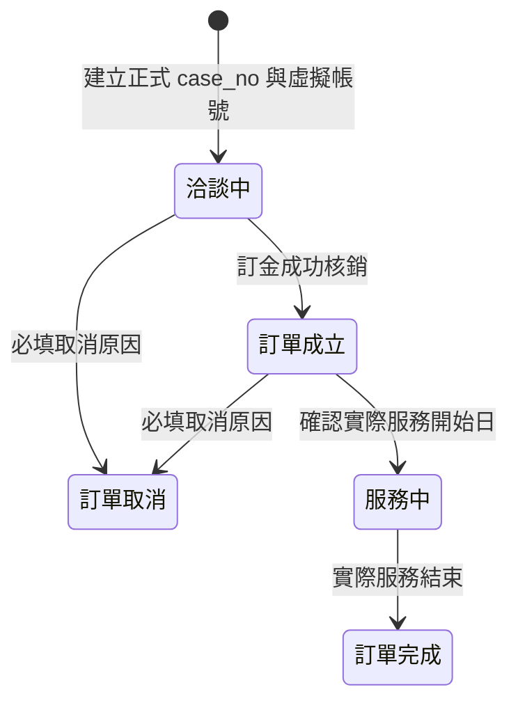
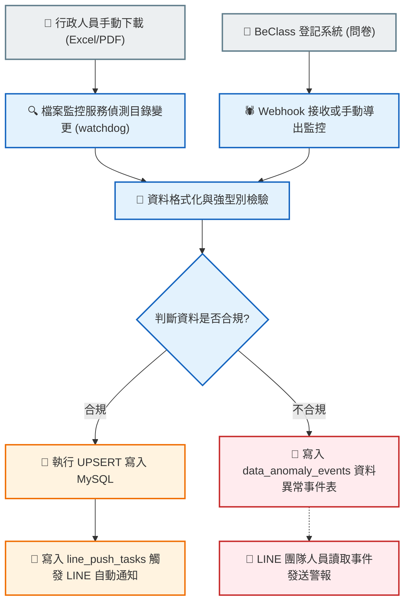

# 02_訂單帳務與資料處理_無損合併稿

> 狀態：第一階段無損合併稿。此檔案尚未去重、整理或裁決衝突，也不取代原始文件或 system_map.yaml。

## 來源清單

| # | 來源路徑 | 行數 | Bytes | SHA-256 |
|---:|---|---:|---:|---|
| 1 | document/資料庫、資料處理/帳務與訂單業務規則.md | 155 | 9481 | 4867278B9BE0EDA921EB2D0821BE2FFDFEFFE3D5BB0CDBE1C0CFCBC47EDD611E |
| 2 | document/資料庫、資料處理/帳務金流規則.md | 303 | 27792 | 211C02D43149313337B048B5C7100C4C135C6CB4043BF8B4AB903516950635AD |
| 3 | document/資料庫、資料處理/帳務金流開發交接.md | 280 | 12920 | C348717ABFFC7D13D5CF427B4952CA9BE3A9AE9F248BBE2D6F01A69F3F29A2BF |
| 4 | document/資料庫、資料處理/帳務假數據生成與關聯測試規格.md | 265 | 19822 | 25410000970EFF5977CDF957A2BC164D2D0C05319BEBA6A2A22D006FB3F298C9 |
| 5 | document/資料庫、資料處理/資料庫欄位映射與資料字典規格書.md | 307 | 23754 | 35481F3E4520A15CC46A83A910DAAB80C061F6E386F705B5C879D904DB53CFB0 |
| 6 | document/資料庫、資料處理/設計規格書(Data Pipeline).md | 175 | 10342 | FABE461E02169FDF00DD74BA14F577BA7943251109FDB4E7CB2607EFF922389B |
| 7 | document/資料庫、資料處理/尚未涵蓋、無法測試的所有型態與業務異常狀況.md | 188 | 13763 | 0449D38D7C499C50885E131CF20EDAEB237A3BE142F8C4CF14B83D62C0FC1BFF |

## 原文完整收錄

<!-- BEGIN SOURCE 1: document/資料庫、資料處理/帳務與訂單業務規則.md -->

### 來源 1：document/資料庫、資料處理/帳務與訂單業務規則.md

- 原始 SHA-256：4867278B9BE0EDA921EB2D0821BE2FFDFEFFE3D5BB0CDBE1C0CFCBC47EDD611E

---

# 🪙 帳務與訂單業務規則定義（SSOT）

本文件定義月子服務的虛擬帳號、訂單狀態與新帳務模型。帳務關聯一律以 `case_no` 為準；不得以 `orders.id`、客戶姓名或月嫂姓名作為帳務主鍵。

---

## 1. 虛擬帳號編碼與綁定規則

月子服務虛擬帳號固定為 14 碼：

```text
997816 + 99 + 年度(3碼) + case_no 流水號後3碼
```

例：`case_no = 115000001`，縮寫為 `115001`，完整虛擬帳號為 `99781699115001`。

對帳時只接受前綴 `997816`、分類碼 `99` 的 14 碼帳號；將後 6 碼還原為 `case_no`，再關聯 `orders`、`clients` 與客戶帳務。課程、培訓、會員年費等其他分類碼必須略過，不得進入月子服務帳務。

---

## 2. 訂單狀態生命週期



客戶收款必須由銀行流水匯入後建立交易明細；不得直接修改帳務摘要金額。訂金成功核銷才可推進「洽談中 → 訂單成立」。

---

## 3. 帳務共同基礎與判斷公式

身分資格僅有一般市民、補助市民、非市民，作為業務資格與公式輸入；帳務程式不得依身分名稱分出互斥流程。帳務判斷以以下數值為準：

| 欄位／公式 | 定義 |
| --- | --- |
| `total_service_hours` | 實際或核定總服務時數 |
| `subsidy_hours` | 政府補助時數 |
| `client_payable_amount` | 客戶依合約應預付的總金額 |
| `staff_payable_amount` | 月嫂依服務指派應收的總薪資與已分配樓層費 |
| `subsidy_claim_amount` | 應向政府申請的補助金額 |
| `client_prepaid_subsidy_amount` | 客戶已預付、日後可能退還的補助段金額 |
| `requires_subsidy_claim` | `subsidy_hours > 0` |
| `subsidy_return_amount` | `client_prepaid_subsidy_amount`；僅保留欄位，現階段不執行退款 |

判斷規則：

1. `subsidy_hours = 0`：不申請補助、不產生退還補助金額。
2. `subsidy_hours > 0`：納入季度補助申請。
3. 補助市民全額補助時，客戶應付與客戶預付皆為 0；即使補助金額大於 0，也不得產生退還補助金額。
4. 只有客戶曾預付補助段時，`subsidy_return_amount` 才可能大於 0。這不是解約退款；解約退款必須使用獨立交易類型與流程。

---

## 4. 收款與核銷流程

1. 媒合簽約並取得正式 `case_no` 時，建立客戶帳務摘要並提供預先配置的虛擬帳號。
2. 客戶依訂金與合約期款匯至虛擬帳號；所有客戶應付金額須在月嫂結案發薪前完成預收。
3. 工會人員上傳新的銀行帳務明細；`file_watcher` 觸發匯入流程。
4. 匯入器以虛擬帳號解出 `case_no`，驗證案件存在、交易日期、金額、款項階段與外部交易識別。
5. 合法入款寫入 `client_payment_transactions`，再重算 `client_payments` 摘要。未知帳號、超收、重複交易或不符合案件狀態的入款必須列為待人工處理。

---

## 5. 月嫂一次發薪與待匯清單

月嫂每一服務指派只產生一筆應付摘要，並只進行一次正式發薪；不得再以補助段建立第二次月嫂發薪。

1. 客戶有應付金額的案件：結案後次月 15 日列入月嫂薪資待匯。
2. 客戶應付為 0 且由政府全額補助的案件：結案後次次月 15 日列入月嫂薪資待匯。
3. 每月 5 日產生當月待匯清單，列出月嫂、帳戶、`case_no`、服務指派、應匯金額與應匯日。
4. 系統不執行銀行匯款；產生清單、匯出檔或列入批次都不得標示為已付款。只有人工確認或匯入可辨識的實際支出明細後，才能寫入 `staff_payment_transactions`。

### 退還補助金額（暫不啟用）

系統保留以下欄位與未來交易能力，但目前不產生退款 UI、每月待匯清單或實際退款交易：

- `subsidy_return_amount`：退還補助金額
- `subsidy_returned_amount`：已退還補助金額
- `subsidy_return_due_date`：退還補助日期
- `subsidy_returned_at`：實際退還日期

未來啟用時，僅能處理「客戶預付補助段後退還」；不得與解約退款共用欄位或交易類型。

---

## 6. 季度補助申請與年度總覽

補助案件以 `actual_end_date`（無值時才使用 `end_date`）歸屬完工季度：

| 完工季度 | 申請月份 |
| --- | --- |
| Q1（01-01～03-31） | 4 月 |
| Q2（04-01～06-30） | 7 月 |
| Q3（07-01～09-30） | 10 月 |
| Q4（10-01～12-31） | 次年 1 月 |

每季清單只納入 `subsidy_hours > 0`、已完工且尚未列入同一申請批次的案件。年度補助總覽以完工年度統計案件與金額，至少區分：應申請、已送件、已核准、已撥款。

---

## 7. 最新金額、日期與歷史資料規則（優先於前文）

1. 核銷補助時數依資格與總服務時數計算：一般市民為 `min(40, total_service_hours)`；補助市民為 `min(120, total_service_hours)`；非市民為 0。
2. 補助申請總額為各月嫂實際服務時數比例分配後的「補助時數 × 該月嫂服務單價」合計；核銷清冊顯示案件合計。
3. 客戶三期帳務均保存應收金額、實收金額、應收日期、實收日期。訂金天數與訂金應收日期採訂單表單；第一期天數為 `min(15, max(0, 請款總日數 - 訂金天數))`，應收日期為服務開始日；第二期天數為剩餘日數，應收日期在第一期首次全額實收後才設定為「第一期實收日 + 15 天」。第二期天數為 0 時日期保持空值，畫面顯示 0。
4. 訂金、第一期、第二期的實收與實收日期只能由成功銀行交易重算。訂金首次全額核銷後，系統自動將案件由「洽談中」改為「訂單成立」。
5. 歷史資料可在單筆訂單頁人工建立或調整應收金額與排程快照，並保留調整原因與操作者；不得直接手改交易彙總的實收金額或實收日期。
6. 舊財務匯入建立客戶帳務時，應收總額與三期拆分必須由服務總天數、每日時數、身分單價、訂金天數與樓層費公式計算；不得使用舊 `v_order_details` 或固定金額。
7. 退還補助金額功能目前停用：不得建立退款交易、退款待匯清單或退款 UI。既有保留欄位不代表已啟用流程。

---

## 8. 付款狀態、取消訂單與一般客戶退款（已確認，待架構核准）

### 8.1 Canonical 狀態分離

付款相關狀態必須分成不同概念，不得再以單一 `payment_status` 同時表示付款進度、請款階段、人工審核與訂單流程：

| 狀態 | 合法值 | 定義 |
| --- | --- | --- |
| `payment_progress` | `unpaid`、`partially_paid`、`paid` | 依有效客戶收款與應收總額計算的付款進度 |
| `payment_stage` | `deposit`、`first_payment`、`second_payment`、`completed`、`NULL` | 下一個應收階段；取消訂單時必須為 `NULL` |
| `review_status` | `normal`、`review_required` | 是否需要人工帳務審核 |
| `workflow_status` | `active`、`cancelled` | 訂單帳務流程是否仍有效 |
| `refund_status` | `not_required`、`pending`、`partially_refunded`、`refunded`、`review_required` | 一般客戶解約退款義務的處理進度 |

有效收款可一次跨越多個應收階段，`payment_stage` 應依累計有效收款自動向前推進。取消訂單後不得依退款結果將 `payment_stage` 倒退至先前階段。

### 8.2 取消與一般客戶退款

1. 必須先成功取消訂單，才允許建立一般客戶退款；退款不得反向觸發或推測訂單取消。
2. 訂單取消後，`workflow_status = cancelled`、`payment_stage = NULL`，並停止後續催款及付款階段推進。
3. 取消前最後付款階段只由事件歷史查詢，不複製至目前狀態欄位。
4. 取消時有效客戶收款為 0，`refund_status = not_required`，且不建立退款單。
5. 取消時有效客戶收款大於 0，系統自動建立待退款義務並設定 `refund_status = pending`；不得自動執行銀行退款。
6. `refundable_amount = 有效客戶收款 - 已退款有效金額`。退款交易、失敗、退匯與沖銷必須保留完整事件歷史。
7. 一般客戶解約退款與「退還客戶預付補助款」是不同帳務領域，不得共用狀態、退款義務、交易類型或待辦清單；兩者只能透過 `case_no` 關聯。

### 8.3 待退款義務的 UI 顯示位置

一般客戶待退款義務必須同時出現在以下位置：

1. **全域財務待辦／警示中心**：顯示待退款案件數與待退款總額；可依逾期、`review_required` 及退款失敗篩選。
2. **一般客戶退款待辦清單**：作為確認退款帳戶、建立退款批次、記錄實際退款及處理失敗／退匯的主要操作入口；不得與退補助款待匯清單混合。
3. **單筆訂單的財務頁**：訂單取消後顯示退款摘要卡，至少包含原收款、已退款、待退款、`refund_status`、取消原因及事件歷史入口。

訂單列表可顯示「待退款」提示標籤供導流，但不得作為唯一顯示位置。`refund_status = not_required` 的案件不進入一般客戶退款待辦清單。

---

<!-- END SOURCE 1: document/資料庫、資料處理/帳務與訂單業務規則.md -->

<!-- BEGIN SOURCE 2: document/資料庫、資料處理/帳務金流規則.md -->

### 來源 2：document/資料庫、資料處理/帳務金流規則.md

- 原始 SHA-256：211C02D43149313337B048B5C7100C4C135C6CB4043BF8B4AB903516950635AD

---

# 帳務金流規則

本文件以目前系統定義的案件帳務為範圍，將金流需求區分為：

1. **正常流程**：日常營運必經流程，列為優先實作與驗證範圍。
2. **邊界問題**：失敗、重複、差額、無法辨識或規格衝突等例外，列為警示待辦，不阻礙正常流程先行。

狀態說明：

- ✅ 已支援：後端資料結構、銀行匯入與核銷流程已完成並有專項測試覆蓋。
- ⚠️ 部分支援：已有資料結構、報表或人工操作，但尚未形成完整閉環。
- ❌ 未支援：目前沒有可用的登記與核銷流程。
- 🚨 待辦警示：邊界情境已保存為 pending／review 或正式警示，仍須人工處理。

> [!NOTE]
> **2026-07-19 同步基準**：銀行匯入 P0、客戶收款、客戶補助款退還、政府補助撥款、服務人員月結／實際轉帳，以及 B6 警示事件生命週期均已完成實作與整合測試。合併新版入口後的完整回歸為 `468 passed, 5 skipped, 1 warning`，其中財務警示 Router 專項測試為 `7 passed`。本文件中仍標示「尚待確認」者是業務規則尚未定義，不得由實作自行推測。警示 Router 與 UI 已掛載至 `api.main:app` 的 `/api/v1/finance-alerts`，因此可由執行中入口提供查詢、認領與解除警示功能。

## 優先處理順序

1. 完成四大類正常金流的「應收／應付 → 實際交易 → 銀行對帳 → 結清」閉環。
2. 銀行匯入必須能登記客戶入款、政府補助撥款、退還客戶補助款及服務人員薪資轉帳。
3. 正常流程完成後，再依各分類的警示編號處理邊界問題。

## 已確認的銀行流水判斷規則

> 本節為後續 Import 升級的既定判斷依據。交易「分類」與帳務「核銷」必須分成兩個步驟；分類成功不代表已完成核銷。

### 共通判斷順序

1. 先依 `支出金額`、`存入金額` 判斷交易方向為支出或存入。
2. 保存原始備註，再解析備註中的對象姓名與對方帳號。
3. 只有客戶匯款具有銷帳編號／虛擬帳號，可優先用來判斷客戶入款；其他交易不得套用此規則。
4. 依銀行來源、交易方向、銷帳編號、備註內容及對方帳號判斷交易類型。
5. 完成交易分類後，再匹配案件、客戶補助款退還、服務人員月結或政府補助清冊進行核銷。
6. 無法唯一分類或無法唯一核銷時，保留完整原始流水，歸類為「非業務金流／待確認」並建立警示，不得直接寫入正式案件帳務。

### 跨檔案去重識別規則

1. 台新「序號」每次更新會重置，不是跨檔案唯一流水號，不得用於去重。
2. 永豐「交易參考編號」在實際檔案可能為空，不得要求它一定存在，也不得用 Excel 列號補代。
3. 兩家銀行皆使用系統產生的 `dedup_fingerprint` 作為跨檔案重複匯入識別；此值是系統去重鍵，不宣稱為銀行原生流水號。
4. `dedup_fingerprint` 將下列正規化欄位依固定順序串接後計算 SHA-256：銀行來源、工會本方帳號、交易日期時間、方向、支出金額、存入金額、交易後餘額、摘要、原始備註、銷帳編號。
5. fingerprint 不得包含來源檔名、工作表名稱或 Excel 列號，因此同一交易出現在不同下載檔時必須產生相同值。
6. 日期時間採銀行對帳單可提供的最小單位（目前為秒）；金額使用固定 Decimal 字串，空值使用固定空字串，文字只做 Unicode NFKC 與換行／空白正規化，不得移除具識別意義的數字。
7. 銀行 Import 採逐筆 append-only：fingerprint 已存在時不得 UPDATE 或覆蓋既有 staging row、正式帳務交易或人工調整結果，只新增本次檔案 occurrence 並將該列標記為 skipped_existing。
8. 同一檔案同時包含歷史列與新列時，只跳過已存在 fingerprint 的歷史列；其餘新列仍須正常保存、分類與核銷，不得因部分重複而整份檔案停止。
9. `dedup_fingerprint` 只處理「同一銀行流水被不同匯入檔重複帶入」，不得用來判定業務上是否發生重複匯款或重複收款。
10. 同秒、同備註但交易後餘額或其他交易欄位不同時，視為兩筆不同銀行流水，兩筆都必須保存；後續若匹配到同一應收／應付義務，應建立「疑似重複匯款／收款」邊界警示，不得由 Import 靜默刪除其中一筆。
11. 同一來源檔內出現完全相同 fingerprint 的多列時，屬來源資料重複或銀行識別不足的邊界事件：只允許一筆進入正式核銷，其餘列保留 occurrence 並建立警示。
12. 跨檔案 fingerprint 已存在時，仍依 append-only 規則跳過正式寫入以保護既有人工調整；系統應保存 occurrence，供追查該列曾由哪些檔案重複帶入。

### 已完成的主檔 Importer insert-only 改造

客戶 HCM、客戶 BeClass、服務人員 BeClass 與歷史訂單 importer 已依下列規則完成改造並通過專項測試；其他後續新增 Importer 亦必須遵守同一規則。

1. 銀行流水、客戶 HCM、客戶 BeClass、服務人員 BeClass、歷史訂單及後續新增的 Importer，一律採 insert-only；Import 不得更新或刪除已存在的主檔、子表或人工調整資料。
2. 每種資料依其穩定識別鍵判斷是否已存在：銀行流水使用 `dedup_fingerprint`；客戶 HCM 與訂單使用案件編號；客戶 BeClass 使用資料庫唯一的 `query_no`；服務人員使用身分證字號。
3. 識別鍵已存在時，該筆標記為 `skipped_existing` 並回報跳過數量，不執行 `UPDATE`、UPSERT、Delete-and-Insert，也不得重建既有子表。
4. 同一匯入檔內同時含既有資料與新資料時，既有資料逐筆跳過，新資料仍正常新增。
5. 新增主檔及其子表必須在同一資料庫交易完成；任一新增失敗時回滾該次匯入，不得留下不完整主從資料。
6. 人工修正仍由管理介面或明確的人工修改流程負責，不得藉由重新匯入來源檔回填或覆蓋。
7. 缺少正式識別鍵、只可用姓名比對、同名多候選或識別鍵衝突時，不得算作正常跳過，也不得猜測關聯；須列為 `review_required`。
8. 歷史訂單 importer 若輸入只描述既有訂單狀態變更，應跳過既有案件並回報；缺少案件編號時列為 `review_required`，不得依姓名批次修改同名客戶的訂單。

### 已確認交易分類矩陣

| 銀行來源 | 方向 | 判斷條件 | 交易類型 | 後續核銷規則 |
| --- | --- | --- | --- | --- |
| 永豐 | 存入 | 存在有效銷帳編號／虛擬帳號 | 客戶匯款 | 以銷帳編號識別案件，再依訂金、第一期、第二期順序核銷 |
| 永豐 | 支出 | 對方帳號符合服務人員帳號 | 新制服務人員薪資轉帳 | 對應該服務人員的月結；不直接綁定單一案件 |
| 台新 | 存入 | 備註包含「新竹市政府」 | 政府補助款實際撥入 | 對應正式季度核銷補助清冊，比對該季應收補助金額 |
| 台新 | 存入 | 備註不包含「新竹市政府」 | 非業務金流／待確認 | 目前不處理，只保存原始流水及未匹配原因 |
| 台新 | 支出 | 備註中的對方帳號符合客戶補助款退款帳號 | 退還客戶補助款 | 對應該客戶待退的補助款及未退餘額 |
| 台新 | 支出 | 備註中的對方帳號符合服務人員帳號 | 舊制服務人員補助款轉帳 | 對應服務人員月結，並回推至訂單應付薪資驗證金額 |
| 任一銀行 | 任一方向 | 不符合以上規則、符合多個規則或必要資料不足 | 非業務金流／待確認 | 不進入四大案件帳務，只保存原始流水並建立警示 |

### 永豐客戶虛擬帳號反解規則

1. 客戶虛擬帳號固定為 14 碼：`99781699 + 民國年 3 碼 + 流水號 3 碼`。
2. 反解案件編號時，保留民國年 3 碼，將虛擬帳號末 3 碼流水號左補零至 6 碼後串接。
3. 範例：`99781699115001` 的後 6 碼為 `115001`，正式案件編號為 `115000001`。
4. 反解後必須以完整 9 碼案件編號唯一命中正式訂單，才能核銷；格式錯誤、零筆或多筆命中都保留 pending，不得依姓名、金額或備註推測。

### 台新備註與身分確認

1. 台新對帳單的備註一定會註明對方帳號，Import 必須解析並保存該帳號。
2. 台新支出以對方帳號作為客戶或服務人員的主要身分判斷依據。
3. 備註中的姓名作為交叉驗證資料，不取代帳號匹配。
4. 帳號與姓名不一致、帳號同時符合不同身分、帳號符合多人或帳號不存在時，不得自動核銷，統一轉入「非業務金流／待確認」。
5. 台新帳戶不處理客戶虛擬帳號匯款；不得將台新其他存入誤判為客戶入款。

## 1. 客戶匯款

### 1.1 正常流程（優先）

| 優先 | 正常流程 | 目前配套 | 狀態／缺口 |
| --- | --- | --- | --- |
| P0 | 建立客戶三階段應收 | 依案件資料建立訂金、第一期、第二期應收摘要與到期日。 | ✅ 已支援 |
| P0 | 客戶支付訂金 | 銀行 Excel 依虛擬帳號識別案件，自動建立交易明細並更新客戶帳務摘要。 | ✅ 已支援 |
| P0 | 客戶支付第一期、第二期 | 依「訂金 → 第一期 → 第二期」順序自動分配入款。 | ✅ 已支援 |
| P0 | 分次或跨階段入款 | 同一階段可保存多筆交易；單筆入款也可依序分配至不同階段。 | ✅ 已支援 |
| P0 | 完成階段核銷 | 階段收足後更新實收日；訂金完成核銷可推進訂單狀態。 | ✅ 已支援 |
| P1 | 人工補登正常收款 | UI／API 可新增 `receipt`，必須填寫外部流水號與補登原因。 | ✅ 已支援 |
| P1 | 銀行流水去重 | 使用已確認的 `dedup_fingerprint` 跨檔案去重，避免同一交易重複入帳。 | ✅ 已支援；重複列只新增 occurrence 並標記 `skipped_existing` |

### 1.2 邊界問題／待辦警示

> [!WARNING]
> 下列情境不得直接修改客戶帳務摘要；應保留原始銀行流水、建立警示，並等待人工認領或更正。

| 警示編號 | 觸發條件 | 目前行為 | 待辦警示 |
| --- | --- | --- | --- |
| CLIENT-001 | 客戶入款交易狀態為失敗 | 資料模型可記錄 `failed`，但 UI 未提供狀態選擇。 | - [ ] 顯示失敗入款警示，且不得計入實收 |
| CLIENT-002 | 同一銀行流水重複匯入 | 唯一識別相同時拒絕寫入。 | - [ ] 顯示重複流水及原交易連結 |
| CLIENT-003 | 入款超過案件剩餘應收 | 計算層拒絕超收，只累計略過筆數。 | - [ ] 建立超收待認領紀錄，不得遺失銀行流水 |
| CLIENT-004 | 無法由虛擬帳號解析案件 | 不寫入帳務，只累計 `skipped_transactions`。 | - [ ] 建立未知入款警示與人工認領入口 |
| CLIENT-005 | 虛擬帳號可解析，但案件不存在 | 不建立交易，只累計略過筆數。 | - [ ] 建立案件不存在警示並保存原始流水 |
| CLIENT-006 | 歷史案件缺少訂金天數或必要日期 | 不建立帳務快照。 | - [ ] 建立缺少案件資料警示與補件待辦 |
| CLIENT-007 | 已入帳交易需要更正 | 可使用 `reversal` 沖正。 | - [ ] 強制關聯原交易並保存沖正原因 |

## 2. 補助款退還給客戶

### 2.1 正常流程（優先）

| 優先 | 正常流程 | 目前配套 | 狀態／缺口 |
| --- | --- | --- | --- |
| P0 | 計算應退補助款 | 金額計算器只在客戶曾預付補助款時建立退款義務。 | ✅ 已支援 |
| P0 | 建立退還補助款應付 | 建立退款義務、應退／已退金額與結清摘要。 | ✅ 已支援 |
| P0 | 產生待匯清單 | 應付帳款 Excel 可查詢應退補助款，並指定由台新銀行代碼 633 出款。 | ✅ 已支援 |
| P0 | 實際退還補助款 | 建立不可覆寫的 `subsidy_return` 交易並更新已退淨額。 | ✅ 已支援 |
| P0 | 銀行支出對帳 | 台新支出經 normalization、staging、分類與退款核銷鏈路處理。 | ✅ 已支援 |
| P1 | 完成退款結清 | 全額退還後更新實際退還日與結清狀態。 | ✅ 已支援 |

退還補助款正式交易的 `occurred_at` 只保存銀行交易日期；秒級交易時間保留在關聯的 `finance_import_rows.transaction_time`，不得以系統目前時間補寫正式交易。

### 2.2 邊界問題／待辦警示

> [!WARNING]
> 金額差異、失敗、退匯與沖正均不得覆寫退款義務或交易歷程；須保留 pending／review 與警示，等待人工處理。

| 警示編號 | 觸發條件 | 目前行為 | 待辦警示 |
| --- | --- | --- | --- |
| RETURN-001 | 應付 Excel 查到退還補助款，但 `system_map` 仍標示功能停用 | 報表與架構規格不一致。 | - [ ] 建立架構衝突警示，未核准前不得產生實際退款交易 |
| RETURN-002 | 退還補助款需要分次付款 | 資料表有交易類型預留，但寫入路徑停用。 | - [ ] 建立部分退款餘額與未結清警示 |
| RETURN-003 | 退款轉帳失敗 | 保存 `failed` 事件，不計入已退淨額。 | - [ ] 顯示退款失敗警示並保留原轉帳流水 |
| RETURN-004 | 退款失敗後重新匯款 | 新交易以新外部識別重送，保留原失敗事件。 | - [ ] 關聯原失敗交易並顯示重送歷程 |
| RETURN-005 | 退還補助款被銀行退匯 | 保存退匯事件並重新計算退款淨額。 | - [ ] 建立退匯警示並恢復未退餘額 |
| RETURN-006 | 已退款交易需要沖正 | 以關聯原交易的 `reversal` 保存沖正原因。 | - [ ] 顯示沖正警示與原交易關聯 |

## 3. 政府補助款實際撥入

### 3.1 正常流程（優先）

| 優先 | 正常流程 | 目前配套 | 狀態／缺口 |
| --- | --- | --- | --- |
| P0 | 計算政府補助應申請金額 | 依補助資格、補助時數與各服務人員單價計算案件應申請金額。 | ✅ 已支援 |
| P0 | 產生季度核銷清冊 | 可依完工季度產生核銷資料與 Excel。 | ✅ 已支援 |
| P0 | 建立申請批次並送件 | 保存批次、案件、申請金額、送件日與狀態。 | ✅ 已支援 |
| P0 | 登記政府核准結果 | 保存核准日、核定金額及案件明細。 | ✅ 已支援 |
| P0 | 政府實際撥款入帳 | 台新政府入款經銀行流水建立正式補助交易。 | ✅ 已支援 |
| P0 | 撥款分攤至申請批次與案件 | 僅在唯一且金額精確的批次候選時核銷。 | ✅ 已支援；短撥、溢撥、跨批次與分次撥款維持 pending |
| P0 | 更新已撥與未撥餘額 | 依正式補助交易更新批次及案件的實撥金額。 | ✅ 已支援 |
| P1 | 年度補助總覽 | 顯示應申請、已送件、已核准、已撥款。 | ✅ 已支援 |

正常流程應有的狀態順序：

`待申請 → 已送件 → 已核准 → 部分撥款／已撥款 → 結清`

年度總覽狀態由申請批次與正式補助交易彙總；未能唯一核銷的銀行流水不得計入 `paid`。

政府補助款的已確認核銷規則：

1. 台新存入且備註包含「新竹市政府」時，分類為政府補助款實際撥入。
2. 撥款入帳後必須立即對應正式的季度核銷補助清冊。
3. 比較銀行實際撥入金額與該季應收補助金額；金額相同才可將該批次標記為完成核銷。
4. 金額不同時，分別保留應收金額與實撥金額，標記部分撥款、短撥、溢撥或待確認，不得修改應收金額強制對平。
5. 找不到唯一清冊時，交易類型仍可保留為政府補助款，但不得標記為已核銷。

尚待確認的實作細節：正式清冊／申報批次的唯一識別、同一季度多次送件或補件版本，以及一筆撥款是否允許跨批次核銷。這些細節未確認前不得自行推測分配。

### 3.2 邊界問題／待辦警示

> [!WARNING]
> 政府補助差額不得直接改寫申請金額；應分別保留申請、核定及實撥金額，並以交易明細處理差額。

| 警示編號 | 觸發條件 | 目前行為 | 待辦警示 |
| --- | --- | --- | --- |
| SUBSIDY-001 | 政府要求補件 | 批次維持未結清，保留補件原因與人工處理狀態。 | - [ ] 建立補件警示、期限與處理狀態 |
| SUBSIDY-002 | 政府駁回申請 | 批次不自動核銷，保留駁回原因與人工結案狀態。 | - [ ] 建立駁回警示並保存原因 |
| SUBSIDY-003 | 政府只核准部分金額 | 沒有核定差額紀錄。 | - [ ] 建立核定短差警示，不得覆寫原申請金額 |
| SUBSIDY-004 | 政府分次撥款 | 沒有部分撥款及未撥餘額。 | - [ ] 建立部分撥款警示，保持批次未結清 |
| SUBSIDY-005 | 實際撥款少於核定金額 | 沒有短撥原因或追蹤狀態。 | - [ ] 建立短撥警示與待追款金額 |
| SUBSIDY-006 | 實際撥款高於核定金額 | 沒有溢撥待處理紀錄。 | - [ ] 建立溢撥警示與可能退款義務 |
| SUBSIDY-007 | 政府追回已撥補助款 | 沒有追回或返還政府的負向交易。 | - [ ] 建立追回警示並重新計算已撥淨額 |
| SUBSIDY-008 | 已入帳撥款需要沖正 | 沒有沖正原撥款機制。 | - [ ] 強制關聯原撥款交易並保存沖正原因 |
| SUBSIDY-009 | 銀行入款無法對應申請批次 | 保存 staging 與正式警示，不建立補助核銷。 | - [ ] 建立未知政府入款警示與人工分攤入口 |

## 4. 服務人員實際轉帳

### 4.1 正常流程（優先）

| 優先 | 正常流程 | 目前配套 | 狀態／缺口 |
| --- | --- | --- | --- |
| P0 | 建立服務人員薪資應付 | 依正式服務指派建立應付摘要，分列服務薪資、樓層費、調整額、應付總額與應付日。 | ✅ 已支援 |
| P0 | 處理同案多位服務人員 | 每個正式服務指派各自建立一筆應付，可分別付款。 | ✅ 已支援 |
| P0 | 處理同一服務人員跨案件應付 | 可同時保留不同案件的多筆待付款。 | ✅ 已支援 |
| P0 | 建立服務人員月結 | 將同一服務人員當月跨案件的應付薪資彙總為月結。 | ✅ 已支援 |
| P0 | 建立服務人員月結明細 | 月結明細保留各訂單／服務指派的應付來源與薪資組成。 | ✅ 已支援 |
| P0 | 產生每月待匯清單 | 可輸出待付款或部分付款的應付 Excel，薪資指定由永豐銀行代碼 31 出款。 | ✅ 已支援 |
| P0 | 執行實際轉帳 | 銀行依待匯清單將薪資匯給服務人員。 | ⚠️ 系統登記與對帳實際銀行出款；不直接操作銀行轉帳指令。 |
| P0 | 登記實際轉帳 | 每筆銀行出款保存為獨立的服務人員實際轉帳，不直接綁定單一案件。 | ✅ 已支援 |
| P0 | 銀行支出自動對帳 | 先以備註帳號識別服務人員，再核銷唯一月結候選。 | ✅ 已支援；歧義與跨月份候選維持 pending |
| P1 | 薪資分次付款 | 一張月結可保存多筆成功轉帳與多個 component。 | ✅ 已支援 |
| P1 | 完成薪資結清 | 依實付淨額更新月結與明細狀態。 | ✅ 已支援 |

### 4.2 已確認的服務人員月結需求

1. 服務人員薪資不直接對應單一案件編號，而是計算該服務人員當月應領薪資總額。
2. 現有 `staff_payments` 繼續保存訂單／服務指派層的應付薪資來源，不改成銀行交易。
3. 新增「服務人員月結」，保存服務人員、月結月份、應付總額、實付總額及月結狀態。
4. 新增「服務人員月結明細」，逐筆連回該月納入計算的訂單／服務指派應付薪資。
5. 新增「服務人員實際轉帳紀錄」，每一筆銀行出款各保存一筆，不直接綁定單一案件。
6. 新增「服務人員轉帳分配明細」，保存實際轉帳與月結明細的多對多分配；一筆轉帳可支付多筆訂單，同一訂單亦可由舊制兩次付款共同支付。
7. 薪資月份需分開保存：銀行交易日期決定實際轉帳月份；月結歸屬月份另存於服務人員月結。月結月份的正式來源與匹配優先順序尚待 Schema 規劃確認。
8. 舊制第一次薪資與第二次補助款必須保存為兩筆不同的實際轉帳；能確認屬於同一月結時，才共同核銷該服務人員月結。
9. 舊制第二次支付的補助款必須回推至該訂單的應付薪資，並確認實際轉帳金額是否與應付金額相同。
10. 金額不相同或無法唯一回推訂單時，不得修改應付薪資強制對平，必須建立待確認警示。

永豐支出的對象帳號來源規則：

1. 僅在永豐流水為支出時解析對象帳號；收入仍依銷帳編號（虛擬帳號）判斷客戶入款。
2. 優先以 `staff_bank_accounts` 中完整帳號逐一比對「備註」原文；不得先依數字長度猜帳號。
3. 「備註」沒有命中已登記完整帳號時，才以相同方式比對「存摺備註」；「存摺備註」可能同時包含對象姓名、虛擬帳號或其他文字。
4. 原始「備註」與「存摺備註」必須完整保留。帳號候選不唯一或無法明確解析時，不得猜測對象，應保留為待確認流水。
5. 對象姓名只供交叉驗證，不得取代帳號作為服務人員的唯一匹配鍵。
6. 服務人員身分比對必須納入 `staff_bank_accounts` 中該服務人員已登記的全部帳號，不限 `is_primary = 1`；任一帳號唯一命中即可辨識為該服務人員，同帳號命中多位服務人員時仍轉待確認。

> [!NOTE]
> 「服務人員轉帳分配明細」已隨 PaymentSchema Checkpoint 核准並完成實作；同一明細可有不同 component，但相同 `(detail, component)` 不得重複配置。

### 4.3 邊界問題／待辦警示

> [!WARNING]
> 產生或下載待匯清單不代表已付款；只有實際銀行支出或人工確認的交易才能核銷。

| 警示編號 | 觸發條件 | 目前行為 | 待辦警示 |
| --- | --- | --- | --- |
| STAFF-001 | 薪資轉帳失敗 | 後端可記錄 `failed`，但 UI 未提供失敗狀態。 | - [ ] 顯示轉帳失敗警示，且不得增加實付金額 |
| STAFF-002 | 失敗後重新匯款 | 可使用新的外部識別人工建立轉帳。 | - [ ] 關聯原失敗交易並標示重送次數 |
| STAFF-003 | 薪資被銀行退匯 | 保存 `return` 事件並恢復未付淨額；人工仍須處理後續重送。 | - [ ] 建立退匯警示並恢復未付餘額 |
| STAFF-004 | 已付款交易需要沖正 | UI／API 可新增 `reversal`。 | - [ ] 強制關聯原交易並保存沖正原因 |
| STAFF-005 | 實付淨額超過應付總額 | 計算層拒絕超付。 | - [ ] 建立超付警示並阻止核銷 |
| STAFF-006 | 轉帳流水號重複 | 唯一識別相同時拒絕寫入。 | - [ ] 顯示重複流水及原交易連結 |
| STAFF-007 | 薪資調整額異動 | 有 `adjustment_amount` 欄位，但沒有獨立審核與異動歷程。 | - [ ] 建立調整額警示、原因、操作者及審核狀態 |
| STAFF-008 | 銀行支出無法對應服務人員應付 | 保存 staging 與正式警示，不建立服務人員轉帳或月結配置。 | - [ ] 建立未知出帳警示與人工認領入口 |
| STAFF-009 | 台新支出帳號符合服務人員，但找不到唯一月結 | 尚無月結匹配流程。 | - [ ] 保存為舊制服務人員補助款轉帳候選，等待人工指定月結 |
| STAFF-010 | 舊制第二次補助款無法唯一回推訂單 | 銀行備註只有姓名與帳號，沒有案件編號。 | - [ ] 阻止自動核銷並建立訂單分配待確認 |
| STAFF-011 | 舊制第二次補助款與訂單應付薪資不同 | 尚無差額核對流程。 | - [ ] 保留應付與實付差額，不得修改應付金額強制對平 |

## 共通正常流程規則（優先）

1. 銀行匯入應先完整保存所有收入與支出原始流水，再執行自動匹配。
2. 每筆銀行流水必須使用本文件定義的 `dedup_fingerprint` 跨檔案去重；不得使用 Excel 列號、檔名或會重置的台新序號。
3. 客戶收款、退還補助款、政府補助撥款及服務人員薪資必須使用不同交易類型與核銷規則。
4. 實際交易採不可覆寫的明細紀錄；摘要金額由成功交易淨額重新計算。
5. 產生待匯清單或下載 Excel 不等於完成付款。
6. 只有可辨識的實際銀行交易或經人工確認的交易才能完成核銷。
7. 政府補助應分別保存申請金額、核定金額、實撥金額及未撥餘額。
8. 本階段沒有一般客戶退款或解約退款交易類型；客戶出帳只處理退還客戶補助款。
9. 台新其他存入、銀行手續費、利息、內部轉帳、營運費用、測試款及不明款，現階段統一保存為「非業務金流／待確認」，不得進入四大案件帳務。
10. 帳號是支出身分辨識的主要依據；台新依備註中的帳號，永豐依「備註」優先、「存摺備註」備援取得帳號；姓名只用於交叉驗證。

## 共通邊界警示待辦

| 警示編號 | 邊界問題 | 待辦警示 |
| --- | --- | --- |
| COMMON-001 | 無法自動匹配的銀行收入或支出 | - [ ] 進入待認領清單，保存金額、日期、摘要、對方帳號、方向及未匹配原因 |
| COMMON-002 | 外部交易識別重複 | - [ ] 阻止重複入帳，顯示原交易資料 |
| COMMON-003 | 交易金額超出應收或應付範圍 | - [ ] 阻止核銷並建立差額警示 |
| COMMON-004 | 交易失敗、退匯或沖正 | - [ ] 保留完整歷程並重新計算淨額 |
| COMMON-005 | 必要案件、批次或收款人資料缺失 | - [ ] 阻止自動入帳並建立資料補件待辦 |
| COMMON-006 | 報表、應付清單與架構規格不一致 | - [ ] 建立規格衝突警示，未完成審核前不得啟用交易寫入 |
| COMMON-007 | 支出與存入同時有值，或兩者皆無有效金額 | - [ ] 標記交易方向異常，不進入交易分類 |
| COMMON-008 | 備註帳號無法解析、帳號與姓名不一致或帳號符合多個身分 | - [ ] 阻止自動核銷並顯示身分匹配衝突 |
| COMMON-009 | 不屬於四大案件帳務的正常銀行流水 | - [ ] 統一歸類為非業務金流／待確認，保留來源檔、工作表、列號與原始內容 |

## 已實作能力與入口限制

1. 政府補助交易帳本已記錄送件、核准、撥款與案件分攤。
2. 客戶補助款退還交易流程已只處理退還客戶補助款，不建立一般客戶退款或解約退款類型。
3. 銀行流水 staging 已完整保存未匹配的收入及支出，並保留認領／review 所需資料。
4. 出帳自動核銷已依待匯流水號、對方帳號及金額比對服務人員月結與客戶補助款退還；不唯一或金額不符時不寫正式帳務。
5. 警示中心、正式警示事件與生命週期已實作，可集中呈現本文的 `CLIENT-*`、`RETURN-*`、`SUBSIDY-*`、`STAFF-*` 與 `COMMON-*` 類型。
6. 警示 Router 與 UI 已掛載至 `api.main:app` 的 `/api/v1/finance-alerts`；入口只提供查詢、認領與解除，仍不得由 UI 建立警示或直接修改正式帳務。

## 尚待確認的規則（不得自行推測）

1. 政府補助清冊／申報批次的唯一識別方式，以及同季多次送件、補件版本與跨批次撥款的核銷規則。
2. 服務人員月結歸屬月份的正式來源與匹配優先順序；舊制兩次付款若跨月份時應歸入哪一張月結。
3. 舊制第二次補助款在同一服務人員同月有多筆訂單時，如何唯一回推訂單；未確認前不得只憑相同金額猜測。
4. 銀行帳號的正規化方式，以及身分匹配應使用主要帳戶、所有有效帳戶或包含歷史帳戶。
5. 本文件確認的是業務規則；正式施工前仍需依 ADAD 流程同步 `system_map` 並完成 Checkpoint 審核。

---

<!-- END SOURCE 2: document/資料庫、資料處理/帳務金流規則.md -->

<!-- BEGIN SOURCE 3: document/資料庫、資料處理/帳務金流開發交接.md -->

### 來源 3：document/資料庫、資料處理/帳務金流開發交接.md

- 原始 SHA-256：C348717ABFFC7D13D5CF427B4952CA9BE3A9AE9F248BBE2D6F01A69F3F29A2BF

---

# 帳務金流開發交接

更新日期：2026-07-16

本文件供新 Codex 對話接續帳務金流開發。後續不得依賴舊對話上下文，應以本文件、`帳務金流規則.md`、`帳務假數據生成與關聯測試規格.md`、ADAD Task／Checkpoint 與 `system_map.yaml` 為準。

## 1. 接手規則

1. 執行任何專案工作前，完整讀取 `.agents/AGENTS.md` 與 ADAD workflow skill。
2. 不得清理、reset、覆蓋或刪除目前工作樹中的既有修改與未追蹤檔案。
3. 新增或修改程式前，必須依 ADAD 完成節點規劃、編譯、Task 核發與 Task Gate 檢查。
4. 使用子代理時，每個子代理只處理單一節點或唯讀驗證。
5. 尚未確認的邊界規則不得猜測；只能要求保留 staging、維持 pending／review、零正式帳務寫入。
6. 任務難度為 `easy` 且完成度確定為 `100%` 時可跳過人工核准；其他情況維持人工核准。

## 2. 已完成並核准

### 2.1 P0 正常帳務流程

本輪銀行 Import P0 所需 schema、分類、staging、客戶收款、客戶退補助款、政府補助、服務人員月結與實際轉帳等節點均已完成並核准。

核心入口：

- `FinanceImport@v1@8bf8e2`
- 狀態：`approved`
- Checkpoint：`checkpoints/CP-2-20260716T073722555047Z-FinanceImport-approved.yaml`
- implementation hash 與 approved implementation hash 一致：`38a7ad188027886853ea6fe8f308caa1675f0cae694f3b3cb7106d2b6b40a71b`

永豐方向契約：

- `SinopacFinanceStatementAdapter@v1@56c37f`
- 狀態：`approved`
- Checkpoint：`checkpoints/CP-2-20260716T072756076266Z-SinopacFinanceStatementAdapter-approved.yaml`
- 支出、存入皆空時已改為 `direction=unknown`、`direction_missing`。

### 2.2 三種 Excel 格式讀取

第一階段已完成，不得重新列為未完成：

- 歷史多分頁格式 `legacy`
- 台新格式 `taishin`
- 永豐格式 `sinopac`
- 依內容偵測格式，不依檔名。
- 已涵蓋任意檔名、表頭定位、歷史多分頁、三種 adapter 與 normalization pipeline。

主要驗證檔：

- `tests/imports/test_finance_format_detector.py`
- `tests/imports/test_finance_statement_normalizer.py`
- `tests/imports/test_legacy_finance_adapter.py`
- `tests/imports/test_taishin_finance_adapter.py`
- `tests/imports/test_sinopac_finance_adapter.py`

### 2.3 B1、B2 邊界測試

B1 Import 安全性：

- `tests/test_finance_import_boundary_safety.py`
- 跨檔重複不重新 dispatch。
- 不覆寫 canonical row 或人工調整。
- 同秒同備註但餘額不同時保留兩筆 canonical。
- 同一批次完全重複只允許 canonical row 進入下游。
- 專項驗證：`34 passed`。

B2 客戶匯款：

- `tests/test_finance_import_client_receipt_boundaries.py`
- 虛擬帳號、案件、超收與殘缺重試的 pending 結果傳遞。
- 非業務入款不得觸發客戶收款副作用。
- 專項驗證：`40 passed`。

本輪完整回歸：

- `365 passed`
- 只有 Starlette/httpx 棄用警告，與帳務功能無關。

## 3. 下一階段未完成工作

### 3.1 B3：補助款退還客戶

尚未建立 B3 專項整合 Task／fixture。

基準資料：

- 應退：`1,500`
- 已退：`250`
- 剩餘：`1,250`

待補專項整合案例：

1. 支出 `1,249.99`：少退，維持 pending。
2. 支出 `1,250.01`：超退，維持 pending。
3. 同一退款帳號對應多位客戶：身分不唯一，零正式寫入。
4. 匯款失敗、退匯、沖正：驗證退款淨額與摘要不被錯誤更新。
5. Excel → normalization → staging → classifier → return reconciliation 的完整鏈路。

既有單元測試已有部分覆蓋：

- `tests/test_client_subsidy_return_transactions.py`
- 已涵蓋精確匹配、failed／reversal、差額、identity 與 idempotency。

接手後應先做 coverage mapping，只補整合缺口，不重複單元測試。

### 3.2 B4：政府補助撥入

尚未建立 B4 專項整合 Task／fixture。

基準資料：

- 已確認申報批次應收：`1,000`

待補案例：

1. 實收 `900`：短撥。
2. 實收 `1,100`：溢撥。
3. 兩個同額批次：候選不唯一。
4. 分次收到 `600 + 400`：第一筆不得提前核銷整批。
5. 單筆跨多批次：不得自動拆分。
6. Excel → staging → government reconciliation 的完整鏈路。

既有單元測試：

- `tests/test_government_subsidy_reconciliation.py`
- 已涵蓋短撥、溢撥、候選不唯一、精確金額與 idempotency。

### 3.3 B5：服務人員實際轉帳

尚未建立 B5 專項整合 Task／fixture。

待補案例：

1. 服務人員多帳號均可辨識為同一人。
2. 同一帳號連結多位服務人員時 pending。
3. 找不到月結或同時存在多個候選月結。
4. 跨月份候選不得依銀行交易日期猜薪資月份。
5. 舊制第二次補助款與 confirmed legacy component 金額不符。
6. 同一明細允許不同 component；相同 `(detail, component)` 不得重複。
7. Excel → staging → staff settlement／allocation 的完整鏈路。

既有單元測試：

- `tests/test_staff_actual_transfers_service.py`
- 已涵蓋帳號歧義、component、跨 settlement、retry 與部分配置限制。

### 3.4 B6：警示與事件生命週期

目前只有 pending／review 與 warnings 的分散行為，尚未完成專項架構與整合測試。

待規劃：

1. 警示持久化資料模型。
2. 警示中心或人工審核入口。
3. 人工認領與解除警示。
4. failed、退匯、重新匯款、reversal 的事件生命週期。
5. 預期金額、實際金額、差額與候選對象的稽核資料。
6. deterministic rerun 與人工調整保護。

B6 可能需要新增 schema／service／API／UI；必須先做 ADAD 架構規劃，不可直接實作。

## 4. 主檔 Importer insert-only 待辦

銀行 P0 完成後，所有主檔 importer 仍需全面改為「只新增、不更新」。此工作應獨立於 B3～B6，避免混入銀行邊界測試 Task。

已確認仍存在更新或刪除：

- `scripts/imports/import_client_hcm.py`：仍會 `UPDATE clients`。
- `scripts/imports/import_client_beclass.py`：仍會 `UPDATE beclass_records`，且目前以姓名＋生日判斷，尚未依規則改為 `query_no` 去重。
- `scripts/imports/import_staff_beclass.py`：仍會 `UPDATE staff`、刪除子表與銀行帳號。
- 歷史訂單 importer：目前未找到明確獨立入口，需要先盤點，不能假設檔案名稱或實作狀態。

規則來源：

- `帳務金流規則.md` 的「所有 Importer 的只新增規則」。

## 5. 文件同步待辦

`帳務金流規則.md` 內部分「目前狀態」仍寫下列功能未支援，但實際 P0 schema／services 已完成並核准：

- 服務人員月結與實際轉帳。
- 政府補助批次與實際撥款核銷。
- 客戶補助款退還交易。

新對話應先對照 `system_map.yaml`、approved Task 與 checkpoint 更新文件現況，避免後續把舊狀態當成施工依據。此文件同步應獨立核發文件／架構維護範圍，不應順便修改商業邏輯。

## 6. ADAD 歷史未結 Task

下列 Task 早於本輪帳務 B1/B2，沒有足夠證據確認完成度為 100%，不得套用 easy 自動核准：

| 節點 | 狀態 | 複雜度 | 建議 |
| --- | --- | --- | --- |
| `PaymentManagementUI` | assigned | low | 人工決定續做、重新核發或封存 |
| `RemoveOtherAdditionMigration` | assigned | low | 人工決定續做、重新核發或封存 |
| `ServicesLayer` | assigned | low | 人工決定續做、重新核發或封存 |
| `OnlineScript` | submitted | low | 舊 Task，先查 implementation 與 verification |
| `UILayer` | submitted | low | 舊 Task，先查 implementation 與 verification |

`resume_analysis.py` 顯示 26 個 dirty 節點，但其中包含大量既有 UI／API／架構髒點，不等於本輪帳務尚有 26 個施工 Task。不得直接批量核發。

## 7. 工作樹保護

目前工作樹含大量既有修改、未追蹤的新帳務檔案、checkpoint、schema parts 與 pytest 暫存目錄。

接手時：

- 不得執行 `git reset --hard`。
- 不得執行 `git checkout --` 回復檔案。
- 不得清理未追蹤檔案。
- 不得把所有 dirty 檔案視為本輪新增。
- 修改前先用 `git status --short` 與 `git diff -- <target>` 確認單一節點範圍。
- pytest 使用專案內唯一 `--basetemp`，避免 Windows 預設 Temp 權限問題。

## 8. 建議接續順序

1. 讀取 `.agents/AGENTS.md`、ADAD skill、本交接文件、`帳務金流規則.md`、`帳務假數據生成與關聯測試規格.md`。
2. 唯讀確認 `FinanceAlertWorkflowLifecycleIntegrationTest@v1@f788e9` 仍為 `approved`，不得重做 B1～B5 或已核准的 B6 schema／services／workflow lifecycle integration。
3. B6 下一個原子節點是 `FinanceAlertFormalEventIntegrationTest`；確認 Task Gate 後核發、實作、驗證並等待人工核准。
4. `FinanceAlertRouter` 可與正式事件整合測試列入同一波規劃，但仍須保持一個 Task 對一個節點、不同來源檔；不得把兩個節點合成單一 Task。
5. `FinanceAlertCenterUI` 依賴 `FinanceAlertRouter`，必須等 Router 完成核准後才能核發。
6. 三個節點完成後執行 B1～B6 完整回歸；目前 `FinanceRouterRegistration` 已 validated，不需重複核發，除非回歸發現實際缺陷。
7. B6 完成後，另開獨立工作流改造主檔 importer insert-only，不能混入 B6 Task。
8. 最後另開文件同步 Task 更新 `帳務金流規則.md` 的落後現況。

### 8.1 2026-07-18 B6 最新狀態

已完成並人工核准：

- `FinanceAlertSchema@v1@3f4c37`
- `FinanceAlertDetectionService@v1@524526`
- `FinanceAlertEventService@v1@edd191`
- `FinanceAlertWorkflowService@v1@6caacc`
- `FinanceAlertWorkflowLifecycleIntegrationTest@v1@f788e9`

Lifecycle integration 驗證結果：

- 目標測試：`8 passed`
- B6 detection／event／workflow／lifecycle 回歸：`73 passed`
- ADAD Verification 與 Invariants：通過

B6 尚餘三個 Task：

1. `FinanceAlertFormalEventIntegrationTest`（medium、dirty，尚未核發 Task）。
2. `FinanceAlertRouter`（medium、dirty，尚未核發 Task）。
3. `FinanceAlertCenterUI`（medium、dirty，需等待 Router 核准）。

建議分兩波：第一波處理 Formal Event Integration 與 Router；第二波處理 UI；最後執行完整回歸。現有子代理可指定 GPT-5.6 Terra，但本工作階段沒有可由主代理自動指定的 Spark 模型。

### 8.2 ADAD verifier 與暫存目錄注意事項

- ADAD `verify_implementation.py` 會在 `.agents/workspaces/adad_verify_*` 建立隔離目錄；Codex 沙箱把 `.agents` 視為受保護區時，會在建立 `TemporaryDirectory` 前置階段卡住，尚未進入 pytest 的 30 秒 timeout。
- 遇到此情況應以核准的沙箱外權限執行 verifier／`adad_task.py submit`，不得把逾時誤判為業務測試失敗。
- pytest basetemp 統一使用 `C:\tmp\pytest-<task-name>`；Task 完成後只清理本 Task 明確命名的廢棄目錄，不得批量刪除其他工作資料。
- 工作樹目前仍包含大量其他對話與既有修改；不得 reset、checkout 或清理未知未追蹤檔案。

## 9. 新對話啟動文字

可將以下文字直接貼到新對話：

```text
請接續 Labor_union 帳務金流開發。

先完整讀取：
1. .agents/AGENTS.md
2. .agents/skills/adad-workflow/SKILL.md
3. document/資料庫、資料處理/帳務金流開發交接.md
4. document/資料庫、資料處理/帳務金流規則.md
5. document/資料庫、資料處理/帳務假數據生成與關聯測試規格.md

先唯讀確認 ADAD Task、checkpoint、git status 與現有測試覆蓋，不要直接修改。
B1～B5 已完成；B6 的 Schema、DetectionService、EventService、WorkflowService、WorkflowLifecycleIntegrationTest 均已人工核准，不得重做。
先確認 FinanceAlertWorkflowLifecycleIntegrationTest@v1@f788e9 為 approved。
B6 剩餘三個節點：FinanceAlertFormalEventIntegrationTest、FinanceAlertRouter、FinanceAlertCenterUI。
先核發並執行 FinanceAlertFormalEventIntegrationTest；FinanceAlertRouter 可列入同一波但必須維持獨立 Task。FinanceAlertCenterUI 必須等待 Router 核准。
每個節點完成後先執行專項測試、相關回歸、Invariants 與 ADAD Verification，完成度 100% 才提交並請我人工核准。
若 ADAD verifier 卡在 .agents/workspaces，這是 Codex 沙箱禁止建立隔離 TemporaryDirectory；用核准的沙箱外權限執行，不要修改業務碼規避。
主檔 importer insert-only 改造要另開工作流，不要混入 B3～B6。
保留工作樹所有既有修改與未追蹤檔案，不得 reset 或清理。
pytest basetemp 使用 C:\tmp，Task 結束後只清理該 Task 明確命名的暫存目錄。
可用 GPT-5.6 Terra 子代理實作與 review；主模型負責架構、Task 核發、整合與完成度判定。
```

---

<!-- END SOURCE 3: document/資料庫、資料處理/帳務金流開發交接.md -->

<!-- BEGIN SOURCE 4: document/資料庫、資料處理/帳務假數據生成與關聯測試規格.md -->

### 來源 4：document/資料庫、資料處理/帳務假數據生成與關聯測試規格.md

- 原始 SHA-256：25410000970EFF5977CDF957A2BC164D2D0C05319BEBA6A2A22D006FB3F298C9

---

# 🧪 帳務假數據生成與關聯測試規格（SSOT）

本文件定義新客戶／月嫂帳務模型的假數據與關聯測試規則。舊 `payments`、`caregiver_fee` 與固定 80,000／12,000／68,000／60,000 金額模型已淘汰，不得作為新帳務的金額規格。

---

## 1. 跨表關聯

所有帳務測試以同一個 `case_no` 關聯；`orders.id`、客戶姓名與月嫂姓名不得作為帳務關聯鍵。

```text
clients.case_no ─ orders.case_no ─ client_payments.case_no
                                   └ client_payment_transactions.case_no

orders.case_no ─ case_staff_assignments.case_no ─ staff_payments.case_no
                                               └ staff_payment_transactions.case_no
```

一案可有多個月嫂服務指派；同一月嫂可有多個案件的待付款。客戶帳務與月嫂帳務不得互相覆寫。

---

## 2. 虛擬帳號測試

月子服務測試帳號必須符合：

```text
case_no 115000001 → 99781699115001
```

匯入測試必須同時混入並略過下列雜訊：

- 課程帳號：`99781611302045`
- 月子培訓帳號：`99781688000123`
- 會員年費帳號：`99781600004567`
- 格式錯誤或無法還原 `case_no` 的帳號

只有分類碼 `99` 且能對應既有 `orders.case_no` 的入款可寫入客戶帳務。

---

## 3. 公式驅動的帳務情境

假數據金額必須由服務時數、客戶應付、補助時數、月嫂單價與樓層費公式產生；不得假定舊模型固定金額。

至少建立以下情境：

| 情境 | `subsidy_hours` | 客戶預付 | 月嫂發薪 | 補助申請 | 退還補助 |
| --- | ---: | ---: | --- | --- | --- |
| 一般／非市民無補助 | 0 | 大於 0 | 結案後次月 15 日一次 | 否 | 否 |
| 一般市民 | `min(40,總服務時數)` | 大於 0 | 結案後次月 15 日一次 | 是 | 只保留未來欄位，不建立交易 |
| 補助市民 | `min(120,總服務時數)` | 0 | 結案後次次月 15 日一次 | 是 | 否 |

所有情境均驗證：月嫂只產生一筆正式發薪摘要；客戶與月嫂交易明細的淨額不超過各自應收／應付；樓層費獨立於服務薪資並完整分配。

---

## 4. 匯入、待匯與補助清單測試

1. 客戶入款可部分付款或跨訂金、第一期、第二期分配；重複外部交易識別不得重複入帳。
2. 無法以虛擬帳號確認 `case_no` 的入款，以及無明確付款參考碼的月嫂支出，必須列為待人工處理，不得依姓名猜測關聯。
3. 每月 5 日待匯清單只產生待辦／批次資料；產生清單不得建立成功的月嫂付款交易。
4. 補助案件依 `actual_end_date` 歸入 Q1～Q4 與下一個 4／7／10／1 月申請批次；重跑清單不得將同案重複納入同批次。
5. 年度補助總覽必須可分別統計應申請、已送件、已核准、已撥款金額。

6. 三期收款測試必須驗證：第一期應收日為服務開始日；第二期應收日初始為空，僅在第一期首次全額實收後設為該實收日加 15 天；零應收階段不得產生實收日。
7. 核銷清冊的補助金額以補助時數按多月嫂實際服務時數比例分配、各自乘其服務單價後加總；不得使用固定 40×300 或 120×350。
8. 歷史案件可人工建立應收／排程快照，但不得直接修改銀行交易導出的實收摘要；訂金首次全額核銷時，案件狀態應自動成立。

---

## 5. 帳務金流邊界事件測試計畫

本節承接《帳務金流規則》的邊界警示規則。正常流程 P0 完成後，依 B1～B6 順序建立假資料測試；尚未確認的業務規則不得自行推測，測試只能要求保留資料、停止自動核銷並進入 `pending`／`review`。

### 5.1 共通不變量

所有邊界案例必須同時驗證：

1. 原始銀行列、canonical staging、occurrence、fingerprint 與 raw payload 必須保留。
2. 候選對象、案件、批次、月結或金額無法唯一且精確匹配時，不得新增正式 transaction 或 allocation。
3. `pending`／`review` 不得更新已收、已退、已付、月結或 reconciliation 完成狀態。
4. 重複匯入不得覆蓋 canonical row、正式帳務資料或人工調整結果，只能新增 occurrence。
5. 不得用銀行實際金額反推或覆寫應收、應退、應付、補助核准額或薪資月份。
6. 完全相同重跑只允許回傳 `existing`／`skipped_existing`；部分殘留或衝突資料必須 fail-fast。
7. 警示應保留 row、batch、候選對象、預期金額、實際金額與差額，供人工確認。

### 5.2 執行批次

| 批次 | 範圍 | 主要案例 | 優先度 |
| --- | --- | --- | --- |
| B1 | Import 安全性 | 同檔重複、跨檔重複、人工調整保護、同秒同備註、方向異常 | 第一批 |
| B2 | 客戶匯款 | 虛擬帳號錯誤、案件不存在／不唯一、超收、殘缺重試 | 第一批 |
| B3 | 補助款退還客戶 | 少退、超退、退款帳號多人共用、失敗／退匯／沖正 | 後續 |
| B4 | 政府補助撥入 | 短撥、溢撥、多批次同額、分次撥款、跨批次款項 | 後續 |
| B5 | 服務人員實際轉帳 | 帳號多人共用、月結不唯一、舊制金額不符、跨月份候選 | 後續 |
| B6 | 警示與事件生命週期 | 失敗、退匯、重新匯款、沖正、人工認領、重跑一致性 | 後續 |

## 6. B1：Import 安全性假資料

### 6.1 共用基準

- 銀行：永豐。
- 交易時間：`2026-07-15 09:08:07`。
- 摘要／備註：`網銀轉帳／固定備註`。
- 銷帳編號：`99781699115001`。
- 反解案件：`115000001`。
- 案件應收：訂金 `1,000`、第一期 `1,000`、第二期 `500`。
- 基準銀行列：`credit=1,000`、`debit=None`、`balance=10,000`。

### 6.2 去重與 append-only

| 案例 | 假資料變化 | 預期結果 |
| --- | --- | --- |
| 同檔完全相同 fingerprint | 基準列複製成兩個 Excel 列號 | 1 筆 canonical、2 筆 occurrence；只允許第一列分類與核銷 |
| 跨檔重複 | 改檔名、sheet、列號後再次匯入同交易 | 第二次為 `skipped_existing`；不得重新分類或核銷 |
| 人工調整後跨檔重複 | canonical row 先人工改為已確認狀態後再匯入 | 保留人工狀態，只新增 occurrence |
| 同秒同備註、不同餘額 | 第二列改為 `balance=11,000` | fingerprint 不同，兩筆 canonical 均保留 |
| 兩筆不同 fingerprint 命中同一應收 | 同秒同備註但餘額不同，且皆指向同一案件／階段 | 不得由 Import 刪除；第二筆保守維持 pending 並建立疑似重複業務入款警示 |

「疑似重複業務入款」目前只確認必須警示，尚未確認是否允許第二筆自動核銷；測試先採不得超收且第二筆 pending 的保守安全條件，警示代碼待實作時定案。

### 6.3 方向異常

| 案例 | 假資料 | 預期結果 |
| --- | --- | --- |
| 支出、存入同時為正 | `debit=500, credit=500` | `direction=unknown`、`direction_ambiguous`；不得正式入帳 |
| 支出、存入皆空或非正值 | `debit=None, credit=None` | `direction=unknown`、`direction_missing`；不得正式入帳 |
| 金額與 direction 衝突 | `debit=500, credit=None, direction=incoming` | normalized-row validation 拒絕，不得進 staging |
| 非法方向文字 | `direction=transfer` | validation 拒絕；不得留下部分 batch |

已知待處理契約差異：永豐 adapter 對支出、存入皆空目前產生 `direction_ambiguous`，normalized-row 契約要求 `direction_missing`。B1 執行時應先以契約為準補測並修正。

### 6.4 B1 驗收

- 每列核對 canonical staging、occurrence、正式交易及 batch 結果數量。
- 同 fingerprint 只能進入一次下游核銷。
- 不同 fingerprint 不得被 Import 靜默合併。
- 正常列與可保存的異常列混合時，正常列仍須處理；整批資料庫錯誤則完整 rollback。

## 7. B2：客戶匯款邊界假資料

### 7.1 虛擬帳號與案件識別

| 案例 | 假資料 | 預期結果 |
| --- | --- | --- |
| 格式錯誤 | 錯誤前綴、13／15 碼、前後空白、全形數字或英文字元 | `non_business_review`；不查案件、不建立收款 |
| 格式正確但案件不存在 | 可反解但不存在的案件流水號 | 分類可保留 `client_receipt`，核銷為 `case_not_found` pending |
| 案件非唯一 | resolver 回傳兩筆候選案件 | `case_not_unique` pending；不得依姓名、金額或備註猜測 |
| 有效帳號 | `99781699115001` | 只可解析為 `115000001`，不得被其他 bank reference 覆蓋 |

### 7.2 超收與重試

| 案例 | 假資料 | 預期結果 |
| --- | --- | --- |
| 單筆超收 | 剩餘應收 `2,500`，入款 `2,501` | `receipt_exceeds_remaining_receivable` pending；零正式寫入 |
| 已收部分後超收 | 已收 `2,000`，再入 `501` | 保留原實收 `2,000`；不得新增交易 |
| 完全相同核銷重試 | staging 已 reconciled 且正式交易集合完整 | 回傳 `existing`；不得 INSERT 或 UPDATE |
| 部分正式交易殘留 | staging 與正式交易集合不完整或互相衝突 | fail-fast；不得補猜或重複寫入 |

### 7.3 B2 驗收

- 無法唯一解析時，staging 必須保留且正式客戶交易為零。
- 超收不得建立或保留半套 snapshot／交易；同一 transaction 內完整 rollback。
- 重跑不得改變三期已收摘要、完成日或案件狀態。
- `CLIENT` 與適用的 `COMMON` 警示規則至少各有一個可追溯案例。

## 8. 後續 B3～B6 規劃摘要

1. B3 以應退 `1,500`、已退 `250`、剩餘 `1,250` 建立少退、超退、帳號多人共用及交易失敗／沖正案例。
2. B4 以已確認應收 `1,000` 的補助批次建立實收 `900`、`1,100`、同額多批次及 `600+400` 分次撥款案例；不得自行跨批次分攤。
3. B5 建立服務人員多帳號、共享帳號、跨月份月結、舊制第二次補助金額差異，以及同明細多 component 的完整配置案例。
4. B6 驗證警示持久化、人工認領、失敗／退匯／重匯／沖正的事件生命週期與淨額投影。

## 9. 全批次完成條件

1. 《帳務金流規則》的每個 `CLIENT`、`RETURN`、`SUBSIDY`、`STAFF`、`COMMON` 警示編號至少對應一個測試。
2. 邊界 pending 不得造成任何正式帳務或摘要變更。
3. 所有匯入皆符合 append-only、不可覆蓋人工調整與 deterministic rerun。
4. 新增邊界測試後，既有完整測試套件仍須全部通過。

---

## 10. 資料庫整合假資料：50 核心案件生命週期與帳務播種規格

本節定義 `generate_fake_data.py --seed-db --replace-demo-db` 寫入資料庫的完整 50 筆核心案件與交易 Fact 規格。

### 10.1 範圍與權責劃分原則

- 固定建立 **50 位客戶、50 筆 orders**：保留 50 筆原有多樣性基準，將生命週期與帳務邊界測試情境（收取訂金、第一期、第二期、月嫂撥款、取消退款、多月嫂交接、雙薪排班、超收對帳、匯入暫存）直接嵌入此 50 筆案件。案件編號必須且只能是連續九碼數字 **`115000001` 至 `115000050`**。
- **模式與重置邊界**：`--seed-db` 先透過既有 insert-only HCM／BeClass／月嫂／歷史訂單匯入器建立主檔，再寫入本規格的衍生 Fact。未帶 `--replace-demo-db` 時，任一核心 `case_no` 已存在即必須拒絕播種，不得覆寫既有主檔或人工資料。`--replace-demo-db` 僅能清除本生成器擁有的 clients、beclass_records、staff、orders 與其衍生子表資料，必須依 FK 安全順序執行；不得觸碰 `payments`、schema、migration 或非播種資料表。
- **多樣性保留**：指定案號只作為固定邊界覆蓋層；其餘案件仍必須保留既有七種生命週期混合、隨機服務天數／每日時數／樓層費／服務方式／固定休假與一般備註。不得將 50 案簡化為同一狀態、同一時數或同一排班模板。
- **警示與 pending 流水連動原則 (Alert Linked to Pending Rows)**：
  假資料生成器在播種跨檔重複匯入測試之 `pending` 銀行流水時，同步調用 `FinanceAlertDetectionService` 產生 1 筆 `open` 狀態警示案件與 `detected` 事件，供帳務警示中心 UI (`FinanceAlertCenterUI`) 展示與驗證。
- 每位客戶都必須有非空 `clients.identity_status`（一般市民、補助市民、非市民）；不得建立或寫入舊 `subsidy_eligibility`。
- 每位客戶必須填滿業務欄位：`seq_num`、`created_at`、`ip_address`、`name`、`gender`、`phone`、`city`、`address`、`identity_status`、`service_time`、`due_month`、`service_start_date`、`notes`、`service_days`、`residence_type`、`delivery_type`、`service_type`、`baby_info`、`line_id`、`line_user_id` 與 `admin_notes`。
- 邊界案件的 `clients.admin_notes` 必須使用 `fixture_type=boundary; boundary_type=<唯一標籤>; owner_module=<模組>; expected=<預期結果>`；其餘正常案件統一使用 `fixture_type=normal; boundary_type=none`。財務異常仍以交易 Fact 與這些標籤表達，`orders.status` 必須維持合法生命週期狀態。
- 每個 `case_no` 必須能以既有規則推得唯一虛擬帳號（如 `115000001 → 99781699115001`）。

### 10.2 三大帳號綁定機制

所有資料庫播種與帳務核銷測試，必須嚴格綁定 3 大帳號：

1. **客戶繳款虛擬帳號 (Virtual Account)**：
   由 `99781699` + `case_no` 算得，作為 `client_payment_transactions` 客戶入款與三期對帳的唯一銷帳鍵。
2. **客戶退款銀行帳號 (Client Refund Account)**：
   寫入 `beclass_records.refund_bank_code`（如 `8070014`）與 `refund_account_no`，作為「訂單取消」時訂金退款交易的標的帳號。
3. **月嫂領薪銀行帳號 (Staff Bank Account)**：
   寫入 `staff_bank_accounts` 1:N 子表（銀行代碼 `807`、分行 `0014`、帳號），作為月嫂發薪撥款與轉帳分配 (`staff_actual_transfers` & `staff_transfer_allocations`) 的標的帳號。

### 10.3 50 案生命週期金流與排班分配

| 訂單狀態 | 案件數 (估) | 客戶應收與實收金流 (經由虛擬帳號) | 月嫂撥款金流 (經由月嫂銀行帳號) | 訂金退款金流 (經由客戶退款帳號) | 實際服務時數 (actual_hours) |
| :--- | :---: | :--- | :--- | :--- | :--- |
| **洽談中** | ~16 筆 | 0 元（無應收/無實收） | 0 元（無排班指派） | 0 元 | 0 小時 |
| **訂單成立** | ~12 筆 | 實收訂金（如 $1,000） | 0 元（尚未服務） | 0 元 | 0 小時 |
| **服務中** | ~16 筆 | 實收訂金 + 第一期款（含超收/部分入款測試） | 0 元（服務進行中） | 0 元 | 依 `service_days × hours_per_day` 建立日排班指派（含 2/3 月嫂交接與雙薪排班） |
| **訂單完成** | ~12 筆 | 實收訂金 + 第一期 + 第二期款（含單筆溢收測試） | 產生月結明細與轉帳撥款 | 0 元 | 依 `service_days × hours_per_day` 建立日排班指派（含 2/3 月嫂交接） |
| **訂單取消** | ~3 筆 | 實收訂金 | 0 元（指派已取消） | 產生退款交易（退還訂金 $1,000） | 0 小時 |

#### 生命週期日期狀態機

- `洽談中`、`訂單成立`：`actual_start_date` 與 `actual_end_date` 必須為 `NULL`；預計開始日不得早於 `reference_date`。
- `服務中`：必須滿足 `actual_start_date <= reference_date <= actual_end_date`。
- `訂單完成`：必須滿足 `actual_start_date <= actual_end_date <= reference_date`，不得出現完成案件的實際開始日或結束日在基準日之後。
- `訂單取消`：實際服務日期必須為 `NULL`，且不得保留有效服務排班或實際時數。
- 月嫂排班衝突只能透過選擇在既定服務區間內無重疊的其他月嫂解決；不得把 `服務中` 或 `訂單完成` 的起訖日期推過 `reference_date`。若無可用月嫂，播種必須失敗並回滾。

### 10.4 核心邊界 Fact 與 6 大帳款日期佈置明細

1. **公會人員手填與帳款日期 100% 對齊 (Hand-entered Date Alignment)**：
   `client_payments` 必須完整填入以下 6 大日期欄位，且實收日期必須與 `client_payment_transactions` 的 `occurred_at` 100% 精確一致：
   - `deposit_due_date` (訂金應收日)：填單建立日 `created_at` + 3 天。
   - `deposit_received_at` (訂金實收日)：訂金轉帳入款發生日（例如 `start_date` - 10 天）。
   - `first_payment_due_date` (第一期應收日)：服務開始日 `start_date`。
   - `first_payment_received_at` (第一期實收日)：第一期轉帳入款發生日（例如 `start_date` + 2 天）。
   - `second_payment_due_date` (第二期應收日)：第一期實收日 + 15 天（或服務結束日 `end_date`）。
   - `second_payment_received_at` (第二期實收日)：第二期轉帳入款發生日（例如 `end_date`）。

2. **多月嫂交接 (2/3 月嫂)**：
   - 案號 `115000003`（服務中）：兩位月嫂各連續服務 10 天，前段為 `active`，後段無縫開始；各日排班必須以自己的 `assignment_id` 歸屬。
   - 案號 `115000004`（訂單完成）：兩位月嫂分別完成前 12 天與後 13 天，兩段均為 `completed`，不得有日期重疊或空窗。
   - 案號 `115000008`（服務中）與 `115000009`（訂單完成）：三位月嫂連續分段交接；`115000009` 的 `actual_hours`、補助快照與 `floor_fee_allocated` 必須按明確服務時數比例分配。
3. **雙薪與國定假日排班**：
   - 案號 `115000018`：在 `staff_schedule` 假日排班列顯式寫入 `is_double_pay = TRUE`。
4. **客戶對帳與超收例外**：
   - 案號 `115000013`：第一期應收設為 2,500，建立三筆各 1,000 的成功入款，形成「部分實收後超收」交易 Fact (`client_receipt_partial_then_overpay`)。
   - 案號 `115000014`：第二期應收設為 2,500，建立單筆 3,000 的成功入款，形成「單筆溢收」交易 Fact (`client_receipt_single_overpay`)。
   - 案號 `115000005`：建立已收訂金與退款交易 Fact (`client_cancel_refund`)，退款收款對象必須取自 `beclass_records.refund_account_no`，訂單取消後不保留服務指派或排班時數。
5. **對帳匯入暫存**：
   - 播種至少兩個 `finance_import_batches`、一筆跨批次唯一的 canonical `finance_import_rows` 與多筆 `finance_import_occurrences`；相同 fingerprint 必須保留 occurrence，而非建立第二筆 canonical row。
   - 這些暫存列只供未來重複匯入與對帳測試；本階段不呼叫警示判斷器，也不建立警示或事件歷程。
6. **既有匯入契約重用**：
   - 主檔必須透過 `ClientHcmInsertOnlyImporter`、`ClientBeClassInsertOnlyImporter`、`StaffBeClassInsertOnlyImporter` 與 `HistoricalOrderInsertOnlyImporter` 建立；不得在生成器複製另一套主檔欄位寫入規則。
   - 匯入暫存必須透過 `FinanceImportStagingService` 建立 canonical row 與 occurrence，以維持跨批次指紋去重語意。

### 10.5 驗收與對帳條件

--seed-db 播種後必須執行獨立 SQL 對帳：
1. 驗證全案未取消指派的 `actual_hours` 加總精確等於 `orders.service_days × orders.service_hours_per_day`。
2. 驗證 `client_payment_transactions` 入款與退款淨額與 `client_payments` 一致，且 `client_payments` 之 6 大應收/實收日期欄位非空且與交易發生日 `occurred_at` 一致。
3. 驗證 `staff_monthly_settlements` 與 `staff_transfer_allocations` 金額 100% 平衡。
4. 驗證 50 位客戶之 `beclass_records`（含退款帳號）、`orders.staff_id`（配對主責月嫂）、`clients.admin_notes` 邊界標記與 `staff` 19 欄位 + 8 大子表皆完整寫入。
5. 驗證 `finance_alerts` 包含 1 筆 `open` 警示且 `finance_alert_events` 包含 1 筆 `detected` 稽核事件。

---

<!-- END SOURCE 4: document/資料庫、資料處理/帳務假數據生成與關聯測試規格.md -->

<!-- BEGIN SOURCE 5: document/資料庫、資料處理/資料庫欄位映射與資料字典規格書.md -->

### 來源 5：document/資料庫、資料處理/資料庫欄位映射與資料字典規格書.md

- 原始 SHA-256：35481F3E4520A15CC46A83A910DAAB80C061F6E386F705B5C879D904DB53CFB0

---

# 資料庫欄位映射與資料字典規格書

本規格書基於 [[自動化系統設計規格書(總覽)]] 與現有 `db/schema.sql`、`scripts/imports/` 底下的微匯入腳本，定義新竹市月子照顧服務人員職業工會系統中，Excel 來源表單與 MySQL 資料庫之間的欄位對照關係、資料字典結構以及資料清洗/轉換 (ETL) 邏輯。

---

## 1. 系統資料表總覽

本系統地端 MySQL 資料庫名稱為 `union_db`。目前 `db/schema.sql` 定義 38 張實體資料表與 1 個檢視表；下表須與 Schema 保持同步：

| 資料表名稱 | 說明 | 來源 Excel 工作表 | 去重唯一鍵 |
| :--- | :--- | :--- | :--- |
| **`clients`** | 客戶資料主表 (政府市府端案件) | `HCM 月子平台 -市府` | `case_no` (查詢序號) |
| **`beclass_records`** | BeClass 線上詳細問卷登記表 | `beclass` | `query_no` (查詢序號) |
| **`staff`** | 服務人員/月嫂個人資訊主表 | `服務人員` | `identity_card` (身分證) |
| **`staff_bank_accounts`**| 服務人員銀行帳戶表 (支援 1:N) | `服務人員` (銀行帳號等) | `staff_id` + `account_no` |
| **`staff_regions`** | 月嫂可承接案件區域 (1:N 複選) | `服務人員` (區域欄位) | `staff_id` + `region_name` |
| **`staff_time_slots`** | 月嫂可承接時段 (1:N 複選) | `服務人員` (時段欄位) | `staff_id` + `slot_name` |
| **`staff_cooking_skills`**| 月子餐點料理能力 (1:N 複選) | `服務人員` (料理欄位) | `staff_id` + `skill_name` |
| **`staff_transportation`**| 服務人員交通工具 (1:N 複選) | `服務人員` (交通工具) | `staff_id` + `vehicle_type`|
| **`staff_holiday_availability`**| 特殊節日上班意願 (1:N 複選) | `服務人員` (特殊節日) | `staff_id` + `holiday_name` |
| **`staff_weekly_rest`** | 可服務週間與休假類型 (1:N 複選) | `服務人員` | `staff_id` + `rest_type` |
| **`staff_baby_types`** | 可承接胎數 (1:N 複選) | `服務人員` | `staff_id` + `baby_type` |
| **`staff_availability`** | 月嫂可工作日期區間 | 系統／管理端 | `id` |
| **`staff_bookings`** | 月嫂已預約或排班日期區間 | 系統媒合結果 | `id` |
| **`orders`** | 案件與訂單主表 | 客戶資料／管理端 | `case_no` |
| **`matching_records`** | 案件與月嫂媒合意願紀錄 | LINE／管理端 | `id` |
| **`payments`** | 舊版案件財務收支與轉帳紀錄 | `帳務.xlsx` | `id` |
| **`client_payments`** | 客戶帳務摘要 | 帳務流程 | `case_no` |
| **`client_payment_transactions`** | 客戶實際金流明細 | 帳務流程 | `id`／`external_reference` |
| **`case_staff_assignments`** | 案件月嫂服務指派區段 | 媒合／排班流程 | `id` |
| **`staff_payments`** | 月嫂應付摘要 | 帳務流程 | `assignment_id` |
| **`staff_payment_transactions`** | 月嫂實際轉帳明細 | 帳務流程 | `id`／`external_reference` |
| **`payment_migration_reviews`** | 舊帳務無法安全歸屬的待覆核項目 | 舊資料遷移 | `legacy_payment_id` |
| **`v_order_details`** | 訂單、客戶、月嫂及帳務計算整合檢視表 | Schema View | `case_no` |
| **`holidays`** | 中華民國國定假日 | 系統／管理端 | `holiday_date` |
| **`staff_schedule`** | 月嫂每日排班與行事曆明細 | 排班流程 | `staff_id` + `work_date` |
| **`line_tasks`** | LINE 即時、延遲、重試任務佇列 | Webhook／後端 | `id`／`idempotency_key` |
| **`line_webhook_events`** | LINE Webhook 收件匣與事件去重 | LINE Platform | `webhook_event_id` |
| **`line_users`** | LINE 好友狀態與三種使用者角色 | LINE Platform | `line_user_id` |
| **`line_confirmation_requests`** | 月嫂身分確認與客戶重新綁定人工確認請求 | LINE／LIFF 確認流程 | `id` |
| **`admin_users`** | 管理後台帳號、角色與密碼雜湊 | 管理工具／後台 | `username` |
| **`admin_sessions`** | 管理員短時效登入 Session 雜湊與撤銷狀態 | 管理後台 | `session_token_hash` |
| **`admin_audit_logs`** | 已驗證管理操作的稽核紀錄 | FastAPI 管理接口 | `id` |
| **`system_alerts`** | 系統異常事件與處理狀態 | 系統監控 | `id` |
| **`line_task_attempts`** | LINE 任務每次實際執行、重試與錯誤結果 | Worker | `task_id` + `attempt_no` |
| **`media_assets`** | Rich Menu 與後續 LINE 圖片的儲存中繼資料 | 管理端／LINE | `storage_key` |
| **`line_rich_menu_publications`** | Rich Menu 發布工作、LINE ID 與版本歷史 | 管理端／Worker | `id` |
| **`faq`** | RAG 語意問答知識庫表 | 管理端輸入 / 匯入 | `id` (自增主鍵) |
| **`crawler_logs`** | 檔案監控與匯入日誌表 | 系統自動記錄 | `id` (自增主鍵) |

---

## 2. 客戶資料表 (`clients`) 欄位映射與字典

本表儲存行政人員手動下載放置並經系統自動監控載入的客戶登記名單。

### 2.1 欄位對照與字典 (Mapping & Dictionary)

| Excel 欄位名稱 (中文) | 資料庫欄位名 (English) | 資料型態 (MySQL) | 允許空值 | 限制/預設值 | 資料清洗與業務說明 |
| :--- | :--- | :--- | :---: | :--- | :--- |
| **-** | `id` | `INT` | 否 | `AUTO_INCREMENT` | 資料庫內部自增主鍵。 |
| **項次** | `seq_num` | `INT` | 是 | - | 原始名冊中的序號，僅作紀錄。 |
| **不符合原因** | `reject_reason` | `TEXT` | 是 | - | 當狀態為不符合時的說明文字。 |
| **查詢序號(案件編號)**| `case_no` | `VARCHAR(50)` | 是 | `UNIQUE` | 案件識別碼，用於 ETL 去重判定；現行 Schema 尚未宣告 `NOT NULL`。 |
| **報名時間(建檔)** | `created_at` | `DATETIME` | 是 | - | 格式轉換為：`YYYY-MM-DD HH:MM:SS`。 |
| **IP位址** | `ip_address` | `VARCHAR(45)` | 是 | - | 支援 IPv4/IPv6 位址格式。 |
| **姓名** | `name` | `VARCHAR(100)` | 是 | - | 客戶姓名。 |
| **性別** | `gender` | `VARCHAR(10)` | 是 | - | 通常為「男」或「女」。 |
| **行動電話** | `phone` | `VARCHAR(20)` | 是 | - | 經過 `clean_phone` 清洗為標準 10 碼。 |
| **縣市** | `city` | `VARCHAR(50)` | 是 | - | 經過市區自動補全與「台/臺」轉換。 |
| **地址** | `address` | `VARCHAR(255)` | 是 | - | 詳細服務居住地址。 |
| **身分資格** | `identity_status` | `VARCHAR(100)` | 是 | - | 申請人的身分資格。 |
| **服務時間** | `service_time` | `VARCHAR(100)` | 是 | - | 期望的每日服務時段或時數描述。 |
| **預產期／預計服務開始月份** | `due_month` | `VARCHAR(100)` | 是 | - | 保留來源文字；實際排程日期另由訂單管理。 |
| **預計服務日期** | `service_start_date` | `VARCHAR(100)` | 是 | - | 保留來源表單填寫的日期文字。 |
| **其他事項** | `notes` | `TEXT` | 是 | - | 客戶填寫的其他需求。 |
| **希望服務天數** | `service_days` | `INT` | 是 | - | 希望安排的服務天數。 |
| **居住型態** | `residence_type` | `VARCHAR(100)` | 是 | - | 例如公寓、大樓或透天。 |
| **生產方式** | `delivery_type` | `VARCHAR(100)` | 是 | - | 生產方式相關資料。 |
| **服務方式** | `service_type` | `VARCHAR(100)` | 是 | - | 客戶選擇的服務模式。 |
| **寶寶資訊** | `baby_info` | `VARCHAR(255)` | 是 | - | 寶寶數量及其他資訊。 |
| **LINE ID** | `line_id` | `VARCHAR(100)` | 是 | - | 客戶填寫的 LINE ID。 |
| **-** | `line_user_id` | `VARCHAR(100)` | 是 | - | LINE Platform Webhook 取得的使用者唯一識別碼。 |
| **管理者註記事項** | `admin_notes` | `TEXT` | 是 | - | 工會行政專員手動在後台填寫的備註。 |
| **-** | `db_created_at` | `TIMESTAMP` | 否 | `CURRENT_TIMESTAMP` | 系統首次寫入該列的時間。 |
| **-** | `db_updated_at` | `TIMESTAMP` | 否 | `ON UPDATE CURRENT_TIMESTAMP` | 該列資料最後一次被更新的時間。 |

---

## 3. BeClass 報名紀錄表 (`beclass_records`) 欄位映射與字典

由於 BeClass 詳細問卷包含 60+ 個涉及月子餐點、烹煮工具、用油偏好等高頻變動的問項，為避免資料庫欄位過度膨脹並保留擴展性，本表採用 **「核心欄位實體化 + 細節欄位 JSON 化」** 的混合設計。

### 3.1 核心欄位對照

| Excel 欄位名稱 (中文) | 資料庫欄位名 (English) | 資料型態 (MySQL) | 允許空值 | 資料清洗與業務說明 |
| :--- | :--- | :--- | :---: | :--- |
| **-** | `id` | `INT` | 否 | 資料庫內部自增主鍵。 |
| **項次** | `seq_num` | `INT` | 是 | 原始名冊序號。 |
| **查詢序號** | `query_no` | `VARCHAR(50)` | 是 (`UNIQUE`) | BeClass 查詢序號，與 `clients.case_no` 關聯；現行 Schema 尚未宣告 `NOT NULL`。 |
| **報名時間** | `created_at` | `VARCHAR(50)` | 是 | 報名建檔時間。 |
| **姓名** | `name` | `VARCHAR(100)` | 是 | 客戶姓名。 |
| **Email** | `email` | `VARCHAR(100)` | 是 | 客戶 Email 地址。 |
| **出生年**、**月**、**日** | `birth_date` | `DATE` | 是 | 將三個欄位整合並透過 `clean_birth_date` 轉為 `YYYY-MM-DD` 的 DATE 型態。 |
| **行動電話** | `phone` | `VARCHAR(20)` | 是 | 經過 `clean_phone` 清洗為標準 10 碼。 |
| **市話** | `tel` | `VARCHAR(20)` | 是 | 家用電話號碼。 |
| **分機** | `ext` | `VARCHAR(10)` | 是 | 電話分機。 |
| **縣市** | `city` | `VARCHAR(50)` | 是 | 經過市區自動補全與「台/臺」轉換。 |
| **郵遞區號** | `zip_code` | `VARCHAR(10)` | 是 | 郵遞區號。 |
| **地址** | `address` | `VARCHAR(255)` | 是 | 詳細服務居住地址。 |
| **補助款退款：銀行代號＋分行代號** | `refund_bank_code` | `VARCHAR(50)` | 是 | 保留退款銀行與分行代號。 |
| **補助款退款：銀行帳號** | `refund_account_no` | `VARCHAR(50)` | 是 | 保留補助款退款帳號。 |
| **管理者註記事項** | `admin_notes` | `TEXT` | 是 | 工會行政備忘。 |
| **-** | `survey_details` | `JSON` | 是 | 儲存其餘 60+ 個問卷選項的 Key-Value 結構 (定義見下節)。 |
| **-** | `db_created_at` | `TIMESTAMP` | 否 (CURRENT_TIMESTAMP) | 資料庫寫入時間。 |
| **-** | `db_updated_at` | `TIMESTAMP` | 否 (ON UPDATE CURRENT_TIMESTAMP) | 資料庫更新時間。 |

### 3.2 `survey_details` JSON 結構說明

其餘未列於核心欄位的 BeClass 問卷回答，在寫入資料庫前，將自動過濾掉空值，並以「Excel 欄位中文名稱」為 Key、「填寫答案或 Y/N」為 Value，序列化為 JSON 字串存入 `survey_details`。

#### JSON 結構範例 (BeClass 欄位)：
```json
{
  "月子餐點調理喜好/飲食習慣：": "葷食、可以接受中藥補品：□茶飲 □藥飲 □藥膳",
  "葷食": "Y",
  "可以接受中藥補品：□茶飲 □藥飲 □藥膳": "Y",
  "2．餐飲含酒比例：": "無法接受",
  "米酒水": "Y",
  "□苦茶油(前兩週)": "□苦茶油(前兩週)、□麻油(後兩週)、□一般食用油",
  "□麻油(後兩週)": "Y",
  "□一般食用油": "Y",
  "特殊照護時應注意事項：": "□無",
  "餐點喜忌備註：": "口味不想重複",
  "烹煮工具": "□炒菜鍋、□大同電鍋、□微波爐",
  "□炒菜鍋": "Y",
  "□大同電鍋": "Y",
  "□微波爐": "Y",
  "洗澡水準備：": "□中藥包",
  "哺乳方式：": "□母乳+配方奶",
  "年節農曆過年初一": "[其它]無",
  "特殊計費:胎數": "無",
  "1-2樓(+100/元)每日": "大樓公寓無樓層問題",
  "有(願意負擔停車費用)": "Y",
  "提供服務人員轎車停車位": "有"
}
```

---

## 4. 服務人員主表 (`staff`) 及關聯表映射與字典

服務人員 (月嫂) 的報名資料包含基本個資與大量的複選條件（如承接地區、可服務時段等）。系統採用 **1:N 子表隔離設計**，在更新服務人員時，使用 **「刪除舊有關聯並重新插入 (Delete-and-Insert)」** 策略以簡化更新邏輯。

### 4.1 服務人員主表 (`staff`)

儲存月嫂的基本個人資訊。

| Excel 欄位名稱 (中文) | 資料庫欄位名 (English) | 資料型態 (MySQL) | 允許空值 | 限制/預設值 | 資料清洗與業務說明 |
| :--- | :--- | :--- | :---: | :--- | :--- |
| **-** | `id` | `INT` | 否 | `AUTO_INCREMENT` | 自增主鍵，用於 1:N 關聯的 `staff_id`。 |
| **姓名** | `name` | `VARCHAR(100)` | 否 | - | 服務人員姓名，不能為空。 |
| **身分證字號** | `identity_card` | `VARCHAR(20)` | 是 | `UNIQUE` | 唯一約束欄位，但不是主鍵；為人員去重比對的首選依據。 |
| **報名時間** | `registered_at` | `DATETIME` | 是 | - | 民國/西元時間自動轉換，格式為 `YYYY-MM-DD HH:MM:SS`。 |
| **IP位址** | `ip_address` | `VARCHAR(45)` | 是 | - | 當身分證字號缺失時，與「姓名」組成複核去重識別。 |
| **行動電話** | `phone` | `VARCHAR(20)` | 是 | - | 經過 `clean_phone` 清洗為標準 10 碼。 |
| **市話** | `tel` | `VARCHAR(20)` | 是 | - | 家用電話號碼。 |
| **分機** | `tel_ext` | `VARCHAR(10)` | 是 | - | 分機號碼。 |
| **EMAIL** | `email` | `VARCHAR(100)` | 是 | - | 聯絡電子郵件。 |
| **出生年**、**月**、**日**<br>(或 **民國出生年月日**) | `birthday` | `DATE` | 是 | - | 民國年/生日字串自動校正為西元 DATE 格式 `YYYY-MM-DD`。 |
| **縣市** | `city` | `VARCHAR(50)` | 是 | - | 居住縣市。 |
| **郵遞區號** | `zip_code` | `VARCHAR(10)` | 是 | - | 郵遞區號。 |
| **地址** | `address` | `VARCHAR(255)` | 是 | - | 詳細居住地址。 |
| **有嬰幼兒按摩證書嗎?** | `has_massage_cert`| `BOOLEAN` | 否 | `FALSE` | '有'、'Y'、1 -> `TRUE`；其餘及空值 -> `FALSE`。 |
| **-** | `status` | `VARCHAR(20)` | 否 | `'active'` | 月嫂狀態，預設為 `'active'`，可手動調整為 `'inactive'`。 |
| **-** | `line_user_id` | `VARCHAR(100)` | 是 | - | LINE Platform Webhook 取得的使用者唯一識別碼。 |
| **可服務週間／休假偏好** | `weekly_rest_days` | `JSON` | 是 | - | 固定休假偏好的 JSON 陣列。 |
| **可承接胎數** | `care_babies` | `INT` | 是 | `1` | 最大可照顧寶寶數量。 |
| **接受服務區域** | `service_regions` | `JSON` | 是 | - | 服務區域的 JSON 陣列；細部複選資料亦可存於 `staff_regions`。 |
| **特殊技能與偏好** | `special_skills` | `JSON` | 是 | - | 特殊技能及偏好標籤 JSON 陣列。 |
| **-** | `created_at` | `TIMESTAMP` | 否 | `CURRENT_TIMESTAMP` | 寫入時間。 |
| **-** | `updated_at` | `TIMESTAMP` | 否 | `ON UPDATE CURRENT_TIMESTAMP` | 更新時間。 |

### 4.2 銀行帳戶子表 (`staff_bank_accounts`)

一個服務人員可有多個帳戶 (通常提供永豐或台新)。由主表 `銀行帳號`、`銀行代3碼+分行代號4碼` 映射而來。

| 資料庫欄位名 (English) | 資料型態 (MySQL) | 允許空值 | 限制/外鍵 | 資料清洗與業務說明 |
| :--- | :--- | :---: | :--- | :--- |
| `id` | `INT` | 否 | `AUTO_INCREMENT` | 子表自增主鍵。 |
| `staff_id` | `INT` | 否 | `FOREIGN KEY` | 關聯 `staff(id) ON DELETE CASCADE`。 |
| `bank_code` | `VARCHAR(10)` | 是 | - | 提取「銀行代3碼+分行代號4碼」的前 3 碼 (如：`822`)。 |
| `branch_code` | `VARCHAR(10)` | 是 | - | 提取「銀行代3碼+分行代號4碼」的第 4 碼起後 4 碼 (如：`0012`)。 |
| `account_no` | `VARCHAR(50)` | 否 | - | 銀行帳號。 |
| `is_primary` | `BOOLEAN` | 否 | `TRUE` | `1` 為主要帳戶 (對應第一帳戶)；`0` 為備用帳戶 (對應「其它同銀行帳號」)。 |

### 4.3 複選關聯屬性子表 (1:N Checklist Tables)

月嫂的多選特徵（如地區、時段等）存於各自的子表中。

#### (1) 月嫂可承接案件區域 (`staff_regions`)
*   **對應 Excel 欄位**：`北區`、`東區`、`香山區`、`新竹縣`、`苗栗縣` checkbox (若填寫為 `'Y'` 則寫入對應列)，以及「`[其它].1`」之文字備註。
*   **欄位結構**：
    *   `staff_id` (`INT`, `FOREIGN KEY` 關聯 `staff(id)`)
    *   `region_name` (`VARCHAR(50)`)：限定為 `北區`、`東區`、`香山區`、`新竹縣`、`苗栗縣`、`其他`。
    *   `custom_region_detail` (`VARCHAR(100)`)：若 `region_name` 為 `'其他'`，寫入「`[其它].1`」之輸入備註。

#### (2) 月嫂可承接案件時段 (`staff_time_slots`)
*   **對應 Excel 欄位**：`4小時(上午8:30-12:30)`、`4小時(下午13:00-17:00)`、`8小時`、`24小時` checkbox，以及「`[其它].2`」之文字備註。
*   **欄位結構**：
    *   `staff_id` (`INT`, `FOREIGN KEY`)
    *   `slot_name` (`VARCHAR(50)`)：限定為 `4小時(上午8:30-12:30)`、`4小時(下午13:00-17:00)`、`8小時`、`24小時`、`其他`。
    *   `custom_slot_detail` (`VARCHAR(100)`)：儲存「`[其它].2`」之輸入備註。

#### (3) 月子餐點料理能力 (`staff_cooking_skills`)
*   **對應 Excel 欄位**：`葷食`、`素食` checkbox，以及「`[其它]`」之文字備註。
*   **欄位結構**：
    *   `staff_id` (`INT`, `FOREIGN KEY`)
    *   `skill_name` (`VARCHAR(50)`)：限定為 `葷食`、`素食`、`其他`。
    *   `custom_skill_detail` (`VARCHAR(100)`)：儲存「`[其它]`」之輸入備註。

#### (4) 服務時交通工具 (`staff_transportation`)
*   **對應 Excel 欄位**：`機車`、`轎車` checkbox。
*   **欄位結構**：
    *   `staff_id` (`INT`, `FOREIGN KEY`)
    *   `vehicle_type` (`VARCHAR(50)`)：限定為 `機車`、`轎車`。

#### (5) 特殊節日上班意願 (`staff_holiday_availability`)
*   **對應 Excel 欄位**：`年節農曆過年初一`、`年節農曆過年初二`、`年節農曆過年初三`、`端午節`、`中秋節`、`國定假日必休` checkbox，以及「`[其它].5`」之文字備註。
*   **欄位結構**：
    *   `staff_id` (`INT`, `FOREIGN KEY`)
    *   `holiday_name` (`VARCHAR(50)`)：如 `年節農曆過年初一`、`端午節`、`國定假日必休`、`其他`。
    *   `custom_holiday_detail` (`VARCHAR(100)`)：儲存「`[其它].5`」之輸入備註。

#### (6) 可服務週間與休假類型 (`staff_weekly_rest`)
* **欄位結構**：`staff_id`、`rest_type`、`custom_rest_detail`；以 `staff_id + rest_type` 作為複合主鍵。

#### (7) 可承接胎數 (`staff_baby_types`)
* **欄位結構**：`staff_id`、`baby_type`、`custom_baby_detail`；以 `staff_id + baby_type` 作為複合主鍵。

### 4.4 排班與可工作區間表

- `staff_availability`：保存月嫂可工作的開始與結束日期。
- `staff_bookings`：保存月嫂已被預約的服務區間與對應客戶。
- `holidays`：保存國定假日日期與名稱；`is_double_pay_default` 僅為相容欄位、預設 `false`，排班與薪資流程不得讀取它自動啟用雙倍薪。
- `staff_schedule`：保存每位月嫂每日是否上班、是否雙倍薪資及行政備註。`is_double_pay` 新列預設 `false`，只有個別案件另有明確加倍約定時才能由行政對指定 assignment-owned 排班日人工設為 `true`。

---

## 5. 系統欄位規格缺漏與修改建議

以下欄位已完成 Schema 實作；本節保留其設計目的與使用方式，後續異動仍須同步更新資料匯入及媒合邏輯：

### 5.1 ✅ 已實作欄位一：可服務週間與休假偏好 (`weekly_rest_days`)
* **現有 Schema 說明**：`db/schema.sql` 的 `staff` 主表中，已實作 `weekly_rest_days` (`JSON COMMENT '固定休假偏好 JSON 陣列 (如 ["Sunday"])'`)，可自動用於排班排除週日或週末。

### 5.2 ✅ 已實作欄位二：可承接的最大照顧寶寶數量 (`care_babies`)
* **Excel 現有欄位**：服務人員分頁中第 43-46 欄：`可承接的胎數`（包含 `單胞胎`、`雙胞胎`、`[其它].4` 複選）。
* **已實作說明**：已於 `db/schema.sql` 的 `staff` 主表中新增 `care_babies` 欄位。
* **Data Pipeline 與業務邏輯**：在 `import_staff_beclass.py` 匯入與媒合推薦邏輯中，均已實作此最大照顧胎數篩選。

### 5.3 ✅ 已實作欄位三：服務人員與客戶的 LINE 唯一識別碼 (`line_user_id`)
* **已實作說明**：已於 `db/schema.sql` 的 `staff` 與 `clients` 表中實作 `line_user_id` 欄位（`VARCHAR(100)`）。
* **應用邏輯**：用於 LINE Messaging API 系統自動辨識並完成推送好友與預配對推播。

### 5.4 ✅ 已實作欄位四：排定放假日期 JSON 欄位 (`custom_rest_dates`)
* **已實作說明**：已於 `orders` 表新增 `custom_rest_dates` 欄位（`JSON`），並於 `db_service.py` 配合 `CalendarService` 自動讀寫行政調整的休假與綠底動態請假順延排班。

### 5.5 ✅ LINE 人工確認處理欄位 (`line_confirmation_requests`)

| 欄位 | 型態 | 說明 |
| :--- | :--- | :--- |
| `request_type` | `ENUM` | `staff_verification` 月嫂身分確認；`client_rebind` 客戶重新綁定。 |
| `status` | `ENUM` | `pending`、`approved`、`rejected`、`cancelled`。 |
| `reviewed_by_admin_user_id` | `BIGINT NULL` | Web 管理中心處理者，關聯 `admin_users.id`；開發終端可為空。 |
| `reviewed_by_line_user_id` | `VARCHAR(100) NULL` | 保留給已綁定 LINE 身分的處理者或相容流程。 |
| `decision_reason` | `TEXT NULL` | 核准備註或拒絕原因；正式接口拒絕時必填。 |
| `reviewed_at` | `DATETIME NULL` | 做出核准或拒絕決定的 UTC 時間。 |
| `resolved_at` | `DATETIME NULL` | 請求完成時間；取消舊申請時亦會填寫。 |

同一筆待審請求以資料列鎖進行狀態轉換，角色切換／重新綁定、確認狀態與 LINE 通知任務必須在同一交易內完成。`cancelled` 僅表示舊請求被新申請取代或主動撤銷，不可用來代表人工拒絕。


---

## 6. 資料清洗與轉換規範 (ETL Cleansing Rules)

Data Pipeline 寫入資料庫前，必須對原始髒資料進行以下清洗程序，以確保資料一致性：

### 6.1 行動電話清洗 (Phone Normalization)
1. **去除雜訊**：移除字串中所有的空格、破折號 (`-`)、底線。
2. **國碼轉換**：若開頭為國際碼 `+886` 或 `886`，一律轉換為本地 `0` (例如：`+886912345678` 轉為 `0912345678`)。
3. **首碼補零**：Excel 在處理數值時常將手機開頭的 `0` 吞掉。若手機長度為 9 碼且以 `9` 開頭，自動在前方補 `0`。
4. **驗證格式**：完成上述步驟後，使用正則表達式 `^09\d{8}$` 校驗是否為合規 10 碼行動電話。目前 Schema 尚未建立 `data_anomaly_events` 隔離表；不合規資料應由匯入流程拒絕或略過，並寫入既有匯入／爬蟲日誌，不能宣稱已保存到不存在的資料表。

### 6.2 縣市與地址自動校正 (City & Address Normalization)
1. **字體統一**：將地址與縣市欄位中所有的繁體「臺」統一替換為「台」。
2. **自動提取縣市**：若「縣市」欄位為空，但「地址」欄位長度大於 3，則用前 3 字進行判斷，符合全台 22 縣市名稱者自動補入「縣市」欄位。
3. **後綴校正**：若縣市僅寫「台北」、「台中」、「新竹」，根據全台行政區劃，自動補齊後綴（如「新竹」補為「新竹縣」、「台中」補為「台中市」）。

### 6.3 生日與日期轉換 (ROC Date Conversion)
Excel 中常常混合使用民國年字串（如 `61/12/24`）或民國年整數。
1. **民國年識別**：若年份數值小於 `1900` (如 `61`、`77`、`113`)，一律判定為民國年，加上 `1911` 轉換為西元年 (如 `61 + 1911 = 1972`)。
2. **字串日期校正**：如報名時間包含 `113/09/25` 等格式，解析並轉換為標準 SQL `DATETIME` 格式：`2024-09-25 00:00:00`。
3. **日期有效性檢驗**：利用 Python `datetime.date` 對年、月、日進行邏輯校驗，防止寫入 `2026-02-30` 等無效日期。校驗失敗者視為異常隔離。

---

<!-- END SOURCE 5: document/資料庫、資料處理/資料庫欄位映射與資料字典規格書.md -->

<!-- BEGIN SOURCE 6: document/資料庫、資料處理/設計規格書(Data Pipeline).md -->

### 來源 6：document/資料庫、資料處理/設計規格書(Data Pipeline).md

- 原始 SHA-256：FABE461E02169FDF00DD74BA14F577BA7943251109FDB4E7CB2607EFF922389B

---

# Data Pipeline 細部設計規格書

本文件基於 [[自動化系統設計規格書(綜覽)]] 的規劃，針對 **Data Pipeline** 的資料爬取、資料清洗與檢驗、髒資料隔離機制、去重 UPSERT 邏輯以及排程日誌進行詳細定義。

本文件旨在為專案分工提供明確對接規格：**資料庫與 Data Pipeline 人員僅負責檢驗資料並寫入異常事件，具體的 LINE 警報推播由 LINE 客服開發人員讀取該事件表進行實作。**

---

## 1. 系統架構與資料流 (Data Pipeline 範疇)

Data Pipeline 的 ETL（抽取、轉換、寫入）流程與異常事件隔離機制如下：



---

## 2. 資料地端監控與讀取機制 (Extract / File Watcher)

本系統取消自動化網路爬蟲，改為由行政人員定期下載資料，並由地端檔案監控服務 (File Watcher) 進行自動偵測。

### 2.1 檔案存放與監控設定
*   **指定監控目錄**：地端伺服器上的 `downloads/` 資料夾（可分設 `downloads/government/` 與 `downloads/beclass/` 子目錄）。
*   **監控技術**：使用 Python `watchdog` 庫，於背景啟動守護進程 (Daemon)。
*   **偵測事件與規則**：
    *   監控 `on_created` (新建檔案) 與 `on_modified` (覆蓋/更新檔案) 事件。
    *   過濾器：僅針對副檔名為 `.xlsx`、`.xls` 的 Excel 試算表，以及 `.pdf` 檔案進行捕捉。
    *   **防重複觸發鎖**：由於 Excel 存檔時會短暫鎖定檔案且觸發多次 write 事件，檔案監測器在接收到事件後將等待 2 秒（確認寫入完全且鎖定解除）再執行資料匯入。

### 2.2 資料提取目標
*   **政府表單名冊 (手動下載自 https://hsinchu-nanny.hccg.gov.tw/admin/login)**
    *   **提取目標**：提取「項次、身分資格、服務開始日期、地址、客戶姓名、電話、預產期」等客戶欄位。
*   **BeClass 登記問卷 (手動下載自 https://www.beclass.com/)**
    *   **提取目標**：提取「查詢序號、姓名、行動電話、以及其餘 60+ 項詳細問卷欄位」。

---

## 3. 資料檢驗與隔離機制 (Transform)

為了防範客戶在前端表單（如 BeClass 或政府網站）輸入錯誤資料（例如電話號碼少一碼、身分證格式錯誤）導致系統崩潰，Data Pipeline 必須實作嚴格的**檢驗與隔離機制**。

### 3.1 欄位檢驗規則
資料寫入 MySQL 前，需經過以下強型別與正則表達式（Regex）驗證：

| 欄位名稱 | 檢驗規則 (Regex / Constraint) | 錯誤警報類型 |
| :--- | :--- | :--- |
| **行動電話 (phone)** | 必須為 10 位純數字，且以 `09` 開頭 (Regex: `^09\d{8}$`) | `PHONE_FORMAT_ERROR` |
| **身分證字號 (identity_card)**| 必須符合台灣身分證字號編碼邏輯 (首碼英文字母 + 9位數字 + 校驗碼) | `ID_FORMAT_ERROR` |
| **Email (email)** | 必須符合標準 Email 格式 (Regex: `^[a-zA-Z0-9._%+-]+@[a-zA-Z0-9.-]+\.[a-zA-Z]{2,}$`) | `EMAIL_FORMAT_ERROR` |
| **服務起訖日期 (date)** | 必須為標準日期格式 `YYYY-MM-DD` 且開始日期早於結束日期 | `DATE_FORMAT_ERROR` |

### 3.2 隔離區：資料異常事件表 (`data_anomaly_events`)
當資料檢驗失敗時，Data Pipeline **不中斷執行**，而是將錯誤資料隔離，並寫入此異常事件表。此表為**與 LINE 客服開發人員的分工對接介面**。

```sql
CREATE TABLE IF NOT EXISTS data_anomaly_events (
    id INT AUTO_INCREMENT PRIMARY KEY,
    case_no VARCHAR(50) NULL COMMENT '關聯 clients.case_no 的案件識別碼',
    source_platform VARCHAR(50) NOT NULL COMMENT '來源平台 (government/beclass)',
    anomaly_type VARCHAR(50) NOT NULL COMMENT '異常類型 (如 PHONE_FORMAT_ERROR 等)',
    invalid_data JSON NOT NULL COMMENT '包含錯誤欄位與值的 JSON 數據 (例如 {"phone": "0912345"})',
    raw_payload JSON NOT NULL COMMENT '該筆案件的完整原始 JSON 資料，方便人工核對或重新解析',
    
    -- 狀態流轉欄位 (供 LINE 模組對接)
    process_status VARCHAR(20) DEFAULT 'pending' COMMENT '處理狀態 (pending:待發送警報/sent:警報已發送/resolved:行政已修正)',
    created_at TIMESTAMP DEFAULT CURRENT_TIMESTAMP,
    updated_at TIMESTAMP DEFAULT CURRENT_TIMESTAMP ON UPDATE CURRENT_TIMESTAMP,
    
    INDEX idx_status (process_status),
    INDEX idx_anomaly_type (anomaly_type)
) ENGINE=InnoDB DEFAULT CHARSET=utf8mb4 COLLATE=utf8mb4_unicode_ci;
```

*   **分工連動機制**：
    1.  **資料庫/Pipeline人員**：發現資料異常時，將錯誤資訊寫入本表，狀態設為 `pending`。
    2.  **LINE 客服人員**：定時輪詢或監聽此表。發現有 `pending` 的事件時，讀取錯誤資料並**負責實作 LINE 推播**（例如通知行政管理員有人填錯資料，或推播給填錯的用戶請其補件），發送後將狀態改為 `sent`。
    3.  **管理後台 (Streamlit)**：行政專員在 Streamlit 後台手動更正髒資料後，系統將狀態改為 `resolved`，並將更新後的乾淨資料同步回 `clients` 或 `beclass_records`。

---

## 4. 核心去重與寫入邏輯 (Load)

為防止重複爬取或接收 BeClass 資料導致資料庫髒亂，系統必須以 **唯一識別碼** 進行 `UPSERT` 寫入。

### 4.1 唯一識別碼定義
*   **政府登記資料**：以 `clients.case_no` (查詢序號/案件編號) 為唯一主鍵。
*   **BeClass 登記資料**：以 `query_no` 作為來源去重鍵；與客戶案件關聯及所有業務上的案件識別，一律使用 `clients.case_no`。

### 4.2 UPSERT 判定邏輯
1.  **步驟一**：讀取一筆新爬取/接收的資料，提取其唯一識別碼。
2.  **步驟二**：檢索 MySQL 資料庫中是否已存在該識別碼。
3.  **步驟三**：
    *   **不存在 (INSERT)**：執行 `INSERT INTO` 寫入全新資料。
    *   **已存在但內容變更 (UPDATE)**：執行 `UPDATE` 更新資料庫對應欄位，保留原有歷史備註。
    *   **已存在且內容無變更 (SKIP)**：跳過此筆，避免無效寫入，降低資料庫 I/O 負擔。

---

## 5. 與 LINE 流程的連動觸發點 (對外接口)

當 Data Pipeline 成功執行並寫入一筆合規的新訂單後，需要通知 LINE 模組發送 `[提醒登記與契約]` 固定訊息。我們透過**「待推播任務表」**進行非同步解耦：

```sql
CREATE TABLE IF NOT EXISTS line_push_tasks (
    id INT AUTO_INCREMENT PRIMARY KEY,
    case_no VARCHAR(50) NOT NULL COMMENT '關聯 clients.case_no 的案件識別碼',
    task_type VARCHAR(50) NOT NULL DEFAULT 'REMIND_REGISTRATION' COMMENT '推播任務類型',
    push_status VARCHAR(20) DEFAULT 'pending' COMMENT '推播狀態 (pending:待發送/sent:已發送/failed:發送失敗)',
    created_at TIMESTAMP DEFAULT CURRENT_TIMESTAMP,
    updated_at TIMESTAMP DEFAULT CURRENT_TIMESTAMP ON UPDATE CURRENT_TIMESTAMP,
    
    INDEX idx_push_status (push_status)
) ENGINE=InnoDB DEFAULT CHARSET=utf8mb4 COLLATE=utf8mb4_unicode_ci;
```

*   **分工連動機制**：
    *   **資料庫人員**：當 Data Pipeline 寫入新訂單成功，自動在此表插入一筆 `REMIND_REGISTRATION` 的 `pending` 任務。
    *   **LINE 客服人員**：LINE Webhook/FastAPI 服務會監聽此表，讀取 `pending` 的推播任務，向客戶發送對應的 LINE 訊息，完成後更新狀態為 `sent`。

---

## 6. 監控服務運行與日誌記錄規格

### 6.1 監控服務運行方式
*   **背景守護進程 (Daemon Service)**：
    *   檔案監控腳本（如 `file_watcher.py`）在地端主機上註冊為持續執行的作業系統服務（如 Windows Service 或 Linux systemd）。
    *   當偵測到目標資料夾中有檔案變更，便立即執行對應的微匯入腳本。
    *   UI 提供「一鍵重啟監控服務」與「手動立即執行掃描」的備用按鈕，防止背景監控意外掛死。

### 6.2 匯入與監測日誌表 (`crawler_logs`)
每次 Pipeline 執行完畢，無論成功或失敗，必須在 `crawler_logs` 表寫入日誌，以便於行政管理員在 Streamlit 後台進行稽核與系統除錯。

```sql
CREATE TABLE IF NOT EXISTS crawler_logs (
    id INT AUTO_INCREMENT PRIMARY KEY,
    crawled_at TIMESTAMP DEFAULT CURRENT_TIMESTAMP COMMENT '檔案處理與載入時間',
    status VARCHAR(50) NOT NULL COMMENT '執行狀態 (SUCCESS/FAILED)',
    records_inserted INT DEFAULT 0 COMMENT '本次新增筆數',
    records_updated INT DEFAULT 0 COMMENT '本次更新筆數',
    records_quarantined INT DEFAULT 0 COMMENT '本次被隔離(髒資料)筆數',
    error_message TEXT NULL COMMENT '當狀態為 FAILED 時，儲存檔案處理的 Exception Traceback',
    
    INDEX idx_status (status)
) ENGINE=InnoDB DEFAULT CHARSET=utf8mb4 COLLATE=utf8mb4_unicode_ci;
```

---

<!-- END SOURCE 6: document/資料庫、資料處理/設計規格書(Data Pipeline).md -->

<!-- BEGIN SOURCE 7: document/資料庫、資料處理/尚未涵蓋、無法測試的所有型態與業務異常狀況.md -->

### 來源 7：document/資料庫、資料處理/尚未涵蓋、無法測試的所有型態與業務異常狀況.md

- 原始 SHA-256：0449D38D7C499C50885E131CF20EDAEB237A3BE142F8C4CF14B83D62C0FC1BFF

---

# 📋 尚未涵蓋、無法測試的所有型態與業務異常狀況

> **建立時間**：2026-07-22  
> **核心原則**：**絕不動到既有的 `generate_fake_data.py` 與 `假資料_模板.xlsx` 基準檔**。採用「增量擴充腳本 (如 `scripts/seed_boundary_anomalies.py`)」獨立建立邊界案件與異常用例，寫入 DB 提供管理端 UI 與核心系統進行完整的邊界與異常邏輯測試。

---

## 🔍 1. 系統異常情境設計規格總覽

本文件定義所有尚未涵蓋於現有播種檔中的型態、格式、業務邏輯及金流異常情境。

```text
[現有基準庫 (50 核心正常案件)] ──(不動)──> generate_fake_data.py
[新增擴充庫 (異常與邊界個案)] ──(獨立增量)─> scripts/seed_boundary_anomalies.py ──> DB (union_db)
```

---

## 📌 2. 7 大類別異常情境詳細規格

### 🅰️ 類別 A：Excel 匯入與欄位型態無效異常 (Field Format & Data Type Anomalies)

| 異常代碼 | 測試欄位 | 預期型態 / 格式 | 擴充寫入之異常測試資料 | 系統預期防護與處置 |
| :--- | :--- | :--- | :--- | :--- |
| **`invalid_bank_code_format`** | `bank_code` / `branch_code` | 3 碼/4 碼純數字 (如 `812`, `0014`) | 填寫中文 **"台新銀行"**、**"新竹分行"** 或包含英文字母 | Validation 拒絕 / 寫入爬蟲隔離日誌 |
| **`invalid_bank_account_format`** | `account_no` / `refund_account_no` | 10~16 位純數字帳號 | 填寫 **"同上"**、**"無"**、全形符號、破折號或超長字串 | 標記為待人工審查，不強行寫入 DB |
| **`invalid_identity_card_format`** | `identity_card` | 首碼大寫英文 + 9 碼數字 (符合 Checksum) | 填寫小寫、長度 9 碼、非標準居留證號、或填寫 **"無"** / 中文 | ETL 驗證拒絕 / 寫入異常日誌 |
| **`invalid_phone_number_format`** | `phone` | 標準 10 碼手機 (`09xxxxxxxx`) | 填寫市話加分機 (`03-5123456#12`)、長度少於 9 碼 (如吞零後 `91234567`)、或 **"已停用"** | 觸發清洗器修正或拒絕無效號碼 |
| **`invalid_date_format_or_value`** | `birth_date` / `birthday` | 合法西元/民國日期 (如 `113/09/25`) | 寫入非法日期 (**`2026-02-30`**、**`115/13/45`**)、文字 **"預產期年中"**、**"隨時"** | 日期校驗失敗，隔離該列資料 |
| **`invalid_numeric_field`** | `service_days` / `service_hours` | 正整數 (如 `30` 天、`8` 小時) | 填寫中文描述 (**"一個月"**、**"大約 30 天"**、**"不一定"**) | 轉型失敗，標記為 `pending` 待確認 |
| **`invalid_identity_status`** | `identity_status` | 僅限：`一般市民`、`補助市民`、`非市民` | 填寫 **"低收入戶"**、**"市府員工"**、**"未提供"** 等無效字串 | 無法計算補助時數，標記待人工分類 |

---

### 🅱️ 類別 B：異質資料整合與去重/衝突異常 (ETL & Unique Key Conflicts)

1. **`beclass_hcm_mismatch` (BeClass 問卷與 HCM 名冊對齊失敗)**
   - **測試資料**：寫入一筆 BeClass 問卷紀錄 (`query_no = '115900001'`)，但在 HCM 名冊中完全不存在此案件。
   - **系統處置**：無法自動關聯主表，管理端 UI 顯示「待關聯問卷」，允許人工補登連結。

2. **`identity_card_conflict` (身分證字號重複但姓名不同)**
   - **測試資料**：寫入兩筆月嫂資料，身分證字號均為 `A123456789`，但姓名分別為 "王小明" 與 "張美花"。
   - **系統處置**：ETL 流程觸發主檔去重警告，暫緩自動更新，保留兩筆資料於人工覆核佇列。

3. **`missing_primary_identity` (無任何唯一標識之無效客戶)**
   - **測試資料**：寫入一筆 `case_no`、`phone` 與 `name` 皆為 `NULL` 的無效名冊列。
   - **系統處置**：ETL 引擎直接拒絕寫入 `clients` 主表。

---

### 🅲 類別 C：月嫂排班與業務規則異常 (Staff Scheduling & Rule Violation)

1. **`schedule_overlap_conflict` (月嫂檔期重疊/雙重預約)**
   - **測試資料**：建立月嫂 `S901`，同時將其指派給案件 `115900002` 與 `115900003`，排班日期在 `2026-08-01` 至 `2026-08-10` 完全重疊。
   - **系統處置**：排班引擎發出重疊警告，月嫂行事曆 UI 於重疊日期高亮顯示衝突。

2. **`staff_skill_mismatch` (月嫂技能/照顧胎數不符)**
   - **測試資料**：案件 `115900004` 註記為「雙胞胎 (`care_babies=2`) 且需素食餐點」，指派給月嫂 `S902` (設定 `care_babies=1` 且無素食技能)。
   - **系統處置**：媒合推薦系統標示硬性條件不符合警告。

3. **`holiday_rest_conflict` (國定假日與休假偏好衝突)**
   - **測試資料**：月嫂 `S903` 登記「國定假日必休 (端午節)」與「週日休假」，但在端午節與週日硬性產生 `staff_schedule` 班表且無替代交接月嫂。
   - **系統處置**：月嫂出勤結算系統判定休假衝突，需要人工確認是否給予雙倍薪資或調休。

4. **`service_days_mismatch` (服務天數與實際排班天數不平衡)**
   - **測試資料**：案件合約服務天數 `service_days = 20`，但 `staff_schedule` 明細實際排班累計達 `23` 天。
   - **系統處置**：訂單結算系統發出「排班天數與合約不符」異常通知。

---

### 🅳 類別 D：客戶與政府對帳/金流邊界異常 (Client & Subsidy Financial Boundary)

1. **`invalid_virtual_account` (虛擬帳號格式錯誤/無法反解)**
   - **測試資料**：匯入轉帳銷帳號 `997816ABC12345` (包含英文字母) 之銀行流水。
   - **系統處置**：分類為 `non_business_review`，核銷狀態保持 `pending`。

2. **`case_not_found` (虛擬帳號解出 9 碼但 DB 無此訂單)**
   - **測試資料**：匯入銷帳號 `99781699115999` (反解案號 `115999999`，但 DB 無此案件)。
   - **系統處置**：核銷狀態保持 `pending`，並建立 `CLIENT` 領域的 `case_not_found` 警示案件。

3. **`case_not_unique` (虛擬帳號/身分對應到多筆候選訂單)**
   - **測試資料**：匯入一筆入款，Resolver 計算出可同時對應案件 `115900005` 與 `115900006`。
   - **系統處置**：不進行自動核銷，保持 `pending` 並發出 `case_not_unique` 警示。

4. **`missing_payment_reference` (客戶匯款無參考碼僅有姓名)**
   - **測試資料**：匯入一筆 `credit = 5000` 入款，銷帳碼為空，摘要僅寫 "陳小美合約款"。
   - **系統處置**：不依姓名自動核銷，保持 `pending`。

5. **`subsidy_return_underpaid_or_overpaid` (補助款退還少退或溢退)**
   - **測試資料**：客戶應退補助餘額 $1,500，銀行實際轉帳支出分別建立 $1,250 (少退) 與 $1,800 (溢退) 之流水。
   - **系統處置**：保持 `pending`，並建立 `RETURN` 領域之警示案件。

6. **`shared_refund_account` (客戶退款銀行帳號多人共用)**
   - **測試資料**：客戶 A 與客戶 B 在 BeClass 報名表登記完全相同的退款銀行帳號 `807-0014-12345678`。
   - **系統處置**：退款自動化流程攔截，標記待人工審查。

7. **`subsidy_return_failed_or_reversed` (退款遭銀行退匯/沖正)**
   - **測試資料**：寫入一筆退還補助款交易，隨後寫入銀行退匯沖正流水。
   - **系統處置**：正式帳務淨額不變，發出退款失敗警示。

8. **`government_subsidy_underpaid_or_overpaid` (政府補助短撥或溢撥)**
   - **測試資料**：政府補助申請批次應收 $10,000，銀行入款分別建立 $9,000 (短撥) 與 $11,000 (溢撥)。
   - **系統處置**：保持 `pending`，建立 `SUBSIDY` 領域警示。

9. **`multi_batch_same_amount_ambiguity` (多個政府補助批次同額歧義)**
   - **測試資料**：建立兩個應收金額均為 $5,000 的補助批次，匯入一筆 $5,000 入款但摘要無批次號。
   - **系統處置**：保持 `pending`，由管理人員於 UI 手動指定歸屬批次。

---

### 🅴 類別 E：月嫂薪資轉帳與月結異常 (Staff Payroll Anomalies)

1. **`staff_payment_missing_reference` (月嫂發薪轉帳無參考碼)**
   - **測試資料**：銀行支出流水 $15,000，無銷帳碼，摘要僅寫 "發月嫂薪資"。
   - **系統處置**：保持 `pending`，不得依姓名猜測。

2. **`staff_shared_bank_account` (多位月嫂共用領薪帳號)**
   - **測試資料**：月嫂 S904 與 S905 登記相同的領薪銀行帳號 `812-000000000000`。
   - **系統處置**：暫緩自動撥款分配，建立 `STAFF` 領域警示。

3. **`staff_monthly_settlement_ambiguity` (月嫂有多筆待撥款月結單)**
   - **測試資料**：月嫂 S906 同時存在 2026-06 月與 2026-07 月兩筆未結清月結單，匯入一筆不等於任一單額之轉帳。
   - **系統處置**：保持 `pending`，發出月結候選歧義警示。

4. **`staff_payment_amount_mismatch` (實際轉帳扣款與月結單不符)**
   - **測試資料**：月嫂月結單應付 $20,000，銀行實際扣款支出 $18,500。
   - **系統處置**：停止自動分配，標記待人工核對。

---

### 🅵 類別 F：警示與事件生命週期處置 (Alert Workflow & Audit)

1. **`alert_claim_conflict` (警示認領競態衝突個案)**
   - **測試資料**：建立 1 筆 `claimed` 狀態之警示（已被 "操作員A" 認領）。
   - **UI 測試**：驗證其他人於 UI 再次認領時跳出 409 Conflict 警告。

2. **`resolved_alert_history` (已處置解除之警示歷史)**
   - **測試資料**：建立 1 筆 `resolved` 狀態之警示（附帶人工解除原因 "已線下聯繫補齊金額"）。
   - **UI 測試**：驗證 UI 能在「已解除」分頁正確檢視解除原因與歷程，且不可重開。

3. **四大領域警示涵蓋 (`CLIENT`, `RETURN`, `SUBSIDY`, `STAFF`)**
   - **測試資料**：除了目前的 `COMMON` 警示外，各建立 1 筆屬性為 `CLIENT`、`RETURN`、`SUBSIDY` 與 `STAFF` 的實體警示。

---

### 🅶 類別 G：LINE Webhook 與身份綁定異常 (LINE Webhook & Identity)

1. **`line_user_id_conflict` (LINE 帳號重複綁定衝突)**
   - **測試資料**：同一個 LINE `line_user_id = 'U1234567890'` 企圖同時綁定客戶 C901 與月嫂 S907。
   - **系統處置**：寫入 `line_confirmation_requests` 待人工介入覆核。

2. **`line_not_linked` (LINE 未綁定推播失敗)**
   - **測試資料**：建立一筆需發送通知但 `line_user_id` 為 `NULL` 的客戶。
   - **系統處置**：`line_tasks` 記錄推播失敗並觸發替代通知管道。

---

## 🛠️ 3. 後續擴充開發說明 (給開發工程師的實作指引)

> ⚠️ **前置說明**：為維護系統穩定性，請**切勿修改**現有的 `scripts/generate_fake_data.py` 或 `假資料_模板.xlsx` 基準檔。
> 目前 `scripts/seed_boundary_anomalies.py` **尚不存在**，需要由開發工程師手動從頭新建該腳本檔案。

### 🎯 腳本作用與目的 (Script Purpose)
`seed_boundary_anomalies.py` 的定位為**「獨立異常與邊界測試資料產生器」**，其核心作用為：
1. **補足測試盲區**：專門寫入「格式錯誤（如銀行代碼填中文）、帳號衝突、銷帳碼失敗、月嫂檔期撞期、補助金額不平」等 7 大類極端異常資料，解決目前只有正常 50 筆資料無法測試防護功能的困境。
2. **零副作用隔離**：採用專用案號（`115900001` 起）增量寫入 DB，100% 不破壞原有 50 筆正常個案與名冊範例 Excel。
3. **提供 UI 實機驗收**：執行後會在資料庫注入各類 `pending` 銀行流水與四大領域 (`CLIENT`/`RETURN`/`SUBSIDY`/`STAFF`) 的警示案件，提供管理端 UI（特別是 **Page 6 帳務警示中心**）完整的實機操作與驗收依據。

### 💡 實作步驟：
1. **新建腳本檔案**：在 `scripts/` 目錄下建立全新的 Python 檔案 `seed_boundary_anomalies.py`。
2. **編寫異常資料寫入邏輯**：
   - 擴充案件號統一使用 `115900001` 起的專用區段（避免與現有 50 筆正常案件重複）。
   - 依次將本文檔【第 2 節 A～G 類別】所定義的格式錯誤、重複匯入、帳號衝突、金額短撥/溢撥與警示案件寫入 `union_db` 資料庫。
3. **終端機執行寫入**：在 CMD/Terminal 執行指令 `python scripts/seed_boundary_anomalies.py` 將測試資料注入資料庫。
4. **管理端 UI 功能驗收**：啟動管理端 Streamlit UI 頁面（例如 Page 6 帳務警示中心、客戶列表、排班行事曆），人工操作驗收系統是否能正確呈現與處置這些異常狀況。

---

## 📌 4. 待辦事項與執行清單 (TODO Action Items)

- [ ] **[TODO-01] 新建腳本**：在 `scripts/` 下從零新建 `seed_boundary_anomalies.py` 腳本檔案。
- [ ] **[TODO-02] 寫入格式異常數據**：實作【類別 A】格式與型態無效（中文銀行代碼、非法日期、中文天數）測試資料寫入。
- [ ] **[TODO-03] 寫入業務規則衝突**：實作【類別 B & C】BeClass 錯配、身分證重複、月嫂排班撞期與技能不符個案寫入。
- [ ] **[TODO-04] 寫入對帳金額異常**：實作【類別 D & E】客戶/補助/月嫂金額不符、短撥、溢撥與多帳號共用金流列寫入。
- [ ] **[TODO-05] 寫入多領域警示個案**：實作【類別 F】包含 `CLIENT` / `RETURN` / `SUBSIDY` / `STAFF` 領域及 `claimed` / `resolved` 狀態之警示與事件寫入。
- [ ] **[TODO-06] 寫入 LINE 綁定異常**：實作【類別 G】LINE 重複綁定與推播失敗請求列寫入。
- [ ] **[TODO-07] 執行腳本與 UI 驗收**：執行新建的 `python scripts/seed_boundary_anomalies.py` 注入測試資料，並於後台 UI（包含 Page 6 帳務警示中心、排班表、客戶列表）完成全功能邊界測試驗收。

---

<!-- END SOURCE 7: document/資料庫、資料處理/尚未涵蓋、無法測試的所有型態與業務異常狀況.md -->
