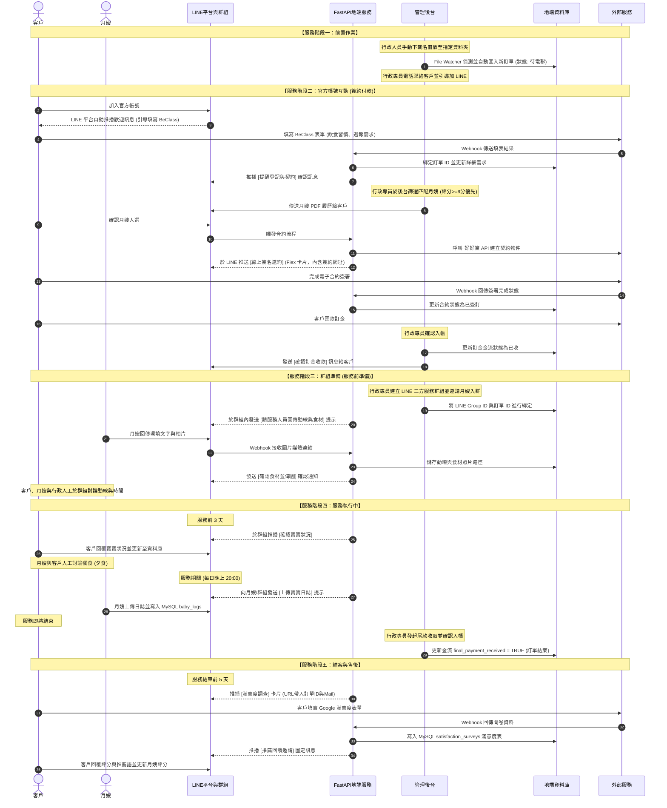
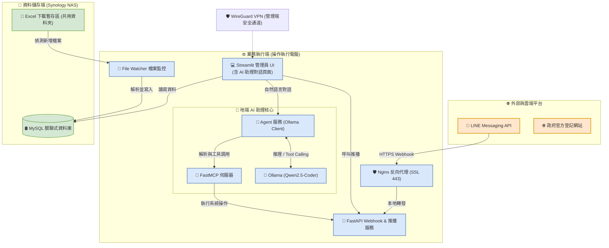

# 03_API_LINE與自動化_無損合併稿

> 狀態：第一階段無損合併稿。此檔案尚未去重、整理或裁決衝突，也不取代原始文件或 system_map.yaml。

## 來源清單

| # | 來源路徑 | 行數 | Bytes | SHA-256 |
|---:|---|---:|---:|---|
| 1 | document/API/API與Server共用整頓計畫.md | 442 | 12116 | A8ABB3DCA370E21C834172D8EBA8306635FF53051BFC265ACC090A7138C1CC63 |
| 2 | document/API/API與外部系統整合規格書.md | 537 | 15608 | 00EC740715B2E37BC4A7D8E390F94FB057B1085FA2040350158254820D8629D1 |
| 3 | document/line/設計規格書 (LINE).md | 283 | 21581 | FC26140739138B5706D7462424672573AD04E12A91335B423F4F31B7A05C0F73 |
| 4 | document/line/回覆文本.md | 51 | 3371 | B4F15E9704A414AB2B71A0EAD31071E4036E4130F9DB0E7FEAAFB2673E85C787 |
| 5 | document/自動化系統設計規格書(總覽).md | 268 | 19499 | D2AE410D2B228F075DB9564C461D0F121E99C71FFF199A6330036658CF4B3C98 |
| 6 | document/MCP+Agent.md | 360 | 16175 | 5601A00B6CFEB1E6C10A247395A04770F98B030489AED5AEBF0F7C381B8F3320 |

## 原文完整收錄

<!-- BEGIN SOURCE 1: document/API/API與Server共用整頓計畫.md -->

### 來源 1：document/API/API與Server共用整頓計畫.md

- 原始 SHA-256：A8ABB3DCA370E21C834172D8EBA8306635FF53051BFC265ACC090A7138C1CC63

---

# API 與 Server 共用整頓計畫

## 文件目的

本文件記錄 Labor_union 管理端 API、Server 與資料查詢能力的後續整頓方向。

本計畫不屬於目前「多月嫂排班 UX 改善」Task 24 的直接施工範圍。後續必須先完成 ADAD 架構節點、依賴分析與人類 Checkpoint-1，才能修改正式程式碼。

核心目標：

1. 最大化既有 FastAPI Router、Service、query engine 與 DB infrastructure 的復用。
2. 將可安全參數化的篩選、排序與分頁收斂為共用能力。
3. 避免為不同頁面或 API 重複建立相同查詢與 transaction 邏輯。
4. 保留正式業務 API 的強型別契約、權限、ownership 與 transaction boundary。
5. 禁止把正式業務操作退化為可任意指定 table、column 或 SQL 的通用 CRUD。

---

## 已確認原則

### 1. 同一 Server 可以服務不同 API

不同 API 可以共用：

- Database connection／cursor lifecycle
- Read-only session
- Filter normalization
- Date-range validation
- Pagination
- Stable ordering
- Result serialization
- Response envelope
- Admin authentication infrastructure
- Case／assignment ownership resolver
- Availability engine
- Assignment-plan validation engine
- Schedule read／generation engine
- Assignment payroll reconciliation engine

不同 API 仍須保留各自的 request／response schema，不得全部改成 `Dict[str, Any]`。

### 2. 簡單篩選使用 GET query parameters

適用情境：

- 單一狀態
- `case_no`
- `assignment_id`
- `staff_id`
- 單一日期或簡單日期區間
- 搜尋字串
- 分頁

範例：

```http
GET /api/v1/orders?status=服務中&staff_id=12&page=1&page_size=50
```

### 3. 複雜篩選使用 POST `/search`

適用情境：

- 多個服務區段
- 多個 staff IDs
- 多組狀態
- 複合日期範圍
- Availability／lock 條件
- Partial／complete combinations
- 多條件排序與分頁

範例：

```http
POST /api/v1/caregiver-segment-availability/search
```

```json
{
  "case_no": "115000001",
  "segments": [
    {
      "start_date": "2026-08-01",
      "end_date": "2026-08-15"
    },
    {
      "start_date": "2026-08-16",
      "end_date": "2026-08-31"
    }
  ],
  "staff_ids": [10, 20, 30],
  "include_partial_matches": true,
  "page": 1,
  "page_size": 50,
  "sort": "availability"
}
```

### 4. API 傳業務參數，不傳任意 SQL identifiers

可以由 client 傳入：

- `case_no`
- `assignment_id`
- `staff_id`／`staff_ids`
- 日期與日期區間
- 預先定義的狀態 enum
- 搜尋字串
- 布林篩選條件
- 頁碼與 page size
- Server registry 已定義的 sort key
- Server registry 已定義的 resource key

只能由 Server-side registry 決定：

- 實體 table／view
- Column
- Primary key
- Projection
- JOIN
- 實際 `ORDER BY` 欄位與方向
- Editable fields
- Row-level authorization
- 是否允許 `FOR UPDATE`
- 是否允許寫入
- Transaction ownership
- Audit strategy

絕不可直接接受 client 傳入：

- 任意 table name
- 任意 column list
- 任意 SQL
- 任意 WHERE expression
- 任意 JOIN
- 任意 aggregate expression
- 任意 ORDER BY expression
- 任意 update expression
- 任意 stored procedure、schema 或 database 名稱
- 任意 cursor／transaction 選項

---

## 目標架構

```text
Client API Request
    ↓
Pydantic Request Model
    ↓
Router Authentication and Authorization
    ↓
Business Resource / Operation Key
    ↓
Server-side Resource Registry
    ↓
Domain Adapter or Existing Service
    ↓
Fixed SQL Fragments with Bound Values
    ↓
MySQL
```

禁止架構：

```text
Client table + columns + where + SQL
    ↓
Generic CRUD
    ↓
Formal business tables
```

### Resource Registry 建議內容

```python
@dataclass(frozen=True)
class ResourceAdapter:
    resource: str
    read_role: str
    write_role: str | None
    request_model: type[BaseModel]
    response_model: type[BaseModel]
    reader: Callable
    writer: Callable | None
    transaction_mode: Literal[
        "read_only",
        "service_owned",
        "caller_owned",
    ]
```

Registry 必須由 Server 靜態建立：

```python
RESOURCE_REGISTRY = {
    "case_assignments": ResourceAdapter(
        resource="case_assignments",
        read_role="admin_viewer",
        write_role=None,
        reader=list_case_schedule_assignments,
        transaction_mode="read_only",
        request_model=CaseAssignmentSearchRequest,
        response_model=CaseAssignmentSearchResponse,
    ),
    "assignment_schedule": ResourceAdapter(
        resource="assignment_schedule",
        read_role="admin_viewer",
        write_role="admin_manager",
        reader=get_assignment_schedule,
        writer=adjust_assignment_schedule_day,
        transaction_mode="service_owned",
        request_model=AssignmentScheduleRequest,
        response_model=AssignmentScheduleResponse,
    ),
}
```

必要限制：

1. Resource 使用 enum 或 `Literal`，不接受任意 table name。
2. Adapter 固定綁定既有 Service，不由 request 決定函式或 SQL。
3. Filters 由各自 Pydantic model 驗證。
4. Table、column 與 projection 只來自 Server registry。
5. 所有資料值使用 DB parameter binding。
6. 每個 write adapter 明確宣告 transaction ownership。
7. 跨表操作必須呼叫正式 domain orchestration Service。
8. Registry 不得成為可由 API 任意串接 internal helpers 的 service locator。

---

## 現況盤點

### Data Browser

目前正式註冊：

- `api/routes/data_browser_admin.py`
- 具有 `require_system_admin`
- 使用 Server-side table allowlist
- 財務、排班與 assignment 等高風險表維持 read-only
- 正式更新寫入 audit

目前重複候選：

- `api/routes/data_browser.py`
- 與正式 Router 使用相同 `/api/v1/admin/data-browser` prefix
- 沒有相同的 system-admin dependency
- 目前未由 `api.main` 註冊

後續方向：

1. 保留有 system-admin 認證與 audit 的正式 Router。
2. 將未註冊舊 Router 列為退役候選。
3. 新增重複 `path + method` 啟動檢查或測試。
4. Data Browser 僅作 system-admin 管理工具，不作正式業務寫入入口。

### Registry 漂移

目前 table／primary-key／editable-column 規則分散於：

- `services/data_browser_admin_schema_service.py`
- `services/data_browser_admin_service.py`
- `services/db_service.py`

已觀察到不同 allowlist、editable columns 與 read-only 定義可能不一致。

後續方向：

1. 建立單一 `DataBrowserResourceRegistry`。
2. Registry 同時擁有：
   - resource key
   - physical table／view
   - primary key
   - projection
   - allowed filters
   - allowed sort keys
   - editable columns
   - read/write role
   - audit policy
3. Generic executor 必須再次驗證 registry，不只依賴 Router 或上層 Service。
4. 避免廣泛使用 `SELECT *`，改由 registry 或 domain query 定義 projection。
5. 增加 bounded pagination 與 stable ordering。

### Generic update 風險

`services/db_service.py::update_table_row` 會動態組合 table 與 column identifiers。

目前正式 Data Browser 呼叫鏈有上層 allowlist，因此不是已確認的直接漏洞；但底層函式本身不能視為安全的通用 public write API。

後續方向：

1. Generic executor 自身必須 fail-closed 驗證 table、primary key 與 editable columns。
2. 禁止其他 Router 直接將 client updates 傳入該函式。
3. 正式業務表的更新必須經 domain Service。

---

## 多月嫂 UX 可共用能力

### 適合共用 read/query infrastructure

- 案件 assignment 清單
- Assignment schedule read
- Staff monthly calendar
- Segment availability
- Matching-plan read
- 休假／代班事件摘要
- Assignment payroll reconciliation read
- UI capability flags

### 適合共用 assignment-plan engine

- 分頁一：順延／代班 preview
- 分頁三：區段新增、移除、換人、改期 preview
- 對應 Apply 的 rules validation
- Gap／overlap
- 歷史 ownership 保護
- 最多四個有效 assignments

對外 API 必須維持不同強型別 request：

```text
LeaveSubstitutionPreviewRequest
StaffingPlanPreviewRequest
```

兩者可正規化為同一個內部 command：

```text
AssignmentPlanCommand
```

不得對外暴露萬用 `operation_kind + Dict[str, Any]` 契約。

### 不可通用 CRUD 化

- Assignment transition
- 日期鎖 acquisition／release／cancellation／conversion
- 休假、順延與代班套用
- Matching-plan version 建立
- 訂單取消
- Staff payment 建立
- Payroll reconciliation 寫入門禁
- 月結與付款交易
- Append-only events

這些可以共用 mutex、event writer、query helper、reconciliation 與 transaction helper，但必須保留各自的 domain Service 與 API contract。

---

## 認證與授權整頓

### 現況風險

目前未確認 `api.main` 存在涵蓋全部管理端業務 API 的全域管理員認證 middleware。

已觀察到部分 Orders、assignment schedule、rest-date、matching 與 staff-payment Router 沒有一致的 `Depends(require_...)` 宣告。

CORS 不是身分驗證，不能作為 API authorization。

### 建議方向

1. 管理端 read Router 統一加入 `admin_viewer` dependency。
2. 管理端 write Router 統一加入 `admin_manager` 或更精確 capability。
3. Data Browser 維持 `system_admin`。
4. 優先以 Router-level dependency 套用共通認證，不依賴每個 endpoint 個別記得加入。
5. 建立測試列舉所有管理端 operation，確認 read／write／system-admin 權限分類。
6. 保留既有正式 header 契約，不以 CORS 或 UI 隱藏取代認證。

此項屬跨 API 架構整頓，不得未經獨立 ADAD 節點與 Checkpoint 混入多月嫂 UI Task。

---

## 建議後續 ADAD 節點

以下只是 backlog 建議，尚未建立正式節點：

### 1. DataBrowserResourceRegistry

目標：

- 收斂 table、primary key、projection、editable fields、read-only 與 audit 規則。
- Generic executor 內層再次 fail-closed。

### 2. LegacyDataBrowserRouterRetirement

目標：

- 退役未註冊且缺少 system-admin dependency 的舊 Data Browser Router。
- 防止相同 `path + method` 被重複註冊。

### 3. AdminAPIAuthorizationBoundary

目標：

- 統一管理端 Router 的 viewer／manager／system-admin dependency。
- 建立完整 operation inventory 與認證測試。

### 4. SharedReadQueryInfrastructure

目標：

- 收斂 pagination、filter normalization、stable ordering 與 deterministic serialization。
- Domain Service 仍負責固定 projection、JOIN、ownership 與 response schema。

### 5. AssignmentPlanCommandNormalization

目標：

- 將不同強型別 API request 正規化成共用 assignment-plan command。
- Preview／Apply 共用現有 assignment rules，不重複實作 gap、overlap、歷史與四段上限。

---

## 驗收原則

每個正式整頓節點至少需證明：

1. Client 無法傳入任意 table、column、JOIN、WHERE 或 SQL。
2. 所有資料值使用 parameter binding。
3. Registry 未登記 resource、filter 或 sort key 時 fail-closed。
4. Page size 有明確上限。
5. Stable ordering 可重現。
6. Read／write／system-admin 權限分類完整。
7. Generic executor 與上層 Service 都執行 allowlist 防護。
8. 正式業務寫入仍經 domain Service。
9. 跨表 operation 保留既有 transaction、mutex、idempotency 與 audit/event-last。
10. 不新增第二套 assignment、schedule、availability、lock、payroll 或 payment engine。
11. 既有 API 相容性有 focused tests。
12. 未註冊舊 Router 不可被誤掛載。

---

## 目前決策

1. Task 24 暫不施工。
2. 先以既有 API、Router 與 Service 最大復用原則重排 Task 24–35。
3. 本整頓計畫獨立於多月嫂 UX 主線，除非某項是主線的直接阻塞，不得偷偷擴入目前 Task。
4. 後續若正式啟動本計畫，必須先讀取最新 SSOT、API map、Service map、實際 server registration、Task snapshots 與工作區狀態。
5. 不得只依本文件直接修改程式碼；本文件是規劃依據，不是 Checkpoint 授權。

---

<!-- END SOURCE 1: document/API/API與Server共用整頓計畫.md -->

<!-- BEGIN SOURCE 2: document/API/API與外部系統整合規格書.md -->

### 來源 2：document/API/API與外部系統整合規格書.md

- 原始 SHA-256：00EC740715B2E37BC4A7D8E390F94FB057B1085FA2040350158254820D8629D1

---

# API 與外部系統整合規格書

本規格書基於 [[自動化系統設計規格書(總覽)]]、[[設計規格書 (LINE)]] 與 [[設計規格書(Streamlit UI)]]，定義地端後端 (FastAPI) 與管理端 UI (Streamlit) 之間、以及與外部第三方平台（LINE Platform、BeClass、好好簽 Breezysign）之介面對接標準與 API 詳細 Payload 格式。

---

## 1. 安全防護與身份驗證規範

為了確保地端私有資料與外部 API 對接的安全性，系統採行以下驗證機制：

### 1.1 內部 API 驗證 (FastAPI <--> Streamlit UI)
* **機制**：所有內部管理端 API 皆須在 HTTP Header 中攜帶安全金鑰。
* **Header 格式**：`X-API-Key: ${ADMIN_API_TOKEN}`。
* **安全性**：`ADMIN_API_TOKEN` 由地端 `.env` 檔案配置，未帶金鑰或金鑰錯誤時，API 拒絕連線並回傳 `HTTP 401 Unauthorized`。

### 1.2 LINE Webhook 簽章驗證 (FastAPI <--> LINE Platform)
* **機制**：FastAPI Webhook 服務必須驗證請求是否真正來自 LINE 官方伺服器。
* **驗證步驟**：
  1. 取得 Request Header 中的 `x-line-signature`。
  2. 使用地端儲存的 `LINE_CHANNEL_SECRET` 對整個 Request Body（Raw Bytes）進行 HMAC-SHA256 運算。
  3. 將計算出的 Signature 進行 Base64 編碼，比對是否與 `x-line-signature` 一致。不一致時回傳 `HTTP 400 Bad Request`。

### 1.3 外部 Webhook 存取權限 (FastAPI <--> BeClass / 好好簽)
* **機制**：第三方平台發送 Webhook 到地端時，需在 Path 中攜帶動態產生的 UUID Token 或是驗證 Header，以防止惡意探針與重放攻擊。
* **端點範例**：`/api/v1/webhooks/beclass?token=${BECLASS_WEBHOOK_TOKEN}`。

---

## 2. 內部 RESTful API 規格 (FastAPI 與 Streamlit 溝通)

內部 API 預設基礎 URL：`https://localhost:8000/api/v1` (Nginx 本地轉發)。

### 2.1 儀表板與異常資料隔離 (Dashboard & Anomalies)

#### (1) 取得未處理異常資料列表
* **端點與方法**：`GET /anomalies`
* **Request Headers**：`X-API-Key: ******`
* **Response (200 OK)**：
  ```json
  {
    "status": "success",
    "count": 2,
    "data": [
      {
        "id": 1,
        "case_no": "115000001",
        "source_platform": "beclass",
        "anomaly_type": "PHONE_FORMAT_ERROR",
        "invalid_data": { "phone": "0912-34" },
        "created_at": "2026-06-29 15:00:00"
      }
    ]
  }
  ```

#### (2) 取得特定異常資料的原始 JSON
* **端點與方法**：`GET /anomalies/{id}`
* **Response (200 OK)**：
  ```json
  {
    "status": "success",
    "data": {
      "id": 1,
      "raw_payload": {
        "項次": 1,
        "查詢序號": 28755000,
        "查詢序號(案件編號)": "115000001",
        "姓名": "陳小姐",
        "行動電話": "0912-34",
        "地址": "新竹市東區和平街"
      }
    }
  }
  ```

#### (3) 手動修正異常資料並存入客戶表
* **端點與方法**：`POST /anomalies/{id}/resolve`
* **Request Body**：
  ```json
  {
    "corrected_fields": {
      "phone": "0912345678"
    }
  }
  ```
* **Response (200 OK)**：
  ```json
  {
    "status": "success",
    "message": "Anomaly resolved. Data written to clients table."
  }
  ```

#### (4) 忽略特定異常事件
* **端點與方法**：`POST /anomalies/{id}/ignore`
* **Response (200 OK)**：
  ```json
  {
    "status": "success",
    "message": "Anomaly status set to ignored."
  }
  ```

---

### 2.2 客戶與訂單管理 (Clients & Orders)

#### (1) 查詢訂單列表
* **端點與方法**：`GET /orders`
* **Query Parameters**：`status=洽談中` (可選)
* **Response (200 OK)**：
  ```json
  {
    "status": "success",
    "data": [
      {
        "id": 12,
        "case_no": "113000012",
        "name": "林小姐",
        "phone": "0988123456",
        "project_status": "洽談中",
        "due_month": "113/10/30",
        "service_days": 24
      }
    ]
  }
  ```

#### (2) 更新訂單狀態 (特別包含取消功能)
* **端點與方法**：`POST /orders/{id}/status`
* **Request Body**：
  ```json
  {
    "project_status": "訂單取消",
    "cancel_reason": "客戶因家庭因素決定自行照顧"
  }
  ```
* **Response (200 OK)**：
  ```json
  {
    "status": "success",
    "message": "Order status updated to 訂單取消."
  }
  ```

---

### 2.3 月嫂行事曆與排班管理 (Staff Schedules)

#### (1) 取得特定月嫂之排班日程時間軸
* **端點與方法**：`GET /caregivers/{caregiver_id}/schedule`
* **Response (200 OK)**：
  ```json
  {
    "status": "success",
    "caregiver_id": 5,
    "name": "陳大姐",
    "weekly_rest_days": ["Sunday"],
    "schedules": [
      {
        "id": 101,
        "type": "booking",
        "client_name": "林小姐",
        "start_date": "2026-08-10",
        "end_date": "2026-09-05",
        "status": "confirmed"
      },
      {
        "id": 102,
        "type": "buffer",
        "client_name": "林小姐 (緩衝期)",
        "start_date": "2026-09-06",
        "end_date": "2026-09-12",
        "status": "soft_hold"
      },
      {
        "id": 103,
        "type": "leave",
        "reason": "請假出國",
        "start_date": "2026-09-15",
        "end_date": "2026-09-20",
        "status": "approved"
      }
    ]
  }
  ```

#### (2) 新增月嫂排班日程 (請假/手動預排)
* **端點與方法**：`POST /caregivers/{caregiver_id}/schedule`
* **Request Body**：
  ```json
  {
    "schedule_type": "leave",
    "start_date": "2026-09-15",
    "end_date": "2026-09-20",
    "reason": "請假出國",
    "ignore_warnings": false
  }
  ```
* **Response (200 OK / 409 Conflict)**：
  * *成功寫入*：`200 OK`，回傳成功。
  * *衝突阻擋 (Hard Block)*：`409 Conflict` (如與實派案件或固定休假重疊)：
    ```json
    {
      "status": "error",
      "error_code": "SCHEDULE_CONFLICT_HARD",
      "message": "此請假期間與 8/18-8/25 的林小姐實派案重疊，禁止排班。"
    }
    ```
  * *衝突警告 (Soft Warning)*：`409 Conflict` (與預排或緩衝期重疊)：
    ```json
    {
      "status": "warning",
      "error_code": "SCHEDULE_CONFLICT_SOFT",
      "message": "此請假期間與王小姐預排案的7天緩衝期重疊。是否忽略警告強行排班？"
    }
    ```

---

### 2.4 雙向確認媒合流程 (Smart Matching)

#### (1) 篩選合格月嫂列表
* **端點與方法**：`POST /matching/search-caregivers`
* **Request Body**：
  ```json
  {
    "case_no": "115000001",
    "filter_no_conflict": true,
    "filter_region": true,
    "filter_special_skills": ["大寶餐專長"]
  }
  ```
* **Response (200 OK)**：
  ```json
  {
    "status": "success",
    "candidates": [
      {
        "caregiver_id": 5,
        "name": "陳大姐",
        "phone": "0922111333",
        "regions": ["竹北市", "東區"],
        "skills": ["葷食", "大寶餐專長"],
        "rating": 9.5
      }
    ]
  }
  ```

#### (2) 一鍵傳送「接案意願詢問」至月嫂 LINE
* **端點與方法**：`POST /matching/ask-intent`
* **Request Body**：
  ```json
  {
    "case_no": "115000001",
    "caregiver_id": 5,
    "custom_notes": "週六需要配合加班半天"
  }
  ```
* **Response (200 OK)**：
  ```json
  {
    "status": "success",
    "message": "LINE message queued to caregiver. matching_record entry created with pending status."
  }
  ```

#### (3) 一鍵傳送「月嫂履歷卡片」至客戶 LINE
* **端點與方法**：`POST /matching/send-resume`
* **Request Body**：
  ```json
  {
    "case_no": "115000001",
    "caregiver_id": 5
  }
  ```
* **Response (200 OK)**：
  ```json
  {
    "status": "success",
    "message": "Resume card sent to client via LINE."
  }
  ```

#### (4) 一鍵傳送「電子合約簽署卡片」至雙方 LINE (好好簽 Breezysign 整合)
* **端點與方法**：`POST /matching/send-contract`
* **Request Body**：
  ```json
  {
    "case_no": "115000001",
    "caregiver_id": 5,
    "contract_details": {
      "start_date": "2026-08-10",
      "end_date": "2026-09-05",
      "daily_rate": 2000,
      "split_days": null,
      "custom_clauses": "透天服務需每日加收100元樓層費"
    }
  }
  ```
* **Response (200 OK)**：
  ```json
  {
    "status": "success",
    "breezysign_contract_id": "BS_CON_998273",
    "message": "E-Contract created in Breezysign. Signature cards sent to Client and Caregiver via LINE."
  }
  ```

---

## 3. LINE Webhook 與 Messaging API 對接規格

FastAPI webhooks 接口定義於 `POST /webhook`。

### 3.1 接收 LINE Webhook 事件

#### (1) 月嫂於 LINE 點擊「我願意接案」之 Postback 事件
* **LINE Webhook Payload 範例**：
  ```json
  {
    "destination": "Uxxxxxxxxxxxxxx",
    "events": [
      {
        "type": "postback",
        "replyToken": "nH7w4yWkg9QlIh1D6E6P8h3CIK85",
        "source": {
          "type": "user",
          "userId": "U_CAREGIVER_005_LINE"
        },
        "timestamp": 1462629479859,
        "mode": "active",
        "postback": {
          "data": "action=caregiver_accept&case_no=115000001&staff_id=5"
        }
      }
    ]
  }
  ```
* **地端處理邏輯**：
  1. Webhook 解析 postback data 參數：`action=caregiver_accept`、`case_no=115000001`。
  2. 搜尋 `matching_records` 資料表，將狀態更新為 `caregiver_accepted = 1`。
  3. 回傳 LINE 官方帳號訊息：「感謝您的回覆！我們已將您的意願同步給行政專員，待客戶確認後將會為您發送合約書。」

---

### 3.2 發送 LINE Flex Message 模板 (JSON 結構)

#### (1) 月嫂接案意願詢問 Flex 卡片 (發送給月嫂)
```json
{
  "type": "bubble",
  "header": {
    "type": "box",
    "layout": "vertical",
    "contents": [
      {
        "type": "text",
        "text": "月子專案媒合意願確認",
        "weight": "bold",
        "color": "#1DB954"
      }
    ]
  },
  "body": {
    "type": "box",
    "layout": "vertical",
    "contents": [
      {
        "type": "text",
        "text": "服務對象：林小姐 (新竹竹北市)",
        "size": "sm"
      },
      {
        "type": "text",
        "text": "預估期間：2026/08/10 起 24 工作日",
        "size": "sm"
      },
      {
        "type": "text",
        "text": "特殊備註：需做大寶餐、有寵物貓",
        "size": "sm",
        "color": "#FF5555"
      }
    ]
  },
  "footer": {
    "type": "box",
    "layout": "horizontal",
    "spacing": "sm",
    "contents": [
      {
        "type": "button",
        "style": "primary",
        "color": "#1DB954",
        "action": {
          "type": "postback",
          "label": "我願意接案",
          "data": "action=caregiver_accept&case_no=115000001&staff_id=5"
        }
      },
      {
        "type": "button",
        "style": "secondary",
        "action": {
          "type": "postback",
          "label": "無意願",
          "data": "action=caregiver_decline&case_no=115000001&staff_id=5"
        }
      }
    ]
  }
}
```

---

## 4. BeClass 報名問卷對接 Webhook 規格

當客戶填寫完成 BeClass 表單後，BeClass 發送 Webhook 至地端端點：`POST /api/v1/webhooks/beclass`。

### 4.1 Webhook Payload 格式
```json
{
  "form_id": "30525d069a79b3597af1",
  "query_no": "28755000",
  "case_no": "115000001",
  "submit_time": "2026-05-07 20:34:19",
  "personal_data": {
    "name": "陳小姐",
    "gender": "女",
    "email": "test_3059@example.com",
    "birth_year": 1998,
    "birth_month": 10,
    "birth_day": 22,
    "phone": "0912-34-5678",
    "tel": "03-5415899",
    "ext": "",
    "city": "新竹市",
    "zip_code": "300",
    "address": "新竹市東區和平街335號"
  },
  "questionnaire": {
    "月子餐點調理喜好/飲食習慣：": "葷食",
    "可以接受中藥補品：□茶飲 □藥飲 □藥膳": "Y",
    "2．餐飲含酒比例：": "無法接受",
    "3．料理用油：(可接受種類)": "□苦茶油(前兩週)、□麻油(後兩週)",
    "特殊照護時應注意事項：": "大寶1歲需協助照顧",
    "提供服務人員轎車停車位": "有"
  }
}
```

### 4.2 後端處理與 Data Pipeline 觸發
1. **驗證與清洗**：對 `personal_data.phone` 等核心欄位進行強校驗，若格式不合規，寫入 `data_anomaly_events`，狀態設為 `pending`。
2. **寫入 BeClass 記錄**：若校驗通過，將 `personal_data` 核心欄位寫入 `beclass_records`，並將整個 `questionnaire` 轉為 JSON 字串存入 `survey_details`。
3. **推播排程**：在 `line_push_tasks` 插入 `REMIND_REGISTRATION` 的 `pending` 任務，通知客戶「提醒登記與契約」完成填表之確認訊息。

---

## 5. 好好簽 (Breezysign) API 電子合約整合規格

為了自動化合約簽署，地端後端需與台灣的好好簽 (Breezysign) API 進行整合。

### 5.1 創建合約文件 (Create Contract)
* **API 端點**：`POST https://api.breezysign.com/v1/documents`
* **Headers**：
  * `Authorization: Bearer ${BREEZYSIGN_API_TOKEN}`
  * `Content-Type: application/json`
* **Request Body**：
  ```json
  {
    "template_id": "BS_TEMPLATE_UNION_METH",
    "document_name": "HC115628 到宅坐月子服務合約書",
    "variables": {
      "client_name": "陳小姐",
      "caregiver_name": "陳大姐",
      "start_date": "2026-08-10",
      "end_date": "2026-09-05",
      "daily_rate": "2000",
      "extra_clauses": "透天服務需每日加收100元樓層費"
    },
    "signers": [
      {
        "role": "client",
        "name": "陳小姐",
        "email": "test_3059@example.com",
        "phone": "0912345678",
        "sign_auth_type": "sms"
      },
      {
        "role": "caregiver",
        "name": "陳大姐",
        "email": "c_5873@example.com",
        "phone": "0922111333",
        "sign_auth_type": "sms"
      }
    ]
  }
  ```
* **Response (201 Created)**：
  ```json
  {
    "document_id": "BS_CON_998273",
    "status": "pending_signature",
    "signing_urls": {
      "client": "https://breezysign.com/s/9a12b3c4d5",
      "caregiver": "https://breezysign.com/s/5f6g7h8i9j"
    }
  }
  ```

---

### 5.2 監聽合約簽署狀態 Webhook

當客戶與月嫂完成線上簽章時，好好簽會發送 POST Webhook 到 FastAPI 的對接端點：`POST /api/v1/webhooks/breezysign`。

#### (1) Webhook Payload (合約簽署完成)
```json
{
  "event_type": "document.completed",
  "document_id": "BS_CON_998273",
  "completed_at": "2026-06-29T15:30:00Z",
  "download_url": "https://breezysign.com/download/BS_CON_998273.pdf"
}
```

#### (2) 地端自動化排班回寫邏輯
當後端接收到合約 `document.completed` 狀態時，執行以下事務 (Transaction)：
1. 更新 `orders` 表的合約狀態為 `已簽訂`，並寫入合約 PDF 下載連結。
2. 讀取對應月嫂的主表及休假偏好 (`weekly_rest_days`)。
3. 計算服務天數，自 `start_date` 開始遞增，排除固定休假日，得出實派結束日。
4. 在 `staff_bookings` (已被預約/排班區間表) 寫入實派排班紀錄。
5. 在該服務期結束日後，自動寫入 7 天的橘色緩衝預留期。

---

<!-- END SOURCE 2: document/API/API與外部系統整合規格書.md -->

<!-- BEGIN SOURCE 3: document/line/設計規格書 (LINE).md -->

### 來源 3：document/line/設計規格書 (LINE).md

- 原始 SHA-256：FC26140739138B5706D7462424672573AD04E12A91335B423F4F31B7A05C0F73

---

# LINE 平台與客服系統 

本文件基於 [[自動化系統設計規格書(總覽)]] 的規劃，針對 **LINE 平台與客服系統** 的功能細節、API 規格、對話流、Rich Menu 佈局與 RAG 檢索邏輯進行詳細定義。

---

## 1. 月子媒合服務流程詳細描述

本節詳述使用者在月子媒合服務生命週期中，各個階段在 LINE 平台與相關系統上的業務流程，並特別標記出需要串接外部資料與資料庫的關鍵節點。

### 一、 服務階段一：前置作業 (地端與人工)
1.  **地端監控與資料匯入**：
    行政人員手動下載最新名冊檔案並放置於地端指定資料夾，地端監控服務 (File Watcher) 偵測到新檔案後，自動啟動 Data Pipeline 將資料解析並同步更新至地端 MySQL 資料庫。
    *   🏷️ **[資料庫寫入]** `MySQL: orders` (建立新登記訂單，狀態預設為「洽談中」)
    *   🏷️ **[外部資料串接]** `手動下載名冊 ➔ 檔案變更偵測載入`
2.  **人工聯絡與引導**：
    公會行政專員由後台取得新訂單資料後，主動以電話聯絡客戶進行初步需求核對，確認基本狀況，並指引客戶搜尋或掃碼加入公會的 **LINE 官方帳號**。
    *   🏷️ **[資料庫讀取]** `MySQL: orders` (提取新登記客戶的電話與需求明細)

### 二、 服務階段二：官方帳號互動 (簽約與付款)
3.  **歡迎與填表引導**：
    客戶添加官方帳號（或解除封鎖）後，由 LINE 平台自動推播已在官方帳號後台設定好的歡迎訊息 (Greeting Message)，此步驟不需經由地端 API 呼叫發送。
    *   **BeClass 表單填寫引導**：歡迎訊息將引導客戶線上填寫 BeClass 表單，以確認飲食習慣、詳細訂單資料與週報需求。
    *   *註：表單跳轉入口目前規劃雙方案（方案 A：直接內嵌於歡迎文字訊息中；方案 B：設計在 Rich Menu 的常駐按鈕中），規格設計上均予保留。*
    *   🏷️ **[外部資料串接]** `BeClass API / Webhook` (客戶送出表單後，系統將資料解析並回填)
    *   🏷️ **[資料庫更新]** `MySQL: orders` (串接 BeClass 表單更新詳細需求、建立週報配置與飲食習慣)
4.  **媒合簽約與收款流程**：
    *   **資料確認**：系統發送 `[提醒登記, 契約]` 固定訊息，與客戶進行前置資料核對。
        *   🏷️ **[資料庫讀取]** `MySQL: orders` (提取客戶訂單 ID、登記資訊與姓名進行對話驗證)
    *   **履歷傳送**：管理者從後台篩選並傳送符合條件的月嫂資料（以 PDF 履歷檔案形式發送至客戶 LINE 視窗）。
        *   🏷️ **[資料庫讀取]** `MySQL: workers` (讀取匹配成功的月嫂基本資料、評分與履歷 PDF 檔案路徑)
    *   **合約發送與編輯**：客戶確認人選後，行政人員於管理後台展開編輯面板，調整日期、拆分天數等客製化內容，點選送出後，系統串接好好簽 API 生成簽章物件。
        *   🏷️ **[資料庫讀取/更新]** `MySQL: orders` (讀取案件明細，並將好好簽產生的合約 ID 綁定至訂單)
        *   🏷️ **[外部資料串接]** `好好簽 API` (建立簽署任務並取得專屬連結)
    *   **線上簽約**：系統發送 `[線上簽名邀約]` 固定訊息，引導客戶完成線上合約簽署。
        *   🏷️ **[外部資料串接]** `電子簽章系統 API` (監聽合約簽署狀態，如已簽署則自動回傳)
        *   🏷️ **[資料庫更新]** `MySQL: orders` (更新合約簽署狀態為 `已簽訂`)
    *   **訂金收款與訂單成立**：客戶匯款後，系統在確認款項入帳後，發送 `[確認訂金收款]` 固定訊息給客戶，完成簽約對接。
        *   🏷️ **[資料庫更新]** `MySQL: orders` (更新狀態為 `訂單成立 (Confirmed)`)

### 三、 服務階段三：群組準備 (服務前準備)
5.  **月嫂入群**：
    公會行政專員建立「客戶、月嫂、公會三方專屬 LINE 服務群組」，並協助將媒合成功的月嫂邀請入群。
    *   🏷️ **[資料庫更新]** `MySQL: orders` (綁定此案件的 **LINE Group ID**，作為群組自動推播的唯一識別)
6.  **環境與食材調查**：
    月嫂加入群組後，系統自動在群組發送 `[請服務人員回傳動線與食材]` 固定訊息。
7.  **食材確認與討論**：
    月嫂依照指示，上傳家中的廚工作動線照片及食材準備照片，並發送 `[確認食材並傳圖]` 通知；三方於群組中進行人工討論，確認動線及實際服務時間。
    *   🏷️ **[資料庫寫入]** `MySQL: project_files / project_preparations` (儲存月嫂上傳的動線照片與食材圖片的 LINE 雲端媒體連結)

### 四、 服務階段四：服務執行中 (服務期間)
8.  **寶寶狀況確認 (服務前 3 天)**：
    在正式服務開始前 3 天，系統自動於群組推播 `[確認寶寶狀況]` 固定訊息，詢問新生兒出院及身體狀況。
    *   🏷️ **[資料庫寫入]** `MySQL: orders` (寫入或更新新生兒出院日與身體狀況備註)
9.  **餐食與日誌追蹤 (服務期間)**：
    *   月嫂與客戶人工討論每日月子餐食（夕食）調配。
    *   服務期間內，月嫂每日需依指示發送 `[上傳寶寶日誌]` 固定訊息，回報嬰兒照顧日誌。
        *   🏷️ **[資料庫寫入]** `MySQL: baby_logs` (每日儲存月嫂填報的寶寶大小便、飲食量、睡眠等照顧日誌數據)
10. **收取尾款**：
    服務即將結尾時，由系統或管理端發起通知，引導客戶支付服務尾款，並確認收款完成。
    *   🏷️ **[資料庫更新]** `MySQL: orders` (更新金流狀態為服務完成)

### 五、 服務階段五：結案與售後 (結案階段)
11. **滿意度調查 (結案前 5 天)**：
    在服務結束前 5 天，系統自動推播 `[滿意度調查]` 固定訊息，引導客戶填寫 Google 滿意度問卷。
    *   *註：為簡化開發，系統直接發送固定的 Google 表單網址，並在 LINE 訊息中提醒客戶自行填寫訂單 ID（群組名稱會被修改為訂單 ID，客戶可直接抬頭看）。*
    *   🏷️ **[資料庫寫入]** `MySQL: satisfaction_surveys` (當客戶填寫表單後，手動或透過簡單資料庫工具導入)
12. **推薦與回饋**：
    系統推播 `[推薦回饋邀請]` 固定訊息，引導客戶為月嫂填寫評分，並徵詢是否願意公開推薦。
    *   🏷️ **[資料庫更新]** `MySQL: workers / ratings` (更新該月嫂的平均評分與客戶推薦語，作為後續優先媒合的依據)

---

## 2. LINE 自動化流程需求與狀態追蹤表

本表用於追蹤月子媒合服務生命週期中，各項自動固定訊息與手動/後台動作的開發與技術實作進度，並將其與 **1. 月子媒合服務流程詳細描述** 中的各個服務階段與步驟進行規格上的嚴格連動對照。

### 2.1 自動固定訊息需求 (11項)

| 需求編號 | 需求名稱 | 觸發時機與機制 | 接收對象 | 優先級 | 對應流程步驟 | 備註與關聯模組 |
| :--- | :--- | :--- | :---: | :---: | :---: | :--- |
| **REQ-AUTO-001** | 加入好友歡迎訊息 | 使用者首次加 LINE 或解除封鎖時，由 LINE 平台自動推送。 | 客戶 | **高** | 服務階段二 第 3 步 | LINE 後台直接設定，不經由地端 API 呼叫 |
| **REQ-AUTO-002** | 提醒登記與契約通知 | 客戶填寫 BeClass 表單完成，經系統 Webhook 自動觸發。 | 客戶 | **高** | 服務階段二 第 3 步 | 用於核對基本需求，資料庫讀取驗證 |
| **REQ-AUTO-003** | 契約發送通知 | 管理端在後台編輯並確定發送合約時觸發。 | 客戶 | **高** | 服務階段二 第 4 步 | 透過 LINE 推播告知合約已發送，提醒前往簽署 |
| **REQ-AUTO-004** | 線上簽名邀約卡片 | 合約 Email 送出後，系統自動於 LINE 推送 Flex 卡片。 | 客戶 | **高** | 服務階段二 第 4 步 | 內嵌電子簽章網址，監聽簽署 Webhook 狀態 |
| **REQ-AUTO-005** | 確認訂金收款通知 | 行政專員於後台確認入帳並更新狀態時觸發。 | 客戶 | **高** | 服務階段二 第 4 步 | 更新訂單金流狀態為已收訂金 |
| **REQ-AUTO-006** | 回傳動線與食材提示 | 行政專員將月嫂加入服務群組後，系統自動於群組內推播。 | 服務群組 | **中** | 服務階段三 第 6 步 | 針對月嫂發送，引導其回報工作環境與食材 |
| **REQ-AUTO-007** | 確認食材並傳圖提醒 | 月嫂回覆環境文字後 (或服務前一週) 由系統自動推播。 | 服務群組 | **中** | 服務階段三 第 7 步 | 引導月嫂上傳食材照片，儲存照片連結 |
| **REQ-AUTO-008** | 確認寶寶狀況詢問 | 正式服務開始前 3 天早上 9:00 由系統定時推播。 | 服務群組 | **高** | 服務階段四 第 8 步 | 針對客戶發送，確認新生兒出院日與健康狀況 |
| **REQ-AUTO-009** | 上傳寶寶日誌提醒 | 服務期間內，每日晚上 20:00 由系統定時推播。 | 服務群組 | **中** | 服務階段四 第 9 步 | 針對月嫂發送，內含每日照顧日誌填報入口 |
| **REQ-AUTO-010** | 滿意度調查 Google 表單 | 服務結案前 5 天由系統定時推播。 | 客戶 | **高** | 服務階段五 第 11 步 | 發送固定 Google 表單網址，提醒客戶查看群組名並填寫訂單 ID |
| **REQ-AUTO-011** | 推薦與回饋邀請 | 滿意度調查填寫完成後觸發，或服務結案當日定時發送。 | 客戶 | **低** | 服務階段五 第 12 步 | 引導客戶評分，回寫月嫂平均分數與推薦語 |

### 2.2 手動 / 後台動作需求 (10項)

| 需求編號 | 需求名稱 | 操作機制與功能描述 | 執行角色 | 優先級 | 對應流程步驟 | 備註與關聯模組 |
| :--- | :--- | :--- | :---: | :---: | :---: | :--- |
| **REQ-MAN-001** | 政府表單資料同步 | 檔案監測偵測放置之 Excel 變更，同步建立 MySQL 訂單。 | 系統 | **高** | 服務階段一 第 1 步 | File Watcher / MySQL 資料庫 |
| **REQ-MAN-002** | 電話聯絡與引導加 LINE | 行政專員撥打電話核對需求，並引導客戶掃碼加入 LINE。 | 行政人員 | **高** | 服務階段一 第 2 步 | 客戶關係前置作業 |
| **REQ-MAN-003** | BeClass 客戶資料確認 | 檢視客戶填寫的需求資料是否齊全，進行後台建檔。 | 行政人員 | **高** | 服務階段二 第 3 步 | 後台管理 UI / MySQL |
| **REQ-MAN-004** | 篩選並傳送月嫂履歷 | 後台自動匹配符合條件月嫂，一鍵推播 PDF 履歷至 LINE。 | 行政人員 | **高** | 服務階段二 第 4 步 | 優先篩選評分 **9 分以上** 月嫂 |
| **REQ-MAN-005** | 月嫂加入三方服務群組 | 手動建立 LINE 服務群組，並將月嫂與客戶邀請入群。 | 行政人員 | **中** | 服務階段三 第 5 步 | 將群組 ID 與 MySQL 訂單進行綁定 |
| **REQ-MAN-006** | 群組人工討論動線食材 | 於群組內審查月嫂回傳之相片，並人工協調服務細節。 | 三方角色 | **中** | 服務階段三 第 7 步 | 人工確認動線及實際服務時間 |
| **REQ-MAN-007** | 月嫂餐食討論 | 於群組中商議月嫂每日月子餐食 (夕食) 的烹調細節。 | 客戶/月嫂 | **中** | 服務階段四 第 9 步 | 人工對話細節 |
| **REQ-MAN-008** | 收取尾款與確認結案 | 確認尾款入帳後更新後台訂單金流狀態，完成收款。 | 行政人員 | **高** | 服務階段四 第 10 步 | 更新資料庫 final_payment_received = TRUE |
| **REQ-MAN-009** | 例外人工客服處理 | 人工介入催款、休假請假協調、時程變更、車位協調等。 | 行政人員 | **高** | 非線性隨時觸發 | 後台客服流轉 / 4 大人工處理事項 |
| **REQ-MAN-010** | 媒合最終派案指派 | 同時意願詢問多位月嫂後，由專員老師決定最終指派人選。 | 指派老師 | **高** | 服務階段二 第 4 步 | 更新 MySQL 訂單中月嫂的關聯狀態 |

---

## 3. 端到端資料流與系統時序圖

本節以「月子媒合服務生命週期」為主軸，繪製客戶、月嫂、LINE平台與群組、FastAPI後端、後台管理端、地端資料庫與外部服務之間在各個服務階段的端到端資料傳遞與系統觸發時序圖：



---

## 4. LINE 官方帳號與 Rich Menu 配置設計(未定案)

常駐於官方帳號底部的 Rich Menu，寬度採預設的 `2500x1686` 像素（6 格版面），版面佈局規劃如下：

```
+------------------+------------------+------------------+
|                  |                  |                  |
|    A. 公會簡介   |   B. 常見問題    |   C. 托育登記    |
|   (引導對話 FAQ) |   (引導對話 FAQ) |   (外部政府連結) |
|                  |                  |                  |
+------------------+------------------+------------------+
|                  |                  |                  |
|    D. 繳費專區   |   E. 月嫂配對    |   F. 聯絡公會    |
|   (引導對話/表單) |   (引導對話/表單) |   (點擊撥號/聯絡) |
|                  |                  |                  |
+------------------+------------------+------------------+
```

### 4.1 區塊動作定義

| 區塊 | 名稱 | 觸發動作類型 | 具體執行內容 |
| :--- | :--- | :--- | :--- |
| **A** | **公會簡介** | `message` | 發送文字：`公會服務介紹` (觸發 RAG 標準回覆) |
| **B** | **常見問題** | `message` | 發送文字：`常見問題選單` (回覆常見分類訊息) |
| **C** | **托育登記** | `uri` | 開啟 LINE 內建瀏覽器，導向新竹市政府托育登記頁面：<br/> `https://hsinchu-nanny.hccg.gov.tw/` |
| **D** | **繳費專區** | `message` | 發送文字：`如何繳交會費` (觸發繳費引導流) |
| **E** | **月嫂配對** | `message` | 發送文字：`我想找月嫂` (引導填寫登記或填寫 BeClass 表單雙方案) |
| **F** | **聯絡公會** | `uri` | 撥打公會電話：`tel:035xxxxxxx` 或開啟官方地圖 |

---

## 5. FastAPI Webhook 與外部系統整合介面(未定案)

地端後端需暴露一條對外 API 接收 LINE 的 Webhook 事件。

### 5.1 服務端點
*   **Protocol**: HTTPS (Port 443 由 Nginx 做反向代理並配置 SSL)
*   **Path**: `/webhook`
*   **Method**: `POST`

### 5.2 安全防護 (X-Line-Signature 驗證)
每次收到 Webhook 請求時，FastAPI 必須：
1.  從 HTTP Header 中取得 `x-line-signature`
2.  使用 `LINE_CHANNEL_SECRET` 對 Request Body 計算 HMAC-SHA256 簽章。
3.  比對兩者是否一致。若不一致，回傳 `HTTP 400 Bad Request` 並阻擋連線。

### 5.3 異常與非文字訊息處理
*   **貼圖 (Sticker)**、**圖片 (Image)**、**語音 (Audio)**、**影片 (Video)**：
    *   系統不進行語意分析。
    *   預設回覆：「感謝您的訊息！若有公會業務相關問題，請直接輸入文字，或點擊下方選單進行查詢。如有緊急事宜，請直接來電公會。」

---

## 6. RAG 知識庫與 FAQ 例外人工客服流(未定案)

為防止 AI 幻覺，本專案採用 **基於相似度比對的嚴格 RAG FAQ 回覆機制**，不使用大型語言模型（LLM）進行隨機生成。

### 6.1 知識庫資料結構 (MySQL)
FAQ 知識庫存於 MySQL 中，結構如下：

```sql
CREATE TABLE faq_knowledge (
    id INT AUTO_INCREMENT PRIMARY KEY,
    category VARCHAR(50) NOT NULL,          -- 問題分類，例如：入會申請、繳費、福利互助
    standard_question TEXT NOT NULL,       -- 標準問題 (用於向量化與比對)
    standard_answer TEXT NOT NULL,         -- 標準答案 (回覆給使用者的文字)
    redirect_url VARCHAR(255),             -- 選擇性附加連結 (如申請書下載地址)
    created_at TIMESTAMP DEFAULT CURRENT_TIMESTAMP,
    updated_at TIMESTAMP DEFAULT CURRENT_TIMESTAMP ON UPDATE CURRENT_TIMESTAMP
);
```

### 6.2 向量資料庫與相似度計算 (ChromaDB)
*   **Embedding Model**: 採用地端輕量化模型 `sentence-transformers/all-MiniLM-L6-v2` (向量維度 384) 或是串接外部 API。
*   **向量更新機制**: 當管理員在 Streamlit 增刪改 `faq_knowledge` 時，系統自動觸發 Data Pipeline，將 `standard_question` 重新向量化並同步至 ChromaDB。
*   **相似度閾值 (Similarity Threshold)**:
    *   預設值為 `0.75` (Cos-Similarity)。
    *   **比對分數 >= 0.75**: 系統判定為「已命中標準問題」，取出資料庫中的 `standard_answer` 回覆。
    *   **比對分數 < 0.75**: 系統判定為「未命中」，回覆：「抱歉，我無法完全理解您的問題。以下是可能對您有幫助的常用資訊：[常見問題選單]；或您也可以輸入『聯絡專員』，我們將有專人為您服務。」

---

## 7. 安全防護與隱私規範

1.  **資料隱私**：LINE Webhook 接收到的所有使用者 `userId` 與對話紀錄，均不得傳輸至 any 未授權的第三方雲端分析平台（除了 Embedding API 呼叫，且 Embedding API 只傳送提問文字，不包含 `userId` 等個資）。
2.  **速率限制 (Rate Limiting)**：FastAPI 對單一 `userId` 設定限流，每分鐘限制最多 30 次請求，防範惡意刷訊息造成地端伺服器資源過載 or API 費用暴增。
3.  **錯誤嘗試紀錄**：低於相似度閥值的提問會記錄在 `unresolved_questions` 資料表中，供管理員於 Streamlit 後台定期檢視，以手動補齊 FAQ 知識庫。

---

<!-- END SOURCE 3: document/line/設計規格書 (LINE).md -->

<!-- BEGIN SOURCE 4: document/line/回覆文本.md -->

### 來源 4：document/line/回覆文本.md

- 原始 SHA-256：B4F15E9704A414AB2B71A0EAD31071E4036E4130F9DB0E7FEAAFB2673E85C787

---

10:35 到宅坐月子服務 溫馨提醒  
媽咪們我們誠摯建議預產期前3-6個月就提出申請喔！急件因檔期緊俏，成功率較低，建議盡早申請以確保安心服務，並於申請後 5 日內完成訂單確認及預付訂金，契約才正式生效。
如為成立合約的實際服務日提前或延後造成,平台有權與申請者協調調整開始服務日期～市府和職業工會都會 盡力媒合到適合的專業月子服務人員！


10:35 到宅坐月子服務 媽咪您好，
煩請您在方便的時候，協助填寫以下資料：
https://www.beclass.com/rid=30525d069a79b3597af1 

我們目前正在確認您服務時段的服務人員，待確認完成後，將會再上傳相關人員資料供您參考。


10:35 到宅坐月子服務 媽咪您好,
您目前上傳的附件還有缺件

*孕婦健康手冊的內頁（產檢那頁有醫院（診所）蓋章，或醫生簽章的部分)

在麻煩您拍照傳至這邊,我會後端幫您補件


10:35 到宅坐月子服務 本位服務人員同意配合服務時間及日期 ,您確認後可以到工會簽訂合約或是同意線上電子合約書

備註:
媽咪這部分在麻煩您回覆"同意線上簽訂合約"或是"要至工會簽定合約"


10:35 到宅坐月子服務 好好簽系統訂單成立後發出的訊息--新竹市月子照顧服務人員職業工會在2026-03-04寄送了一則"HC115034"簽名邀請給您，請點擊下方按鈕以查看並簽署文件。

10:35 到宅坐月子服務 媽咪，本契約於訂金匯入後 ,才正式成立 ,成立後服務人員也會加入本群組,後續再麻煩媽咪把家裡的照顧動線-
*廚房/
*浴室洗澡及洗屁屁的地方/
*寶寶喝奶及寶寶睡覺/更換尿布的場域
*洗衣機曬衣場
拍照在本群內,後續有需要先與服務人員討論的部分
*食材的準備，菜單的安排
*服務方式的溝通
也可在本群組內進行，謝謝!

10:35 到宅坐月子服務 您好，會計已確認您的訂金入帳，我們會請服務人員加入群組，也要麻煩您後續服務日期及服務內容的溝通能在群組內進行，且本案因為有補助款的申請，服務日期及服務時間請勿私下隨意調動，謝謝！


10:35 到宅坐月子服務 溫馨提醒  
媽咪們我們誠摯建議預產期前3-6個月就提出申請喔！急件因檔期緊俏，成功率較低，建議盡早申請以確保安心服務，並於申請後 5 日內完成訂單確認及預付訂金，契約才正式生效。
如為成立合約的實際服務日提前或延後造成,平台有權與申請者協調調整開始服務日期～市府和職業工會都會 盡力媒合到適合的專業月子服務人員！
請問以上訂單 討論後 是否成立?


10:35 到宅坐月子服務 溫馨提醒  媽咪們我們誠摯建議預產期前3-6個月就提出申請喔！
急件因檔期緊俏，成功率較低，建議盡早申請以確保安心服務，並於申請後 5 日內完成訂單確認及預付訂金，契約才正式生效。如為成立合約的實際服務日提前或延後造成,平台有權與申請者協調調整開始服務日期～市府和職業工會都會 盡力媒合到適合的專業月子服務人員！
特別提醒: 如為透天,工作範圍不在同一層樓,每層樓會加收100元費用

---

<!-- END SOURCE 4: document/line/回覆文本.md -->

<!-- BEGIN SOURCE 5: document/自動化系統設計規格書(總覽).md -->

### 來源 5：document/自動化系統設計規格書(總覽).md

- 原始 SHA-256：D2AE410D2B228F075DB9564C461D0F121E99C71FFF199A6330036658CF4B3C98

---

# line應用與行政流程自動化 需求規格書 (SRS)

本需求規格書旨在定義"新竹市月子照顧服務人員職業工會"line應用與行政流程自動化的功能性與非功能性需求，並規劃系統架構與實作路徑。

---

## 系統架構與部署拓撲圖



---

## 第一部分：LINE 平台與互動通知系統

### 1.1 LINE 官方帳號功能與整合

#### 1.1.1 LINE Bot 基礎運營與訊息處理
*   **平台對接**：系統需對接 LINE Messaging API，透過 Webhook 接收使用者發送的文字訊息與點擊事件。
*   **訊息流處理**：
    *   主要接收使用者的點擊事件、Rich Menu 點選，或用於推播特定訊息（如繳款通知、月嫂履歷、合約簽署狀態）。
    *   對於使用者直接輸入的文字或非文字訊息，回覆預設的引導提示（如請點選圖文選單或連繫工會行政人員），不進行開放式 AI 對話與問答。

#### 1.1.2 客戶互動與業務流程 (半自動化)
*   **繳款相關操作**：引導用戶進行繳款（如發送匯款帳號、提供確認繳費通知等）。
*   **傳送服務人員資料**：依據配對結果，發送推薦的月嫂/服務人員履歷或狀態資料給使用者。
*   **【備註】**：此功能暫定為**半自動化**。由於自動化邊界尚未完全確定，目前規劃由系統提供預設範本與管道，具體哪些步驟需要管理員人工確認/觸發，將於後續細化流程時定義。

#### 1.1.3 LINE Rich Menu (圖文選單)
*   **選單設計**：於 LINE 官方帳號底部配置常駐圖文選單。
*   **導引連結**：設定特定選單區塊，當使用者點擊時，直接觸發 LINE 內建瀏覽器或引導開啟外部瀏覽器，導向**政府網站登記頁面**（例如：托育登記、公會申辦登記等官方頁面）。

### 1.2 地端伺服器架設 (雙機架構)
*   **地端部署**：本系統採用「雙機協作地端架構」：
    *   **資料儲存端 (Synology NAS)**：部署 MySQL 關聯式資料庫，用於存放結構化業務與客戶資料。
    *   **業務執行端 (操作執行電腦)**：部署 FastAPI 後端服務（LINE Webhook 服務與通知推播服務）、Streamlit 管理 UI 及 File Watcher 檔案監控服務。
*   **網路安全與內網串接**：
    *   **外網存取**：僅「操作執行電腦」對外暴露 Port 443 並設定反向代理 (Nginx) 與 SSL 憑證，且需設定防火牆僅允許 LINE 平台的 Webhook IP 區段連入。
    *   **內網串接**：Synology NAS 與操作執行電腦位於公會同一個區域網路 (LAN) 內。MySQL 資料庫連線僅允許來自該執行電腦的內網 IP，不對外開放。

---

## 第二部分：資料庫與自動化需求

### 2.1 Excel 轉型 MySQL 資料庫
*   **資料表設計**：
    *   分析公會現有的客戶/業務 Excel 表單結構，提取必要欄位（如客戶姓名、聯絡電話、地址、登記日期、狀態等）。
    *   於 MySQL 中設計合理的資料庫 Schema、資料表（Tables）以及主外鍵關係，並建立適當的索引（Indexes）以優化查詢效能。
    *   **資料庫核心欄位與中介表擴充規格**：
        1. **客戶資料表 (`clients`)**：
           * 新增 `line_user_id` (VARCHAR)：儲存客戶個人的 LINE 唯一識別碼，用於發送履歷、契約提醒。
        2. **服務人員/月嫂表 (`caregivers`)**：
           * 新增 `line_user_id` (VARCHAR)：儲存服務人員個人的 LINE 唯一識別碼，用於發送接案意願詢問。
           * 新增 `weekly_rest_days` (VARCHAR/JSON)：儲存固定休假偏好（如：`["Sunday"]`），用以驅動動態工作日排班算法。
           * 新增 `service_regions` (VARCHAR/JSON)：儲存該服務人員接受之服務區域。
           * 新增 `special_skills` (TEXT/JSON)：儲存技能與偏好標籤（如：會做大寶餐、接受寵物貓狗）。
        3. **專案與訂單資料表 (`orders`)**：
           * 新增 `line_group_id` (VARCHAR)：儲存三方服務群組 ID，用以進行服務生命週期的群組訊息推播。
           * 新增 `breezysign_contract_id` (VARCHAR)：綁定「好好簽」線上契約 ID，追蹤線上簽署狀態。==不確定要不要==
           * 新增 `actual_start_date` (DATE)：實際生產服務開始日（用於觸發排班日程平移）。
           * 新增 `project_status` (VARCHAR/ENUM)：專案狀態，限制為：`洽談中` (客戶在政府網填表時的預設狀態)、`訂單成立` (確認收取訂金時狀態)、`訂單取消` (行政專員手動取消狀態)。
           * 新增 `cancel_reason` (TEXT)：當狀態變更為「訂單取消」時，強置填寫的取消原因。
        4. **新增意願詢問中介表 (`matching_records`)**：
           * 用於步驟二與步驟三的意願確認。欄位包括：`id` (主鍵)、`case_no` (案件外鍵)、`staff_id` (服務人員外鍵)、`caregiver_accepted` (TINYINT/BOOLEAN，定義為 `NULL` 待回覆、`1` 願意、`0` 無意願)、`sent_at` (詢問發送時間)。
*   **匯入與初始化**：由行政人員手動下載資料，撰寫python。
*   **【備註】**：此資料匯入與初始化邏輯，後續開發時可直接併入 **Data Pipeline** 模組中進行統一管理，避免重複開發寫入邏輯。

### 2.2 資料庫 UI 管理介面
*   **介面選型**：
    *   **正式管理介面 (讀寫/互動)**：採用 Python 輕量級 Web 框架 **Streamlit**，結合 **PyMySQL**（或 SQLAlchemy）連接 MySQL 資料庫，實作行事曆修改與月嫂業務配對等互動讀寫功能。
*   **功能需求**：
    *   **視覺化問答編輯器**：管理員與行政人員可透過點選欄位、設定過濾器與排序條件，即時進行資料查詢，無需編寫 SQL。
    *   **一鍵報表下載**：支援將查詢結果直接匯出並下載為 Excel (`.xlsx`) 或 CSV 格式。
    *   **儀表板與報表儲存**：可將常用查詢儲存為常規報表，並彙整至儀表板，提供一鍵即時查看與下載。
    *   **權限管控與安全隔離**：提供細粒度的權限管理，並使用資料庫唯讀帳號（Read-Only User）連線，確保資料安全性，防止誤刪改。
    *   **服務人員行事曆 (互動讀寫)**：
        *   **預設生成**：系統讀取 MySQL 中服務人員的工作時間備註，自動生成預設的工作行事曆。
        *   **手動調整**：管理者可直接於介面上修改行事曆（如調整工作天、修改請假與空檔狀態），並即時回寫更新至 MySQL。
    *   **案件與配對中心 (一站式管理與配對)**：
        *   **金流與狀態更新**：行政人員手動點擊確認收到訂金或尾款，或點擊取消案件並登載取消原因。
        *   **自訂配對工作流**：針對洽談中案件，一鍵展開四步條件篩選、意願詢問、履歷發送與 Breezysign 電子合約發送。

### 2.3 資料輸入與自動偵測載入 (File Watcher)
*   **手動下載與放置**：行政人員手動將最新的名冊 Excel 檔案下載後，放置於指定的目錄。可採用以下兩種方式之一：
    *   **方式 A (推薦)**：上傳至 Synology NAS 的專屬共用資料夾，由操作執行電腦透過網路掛載該目錄。
    *   **方式 B**：直接放置於操作執行電腦的本機指定目錄（如 `downloads/`）。
*   **地端檔案自動監控**：操作執行電腦背景執行檔案監測服務（使用 Python `watchdog` 庫），即時監控上述設定的目錄。當偵測到新檔案被寫入或現有檔案更新時，自動觸發並啟動 Data Pipeline 解析程序。
*   **自動寫入與去重**：
    *   解析 Excel 檔案內容。
    *   在寫入 MySQL 資料庫前進行資料比對（以唯一識別碼，如 `case_no` 或 `query_no` 進行對比）。
    *   **僅針對新產生的資料進行 Insert**，現有資料若有變更則進行 Update，避免重覆寫入與資料髒亂。

---

## 第三部分：地端部署與網絡安全規範

### 3.1 邊界網絡防護 (Network Boundary Protection)
*   **反向代理 (Reverse Proxy)**：
    *   地端伺服器僅暴露外網 Port 443 (HTTPS)，並使用 Nginx 或 Caddy 做為反向代理窗口。
    *   對外只允許加密流量 (SSL/TLS 1.3)，由反向代理伺服器進行 SSL 憑證卸載 (SSL Termination)，內部傳輸則使用本地迴圈 (Loopback) 連接 FastAPI 後端。
*   **防火牆來源 IP 過濾 (Firewall IP Whitelisting)**：
    *   地端防火牆或路由閘道器必須設定嚴格過濾規則。
    *   **Port 443 (HTTPS) 只允許來自 LINE Webhook 的官方 IP 網段**。非 LINE 官方之連線一律阻擋 (DROP)。
*   **管理端存取限制 (Internal Admin Only)**：
    *   管理員 UI (Streamlit, Port 8501) 預設嚴禁直接暴露於外網。
    *   外部存取必須先透過 VPN 安全隧道 (如 WireGuard) 連回公會私有內網，通過身份驗證後方能開啟網頁。

### 3.2 資料儲存安全隔離 (Data Isolation)
*   **資料庫存取與內網隔離**：
    *   **MySQL 資料庫 (Synology NAS)**：僅監聽 Synology NAS 內網 IP，且設定防火牆只允許「操作執行電腦」的內網 IP 進行存取（預設 Port 3306），徹底阻斷外網直連。
*   **資料庫存取權限最小化**：
    *   操作執行電腦上運行的 LINE Bot FastAPI 以及 Data Pipeline 僅使用具備最小必要權限的 MySQL 專用帳戶連線，禁止使用 root 帳戶。

### 3.3 敏感金鑰管理 (Secret Management)
*   **環境變數隔離**：
    *   資料庫連線密碼及 LINE Token 嚴禁寫死在原始碼中。
    *   所有金鑰統一透過 `.env` 檔案儲存，並限制此設定檔僅伺服器運行帳號擁有讀取權限，且必須加入 `.gitignore` 防止意外提交至 Git 倉庫。

### 3.4 備份與災難復原 (Backup & Recovery)
*   **自動化備份排程**：
    *   **MySQL 資料庫**：利用 Synology NAS 的備份機制（如 Hyper Backup, Task Scheduler 執行 `mysqldump`），每日凌晨自動備份 MySQL 數據，並將備份檔加密保存於 NAS 的獨立儲存空間或異地雲端。
    *   **系統與設定檔**：在操作執行電腦上設定定時工作 (Cron/Task Scheduler)，定期冷備份系統軟體環境與 `.env` 金鑰配置，並將備份檔上傳至 Synology NAS。

---

## 技術棧建議

| 模組 | 推薦技術 / 工具 | 說明 |
| :--- | :--- | :--- |
| **開發語言** | Python 3.10+ | 適合後端服務開發與自動化資料處理 |
| **後端框架** | FastAPI / Flask | 用於開發 LINE Bot Webhook 與通知推播 API |
| **管理員 UI** | Streamlit (原型) / React (評估) | 原型階段使用 Streamlit 快速迭代與工會對接；最終產品評估是否升級 React。 |


> [!NOTE]
> **關於管理端 UI 技術選型 (Streamlit vs React)**
> 1. **原型階段**：本專案開發 Prototype 與工會對接時，使用 **Streamlit** 是最優選擇，能以極少代碼快速修改介面，降低前期溝通成本。
> 2. **最終產品階段**：
>    - **React 具備優勢**：如果未來系統需要高頻互動（例如行事曆拖拽排班）、細緻的防呆設計（對無程式背景的行政人員極為重要） or 開放給月嫂/會員登入，則升級為 **React (前端) + FastAPI (後端)** 會有更好的性能、互動效率與安全性。
>    - **YAGNI 考量**：若最終僅有 2-3 名內部行政專員使用，且對介面流暢度無嚴苛要求，則繼續沿用 Streamlit 能最大化開發效益。詳情請參閱 [[設計規格書(Streamlit UI)]] 第 3 節。
| **反向代理與安全**| Nginx + Certbot / VPN | 用於 SSL 加密、反向代理與管理端 VPN 隧道建立 |
| **關聯式資料庫**| MySQL 8.0+ | 儲存結構化客戶資料與名冊資料 |
| **檔案監控工具** | Watchdog / watchdog | 用於監控地端指定資料夾之檔案變更並觸發 Pipeline |
| **部署方式** | Docker / Docker Compose | 於 NAS (部署 MySQL 容器) 與操作執行電腦 (部署 FastAPI, Streamlit 等服務) 進行容器化部署，確保地端環境一致性 |

---

## 驗收標準 (Acceptance Criteria)

1.  **LINE Bot 互動**：點擊 Rich Menu 可成功開啟政府登記網頁；點擊特定選單或收到對應通知指令能正確發送付款資訊或月嫂履歷，不進行開放式 AI 對答。
2.  **地端部署驗證**：確認 MySQL 資料庫與地端服務均儲存於指定地端設備中，無資料外洩風險。
3.  **Excel 轉換**：現有 Excel 檔案能成功匯入 MySQL，且無亂碼與資料遺失。
4.  **檔案自動監測與載入**：行政人員將名冊檔案放置於指定資料夾後，操作執行電腦監控服務能自動偵測到檔案變更並即時啟動 Data Pipeline，成功解析並更新至 MySQL 資料庫，無重覆資料。
5.  **UI 查詢**：管理員能透過網頁瀏覽、搜尋 MySQL 內的資料。
6.  **行事曆管理**：管理者能在 Streamlit 網頁上檢視自動生成的行事曆，手動調整狀態後能即時儲存回寫至 MySQL 中。
7.  **月嫂業務配對**：管理者輸入案件條件後，Streamlit UI 能顯示符合 we 服務人員名單，並正確依據空檔與符合度進行排序推薦。
8.  **網絡安全驗證**：確認從非公會內網且未連 VPN 的外部網絡，無法存取管理員 UI (Port 8501)；驗證除了 LINE 官方 Webhook 流量外，其餘外網 IP 嘗試連線 Port 443 皆被防火牆阻擋。

---

## 專案分工與開發協作規範 (FastAPI/UI 兩階段分工)

為了確保團隊分工明確，避免多人同時改動相同程式碼，本專案的後端 (FastAPI) 與 UI 開發將依據專案階段，明確劃分「主導人員」與「協作介面 (Interface)」：

### 階段一：LINE 機器人上線期 (以 LINE 互動為主)
此階段 FastAPI 主要作為 LINE 官方帳號的 Webhook 伺服器，負責接收並回覆 LINE 訊息。

*   **主導開發人員**：**LINE 功能開發人員**
*   **協作邊界與對接方式**：
    *   **LINE 開發人員**：負責架設 FastAPI 主程式、實作 Webhook 路由並解析 LINE 的事件。
    *   **資料庫與資料處理人員**：不直接變更 Webhook 程式碼。請將你們的邏輯封裝成標準的 **Python 模組/函數**（例如提供 `save_user_data(data)` 函數）。
    *   **對接實作**：LINE 開發人員直接在 FastAPI 主程式中 `import` 這些外部模組，在收到訊息時呼叫它們，並將結果送回 LINE。

### 階段二：管理端後台開發期 (若從 Streamlit 升級為 React)
此階段 FastAPI 將擴充功能，成為 React 前端的資料庫 API 接口 (提供 RESTful JSON 數據)。

*   **主導開發人員**：**資料庫與資料處理人員** (或專職後端工程師)
*   **協作邊界與對接方式**：
    *   **資料庫人員**：負責在 FastAPI 中設計與 MySQL 資料庫連動的 API (如：`GET /api/orders`、`POST /api/match`)，利用 Pydantic 進行嚴格的欄位驗證與防呆。
    *   React 前端人員：完全不碰 Python 程式碼，僅閱讀 FastAPI 自動產生的 **Swagger API 文件 (OpenAPI Specification)**，以此為依據進行 React 前端畫面渲染與 API 串接。

---

## 第四部分：MCP 與地端行政助理規劃 (大綱)

本部分保留如何將系統後端封裝為 Model Context Protocol (MCP) 伺服器並結合地端大型語言模型 (Local LLM) 的歷史提案；原 `MCP+Agent.md` 已併入本無損稿並退役，不再保留失效連結。

### 4.1 專案目標與應用場景
*   **出勤排假精算**：藉由自然語言操作排班、請假與結束日順延精算。
*   **自動化媒合與推播**：提供月嫂推薦與意願推播引導。
*   **隱私保護**：完全在地端執行開源 LLM (如 Qwen2.5-Coder、Llama 3.1)，確保資料不外流。

### 4.2 MCP 伺服器架構設計 (MCP Server)
*   **技術選型**：使用 Python SDK (`FastMCP`)、以 `stdio` 為預設通訊協定，直接串接後端 API。
*   **工具清單 (Tools)**：封裝 `get_orders`、`calculate_schedule`、`save_schedule`、`recommend_staff`、`send_match_notification` 等工具。

### 4.3 地端行政小助理 Agent 設計
*   **推理引擎**：採用 Ollama 載入本地模型 (如 `qwen2.5-coder:7b-instruct`)。
*   **業務規則引導 (System Prompt)**：嚴格實施「洽談與確定案件操作隔離」、「請假休假動態順延 1 天」、「國定假日確認」及「四步媒合流程順序」。

### 4.4 極簡實作方案 (Ponytail 模式 - 最精簡代碼)
*   **MCP 伺服器端**：新建 `scripts/mcp_server.py`，使用 `fastmcp` 封裝 API 呼叫。
*   **Agent 用戶端**：新建 `services/agent_service.py`，直接使用 `ollama` SDK 與 `mcp` 進行 Tool Calling。

### 4.5 Streamlit 介面整合 (AI Assistant Page)
*   於 Streamlit 介面中新增專屬對話視窗。
*   提供常用操作 Prompt 範本按鈕，並於側邊顯示 Tool Calling 的即時執行歷程 (Execution Logs) 以便稽核防呆。

### 4.6 部署與啟動指南
*   **啟動整合**：於 `start.bat` 一鍵啟動腳本中整合 Ollama 服務狀態檢測與 `ollama pull` 模型下載。
*   **IDE 與 Client 整合**：提供設定檔以將 MCP Server 註冊於 Claude Desktop 或 Cursor 開發工具。

---

<!-- END SOURCE 5: document/自動化系統設計規格書(總覽).md -->

<!-- BEGIN SOURCE 6: document/MCP+Agent.md -->

### 來源 6：document/MCP+Agent.md

- 原始 SHA-256：5601A00B6CFEB1E6C10A247395A04770F98B030489AED5AEBF0F7C381B8F3320

---

# Lobar Union 系統打包 MCP 與地端行政小助理建設規畫書

本文件規劃如何將 Lobar Union 的後端 API 與服務打包為 **Model Context Protocol (MCP)** 伺服器，並利用**地端大型語言模型 (Local LLM)** 建設一個能夠理解使用者自然語言語意、熟知業務邏輯，並能自動操作系統的「簡易行政小助理」。

---

## 1. 專案目標與應用場景

在月子照顧（月嫂）的行政流程中，行政人員需要頻繁地在訂單管理、月嫂媒合、Line 訊息推送以及最複雜的**出勤排假與結束日順延精算**之間進行切換。

透過建置 **MCP 伺服器** 與 **地端 AI 行政助理**，可以實現以下場景：
- **自然語言排假精算**：「*月嫂阿美在 10/5 ~ 10/7 要請假 3 天，幫我重新計算訂單 #102 的結束日期並儲存排班。*」
- **自動化媒合與推播**：「*幫我推薦適合訂單 #105 的月嫂，並把粗篩資訊發送給她們。*」
- **一鍵查詢與合約準備**：「*幫我查一下客戶王小美的訂單狀況，並預覽她的合約資訊。*」

在地端運行開源 LLM（如 Qwen2.5-Coder、Llama 3.1），除了**完全免費**外，更能**確保客戶隱私與訂單資料不會外流至公有雲端模型**。

---

## 2. MCP 伺服器架構設計 (MCP Server)

我們將使用 Anthropic 官方的 `mcp` Python SDK，基於 `FastMCP` 快速將 Lobar Union 的服務層或 API 封裝為 MCP Tools。

### 2.1 技術選型
- **開發套件**：`mcp[cli]` (Python SDK)
- **通訊協定**：預設採用 `stdio`（標準輸入輸出，適合 IDE 與本地 Agent 直接調用）；可選用 `SSE` (Server-Sent Events) 作為 HTTP 跨進程呼叫。
- **整合方式**：直接調用 `services/db_service.py` 的 API 或是呼叫本地運行的 FastAPI 端點。

### 2.2 MCP Tools 封裝清單 (Tools Mapping)

MCP 伺服器將暴露以下 Tools 給 LLM：

| 工具名稱 (`tool_name`) | 對應 API / 服務層功能 | 參數說明 | 描述 / 業務規則 |
| :--- | :--- | :--- | :--- |
| `get_orders` | `GET /api/v1/orders` | `status` (Optional) | 取得所有訂單的基本狀態與列表 |
| `get_order_details` | `GET /api/v1/orders/{case_no}` | `case_no` (Required) | 取得單筆訂單之 36 欄位詳細試算資訊 |
| `calculate_schedule` | `POST /api/v1/orders/calculate-schedule` | `case_no`, `custom_leaves`, `holidays_off` | **出勤天數精算**：傳入請假日期與國定假日放假名單，回傳順延後之 `actual_end_date` 與每日排班狀態 |
| `save_schedule` | `POST /api/v1/schedule/save` | `case_no`, `schedule_data` | 將精算後的排班紀錄與順延完工日寫入資料庫 |
| `recommend_staff` | `GET /api/v1/matches/recommend-staff` | `case_no` | 根據訂單需求，依檔期與地區推薦合適月嫂 |
| `send_match_notification` | `POST /api/v1/matches/{match_id}/send-info-{step}` | `match_id`, `step` (1: 粗篩, 2: 精篩, 3: 履歷) | 透過 Line 推播媒合資訊或履歷給月嫂或客戶 |
| `assign_staff` | `POST /api/v1/orders/{case_no}/assign-staff` | `case_no`, `staff_id` | 正式定案指派月嫂，鎖定檔期並建立訂單 |
| `manage_holidays` | `GET/POST/DELETE /api/v1/holidays` | `action` (list/add/delete), `holiday_date` | 管理系統內的國定假日名單 |

---

## 3. 地端行政小助理 Agent 設計

小助理作為 Local Agent Client，藉由 `Ollama` 驅動地端 LLM，並使用 MCP SDK 連接上述 MCP 伺服器，解析使用者的自然語言並進行多步驟工具調用。

### 3.1 LLM 引擎與模型選型
- **模型推理引擎**：**Ollama**（本地一鍵部署，支援 Tool Calling 功能）。
- **推薦模型**：`qwen2.5-coder:7b-instruct` 或 `llama3.1:8b`。
  - *註：Qwen 2.5 Coder 在 7B 等級中具有極強的 Function-calling 與邏輯推理能力，極適合本專案。*

### 3.2 核心業務 Prompt (System Instructions)
為確保 Agent 嚴格遵守系統的「業務公理」與操作流程，System Prompt 設計如下：

```markdown
# 角色
你是 Lobar Union 系統的 AI 行政小助理。你負責協助行政人員處理訂單、安排月嫂檔期、精算請假順延，以及發送 Line 媒合推播。

# 核心業務知識與操作規範
1. 兩階段選單與操作隔離：
   - 洽談中案件（無 actual_start_date）：只能進行「訂單匹配 (recommend_staff)」，在月曆上僅能做預排與 7 天備用期展示，嚴禁執行出勤天數精算。
   - 確定開始日案件（有 actual_start_date）：才可啟動「出勤天數精算 (calculate_schedule)」，進行工作日與請假休假管理。
2. 綠底休假與結束日動態順延公理：
   - 只要有任何請假/休假（不論是自訂請假 custom_leaves 或是選擇放假的國定假日 holidays_off，在月曆上皆以綠底標示），每增加 1 天，服務結束日期 actual_end_date 必須向後順延 1 天，以確保實際工作天數足額。
   - 請假調整後，必須呼叫 `calculate_schedule` 試算，再呼叫 `save_schedule` 進行持久化。
3. 國定假日單日獨立決策：
   - 當使用者提到國定假日（如端午連假、中秋節）時，應向行政確認各別日期是否放假。放假者計入 holidays_off 並順延結束日；不放假者為正常工作日。
4. 媒合推播流程順序：
   - 行政操作順序必須為：推薦人員 -> 發送訂單資訊-1 -> 收到意願後發送資訊-2 -> 傳送履歷給客戶 -> 客戶同意後定案指派 (assign_staff)。請引導行政人員按步驟操作。
5. 數值安全公理：
   - 所有費用、天數計算均為整數，無小數點。
```

---

## 4. 極簡實作方案 (Ponytail 模式 - 最精簡代碼)

遵循 **Ponytail 模式**，我們不引入複雜的 LangChain 框架，而是使用 Python 官方的 `mcp` SDK 與 `ollama` 原生 Python 套件，用最少代碼實現 MCP 伺服器與 Agent。

### 4.1 MCP 伺服器端 (`scripts/mcp_server.py`)

```python
# -*- coding: utf-8 -*-
"""
Lobar Union MCP Server
- 基於 FastMCP 提供地端 LLM 呼叫系統 API 的能力
"""
import sys
from mcp.server.fastmcp import FastMCP
import requests

# 初始化 FastMCP
mcp = FastMCP("LobarUnionAdmin")
API_BASE_URL = "http://localhost:8000/api/v1"

@mcp.tool()
def get_order_details(case_no: str) -> str:
    """取得單筆訂單的詳細 36 欄位資訊與當前結束日。"""
    try:
        response = requests.get(f"{API_BASE_URL}/orders/{case_no}")
        return str(response.json())
    except Exception as e:
        return f"無法取得訂單資訊: {str(e)}"

@mcp.tool()
def calculate_and_save_schedule(case_no: str, custom_leaves: list, holidays_off: list) -> str:
    """
    計算並儲存出勤排假。
    custom_leaves: 請假日期列表 (例如 ['2026-10-01'])
    holidays_off: 放假的國定假日日期列表
    每次休假均會將結束日 (actual_end_date) 順延 1 天。
    """
    try:
        # 1. 呼叫精算 API
        calc_payload = {"custom_leaves": custom_leaves, "holidays_off": holidays_off}
        calc_res = requests.post(f"{API_BASE_URL}/orders/calculate-schedule", json=calc_payload)
        if calc_res.status_code != 200:
            return f"試算失敗: {calc_res.text}"
        
        schedule_data = calc_res.json()
        
        # 2. 儲存排班結果
        save_res = requests.post(f"{API_BASE_URL}/schedule/save", json={
            "case_no": case_no,
            "actual_end_date": schedule_data.get("actual_end_date"),
            "schedule_days": schedule_data.get("days")
        })
        if save_res.status_code != 200:
            return f"儲存排班失敗: {save_res.text}"
            
        return f"成功！新完工日順延至: {schedule_data.get('actual_end_date')}，排假已存入系統。"
    except Exception as e:
        return f"執行過程中發生錯誤: {str(e)}"

@mcp.tool()
def recommend_and_match_staff(case_no: str) -> str:
    """根據訂單推薦合適的服務人員（月嫂）。"""
    try:
        response = requests.get(f"{API_BASE_URL}/matches/recommend-staff?case_no={case_no}")
        return str(response.json())
    except Exception as e:
        return f"推薦失敗: {str(e)}"

if __name__ == "__main__":
    # 以 stdio 模式運行 MCP 伺服器
    mcp.run(transport="stdio")
```

### 4.2 Agent 用戶端 (`services/agent_service.py`)

使用 `ollama` SDK 自動解析使用者的自然語言，並根據 MCP 提供的 Tools 進行 Tool Calling。

```python
# -*- coding: utf-8 -*-
"""
Lobar Union Agent Service
- 串接本地 Ollama 與 MCP Server，執行語意操作
"""
import ollama
from mcp import ClientSession, StdioServerParameters
from mcp.client.stdio import stdio_client
import asyncio
import json

# 配置 MCP 伺服器參數
server_params = StdioServerParameters(
    command="python",
    args=["scripts/mcp_server.py"]
)

async def run_admin_agent(user_prompt: str):
    async with stdio_client(server_params) as (read_stream, write_stream):
        async with ClientSession(read_stream, write_stream) as session:
            # 1. 初始化並列出 MCP Tools
            await session.initialize()
            mcp_tools = await session.list_tools()
            
            # 將 MCP tools 轉換為 Ollama 接受的 format
            ollama_tools = []
            for tool in mcp_tools.tools:
                ollama_tools.append({
                    "type": "function",
                    "function": {
                        "name": tool.name,
                        "description": tool.description,
                        "parameters": tool.inputSchema
                    }
                })

            # 2. 呼叫地端 Ollama 模型
            system_prompt = "你是 Lobar Union 系統的 AI 行政助理。請利用工具協助完成使用者的操作。"
            messages = [
                {"role": "system", "content": system_prompt},
                {"role": "user", "content": user_prompt}
            ]
            
            response = ollama.chat(
                model="qwen2.5-coder:7b",
                messages=messages,
                tools=ollama_tools
            )

            # 3. 處理 Tool Calling 迴圈
            tool_calls = response.get("message", {}).get("tool_calls", [])
            if tool_calls:
                for tool_call in tool_calls:
                    func_name = tool_call.function.name
                    func_args = tool_call.function.arguments
                    
                    # 執行 MCP Tool
                    result = await session.call_tool(func_name, func_args)
                    
                    # 將結果餵回模型以產生最終語意回覆
                    messages.append(response["message"])
                    messages.append({
                        "role": "tool",
                        "content": str(result.content),
                        "name": func_name
                    })
                    
                final_response = ollama.chat(
                    model="qwen2.5-coder:7b",
                    messages=messages
                )
                return final_response["message"]["content"]
            else:
                return response["message"]["content"]

# 簡易測試入口
if __name__ == "__main__":
    prompt = "幫我計算訂單 #102 的月嫂在 10/10 請假一天的排程，並幫我存檔。"
    print(asyncio.run(run_admin_agent(prompt)))
```

---

## 5. Streamlit 介面整合 (AI Assistant Page)

我們將在現有的 Streamlit 介面中新增一個專屬頁面：`ui/pages/06_ai_assistant.py`。
此頁面將提供一個極具現代感的 Chat 介面。

### 5.1 頁面功能設計
1. **對話視窗**：使用 Streamlit `st.chat_message` 與 `st.chat_input` 構建互動式對話。
2. **快速操作卡片**：提供「請假順延試算」、「今日媒合推薦」、「推播 Line 通知」等一鍵填入範本 Prompt 的按鈕。
3. **執行歷程 (Execution Logs) 面板**：在對話旁顯示 Agent 當前呼叫的工具、傳入參數與 API 回傳，讓行政人員清楚知道 AI 做了什麼操作，達到透明、安全防呆。

### 5.2 Streamlit 程式碼結構 (`ui/pages/06_ai_assistant.py`)

```python
import streamlit as st
import asyncio
from services.agent_service import run_admin_agent

st.set_page_config(page_title="AI 行政小助理", layout="wide")
st.title("🤖 Lobar Union AI 行政小助理")
st.caption("用地端 Qwen 模型與 MCP 協定，100% 隱私保護的自然語言系統操作工具。")

# 初始化對話歷史
if "messages" not in st.session_state:
    st.session_state.messages = []

# 繪製歷史對話
for message in st.session_state.messages:
    with st.chat_message(message["role"]):
        st.markdown(message["content"])

# 輸入框
if user_input := st.chat_input("請輸入操作指令... (例如：幫我精算訂單 102，月嫂在 10/22 請假 1 天)"):
    # 顯示使用者訊息
    st.session_state.messages.append({"role": "user", "content": user_input})
    with st.chat_message("user"):
        st.markdown(user_input)

    # 執行 Agent 邏輯
    with st.chat_message("assistant"):
        message_placeholder = st.empty()
        with st.spinner("AI 正在思考與操作系統中..."):
            # 呼叫 Agent 服務
            loop = asyncio.new_event_loop()
            asyncio.set_event_loop(loop)
            response = loop.run_until_complete(run_admin_agent(user_input))
            message_placeholder.markdown(response)
            st.session_state.messages.append({"role": "assistant", "content": response})
```

---

## 6. 部署與啟動指南

### 6.1 一鍵啟動腳本整合 (`start.bat`)
修改根目錄的 `start.bat`，在啟動 FastAPI 與 Streamlit 時，確保地端 Ollama 服務有正常啟動。
我們可以在 `start.bat` 中加入 Ollama 檢測邏輯：

```bat
:: 檢查 Ollama 是否運行，若無則啟動
tasklist | find /i "ollama.exe" >nul
if errorlevel 1 (
    echo [INFO] 正在啟動 Ollama 服務...
    start "" "C:\Users\%USERNAME%\AppData\Local\Programs\Ollama\ollama app.exe"
    timeout /t 5
)

:: 確保本地加載了 Qwen2.5-Coder 模型
ollama pull qwen2.5-coder:7b
```

### 6.2 對接外部 IDE 與 Client (如 Claude Desktop)
本專案開發的 MCP Server 同時可被外部支援 MCP 的 Client（如 Claude Desktop 或 Cursor）直接連線，便於開發者調用。
在 `C:\Users\TMP-214\AppData\Roaming\Claude\claude_desktop_config.json` 中加入以下配置：

```json
{
  "mcpServers": {
    "lobar-union-admin": {
      "command": "python",
      "args": [
        "C:/Users/TMP-214/Desktop/project/Lobar_union---solo/scripts/mcp_server.py"
      ],
      "env": {
        "PYTHONPATH": "C:/Users/TMP-214/Desktop/project/Lobar_union---solo"
      }
    }
  }
}
```

---

## 7. ADAD 系統地圖註冊 (System Map Registration)

為了符合 **ADAD 規範 (RULE-01/RULE-02)**，在實作上述代碼前，應將新模組登載於 `system_map.yaml`：

```yaml
  MCPServer:
    type: script
    description: Lobar Union 系統專用 MCP 服務，將 API 封裝為 LLM 可調用之 Tools。
    source: '`scripts/mcp_server.py`'
    dependencies: [APILayer]
    state: planned
  
  AIAssistantAgent:
    type: service
    description: 基於 Ollama 與 Qwen2.5-Coder 的地端 AI 行政助理，連接 MCP Server 執行語意操作。
    source: '`services/agent_service.py`'
    dependencies: [MCPServer]
    state: planned

  AIAssistantUI:
    type: ui_page
    description: Streamlit AI 助手對話介面。
    source: '`ui/pages/06_ai_assistant.py`'
    dependencies: [AIAssistantAgent]
    state: planned
```

此設計將完美融合系統的「出勤精算順延」、「兩階段隔離」與「資料庫安全」公理，實現地端高效、高隱私的 AI 自動化運營。

---

<!-- END SOURCE 6: document/MCP+Agent.md -->
