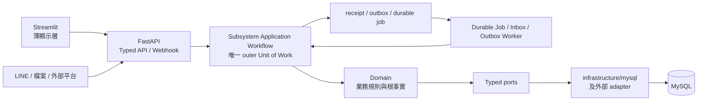

# 重整後開發者與 Agent 導覽

## 目的與使用方式

本文件是進入程式碼前的快速導航，不取代正式規格、人工裁決或部署決策。
先用 [Agent 任務分級與交付規範](./00_Agent任務分級與交付規範.md) 判斷 T0–T3 與最小交付；
既有契約已涵蓋的 T1／T2 工作直接重用 current spec，不為每個 slice 另建規格、工作包或 receipt。
執行 React 管理端 Phase 3–6 遷移時，另先讀[Phase 3–6 執行 SOP](./00_Phase3-6執行SOP.md)，
用其控制 Phase 順序、測試次數、runtime batch、工具阻塞與 evidence 收斂。
要修改某個業務流程時，先依下列順序閱讀：

1. 根目錄 `AGENTS.md` 與本目錄 `00_Agent任務分級與交付規範.md`：工作區規則、T0–T3、dirty worktree 與驗證方式。
2. 根目錄 `README.md`：執行入口、目錄與安全界線。
3. `01_規格基線/00_Global_共同契約.md`：跨領域共同不變量。
4. `15_正式規格索引與裁決總表.md`、對應 Domain 規格及 `16`～`24` 中與任務相關的最新補充裁決。
5. 只讀對應且 active 的 `02_決策與退役執行記錄/` Work Package 與 `03_追蹤清單與證據/` evidence，不整目錄載入。
6. 歷史追溯、incident／rollback、migration/cutover、舊 release 重現或稽核時，才依 `04_已完成與上線封存/README.md` 從 Git 歷史精準取回單一文件。
7. 最後才讀 live schema、route、subsystem、repository 與既有測試，確認規格和現況是否漂移。

歷史 `system_map*.md`、`system_map*.yaml` 和 ADAD 產物僅供追溯，均不是 SSOT 或實作 gate。

## 一分鐘架構圖



依賴只能由外往內：`api`／`ui`／`line` 是 adapter，`subsystems` 編排命令，`domains` 定義
業務規則，`infrastructure` 實作 ports。UI、route、webhook、file watcher 和 repository 都不得
自行重算業務規則或隱藏 commit。

## 先辨認責任，再改程式

| 層級 | 主要位置 | 責任 | 不可做的事 |
|---|---|---|---|
| Global | `shared_kernel/`、跨域 contract／規格 | command envelope、actor、版本、fingerprint、idempotency、typed error、outer UoW、receipt、outbox、部署與 migration 邊界 | 擁有某個 Domain 的金額、日期或狀態公式 |
| Domain | `domains/<domain>/` | 根事實、狀態機、不變量、typed business rule | 直接依賴 FastAPI、Streamlit 或 MySQL concrete adapter |
| Subsystem | `subsystems/<domain>/` | Preview／Apply 編排、fresh fact 驗證、交易與跨 Domain 協調 | 讓 repository 自行 commit，或把 UI payload 當事實 |
| Module／Adapter | `api/`、`ui/`、`line/`、`infrastructure/`、`scripts/` | 傳輸、驗證、顯示、port 實作、worker 與維運入口 | 旁路寫入 Domain 根事實 |

所有 mutation 共用以下規則：Query 唯讀、Preview 零寫入、Apply 重新讀取鎖定的最新根事實；同一
命令以 idempotency／receipt 保證重播；外部副作用只從已提交 outbox 或 durable job 執行。

## Domain 導覽

| Domain | 程式入口 | 主要責任 |
|---|---|---|
| Orders | `domains/orders/`、`subsystems/orders/` | 條款、服務開始、完成、取消、reopen 與 lifecycle control facts |
| Assignments／Scheduling | `domains/scheduling/`、`subsystems/scheduling/` | assignment generation、正式服務日、檔期、請假、代班與 occupancy |
| Payroll | `domains/payroll/`、`subsystems/payroll/` | assignment-owned 薪資義務與調整 |
| Client Finance | `domains/client_finance/`、`subsystems/client_finance/` | 客戶應收、收款、退款、沖正、調整與核銷 |
| Staff Payables | `domains/staff_payables/`、`subsystems/staff_payables/` | 月嫂應付、出款與退匯／沖正投影 |
| Finance Import | `domains/finance_import/`、`subsystems/finance_import/` | 銀行來源事實、分類、修正，並以 borrowed UoW 委派 owning Domain |
| Government Subsidy | `domains/government_subsidy/`、`subsystems/government_subsidy/` | 申請、核准、政府撥款、allocation 與 reversal |
| Anomalies | `domains/anomalies/`、`subsystems/anomalies/` | 根事實異常的 projection、告警與人工處理進度 |
| Case Import | `domains/case_import/`、`subsystems/case_import/` | BeClass／HCM 來源驗證、review 與 case bootstrap |
| Access／LINE／Jobs | `subsystems/access/`、`subsystems/line/`、`subsystems/jobs/` | 管理員身分與 capability、LINE inbox／delivery、durable worker supervision |

完整 Domain ownership、SSOT 與跨域關係請讀
`01_規格基線/15_正式規格索引與裁決總表.md`；其中的圖、`16`～`24` 補充裁決與權威順序
優先於本摘要。銀行流水、帳務異常及管理端處置另以
`22_銀行流水匯入與帳務異常處理正式規格.md` 的最新明確裁決為準。

## 常見改動的定位

| 需求類型 | 先讀／先改的邊界 |
|---|---|
| 新增或更改業務命令 | 對應 Domain 規格 → `subsystems/<domain>/` Preview／Apply workflow → typed API schema／route → UI client／panel |
| 新增唯讀畫面或查詢 | owning Domain read model／query repository → API route → `ui/api_clients/` → 頁面；不可讓 UI 組合商業規則 |
| 銀行流水、補助或付款處理 | 先讀 `22_銀行流水匯入與帳務異常處理正式規格.md`；Finance Import 擁有來源、分類與 typed dispatch，由 Client Finance、Staff Payables 或 Government Subsidy 寫入自己的根事實 |
| 外部 webhook、LINE 或檔案監控 | 只產生／驗證 inbox 或 durable job；Worker 再呼叫 application workflow |
| 新增、保留或退役 API／Streamlit／CLI 入口 | 先讀 `19_Global_Entry_Point_Governance.md`；逐項確認操作者、業務情境、canonical owner、replacement 與 review queue，不得只因找不到 static caller 就刪除 |
| MySQL schema 或保留資料升級 | `db/schema_parts/` → `db/schema.sql` → canonical versioned release chain／descriptor → preserve-data migration／驗證腳本；同時驗證 fresh bootstrap 與舊資料 candidate upgrade |
| 異常與人工處理入口 | Anomalies projection 與 typed recovery workflow；audit 是證據，不是授權 |

## 文件地圖

- `00_Agent任務分級與交付規範.md`：任務大小、最小 durable artifacts、驗證範圍與失敗回送的 canonical 路由。
- `01_規格基線/`：現行正式 Global／Domain／Application 契約；`15` 是規格收斂入口，目前正式範圍為 `15`～`24`。`16`～`24` 補足帳務衝突、外部整合／權限與部署治理，`19` 管理 entry point，`20`：LINE 客服，`21`：Contract Signing 與簽約前服務承諾，`22`：銀行流水與帳務異常處置，`23`：LINE 身分管理與解除，`24`：Staff Matching Preferences 與不可服務期間。
- `02_決策與退役執行記錄/`：已核准的 Work Package、退役、驗收與部署決策；先確認 `declared_status`，不要把草案當授權。
- `03_追蹤清單與證據/`：legacy inventory、evidence、收據；是現況證據，不自動構成業務規格或刪檔權限。
- `03_追蹤清單與證據/evidence/global_e2e_manifest.json`：目前 Global E2E 驗收宣告與證據索引。
- `04_已完成與上線封存/README.md`：低頻歷史文件的 Git 復原入口；歷史內容不留在目前工作樹。仍約束 production 的規格即使已上線也留在 `01`。

### 完成後的文件收斂

只有實際存在且仍 active 的 Work Package 完成、supersede 或封存前，才以檔名、標題、owner、business scenario 與既有 initiative ID
搜尋 `document/功能開發計畫/`、active `02`／`03` 索引與 current SSOT。逐筆判定該文件是否仍有未承接的
業務語意、操作入口、rollback 責任或未完成 gate；結果只能是保留 current、標記 `superseded` 並連到 successor、
建立新的 active successor，或確認無 current consumer 後從工作樹移除並由 Git 歷史保存。不可因一份文件尚標 `proposed`／`partial`、不在本次
write set，或留有舊 checklist，就跳過此重新驗證。

## 開發與驗證安全界線

- 先讀取 branch、HEAD、status 和相鄰檔案；既有 dirty path 一律視為使用者成果。
- 協作任務以可讀的標題／Work Package、owner、write set 與 base ref 溝通；hash 僅用於既有 release、artifact 與測試資產的完整性驗證，不是任務身分、鎖定或衝突裁決依據。
- 合併前先列出衝突 path、雙方意圖與建議處置；相同 ordinal、release ID 或索引列先視為語意碰撞。保留不同業務 lane，已套用或已發布 release 不得靜默改寫；刪除重複實作前要有行為比較與驗收證據。完整規則以根目錄 `AGENTS.md` 的「多人協作與合併裁決」為準。
- 測試一律使用 `.venv\Scripts\python.exe -m pytest`，先跑受影響模組，再依 Domain／Global 層級擴大。
- snapshot、golden artifact、`tests/fixtures/` 與 `validation/` 資料都是受保護測試資產；未經明確授權不得刪除、重產或套用到正式資料庫。
- `db/schema_parts/` 與 migration release 必須 additive、可驗證；`scripts/launchers/start_local_development.bat` 不會自動套 schema。
- 任何 DB object 或欄位異動若未被 canonical release chain 收錄、descriptor 未涵蓋 altered parent column，或唯讀 migration plan 看不到該 artifact，就仍是未完成的 `live-drift`；fresh bootstrap 成功不能取代 preserve-data upgrade 證據。
- Launcher 的 `update_local_database.bat --dry-run` 只檢查入口與依賴；要產生唯讀 DB migration plan，從專案根目錄執行 `.venv\Scripts\python.exe -m scripts.update_local_database`。plan 必須列出 latest release id 與 artifact states，且不寫入 DB。
- Windows launcher 的 `--smoke-test` 會實際啟動服務並在驗證後清理本次 PID；LINE worker 僅在 runtime 設定與 access token 通過唯讀 preflight 時啟動，缺少個人 LINE 憑證不得阻塞其他本機服務。
- 保留資料升級、fresh bootstrap、fixture reset 與 production migration 是四條獨立流程。DDL／system seed／既有 row backfill 必須分開聲明；fixture 缺失不得以歷史 snapshot 或 production data 補位。
- Streamlit 只顯示 typed API result；正式資料庫、candidate、fixture 和測試資料必須隔離。

## 穩定開發指南

### 通用技術 ADR 最小範本

只適用於不改變業務 owner、SSOT、交易或部署契約的技術決策；需要裁決這些邊界時，依
`02_決策與退役執行記錄/` 的 Work Package／architecture-decision 格式建立文件。

```markdown
# ADR-NNN: <決策標題>

## 狀態

Draft / Proposed / Approved / Rejected / Deprecated

## 脈絡 (Context)

說明背景、問題、需求與限制。

## 決策 (Decision)

說明採用方案及其理由。

## 後果 (Consequences)

列出優點、缺點、副作用及連帶調整。
```

### Pure Function 模式

適用於可由輸入完全決定結果的 Domain calculation、normalization 或 validator。輸入必須視為
immutable，不得修改傳入參數；返回值只能由輸入決定，不得存取外部全域狀態，也不得進行 I/O、
DB 或 network side effect。需要讀取根事實、時鐘、repository 或外部服務的邏輯，應留在
Subsystem／adapter，或以 typed port 明確注入。

## 交付前自查

1. 修改是否只屬於一個明確 Domain／Subsystem 範圍？
2. 根事實、衍生 projection、交易 owner 與 typed error 是否仍清楚？
3. Preview、Apply、replay、stale version、partial failure 和人工 recovery 是否保有既有契約？
4. 是否更新受影響的規格／決策／evidence 索引，而沒有把 live code 誤寫成規格？
5. 是否以正確層級完成測試與 `git diff --check`？
6. 若有 DB 變更，開發者從舊版資料庫升級後是否能取得與目前程式一致的 exact schema，且 source 資料、未解析 row 與 rollback evidence 都可驗證？
