# 正式規格索引與裁決總表

## 1. 文件狀態

- 狀態：`approved-architecture-baseline`
- 收斂日期：2026-08-03
- 人工核准日期：2026-08-03
- 2026-08-11 executable finance amendment：`approved`
- 2026-08-11 Contract Signing／簽約前服務承諾／正常驗收資料鏈：`approved`
- 2026-08-13 Staff Matching Preferences、Case Import 下廚條款與 Scheduling 不可服務期間：`approved`
- 2026-08-13 ADR-001 `IMPORT-ENTRY-02`：HCM 日常 Web upload；Client BeClass／Staff 現行
  LIFF typed API；BeClass scripts 保留為 restricted historical import：`approved`
- 2026-08-14 WP77 合併裁決：Staff restricted historical source在 identity、姓名一致且來源報名時間
  嚴格較新時，可覆寫姓名、銀行帳戶與關聯集合；來源空值與受保護 root fields 不覆寫；
  HCM以案件編號防重；新案件若IP位址與姓名同時命中既有Client，視為疑似同一客戶重複申請，
  不載入並通知公會人工確認；只有IP相同但姓名不同不阻擋。HCM與Client BeClass可獨立匯入，
  缺少對方時建立 partial formal case 並標記 warning，待兩方唯一配對後再綁定並補入料理條款：`approved`
- 2026-08-13 WP80 歷史訂單裁決：只以 `case_no + 客戶姓名` 精確匹配既有 Order；0／1／2
  採納為歷史 asserted status，日期永遠可空且 Excel serial 依 workbook date system 轉換；
  雙月嫂缺每人獨立區間時只留配對 evidence，不猜 assignment／服務日／薪資：`approved`
- 2026-08-13 資料匯入中心過渡裁決：管理端以單一「資料匯入中心」排列 HCM、Client BeClass、
  Staff BeClass、歷史訂單與銀行流水等獨立上傳卡；LIFF 穩定前，Client／Staff BeClass 可暫由
  authenticated Web upload 進入各自 typed intake，明示為 temporary entry，LIFF end-to-end 驗收後
  必須移除。HCM 與帳務固定由 Web upload，不得回退 File Watcher／browser SQL：`approved`
- 2026-08-14 訂單狀態與月嫂歷史配對過渡裁決：舊 `historical_orders` 僅保留 source lineage；
  匯入中心以 Orders typed Preview／Apply 補既有 Order 的 status、月嫂配對 evidence 與可空的實際
  服務日期。多月嫂缺個別區間不得猜 assignment／日期／薪資；日常 UI 不得呼叫 legacy CLI：`approved`
- 2026-08-14 WP92 匯入採用與 warning lane recovery：Historical Orders 精確配對且可解析的歷史值
  直接寫入，不比較 current value 或 source time，也不產生 `current_conflict`；無法採用的欄位建立
  typed warning。現階段只授權 import scripts、lane Preview／Apply 與正式寫入；warning center UI、
  typed Query、人工轉態及 WarningReferral 留待後續 Work Package：`approved`。2026-08-15
  WP94 已承接 typed Query 與人工轉態；WarningReferral 仍須 owner-specific Work Package：`approved`
- 2026-08-15 HCM 異常中心補充裁決：未達 HCM 最低 import 條件的來源列只保留
  source review／receipt／outbox 稽核，不投影異常中心，因此不存在 `HCM-CASE-001`。缺漏與
  格式錯誤保持通用 logical code，由 `field_path` 組成人可讀文字，例如「缺少身分證」。
  未登錄 issue 屬 projection contract 故障：整筆回滾、去敏記錄、最多 3 次且間隔 1 秒後 dead-letter，
  不得預設映射成任一業務警示：`approved`
- 2026-08-15 WP95 HCM owner 裁決：異常中心只提供警示、追蹤與 owning 業面跳轉；HCM 缺漏、格式
  錯誤或同案修正版由完整修正來源重新走 owner typed Preview／Apply，不在警示中心或 Streamlit
  編輯欄位。owner commit 後另由 root predicate 自動解除；typed backend 供未來 React 使用：`approved`
- 2026-08-15 Scheduling LINE 請假裁決：已綁定月嫂的 LIFF 請假只建立 Scheduling request evidence；
  管理受理不是正式核准，不得猜案件、服務日或代班人。只有既有 Leave/Substitution Apply 的 canonical
  receipt 已提交且 staff 關聯唯一時可結案並排入 durable LINE delivery task；通知失敗不回滾：`approved`
- 2026-08-15 WP91 Staff 退役：保留 Staff、BeClass、Orders、Payroll 與歷史配對；退役後排除所有新
  Matching。已確認的未來服務保留，未確認媒合失效；復職使用獨立 typed command 且不恢復過期
  媒合資料；第一階段不新增外部通知：`approved`
- 2026-08-11 退款單、應付明細與帳單後核對邊界：`approved`；此最新人工裁決優先於
  既有任何把會計匯款排程或執行納入系統的文字。
- 2026-08-11 Finance Amendment cutover：不要求獨立的正式 production migration procedure
  或 runbook；release record 只須保存目標、revision、digest、operator、時窗與備份／回復責任。
- 2026-08-16 Access Control 本機驗證 closeout：TOTP、帳號中心、security-alert outbox 與本機
  schema upgrade 已完成；production cutover、external security alert sink 與 target-specific 驗收移交
  `25` 與其 proposed Work Package，未取得 target 時一律不得部署：`user-deferred-2026-08-16`。
- 目的：把 `document/文件整併工作區` 的來源保存、狀態機候選與逐表盤點，
  收斂為唯一可人工確認的 `Global → Domain → Subsystem → Module` 規格入口。
- 生效結果：本文件與 `16`～`20` 的既有條款已經人工整體確認，成為後續 Work Package 的
  業務與架構依據；2026-08-11 寫入 `06`、`14`、`16`、`20` 的追償結清、staff payout
  difference、government overpayment disposition 與 typed recovery dispatcher 條款，已於
  2026-08-11 人工整體確認，授權 production code／schema 實作。
- 第 `21` 份規格收斂 2026-08-10 已確認的月嫂先簽、訂金先行核銷、客戶簽回、Contract
  Completion、commitment exact conversion 與 validation dataset 邊界；其可執行範圍由
  已完成並封存的 [`56_Contract_Signing_and_UI_Validation_Work_Package.md`](../04_已完成與上線封存/work_packages/56_Contract_Signing_and_UI_Validation_Work_Package.md) 約束。
- 2026-08-03 的原始核准只授權建立 Inventory v2；不授權 production code、pytest、schema、
  正式資料庫、資料、外部平台、移除、部署、Git stage／commit／push 或 release mutation。

## 2. 權威順序

1. 人工最新明確裁決。
2. 已經人工整體確認的本目錄正式規格。
3. `document/文件整併工作區` 的來源追溯、無損稿與逐表盤點。
4. live schema、API、Service、SQL writer、production caller、UI 與測試，僅作現況證據。
5. legacy `system_map*.md`／`system_map*.yaml` 與 `history/adad/`，僅作歷史證據。

live 現況與正式規格不一致時，記為 `live-drift`，不得反過來把繞過路徑升格為規格。

### 2.1 補助季度撥款與工會墊付裁決（2026-08-04）

政府補助一季申請一次並以整季合計款入帳；Government Subsidy 先把入帳款 allocation 到
claim items。客戶補助退還是工會對客戶的獨立應付，不能把政府入帳當成客戶退款。

客戶在 claim quarter 第一個曆月實際結案時，補助退款日固定為結案月份加兩個曆月的
15 日；該日仍無相關政府 receipt allocation 時，工會執行墊付。未清償的客戶補助
退還必須進入 Accounts Payable Query／Export，並與月嫂應付款明確區分。後續政府入帳
只能核銷既有的工會墊款，不得再次付款給客戶。任何金額或對應不唯一均為 anomaly；
`client_payments.subsidy_refund_*` 是 legacy projection drift，不是正式模型。

## 3. 狀態標記

| 標記 | 定義 |
|---|---|
| `confirmed-inherited` | 已由較新的人工決策或已確認架構明確決定，本次只去重與搬移 |
| `consolidated-decision` | 依較新的已確認原則消除舊文件矛盾，已隨本套文件整體核准 |
| `historical` | 僅保存來源與遷移脈絡，不得形成新依賴 |
| `live-drift` | production 現況違反正式方向，必須另立 Work Package 退出 |
| `human-decision-required` | 現有證據不足以唯一決定，不能由 Agent 猜測 |
| `out-of-scope` | 不屬本次架構收斂，不得順帶實作 |

## 4. Global 架構

### 4.1 Global 責任

Global 擁有：

- Domain ownership 排他性與跨 Domain 不變量；
- command envelope、actor、correlation、fingerprint、idempotency 與 typed error；
- outer Unit of Work、outbox、receipt、retry、timeout 與 conflict policy；
- 身分驗證、同權限內部存取、稽核及外部整合安全邊界；
- preserve-data migration、部署、備份、復原、可觀測性及 release gate；
- Streamlit 薄顯示層與所有正式 API 的共同限制。

Global 不擁有任何 Domain 金額、日期、狀態或資格公式。

### 4.2 Global 不變量

1. Query 唯讀；Preview 零寫入；Apply 以 fresh root facts 重建並驗證。
2. 同一業務命令只有一個 outer Unit of Work owner，Repository／Adapter 不得 hidden commit。
3. 正式狀態、金額與服務日判斷只在後端 owning Domain；所有已登入且 enabled 的內部使用者具有
   相同業務功能權限。
4. 外部 webhook、LINE、File Watcher 與 UI 不得直接寫 Orders、
   Scheduling、Client Finance、Payroll 或 Staff Payables 根事實。
5. 外部副作用一律由已提交的 outbox／durable task 觸發；外部失敗不得回滾已提交
   的 Domain transaction，也不得偽造 Domain 成功。
6. 管理操作要求 service authentication（如適用）與 internal-user authentication；actor identity
   用於操作歸屬及 audit，不以 role／capability 造成內部使用者間的業務功能差異。
7. 正式資料庫不得直接暴露公網；測試、candidate、fixture 與正式資料嚴格隔離。
8. legacy writer 必須移除、只讀或固定回 `410 Gone`；不得以相容 adapter 偷跑舊規則。
9. Streamlit 只呼叫 typed API、保存 UI 暫態並顯示 typed result，不計算業務衍生值。
10. 任何 architecture、data contract、public interface、external side effect 或
    production cutover 變更，都必須重新取得人工確認。

### 4.3 Global SSOT

- 業務語意 SSOT：人工已確認的正式架構與 Domain 規格。
- 身分 SSOT：各 Domain 的 canonical identity 與 immutable mapping event。
- 時間 SSOT：`BusinessClock` 與明確 IANA timezone。
- 金額 SSOT：integer `MoneyNTD` 與 immutable obligation／ledger event。
- mutation SSOT：typed Application Command、outer Unit of Work receipt 與 outbox。
- release SSOT：versioned release manifest、artifact digest、migration journal 與 switch receipt。

Read model、cache、Alert、UI session、XLSX、log、legacy table 與外部平台顯示都不是
業務根事實；只能由正式根事實推導或作證據。

## 5. Domain 版圖

| Domain | 正式責任 | 正式規格 |
|---|---|---|
| Orders | 條款、契約完成事實、生命週期、取消、reopen、服務資料鎖 | `01_Orders_Domain.md` |
| Assignments／Scheduling | generation、assignment、正式服務日、檔期、請假與代班 | `02_Assignments_Scheduling_Domain.md` |
| Payroll | assignment-owned 薪資義務與調整 | `03_Payroll_Domain.md` |
| Client Finance | 客戶應收、收款、退款、沖正、調整及核銷 | `04_Client_Finance_Domain.md`、`16_Staff_Payables與Client_Refund正式規格.md` |
| Staff Payables | 月嫂應付義務、正式出款、退匯／沖正與付款投影 | `05_Staff_Payables_Export_Domain.md`、`16_Staff_Payables與Client_Refund正式規格.md` |
| Anomalies | 根事實異常的 canonical projection 與人工處理進度 | `06_Anomalies_Domain.md` |
| Finance Import | 銀行來源事實、分類、人工修正與 owning Domain dispatch | `09_Finance_Import_Domain.md` |
| Government Subsidy | 申請、送件、核准、政府撥款、allocation 與 reversal | `14_Government_Subsidy_Domain.md` |
| LINE Integration | LINE platform identity、webhook inbox、delivery、review、publication 與 media | `17_External_Integration_LINE_Access正式規格.md` |
| Internal Access | 內部使用者登入、session、actor identity、安全稽核與後續 production cutover／external alert | `17_External_Integration_LINE_Access正式規格.md`、`25_Access_Control_Production_Cutover與External_Security_Alert正式規格.md` |
| Case Import | BeClass／HCM 來源事實、驗證、review 與正式 case bootstrap | `17_External_Integration_LINE_Access正式規格.md` |
| Scheduling Staff Matching Profile | 自訂配對偏好定義、月嫂偏好值與版本；不新增獨立 Domain | `24_Staff_Matching_Preferences與不可服務期間正式規格.md` |
| Knowledge Retrieval | FAQ／crawler provenance、審核發布、index 與非權威 RAG 回答 | `17_External_Integration_LINE_Access正式規格.md` |
| Customer Service | LINE 客服需求、對話事件、處理狀態與人工回覆 | `20_LINE客服與月嫂自助服務正式規格.md` |
| LINE Identity Management | 身分查詢、修正、解除 saga、owner projection 清除與預設 Rich Menu 回復 | `23_LINE身分管理與解除正式規格.md` |

Contract Signing Integration 與簽約前 Scheduling Commitment 是跨 Orders、Scheduling、Client
Finance、LINE Integration 的 application/integration subsystem，不新增第十三個業務 Domain。
其唯一正式補充規格為 `21_Contract_Signing_Commitment與正常驗收資料鏈正式規格.md`。

Deployment、Migration、Performance、Runtime Supervision／Observability、Release 與
Accounts Payable Export 是 Global／Application Subsystem，不是業務 Domain。

銀行流水正常匯入、帳務異常固定處置、歷史重處理與管理端入口治理，另以
`22_銀行流水匯入與帳務異常處理正式規格.md` 為最新正式裁決。

Staff 自訂配對偏好、Orders 匯入下廚條款及 Scheduling 長假／暫停接案，另以
`24_Staff_Matching_Preferences與不可服務期間正式規格.md` 為最新正式裁決。

已完成或被取代的功能開發計畫不繼續作為 active 規格：休假代班精算、Calendar Preview、
單月嫂預設及預計服務日期表由 `02_Assignments_Scheduling_Domain.md` 承接；契約與 UI 情境矩陣由
`21_Contract_Signing_Commitment與正常驗收資料鏈正式規格.md` 承接；配對偏好與不可服務期間由
第 `24` 份正式規格承接。其封存路由集中列於
[`document/功能開發計畫/README.md`](../../功能開發計畫/README.md)，歷史 digest 與 evidence 只由
`04_已完成與上線封存/archive_manifest.json` 擁有。

### 5.1 完整目標架構圖

狀態：`approved-architecture-baseline`。實線表示 runtime call／data flow；虛線表示
架構約束或 adapter implementation。Global 不是 runtime 巨型 Service。

```mermaid
flowchart TB
  subgraph EXT["External Actors / Providers"]
    ADMIN["Approved Admin Client"]
    LINEP["LINE"]
    FILES["Bank / BeClass / HCM / Knowledge Sources"]
  end

  subgraph EDGE["Public / Private Edge"]
    PUB["HTTPS Public Edge"]
    PRIV["LAN / VPN Admin Edge"]
  end

  subgraph APP["Application Zone"]
    UI["Streamlit Thin Presentation Adapter"]
    API["FastAPI Typed HTTP / Integration Adapter"]
    WATCH["File Watcher: Durable-job Producer Only"]
    WORKER["Worker: Inbox / Outbox / Job Consumer"]
    COORD["Application Workflow Coordinators
    Single Outer UoW Owner"]
  end

  subgraph GLOBAL["Global Contracts / Subsystems"]
    CONTRACTS["Actor / Version / Fingerprint / Idempotency
    Typed Result-Error / Clock / Correlation / UoW"]
    INTEGRATION["Integration Security Boundary
    Security Receipt / Durable Inbox / Transactional Outbox"]
    EXPORT["Accounts Payable Export
    Cross-domain Read-only Reporting"]
    PERF["Performance & UX"]
    MIGRATION["Preserve-data Migration / Cutover"]
    DEPLOY["Deployment Security Boundary"]
    RELEASE["Release Orchestration / Approval Receipts"]
    OBSERVE["Runtime Supervision / Observability"]
  end

  subgraph DOMAINS["12 Business Domains"]
    ORD["Orders"]
    SCH["Assignments / Scheduling"]
    PAY["Payroll"]
    CF["Client Finance"]
    SP["Staff Payables"]
    GOV["Government Subsidy"]
    FI["Finance Import"]
    ANO["Anomalies"]
    LI["LINE Integration"]
    AC["Internal Access"]
    CASE["Case Import"]
    KNOW["Knowledge Retrieval"]
  end

  subgraph HEX["Typed Ports / Infrastructure Adapters"]
    PORTS["Repository / Query / Gateway / Archive / Clock
    Inbox / Outbox / Queue / Cache / UoW Ports"]
    DBAD["MySQL Persistence Adapters"]
    EXTAD["Provider / Notification / Archive Adapters"]
    QUEUEAD["Inbox / Outbox / Durable-job Adapters"]
    CACHEAD["Optional Cache Adapter"]
  end

  subgraph DATA["Private Data / Archive Zone"]
    DB[("MySQL")]
    ARCHIVE[("Evidence / XLSX Archive")]
    BACKUP[("Backup / Recovery Candidate")]
    QUEUE[("Durable Inbox / Outbox / Job Queue")]
    CACHE[("Optional Cache")]
  end

  ADMIN --> PRIV --> UI --> API
  LINEP --> PUB --> API
  FILES --> WATCH --> QUEUE
  API -->|"Admin / Business Command"| AC
  AC -->|"Authenticated Enabled Principal"| COORD
  API -->|"Verified Canonical Webhook Inbox"| QUEUE
  QUEUE --> WORKER --> COORD

  COORD --> ORD
  COORD --> SCH
  COORD --> PAY
  COORD --> CF
  COORD --> SP
  COORD --> GOV
  COORD --> FI
  COORD --> ANO
  COORD --> LI
  COORD --> AC
  COORD --> CASE
  COORD --> KNOW

  ORD --> PORTS
  SCH --> PORTS
  PAY --> PORTS
  CF --> PORTS
  SP --> PORTS
  GOV --> PORTS
  FI --> PORTS
  ANO --> PORTS
  LI --> PORTS
  AC --> PORTS
  CASE --> PORTS
  KNOW --> PORTS

  DBAD -. "implements" .-> PORTS
  EXTAD -. "implements" .-> PORTS
  QUEUEAD -. "implements" .-> PORTS
  CACHEAD -. "implements" .-> PORTS
  DBAD --> DB
  EXTAD --> ARCHIVE
  QUEUEAD --> QUEUE
  CACHEAD --> CACHE

  CONTRACTS -. "constrains" .-> APP
  CONTRACTS -. "constrains" .-> DOMAINS
  INTEGRATION -. "constrains ingress / egress" .-> API
  PERF -. "constrains UI / API / Query / Jobs" .-> APP
  OBSERVE -. "observes" .-> APP
  OBSERVE -. "observes" .-> DATA
  EXPORT --> SP
  EXPORT --> CF
  MIGRATION --> BACKUP
  MIGRATION --> DB
  DEPLOY -. "governs topology" .-> APP
  DEPLOY -. "governs topology" .-> DATA
  RELEASE --> MIGRATION
  RELEASE --> DEPLOY

  ORD -->|"Terms / Lifecycle Coordination"| SCH
  ORD -->|"Finance Impact Candidate"| CF
  ORD -->|"Payroll Impact Candidate"| PAY
  SCH -->|"Official Service Facts"| PAY
  PAY -->|"Immutable Staff Obligations"| SP
  FI -->|"Typed Dispatch / Borrowed UoW"| CF
  FI -->|"Typed Dispatch / Borrowed UoW"| SP
  FI -->|"Typed Dispatch / Borrowed UoW"| GOV
  CASE -->|"Owning-domain Bootstrap Intent"| COORD
  KNOW -->|"Non-authoritative Answer / Delivery Intent"| LI
```

### 5.2 關鍵 runtime 邊界

- 管理／業務 API 必須先驗證 internal-user session 與 enabled 狀態，再呼叫 typed Application
  Command／Query；不得依人員 role／capability 形成業務功能差異。root 與其他 enabled 帳號同樣可使用
  全部業務功能；唯一額外權限是 Access Control 帳號中心：依 `17` 的 2026-08-16 裁決，僅唯一 enabled
  root 帳號可執行帳號生命週期管理。
- LINE webhook 通過 request security 驗證後，只建立 canonical durable
  inbox；必須由 Worker 消費後才能呼叫 Coordinator，不得同步穿透至業務 Domain。
- FastAPI／Worker 不直接寫 Domain table。
- Domain／Application 只依賴 typed ports；concrete adapter 反向實作 ports。
- root facts、receipt 與 outbox 必須由唯一 outer Unit of Work 原子 commit。
- Worker 只消費 committed inbox／outbox／durable job；外部副作用不得位於核心交易內。
- Finance Import 只擁有 bank facts／classification，透過 borrowed UoW 委派
  Client Finance、Staff Payables 或 Government Subsidy。
- Orders 跨域 workflow 協調 Scheduling、Client Finance 與 Payroll；Scheduling 的
  official service facts 供 Payroll 使用，Payroll immutable obligations 供 Staff Payables。
- LINE 只負責平台互動。
- Case Import 透過 owning-Domain ports bootstrap；Knowledge answer 永遠
  `authoritative=false`，不得觸發業務 mutation。
- Accounts Payable Export 只讀 Staff Payables 與 Client Finance typed views，
  不擁有 ledger，也不改變付款或退款狀態。

## 6. 優先衝突裁決

| ID | 主題 | 裁決 | 狀態 |
|---|---|---|---|
| CON-SET-001 | 人工月結 | 不建立 draft／finalized／revision／paid 月結 aggregate；`staff_monthly_settlements*` 僅歷史相容 | `confirmed-inherited` |
| CON-SET-002 | 月嫂應付款彙總 | 正式義務為 Payroll 建立的 assignment-owned immutable obligation；`staff_payments` 僅可作 compatibility projection；同月嫂同付款日只在 Query／XLSX 聚合 | `confirmed-inherited` |
| CON-REF-001 | 一般客戶退款 | 納入 Client Finance 正式能力；允許多筆有效出款逐步清償，progress 與 review 分成正交投影；不允許負收款或改寫原交易。後續決策 25、32、42、45、46 已完成 partial/full allocation、return/reversal、Finance Import borrowed UoW dispatch、canonical anomaly 與 Accounts Payable read-only export；第 16 份的現行驗收收據為 `proven-current-evidence`。 | `consolidated-decision` |
| CON-REF-002 | 退款與沖正 | refund 清償退款義務；reversal 使既有正式收款失效並重開原應收，兩者不可共用命令 | `confirmed-inherited` |
| CON-LINE-001 | LINE ownership | LINE 擁有平台 identity、webhook inbox、delivery task、attempt、review 與 publication；不擁有業務 Domain 狀態 | `consolidated-decision` |
| CON-AUTH-001 | 內部存取 | 所有 authenticated、enabled `AdminPrincipal`（含 root）具有相同、完整的業務功能權限；principal 保留作 actor／audit，internal key 只作 service authentication。2026-08-16 追加唯一額外權限：恰有一個 enabled root 可管理 Access Control 帳號中心，不形成其他業務功能差異。 | `reconfirmed-by-user-2026-08-16` |
| CON-AUTH-002 | Access Control cutover | 本機驗證完成不等於 production release；production target、external security alert sink、keyring／時鐘／雙人 MFA、維護窗與 rollback owner 必須由後續精確 Work Package 另行確認。 | `user-deferred-2026-08-16` |
| CON-DEP-001 | 部署 | deployment profile、target host、edge provider、RTO/RPO 與 target-host acceptance 已依決策 53 退役，不再是產品設定或 release gate；僅保留 MySQL 私有、公開 HTTP 受控與 secret 不進 Git 的安全邊界。 | `retired-by-user-2026-08-09` |
| CON-GOV-001 | ADAD 語彙 | 全部降為 historical；改用人工架構確認、Work Package、明確 write scope 與 evidence matrix | `confirmed-inherited` |

## 7. Subsystem 共同完成條件

每個 Subsystem 必須同時記錄：

1. owner、root facts、derived values 與 non-goals；
2. Commands／Queries、typed input／output／errors；
3. state machine、guards、transaction、lock 與 commit owner；
4. idempotency identity、replay、stale、retry、timeout 與 conflict；
5. outbox、external side effects、alerts 與人工操作入口；
6. Repository／Clock／Gateway／Archive 等 ports；
7. legacy writer／caller 退出條件；
8. Module、Subsystem、Domain、Global 四層驗收。

## 8. 來源文件處置

- `document/文件整併工作區/01`～`04`：`historical-source`，完整保留，不直接實作。
- `05_潛在狀態機規則盤點.md`：`source-analysis`；已收斂項由本總表與 `16`～`24` 覆蓋。
- `06_欄位權威性與計算邏輯盤點.md` 及子文件：`field-lineage-source`；
  schema 現況與未決欄位仍可補充，但不能覆蓋正式 owner。
- `07_正式規格收斂出口.md`：`bridge-to-formal-spec`；只指向本套文件，不另立語意。
- `08_非Markdown附件索引.md`：`attachment-evidence-index`；九份業務內容附件已依目前
  hash 逐一裁決為 `historical`、`historical/source-lineage`、`conflict`、`mixed`、
  `historical/legal-template-evidence` 或 `historical-operational-report`，不覆蓋正式規格。
- 舊文件中的「已實作」只能轉成 `implementation-evidence`，必須另以 live chain 驗證。
- 舊文件中的 ADAD／Checkpoint／Source Lock／system map gate 語彙全部為 `historical`。
- `document/架構重整/04_已完成與上線封存/superseded_specs/契約整合與正常測試資料鏈_決策草案.md`：`superseded`；人工裁決已
  收斂到第 `21` 份正式規格與 Work Package `56`，原檔只保留來源歷史。

### 8.1 本輪 live evidence snapshot

稽核日期：2026-08-03。觀察時 HEAD 為
`4081a9b40c91a030c64f1d488411287ec6c01bdc`，但 worktree 有既存未提交修改；
因此 HEAD 不足以綁定內容，下列 SHA-256 才是本輪讀取證據，不代表規格已實作：

| Path | SHA-256 |
|---|---|
| `line/line_bot.py` | `25125230bfa0de48e2d76e5eeef853bde54cc8b897187eca0a95205d6576fd8b` |
| `api/dependencies/admin_auth.py` | `b5bd899effc1d7788472cc3d0e1886c1d27045429283d92a922d97eab52ee852` |
| `services/admin_auth_service.py` | `20b40e1aa1ca4684464669aaa84efbab4c5b9edddd46aa031c15edeb6a698968` |
| `services/line_task_service.py` | `53ed139641b422bc159221316f3d25b304f9cc2ed6fd4b6ed859b92d41bcf7a0` |
| `services/line_review_service.py` | `e9f6a380c2aad40f5af59229d1a67e07aafe66aa704184aa264f6ee9e6bf3b0e` |
| `db/schema.sql` | `c2e859a213d46c1c56b49c138f7b2a982060c1682cf89f27cdd3263e48bf5a8e` |
| `online.bat` | `006701b2a6a916224b7bcbdc381f9d3d8d24bf3da0a1b96ed4f0f30b06c8ef62` |
| `start.bat` | `282fa47717f086c1a731a71eee92a3ce9c99da3449228072d84b6044fad43e07` |
| `AGENTS.md` | `3d3f0ee697e0315d33fc2b9c093405eb72e03fe92c8f2b01557303d598ff7c13` |

### 8.2 附件內容裁決（2026-08-09）

附件語意預審與人工裁決收據為
`03_追蹤清單與證據/evidence/2026-08-09_human_content_review_precheck.md`。其結果已回寫
`08_非Markdown附件索引.md`：舊 LINE 提案與帳務／來源資料為 `historical`，跨 Domain
流程圖、異常中心草案及 generic data-browser 提案為 `conflict`；契約與週報含實質法律或
營運內容，僅作限制存取、保存責任敏感的歷史證據，不授權 provider、API 或 write SSOT。
任何後續功能只可依本目錄正式規格與明確 Work Package 立案。法律效力與保存年限由
業務／法務負責，不構成產品入口授權。

## 8.3 Finance Amendment acceptance linkage（2026-08-11）

`06`、`14`、`16`、`20` 所授權的 Finance Amendment production code／schema 實作，
其 completed implementation scope、集中驗收與 production release 前置資料分別固定連結為：

- [Work Package 55（封存）](../04_已完成與上線封存/work_packages/55_Finance_Amendment_Executable_Contracts_Work_Package.md)：
  completed scope、owner、invariants、typed dispatcher 與 entrypoint governance 結論；
- [2026-08-11 finance amendment regression receipt](../03_追蹤清單與證據/evidence/2026-08-11_finance_amendment_focused_regression_receipt.md)：
  `82 passed, 2 skipped` focused cross-contract plus governance evidence，並連結各個 fresh
  disposable-MySQL replay／locking case；
- [Finance Amendment validation closeout（封存）](../04_已完成與上線封存/work_packages/57_Finance_Amendment_Production_Release_Readiness.md)：
  isolated-test schema、UI Preview／Apply 與 focused regression 的完成記錄。

2026-08-11 Finance Amendment 的核准實作與 test-environment acceptance 已完成並封存。此範圍不
執行 deployment、production schema application 或任何會計匯款，也不要求另立 production migration
procedure 或 runbook。

## 9. 尚需人工決定

無。LINE review、Rich Menu、管理員 session、Security Audit 與內部使用者同權限政策均已決定；
deployment profile／target-host acceptance 已依
`../04_已完成與上線封存/release_records/53_Deployment_Profile_and_Target_Host_Acceptance_Retirement.md` 退出產品設定與 release gate。

## 10. 人工核准紀錄

2026-08-10 人工明確確認月嫂先簽、簽約前服務承諾、訂金可先核銷、客戶簽回後完成
Contract Completion，以及訂金與客戶契約皆成立後才能 exact conversion。2026-08-11 人工要求
將該裁決收斂至正式規格並建立可執行 Work Package；核准效果為：

- `21_Contract_Signing_Commitment與正常驗收資料鏈正式規格.md` 成為此範圍 SSOT；
- 已封存的 [`56_Contract_Signing_and_UI_Validation_Work_Package.md`](../04_已完成與上線封存/work_packages/56_Contract_Signing_and_UI_Validation_Work_Package.md) 定義 production code／schema／pytest
  的 write set 與 acceptance；
- production DB、validation DB 重建、LINE 正式傳送、部署與 cutover 未隨文件收斂獲得授權。

2026-08-03 人工明確核准：

> 核准 15～18（包含完整目標架構圖）為正式架構基線；目前只授權 Inventory v2，
> 不授權移除 production code。

核准效果：

- `15`～`18` 與第 6 節裁決成為正式架構 SSOT；
- 第 9 節未決營運參數仍 fail closed，阻擋相應 release；
- 本輪可建立 read-only／analysis-only Inventory v2 artifact；
- 一次性核准狀態同步已完成並 freeze；approval receipt 固定於
  `document/架構重整/03_追蹤清單與證據/evidence/architecture_approval_2026-08-03.json`；
- Inventory v2 active exact write set 只限：
  `document/架構重整/03_追蹤清單與證據/evidence/writer_inventory_v2/README.md`、
  `inventory_v2_candidate.manifest.json`、`inventory_v2_candidate.rows.jsonl`、
  `inventory_v2_candidate.sources.json`、
  `inventory_v2_candidate.reconciliation_receipt.json`；
- 不得修改 production code、pytest、schema、資料或外部平台；
- 任一移除、遷移、`410`、caller replacement 或測試實作必須另立 Work Package
  並取得人工確認。
