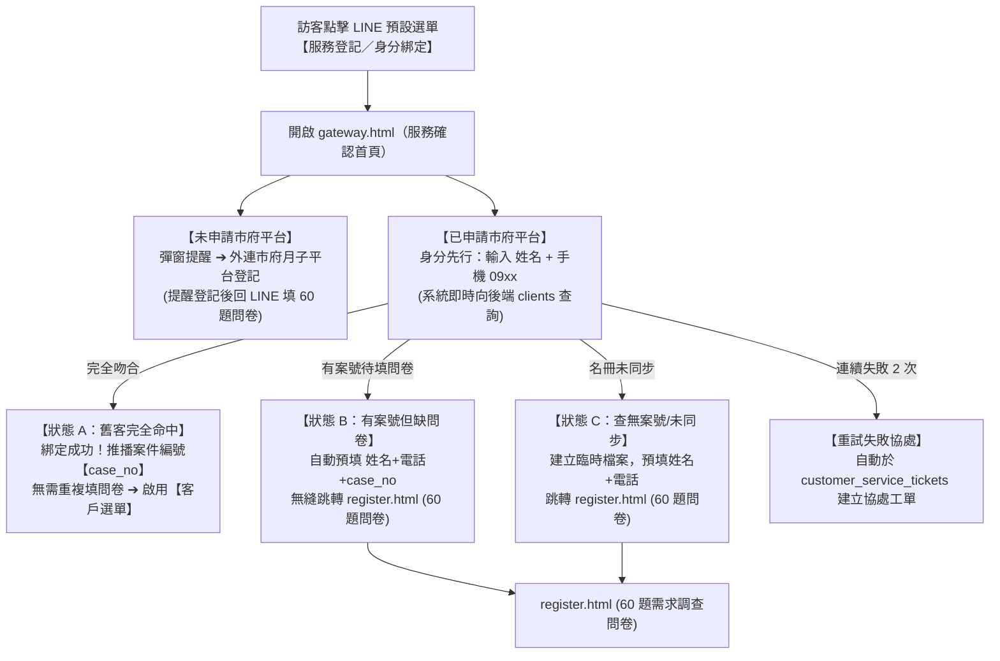

# LINE 四大模組 Eraser 流程圖轉錄與驗收基線

## 1. 用途、權威與執行邊界

本文件忠實保存使用者提供的 Eraser 模組一至四與全系統總覽流程，作為後續檢閱 LINE
系統是否依原始業務流程運作的需求輸入基線。節點名稱、顯示文字與箭頭語意均保留；
排版改為可搜尋的表格與箭頭清單，不改變原圖主張。

權威順序固定為：人工最新明確裁決 → 15 及其 current Domain／Global 正式規格 →
本文件保存的 Eraser 原圖需求 → live code／UI／test。原圖不會自行建立 owner、根事實、
public API、schema、provider 或 production mutation 授權。原圖與 current 正式規格衝突時，
原文仍保留，但驗收 disposition 必須標示 conflict 或 superseded-by-current-spec，並依
current 正式規格執行。

2026-08-25 人工裁決：原圖中尚未實作、契約缺失或需重新裁決的需求先記錄為
deferred-after-96，不加入 96 Current 剩餘代辦的施工範圍。此段僅保存當時的裁決 provenance；
2026-09-01 最新人工裁決已取代其排除效果：Task 96 必須逐項直接驗證 M1～M4 原圖節點與箭頭，
FAQ／常見問題庫內容除外。原圖與 current owner-safe supersession 仍以 current 規格為準；本修訂
不授權跨 owner 直寫、schema／migration、public route、provider、production 或 deployment。

### 1.2 Task 96 direct-flow acceptance amendment（2026-09-01）

M1～M4 原圖所有非 FAQ 節點與箭頭均是 Task 96 的 required acceptance gap。每一項必須有可直接操作的 UI／ingress、current owner typed
contract、必要 commit／outbox／worker／provider boundary、readback 與 failure evidence；尚未具備者
標為 `blocked` 或 `not_run`，不標 `passed`。Current source、focused test、local no-auth 或空資料庫
只證明 source／boundary，不能取代直接流程驗收；允許的 `lu_test_*` no-auth Browser 仍必須逐步操作流程並取得 committed intent／outbox／deterministic delivery task、retry/manual fallback、mock/local adapter result／typed readback。

2026-09-01 direct `lu_test_1` readback 顯示 LINE Notification catalog revision `0`、rules `0`、
source_events `0`。因此通知規則、source event、decision、intent、recipient delivery 與 LINE-006
正向 predicate 目前沒有可驗證的 baseline data；不得以空 catalog 或 queue existence 宣稱流程完成。
M1 尚缺實際 BeClass source producer；M3 尚缺可由 owner outbox 消費並形成雙方 recipient／client
decision readback 的完整閉環；M4 尚缺從 canonical complaint ingress 到 hold／HIGH ticket／alert 的
直接操作證據。recipient intent／delivery task／retry/manual fallback／mock-local adapter result 必須可讀回；真 provider、quota、deployment、production DB 與外部 effect
仍各自需要新 Authority 與 bounded gate，但真 provider receipt 不是 Task 96 terminal gate。

跨流程的 notification test baseline 不是新的 owner root：驗收前必須在 development `lu_test_*` 配置至少一組
非空 rule、template、trigger 與 exact recipient，並能由 Query／Preview／Apply 讀回 revision、intent、outbox、
deterministic delivery task、mock/local result 與 typed failure。任一 catalog 欄位為零、只有 queue row、無
recipient snapshot、無 terminal/fallback result 或 readback 不一致，均為該通知邊的 failure／`not_run`，不構成
Task 96 通過。

```yaml
convergence:
  status: READY
  blockers: []
```

### 1.3 Versioned notification baseline identities（P0 canonical catalog）

P0 的 baseline identity 只描述原圖觸發語意與 owner recipient projection，不代表 business decision、assignment、
profile 或 production effect。命名規則固定為
`LU96-{M1|M2|M3|M4}-{原圖 node／edge semantic slug}-{SOURCE|RULE|TEMPLATE|CARD}-V{contract_revision}`；同一
semantic slug 的 interactive decision 必須各自有 source／rule／card ID，不能合併成 generic decision rule。V1
沿用本文件 2026-09-01 amendment；改變 trigger、recipient kind 或 observable failure 時升版，舊版只作 readback
provenance，不覆寫。

| Flow semantic | Required source-event ID | Rule ID | Template／card ID | Trigger kind | Recipient selector kind |
|---|---|---|---|---|---|
| M1 Gateway Retry_Fail | `LU96-M1-GATEWAY-RETRY-FAIL-SOURCE-V1` | `LU96-M1-GATEWAY-RETRY-FAIL-RULE-V1` | `LU96-M1-GATEWAY-RETRY-FAIL-CARD-V1` | `gateway.identity_mismatch.second_attempt` | `customer_service.ticket_owner` |
| M1 Client_Extension_Push | `LU96-M1-LEAVE-EXTENSION-SOURCE-V1` | `LU96-M1-LEAVE-EXTENSION-RULE-V1` | `LU96-M1-LEAVE-EXTENSION-CARD-V1` | `scheduling.leave.extension_requested` | `client.bound_case` |
| M1 Staff retirement | `LU96-M1-STAFF-RETIRE-SOURCE-V1` | `LU96-M1-STAFF-RETIRE-RULE-V1` | `LU96-M1-STAFF-RETIRE-CARD-V1` | `staff.retirement.committed` | `staff.binding_owner` |
| M2 deterministic router reply | `LU96-M2-ROUTER-REPLY-SOURCE-V1` | `LU96-M2-ROUTER-REPLY-RULE-V1` | `LU96-M2-ROUTER-REPLY-CARD-V1` | `router.deterministic.reply_committed` | `conversation.bound_actor` |
| M2 feedback unresolved | `LU96-M2-FEEDBACK-UNRESOLVED-SOURCE-V1` | `LU96-M2-FEEDBACK-UNRESOLVED-RULE-V1` | `LU96-M2-FEEDBACK-UNRESOLVED-CARD-V1` | `feedback.unresolved.recorded` | `customer_service.ticket_owner` |
| M3 zero-pool proposal | `LU96-M3-ZERO-POOL-SOURCE-V1` | `LU96-M3-ZERO-POOL-RULE-V1` | `LU96-M3-ZERO-POOL-CARD-V1` | `matching.zero_pool.preview_applied` | `matching.request.participants` |
| M3 Match_Success client | `LU96-M3-MATCH-SUCCESS-CLIENT-SOURCE-V1` | `LU96-M3-MATCH-SUCCESS-CLIENT-RULE-V1` | `LU96-M3-MATCH-SUCCESS-CLIENT-CARD-V1` | `matching.decision.committed.client` | `assignment.client_snapshot` |
| M3 Match_Success staff | `LU96-M3-MATCH-SUCCESS-STAFF-SOURCE-V1` | `LU96-M3-MATCH-SUCCESS-STAFF-RULE-V1` | `LU96-M3-MATCH-SUCCESS-STAFF-CARD-V1` | `matching.decision.committed.staff` | `assignment.staff_snapshot` |
| M3 Client_Agree | `LU96-M3-LEAVE-AGREE-SOURCE-V1` | `LU96-M3-LEAVE-AGREE-RULE-V1` | `LU96-M3-LEAVE-AGREE-CARD-V1` | `client.leave.extension_agreed` | `scheduling.owner` |
| M3 Client_Disagree | `LU96-M3-LEAVE-DISAGREE-SOURCE-V1` | `LU96-M3-LEAVE-DISAGREE-RULE-V1` | `LU96-M3-LEAVE-DISAGREE-CARD-V1` | `client.leave.extension_rejected` | `customer_service.ticket_owner` |
| M4 Mobile_Group_Alert | `LU96-M4-SAFE-ALERT-SOURCE-V1` | `LU96-M4-SAFE-ALERT-RULE-V1` | `LU96-M4-SAFE-ALERT-CARD-V1` | `runtime.alert.review_required` | `admin.review_actor` |
| M4 complaint escalation | `LU96-M4-COMPLAINT-HIGH-SOURCE-V1` | `LU96-M4-COMPLAINT-HIGH-RULE-V1` | `LU96-M4-COMPLAINT-HIGH-CARD-V1` | `complaint.ingress.hold_high_ticket` | `customer_service.claim_owner` |
| M4 salary/payable anomaly | `LU96-M4-SALARY-PAYABLE-SOURCE-V1` | `LU96-M4-SALARY-PAYABLE-RULE-V1` | `LU96-M4-SALARY-PAYABLE-CARD-V1` | `payroll.substitute.obligation_projected` | `staff_payables.anomaly_owner` |

development-only reset/bootstrap 可由既有 Notification owner 的 typed fixture writer 建立上述最小 synthetic
owner-root recipient fixture／projection 與 source trigger event；fixture 只含 `lu_test_*` synthetic principal／binding、canonical
identity、source subject 與 revision，不建立假的 matching／leave decision、assignment、payroll obligation 或
production side effect。source trigger event 只保存 canonical event identity、trigger kind、source subject 與
producer reference，不捏造 business decision；若 trigger 語意依賴 owner decision，整合驗收時必須由該 owner
producer 提供 decision reference，P0 writer 不得直接補寫。fresh reset 必須能用相同 canonical IDs 重建，重跑必須 idempotent；既有 Notification Query
讀回 catalog／revision／selector，Preview 只預覽 source event→intent／task（零寫入），Apply 由 owner commit
intent／outbox 並回 receipt，public typed readback 再讀回 deterministic task、mock/local result 與 typed failure。
若 current owner 沒有 development-only typed source ingress，
只能由 owner fixture producer 在 reset/bootstrap 內產生 source event；不得新增 public route。任一 identity 漂移、
缺 source event、generic interactive decision、錯 recipient、重複 fixture、business root 被改動或 readback 不一致，
均為 P0 failure／`not_run`。

### 1.1 Eraser current identities

| 模組 | Diagram ID | 原圖標題 |
|---|---|---|
| M1 | 9vI_ssJZUHa59Yw7LXc0d | 模組一：LINE LIFF 表單架構與身分升級切換全流程圖 |
| M2 | xS5rOAuuQCUL139Tp4RA | 模組二：AI Agent 語意路由器與確定性 Harness 控制流程圖 |
| M3 | IXLp95YCVlOmYlkS1gBkl | 模組三：雙向智慧協調與派案博弈全流程圖 |
| M4 | bYdfiEJlAm-XhTLuLoJ- | 模組四：工會管理端、異常通報與客訴轉真人全流程圖 |

## 2. 後續逐節點驗收方法

每個節點與箭頭必須回填下列欄位，未取得直接證據不得標示 passed：

| 欄位 | 驗收要求 |
|---|---|
| 原圖 identity | 模組、group、node 或 edge identity |
| actor／trigger | 真實操作者、入口、前置條件 |
| current owner | 正式規格 owner、根事實與唯一 writer |
| public contract | typed Query／Preview／Apply／receipt／readback，或 ingress／durable worker |
| UI／API evidence | current route、client、頁面與實際顯示 |
| side-effect boundary | commit、outbox、provider、retry、manual recovery |
| disposition | aligned／conflict／superseded-by-current-spec／unimplemented／blocked／not_run／passed |
| acceptance evidence | Chrome 實點、focused test、receipt 或明確 blocker |

Chrome 驗收須實際點擊 UI；mutation 不得以 API 直接呼叫替代。LINE 真 provider 未獲授權時固定
`not_run` 且不阻塞 Task 96；仍須取得 committed delivery task 與 mock/local adapter result／typed readback，不得以未持久化 queue 或本機預覽冒充已完成的 delivery decision。

## 3. 模組一原圖轉錄：LINE LIFF 表單架構與身分升級切換

原圖說明：涵蓋 8 大 LIFF 表單、身分核對、自動綁定、排班調休與手機審核閉環。

### 3.1 訪客入口與 Gateway 身分先行導流



| Node | 原圖顯示文字 | 系統執行與狀態機契約 |
|---|---|---|
| User_Entry | 訪客點擊 LINE 預設選單【服務登記／身分綁定】 | 觸發 LINE URI 進入 Gateway |
| Gateway_View | 開啟 gateway.html（服務確認首頁） | 提供二選一安全導流介面 |
| Branch_Gov_No | 未申請市府平台：彈窗提醒 → 外連市府月子平台登記；提醒登記後回 LINE 填 60 題問卷 | 彈出提醒視窗後外連 `https://hsinchu-nanny.hccg.gov.tw/home` |
| Branch_Gov_Yes | 已申請市府平台：身分先行，輸入姓名＋手機 09xx；系統即時向後端 clients 查詢 | 進入 `bind.html`，輸入姓名與 09xx 手機，向後端查詢 clients 與訂單狀態 |
| State_A | 狀態 A：舊客完全命中；綁定成功！推播案件編號【case_no】無需重複填問卷 ➔ 啟用【客戶選單】 | 後端比對吻合且問卷已完成：成功綁定、推播 case_no，無需重填問卷，即刻啟用客戶選單 |
| State_B | 狀態 B：有案號但缺問卷；自動預填 姓名+電話+case_no 無縫跳轉 register.html（60 題問卷） | 後端有客戶案件但問卷未齊：回傳 case_no，前端無縫跳轉 `/line-registration?name=...&phone=...&case_no=...` 並自動帶入欄位 |
| State_C | 狀態 C：查無案號／未同步；建立臨時檔案、預填姓名＋電話 跳轉 register.html（60 題問卷） | 後端查無案號（市府名冊未同步或新客）：建立 provisional 臨時登記，前端無縫跳轉 `/line-registration?name=...&phone=...` 並自動帶入欄位 |
| Retry_Fail | 第 1 次提示確認；第 2 次仍失敗時，自動於 customer_service_tickets 建立協處工單 | 連續 2 次輸入查核失敗，轉真人客服工單協處 |

箭頭：User_Entry → Gateway_View（載入 LIFF）；Gateway_View → Branch_Gov_No／Branch_Gov_Yes；
Branch_Gov_Yes → State_A（完全吻合）／State_B（有案號待填問卷）／State_C（名冊未同步）／
Retry_Fail（連續失敗 2 次）；State_B／State_C → Register_Form。

### 3.2 產婦問卷登記與資料異動

| Node | 原圖顯示文字 |
|---|---|
| Register_Form | register.html 產婦 60 題問卷；100% 對齊 91 項 BeClass 欄位與 15 項設備；全員必填；3 大條款強制彈窗 |
| Save_Direct | 狀態 B 客戶送出問卷後，100% 自動歸戶至既有正式案件 |
| Save_Staging | 狀態 C 客戶送出問卷後，寫入 provisional_registrations 暫存池，待綁定姓名＋電話＋問卷＋LINE ID |
| Profile_Update_Page | profile_update.html 資料異動申請；5 大分類折疊；敏感欄位檔期影響彈窗；依訂單狀態鎖定欄位 |
| Ticket_Update | 送出異動申請後產生 Diff 差異工單，等待工會專員審核，不直接覆蓋主表 |

箭頭：State_B／State_C → Register_Form；Register_Form → Save_Direct（狀態 B）／
Save_Staging（狀態 C）；Profile_Update_Page → Ticket_Update。

### 3.3 月嫂身分綁定、查單與排班調休

| Node | 原圖顯示文字 |
|---|---|
| Staff_Binding_Page | identity.html?purpose=staff_verification；輸入姓名、身分證字號、生日 |
| Staff_Auto_Check | 比對 staff 資料庫；吻合且未綁則自動綁定並啟用月嫂選單；已被他人綁定則轉 STAFF_REBIND 人工審核 |
| Staff_Order_View | staff_order_search.html；高對比大字版 Flex 卡片；可檢視曾徵詢且未指派案件並重新表達意願 |
| Staff_Schedule_View | staff_schedule.html；標準 7 格月曆、長假日期區間選擇、點擊服務日申請調休 |
| Client_Extension_Push | 自動 LINE 通知客戶：月嫂請假一日，服務日往後順延一天，詢問是否同意 |
| Client_Agree | 客戶同意順延後，自動延後 end_date 一天並更新班表 |
| Client_Disagree | 客戶不同意順延後，建立工單通知工會專員指派代班月嫂 |

箭頭：Staff_Binding_Page → Staff_Auto_Check；Staff_Schedule_View → Client_Extension_Push；
Client_Extension_Push → Client_Agree／Client_Disagree。

### 3.4 工會帳密綁定與手機審核中心

| Node | 原圖顯示文字 |
|---|---|
| Admin_DM_Command | 工會人員於 1 對 1 私訊輸入「綁定後台帳號」；群組發送拒絕；發放 15 分鐘一次性 Token |
| Admin_Binding_Page | identity.html?purpose=admin_binding；輸入後台帳號＋密碼；5 次防爆破鎖定 |
| Admin_Success | 帳密正確後綁定 admin_users、升級 union_staff、啟用工會 3 頁籤管理選單 |
| Mobile_Admin_Center | mobile_admin.html 工會手機審核中心；移除客服對話，專注四大業務審核 |
| Review_1 | 客戶資料異動：新舊值 Diff 一鍵核准 |
| Review_2 | 重新綁定申請：防冒領轉移審核 |
| Review_3 | 月嫂認證／重綁異常審核 |
| Review_4 | 請假代班月嫂指派審核 |

箭頭：Admin_DM_Command → Admin_Binding_Page → Admin_Success → Mobile_Admin_Center；
Mobile_Admin_Center → Review_1／Review_2／Review_3／Review_4；Save_Staging → Review_2；
Ticket_Update → Review_1；Client_Disagree → Review_4。

### 3.5 雙身分切換與退役權限回收

| Node | 原圖顯示文字 |
|---|---|
| Dual_Role_Trigger | 月嫂兼產婦時輸入「服務登記」，觸發二次驗證並同時擁有 staff_id 與 client_id |
| Dual_Menu | 啟用 staff_customer_menu 雙頁籤選單，可在月嫂工作與我的月子間切換 |
| Auto_Restore | 產婦案件結案退款歸檔後，自動恢復為單一月嫂選單 |
| Admin_Retire_Staff | 工會後台辦理月嫂退役；清空 staff_id、降級為 customer、切換一般選單並回收查單權限 |

箭頭：Dual_Role_Trigger → Dual_Menu → Auto_Restore；Mobile_Admin_Center → Admin_Retire_Staff。

## 4. 模組二原圖轉錄：AI Agent 語意路由器與確定性 Harness

原圖說明：雙層分流、管理員特權物理隔離、四大確定性路徑與後台事件管理。

### 4.1 第一層：確定性動作與系統指令（Tier 1）

| Node | 原圖顯示文字 |
|---|---|
| User_Input | 用戶在 LINE 發送訊息／點擊選單 |
| Check_Tier1 | 系統檢查是否為確定性動作 |
| URI_Action | LIFF 視窗直連：服務登記 gateway.html、訂單明細 staff_order_search.html、排班資訊 staff_schedule.html、手機審核 mobile_admin.html |
| Postback_Action | 確定性按鈕回傳：matching:&lt;token&gt;:willing、schedule:&lt;token&gt;:confirmed |
| Admin_Command | 工會管理密語：1 對 1 私訊輸入「綁定後台帳號」；15 分鐘 Token＋5 次防爆破；AI 無權發放 |
| Nav_Command | 固定導航指令：輸入「服務說明」／「收費」，直出標準選單圖卡 |

箭頭：User_Input → Check_Tier1；Check_Tier1 → URI_Action（點擊選單）／
Postback_Action（點擊按鈕）／Admin_Command（命中私訊密語）／Nav_Command（命中固定指令）。

### 4.2 第二層：AI 語意意圖路由器（Tier 2）

| Node | 原圖顯示文字 |
|---|---|
| Agent_Router | AI 語意意圖路由器；基於輕量 Markdown 規則庫，零 DB 直連；服務客戶與月嫂 |
| Confidence_Gate | 計算置信度 Confidence |
| Disambiguation | 防線 1：50%～79% 時顯示澄清反問卡片，提供 2～3 個猜測選項 |
| Safe_Fallback | 防線 2：低於 50% 時不瞎猜，提供常用功能與轉接真人專員 |
| Human_Escalation | 防線 3：用戶說「不對／找真人」時立即建立工單 |

箭頭：Check_Tier1 → Agent_Router（未命中指令的自然語言）；Agent_Router → Confidence_Gate；
Confidence_Gate → Disambiguation（模糊有歧義）／Safe_Fallback（完全無法理解）；
Agent_Router → Human_Escalation（反悔／轉真人）。

### 4.3 四大確定性派發路徑（原圖 High Confidence ≥80%）

| Node | 原圖顯示文字 |
|---|---|
| Path_1 | 安全表單引導：改地址／預產期／預約登記，推播 profile_update／gateway 專屬安全按鈕 |
| Path_2 | 標準官方回覆：補助時數／收費原則／合約，直出官方核定標準 Markdown 範本 |
| Path_3 | 雙向智慧協調：月嫂請假調休／產婦改期確認，進入模組三雙向協調閉環 |
| Path_4 | 客訴爭議轉真人：辨識態度惡劣／換人／糾紛，輸出安撫文案並自動建立 HIGH 急件工單 |

箭頭：Confidence_Gate → Path_1（登記／改資料意圖）／Path_2（補助／收費／合約意圖）／
Path_3（請假／調休意圖）／Path_4（客訴／爭議意圖）。

### 4.4 工會後台事件管理 UI 與評分閉環

| Node | 原圖顯示文字 |
|---|---|
| Web_Admin_UI | 工會電腦版後台 AI 客服事件管理；專員輸入 3～5 個 Tag 語意錨點，勾選回覆文案、附帶 LIFF、通報專員，零代碼即時發布 |
| AI_Badge_Rating | AI 小幫手透明聲明；訊息結尾附帶「有幫助／未解決」選填評分 |
| Feedback_Analytics | 滿意度與改進建議資料庫；統計各事件評分，持續優化範本 |

箭頭：Web_Admin_UI → Agent_Router（更新語意規則庫）；Path_1／Path_2 → AI_Badge_Rating；
AI_Badge_Rating → Feedback_Analytics；Feedback_Analytics → Web_Admin_UI。

## 5. 模組三原圖轉錄：雙向智慧協調與派案博弈

原圖說明：一對多精準重探、拒接原因降維撮合、調休順延閉環與改期協調。

### 5.1 派案階段：條件差異與候選月嫂精準重探

| Node | 原圖顯示文字 |
|---|---|
| Client_Term_Update | 客戶在媒合中途修改需求 Term Diff，例如由需料理三餐改為外送月子餐／不下廚 |
| Diff_Analyzer | 系統計算條件差異與候選人拒接歷史 |
| Group_1_Willing | 第一群：原本願意接案者因條件變更需重新確認；發送新條件再確認卡片 |
| Group_2_Resolved | 第二群：原本拒接但痛點已解決；發送條件已改善重探卡片 |
| Group_3_Ignored | 第三群：拒接痛點未解決且與新條件無關；靜默排除、零打擾 |

箭頭：Client_Term_Update → Diff_Analyzer；Diff_Analyzer → Group_1_Willing（原本願意者）／
Group_2_Resolved（痛點已解決者）／Group_3_Ignored（無關者）。

### 5.2 意願池判定與拒接原因降維撮合

| Node | 原圖顯示文字 |
|---|---|
| Willing_Pool_Check | 動態計算有效意願池人數 willing_pool |
| Match_Success | 人數 ≥1 時媒合成功；工會專員後台一鍵指派，推播派案成功通知給雙方 |
| Zero_Pool_Engine | 人數＝0 時彙整尚未解決的拒接原因，例如多位月嫂反映 07:30 太早 |
| Client_Compromise_Push | 向客戶提出具體降維協商建議，例如改為 09:00～17:00 即有月嫂可接案 |
| Client_Compromise_Agree | 客戶同意調整為 09:00；原圖主張系統自動更新訂單並立即完成派案 |
| Client_Compromise_Disagree | 客戶保留原需求，案件保持於工會待媒合隊列 |

箭頭：Group_1_Willing／Group_2_Resolved → Willing_Pool_Check；Willing_Pool_Check →
Match_Success（人數 ≥1）／Zero_Pool_Engine（人數＝0）；Zero_Pool_Engine →
Client_Compromise_Push；Client_Compromise_Push → Client_Compromise_Agree／
Client_Compromise_Disagree；Client_Compromise_Agree → Match_Success。

### 5.3 服務進行中：月嫂調休與客戶順延確認

| Node | 原圖顯示文字 |
|---|---|
| Staff_Leave_Action | 月嫂於 staff_schedule.html 點擊服務日，申請調休一日並填寫原因 |
| Client_Leave_Notice | 自動 LINE 通知客戶月嫂請假、總天數不變、服務結束日順延一日，詢問是否同意 |
| Client_Leave_Agree | 客戶同意順延；原圖主張自動將 end_date 順延一天、更新班表並推播確認 |
| Client_Leave_Disagree | 客戶不同意順延；建立 leave_substitute_required 急件，專員於手機後台指派代班月嫂 |

箭頭：Staff_Leave_Action → Client_Leave_Notice → Client_Leave_Agree／Client_Leave_Disagree。

### 5.4 服務開始前：產婦改期與月嫂檔期協調

| Node | 原圖顯示文字 |
|---|---|
| Client_Due_Shift | 產婦於 profile_update.html 申請預產期變更，例如起訖日由 10/20 提前至 10/13 |
| Staff_Availability_Check | 系統試算原月嫂新檔期，推播詢問是否可提前上工 |
| Staff_Shift_Agree | 月嫂同意提前上工；專員後台一鍵核准；原圖主張自動更新合約與起訖日 |
| Staff_Shift_Conflict | 月嫂檔期衝突，轉入工會改派隊列重新媒合 |

箭頭：Client_Due_Shift → Staff_Availability_Check →
Staff_Shift_Agree／Staff_Shift_Conflict。

## 6. 模組四原圖轉錄：工會管理端、異常通報與客訴轉真人

原圖說明：兩大管理端協同、單一告警群後台重設、客訴轉真人 SOP 與代班自動拆帳。

### 6.1 兩大核心管理端協同

| Node | 原圖顯示文字 |
|---|---|
| Desktop_Web_Admin | 工會電腦版 Web 後台：媒合排班總表、代班直接指派、財務核銷／請款清冊、AI 客服事件管理、重設異常群組 |
| Mobile_Ops_Group | LINE 手機行動管理端，包含通知協調層與執行審核層 |
| Mobile_Group_Alert | LINE 幹部異常通知群組：主動通知與告警、群內分工、附安全審核連結 |
| Mobile_Admin_Page | mobile_admin.html：專員一鍵核准／退回，原圖聚焦資料異動、舊客重綁、月嫂重綁 |

箭頭：Mobile_Ops_Group → Mobile_Group_Alert（收到重大告警）；
Mobile_Group_Alert → Mobile_Admin_Page（開啟審核）。

### 6.2 幹部群組單一鎖定與後台重設

| Node | 原圖顯示文字 |
|---|---|
| Group_Command_In | 幹部於 LINE 群組輸入「設定異常通知群組」 |
| Check_Group_Lock | 系統檢查資料庫中的 alert_group_id |
| Group_Bind_Success | group_id 為空時綁定為唯一異常通報群組 |
| Group_Bind_Reject | group_id 已有值時拒絕重複綁定 |
| Admin_Reset_Group | 最高權限管理員在 Web 後台重設；原圖描述為將 alert_group_id 清空為 NULL 後重新綁定 |

箭頭：Group_Command_In → Check_Group_Lock → Group_Bind_Success／Group_Bind_Reject；
Desktop_Web_Admin → Admin_Reset_Group → Group_Bind_Success。

### 6.3 客訴爭議與重大異常轉真人 SOP

| Node | 原圖顯示文字 |
|---|---|
| Trigger_Anomaly | 觸發條件：客訴情緒字眼、Gateway 姓名電話連續比對失敗兩次、主動要求轉真人 |
| Step1_AI_Empathy | Step 1：AI 即刻同理安撫，回覆官方安撫文案並暫停自動應答 |
| Step2_Create_Ticket | Step 2：建立 HIGH_PRIORITY 急件工單，進入後台待辦隊列 |
| Step3_Push_Alert | Step 3：推播紅色告警卡至 LINE 幹部群；原圖描述附姓名／電話／摘要，由專員電話或私訊接手 |

箭頭：Trigger_Anomaly → Step1_AI_Empathy → Step2_Create_Ticket → Step3_Push_Alert；
Step3_Push_Alert → Mobile_Group_Alert。

### 6.4 手機審核中心三大業務

| Node | 原圖顯示文字 |
|---|---|
| Review_Diff | 客戶資料異動審核 profile_update；紅綠 Diff，一鍵核准後更新 clients |
| Review_Client_Rebind | 舊客重綁防冒領；有原綁定衝突時送審，核准後轉移 line_user_id |
| Review_Staff_Rebind | 月嫂換手機／LINE 帳號後進行身分重綁審核並啟用月嫂選單 |

箭頭：Mobile_Admin_Page → Review_Diff／Review_Client_Rebind／Review_Staff_Rebind。

### 6.5 電腦後台代班指派與薪資拆分

| Node | 原圖顯示文字 |
|---|---|
| Substitute_Scenario | 月嫂請假且客戶不同意順延，需要指派代班 |
| Desktop_Assign_Sub | 專員於 Web 後台直接選取代班月嫂完成指派，不經 AI 意圖詢問 |
| Auto_Salary_Split | 原圖主張自動依原月嫂實際出勤與代班月嫂代班天數拆分薪資／補助，財務清冊分列兩筆 |

箭頭：Substitute_Scenario → Desktop_Assign_Sub → Auto_Salary_Split。

## 7. 全系統四大模組精髓總覽原圖轉錄

### 7.1 模組一：安全表單與身分自動流動

User_Entry（進入 LINE 官方帳號並點擊服務登記／身分綁定）→
Gateway_Flow（姓名＋手機的身分先行核對）→
Auto_Bind_Client（舊客喚醒案件並啟用客戶選單）或
New_Reg_Form（新客預填問卷與條款確認）。

### 7.2 模組二：AI 智能客服與事件管理

Free_Text_In（日常對話）→ AI_Intent_Router（雙層分流與輕量規則庫）→
Action_Safe_LIFF（推播安全表單）或 Action_Official_FAQ（官方核定標準範本）。
Action_Admin_Manage（後台 AI 事件管理）→ AI_Intent_Router（規則更新）。

### 7.3 模組三：雙向智慧協調與派案撮合

New_Reg_Form → Matching_Engine（一對多派案意願調查）→
Term_Diff_ReInquiry（條件變更後精準重探）→
Reason_Negotiation（全數拒接時彙整原因並提出調整建議）。
Leave_Coordination 保存月嫂請假、客戶同意順延與後續代班分支。

### 7.4 模組四：工會行動審核與自動化結算

AI_Intent_Router → Dispute_Escalation（客訴／重大異常轉真人）→
Mobile_Admin_Center（手機審核）；Reason_Negotiation → Desktop_Web_System（撮合成案）；
Leave_Coordination → Desktop_Web_System（代班）；Desktop_Web_System →
Auto_Payroll_Engine（依正式出勤與補助規則產生結算）。

## 8. Current 正式裁決與原圖衝突矩陣

本節只裁決已由 current 正式規格明確回答的差異。尚未回答者列入第 9 節，
不在本輪發明契約。

| 原圖主張 | Current 裁決 | Disposition | 正式 owner |
|---|---|---|---|
| Gateway 直接查 clients，吻合後直接升級角色 | verified token 進 LINE Identity application；line_identity_bindings 是唯一 binding writer，onboarding 是 projection outcome，不是 role promotion | superseded-by-current-spec | 17、23 |
| query-string userId 或頁面參數可作授權 | query string 只可導航；授權必須由 server verified token／session 衍生 | superseded-by-current-spec | 17、20、23 |
| provisional registration 由 LINE 擁有 | provisional registration 由 Case Import 擁有，LINE 只保存平台身分與驗證 evidence | superseded-by-current-spec | 17 |
| profile_update 核准後直接更新 clients | 已由 Client owner 的 typed Query／Preview／Apply／receipt／readback承接；LINE只驗token／binding與轉送，1021 additive successor已形成，runtime DB／verified-token Browser另依gate驗收 | repository-local-complete | 20 §6.1、23、96 CUR-LIFF-PROFILE-01 |
| Staff LIFF 請假直接更新班表／end_date | LIFF 只建立 Scheduling request evidence；正式順延／代班須由 Scheduling Preview／Apply fresh-lock | superseded-by-current-spec | 02、17 |
| Admin 綁定即「升級 union_staff」 | 綁定只建立 Access／LINE identity projection；不得由 LIFF 自行變更業務角色根事實 | superseded-by-current-spec | 17、23、25 |
| production full AI、置信度路由與自動回答 | 目前 reject production full AI；只核准 deterministic Tier 1＋durable manual fallback，Tier 2 proposed | blocked | 17 M2 amendment、20 |
| AI 事件規則零代碼即時發布 | 本機規則編輯／預覽不等於正式 publication；正式 catalog Query／Preview／Apply 與 Knowledge source contract 尚缺 | blocked | 17、20、96 CUR-LINE-QA |
| 滿意度直接寫資料庫並統計 | Feedback owner、exact response subject、`resolved|unresolved`、receipt、privacy與Customer Service linkage契約已裁決；尚未到Task 96 implementation順位，本機點擊不得假造 | contract-ready | 20 §6.3、96 CUR-LINE-AI-FEEDBACK-01 |
| 客戶同意降維後自動更新訂單並派案 | M3 只保存 criteria／candidate／decision lineage；accepted 後 fresh-read，產生 Assignment conversion／rematch request，不寫 Orders／Assignment | superseded-by-current-spec | 02、17 |
| 月嫂同意改期後自動更新合約與日期 | 必須分別由 Contract／Orders／Scheduling owner 依 typed command 與 fresh facts 推進，M3 不跨 owner 寫入 | superseded-by-current-spec | 02、17、21 |
| alert_group_id 重設為 NULL | current runtime target 採 history-preserving disable、active singleton、opaque CAS，不清除歷史 root | superseded-by-current-spec | 17 M4 amendment |
| HIGH 告警卡附完整姓名／電話／摘要 | 對 LINE 群與一般管理投影只允許 masked typed projection；不得傳完整 PII 或 raw provider payload | superseded-by-current-spec | 17、20 |
| AI 安撫後自動暫停所有回答 | explicit human／wrong 優先並建立 durable manual escalation；pause state 的 owner／公開契約仍須逐流程證明 | partial | 17、20 |
| 代班完成後由 LINE 自動拆薪 | LINE 不擁有薪資；Scheduling 建立正式代班 assignment，Payroll 依有效 assignment 與服務日計算義務 | superseded-by-current-spec | 02、03 |

## 9. Task 96 required flow gaps（current SPEC_READY disposition）

下列原圖需求已由 current owner／UoW 邊界唯一收斂為 SPEC_READY 的 observable contract；列入 SPEC_READY
不等於 runtime 已完成。每項都必須以 `lu_test_*` no-auth Browser 或 verified-token LIFF 直接操作，並取得
committed root／intent／outbox、deterministic delivery task、retry/manual fallback、mock/local result 與
typed readback；缺任一 required evidence 即為 implementation `not_run`，不是新的 Authority blocker。

| Gap | 原圖來源 | Observable acceptance | Failure／not accepted |
|---|---|---|---|
| Gateway 兩次失敗的 durable escalation 門檻與去重 | M1 Retry_Fail、M4 Trigger_Anomaly | 連續兩次 identity 比對失敗後，建立一筆可去重的 Customer Service ticket；UI／typed readback 顯示 trigger identity、attempt window、owner、masked evidence 與 manual replay。 | 只有提示、pending／processing／retry 中間態、重複 ticket、無 owner／readback 或直接寫 LINE 表，均 failure／`not_run`。 |
| dual-role 選單切換與案件結束後恢復 | M1 Dual_Role_Trigger／Dual_Menu／Auto_Restore | 雙角色使用者可選 active context，選單投影與 binding intent 對應該 context；案件 closure 後恢復預設 role，並由 typed readback 證明。 | context 過期、選單與 active role 不一致、closure 不恢復、跨 owner 直寫或無 intent/readback，均 failure。 |
| staff retirement 的根事實與 LINE 權限回收 | M1 Admin_Retire_Staff | Staff owner retirement Apply 產生 receipt；binding projection／LINE 權限與 Rich Menu 失效，open assignment blocker 明確回報，無法退休時 typed failure 可讀回。 | LINE adapter 自行改 Staff root、仍可操作受限 menu、open assignment 被靜默覆蓋或無 blocker/readback，均 failure。 |
| deterministic navigation／event catalog | M2 Nav_Command、Agent_Router | server-owned revision 的 command／event 以 protected alias 命中正確 tier、source citation、durable reply/event receipt；unknown 與 fallback 亦有 typed result。 | alias 漂移、unknown 誤命中受保護 action、revision 不可讀、無 citation／receipt 或只回 HTTP 200，均 failure。 |
| deterministic semantic confidence／clarification | M2 Agent_Router／Confidence_Gate | deterministic harness 對固定 semantic bucket／confidence 輸出可重現的 answer、clarification 或 manual fallback，含 reason、source revision、reply／ticket readback；不要求 full AI/provider。 | 結果依外部 provider 隨機變化、低信心瞎猜、無 clarification reason、無 fallback／readback 或以 provider send 代替，均 failure。 |
| feedback root／receipt／aggregate／ticket | M2 AI_Badge_Rating／Feedback_Analytics | feedback 以 owner root／event linkage 持久化並回 receipt；依固定 revision／window 可重算 aggregate；`unresolved` 產生 Customer Service ticket，Query 可讀回。 | local counter、無 root／receipt、aggregate 不可重算、unresolved 無 ticket、raw provider payload 穿透，均 failure。 |
| zero-pool 具體協商建議與 client decision | M3 Zero_Pool_Engine／Client_Compromise_Push | 人工選 criteria 後 Preview 顯示候選／文案；Apply 只產生 recipient intent／outbox／delivery task／retry／manual fallback 與 mock/local result，且不自動改 assignment。客戶 accept／reject postback token 必須綁定 exact recipient、expiry 與 current criteria／plan version；decision receipt 可讀回。accepted 才形成 owner customer decision 並進入後續 Match_Success；rejected 建立 typed Customer Service ticket，不得由 LINE 直接改單。 | 自動改單、無人工 Apply、無 intent/outbox/result、recipient 不明、decision 不落 receipt、token stale／wrong-recipient 未拒絕、rejected 無 ticket，或以 provider receipt 代替，均 failure。 |
| 派案成功雙方通知 | M3 Match_Success | 已 committed 的 `accepted` customer decision 產生雙方 exact recipient snapshot、owner outbox consumer、兩筆 delivery task／retry／manual fallback；mock/local adapter result 與既有 accepted decision receipt 可讀回。Match_Success 通知是 decision 後的資訊通知，不得再建立第二組 accept／reject token。 | 只有 queue、單方通知、無 consumer、既有 accepted decision receipt 不可讀、重複要求客戶決策或無 fallback/readback，均 failure。 |
| 請假同意／拒絕與 due-shift rematch | M1 Review_4、M3 Client_Leave_Disagree | Scheduling owner 讀回 leave／availability；通知 intent/outbox/task 可本地完成。Agree 經 owner Apply 更新 end_date／班表；Disagree 建立 substitute ticket，due-shift rematch Preview／Apply 產生新 assignment／recipient readback。 | LINE 直接改 assignment、stale availability 被採用、同意無 owner receipt、拒絕無 ticket、rematch 無 fresh readback，均 failure。 |
| M4 alert 群組安全直達審核連結 | M4 Mobile_Group_Alert | masked alert intent/outbox/task 指向 canonical review target；short-lived authorization 的 expiry、replay、revocation 與 wrong-actor typed failure 可在 mobile UI readback。 | raw PII、永久／可重放／未撤銷 link、wrong target、無失敗 reason 或僅頁面存在，均 failure。 |
| 客訴 ingress／hold／HIGH ticket／alert | M4 Step1_AI_Empathy | canonical complaint ingress 產生 Customer Service hold state、HIGH ticket、masked alert intent/outbox/delivery task／mock-local result；claim／release／timeout 與 manual recovery 可讀回。 | 只有 normalizer、無 canonical ingress、未 hold、無 HIGH ticket／alert、無 owner claim/release 或無 outbox/readback，均 failure。 |
| 代班後薪資／應付跨域完成證據 | M4 Auto_Salary_Split | Scheduling assignment readback 連到 Payroll obligation，再連到 Staff Payables evidence／anomaly projection；每段以 owner receipt、exact subject 與 version 可追溯。 | 缺任一 owner receipt、跨域直接寫 root、assignment／obligation 不一致、只有 typed GET 或無 anomaly readback，均 failure。 |

### 9.1 B／C current owner-safe contract amendments（2026-09-01）

#### `R4-SAFE-LINK`：M4 安全審核連結

LINE Integration 是 review-link transport persistence 的唯一 owner；`runtime_alert_application`
只提供 active singleton target、target version 與 alert reference，Access Control 只提供既有
Admin Session／capability 驗證。Link root 最小欄位為 opaque link identity、token digest、
canonical internal target、target version、source alert identity、allowed actor／capability、
issued／expires／redeemed／revoked timestamps、root version、correlation 與 idempotency；不得
保存 raw token、PII 或 arbitrary URL。狀態固定 `issued → redeemed | expired | revoked`，terminal
狀態不可復活。

Typed contract 為 `IssueSafeReviewLink`、`RedeemSafeReviewLink`、`RevokeSafeReviewLink` 與
masked `QuerySafeReviewLink`（若有 Preview 必須零寫入）。Issue 在 LINE outer UoW 內 fresh-read
target 並提交 link root／receipt／notification intent／outbox；Redeem 鎖 root 並重驗 current
target、Admin Session、actor、capability、expiry 與 version，成功只可一次；Revoke 由 runtime
target owner 以 typed reference 觸發。錯誤固定為 expired、replayed、revoked、wrong-actor、
target-stale 或 version-conflict typed result，且失敗零寫入。Readback 僅回 masked target、
status、expiry／redeem／revoke outcome、versions 與 receipts。可承擔此 root 的 additive schema
須另過既有 DB change gate；本規格不授權新 route、production、`union_db`、provider 或 deployment，
也禁止 query／fragment Bearer token、raw PII 與 arbitrary URL。

#### `R1-LIFECYCLE`：案件 terminal closure 自動恢復

Orders 是 terminal closure event 的唯一 source owner；event identity 由 `case_no`、
`terminal_kind` 與 resulting Orders lifecycle version 組成，並由 Orders outer UoW 同交易保存
immutable event／receipt／post-commit outbox。若 closure 依賴其他 owner 的退款／歸檔結果，只能
攜帶 typed receipt reference，不可跨 owner 直寫。LINE Identity 是唯一 consumer，透過既有
role-scoped Query／Apply 檢查同一 LINE User ID 的全部 active client-role cases 與 staff binding。

只有 staff binding 仍為 `active` 且全部 active client-role cases 已由 owner readback 證明 terminal，
才可提交一次 staff default/menu intent；仍有 active client case 時回 typed no-op，不得 restore。
staff retirement／revocation pending／revoked 優先且不得恢復 revoked role。Replay 回原 receipt，
payload mismatch、source／binding／menu version stale、subject 或 capability mismatch 固定
fail closed；transient storage error 才可 bounded retry，其餘由 owner Query／manual reconciliation
與必要 manual fallback 處理。Consumer 不得寫 Orders、Staff、Client 或 Scheduling root。

## 10. 驗收停止條件

1. 只因頁面、API 或測試存在，不得將原圖節點標示 passed。
2. 原圖的自動化若缺人工介入入口、fresh validation、receipt 或 readback，固定未完成。
3. 真 provider send／真人效果、production、schema、migration、DDL、deployment 與 entry switch 仍需各自新授權；provider receipt 不是 Task 96 terminal gate，但 intent／outbox／deterministic task／mock-local result／readback 仍是。
4. 本文件第 9 節是 Task 96 的 required acceptance gaps；不因列入驗收而授權 code、schema、provider
   或 production mutation，完成仍須以直接 UI／ingress 操作與 current owner readback 為準。
5. 每個 gap 施工前，均須先核對最新人工裁決與 current 正式規格，再建立有界工作包；本文件不自行
   授權 implementation 或外部 effect。
