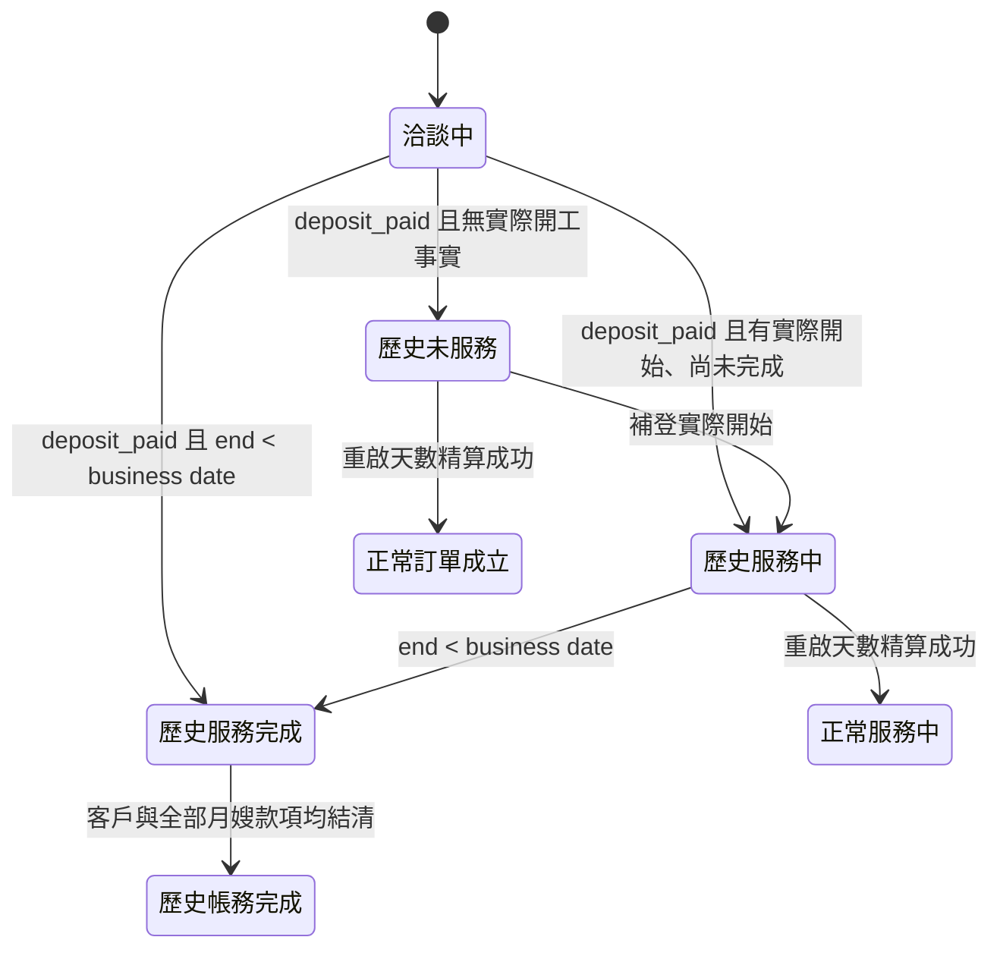

# 歷史訂單生命週期與服務天數帳務正式規格

## 1. 文件狀態與權威

- 狀態：`approved-formal-specification`
- 人工裁決日期：2026-09-01
- 適用範圍：Historical Orders workbook 採納、Orders 歷史生命週期分支、歷史服務天數確認、
  Client Finance／Payroll／Staff Payables impact、帳務結清及重啟天數精算。
- 本文件是上述範圍的 current SSOT；較早要求歷史案件必須先建立逐日正式服務日才能計算帳務的文字，
  在本範圍內由本文件 supersede。
- 本規格授權後續依明確人工指示建立實作與驗收依據；本文件本身不授權 production DB、migration、
  deployment、銀行外部操作、Git commit／push 或其他 external effect。

本文件不改變既有 Domain owner：Orders 擁有 lifecycle 與歷史來源採納；Scheduling 擁有正式逐日
服務日期；Payroll 擁有月嫂義務；Client Finance 擁有客戶義務與核銷；Staff Payables 擁有月嫂出款
與結清。跨 Domain mutation 仍由單一 application workflow 擁有 outer Unit of Work。

## 2. 目標與非目標

### 2.1 目標

1. 將可辨識的舊系統訂單推進到明確的歷史生命週期分支，不偽造正常流程不存在的簽約、排班或銀行事實。
2. 允許歷史案件以每位月嫂確認的 `actual_service_days` 計算應收應付，不要求還原逐日排假。
3. 歷史案件固定按單薪計算；舊系統沒有雙薪功能，不因今日 Holiday／special-pay 政策回溯增加金額。
4. 未服務及服務中的歷史案件可由工會人員重啟天數精算，回到正常 Orders lifecycle。
5. 只有客戶與全部月嫂款項均實際結清後，才可進入「歷史訂單－帳務完成」。

### 2.2 非目標

- 不以 `actual_service_days` 反推或偽造任何逐日 `staff_schedule`。
- 不由歷史訂單狀態偽造 Finance Import 銀行流水、allocation、付款日期或外部匯款結果。
- 不讓 UI 傳入任意 target lifecycle status、費率、應收總額、應付總額或樓層費結果。
- 不改變正常訂單的正式服務日、雙薪、請假代班、取消、AutoComplete 或結清規則。
- 不讓已進入歷史服務完成或歷史帳務完成的案件倒退為正常服務中。

## 3. 名詞與根事實

### 3.1 歷史生命週期狀態

Orders 新增下列正式 lifecycle branch：

| 穩定識別 | 顯示文字 | 意義 |
|---|---|---|
| `historical_unserved` | 歷史訂單－未服務 | 舊系統斷言訂金已付，但沒有可採納的實際開工事實 |
| `historical_in_service` | 歷史訂單－服務中 | 已有實際開始事實，尚未到達歷史完成條件 |
| `historical_service_completed` | 歷史訂單－服務完成 | 歷史結束日嚴格早於目前 business date，等待天數確認或帳務結清 |
| `historical_accounting_completed` | 歷史訂單－帳務完成 | 歷史服務天數已確認，客戶與全部月嫂款項均已實際結清 |

歷史狀態是 Orders lifecycle 的正式分支，不是 UI-only badge。即使案件經精算回到正常 lifecycle，
其 historical adoption provenance、來源列、receipt 與既有 immutable accounting events 仍永久保留。

### 3.2 歷史服務天數事實

`HistoricalActualServiceDayCountFact` 是按案件、月嫂／歷史 assignment 保存的正式人工確認事實，至少包含：

- `case_no`
- `staff_id`
- historical assignment／pairing identity
- 正整數 `actual_service_days`
- actor、reason、correlation、expected owner versions
- source historical adoption identity
- fingerprint、idempotency identity、immutable event／receipt identity

訂單總實際服務天數固定為所有有效月嫂事實的整數加總。多月嫂案件必須逐位月嫂輸入，不得只輸入
總天數後由系統猜分配。此事實可作歷史帳務的服務量權威，但不是正式服務日期或 Scheduling occupancy。

### 3.3 歷史訂金已付斷言

舊系統 `deposit_paid` 可建立受限 `historical_deposit_paid_assertion`，供 Orders 進入歷史分支；它不等於
Finance Import bank fact，也不得偽造收款日、金額或 allocation。客戶帳務是否結清仍只由 Client Finance
ledger／allocation，或其正式 Historical Payment Evidence／Settlement command 決定。

## 4. Workbook 列分類與採納

### 4.1 唯一結果分類

每一來源列只可得到下列其中一種業務結果：

1. `not_adopted`：不採用。
2. `matching_pending_deposit`：配對中、未付訂金。
3. `historical_unserved`：訂金已付、尚未服務。
4. `historical_in_service`：訂金已付、服務中。
5. `historical_service_completed`：訂金已付、服務完成。

`historical_accounting_completed` 不是 workbook 匯入結果；只能在服務天數確認、正式義務建立及雙邊款項
實際結清後，由 Orders lifecycle projection 產生。

### 4.2 不採用

來源案件編號空白、來源訂單狀態空白、來源列代表舊系統取消而本次不需補建，或無法唯一命中既有
Order 時，結果為 `not_adopted`：

- 不寫 Orders、Matching、Scheduling、Client Finance、Payroll 或 Staff Payables 根事實。
- 不建立 `review_required`、review outbox 或帳務異常。
- Preview／receipt 仍可回傳 server-owned `not_adopted` aggregate count，供操作者確認來源列數守恆。

非空但不屬版本化 allowlist 的狀態、無效日期文字、結束早於開始、同名月嫂不唯一或來源區間衝突，
不是「空白不採用」；它們固定回 typed validation／conflict 並依 whole-workbook atomic 契約零寫入。

### 4.3 配對中、未付訂金

來源仍屬洽談、月嫂姓名能唯一解析，而開始日空白時：

- Orders lifecycle 維持正常 `洽談中`。
- Matching 推進為「配對中、未付訂金」。
- Orders 原本 `planned_start_date`／預計服務開始日期維持不變。
- 不寫 `actual_start_date`、`actual_end_date`，不建立歷史訂金斷言、歷史服務天數或帳務義務。

月嫂姓名空白、找不到或同名不唯一時不得猜 `staff_id`；依 §4.2 回不採用或 typed validation，取決於
是否為真正空白來源或非空矛盾來源。

### 4.4 訂金已付、尚未服務

來源斷言 `deposit_paid` 且符合以下任一情形時，進入 `historical_unserved`：

- 來源開始日空白；或
- 來源開始日等於 Orders `planned_start_date`。

此時預計服務開始日期維持不變，`actual_start_date`／`actual_end_date` 不寫入或維持 `NULL`。不得由來源
結束日、合約 `service_days` 或假日政策推定已開工。

### 4.5 訂金已付、服務中

來源斷言 `deposit_paid`，來源開始日不等於 `planned_start_date`，且結束日空白或結束日大於等於目前
business date 時，進入 `historical_in_service`：

- 直接以來源開始日寫入 `actual_start_date`。
- 來源結束日可解析時直接寫入 `actual_end_date`；空白則維持 `NULL`。
- 寫入結束日不代表已完成；完成判定只依 §4.6。
- 不依合約天數延展、縮短或替換來源區間。

### 4.6 訂金已付、服務完成

來源斷言 `deposit_paid`、來源開始日不等於 `planned_start_date`、結束日有效，且：

```text
source_actual_end_date < BusinessClock.today()
```

時，進入 `historical_service_completed` 並直接保存來源實際起訖。判定使用 strict less-than：假設系統日為
2026-09-01，結束日 2026-08-31 已完成；結束日 2026-09-01 或更晚仍是服務中。

## 5. 歷史生命週期轉換



任何 caller 都不得直接提交 target status。Import、日期補登、歷史帳務結清投影及重啟精算各自由 typed
command 依 fresh authoritative facts 計算合法 after status。

歷史服務完成後不倒退為服務中；若需補足逐日證據，只能以追加 evidence／accounting correction 處理，
不能刪除已結算事件或重寫 immutable 歷史。

## 6. 歷史服務天數帳務

### 6.1 輸入與完整性

單一管理 command family 接受每位月嫂：

```json
{
  "case_no": "115000019",
  "caregivers": [
    {"staff_id": 3, "actual_service_days": 2},
    {"staff_id": 7, "actual_service_days": 1}
  ]
}
```

每位有效歷史 assignment 必須恰有一筆確認值，`staff_id` 不可重複，天數必須為正整數；未列入、額外
列入、跨案、無 assignment、重複或非正整數均 fail closed。案件總天數不必等於 Orders 原合約
`service_days`，可小於或大於。

### 6.2 單薪與時數

歷史帳務固定：

```text
staff_actual_hours = staff_actual_service_days × service_hours_per_day
historical_double_pay_days = 0
historical_double_pay_hours = 0
```

不讀取 Holiday、special-pay event 或今日雙薪政策，不提供雙薪輸入欄位。這是舊系統帳務相容規則，
只適用 `historical_*` lifecycle branch；正常訂單仍依 Payroll 正式逐日服務事實計算雙薪。

### 6.3 樓層費

歷史案件全案樓層費固定：

```text
historical_floor_fee
= ROUND_HALF_UP(contractual_floor_fee × total_actual_service_days / contracted_service_days)
```

`total_actual_service_days` 可以大於 `contracted_service_days`，樓層費隨比例繼續增加，不設原合約總額
上限。全案整數金額形成後，再依每位月嫂 `actual_service_days` 以最大餘數法守恆分配；UI 不得傳入
分配結果。

### 6.4 Payroll／Staff Payables

Payroll 以歷史天數事實、Orders 每日時數、assignment 費率快照及 §6.3 樓層費分配建立逐 assignment
整數應付：

```text
service_salary = actual_service_days × service_hours_per_day × hourly_rate
total_payable = service_salary + floor_fee_allocated + effective_adjustments
```

未付款義務可依 fresh 歷史天數重建；已有正式付款歷史時，不覆寫舊 obligation／payout，而以 immutable
adjustment／reversal／recovery 表達差額。Staff Payables 仍以正式 payout ledger 或既有 Historical Payout
Evidence／Settlement 證明實際結清。

### 6.5 Client Finance

Client Finance 以總實際時數、Orders 條款、客戶資格、費率政策及歷史樓層費建立或調整客戶義務。
政府補助、自費超額、樓層費、已收款後減額的 refund 及增加的 additional charge 仍依 Client Finance
既有方向與 immutable obligation／ledger 契約；只把服務量來源替換為本規格的歷史天數事實。

首要付款證據仍是 Finance Import canonical bank fact；舊證據不存在時可使用既有 Historical Payment
Evidence／Settlement。不得以 `historical_deposit_paid_assertion` 單獨宣告所有客戶款項結清。

### 6.6 原子性

「確認歷史實際服務天數」Apply 必須在單一 outer UoW 中：

```text
鎖定 Orders／歷史 assignment／terms／Client Finance／Payroll versions
→ 重建 Preview 與 fingerprint
→ 追加每位月嫂歷史天數事實
→ 建立或調整 Client Finance obligations
→ 建立或調整 Payroll staff obligations
→ 寫 Orders／Finance／Payroll receipts 與 outbox
→ 單次 commit
```

任一步失敗即全部 rollback。Preview 零寫入；Apply fresh-read；same key＋same command replay 原 receipt，
same key＋different payload fixed conflict。不得以 retry 掩蓋 version／fingerprint stale。

## 7. 帳務完成投影

`historical_accounting_completed` 必須同時滿足：

1. 案件目前為 `historical_service_completed`。
2. 每位有效歷史 assignment 都有已採用的 `actual_service_days` 事實。
3. 由該 revision 產生的 Client Finance 客戶應收、補收、退款及相關 adjustment 全部 balance = 0。
4. 由該 revision 產生的每位月嫂 Payroll obligation 在 Staff Payables 全部 balance = 0。
5. 不存在 ownership、金額、版本、return／reversal 或 settlement binding blocker。

「義務已計算」不是帳務完成；客戶款項及月嫂款項必須真的都已結清。Client Finance 與 Staff Payables
各自輸出 typed settlement facts，Orders 只投影 lifecycle，不得自行查表猜餘額或代替帳務 Domain 核銷。

後續合法 return、reversal、退款重開、月嫂退匯或 strictly-newer obligation correction 使任一 balance 再度
非零時，帳務 Domain 保持 actionable 狀態並輸出 blocker；既有 lifecycle event 不刪除。是否需要新的
Orders correction state 必須另由正式規格裁決，不得由 projector 靜默倒退 terminal lifecycle。

## 8. 重啟天數精算

工會人員可在 `historical_unserved` 或 `historical_in_service` 使用單一「重啟天數精算」Q/P/A：

- `historical_unserved`：成功建立正常正式服務日／必要 commitment 後，回到正常 `訂單成立`。
- `historical_in_service`：成功建立有效 Scheduling generation、assignment-owned 正式服務日及 actual-start
  reconfirmation 後，回到正常 `服務中`。

Apply 必須鎖定 Orders、Scheduling、Client Finance、Payroll 及歷史天數 revision（若存在），重建正常
精算 impact；歷史 count-based obligations 已存在時，只能以 immutable difference actions 對齊精確日期
結果，不能重複建立或覆寫已付款事件。成功後 historical provenance 保留，但 lifecycle 不再位於歷史分支。

`historical_service_completed`、`historical_accounting_completed` 不允許藉此倒退為正常服務中；其更正走
owner-specific historical evidence／adjustment command。

## 9. API 與管理 UI

管理端只提供一個「歷史訂單服務與帳務」介面，組合 server-owned Query 與兩個明確動作：

1. 確認每位月嫂實際服務天數並 Preview／Apply 應收應付。
2. 對未服務／服務中的歷史訂單重啟天數精算。

後端是一個 bounded API resource／command family；因人工確認與 stale protection，Preview 與 Apply 可為
同一資源下的不同 HTTP operation，不得為追求單一 HTTP call 省略 PreviewFingerprint、expected versions
或 idempotency。UI 不計算 lifecycle、完成日、總天數、雙薪、時數、樓層費或金額，只顯示 server result。

Query／Preview 至少回傳：目前歷史狀態、來源實際起訖、business date、原合約天數、逐月嫂確認天數、
總實際天數、單薪時數、樓層費、逐月嫂應付、客戶義務方向與金額、雙邊 settlement 狀態、blockers、
owner versions 及 fingerprint。

## 10. Stable failure semantics

至少包含：

- `historical_order_source_status_invalid`
- `historical_order_date_range_invalid`
- `historical_order_staff_not_unique`
- `historical_order_source_schedule_conflict`
- `historical_order_lifecycle_transition_invalid`
- `historical_actual_service_days_required`
- `historical_actual_service_days_invalid`
- `historical_actual_service_days_assignment_mismatch`
- `historical_actual_service_days_candidate_stale`
- `historical_accounting_obligation_binding_invalid`
- `historical_client_settlement_incomplete`
- `historical_staff_settlement_incomplete`
- `historical_accounting_completion_blocked`
- `historical_precision_restart_not_eligible`
- `historical_precision_restart_candidate_stale`
- `idempotency_conflict`
- `transaction_failed`

Validation／domain blocker 固定零寫入；version／fingerprint drift 回 typed conflict，不得回 generic 500；暫時性
DB／lock failure依 Global typed unavailable 契約處理。

## 11. 驗收情境

1. 案件編號或來源狀態空白列：`not_adopted`，0 review、0 Domain write，aggregate count 守恆。
2. 洽談列、唯一月嫂、開始日空白：Orders 維持洽談中，Matching 顯示配對中未付訂金，預計日保留。
3. deposit-paid、開始日空白：進入歷史未服務，actual 起訖維持 null。
4. deposit-paid、開始日等於預計日：進入歷史未服務，不把預計日偽造為 actual start。
5. business date 2026-09-01、來源結束日 2026-09-01：歷史服務中。
6. business date 2026-09-01、來源結束日 2026-08-31：歷史服務完成。
7. 原合約 40 日、單月嫂確認 3 日：按 3 日單薪及 3/40 樓層費建立雙端義務，0 正式服務日期。
8. 原合約 25 日、兩位月嫂確認 15／11 日：總天數 26，薪資按各自天數，樓層費按 26/25 增加並守恆分配。
9. 歷史來源期間包含今日政策的雙薪日：double-pay days/hours 固定 0，金額仍按單薪。
10. 只有義務建立、尚未付款：維持歷史服務完成，不得進帳務完成。
11. 客戶全部方向與全部月嫂 obligations 實際 balance = 0：推進歷史帳務完成。
12. 多月嫂缺一人天數、額外 staff、重複 staff、0／負數／小數：Preview fail closed，0 partial write。
13. 歷史未服務重啟精算成功：回正常訂單成立，historical provenance 保留。
14. 歷史服務中重啟精算成功：回正常服務中，count-based 與 precise-date 金額差額只追加 immutable actions。
15. 歷史服務完成／帳務完成嘗試倒退到服務中：typed blocked，0 write。
16. 任一跨 Domain writer／outbox／receipt 失敗：Orders、天數、義務、versions 全部 rollback。

## 12. 實作與資料升級邊界

後續實作必須先盤點 live schema 是否已有可承擔的 Orders historical lifecycle root、逐 assignment 歷史天數
event／projection、版本與 receipt。若需 schema，必須 additive、同時涵蓋 fresh bootstrap 與 preserve-data
upgrade；不得以 reset DB 取代 migration 證據，也不得自動 backfill `actual_service_days`。

既有 `actual_service_days` query／Payroll 值是由 `staff_schedule.is_work_day` 或正式 `service_dates` 衍生的
projection，不是本規格的人工歷史根事實。實作不得共用同一無 provenance 欄位而讓 count-based 與
date-based 來源無法辨識；Query 必須公開 calculation basis 與 source revision。

完成實作至少需要 Orders、Scheduling、Payroll、Client Finance、Staff Payables 的 owner-local tests，
跨 Domain transaction／rollback／replay tests，API contract tests，以及單一 React 管理介面的狀態與錯誤驗收。
