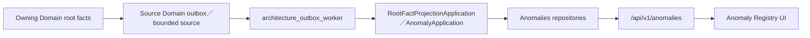

# Legacy Retirement Wave 2B Anomalies Caller Migration Decision Package

## 1. 狀態與授權邊界

- 狀態：`decision-complete-caller-exit-not-authorized`
- 建立日期：2026-08-03
- Repository branch：`codex/refactor-api-streamlit-architecture`
- HEAD：`4081a9b40c91a030c64f1d488411287ec6c01bdc`
- 正式架構依據：`06_Anomalies_Domain.md`、已核准的 `15`～`18`
- 前置裁決：`20_Legacy_Retirement_Wave_2_Decision_Package.md`
- Live Inventory：`662` findings
- Live fingerprint：
  `d0a0007df33120d761d82d60707b948b28ccadc9e2e31ecd394762027cae1ddb`

本包只完成 caller、typed API、outbox、等價驗證、410／unmounted 時點、Inventory
delta 與 rollback 設計。不得修改 production／test code、schema、資料、部署設定或
Git state；不得移除 writer。

## 2. 強模型裁決摘要

三個 legacy modules 的 production 可達性並不相同：

| Module | Runtime production caller | Residual source／maintenance caller | 裁決 |
|---|---:|---|---|
| `services/finance_alert_workflow.py` | 0 | unmounted legacy router、legacy tests | `caller-exit-ready-after-dirty-overlap-approval` |
| `services/finance_alert_events.py` | 0 | legacy workflow、legacy tests | `caller-exit-ready-after-upstream-removal` |
| `services/finance_alert_detection.py` | 0 server/runtime | dead `finance_alert_wiring`、fake-data script、legacy tests | `migrate-maintenance-caller-then-remove` |

關鍵現況：

1. `api/main.py` 沒有 import 或 include `api.routes.finance_alerts`。
2. `tests/test_legacy_alert_routes_retired.py` 明確要求
   `/api/v1/finance-alerts*` 與 `/api/v1/system-alerts*` 不出現在 production OpenAPI。
3. `ui/pages/06_finance_alerts.py::show()` 目前只渲染正式
   `AnomalyRegistryApiClient`／`render_anomaly_registry_panel`；舊
   `FinanceAlertCenterApiClient` helpers 是不可達的 source residue。
4. `services/finance_alert_wiring.py` 自稱由 import script 呼叫，但 live production
   roots 沒有任何 caller；正式 dispatch 已在
   `services/finance_import_dispatch.py` 以 no-op compatibility symbol 停止舊 alert
   side effect。
5. `services/architecture_outbox_worker.py` 與正式 source consumers 都不 import 三個
   legacy modules。

因此這不是「把仍在線的 Finance Alert API 改接」；真正工作是：

- 移除未掛載的 legacy route source 與其舊測試契約；
- 清掉 UI 中不可達的 legacy helper；
- 把 fake-data seed 從 legacy table writer 改成正式 root-fact／outbox 測試資料；
- 移除沒有 caller 的 `finance_alert_wiring`；
- 最後才讓三個 legacy modules 達到 source caller=0。

## 3. Fresh source identity 與 dirty overlap

### 3.1 Target modules

| Path | SHA-256 | Git state |
|---|---|---|
| `services/finance_alert_detection.py` | `ab74569ff80936906188dbcda0d01c43c0c99024c0d5f0f4879806b936335da4` | tracked, clean |
| `services/finance_alert_events.py` | `b86591954a69fa08f2eb02ff7dec2eab9521d0ac0d81fefcaafc0a65f8150a60` | tracked, clean |
| `services/finance_alert_workflow.py` | `2470c112f9591b10b4f4f1c84fc11f2fab9f2399ddbd603b5f21bc3b6d6a3a1e` | tracked, clean |

### 3.2 Caller／replacement paths

| Path | SHA-256 | Git state | 影響 |
|---|---|---|---|
| `api/routes/finance_alerts.py` | `9ad12720a0b9498d7ae592bf4b366b88808f276c74ff6b4301d2e7b3841ea313` | tracked, modified | legacy workflow source caller；未掛載 |
| `api/main.py` | `34f2c973eb4664fc1cab3146f6b32f8d606dcd167e023e750298b88715d319bd` | tracked, modified | 只掛載 canonical anomaly routes |
| `ui/pages/06_finance_alerts.py` | `f5df548b9edb96a45b2f440e2c51d0487881d3d4e30856e6230fd399a44f2db3` | tracked, modified | canonical UI 已生效；舊 helpers 尚在 |
| `services/finance_alert_wiring.py` | `d4530af5467671a9c04de083ad64509b7ab653b08df19e13336550c1e499dc8a` | tracked, clean | detection 的 dead source caller |
| `scripts/generate_fake_data.py` | `b6115e97172edbcce19e555eb01ec594d0365ce62b4e3195904fc5e549d09bcb` | tracked, modified | detection 的 maintenance caller |
| `subsystems/anomalies/alert_workflow.py` | `a380ced1ecbb0d640c4b4e72e46b73246ff8952e57330e6090c9a24fb4557c57` | untracked | canonical workflow |
| `api/routes/anomaly_registry.py` | `d24aee43fe6af292b98b4399c52149104c8df7a0994cb2536e3f7778844790c7` | untracked | canonical typed API |
| `services/architecture_outbox_worker.py` | `4ec912edf8c54c0d7a975e2b1f25a10d01b2cb0cf681df2eaa9c64dc82ee7e7f` | untracked | canonical consumer runner |
| `services/finance_import_anomaly_consumer.py` | `e2c54018c0455f39e7f2f70e4eca99b9a3488e05b778e7543076a559e3cf94b4` | untracked | Finance Import outbox consumer |

未來 caller cleanup 若要修改 `api/routes/finance_alerts.py`、
`ui/pages/06_finance_alerts.py` 或 `scripts/generate_fake_data.py`，必須在獨立
Work Package 明確接受這三個 dirty overlaps。不能把本文件當作寫入授權。

## 4. 完整 caller chain

Machine-readable manifest：

`evidence/legacy_retirement_wave_2b_anomalies_caller_migration/caller_manifest.json`

### 4.1 `finance_alert_workflow`

Production-source direct caller：

- `api/routes/finance_alerts.py:27`

但 route 未由 `api/main.py` import／include，production OpenAPI 不存在
`/api/v1/finance-alerts*`。所以：

- runtime HTTP caller：0
- reachable UI caller：0
- residual production-source caller：1
- test-only callers：legacy router／workflow／lifecycle integration tests

### 4.2 `finance_alert_events`

Production-source direct caller：

- `services/finance_alert_workflow.py:7`

因上游 workflow 目前不可由 production router 到達：

- runtime caller：0
- residual production-source caller：1
- test-only callers：events、formal-event compatibility、lifecycle integration tests

### 4.3 `finance_alert_detection`

Production-source direct callers：

- `services/finance_alert_wiring.py:27`
- `scripts/generate_fake_data.py:1595`

其中：

- `finance_alert_wiring.py` 沒有 live caller；
- `generate_fake_data.py` 是明確 maintenance／fake-data caller，不是 FastAPI、UI、
  worker 或 outbox runtime；
- server runtime caller：0；
- maintenance caller：1；
- test-only callers：detection 與 lifecycle integration tests。

### 4.4 UI

`ui/pages/06_finance_alerts.py` 仍定義 `_client()`、`_render_alert_family()`、
`_render_import_tab()` 等 legacy helpers，但 production `show()` 經
`_render_finance_operation_center()` 只走：

- `AnomalyRegistryApiClient`
- `AnomalyRecoveryApiClient`
- `render_anomaly_registry_panel`

舊 helper 沒有 call site。UI 已完成 runtime cutover，但 source cleanup 尚未完成。

### 4.5 Worker／outbox

以下正式鏈不 import 三個 legacy modules：



已存在的來源包括 Finance Import outbox、BeClass outbox、Scheduling coverage、
Government Subsidy sources 與 Staff Payables sources。

## 5. Typed API 對照

| Legacy Finance Alert | Canonical Anomalies | 裁決 |
|---|---|---|
| `GET /api/v1/finance-alerts` | `GET /api/v1/anomalies` | list 改用 fingerprint、definition、source identity、predicate 與 workflow version |
| `GET /api/v1/finance-alerts/{alert_id}` | `GET /api/v1/anomalies/{fingerprint}` | numeric mutable row ID 不再是 public identity |
| `POST .../{alert_id}/claim`＋body `operator` | `POST .../{fingerprint}/claim`＋`expected_workflow_version`＋Idempotency／Correlation headers | actor 由 authenticated principal 決定；禁止 UI 自填 operator |
| `POST .../{alert_id}/resolve`＋body `operator/reason` | `POST .../{fingerprint}/resolve`＋version／reason／Idempotency／Correlation | typed CAS、exact replay、server actor |
| `AlertStatus=open/claimed/resolved` | `predicate_active`＋`workflow_status` | root condition 與人工進度分離 |
| legacy event list | canonical detail timeline | projector event 與 workflow event 由 Anomalies adapters 寫入 |
| `candidate_snapshot`／金額欄位 | definition-governed `display_snapshot` | 只顯示 registry 核准欄位；不是舊 payload 無損轉貼 |
| arbitrary route-side SQL | `AnomalyApplication`＋repository＋UoW | route 不得直接取 connection 或 commit |

Canonical API 目前要求 system-admin authentication。舊 route 沒有
`require_system_admin`，且讓 UI 傳入 operator；它不能作 compatibility adapter。

## 6. Source Domain outbox 對照與語意 blocker

### 6.1 已有正式路徑

- Finance Import：`finance_import_outbox` →
  `finance_import_anomaly_consumer` →
  `finance_import_manual_review`／`IMPORT-006`。
- Government Subsidy：正式 GOVSUB definitions 與 bounded root-fact sources。
- Staff Payables：正式 PAYOUT definitions 與 bounded source scans。
- canonical application 支援 fingerprint、checkpoint、active／inactive、re-open、
  workflow CAS、idempotency 與 replay。

### 6.2 不得假裝一對一的 legacy mappings

`services/finance_alert_wiring.py` 曾建立下列細分類：

- Client receipt：case missing／ambiguous、overpay、terms changed；
- subsidy return：shared account、underpaid／overpaid；
- Government Subsidy：same-amount multi-batch ambiguity；
- Staff Payables：settlement ambiguity、missing reference、shared bank account、
  amount mismatch。

正式 registry 不是逐字複製這些 legacy codes。Finance Import 的 generic manual-review
projection 可保存 `reason_codes`／`domain_blockers`，Government Subsidy／Staff Payables
也已有 owning-Domain definitions，但以下不能宣稱已完成逐欄等價：

1. Client receipt 的 expected／actual／difference 顯示欄位；
2. Client receipt terms-change 的獨立 definition；
3. subsidy return underpaid／overpaid／shared-account 的正式 definition；
4. 所有 legacy staff reason 與 PAYOUT-001～003 的一對一映射。

這些是業務語意 gap，不是移除 module 時可以順便補的功能。本 Wave 不新增 definition、
不碰退款、不改 schema／資料。若產品仍要求這些能力，必須回 owning Domain 另立規格
與 source fact WP；不得讓 legacy detector 繼續當 fallback。

由於 live dispatch 已停止呼叫 `finance_alert_wiring`，上述 legacy side effect 目前不是
production 行為。code retirement 可以「保留正式現況」為目標，但不能對外宣稱新舊
所有 legacy alert codes 等價。

## 7. 精確切斷順序

### Wave 2B-1：Caller Exit（未授權）

1. Fresh-read branch、HEAD、所有下列 path hashes 與 dirty overlap。
2. 先驗證 canonical Anomalies Module／Subsystem／API／UI 及 outbox tests。
3. `api/routes/finance_alerts.py`：
   - 因已未掛載，不做 caller 改接；
   - 移除 dormant route source 與 `tests/test_finance_alert_router.py`；
   - 不修改 `api/main.py`，避免重新掛載 legacy route。
4. `ui/pages/06_finance_alerts.py`：
   - 只移除不可達 legacy finance-alert imports／helpers；
   - 保留 canonical Anomalies、Finance Import、BeClass、Government Subsidy UI；
   - 不順便移除仍被 `system_alerts` source／tests 共用的 schema。
5. `services/finance_alert_wiring.py`：
   - 再次驗證 caller=0 後整檔退出；
   - 不改正式 `services/finance_import_dispatch.py` 的 no-op compatibility 行為。
6. `scripts/generate_fake_data.py`：
   - 移除 legacy `create_or_get_finance_alert` import／call；
   - 若 fake scenario 仍需要 anomaly，僅能建立正式 source root fact／outbox，
     並限定 disposable fake database；
   - 不直接寫 Anomalies projection table。
7. 將依賴三個 legacy modules 的 tests 分成：
   - 純 legacy 契約：待 removal WP 與 module 一起移除；
   - 正式 invariant：改由 canonical Anomalies tests覆蓋，不保留舊 table writer。
8. 重跑 caller manifest；三個 target 必須只剩 paired legacy tests。

### Wave 2B-2：Module Removal（另行核准）

1. 驗證三個 target source hashes、caller=0 與 Wave 2B-1 receipt。
2. 先移除 `finance_alert_workflow.py`，再移除 `finance_alert_events.py`，最後移除
   `finance_alert_detection.py`；實際 patch 可同批，但驗證依賴必須依此順序。
3. 同批移除／改寫只驗 legacy tables／workflow 的 tests。
4. 保留 canonical Anomalies tests、routes、UI、worker、outbox consumers、
   repositories 與正式 root-fact sources。
5. Fresh-run Inventory；只允許第 9 節五個 identities 消失。

## 8. 410／unmounted 時點裁決

Current production surface 已是「route 不掛載」，不是 410：

- OpenAPI 沒有 `/api/v1/finance-alerts*`；
- 現有正式 test 要求 route 不存在；
- 沒有證據顯示 production public client 仍依賴該 path。

本包裁決：

- 不得為了形式上取得 410 而重新掛載 legacy router；
- Wave 2B-1 維持 unmounted 狀態；
- 若 API expiry／deployment telemetry 證明仍有外部 client，需要 410，必須另立
  Deployment／expiry WP，只能加入無 writer、無 legacy import、帶 replacement path
  的薄 adapter；
- 該治理問題不得阻止先移除 dormant writer source，但 code-removal WP 必須由人工明確
  接受「unmounted 404／not in OpenAPI」作為退役狀態。

## 9. Inventory 預期差異

三個 modules 共五個 exact findings：

| Source | Symbol | Operation | Table | Fingerprint |
|---|---|---|---|---|
| `finance_alert_detection.py` | `create_or_get_finance_alert` | `INSERT` | `finance_alert_events` | `325756c3c492f44d` |
| `finance_alert_detection.py` | `create_or_get_finance_alert` | `INSERT` | `finance_alerts` | `52a43e50ec89c579` |
| `finance_alert_events.py` | `append_finance_alert_event` | `INSERT` | `finance_alert_events` | `21fcd942a7524b32` |
| `finance_alert_workflow.py` | `claim_finance_alert` | `UPDATE` | `finance_alerts` | `fb2a599763d1714a` |
| `finance_alert_workflow.py` | `resolve_finance_alert` | `UPDATE` | `finance_alerts` | `ea9e439a4342970e` |

Wave 2B-1 caller cleanup 不得改變 Inventory count／fingerprint。

Wave 2B-2 若且僅若移除三個 modules：

- expected findings：`657`
- expected fingerprint：
  `e939d90d079d55ddba4b3574a7140f3a2578bfe74e09ad77fec031c197f0440e`
- 只允許上述五個 identities 消失；
- canonical Anomalies writer 不得消失或新增未分類 writer。

## 10. Old／new 等價驗證矩陣

| Gate | 必驗證內容 | Pass 條件 |
|---|---|---|
| Runtime surface | production OpenAPI 與 router inclusion | canonical `/api/v1/anomalies*` 存在；legacy finance/system alert routes 不存在 |
| Static caller | exact module、symbol、dynamic import、worker、CLI、UI scan | Wave 2B-1 後 production／maintenance caller=0 |
| Root fact | source event → desired state → fingerprint | deterministic；無 route-side detection |
| Projector | checkpoint、replay、active→inactive、resolved→re-open | exact replay；無重複 projection/event |
| Workflow | claim／resolve version、actor、reason、idempotency | stale version conflict；same-key exact replay；actor 由 server auth |
| Query | summary／detail／timeline／available actions | 只讀 canonical projection；definition-governed display |
| Partial failure | failed outbox、retry、worker restart | source transaction 不回滾；可安全 retry；checkpoint 不跳號 |
| UI | `show()` 與 anomaly panel source scan | 不 import／construct legacy finance client；只呼叫 typed API |
| Fake data | isolated disposable database | 不寫 `union_db`；不直接呼叫 legacy writer 或 projection repository |
| Inventory | before／after exact multiset | Wave 2B-1 零差異；Wave 2B-2 只少五個 identities |
| Legacy data | runtime readers／writers scan | tables 可暫留 dormant；不得在本 Wave drop、truncate、rewrite |

本 Decision Package 執行的有限 replacement smoke：

```text
15 passed, 1 StarletteDeprecationWarning
```

涵蓋：

- `tests/test_legacy_alert_routes_retired.py`
- `tests/test_anomaly_registry_router.py`
- `tests/subsystems/anomalies/test_alert_workflow.py`
- `tests/test_anomaly_registry_ui_panel.py`

## 11. 歷史 table／資料 blocker

本 Wave 不 drop、truncate、rename 或 migrate：

- `finance_alerts`
- `finance_alert_events`

Code retirement 與 data retirement 必須分離：

1. 若沒有 runtime reader／writer，可先移除 code，tables 保持 dormant／唯讀；
2. 若 audit、法遵或人工歷史查詢仍需要舊 timeline，另立唯讀 archive/query 規格；
3. 若未來要搬到 canonical Anomalies tables，必須另立 data migration WP，包含 row
   mapping、不可變事件、actor、timestamp、hash、reconciliation 與 rollback；
4. 本包不把歷史 numeric `alert_id` 強行轉成 canonical fingerprint。

## 12. Rollback plan

### Wave 2B-1

1. 保存每個 exact caller path 的 pre-change hash 與 path-only patch。
2. 若 canonical smoke、caller scan 或 Inventory 失敗，只恢復該 caller-cleanup paths。
3. 不恢復 legacy router mounting；`api/main.py` 不在預期 writable paths。
4. fake-data rollback 只在 disposable test data context 驗證。

### Wave 2B-2

1. 保存三個 legacy modules 與 paired tests 的 exact blobs。
2. 任一 import／test／Inventory 非預期差異，立即恢復三個 modules 與 paired tests。
3. 恢復後五個 findings 必須完整返回，Inventory 回到 `662` 與原 fingerprint。
4. 不回滾或改動 canonical routes、worker、outbox、schema、資料或其他 dirty paths。

## 13. 下一個可核准 Work Package

下一步只能核准 `Legacy Retirement Wave 2B-1 Anomalies Caller Exit Code Cleanup`，
而不是直接移除三個 modules。

該 WP 必須列出 exact writable paths、接受既有 dirty overlap、保留 canonical
Anomalies runtime，且要求 Inventory 零差異。完成後重新驗證三個 target caller=0，
才可建立 Wave 2B-2 removal package。
