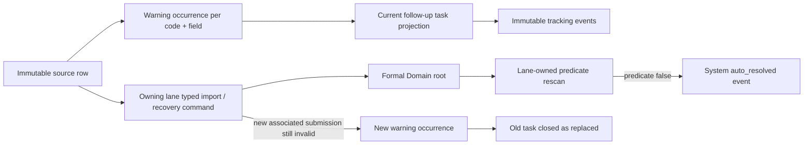

# 92 匯入警示追蹤與分域補件實作 Work Package

## 狀態與授權邊界

本 Work Package 把已裁決的 HCM、Client BeClass、Staff BeClass、Historical Orders 與 Finance Import
業務規則收斂成 `Global → Domain → Subsystem → Module` 實作架構，已於 2026-08-14 經人工確認。後續可依本工作包
進入實作，但 schema／migration 必須逐項通過 DB change gates；本核准不授權操作正式資料、部署或傳送 LINE。

本階段的交付範圍是匯入腳本、各 lane 的 typed Preview／Apply 與正式資料寫入。警示來源事實仍須由
匯入 lane 保存，但警示中心的 UI、查詢、人工狀態 transition 與 `WarningReferral` 轉介一律延後，不能成為
本工作包完成匯入流程的前置條件。

警示類型的顯示、後續處理及解除條件以
[`import_warning_type_review_queue.md`](../03_追蹤清單與證據/import_warning_type_review_queue.md) 為本工作包已採用的驗收輸入；
該文件是追蹤清單，不取代 owning Domain 正式規格。

## Business scenarios

1. HCM 有可用案件編號時先建立正式案件；每個缺漏、格式錯誤或身份關聯問題建立可獨立解除的欄位／關聯警示。
   無可用案件編號時不能建案，只留下來源警示。明確選擇「HCM 歷史過渡」模式時，只要符合最低寫入資格，
   來源欄位直接寫入，不試圖辨識目前 DB 值是否較有效；即使已有帳務、薪資或排程下游根事實也不是
   覆寫 gate。來源「案件狀態」固定排除，維持 Orders lifecycle SSOT；個別無法寫入欄位仍各自警示。
2. Client BeClass 只在 LIFF 上線前，以姓名＋手機精確唯一命中 Client，再要求案件候選唯一；`query_no` 僅供來源追溯。
3. Staff BeClass 歷史資料以有效身分證及姓名作最低建檔資格；後來的歷史快照直接覆蓋可更新欄位與整組集合，
   但缺漏／無效欄位仍各自建立警示。姓名變更只留追溯事件，不製造人工待辦。
4. Historical Orders 的案件編號缺失／不存在固定靜默零寫入。精確命中案件後，不比較來源時間或目前有效值，
   可解析歷史值直接寫入；不能安全寫入的欄位或 assignment 才建立警示。
5. Finance 匯入逐列隔離；可解析列繼續，不能正規化的列建立 source warning。跨檔完全相同交易不新增 occurrence、
   warning 或 reopen，只回報 receipt 計數。
6. 公會人員不知道正確值時，先用合法管道聯絡來源主人。警示中心只追蹤聯絡與處理進度，正式資料由 owning
   Domain typed command 或新受驗證來源寫入。

## 不可破壞的不變量

1. 原始匯入列、issue codes、review／warning occurrence 與所有狀態事件皆 append-only，不 update／delete。
2. 一個來源列有多個問題欄位時，每個 `logical_code + field_path` 都有獨立 warning item 與解除 predicate；UI 可按案件／來源分組，
   但不得因群組顯示而整案一起消除。
3. exact replay 只回傳既有 receipt，不建立新 occurrence、事件、outbox 或待辦。
4. 顯式關聯的重新提交若仍不合格，建立新的 review／warning occurrence；新警示成為 current task，系統對舊 task
   追加 `closed(reason=replaced_by_new_warning, replacement_warning_id=...)`，不等待公會人員確認，也不刪除舊歷史。
5. 顯式關聯的重新提交或 typed root mutation 若使 predicate 不再成立，由系統追加 `auto_resolved`；人工只能結束
   外部追蹤為 `closed`，不能宣稱資料已修正。
6. 沒有 formal root 的 `HCM-CASE-001`、`FINANCE-SOURCE-001` 不能靠姓名、手機、列號或模糊內容推定前後關係；
   新提交必須攜帶受驗證的 prior warning／source association 才能替代或解除舊 task。
7. 警示中心不能接受 corrected payload、選擇任意 candidate、merge roots、覆寫 bank row 或直接寫任何 Domain root；但可用
   `warning_id`、field path、去敏 source reference 與 expected warning version 轉介至 owning Domain typed command。
8. 第一階段不自動傳送 LINE；未來 delivery 必須另有唯一 recipient binding、核准模板、transactional outbox、
   delivery result、retry、opt-out 及人工 recovery 契約。

## Global → Domain → Subsystem → Module 核准架構

### Global

- 沿用既有 actor、command envelope、expected version、fingerprint、idempotency、BusinessClock、outer Unit of Work、receipt
  與 committed outbox 契約，不新增第二套匯入 command 基礎設施。
- 定義共通 `WarningIdentity`、`WarningOccurrenceIdentity`、`WarningTrackingCommand` 與 typed errors；Global 不擁有
  HCM 欄位有效性、BeClass 綁定、Order assignment 或 Finance 分類規則。
- 相同 idempotency key＋相同 fingerprint 回 replay；不同 fingerprint、stale version、未知 transition 固定 fail closed。

### Domain

- `Anomalies` 只擁有追蹤狀態機：`open`、`awaiting_external_confirmation`、`response_recorded`、
  `reimport_requested`、`closed`、`auto_resolved`，以及 actor／transition policy。
- Case Import、Staff、Orders、Finance 各自擁有 warning trigger、正式資料效果、field-level predicate、
  typed recovery command 與可揭露的去敏 projection；不得把這些規則移入 Anomalies generic registry。
- `closed(reason=replaced_by_new_warning)` 與 `auto_resolved` 是 system actor transition；一般操作者不得呼叫。
- `STAFF-BECLASS-NAME-002` 建立後即由 system actor 寫入 `auto_resolved`，只存在稽核歷史，不出現在 active task。

### Subsystem

- `QueryWarnings`：依 actor scope 查 current projection，回傳 typed view；只讀且不載入 raw workbook 或完整敏感值。
- `PreviewWarningTransition`：fresh-read occurrence、current version、actor capability 與 transition；零寫入。
- `ApplyWarningTransition`：重新鎖定 current tracking root，驗證 preview/fingerprint/version，在單一 outer UoW 追加 event、
  receipt、current projection 與 outbox。
- `ApplyLaneImport`／owning typed recovery command 成功提交後，在同一交易或 committed outbox consumer 觸發 predicate rescan；
  外部失敗不得回滾已提交的 Domain root。
- `AssociateResubmission`：只接受 prior warning identity、prior source identity、new source identity 及 owning lane 驗證結果；
  exact replay 不變更 task，新失敗替代舊 task，新成功才自動解除。

### Module／Adapter

- 警示 API 與 Streamlit 只呼叫上述 typed Query／Preview／Apply，不直接寫 repository，也不接受 `corrected_fields`；可提供
  typed `WarningReferral`，將 warning context 帶至 owning Domain command，但轉介不得成為資料寫入旁路。
- `ui/pages/anomalies/beclass_import_review_panel.py` 的直接修正表單必須經 entrypoint governance 退役或改為 tracking-only；
  不得原地換標籤後保留旁路寫入。
- `ui/pages/06_finance_alerts.py` 應以 logical subtype projection 顯示各 lane，不再把不同原因只映射到 umbrella code。
- MySQL adapter 只實作 ports；repository 不 hidden commit。LINE adapter 第一階段不存在 delivery mutation。

## Actor 與能力

| actor | 可做 | 不可做 |
|---|---|---|
| 公會處理人員 | 查詢去敏警示、開始聯絡、記錄已回覆、要求補件、結束外部追蹤、轉介至允許的 owning Domain command | 直接 `auto_resolved`、改來源列、改 Domain root、猜候選或收件人 |
| owning Domain 操作者 | 透過該 Domain 已核准 typed command 寫入正式資料 | 從警示 repository 旁路更新 root |
| system actor | exact replay、predicate rescan、auto-resolve、新警示替代舊 task | 依模糊相似度推定來源鏈 |
| LINE provider | 第一階段無 mutation capability | 自動發送、保存完整對話或推定 recipient |

## Typed contracts

`WarningSummaryView` 至少包含 `warning_id`、`occurrence_id`、`logical_code`、`field_path`、`owning_lane`、
`masked_subject`、`issue_codes`、`tracking_status`、`version`、`allowed_actions`、`last_event_at` 與安全的
`source_reference`。不得含 raw source row、完整個資或任意 candidate payload。

`WarningTransitionCommand` 至少包含 command envelope、warning identity、expected version、target tracking state、
reason code、最小去敏 note 與 evidence reference。`corrected_fields`、`resolved_issue_codes` 或 Domain data 不屬於此 command。

`WarningReferral` 至少包含 warning identity、owning lane、field path、expected warning version、去敏 source reference 與
target command identifier；只用於導航及預填允許的 Domain command context。它不得帶入未驗證的正式欄位值，也不得取代
目標 command 的 Preview／Apply、root lock、receipt 或 domain event。

`ResubmissionAssociation` 至少包含 owning lane、prior warning／source identity、new source identity、new receipt identity
與 typed import outcome。任何一項無法驗證即回 typed conflict，不更新舊 task。

## Source、occurrence、task 與 root 的關係

## Schema 與 migration change inventory（提案）

實際 table／column 名稱必須在架構獲人工確認後，先讀 live schema 與 canonical release chain 才能定案；不得以本段
逕行建立 SQL。

| 分類 | proposed logical object | 資料效果 | replay／rollback | unresolved policy |
|---|---|---|---|---|
| schema-only | immutable warning occurrence | 每個 logical code＋field 保存不可變來源關聯與初始 issue | unique identity 支援 exact replay；release rollback 只移除未使用新 object | rootless source association key 尚需 engine contract |
| schema-only | immutable tracking event | 保存 actor、from／to、reason、evidence ref、time | command receipt 防重；不刪事件 | 去敏 note 的長度與 retention 待定 |
| schema-only | current task projection | 只保存目前 active／terminal projection 及 replacement link | 可由事件重建；drift fail closed | 是否用 table 或 view 待 schema inventory |
| schema-only | resubmission association | 顯式串連 prior warning／source 與 new source／receipt | unique association；錯誤關聯不得 mutation | 各 lane source identity 形狀需逐一驗證 |
| system-seed | warning logical-code registry／display metadata | 建立已人工確認 code、owner、label 與 capabilities | 版本化 seed；未知 code fail closed | 不得把 Domain predicate 寫成可隨意修改 seed |
| business-row-backfill | 無預設 backfill | 不把舊 umbrella reviews 自動拆成新欄位警示 | 如需遷移須另立資料 Work Package | 舊 `IMPORT-004` 等是否保留唯讀 projection 待盤點 |
| destructive | 無 | 不刪舊 review、event、source 或 entrypoint | 不適用 | entrypoint 退役依治理流程，不直接刪檔 |

## Write set（待核准後才可使用）

- `document/架構重整/01_規格基線/`：把人工確認的 subtype、actor、predicate 與 UI／API contract 收斂到 owning 規格及索引。
- `document/架構重整/02_決策與退役執行記錄/`：本 WP、entrypoint review、migration／release evidence link。
- `document/架構重整/03_追蹤清單與證據/`：warning registry、test／migration receipts；不得升格成規格。
- `domains/anomalies/` 與各 owning Domain：tracking state machine 與 lane predicate。
- `subsystems/anomalies/`、各 import subsystem、`infrastructure/mysql/`：typed orchestration 與 ports。
- `api/`、`ui/pages/06_finance_alerts.py`、`ui/pages/anomalies/`：typed transport 與 tracking-only UI。
- `db/schema_parts/`、`db/migration_releases/`、canonical migration catalog／descriptor、developer upgrade docs。
- `tests/`、`validation/`：focused、integration、UI、disposable MySQL、preserve-data evidence。

不得修改正式資料、production deployment、LINE delivery 或 WP87 Staff retirement 行為。

## Required tests

1. 每個 logical code 的 trigger、正式資料效果、field-level predicate 與去敏 view contract。
2. 狀態機 actor matrix；人工 `closed` 不改 root，也不使資料 predicate 成功。
3. same command replay、different payload conflict、stale version、concurrent Apply 與 single outer UoW。
4. exact source replay 零新 occurrence；關聯新失敗建立新 occurrence 並由 system 關閉舊 task；關聯成功才 `auto_resolved`。
5. HCM 有案號但多欄位錯誤仍建正式案件，且各欄位可獨立補齊／消除；無案號固定不建案；HCM 歷史過渡模式
   對符合資格的欄位直接寫入，不產生 current-value conflict，且不得改寫 Orders lifecycle status。
6. Client pre-LIFF 只接受姓名＋手機及唯一案件；`query_no` 永不參與綁定。LIFF lane 直接綁定且不產生過渡警示。
7. Staff snapshot 覆蓋 mutable scalars／完整集合；缺漏欄位警示保留；姓名變更只進歷史區。
8. Historical Orders unmatched case 零寫入；matched valid values 直接寫入且不產生 current conflict；無效欄位逐項警示。
9. Finance mixed-validity workbook 逐列隔離；跨檔 exact duplicate 只增加 receipt existing count，不新增 occurrence。
10. UI 無 corrected payload、candidate guessing、root merge 或 direct resolve；typed client schema failure 顯示 typed error。
11. disposable MySQL fresh bootstrap、上一支援版本 preserve-data candidate upgrade、descriptor exactness、migration replay
    與 rollback evidence 全部通過。

## Acceptance

1. 警示類型審核表每一列已有人工確認的 display、actor、next action、LINE policy 與 root predicate。
2. Global、Domain、Subsystem、Module owner 及 transaction／outbox 邊界獲人工確認，且沒有 generic corrected-payload endpoint。
3. 每個 source、occurrence、current task、tracking event、formal root 與 resubmission association 可雙向追溯。
4. 新失敗替代舊 task 與新成功自動解除都有 immutable event、receipt、outbox 及 focused test；舊資料永不刪除。
5. live `open／claimed／resolved` 與 BeClass 直接修正 UI 已依 entrypoint governance 完成 replacement、focused regression
   及 validator，未裁決入口固定 fail closed。
6. 所有 schema gates、focused tests、disposable MySQL 與 preserve-data candidate evidence 為 PASS 後，才可將本 WP 標記 completed。

## DB change gate（目前狀態）

| gate | status | evidence／blocked reason |
|---|---|---|
| Scope gate | `PASS` | 2026-08-14 人工採用 WP88 的 business scenarios、整體架構、write set 與 acceptance |
| Change inventory | `PASS` | 本文件「Schema 與 migration change inventory」已區分四類；實際 object 名稱尚待 live inventory |
| Static release gate | `NOT_RUN` | 尚未建立或選定 release artifact |
| Descriptor gate | `NOT_RUN` | 尚未定案 table／column contract |
| Read-only plan gate | `NOT_RUN` | 尚未完成 static release 與 descriptor artifact，沒有可執行 plan |
| Engine verification gate | `NOT_RUN` | 尚無可驗證的 migration candidate／descriptor |
| Developer acceptance gate | `NOT_RUN` | 未操作既有 `union_db` |

結論：`DB_CHANGE_NOT_READY`。

## 第一階段實作範圍與 schema live inventory（2026-08-14）

第一階段限於 HCM review source 的欄位級 warning tracking 基礎：獨立 occurrence、六狀態追蹤規則、append-only
tracking event／receipt、current task projection、explicit resubmission association 與無外部副作用的 outbox。此階段不加入
LINE 發送、資料回填 UI、Client／Staff／Orders／Finance lane wiring，也不自動拆分既有歷史 umbrella review。

live inventory 已確認 `case_import_hcm_review_rows` 是 immutable source row、但每列只保存 issue-code tuple；generic
`anomaly_current_alerts` 只有 `open／claimed／resolved`，不得重用為 WP88 task SSOT。preserve-data release catalog 原本漏列
WP77 part 189，雖然 local database 已存在該物件；已將 WP77 納回 release chain，read-only plan 現可明確判定 189 exact。

| gate | status | evidence／blocked reason |
|---|---|---|
| Scope gate | `PASS` | 本 WP 已核准，第一階段限於上述 HCM warning tracking 基礎 |
| Change inventory | `PASS` | schema-only：part 191 的 occurrence、event、current task、association、receipt、outbox；無 seed/backfill/destructive change |
| Static release gate | `PASS` | `labor_union_2026_08_14_wp88_v1` 與 canonical catalog／validation release 已互相引用 |
| Descriptor gate | `PASS` | WP88 descriptor 覆蓋六個 table 的欄位及 append-only triggers |
| Read-only plan gate | `PASS` | `.venv\Scripts\python.exe -m scripts.update_local_database` 列出僅 `191_import_warning_tracking.sql` 待套 |
| Engine verification gate | `NOT_RUN` | 尚未執行 disposable fresh／preserve-data candidate migration |
| Developer acceptance gate | `NOT_RUN` | 未操作既有 local `union_db` |

結論：`DB_CHANGE_NOT_READY`；schema 尚不可宣告完成或套用到任何既有資料庫。

### 已知後續 live-drift（保留在 HCM 第二切片）

現行 `scripts/imports/import_client_hcm.py` 在有可用案件編號但欄位驗證失敗、identity ambiguity 或 conflict 時，仍只建立
review 而不建立 formal HCM case。這違反本 WP 的 HCM business scenario，但既有 Case Import aggregate 將 client、order 與
付款條款一起要求為完整 facts；需要專門的 HCM formal-root／typed field-completion contract，不能由 warning repository 旁路
建立不完整 root。第一階段不改變此 root 寫入語意。

### HCM partial formal case 裁決（2026-08-14）

採用放寬既有 `ApplyCaseImport`：有可用案件編號時，必須建立可見的正式 Client／case row 與 Order row；所有可解析、
可寫入的 HCM 欄位照寫，個別缺漏或格式無效欄位固定保存為 `NULL`，不補造預設值。Order 在資料未完整時使用
`待補件` 狀態，服務天數／時數與衍生服務條款保持 `NULL`；付款、薪資、排班與 case-architecture bootstrap 必須等
必要 root facts 完整後才建立。此狀態不可進入配對、排班、帳務或服務啟用流程。

帳務資格由 Orders 狀態機擁有：`待補件` 是可見的正式非服務狀態，所有 lifecycle command 必須 fail closed；只有
後續 field-completion typed command 補齊並驗證必要 root facts，才可將案件轉出 `待補件`，使後續帳務與服務流程取得資格。
讀模型的預估欄位不構成任何帳務 root fact 或寫入授權。

本裁決不恢復警示中心資料寫入；後續 HCM field-completion typed command 僅更新指定欄位，重新驗證後才可建立延後的
bootstrap 與解除對應欄位警示。

## Out of scope

- Staff 退役規則、配對排除細節或歷史資料呈現，另見 WP87。
- 自動 LINE 發送、訊息模板、收件人解析、聊天內容保存。
- 將歷史 umbrella review 自動 backfill 成新 warning items。
- production data migration、deployment、cutover、刪除舊表／舊 source／舊 review。
- 在警示中心提供自由文字資料修正、任意 candidate 選取或跨 Domain merge。
