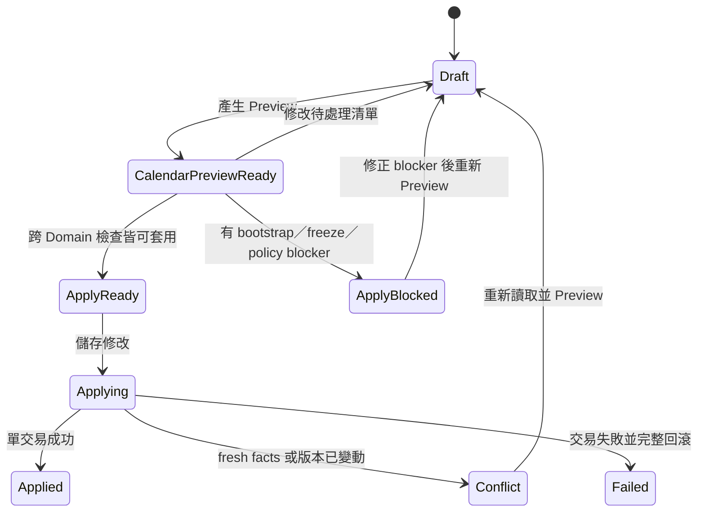

# 67 Scheduling Leave/Substitution Calendar Precision Completion Work Package

## 文件狀態

- 文件類型：`work-package`；由功能開發計畫轉入正式架構執行記錄。
- 狀態：`blocked`
- 實作狀態：`partial-implementation`
- 優先級：`P0／與「月嫂配對中心改善」並列目前最高優先`
- Owner：`Assignments／Scheduling Domain`
- 協作 Domain：`Orders`、`Payroll`、`Client Finance`
- 主要 Subsystem：`Leave／Substitution Preview & Apply`、`Calendar Read`
- 更新日期：2026-08-12
- 實作授權：`authorized-by-2026-08-12-user-direction`
- 依賴：[WP69 Scheduling Canonical Holiday Query Contract](69_Scheduling_Canonical_Holiday_Query_Contract_Work_Package.md)；完整假日／固定排休驗收在其落地前維持 blocked。

### 2026-08-12 封存阻塞

- `LABOR_UNION_TEST_MYSQL_HOST`、`PORT`、`USER`、`PASSWORD`、`DATABASE` 均未設定；
  disposable-MySQL E2E 因此依設計跳過。
- 在明確指定的 disposable `lu_test_*` database 可用前，不能證明 Apply 的 fresh check、
  rollback、concurrency、idempotency 與跨 Domain transaction，也不得建立 archive receipt 或封存。
- 已通過的 module／route／UI-client evidence 不可替代此 E2E gate。解除條件是設定完整的
  `LABOR_UNION_TEST_MYSQL_*` 環境並執行本文件列出的 disposable-MySQL 測試。

本文件承接 2026-08-11 人工確認的業務目標：使用者加入休假或代班項目後，必須先在
行事曆直接看見排班變化；只有按下「儲存修改」後，系統才可以重新讀取最新事實、檢查
衝突並實際更新排班、薪資影響及實際服務結束日期。

本項目與「月嫂配對中心改善」並列目前最高優先；兩者不互相取代，也不改變其他計畫內容。

## 1. Business scenario

管理人員處理服務期間的請假或代班時，需要在真正改動資料以前回答以下問題：

1. 哪一天請假，採順延或指定代班？
2. 若順延，後續服務日期是否逐日正確延後，新的預計／實際服務結束日是哪一天？
3. 若代班，原日期是否仍為服務工作日，當天由哪一位代班月嫂服務？
4. 國定假日、固定排休、臨時請假各有哪些日期，各自如何影響天數？
5. 合約服務總天數在調整前後是否守恆？
6. 儲存時是否因排班、薪資、客戶款項或訂單版本已變動而不能套用？

Preview 是可丟棄的零寫入沙盤；「儲存修改」才是唯一 mutation 入口。管理人員不能因為
按了 Preview 就改變排班、訂單日期、薪資、客戶應收或發出外部通知。

## 2. 使用者已確認目標

1. 修復「天數精算」區塊沒有顯示假日清單與天數計算結果的問題。
2. 保留已可運作的「加入休假／代班至待處理清單」功能。
3. Preview 必須直接套疊在目前行事曆上，而不是只顯示 raw outcome 表格。
4. 順延 Preview 要顯示原服務日、移動後服務日與新的服務結束日期。
5. 代班 Preview 要保留該日為服務日，並顯示原月嫂與代班月嫂資訊。
6. Preview 不得寫入正式資料，也不得觸發薪資、應收、訂單狀態或 LINE 副作用。
7. 點擊「儲存修改」時，系統才重新讀取並鎖定最新根事實，檢查是否需要重新計算薪資、
   套用新的實際服務結束日期及更新其他受影響 Domain。
8. Apply 任一必要檢查或跨 Domain 寫入失敗時，全部回滾，不得留下半套排班。

## 3. 現況證據與 live-drift

以下是 2026-08-11 current working tree 的只讀盤點，不是新的正式 SSOT。

| 現況 | 使用者看到的結果 | 判定 |
|---|---|---|
| `leave_substitution_panel.py` 可以把代班項目加入 session-state 清單 | 代班人員可選、項目可成功加入 | 已有能力，保留 |
| 正式 Preview 只有 assignments、outcomes 與三個跨 Domain impact | 沒有假日清單、天數對帳與 before／after 日格 contract | contract 缺口 |
| Preview 載入同一份 Orders／Scheduling／Client Finance／Payroll facts | 缺少付款條款時拋出 `client_finance_bootstrap_required` | readiness blocker 誤傷月曆 Preview |
| Workflow 在建立跨 Domain impacts 時遇到 blocker 就讓整個 Preview 失敗 | 使用者完全看不到排班候選結果 | live-drift |
| 行事曆先把 candidate service dates 標紅，再把所有 outcome 原日期標綠 | 代班日會被顯示成排休，語意錯誤 | UI projection bug |
| 行事曆只拼接客戶名稱與 `(Preview)` | 不顯示原月嫂／代班月嫂 | UI contract 缺口 |
| 舊的文字沙盤有目標天數、日曆天數、休假數與休假日期 | 正式休假／代班流程未承接這些資訊 | 新舊 Preview 漂移 |
| Apply 已會 fresh Preview、比對版本／fingerprint，並依序持久化 Scheduling、Client Finance、Payroll、Orders | 正式交易骨架已存在 | 可沿用，但需補完整驗收 |

目前畫面所示錯誤：

`Preview 失敗 [client_finance_bootstrap_required]：Leave/substitution request was rejected.`

這個錯誤可以阻止 Apply，但不應阻止產生「純 Scheduling 行事曆候選」。Preview 不得偷偷
建立 Client Finance root，也不得把缺少 bootstrap 偽裝成預覽成功；正確做法是回傳可觀看的
月曆候選，以及獨立、明確的 Apply readiness blocker。

## 4. Global → Domain → Subsystem → Module

### 4.1 Global

- Preview 一律零寫入、零 hidden commit、零外部副作用。
- Apply 使用單一 outer Unit of Work；重新讀取、固定鎖序、fresh validation 後才可 commit。
- Preview token／fingerprint 必須涵蓋排班 intent、來源版本、行事曆候選及跨 Domain readiness。
- Apply 不得信任 Streamlit 保存的日期、天數、薪資或結束日計算結果。
- stale、conflict、replay、idempotency 與 partial failure 使用 typed contract。

### 4.2 Assignments／Scheduling Domain

唯一擁有：

- effective assignment、official service date 及每一服務日的唯一月嫂 owner；
- 國定假日引用、固定排休、請假、順延與代班的排班語意；
- 服務日期守恆、日期不可重疊與人員 occupancy 不變量；
- before／after calendar candidate 與 leave／substitution outcome。

不擁有：

- 訂單 lifecycle status 與 `actual_end_date` 正式 projection；
- 月嫂薪資義務；
- 客戶應收／付款義務；
- Streamlit 顏色或 HTML。

### 4.3 Subsystem

`LeaveSubstitutionPreview` 分為兩個結果面向，但仍由同一 application workflow 編排：

1. `calendar_candidate`：Scheduling Domain 能成功計算時必須回傳。
2. `apply_readiness`：彙整 Orders、Payroll、Client Finance 的版本、影響摘要與 blocker。

缺少 Client Finance／Payroll bootstrap 等情況，不得讓已成立的 `calendar_candidate` 消失；其
`apply_readiness.status` 應為 `blocked`，UI 仍顯示月曆，但停用儲存並提供人工修正入口。

Apply 必須：

1. 重新讀取並鎖定 Orders lifecycle、Scheduling aggregate、受影響月嫂、Payroll 與 Client Finance roots；
2. 用相同 intent 重建候選，驗證版本、fingerprint、服務天數、日期 ownership 與 occupancy；
3. cancel／replace 舊 Scheduling generation；
4. 依新 official service dates 計算 Payroll 與 Client Finance impacts；
5. 由 Orders 套用新的 `actual_end_date` 與必要 lifecycle projection；
6. append event、outbox、receipt 後單次 commit；
7. 任一步失敗即回滾全部資料。

### 4.4 Module／Adapter

- FastAPI 回傳 typed Preview view，不以 raw `dict` 讓 UI 自行猜日期語意。
- Calendar 選案以單一批次正式 assignment read 取得 case 集合；Orders 摘要僅提供顯示與 lifecycle 資訊，不能取代 Scheduling owner。
- API client 必須驗證完整 view；transport、schema 與 business blocker 分類顯示。
- Streamlit 只 render `calendar_candidate`、天數摘要、假日清單及 readiness，不自行重算。
- 行事曆 renderer 接受 before／after day-cell ViewModel，不直接從 assignments／outcomes 拼顏色。
- 「儲存修改」只有在 Preview 尚未失效且 `apply_readiness=ready` 時可啟用。

## 5. SSOT、根事實與衍生 View

### 5.1 根事實

- Orders：合約服務天數、實際開始日、lifecycle version。
- Scheduling：有效 generation、assignments、official service dates、休假／代班 events。
- Holiday：核准的國定假日日期與名稱。
- Payroll：薪資政策版本及既有義務。
- Client Finance：付款條款版本及既有義務。

### 5.2 Preview 衍生值

- 調整前／後正式服務日期；
- 調整前／後每一日的服務 owner；
- 順延來源日與結果日；
- 代班原月嫂與代班月嫂；
- 國定假日、固定排休、請假日期清單；
- 原服務結束日、預覽後服務結束日；
- 各類日數及服務日守恆結果；
- 跨 Domain impact 摘要與 Apply blockers。

上述衍生值不保存為另一份事實；成功 Apply 後，畫面必須重新 Query 已提交的 canonical facts。

## 6. Calendar Preview typed contract

Preview 至少回傳：

```text
case_no
source_versions
calendar_candidate
  before_service_start_date
  before_service_end_date
  after_service_start_date
  after_service_end_date
  contracted_service_days
  before_service_day_count
  after_service_day_count
  deferred_day_count
  substitute_day_count
  holiday_rest_day_count
  fixed_rest_day_count
  leave_day_count
  conservation_status
  holiday_rows[]
  day_cells[]
apply_readiness
  status: ready | blocked
  blockers[]
  payroll_impact_summary
  client_finance_impact_summary
  orders_impact_summary
preview_fingerprint
```

每個 `day_cell` 至少包含：

- `calendar_date`
- `before_kind`、`after_kind`
- `change_kind`: `unchanged | leave | deferred_from | deferred_to | substitute`
- `before_staff_id／display_name`
- `after_staff_id／display_name`
- `holiday_name`（可空）
- `case_no` 與最小必要客戶顯示資訊
- 可讀文字 label；不得只用顏色傳達狀態

代班日的 `after_kind` 仍是服務工作日，不得標成排休日。涉及兩位月嫂時，日格必須顯示
「原月嫂 → 代班月嫂」，並能在原月嫂及代班月嫂的 Calendar Read 中一致解釋 occupancy。

## 7. 天數對帳與 UI 顯示

正式休假／代班面板必須顯示：

- 合約服務天數；
- 調整前正式服務天數；
- 調整後正式服務天數；
- 本批順延天數；
- 本批代班天數；
- 國定假日清單；
- 固定排休清單；
- 本批請假清單；
- 調整前／後服務結束日期；
- 「服務天數守恆」結果。

對帳不變量：

```text
before_service_day_count = contracted_service_days
after_service_day_count  = contracted_service_days
```

代班只改變 owner，不增加休假日或延長服務結束日。順延才會移動該日及後續服務日期；混合
批次必須以完整 candidate 計算，不能用「請假筆數直接加在結束日」的 UI 公式代替。

## 8. Preview／Apply 狀態與操作



- 新增、刪除或修改待處理項目後，舊 Preview 必須立即標為失效。
- Preview blocked 時仍顯示候選月曆，但「儲存修改」停用。
- Apply 成功後清除草稿與 Preview，重新載入正式月曆、天數摘要與 Domain versions。
- Apply 成功以前不得把 Preview cell 混入 canonical Calendar cache。

## 9. Typed errors、警示與人工入口

| code | 顯示／處理 |
|---|---|
| `holiday_calendar_unavailable` | 無法證明假日資料時停止 Preview，禁止用空清單假裝成功 |
| `service_day_conservation_failed` | 停止 Apply，顯示調整前後天數 |
| `scheduling_occupancy_conflict` | 指出日期與衝突月嫂，重新 Preview |
| `client_finance_bootstrap_required` | 月曆可看、Apply blocked；導向核准的財務初始化入口 |
| `payroll_bootstrap_required` | 月曆可看、Apply blocked；導向核准的薪資初始化入口 |
| `stale_preview`／`stale_version` | 不自動重送 Apply；要求重新 Preview |
| `transaction_failed` | 顯示 correlation id；確認所有 Domain 零部分寫入 |

若阻擋原因尚無安全的人工入口，UI 只能顯示明確待處理原因並維持 fail closed，不得由
Preview 或 Streamlit 直接補資料。

## 10. 實作代辦

### P0-A：正式契約修正

- [ ] 更新 Scheduling 正式規格：Preview 回傳 calendar candidate 與獨立 Apply readiness。
- [ ] 更新 Calendar Read ViewModel，納入 before／after day cells、假日與日數摘要。
- [x] Calendar 選案改以單一批次 formal-assignment Query，移除逐案 fallback 與摘要 owner 判定。
- [ ] 確認 Client Finance／Payroll bootstrap blocker 的核准人工入口。
- [ ] 更新 public API schema、typed error 與 entry-point evidence。

### P0-B：Backend Preview

- [ ] 從 Scheduling root facts 建立純 calendar candidate，不依賴 UI 日數公式。
- [ ] 接入 canonical Holiday Query／Business Calendar，回傳實際命中的假日清單。
- [ ] 補齊固定排休、臨時請假、順延、代班的分類與日數對帳。
- [ ] 將跨 Domain 缺根事實由「整個 Preview 失敗」改為 typed Apply blocker。
- [ ] 仍計算可用的 Payroll／Client Finance／Orders impact summary，不做任何寫入或 bootstrap。
- [ ] fingerprint 納入完整候選與 readiness facts。

### P0-C：行事曆與面板 UI

- [ ] 正式面板顯示假日、固定排休、請假清單及完整天數摘要。
- [ ] 以 typed day-cell diff 套疊月曆，移除 UI 自行遍歷 assignments／outcomes 猜顏色。
- [ ] 順延顯示移出日、移入日及新的結束日。
- [ ] 代班日維持服務日樣式，顯示原月嫂與代班月嫂名稱／識別。
- [ ] 使用圖示與文字 legend，不以紅綠色作唯一訊息。
- [ ] blocker 不遮蔽月曆；在儲存按鈕旁顯示原因並停用 Apply。
- [ ] 清單異動時清除所有對應 Preview session state，避免套用舊畫面。

### P0-D：Apply 與跨 Domain 一致性

- [ ] Apply 重新 load／lock／validate，不使用 UI 傳回的計算值。
- [ ] 驗證服務天數守恆、occupancy、generation、order／payroll／finance versions。
- [ ] 依候選更新 Scheduling generation 與 events。
- [ ] 由 Payroll Domain 判斷並重建必要薪資影響。
- [ ] 由 Client Finance Domain 判斷並重建必要客戶款項影響。
- [ ] 由 Orders Domain 套用新的 `actual_end_date` 與必要 lifecycle projection。
- [ ] 事件、outbox、receipt 與所有 Domain 寫入維持單一交易；失敗完整回滾。

### P0-E：清理漂移

- [ ] 移除或退役舊的文字沙盤 Preview，避免兩套天數規則競爭。
- [ ] 修正代班 outcome 被畫成綠色排休日的錯誤。
- [ ] 禁止 raw outcome dataframe 作為唯一正式 Preview。
- [ ] 補齊「正式 Preview 已顯示但 Calendar cache 不得污染」的 reset／refresh 契約。

## 11. Required tests

### Module

- 假日、固定排休、臨時請假分類正確；跨月、跨年、閏日可計算。
- 單日／多日順延得到正確結果日期與新結束日。
- 代班不延長結束日，服務日總數不變，owner 正確替換。
- 混合順延與代班仍維持服務日唯一 ownership 與總天數守恆。
- day-cell diff 含原／新月嫂文字，不只含顏色。

### Subsystem

- Preview 對 DB、receipt、outbox、薪資、應收及訂單均為零寫入。
- 缺 Client Finance root 時仍回傳 calendar candidate，但 Apply readiness 為 blocked。
- 缺 Holiday SSOT 時 fail closed，不以空假日清單繼續。
- 草稿變更造成舊 fingerprint 失效；stale Apply 零寫入。
- Apply fresh check 後才建立跨 Domain impacts；任一 persist 失敗全部回滾。

### Domain／disposable MySQL E2E

- 順延：舊日成為 leave、後續服務日移動、Orders `actual_end_date` 更新。
- 代班：同日仍服務、原月嫂 occupancy 釋放、代班月嫂 occupancy 建立、結束日不變。
- 混合批次：新 Scheduling、Payroll、Client Finance、Orders versions 同交易一致。
- concurrency、idempotent replay、不同 payload 共用 key、版本衝突及 rollback。

### Global／UI

- 畫面可見假日清單、天數摘要、前後結束日及守恆結果。
- 月曆直接呈現順延與代班後結果，代班月嫂資訊正確。
- `client_finance_bootstrap_required` 不再讓月曆 Preview 消失，但儲存保持停用。
- 按 Preview 前後正式 DB facts 相同；只有按「儲存修改」成功後月曆才轉為正式狀態。
- Apply 成功後重新 Query canonical Calendar，不殘留 session-state Preview。

## 12. Dependencies

- Scheduling 正式規格的 Preview／Apply、Calendar Read 與 leave／substitution 契約更新。
- Orders lifecycle `actual_end_date` projection 與 G05 鎖序契約。
- Payroll、Client Finance impact port 與 bootstrap／freeze 人工處理入口。
- [WP69 Canonical Holiday Query](69_Scheduling_Canonical_Holiday_Query_Contract_Work_Package.md) 的可用性、版本與快取失效契約。
- 管理者 authentication／capability，不在本功能內另建登入機制。

## 13. Future write set

待正式契約人工確認後，預期寫入範圍如下；開始實作前必須另立核准 Work Package：

- `domains/scheduling/`：calendar candidate／diff 的純規則。
- `subsystems/scheduling/`：leave/substitution Preview／Apply 編排與 Calendar Read。
- `api/routes/leave_substitution.py`、`api/schemas/leave_substitution.py`。
- `ui/api_clients/leave_substitution_api_client.py`。
- `ui/pages/scheduling/leave_substitution_panel.py`、`ui/pages/03_calendar.py`。
- 對應 `tests/`、`validation/`、正式規格、decision／evidence index。

是否需要 additive schema，只能在 typed contract 與現有 root facts gap 盤點後裁決；不得為了畫面
方便先新增 competing calendar snapshot。

## 14. Out of scope

- 不在 Preview 自動建立 Client Finance 或 Payroll 根事實。
- 不由 Streamlit 計算或直接寫入薪資、應收、訂單結束日。
- 不改變既有合約服務天數與半日服務政策。
- 不在本項目處理月嫂配對推薦、LINE 自動通知或匯入功能。
- 不因本次 UI 修復直接操作正式資料庫或歷史資料。

## 15. 驗收完成條件

只有同時符合下列條件，才可把本計畫標示為 `completed`：

1. 使用者加入順延／代班後可在同一行事曆看見正確 before／after 變化。
2. 假日清單、各類日數、調整前後結束日與服務天數守恆都有 typed 顯示。
3. 代班日期顯示為服務日並標示代班月嫂，不會被畫成排休日。
4. 缺少財務／薪資 bootstrap 時仍可預覽，但不能儲存，且有明確人工修正入口。
5. Preview 經證明為零寫入；Apply 經 fresh check 後才更新 Scheduling、Orders、Payroll、Client Finance。
6. Apply 失敗無部分資料，成功後重新載入 canonical Calendar。
7. Module → Subsystem → Domain → Global 驗收及 `git diff --check` 全部通過，並連結去敏 evidence。

## 16. 來源追溯

- `document/架構重整/01_規格基線/02_Assignments_Scheduling_Domain.md`
- `document/架構重整/01_規格基線/01_Orders_Domain.md`
- `document/架構重整/01_規格基線/03_Payroll_Domain.md`
- `document/架構重整/01_規格基線/01_Orders_Domain.md`
- `document/架構重整/01_規格基線/02_Assignments_Scheduling_Domain.md`
- 歷史契約：`document/架構重整/04_已完成與上線封存/work_packages/33_G05_服務完成時刻與請假代班競爭契約.md`
- `ui/pages/scheduling/leave_substitution_panel.py`
- `ui/pages/03_calendar.py`
- `subsystems/scheduling/leave_substitution_workflow.py`
- `infrastructure/mysql/order_terms_read_model.py`
- 2026-08-11 使用者提供之天數精算與 Preview 失敗畫面（只作需求證據，不提交含個資的圖片副本）。

## 2026-08-12 受控寫入驗收紀錄

- status: in-progress
- 測試環境裁決：目前資料庫已由人工確認為測試用途；本次僅透過正式 API 與 migration script 寫入，未重建、清空或以 SQL 旁路業務 command。
- bootstrap 驗收：案件 `115000028` 採用既有 Scheduling aggregate 後成功建立 Client Finance、Payroll 與 bootstrap event；receipt 保留 Scheduling `version=1`、`generation=1`。
- 請假 Apply 驗收：案件 `115000051`、assignment `351` 對 `2026-08-13` 執行 `defer_following_assignments`。Preview 為 ready，服務日由 8/13 移除並順延至 8/15，總服務日維持 5。
- Apply receipt：order `3 -> 4`、scheduling `1 -> 2`、client finance `4 -> 5`、payroll `1 -> 2`；同一 Idempotency-Key replay 回傳相同 receipt，未重複寫入。
- 正式 Calendar data source：replacement assignment `358` 的服務日為 `2026-08-10, 08-11, 08-12, 08-14, 08-15`，不含請假日 8/13 並包含順延日 8/15。
- 未完成驗收：內建 Browser connector 對本機 Streamlit URL 僅開啟 `about:blank`，無法執行人工選擇 UI 的 click-flow；須由可連到 `http://127.0.0.1:8501/03_calendar` 的瀏覽器完成最後畫面驗收後才能封存。
## 2026-08-12 補充驗收結果

- controlled DB write：案件 `115000051` 的 manual leave Preview/Apply/replay 已通過。`2026-08-13` 由服務日移除、`2026-08-15` 補回，正式 assignment `358` 回讀一致。
- Calendar UI automation：Chrome 已能載入本機 Streamlit，但首頁的自訂多月嫂排班 radio 無法被 browser connector 觸發，直接深連結會回首頁；已保留 handoff tab 供人工於 UI 依序選擇「多月嫂排班 → 行事曆」、月嫂 `8892`、2026 年 8 月確認。
- archive gate：未通過。唯一剩餘項目為上述人工 UI click-flow；不得把 API／資料源驗收冒充為 UI 視覺驗收。

## 2026-08-12 封存 gate 完成紀錄

- 最終狀態：`completed`；受控測試資料庫完成 Preview、Apply、same actor/key replay 與 cross-actor/key idempotency conflict 驗收。
- 寫入驗收：案件 `115000051` 的人工請假代班 Apply 成功；Holiday-only Apply 產生零 item receipt 並保持一致的 scheduling、finance、payroll 版本推進。
- UI 驗收：Chrome 以月嫂 `#8892`、2026 年 8 月、案件 `115000051` 操作；8/10 至 8/12、8/15 至 8/16 顯示服務工作日，8/13 顯示可接案，8/14 僅顯示 Holiday 與可接案，不再顯示已取消排班的舊服務工作日。
- 回歸：受影響的 Calendar、Leave/Substitution、Payroll 與 Bootstrap focused suite 共 `23 passed`。
- current successor：`document/架構重整/01_規格基線/02_Assignments_Scheduling_Domain.md`；本 Work Package 不再作為 current 行為授權。
- release identity：本次為使用者授權的本機測試資料庫受控驗收，無 production deployment release。
- restore triggers：Calendar 歷史服務日回歸、請假／代班 Preview-Apply 不一致、或 Holiday 查詢版本／重放稽核。