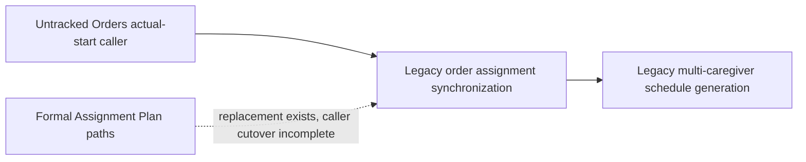

# Legacy Retirement Wave 2 Decision Package

## 1. 狀態與授權邊界

- 狀態：`decision-complete-no-qualified-remove-candidate`
- 建立日期：2026-08-03
- Repository branch：`codex/refactor-api-streamlit-architecture`
- HEAD：`4081a9b40c91a030c64f1d488411287ec6c01bdc`
- 正式架構依據：已核准的 `15`～`18`
- 現況依據：Wave 1A 後 live writer scan、live source、production caller、router wiring
  與 Git path state
- 本文件只作 Wave 2 裁決，不授權修改或移除 production／test code、schema、資料、
  部署設定或 Git state。

弱模型 semantic evidence 只作 discovery 參考，不構成本裁決依據。

## 2. 執行結論

Wave 2 沒有合格的 `remove-candidate`。

Wave 1A 後的 fresh scan 為：

- findings：`662`
- fingerprint：
  `d0a0007df33120d761d82d60707b948b28ccadc9e2e31ecd394762027cae1ddb`

本波以完整 module 為退役單位，硬性 Gate 如下：

1. tracked；
2. clean，沒有 dirty overlap；
3. live public path 已固定回 `410 Gone`；
4. production caller=0；
5. 已有可獨立驗證的正式 replacement；
6. 不涉及 schema／資料；
7. 不在 Orders untracked、月結、退款、LINE、BreezySign、Access／權限或
   Deployment 排除範圍。

沒有任何受審 module 同時通過七項。尤其 `legacy_active_201` 的 `410` 欄是歷史
discovery label，不是 live HTTP 行為；不能把該欄當成「module 已回 410」證據。

因此本 Decision Package 的正確結果是保留零個移除授權，而不是降低 caller 或
dirty-worktree Gate 來湊出 Wave 2A。

## 3. 逐項裁決

| Module | SHA-256 | Git state | Live caller | 裁決 | 理由 |
|---|---|---|---:|---|---|
| `services/multi_caregiver_schedule_generation.py` | `97b9764001f262f08bf94ef03cac5d1aa6ec9dd46196d84cfed00729ae340867` | tracked, clean | 1 | `migrate-then-remove` | 仍由 `order_assignment_synchronization` 呼叫；module 自己寫 `staff_schedule`／`case_staff_assignments` 並 commit，不能先刪 |
| `services/order_assignment_synchronization.py` | `5ec681c43d5f6d493a9073e4bf9788383422819fe389b837d66a99a4f52e17fc` | tracked, modified | 1 | `migrate-then-remove` | live caller 是本波明確排除的 untracked Orders module；本身也有 dirty overlap |
| `services/assignment_payroll_reconciliation_service.py` | `c39d96db5f374ed8f6ce9d692765145439a9783bb6d0e3478ceb1fd341c206e3` | tracked, clean | 1 module／2 import sites | `retain` | 仍由 Scheduling rest-date workflow 使用；Inventory finding 是 dynamic read，不是可藉刪檔消除的 writer |
| `services/staff_occupancy_mutex_service.py` | `1f997c401bdf43b07f03122701d8602bcf43e0498dcb045b790dc89dec26d1c0` | tracked, clean | 4 modules／5 import sites | `retain` | 正式 Scheduling 仍要求 staff mutex；這是並行控制能力，不是過期模組 |
| `services/caregiver_matching_plan_service.py` | `1b8220d9cd77ec6d455ef8e097b2ee0e93e612cf8b2ee24d6b804ebdd6c351ce` | tracked, clean | 1 | `retain` | Matching Plan route 仍直接使用；尚未完成 caller 改接與等價 replacement receipt |
| `services/caregiver_matching_communication_service.py` | `350fccead48655775c237a6e639bb37400843acd5424227a35ed2de3142b1540` | tracked, clean | 1 | `retain` | Matching communication route 仍直接使用，且涉及本波排除的 LINE 外部副作用 |
| `services/finance_alert_workflow.py` | `2470c112f9591b10b4f4f1c84fc11f2fab9f2399ddbd603b5f21bc3b6d6a3a1e` | tracked, clean | 1 | `migrate-then-remove` | legacy Finance Alert API 仍直接呼叫；正式規格允許其 claim／resolve concurrency 被 Anomalies 吸收，但 caller 尚未切斷 |
| `services/finance_alert_events.py` | `b86591954a69fa08f2eb02ff7dec2eab9521d0ac0d81fefcaafc0a65f8150a60` | tracked, clean | 1 | `migrate-then-remove` | 仍由 legacy Finance Alert workflow 寫入；必須在 workflow 與歷史事件讀取契約切換後退出 |
| `services/finance_alert_detection.py` | `ab74569ff80936906188dbcda0d01c43c0c99024c0d5f0f4879806b936335da4` | tracked, clean | 2 | `migrate-then-remove` | live wiring 與 fake-data script 仍直接使用；尚未由 source Domain outbox 完整取代 |

所有裁決均維持：

- `approved_to_remove=false`
- `effective_disposition=blocked`
- `execution_authority=none`

## 4. 正式 replacement 與缺口

### 4.1 Scheduling

正式方向是：

- `subsystems/scheduling/assignment_plan_workflow.py`
- `infrastructure/mysql/assignment_plan_repository.py`
- `api/routes/assignment_plan.py`

但上述三個 live paths 目前都是 untracked。它們能證明 replacement implementation
存在，不能在 dirty-worktree 保護下單獨構成可移除證明。更關鍵的是
`services/order_actual_start_reconfirmation.py` 仍直接 import
`order_assignment_synchronization`，而該 caller 本身是本波排除的 untracked Orders
module。

因此依賴鏈目前是：

### 4.2 Anomalies

正式方向是：

- `subsystems/anomalies/alert_workflow.py`
- `api/routes/anomaly_registry.py`

正式 Anomalies 規格也明列：

- `finance_alert_wiring` 應改為 source Domain outbox；
- `finance_alert_workflow` 的 claim／resolve concurrency 可吸收進正式 workflow。

但 legacy `api/routes/finance_alerts.py` 仍直接 import
`services.finance_alert_workflow`，`finance_alert_workflow` 又直接 import
`finance_alert_events`；`finance_alert_detection` 也仍有 wiring 與資料產生腳本 caller。
所以整條鏈只能判為 `migrate-then-remove`。

## 5. Caller manifest 摘要

完整 machine-readable 證據位於：

`evidence/legacy_retirement_wave_2/caller_manifest.json`

直接 import chain：

1. `services/order_actual_start_reconfirmation.py:17`
   → `services.order_assignment_synchronization`
2. `services/order_assignment_synchronization.py:26`
   → `services.multi_caregiver_schedule_generation`
3. `services/assignment_schedule_rest_date_service.py:2285,3263`
   → `services.assignment_payroll_reconciliation_service`
4. waiting-lock acquire／release／cancellation 與 rest-date workflow
   → `services.staff_occupancy_mutex_service`
5. `api/routes/matches.py:11-12`
   → Matching Plan／communication services
6. `api/routes/finance_alerts.py:27`
   → `services.finance_alert_workflow`
7. `services/finance_alert_workflow.py:7`
   → `services.finance_alert_events`
8. `services/finance_alert_wiring.py:27` 與
   `scripts/generate_fake_data.py:1595`
   → `services.finance_alert_detection`

沒有任何一項的 production caller 為 0。

## 6. 依賴切斷順序

本包不執行下列步驟；它們是未來獨立 migration／removal Work Package 的順序。

### 6.1 Scheduling chain

1. 先由獨立 Orders／Scheduling migration WP 裁決 untracked actual-start caller；
   本 Wave 不得碰該 path。
2. 讓所有正式 caller 只經 Assignment Plan Preview／Apply 與其 outer UoW。
3. 以相同 root facts 比對 assignment、schedule、waiting-lock、Payroll impact 與
   Client Finance impact。
4. 讓 legacy synchronization public endpoints 固定回 410，並驗證沒有 service-to-service
   caller。
5. production caller=0 後，才重裁決
   `order_assignment_synchronization.py`。
6. synchronization 退出後，重新掃描 generation module；只有 caller=0 且正式
   repository 已涵蓋其全部行為時，才可升為 `remove-candidate`。

### 6.2 Anomalies chain

1. 先把 detection 入口改為 source Domain outbox，不得由 Anomalies 猜造 root facts。
2. 把 Finance Alert Query／claim／resolve caller 改接 typed Anomalies API。
3. 完成 old／new shadow comparison：fingerprint、active／inactive、claim CAS、resolve、
   replay、checkpoint 與 recovery routing。
4. legacy API 固定回 410，並保留明確 replacement paths。
5. 先切斷 `finance_alert_workflow` 的 API caller，再切斷 events dependency，最後切斷
   detection wiring；不可反向刪除底層 module。
6. 若歷史 alert table／event 仍需讀取，另立 schema／data migration WP；本 Wave 不得
   處理。

## 7. 驗證矩陣

| 層級 | Scheduling migration／removal Gate | Anomalies migration／removal Gate |
|---|---|---|
| Static | exact import、symbol、dynamic loader、router inclusion、worker／CLI caller=0 | exact import、symbol、router、worker、outbox consumer、script caller=0 |
| Module | assignment generation、mutex ordering、read-only payroll reconciliation | fingerprint、definition、claim／resolve CAS、event append |
| Subsystem | Assignment Plan Preview／Apply、waiting-lock、replay、stale、conflict、rollback | projection、active→inactive、replay、checkpoint、partial failure |
| Domain | root facts 到 assignment／schedule／Payroll impact 全鏈等價 | source root facts 到 anomaly summary／detail／recovery routing 全鏈等價 |
| API | legacy endpoints 維持 410；typed replacement 全通過 | legacy Finance Alert endpoints 維持 410；typed Anomalies API 全通過 |
| UI | UI 只呼叫 typed API，無 legacy service import | Alert UI 只呼叫 typed Anomalies API |
| Inventory | before／after 只少核准 source 的 exact identities，無新增 writer | 同左；若碰 schema／data 立即超出本 Wave |
| Repository | branch、HEAD、source hash、dirty overlap 與 caller manifest 全部 fresh-match | 同左 |

任何 test failure、新 caller、source drift、非預期 writer delta 或 dirty overlap，都必須
停止，不能藉修改其他 code 或測試來讓移除通過。

## 8. Rollback plan

本 Decision Package 沒有修改 production／test code，所以目前不需 code rollback。

未來每一個 migration／removal WP 必須：

1. 保存 exact target 與 direct caller blobs、SHA-256 及 path-only patch；
2. caller cutover 與 module removal 分成可獨立回復的步驟；
3. 失敗時只恢復該 WP 的 exact paths；
4. 恢復後重跑同一 caller scan、有限測試與 Inventory，確認 identities 完整返回；
5. 不改 schema／資料、不碰未授權 dirty paths；
6. 不 stage、commit、push 或部署。

## 9. 排除項目

本 Wave 明確排除：

- untracked Orders modules，包括
  `services/order_actual_start_reconfirmation.py`、
  `services/order_cancellation_command.py`、
  `services/order_lifecycle_hold_commands.py`、
  `services/order_lifecycle_manual_correction.py`；
- 月結與 Staff Payables settlement；
- Client Refund／reversal；
- LINE；
- BreezySign；
- Access／權限／authentication／security audit；
- Deployment、expiry 與 production rollout；
- 任何 schema／資料清理或 migration。

## 10. 下一步

目前不能核准 Wave 2 code removal，因為 `remove-candidate` 是空集合。

下一個合理 Work Package 是
`Legacy Retirement Wave 2A Scheduling Caller Cutover Decision Package`，但它必須先
取得「可納入 untracked Orders actual-start caller」的獨立人工授權；在此之前不應動
Scheduling chain。

若仍維持排除 untracked Orders，則改走
`Legacy Retirement Wave 2B Anomalies Caller Migration Decision Package`：只設計
legacy Finance Alert API／wiring 改接 typed Anomalies 的精確範圍與等價驗證，不移除
code、不碰 schema／資料。
