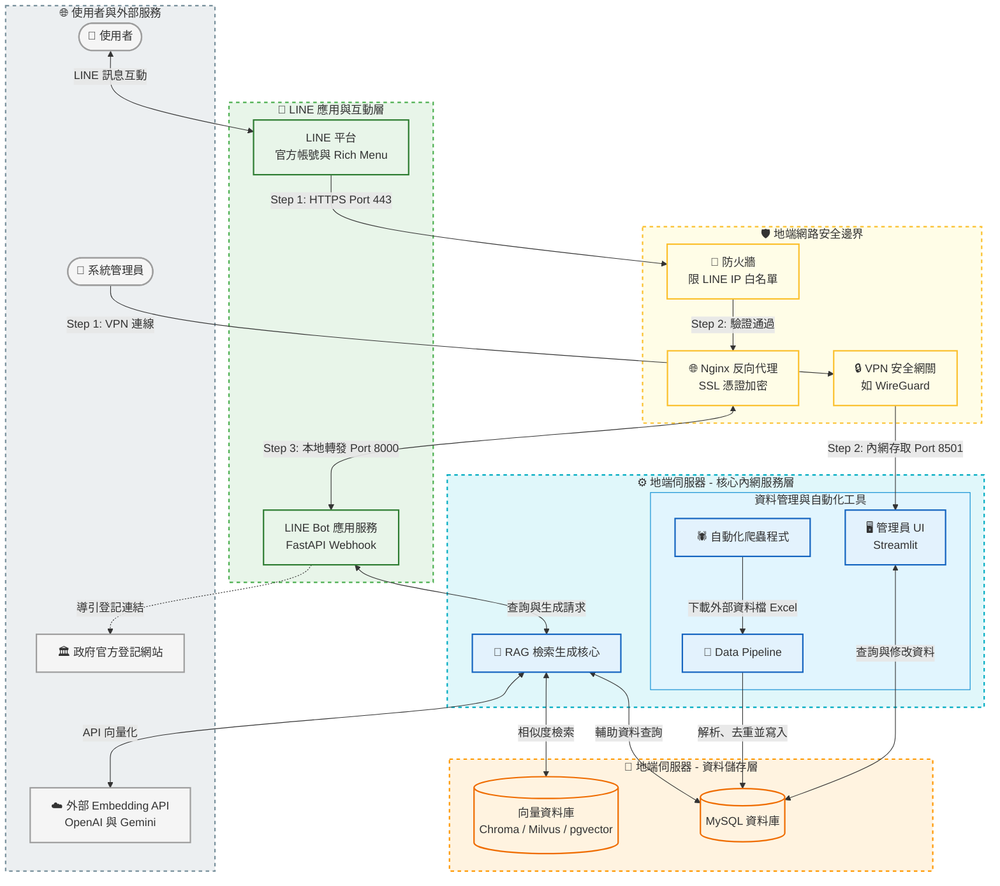
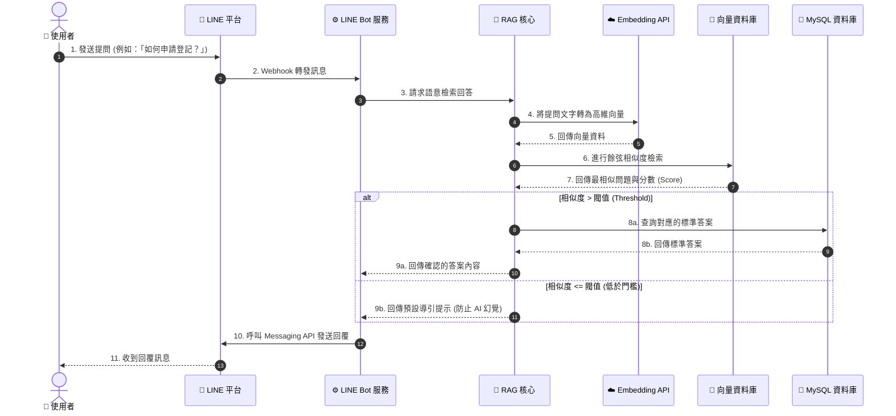
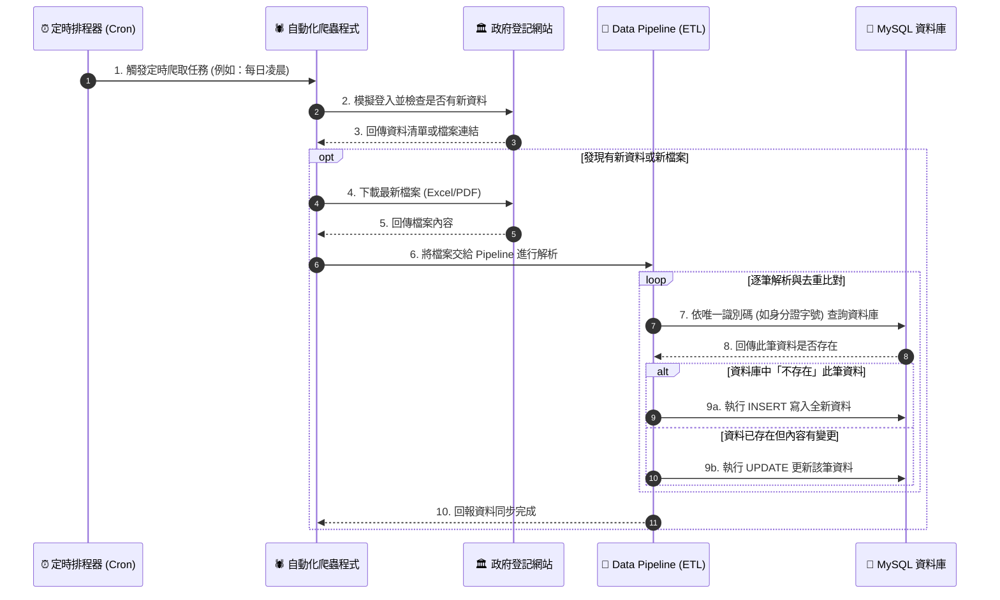
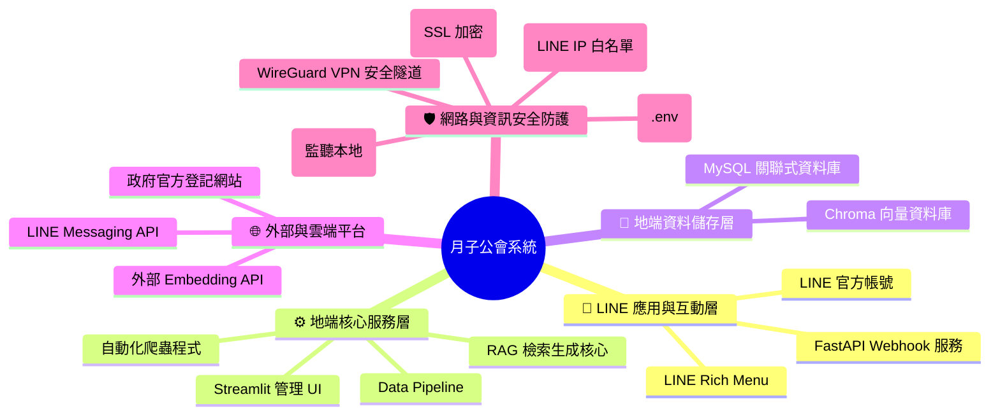

# Obsidian 畫圖測試與範例

這是一個在 Obsidian 中使用 **Mermaid** 畫軟體架構圖的測試檔案。
請在 Obsidian 中打開此檔案，並確保切換到 **「閱讀模式 (Reading view)」** 或 **「即時預覽模式 (Live Preview)」**，您就會直接看到渲染出來的圖形。

---

## 一：月子公會系統架構圖 (實戰分層風格)
這個版本參考了您的 [軟體需求規格書.md](file:///c:/Users/chris/Desktop/project/union/軟體需求規格書.md) 的實際架構，並以您喜歡的**「明顯分層、間隔開」**的風格進行重新排版。

我們將系統明確區分為三個區塊：**外部雲端層**、**地端核心服務層** 與 **地端資料儲存層**，並搭配了不同的色彩框線進行實體間隔：



---

## 二：AI 客服語意檢索時序圖 (實戰 Sequence Diagram)
架構圖（範例一）適合用來表達系統的「靜態結構」，但如果想要把**「動態的執行步驟、邏輯判斷（如防幻覺閥值）」**寫得更清楚，最適合使用的是**時序圖 (Sequence Diagram)**。

下面是參考您的 [軟體需求規格書.md](file:///c:/Users/chris/Desktop/project/union/軟體需求規格書.md) 設計的真實 AI 客服問答流程：



---

## 範例三：資料庫與爬蟲自動化時序圖 (ETL Sequence Diagram)
這個範例展示了「資料庫與自動化」部分的執行步驟。它描繪了定時排程器觸發爬蟲後，爬蟲、**Data Pipeline** 以及 **MySQL 資料庫** 之間的互動流程（包含檔案解析、迴圈處理與 Insert/Update 去重邏輯）：



---

## 範例四：系統結構目錄樹 (Mermaid Mindmap 風格)
這個範例展示了如何使用 `mindmap` 語法，以視覺化的「心智圖/樹狀圖」來呈現您專案的系統功能層級分類。

這比一般的流程圖更適合用來展示「功能大綱」或「系統分類」：



---

## 如何修改這些圖？
1. 在 Obsidian 中切換到 **「原始碼模式 (Source mode)」** 或直接雙擊上面的圖表。
2. 您會看到由 ` ```mermaid ` 和 ` ``` ` 包起來的文字。
3. 您可以直接修改裡面的文字（例如把 `PostgreSQL` 改成 `MySQL`），圖表就會即時更新！

---

