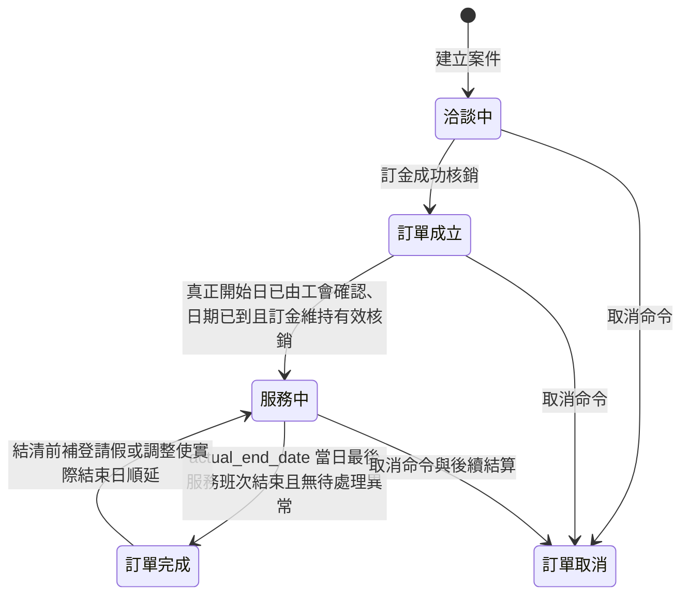

# 可替換前端與 Streamlit 薄顯示層重整計畫

## 文件狀態

- 狀態：規劃紀錄，待架構提案與人工 CP-1 審核。
- 本文件不是 `system_map.yaml`，不構成程式修改、Task 核發或 Checkpoint 核准。
- 本階段只記錄目標、邊界、順序與驗收方式，不開始實作。

## 討論前的既有規格核對順序

- 後續提出業務問題前，必須先檢索 `document` 內相關規格，尤其是 `多月嫂排班UX目標指南.md`、`多月嫂排班UX改善討論紀錄.md`、`多月嫂排班與行事曆規格.md` 及 `多月嫂排班UX驗收矩陣.md`。
- 已在上述文件明確定案且彼此一致的規則直接沿用，不再次要求使用者確認。
- 文件彼此衝突時，先列出來源、差異及可能影響，再請使用者只裁決該衝突；不得把已確認內容重新發散成新問題。
- 文件沒有涵蓋且會實質改變業務結果時，才提出單一聚焦問題。
- 上述文件是本次產品規格與既有驗收證據來源；正式施工前仍須將確認結果轉成 SSOT 架構提案並通過人工 Checkpoint，不得以文件直接取代 `system_map.yaml`。

## 已確認目標

將目前 Streamlit 前端重整為可替換的 Presentation Adapter，使未來改用 React 時，只需重建畫面與互動，不必在 TypeScript 重新實作排班、帳務、媒合、文件或其他商業規則。

核心原則：

> 前端可以計算顯示方式，但不能決定正式業務結果。

Streamlit 與未來 React 必須共用相同 FastAPI 契約。所有會影響正式資料、合法性、金額、日期、資格、排班、狀態或交易結果的判斷，只能由 FastAPI 後方的 Application Service／Domain Service 執行。

## 已確認業務決策：排班試算分為兩種場景

排班試算不是單一語意，必須區分下列兩個業務場景，前端不得依欄位是否為空自行猜測模式：

### 1. 服務前規劃試算

- 適用狀態：洽談中、訂單成立，且尚未填入實際開始日。
- 基準日期：預計開始日。
- 用途：規劃預計服務日、休假、預計結束日與人力安排。
- 性質：規劃資料，不得被視為正式出勤事實。
- 不得直接成為薪資、應收、應付或其他正式帳務日期的依據。

### 2. 實際開始日後的出勤精算

- 啟用條件：工會人員已填入實際服務日期；不以訂單是否已進入「服務中」作為唯一判斷。
- 基準日期：實際開始日。
- 用途：計算正式出勤日、休假順延與實際服務結束日。
- 結果會影響後續薪資、應收／應付及其他帳務日期。
- 因結果具有正式業務影響，必須由後端 Service 統一計算；前端只提交工會人員明確填寫的實際開始日及必要操作資料。
- 實際開始日成功寫入時，系統必須在同一資料庫交易內立即完成正式出勤精算，並自動重算及寫入受影響的薪資與帳務日期。
- 本流程不採 Preview／Confirm／Apply；儲存實際開始日就是正式執行命令。
- 寫入實際開始日、正式出勤、薪資日期或帳務日期的任一步驟失敗時，整筆交易必須回滾，不得留下部分更新。

### 架構含意

- 兩種場景必須有明確、不可混淆的 API contract；不得使用同一組 optional 欄位讓後端或前端猜測模式。
- 兩者可以共用底層純計算規則，但 Application Service、輸入 schema、權限、輸出語意及副作用邊界必須分開描述。
- 服務前規劃結果與正式出勤結果不得寫入同一權威欄位而無來源／模式標記。
- 「填入並儲存實際開始日」是正式出勤精算與薪資／帳務日期重算的唯一明確觸發事件；單純查詢或重新開啟畫面不得再次產生寫入。
- 命令必須具備明確交易邊界與冪等行為；相同實際開始日的安全重送不得重複建立薪資、帳務或排班資料。
- 前端不得分別呼叫多支寫入 API 來拼湊交易；必須由單一 Application Service 在後端協調全部更新。

## 已確認業務決策：狀態變更可觸發重新計算

- 實際開始日不是一次寫入後永久不可修改；具備權限的工會人員可因事實更正再次調整。
- 修改實際開始日後，系統必須以最新已確認事實重新計算，並在同一資料庫交易內調整既有的正式出勤、排班、薪資及帳務日期等受影響衍生資料。
- 重新計算不是由畫面載入、欄位相依或前端自行偵測狀態觸發；必須由明確的後端 Command 觸發。
- 後端必須先驗證目前狀態是否允許該項變更，再決定受影響範圍；前端不能直接指定哪些正式資料要被覆寫。
- 同一筆修正命令必須具備冪等鍵或等價的版本控制；重送不得重複建立排班、薪資、帳務或調整資料。
- 每次修正必須保存操作者、原因、修正前後值、計算版本及受影響結果，不能只覆寫最新值而失去稽核軌跡。
- 若任一重算、驗證或寫入失敗，實際開始日與所有受影響資料必須一起回滾。

### 已確認財務不可變性邊界

- 「服務開始後實際收款」明確包含第一期款、第二期款及政府補助入帳；政府補助以銀行實際入帳且完成核銷為準，不以預計入帳、應收建立或人工草稿為準。
- 訂金明確排除，因訂金發生時服務尚未正式開始。
- 只有訂金紀錄不得使案件進入原交易不可覆寫狀態，也不得阻止實際開始日修正與正式資料重算。
- 一旦服務開始後已有任何實際收款、實際付款或核銷，原交易即成為不可覆寫的歷史事實。
- 交易不可覆寫採事實／紀錄層級鎖定，不採整個案件鎖死；第一期款入帳只保護該筆收款事實，不能禁止尚未完成的服務日期、請假、代班、排班及後續財務投影繼續修改或重算。
- 服務尚未完全結束前，月嫂或客戶請假可能改變後續實際服務日期與實際結束日；系統必須允許依最新已確認請假事實重新計算未完成服務區段。
- 後續因實際開始日修正或重新計算產生差額時，只能新增具關聯來源的調整或沖正紀錄，不得 UPDATE／DELETE 原實收、實付或核銷交易。
- 案件服務資料的「不可一般覆寫」與單筆金流交易不可變性是兩個不同門檻。案件必須同時符合「訂單已完成」及「客戶對本案的全部應付款項已實際結清」，才禁止一般命令改寫既有服務日、請假、assignment、工時或薪資歸屬。
- 客戶應付款結清只計入應由客戶支付的正式應收項目及其有效實收／核銷；工會應退還客戶的補助款是工會對客戶的付款義務，不屬於客戶應付款，即使尚未退還也不得阻擋案件服務資料進入不可一般覆寫。
- 客戶提前結清全部應付款但服務尚未完成時，不得提前鎖定案件；「訂單完成」與「客戶應付款結清」兩項條件缺一不可。
- 調整／沖正紀錄必須保存原交易識別、調整原因、正負金額、操作者、發生時間及冪等識別，並能由原交易與全部調整重建目前餘額。
- 重算可以更新尚未成為交易事實的應收、應付、薪資及帳務日期投影；已實現部分則以原交易加調整／沖正呈現，不得把重新計算結果覆蓋回歷史交易。

### 已確認請假操作流程：預覽後儲存生效

- 月嫂或客戶請假對使用者呈現「待確認 → 已確認」兩階段操作：輸入請假資料後先預覽影響，使用者確認並儲存後才正式生效。
- 請假者是月嫂或客戶只作為事件來源與稽核資料，不改變後續處理規則；後端不得依請假者身分建立兩套重算流程。
- 不論由月嫂或客戶請假，處理結果統一只保留「順延」或「安排代班」兩種明確選擇。
- 「順延」使受影響服務日不計入已完成服務天數，並依規則重排後續服務日期與實際結束日；「安排代班」則以指定代班者承接受影響服務日，原服務日不因請假自動順延。
- 「待確認」是操作中的預覽狀態，不是正式服務事實；預覽不得寫入正式請假、排班、出勤、薪資或帳務資料。
- 預覽必須由後端依目前正式資料與使用者輸入計算，回傳行事曆異動、受影響服務日期、預計結束日、排班／代班變化及財務影響；Streamlit 或 React 只負責顯示差異。
- 儲存就是確認命令；成功儲存時，請假立即生效，並在同一資料庫交易內完成受影響服務日期、排班、薪資與帳務投影重算。
- 儲存命令必須攜帶 Preview fingerprint 與預覽所依據的資料版本；若預覽後正式資料已變更，後端必須拒絕套用並要求重新預覽，不得把過期預覽強制寫入。
- 儲存或任一重算步驟失敗時整筆回滾，案件維持儲存前狀態；不得留下「請假已生效但排班或帳務尚未更新」的部分結果。
- 使用者取消、離開或尚未按下儲存時，預覽結果不得產生正式副作用；是否保留純 UI 草稿由前端決定。
- 已生效請假的取消或日期修改採相同流程：先由後端預覽反向／替代異動及行事曆、排班、服務結束日與財務影響，再由使用者確認儲存後立即生效並重算。
- 取消或改期不得由前端直接刪除／覆寫正式請假；後端命令必須保留原請假識別、修正前後內容、原因、操作者與時間，並清楚標示取消或取代關係。
- 取消或改期的儲存命令同樣必須驗證 Preview fingerprint、資料版本及冪等識別；過期預覽必須拒絕並要求重新預覽。
- 此 Preview／Confirm 流程適用於請假與其衍生排班變更，不改變前述「儲存實際開始日就是正式執行命令」的既定決策。

### 直接沿用既有規格：代班、薪資與批次守恆

下列規則已在 `多月嫂排班UX目標指南.md`、`多月嫂排班UX改善討論紀錄.md`、`多月嫂排班與行事曆規格.md` 及 `多月嫂排班UX驗收矩陣.md` 定案，本重整不得重新發明或要求使用者再次確認：

- 原負責月嫂的請假日不計入原 assignment 的實際服務日、`actual_hours` 或服務薪資。
- 代班日只計入獨立代班 assignment 的實際服務日、`actual_hours` 與薪資，不得與原 assignment 同日重複歸屬或計薪。
- 代班 assignment 使用原負責 assignment 的 `hourly_rate`，不得改用代班月嫂在其他案件的費率。
- 客戶總付款不得因代班增加或減少；代班 assignment 增加的服務量必須與原 assignment 減少的服務量一一抵銷。
- 樓層費依代班服務天數由原 assignment 比例分配至代班 assignment，調整前後全案樓層費總額必須守恆。
- 代班日及國定假日的 `is_double_pay` 預設皆為 `false`；只有個別案件另有明確約定時，才能由管理員針對指定 assignment-owned 排班日人工啟用並留下備註。
- 每次 Preview 與 Apply 都必須以最新 assignment-owned 排班重算 `actual_hours`；所有未取消 assignment 的總和必須精確等於 `orders.service_days × orders.service_hours_per_day`，否則 Apply 必須拒絕。
- 同一次多日期請假採單一 atomic batch：一次 Preview、一個 fingerprint、一次 Apply transaction；任一日期失敗整批回滾。每個日期仍保存獨立 append-only event，並以共同穩定 `batch_key` 串聯。
- 既有規格中的「付款、月結或人工時數鎖阻擋改寫」應解讀為保護月嫂應付款、有效月結、實際轉帳或人工時數鎖等已結算事實；不得擴張解讀為第一期／第二期客戶入款後鎖死整個案件。客戶入款本身維持不可覆寫，但未完成服務與後續投影仍依本計畫允許重算。
- 防禦順序固定在正式寫入邊界：assignment 建立／調整、請假順延、代班、實際開始日修正及其他會改變正式排班的 Apply，都必須在提交前以同一 canonical validator 驗證服務量守恆、完整覆蓋、唯一 ownership、合法 lineage 與檔期；任一不成立就整筆拒絕，不允許先保存不完整狀態再等待訂單完成時補擋。
- 因此正常流程走到完成時，狀態機應面對一個已通過不變量的合法排班 aggregate。完成評估只需處理真正的生命週期條件及較高優先命令，不應重複設計一套下游業務限制。
- 完成時仍可呼叫同一 canonical validator 作 fail-closed consistency assertion，但只用來偵測 legacy 資料、人工繞過、migration／import 缺陷或程式錯誤；這不是正常使用者流程的第二道業務門禁。命中時拒絕完成、建立資料一致性異常並要求修復來源，不得用完成 API 補寫排班。

## 提案：訂單生命週期狀態機與日期重算

本節是依已確認業務規則形成的架構提案，目的是消除目前「任何畫面都能直接改 `status`」及「日期欄位同時被當成輸入、計算結果與完成門禁」的混用。正式狀態集合、事件契約與節點 ownership 仍須寫入 `system_map.yaml` 並通過人工 CP-1，才可進入實作。

### 日期欄位的權威語意

- `end_date` 是「預計服務結束日」：以預期服務開始日為基準，依服務所需實際工作天數、已確認的預計休假／非服務日及順延規則計算。
- `actual_end_date` 是「實際服務結束日」：以 `actual_start_date` 為基準，依相同核心行事曆演算法，套用已確認的實際休假、順延、代班與實際服務天數後計算。
- 兩個結束日都是後端計算結果，不是前端可任意指定的權威輸入。服務尚未完全結束前，只要正式排班事實被合法調整，對應結束日就必須自動更新。
- 每個案件使用一組統一的每日服務開始／結束時間，作為該案件所有正常排班日、代班日及順延後服務日的權威服務時段；不支援逐日改成晚班或覆寫個別日期的開始／結束時間。
- 訂單完成的時間邊界是 `actual_end_date` 搭配案件統一服務結束時間所形成的 `Asia/Taipei` 時刻，不是該日 00:00，也不必等待隔日 00:00。此時刻必須由後端計算，前端不得自行拼接日期與時間。
- 所有服務日期、案件統一服務時段、跨日判斷及狀態機完成時刻均固定使用 IANA 時區 `Asia/Taipei`；不得依伺服器作業系統時區、資料庫 session 時區或使用者瀏覽器時區改變業務結果。若技術層以 UTC 保存時間戳，進入領域規則前仍必須明確轉換為 `Asia/Taipei`。
- 「順延」日不計入已完成服務天數，因此向後尋找下一個合法服務日；「安排代班」仍完成當日服務，不因代班本身順延結束日。
- 兩種日期可以共用同一個純計算核心，但必須傳入不同的來源事實集合，並由不同 Application Command 決定是否只回傳 Preview 或正式寫入。
- `actual_end_date` 有值不等於訂單已完成。它在服務完成前是依最新正式事實持續更新的權威結束日期；需要「已完工」語意的補助、結算、發薪或帳務流程，必須同時驗證訂單狀態為「訂單完成」，不得只判斷 `actual_end_date IS NOT NULL`。

### 自動狀態機的預設規則

訂單生命週期維持「洽談中、訂單成立、服務中、訂單完成、訂單取消」，正常案件由後端狀態機依權威事實自動判定，不由 Streamlit／React 自行推導：



狀態評估採下列優先順序：

1. 已有有效取消事件時，狀態為「訂單取消」；退款、沖正及後續結算由各自領域流程處理，不以退款結果反向推測訂單狀態。
2. 訂單目前為合法的服務中 aggregate，目前時間已到達 `actual_end_date` 當日最後一個正式服務班次的結束時刻，且沒有較高優先的正式請假／排班命令正在處理時，狀態立即自動成為「訂單完成」；不是當日 00:00，也不等待隔日或客戶款項結清，且不因轉成完成而立即鎖定案件服務資料。若 canonical consistency assertion 意外失敗，代表上游防禦被繞過，應 fail-closed 並建立資料異常，不把它視為正常完成分支。
3. 訂金已成功核銷、已有仍有效的 `actual_start_date`、沒有待重新確認真正開始日的阻擋異常，且業務日期已到實際開始日，但尚未符合完成條件時，狀態為「服務中」。
4. 業務日期已到 `actual_start_date`，但訂金仍未成功核銷或其核銷已被合法沖正時，不得進入「服務中」；案件維持原狀並建立待工會人員處理的異常。
5. 訂金已成功核銷但服務尚未開始時，狀態為「訂單成立」。
6. 其餘正常案件維持「洽談中」。

填入未來的 `actual_start_date` 會立即啟用實際排班精算與相關日期重算，但在業務日期尚未到達前，不會只因欄位已有值就提前轉成「服務中」。日期到達時仍必須驗證訂金已成功核銷，且不得存在「等待重新確認真正開始日」的阻擋異常；沒有付訂金時月嫂不提供服務，系統不得以預定日期推測服務已開始。狀態機必須至少在下列事件後重新評估：

- 訂金成功核銷或其交易被合法沖正。
- 實際開始日儲存、更正，或由工會人員完成真正開始日重新確認。
- 請假、順延、代班、出勤或 assignment 異動確認套用。
- `actual_end_date` 因行事曆重算而變動。
- 每日業務日期跨日，可能到達實際開始日或通過最後服務日。
- `actual_end_date` 當日最後一個正式服務班次結束。
- 訂單取消、人工狀態修正或異常解除。
- 客戶應付款完成核銷、沖正或因調整而重新產生未結餘額。

查詢訂單、重整頁面或 render 行事曆不能直接執行狀態轉移。跨日自動轉移應由可重試的排程／背景工作呼叫同一個狀態機 Application Service；業務事件則在自己的交易內呼叫相同評估器，避免形成兩套規則。

`actual_start_date` 已到但訂金未核銷是一個必須被看見的業務異常，不是另一個訂單狀態。異常至少應包含 `case_no`、實際開始日、訂金核銷狀態、發現時間及目前阻擋原因；解除異常前不得建立「已開始服務」事實、不得把排班日計為已完成服務，也不得觸發只適用於服務中的薪資或帳務副作用。

### 訂單完成、補登服務異動與案件鎖定

- 「訂單完成」是依當下權威排班與業務日期自動計算的生命週期狀態，不代表工會已完成最後人工核對，也不等於服務資料已鎖定。
- 完成事件的有效時間為 `actual_end_date` 加上案件統一服務結束時間所形成的 `Asia/Taipei` 時刻；排程器應在該時刻呼叫與其他業務事件相同的狀態評估器，不得用前端查詢或頁面重整觸發。
- 請假順延、安排代班或更換 assignment 只改變服務日期與歸屬，不改變案件統一服務時段；Preview 應顯示新的完成日期與依同一結束時間計算的完成時刻。
- 同一案件在完成時刻發生請假確認與自動完成競爭時，請假確認優先。判定邊界以後端受理正式 Apply 命令的時間為準：在完成時刻以前或同一時刻已受理的請假確認，必須先完成交易並重算 `actual_end_date`，自動完成評估器才能依最新結果決定狀態。
- UI 草稿、尚未確認的 Preview 或停留在確認畫面不取得優先權；只有已送達後端、具冪等鍵且通過基本命令格式驗證的正式 Apply 才參與排序。
- 每案生命週期命令必須序列化。自動完成工作若偵測到較高優先的請假 Apply 正在處理，應延後並可重試，不得搶先寫入「訂單完成」；請假交易若驗證失敗或回滾，完成工作再依未變更的最新事實重新評估。
- 完成時刻之後才由後端受理的補登請假不回溯改變事件排序；系統可先維持已完成，再依成功套用的新事實自動退回「服務中」。在客戶應付款尚未全數結清前，此流程仍屬一般可調整範圍。
- 在案件尚未同時符合「訂單完成」與「客戶應付款全部結清」前，工會人員仍可沿用相同的「待確認 → 已確認」流程，補登最後一天或其他既有日期的請假、順延或代班。Preview 必須顯示行事曆、`actual_end_date`、狀態及財務投影的變化，確認後才在同一交易生效。
- 補登的「順延」使最後服務日移到未來時，狀態機必須依新 `actual_end_date` 將案件由「訂單完成」自動退回「服務中」；這是依新事實重新評估，不是任意人工改寫狀態。後續到達新的最後服務日後再自動進入「訂單完成」。
- 案件只有在訂單已完成且客戶全部應付款均已有效實收／核銷時，才建立「案件服務資料不可一般覆寫」門禁。工會尚未退還的補助款、補助退款覆核或退款失敗均不阻擋此門禁成立。
- 門禁成立後仍發現漏登請假或其他錯誤時，不得 UPDATE／DELETE 原服務日與既有財務事實；必須使用具權限的完工後調整／沖正命令，保留原值、修正值、原因、操作者、版本與關聯交易，並依差額追加排班、薪資、應收或應付調整。
- 任一已存在的實收、實付、核銷、月結或轉帳事實，不論案件門禁是否成立，都維持原本的事實層級不可覆寫規則。

### 已確認案件鎖不可逆；退款與收款失效必須分流

- 已確認案件一旦符合「訂單完成＋客戶應付款全部結清」而建立服務資料鎖，後續任何退款、退回、沖正或收款失效都不解除服務資料鎖；訂單也不因此退回服務中。
- 「合法退回款項」與「原收款其實沒有成功」是兩種不同事件，不得共用一個模糊的退匯狀態。
- **現況確認：目前系統沒有一般客戶退款功能。** 下列退款計算是目標業務規則與 future proposal，不是現行 API／UI／Service 已能執行的能力。
- **範圍決策：一般客戶退款只保留為 deferred proposal，不納入本次 API、Server、訂單狀態機重整。** 本輪不得為 REF-01 新增 Router、Application Service、Schema、UI 或銀行退款整合。
- 在正式 Refund Application Command、交易類型、退款義務、Preview／Confirm、權限及稽核歷史完成前，不得用人工負數收款、直接修改原收款金額或挪用「收款失效／沖正」功能模擬退款。

#### 合法退款／退回款項

- 若案件原應收、有效實收均為 100,000 元，工會依法或依業務決定退回客戶 20,000 元，系統新增一筆 −20,000 元退款交易，並同時建立使案件淨應收減少 20,000 元的退款／調整義務。
- 計算結果是淨應收 80,000 元、淨實收 80,000 元，案件仍為 `paid`／已結清；流程在退款成功後結束，不重新產生 20,000 元待收款，也不需要設定補繳期限。
- 原 100,000 元收款、第一次結清事件及 20,000 元退款都保留為 append-only facts；不能把原收款直接改成 80,000 元。
- 應退補助款、客戶退款與政府補助款退回各自使用正確 obligation／transaction type，不得因金額流出就一律改成客戶未付款。

#### 原收款失效／拒付

- 只有銀行明確表示原本計入實收的 20,000 元其實未成功、被拒付或被撤銷，而且案件的應收義務並未減少時，才會形成淨應收 100,000 元、有效實收 80,000 元與未結 20,000 元。
- 這種情況才重新開啟應收並進入補繳／催收流程；它不是「把已合法退給客戶的錢再收回來」。
- 系統必須保存外部交易狀態與原因，避免工會人員把合法退款誤分類成收款失效。分類錯誤應走 correction event，不直接改寫原交易。

兩種情況都不解除服務資料鎖。若服務資料另有錯誤，仍走完工後 adjustment／reversal，而不是恢復一般排班覆寫。

若未來另案進入實作，退款功能至少需要獨立的 Preview／Apply Command：Preview 顯示退款原因、退款金額、原收款 allocation、退款後淨應收／淨實收、付款狀態及相關補助影響；Apply 才能在同一交易新增退款義務、退款交易、allocation／audit／outbox。這個節點必須另行完成正式 SSOT 與 CP-1，不能視為本次前端薄層重整或 API／Server／狀態機重整已附帶完成。

本次仍可調整既有付款事件如何委派訂單狀態機，例如訂金核銷後不得由 payment writer 直接寫 `orders.status`；這只是在收斂現有狀態副作用，不代表新增退款功能。

### 已確認納入本輪：付款事件與訂單狀態機整合

- 本輪納入所有「既有付款事實會影響訂單生命週期或案件服務資料門禁」的整合，包括訂金核銷／沖正，以及客戶應付款有效實收、失效、沖正或調整後重新出現未結餘額。
- Payment Application Service 仍擁有付款分類、金額、allocation、核銷與 append-only 金流事實；訂單狀態機不得接管金額計算、匯款處理或退款流程。
- Payment Application Service 寫入付款事實後，必須在同一資料庫交易內呼叫訂單生命週期協調器；協調器依最新付款、日期、異常、人工確認與排班事實重新評估狀態及案件門禁。
- `OrderLifecycleApplicationService` 是 `orders.status`、狀態歷史與案件服務資料門禁的唯一寫入者。Payment writer、Finance importer、reprocessor、webhook 或 UI 均不得接收目標訂單狀態，也不得直接呼叫通用 `update_order_status`。
- 付款成功但生命週期重算或狀態歷史寫入失敗時，整筆交易必須回滾；不得留下「付款已核銷但訂單狀態仍是舊值」或相反的部分成功。
- 相同付款事件重送時，依事件鍵／冪等鍵回傳既有結果，不得重複核銷、重複建立狀態歷史或重複觸發後續副作用。
- 訂金核銷只是 `deposit_reconciled = true` 的權威事實，不直接等於「服務中」。是否進入服務中仍由狀態機綜合 `actual_start_date`、台灣時間、待重新確認真正開始日異常及其他 blocker 決定。
- 第一／第二期款等客戶應付款事實只參與「客戶是否全部結清」門禁；不得因某一期入帳就提前鎖死尚未完成的服務資料。政府補助入帳及應退補助款依既定分類處理，不得誤算為客戶未結應付款。

### 訂金延遲核銷後的真正開始日重新確認

- 訂金在原 `actual_start_date` 經過後才完成核銷時，核銷事件只能重新評估並標示案件為「等待工會人員重新確認真正開始日」；不得自動解除異常、不得沿用已經過期的日期回推服務已開始，也不得直接轉成「服務中」。
- 異常解除必須由具權限的工會人員執行明確的「重新確認真正開始日」命令；一般日期欄位更新或訂金核銷不得取代此命令。
- 命令必須驗證訂金目前已成功核銷且仍有效，並記錄原因、操作者、原日期、新日期、預期資料版本及冪等鍵。
- 命令成功後，必須在同一交易更新 `actual_start_date`，重新計算實際排班、`actual_end_date`、薪資與帳務日期投影，寫入狀態／異常歷史，並解除「等待重新確認真正開始日」異常。
- 若重新確認的真正開始日已到，且沒有其他阻擋條件，案件在同一交易進入「服務中」；若重新確認的是未來日期，案件回到正常的「訂單成立／等待開始」路徑，待日期到達後再由同一狀態機評估。
- 不得把原已過期日期至新確認日期之間的排班日補記成實際服務日；任何歷史服務事實都必須來自另行確認的出勤或調整紀錄。

### 人工修改的保留方式

已確認採用「一次性 correction＋具範圍 hold」雙軌，不把兩者混成任意狀態覆寫：

#### 一次性 correction

- 保留具權限人員人工修正狀態的能力，但不得再提供可把任意字串直接寫入 `orders.status` 的通用 CRUD。
- correction 是一次業務事件，必須包含目標狀態、原因、操作者、預期資料版本及必要的生效時間；成功後不持續禁止狀態機。
- 一般自動事件可以在 correction 後依最新權威事實繼續推進。例如工會把誤設為服務中的案件修正回訂單成立，之後真正開始日再次確認且日期到達時，狀態機仍可進入服務中。
- 狀態機仍須驗證硬性不變量，例如取消必須有原因、訂單完成必須有實際開始日與可成立的 `actual_end_date`；不能用 correction 製造與權威事實矛盾的狀態，也不能藉此覆寫既有實收、實付、核銷或月結事實。
- 人工提前推進、退回或重開狀態都必須保存 append-only 狀態歷史及修正前後值；需要回復日期、排班或帳務時，由對應的正式修正／調整命令處理，不能只改一個狀態欄位假裝其他資料已同步。

#### 具範圍 hold

- hold 是獨立於 `orders.status` 的控制事實，不新增「暫停中」訂單狀態，也不是 Alert open／claimed／resolved。
- hold 只暫停明確指定的自動轉移，例如「暫停進入服務中」或「暫停自動完成」；不得以全案永久旗標封鎖所有修改。
- 建立 hold 必須記錄 `case_no`、hold type／受影響轉移、原因、操作者、建立時間、預期資料版本、解除條件，以及可選的期限。沒有設定期限時仍必須能由具權限人員明確解除，不能成為無來源的隱藏鎖。
- hold 不得阻擋用來修正底層問題的 Domain Command。例如因服務日期爭議而暫停自動完成時，仍允許請假、順延、代班或實際開始日修正 Preview／Apply。
- hold 也不能讓原本不合法的轉移變合法；解除 hold 只會移除額外暫停條件，狀態機仍須重新讀取最新 domain facts 並重新驗證所有門禁。
- 解除 hold 必須是具權限且有原因、expected version 與冪等鍵的明確命令；解除後在同一交易呼叫狀態機重新評估，不直接指定新的 target status。

#### Domain blocker 與人工 hold 的區別

- `actual_start_date` 已到但訂金尚未核銷，或延遲核銷後尚未重新確認真正開始日，是系統依權威事實產生的 domain blocker；不需要人工先建立 hold，也不能靠解除 Alert 或手動解除 hold 繞過。
- 客戶／月嫂對服務日期有爭議、款項對錯案件、合約與系統服務條款待確認等情況，可以由工會建立具範圍 hold，暫停會造成錯誤副作用的指定自動轉移。
- 修正 domain blocker 必須執行對應 Domain Command；解除人工 hold 必須執行 hold release command。兩者都可投影成警示供人員處理，但 Alert API 不擁有解除權。

自動評估若發現 correction 的人工目標與權威事實衝突，應拒絕或建立待處理的 domain anomaly，不得靜默覆蓋人工決策，也不得讓錯誤狀態繼續觸發財務副作用。

### 狀態轉移與重算交易演算法

每個會影響生命週期的正式 Command 應依固定次序執行：

1. 以 `case_no` 鎖定並讀取訂單、目前狀態、資料版本及該命令需要的相關正式事實。
2. 依後端受理時間及命令優先級序列化同案命令；完成時刻以前或同一時刻受理的請假確認優先於自動完成。
3. 驗證操作者權限、命令冪等鍵、來源狀態、版本及不可變交易邊界。
4. 先在記憶體／交易候選模型建立本次變更後的完整 aggregate，不先寫入正式表；前端不能提交自行算出的目標狀態、`end_date` 或 `actual_end_date` 取代後端計算。
5. 對候選 aggregate 套用 canonical 行事曆與排班規則，重新計算預計／實際服務日、結束日、assignment-owned `actual_hours`、coverage、ownership 與 lineage。
6. 在任何正式寫入前執行共用 canonical validator；服務量、完整覆蓋、唯一 ownership、合法 lineage、檔期或其他不變量任一失敗，就回傳 typed domain error 並零寫入。
7. 驗證通過後才寫入或更正本次命令擁有的來源事實。
8. 由訂單狀態機依最新權威事實計算建議狀態，驗證合法轉移與人工 hold／修正條件。
9. 重算尚未實現的薪資、應收、應付及帳務日期投影；已實現交易只允許新增調整／沖正。
10. 重新評估「訂單完成＋客戶應付款全部結清」案件門禁；應退補助款不得算入客戶未結應付款。
11. 寫入狀態轉移歷史、來源事件、計算版本及受影響摘要，最後在同一資料庫交易提交。

任一步驟失敗必須整筆回滾。重送相同命令只能得到相同結果或既有成功結果，不得重複建立排班、財務調整或狀態歷史。

### 現況缺口與改善方向

- `api/routes/orders.py` 目前把任意 `status` 直接傳給 `db_service.update_order_status`；`services/db_service.py` 直接執行 `UPDATE orders SET status = ...`，沒有集中式合法轉移、前置條件、版本、權限副作用或狀態歷史。
- 訂單狀態目前由訂金核銷、媒合／檔期鎖轉換、直接指派、訂單同步及一般狀態 API 等多個節點分散寫入，尚未由單一狀態機擁有；同一事實可能因入口不同得到不同結果。
- 現有部分服務只以 `actual_end_date IS NOT NULL` 篩選補助或完工資料。依本次確認，`actual_end_date` 在服務過程中就會存在並持續調整，因此所有完工型副作用都必須增加「訂單完成」及必要異常門禁。
- 現有同步節點同時接收／寫入 assignment 與實際日期，日期來源、狀態轉移及排班 ownership 過度耦合；應拆成明確 Command，再由 Application Service 協調共用重算器與狀態機。
- 現有 SQL view 仍大量以「不是洽談中／取消」作為金額與日期計算門禁，並混用 `end_date` 與完成日期。後續 SSOT 提案必須逐一分類為規劃投影、實際投影或完成後事實，不能只用粗略訂單狀態代替業務條件。
- 現況搜尋只發現 `actual_end_date` 與 `service_hours_per_day`，尚未找到訂單可作為權威來源的案件統一服務開始／結束時間欄位。正式實作必須把統一服務時段納入案件服務條款的 canonical 寫入與讀取 API，讓所有排班日繼承，並以固定 `Asia/Taipei` 產生可比較的完成時間；不得新增逐日時間覆寫，也不得退化成以 `actual_end_date` 當日 00:00 自動完成。

### 實碼確認：正式寫入尚未收斂

本輪由 API route、Streamlit caller、Service 到 SQL writer 逐條追蹤後，確認目前不能宣稱「所有正式排班 mutation 都已具備儲存前防禦」：

| 寫入路徑 | 現有防禦 | 缺口與提案判定 |
|---|---|---|
| assignment synchronization Preview／Apply | system-admin、fresh lock、候選 plan、移除集合核對、全案時數 readback、單一交易 | 可作正式命令基礎，但 Apply 未綁 preview fingerprint／資料版本／冪等鍵；`actual_start_date`、`actual_end_date` 仍由 request 傳入，且直接把狀態寫成「訂單成立」 |
| batch／single leave-resolution Preview／Apply | 目前最完整：actor、contract version、fingerprint、event／batch key、fresh facts、coverage／ownership／lineage、payroll reconciliation、單一交易 | 可作統一命令契約基準；但 Apply 後尚未推導並寫回 `orders.actual_end_date`、生命週期及全部帳務日期投影 |
| availability-lock conversion | actor、event key、exact replay、lock snapshot、coverage／ownership／時數、單一交易 | specialized command 可保留，但仍直接寫訂單狀態，未委派生命週期 owner |
| legacy assignment rest-dates PUT | 僅鎖單一 assignment 後刪除／重建其排班 | 公開且無 auth、Preview、版本、冪等；不更新全案時數、後續 assignment、order actual end、帳務投影或 lineage，依已確認決策直接移除或回 `410 Gone` |
| standalone schedule generate／single-day adjust | 有部分 assignment／付款鎖；single-day adjust 在 commit 前驗全案時數 | 無 auth、Preview、actor、版本、冪等；缺少完整 coverage／lineage／日期與帳務投影，不能作正式業務入口 |
| legacy `/schedule/save` | 無完整 aggregate 防禦 | 逐日各自 commit、沒有 assignment ownership／coverage／時數／lineage，可留下部分成功，應停止 production 寫入 |
| legacy assign-staff | route 有管理員權限 | 先 commit 訂單與狀態，再以另一交易生成無 assignment ownership 的排班；失敗可留下半完成 aggregate，應停止 production 寫入 |
| manual actual-hours adjustment | 有付款／月結鎖與事後 `can_confirm` 結果 | 即使總時數不守恆仍可 commit，直接違反「正式儲存前擋下」；不得把事後 warning 當防禦 |
| generic order status API | 無集中式防禦 | 無 auth、合法轉移、reason、版本、冪等或歷史，可直接繞過生命週期 predicates，應由 typed lifecycle commands 取代 |
| Admin Data Browser PATCH orders | system-admin 與 audit | 仍可直接修改 `service_days`、`service_hours_per_day`、`custom_rest_dates`，卻不觸發排班、actual end 或財務投影重算；這些欄位不得保留 generic PATCH |
| ClientPayment writer／Finance Excel importer | 有各自付款／匯入流程 | 仍可直接把訂單推進「訂單成立」，未委派 lifecycle owner；Finance importer 更與其「薄 CLI、不得擁有 SQL／status」SSOT 契約直接衝突 |
| `fix_schedule_conflicts.py --repair` | 維運人員可執行 | 可依錯誤的固定 priority 降級案件並刪除排班，沒有付款鎖、candidate preview、逐案確認或 lifecycle history；只能保留 report／preview，修正須走正式人工 Command |
| historical／master／fixture importers | 非一般 UI，但可建立基線資料 | 必須分流：historical insert-only 需建立 imported baseline event；client master insert-only 可作 case-created；fixture-only／frozen generator 不得被誤列為 production bypass |

這代表「API 整合」不應做成一支巨大萬用 API，也不只是把重複 route 合併。正確邊界是保留各業務意圖的 typed Command，但全部委派同一組 canonical aggregate 能力：

```text
typed Command
→ 鎖定並讀取同案權威事實
→ 建立完整 candidate aggregate
→ ScheduleAggregateValidator
→ 寫入 assignment + schedule
→ 後端推導 actual_end_date
→ 重算 payroll/accounting date projections
→ OrderLifecycleApplicationService（唯一 status writer）
→ audit/outbox
→ commit
```

共用 validator 必須是 Service／Domain contract，不得只存在於某一支 API、Streamlit helper 或完成 scanner。不同 Command 可以有不同額外規則，但不能各自複製服務量、coverage、ownership、lineage、檔期與付款不可變性判斷。

### 已確認決策：legacy／bypass API 不保留相容轉接

- 專案目前仍在測試階段，不承擔既有 production client 的切換成本；已確認為 legacy、generic bypass 或沒有合法 aggregate 防禦的公開寫入入口，直接移除。
- 若為了讓舊測試、舊 client 或操作人員取得明確淘汰訊號而短期保留 route，該 route 只能固定回 `410 Gone`；不得接受 payload、不得呼叫舊 writer，也不得在內部轉接 canonical Command。
- 新前端與測試必須改呼叫正式 typed Command。不得用 `410` route 當長期 alias，也不得因舊測試失敗而恢復 legacy writer。
- 第一批適用範圍包含任意 order status PUT、legacy assignment rest-dates PUT、legacy `/schedule/save`、legacy assign-staff、standalone schedule generate／single-day adjust，以及 Admin Data Browser 對服務量／休假來源欄位的 generic PATCH。Finance importer 與維運修復 script 的正式副作用則必須移除，之後另以 typed Domain Command 重建。

### 已確認決策：命令分開、核心規則共用

API 整合不等於把人力配置、請假、實際開始日及檔期鎖轉換塞進一支可接受任意欄位的萬用 endpoint。這些操作的業務意圖、權限、必要輸入與額外規則不同，仍應維持獨立 typed Commands；共用的是正式結果的計算與驗證核心。

#### 1. 必須分開的 Application Commands

至少保留下列命令邊界，名稱可在正式 SSOT 提案時調整：

| Command 意圖 | 只接受的來源事實／使用者意圖 | 命令特有規則 |
|---|---|---|
| `SynchronizeCaseAssignments` | 案件服務條款變更、完整 assignment plan、變更原因 | 區段順序、整案 coverage、被移除 assignment 的精確集合 |
| `ApplyLeaveResolutionBatch` | 請假日期、`defer` 或 `substitute`、代班人員、原因 | 每個請假日只能有一個 outcome；順延與代班 lineage、跨 assignment 重排 |
| `ConfirmOrCorrectActualStartDate` | 工會人員確認的真正開始日、原因 | 訂金異常解除條件、實際出勤模式切換；後端重新推導 actual schedule／end date |
| `ConvertAvailabilityLock` | 已存在且未消耗的 matching plan／availability lock、event key | lock snapshot 必須未漂移、轉換後一次消耗、不得由 request 重建 plan |
| `CorrectScheduleAfterSettlementBoundary` | correction／adjustment 意圖及受影響事實 | 已實現交易不可覆寫，只能新增調整／沖正；不得退回一般排班覆寫 |

前端與 Integration Adapter 只能送出上述意圖，不得直接提交 `orders.status`、`actual_end_date`、assignment `actual_hours` 或逐日 canonical schedule 結果。

#### 2. 所有命令共用的 Domain 核心

共用核心不是擁有資料庫交易的巨大 Service，而是一組不寫資料庫的純規則：

1. `ScheduleCandidateBuilder`：以命令意圖及鎖定後的權威事實建立完整候選 aggregate，不接受前端提供的衍生結果。
2. canonical calendar calculator：依 planned 或 actual 模式計算服務日、休假、順延、代班與結束日；固定使用 `Asia/Taipei` 及案件統一服務時段。
3. `ScheduleAggregateValidator`：一次驗證服務量守恆、完整 coverage、每日唯一 ownership、合法 lineage、assignment 區段連續性、檔期／重疊及付款不可變性。
4. projection calculator：由驗證後候選結果推導 assignment `actual_hours`、`end_date`／`actual_end_date`、未實現薪資與帳務日期；不讀寫 UI session state。
5. lifecycle evaluator：只根據 typed domain facts 計算合法 target status；不得讀 Alert workflow 狀態。

這些純規則不得 `commit`、不得自行開新連線，也不得直接更新資料表。相同輸入必須產生相同候選結果、違規清單與 fingerprint，才能同時供 Preview 與 Apply 使用。

#### 3. 每個 Application Service 各自擁有完整交易

每一種 Command 都有自己的 Application Service，負責該意圖的授權、資料鎖與交易；不另設一個可分段 commit 的全域排班交易 Service。Apply 固定依下列順序：

1. 驗證 actor／權限、command contract version、idempotency key、reason 及 `expected_version`。
2. 以 `case_no` 鎖定 order、active assignments、assignment-owned schedules，以及該命令需要的 availability／付款／月結／人工調整資料。
3. 重新讀取 fresh facts；不得信任 Preview 時由 client 回傳的 facts 或衍生欄位。
4. 呼叫與 Preview 相同的 candidate builder、calculator 與 validator。
5. 比對 `preview_fingerprint` 及資料版本；有漂移就回 conflict，要求重新 Preview。
6. 所有 write-time invariants 通過後，才寫入本命令擁有的來源事實與 assignment／schedule。
7. 同交易寫回後端推導的日期、時數、薪資／帳務日期投影，並委派唯一 lifecycle Application Service 重新評估狀態。
8. 寫 audit、domain event／outbox 與 idempotency result，最後只 commit 一次。
9. 任一步驟失敗即整筆 rollback；不得留下「請假已保存但排班未更新」或「狀態已成立但 assignment 建立失敗」。

Application Service 是 transaction owner；Domain 核心只計算，Repository 只執行 caller 傳入 transaction／cursor 的 persistence，不得在 helper 內自行 commit。這項限制正是要消除目前 `db_service` 與 legacy helper 的隱藏交易。

#### 4. Preview 與 Apply 的關係

- Preview 可以呈現無效候選及具體錯誤，例如缺少代班人員、coverage gap 或服務量不守恆；但不得寫正式表。
- Preview 回傳 `contract_version`、`aggregate_version`、`preview_fingerprint`、候選變更摘要、domain blockers 及預計受影響的日期／薪資／帳務投影。
- Apply 只接受原始意圖、上述版本／fingerprint、idempotency key、actor 與 reason；不能接受前端修改後的 preview result 當正式結果。
- Apply 必須以鎖定後 fresh facts 重新計算。重新計算結果與 Preview 不同時拒絕，而不是悄悄套用新結果。
- Streamlit 與 React 只負責顯示同一 Preview response、讓使用者確認，再送出 Apply command；兩種前端不能各自重算。

#### 5. 共用錯誤契約

所有 Command 共用錯誤分類，但可有命令專屬 error code：

| 類型 | 例子 | 前端行為 |
|---|---|---|
| `validation` | 日期格式、缺少 defer／substitute outcome | 保留輸入並標示欄位 |
| `domain_blocked` | 服務量不守恆、coverage gap、付款不可變性 | 顯示無法套用原因；Alert 僅另列相關投影 |
| `conflict` | expected version／fingerprint 過期、檔期已被占用 | 重新讀取並要求重新 Preview |
| `authorization` | 無權修改 actual start 或 settlement 後資料 | 禁止操作 |
| `not_found`／`gone` | aggregate 不存在；legacy route 已淘汰 | 導回清單或改用新 Command |
| `unavailable` | 資料庫或外部依賴暫時不可用 | 不顯示為業務規則錯誤，可安全重試 |

#### 6. 防止共用核心再次漂移的驗收要求

- 所有 production writer inventory 必須逐項標註它使用的 candidate builder、validator、transaction owner 與 lifecycle owner。
- `ScheduleAggregateValidator` 的 contract test 必須由每一個正式 Command 共同引用；不得只測一條理想 API。
- 每個 Apply 都要有「驗證失敗零寫入」、「中途例外整筆 rollback」、「過期 Preview 拒絕」、「冪等重送不重複建立」測試。
- 靜態檢查禁止 Router、Streamlit、React adapter、Importer、Webhook、Repository helper 直接更新 `orders.status`、衍生日期、`actual_hours` 或 canonical schedule。
- 完成 scanner 只能驗證相同 invariant 並報告歷史漂移，不能成為正常流程第一次發現錯誤的地方。

### SSOT 與實作漂移：目前不能把狀態機視為已存在

- `services_system_map.yaml` 已宣告 `OrderLifecycleStateMachine` 與 `OrderLifecycleApplicationService`。本輪結束前重新核對時，facts／candidate／transition／state-machine 純函式及 lifecycle history schema 已出現在未追蹤工作樹，但 `services/order_lifecycle_application.py` 仍不存在，API／既有 writer 也沒有 production caller。因此目前只有部分提案元件，尚未形成 production owner。
- 既有正式 writer 仍各自直接更新 `orders.status`；所以即使部分 predicate 或 transition 函式已出現，也尚未形成「所有狀態變更只能經過狀態機」的實作事實。
- ORD-01 架構契約已改為讀取 typed canonical controls、付款／排班 facts 與具 scope 的
  `enter_service`／`auto_complete` blockers；`alert_resolved`、Alert code 與處理狀態均不得成為
  transition input。Domain transaction 只寫 deterministic outbox intent，`system_alerts` 由可重試
  projector 在 commit 後物化，因此 Alert 失敗不會回滾正式命令。
- `DbService`、Line webhook、Schedule Router、維運修復 script 雖有 Source ownership，但契約過寬或未描述實際 mutation 副作用；「system map 有登記整個檔案」不能證明該 writer 符合新邊界。
- 修正漂移不能只補齊元件檔名；必須同時收斂 production caller、唯一狀態 writer、history persistence、Command transaction boundary、系統圖 dependency 與驗收測試，否則只是讓文件與類別名稱看似一致。

### 與其他領域狀態機的邊界

- 系統不建立一個涵蓋所有領域的巨大單一狀態機；訂單服務生命週期、媒合／檔期鎖定、指派／排班、薪資／月結及收付款各自擁有明確狀態與合法轉移。
- 跨領域影響由 Application Service 協調：接收命令、驗證來源狀態、執行各領域規則、重算受影響投影，最後以同一交易提交。
- 每個狀態機必須明確定義狀態集合、合法轉移、前置條件、拒絕原因及轉移副作用；只有資料表中的 `status` 欄位不等於已具備狀態機。
- 「實際開始日已變更」與「請假已確認」都是明確業務事件；前者重算正式出勤與日期投影，後者只重算受影響日期之後的服務、排班與財務投影，兩者都不得讓 Query 或 UI render 產生寫入副作用。
- 正式命令應使用資料版本或等價並行控制，避免使用者依舊畫面提交後覆蓋較新的狀態。

### 已確認原則：Domain 門禁與 Alert 投影分離

- `domain fact predicate` 是訂單完成及案件鎖定門禁的唯一 SSOT。訂單狀態機必須在自己的 Application Service／交易內讀取權威服務、排班、出勤與付款事實並執行 predicate，不得呼叫 Alert API、查詢 alert 是否 open／resolved，或依警示優先度決定狀態。
- Alert 使用獨立 API 與獨立工作流狀態機，負責警示查詢、認領、轉派、解除理由及歷史；其 `open → claimed → resolved` 只描述人工處理進度，不是訂單、排班、核銷或付款狀態。
- Alert projector 可透過 transactional outbox／domain event 接收業務變化，或由可重試的唯讀掃描重新計算警示投影。Domain 交易不得依賴警示寫入成功才能提交，避免 Alert 故障阻塞正式業務。
- 修正底層事實後，projector 依最新 predicate 自動更新、解除或重新開啟警示；人工按下「解除警示」只能記錄處理結果，不能修改 domain fact、不能讓未通過的門禁變成通過。
- 同一個 predicate 可以同時供狀態機門禁與 Alert projector 使用，但必須由 Domain 層提供單一純判斷契約；Alert 端不得複製另一套相似 SQL／Python 規則。
- 訂單／排班 Command API 與 Alert workflow API 必須分開。前端可以在同一畫面同時顯示 domain blocker 與相關 alerts，但提交業務修正仍呼叫對應 Domain Command；Alert API 不提供「強制完成訂單」或「忽略門禁」能力。
- API 回應需區分 `domain_blockers` 與 `alerts`：前者是當次命令不能執行的 typed business errors，後者是可認領處理的顯示投影。兩者不得共用一個模糊的 `status` 欄位。

## 目標架構

```text
Streamlit View ─┐
                ├─> FastAPI ─> Application Service ─> Domain/Repository
React View ─────┘
```

前端框架不是商業邏輯的擁有者。Streamlit 與 React 都只負責：

1. 宣告頁面、元件與版面。
2. 收集使用者輸入與操作意圖。
3. 保存分頁、選取、展開、草稿顯示等暫時 UI 狀態。
4. 呼叫有明確型別與錯誤契約的 API。
5. 顯示 API 回傳的 ViewModel、成功、警告與失敗狀態。
6. 執行不影響正式業務結果的顯示格式化。

## Streamlit／React 可以保留的責任

- 頁面、Tab、表單、表格、對話框與導覽。
- loading、empty、success、warning、error 等畫面狀態。
- 效能與體感速度依
  `document/架構重整/01_規格基線/12_Global_效能與UX體感架構.md`：先 render shell／skeleton，
  保留 stale view 並背景刷新，集中處理 single-flight、debounce／throttle 與 request
  supersession。正式帳務、排班、狀態或異常工作流 Apply 只能先顯示 pending，不得使用
  optimistic success；只有 server receipt 能顯示完成。
- 使用者尚未送出的前端草稿。
- 欄位標籤、日期顯示格式、千分位、顏色與排序等純顯示處理。
- 將使用者明確輸入整理成不含衍生商業欄位的操作意圖。
- 顯示後端已計算完成的 Preview、差異、候選、阻擋原因與正式結果。

## 必須移出 Streamlit 的責任

- 排班區段、服務日、休假順延、代班、工時與衝突計算。
- 應收、實收、應付、實付、薪資、補助與日期推導。
- 媒合資格、候選有效性、完整期間覆蓋及 lifecycle 判斷。
- Preview fingerprint、Apply 合法性、狀態轉換與交易控制。
- request payload 中任何衍生商業欄位的建立。
- 正式資料驗證、權限判定及錯誤分類。
- JSON、Excel、契約模板及其他正式檔案的讀寫、刪除與產製。
- 資料庫存取、Service 直接呼叫或任何繞過 FastAPI 的 fallback。

## 建議分層

### 1. Presentation Adapter

- Streamlit 或 React 專屬。
- 只含畫面、元件、UI state 與事件綁定。
- 不直接使用資料庫、Service、本機正式檔案或商業計算 helper。

### 2. Framework-neutral UI Contract

- 定義 Query、Command、ViewModel 與 Typed Error。
- 不 import `streamlit`，也不依賴 React。
- 同一契約必須能被 Streamlit 與 React 使用。

### 3. API Client

- 封裝 base URL、認證、timeout、序列化與 HTTP response parsing。
- 不執行商業推導，也不自行把 API 失敗解讀為業務成功。
- Streamlit 頁面不得散落直接 `requests.*` 呼叫。

### 4. FastAPI Router

- 接收明確 Query／Command。
- 負責 request／response schema、授權與 typed error 映射。
- 不把資料庫模型直接洩漏為前端必須理解的內部格式。

### 5. Application／Domain Service

- 擁有正式商業計算、驗證、Preview、Apply、交易與 persistence 協調。
- Streamlit 與 React 必須取得相同結果。

## 重整階段

### Phase 0：架構確認

- 將本計畫轉為正式 SSOT 架構提案。
- 定義 Presentation Adapter、UI Contract、API Client、Router 與 Service 的責任。
- 盤點既有 UI 節點的 Source、Task、Checkpoint 與 Source Lock。
- 人工 CP-1 核准前不修改商業邏輯程式碼。

完成條件：

- 邊界、依賴方向與禁止事項已寫入 `system_map`。
- 確認哪些既有 UI helper 應搬往 API、Service 或文件服務。
- 形成可逐一施工、可獨立驗證的節點清單。

### Phase 1：統一 API Client 與錯誤契約

- 移除 Streamlit 頁面內散落的 URL、headers 與 `requests.*`。
- 建立 framework-neutral API client。
- 統一 timeout、認證、response envelope 與 typed errors。
- 禁止 HTTP 失敗時 fallback 直連資料庫或 Service。

完成條件：

- Streamlit page/component 不直接 import `requests`。
- 頁面只呼叫明確的 query／command client。
- React 可依相同 OpenAPI 契約建立 client。

### Phase 2：抽離正式業務運算

依風險與依賴逐一處理：

1. 先建立正式排班／日期寫入入口清冊與共用 `ScheduleAggregateValidator`；依已確認決策直接移除 legacy／generic bypass，必要的短期 route 只回 `410 Gone`。
2. Calendar／多月嫂休假、順延與代班，補齊 `actual_end_date`、生命週期及帳務日期投影。
3. Matching Center／服務區段、候選覆蓋與 lifecycle，移除 writer 直接指定 status。
4. Order Editor／服務結束日、付款日、補助日與虛擬帳號。
5. Finance／應收、實收、應付、實付與餘額。
6. LINE／排程、Rich Menu、LIFF 與訊息 payload。

完成條件：

- 正式 Preview 與 Apply 結果全部由後端產生。
- 前端移除會改變正式結果的日期、金額、資格及狀態推導。
- 相同 API 輸入在 Streamlit 與未來 React 得到相同正式結果。

### Phase 3：抽離文件與檔案處理

- 將 Excel、JSON、契約模板、HTML/PDF 產製移到專責 API／Service。
- 前端只上傳操作意圖、顯示預覽及下載成品。
- 正式模板不得由前端直接寫入或刪除本機檔案。

完成條件：

- Streamlit page/component 不直接使用 `open()`、`os.remove()` 或正式模板路徑。
- 文件產物有明確 API、錯誤與授權契約。

### Phase 4：Streamlit 薄層驗收

- 每個頁面只保留 layout、widget、UI state、client invocation 與 rendering。
- 建立靜態邊界檢查，防止商業邏輯再次流入 Streamlit。
- 保留現有可見功能與主要操作流程。

完成條件：

- Streamlit modules 不直接依賴 Service、Repository 或資料庫。
- Streamlit modules 不持有正式商業計算。
- 可用 mock API response 單獨渲染主要頁面。
- 後端契約測試不啟動 Streamlit 也能驗證所有正式結果。

### Phase 5：React 導入評估或遷移

- 以既有 API、ViewModel 與 typed errors 建立 React UI。
- 不從 Streamlit 複製任何商業計算。
- Streamlit 可在過渡期間與 React 並存，共用同一後端。

完成條件：

- React 與 Streamlit 對同一 API 回應呈現一致的正式資料。
- 下線 Streamlit 不影響任何後端商業規則、交易或檔案處理。

## 優先盤點範圍

| 優先級 | 現有範圍 | 主要問題 |
|---|---|---|
| P0 | `ui/pages/03_calendar.py` | UI 混合日期、assignment、休假 Preview／Apply 與 HTTP |
| P0 | `ui/pages/scheduling/matching_center.py` | UI 計算區段、覆蓋、候選與 lifecycle payload |
| P0 | `ui/pages/order/editor.py` | UI 推導正式日期、虛擬帳號與更新流程 |
| P0 | `ui/pages/order/tab3_finance.py` | UI 加總帳務金額與建立交易操作 |
| P1 | `ui/pages/form_management/shared.py` | UI 直接處理 Excel、JSON、HTML 與正式模板檔案 |
| P1 | `ui/components/line_*.py` | UI 建立排程、訊息、LIFF 與 Rich Menu payload |
| P2 | 其他 pages/components | 統一直連 HTTP、錯誤處理與 ViewModel |

## 跨階段驗收原則

每一個抽離節點都必須證明：

1. 前端只提交使用者意圖，不提交自行推導的正式結果。
2. Service 是正式結果的唯一計算來源。
3. Preview 與 Apply 使用相同 canonical rules。
4. Streamlit 與 React 不會各自形成一套商業規則。
5. API 契約包含 success、validation、authorization、conflict 與 unavailable 等明確錯誤。
6. 不以「畫面看起來正常」取代 Service／API contract test。
7. 不破壞既有正式資料、交易、權限與人類確認邊界。
8. 以 production caller 清冊證明沒有 route、generic admin writer、importer 或 script 可繞過 canonical mutation boundary；只搜尋新 Service 名稱不算完成。

## 本計畫不代表的事項

- 不代表已決定立即全面改寫 React。
- 不代表允許一次跨所有 UI 檔案的大型 Patch。
- 不代表可繞過既有 ADAD Task、Source Lock 或 Checkpoint。
- 不代表前端完全不能執行顯示格式化或暫時 UI 計算。
- 不允許在缺少後端契約時，先把 Python 商業邏輯逐字翻譯成 TypeScript。
- 一般客戶退款 REF-01 已明確延後；本次只保留規格，不建立退款 API、Service、Schema 或 UI。

## 下一個決策點

下一步只處理 Phase 0：將此目標轉成正式 `system_map` 架構提案，定義第一個可獨立核准與驗證的邊界節點，送交人工 CP-1。未核准前不開始 API、Service、Streamlit 或 React 實作。
