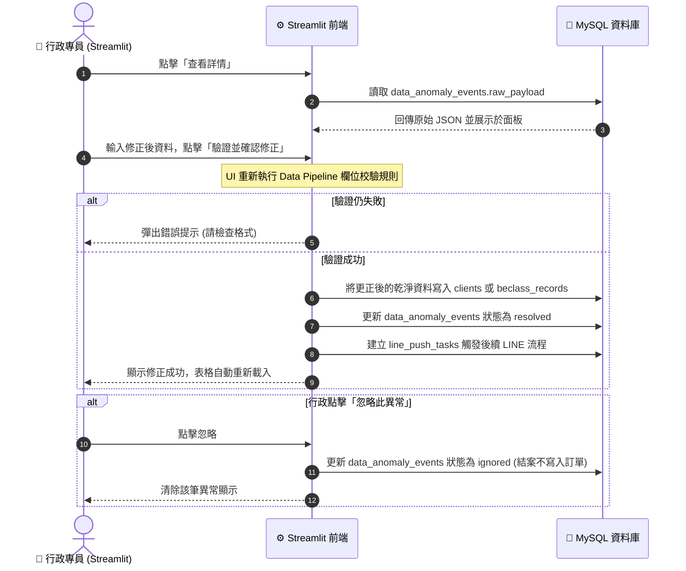
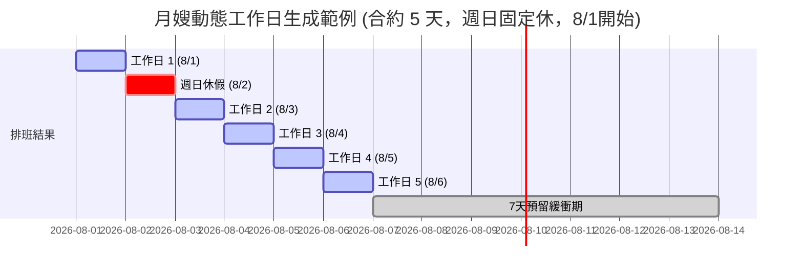
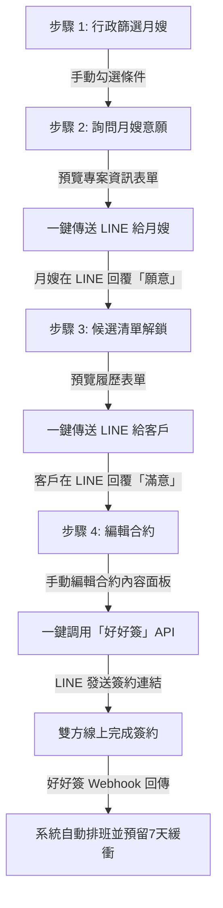

# Streamlit 管理後台 細部設計規格書

本文件基於 [[自動化系統設計規格書(綜覽)]] 的規劃，針對工會管理端使用的 **Streamlit 後台管理系統** 進行介面佈局、操作流程與後端/資料庫連動規格定義。

本文件採用 **UI 驅動設計 (UI-Driven Design)**，先定義前端介面與使用者操作流，再倒推後台資料讀寫需求。

---

## 1. 管理後台頁面大綱與架構

管理後台採用 Streamlit 內建的側邊欄導覽 (Sidebar Navigation)，共規劃以下四個核心功能頁面：

1.  **頁面一：📊 儀表板與資料異常處理 (Dashboard & Anomalies)**
    *   展示案件核心 KPI 指標，並提供 BeClass / 政府表單匯入髒資料的「隔離、檢視與人工修正」介面。
2.  **頁面二：📅 月嫂行事曆與排班 (Staff & Availability)**
    *   視覺化管理月嫂的可工作時間區間與已被預約排班區間，支援手動編輯回寫。
3.  **頁面三：🤝 案件與配對中心 (Clients, Orders & Matching)**
    *   一站式管理所有案件，包含檢視 BeClass 問卷細節、變更金流狀態（手動確認收到訂金/尾款以推進狀態）、手動取消訂單並填載取消原因，以及針對「洽談中」的案件點擊「⚡ 配對」以展開自訂四步智慧配對流程。

---

## 2. 頁面一：儀表板與資料異常處理 (細部設計)

本頁面主要提供行政專員「全局業務概覽」以及「髒資料隔離更正」的核心操作介面。

### 2.1 介面佈局與元件設計

```
+---------------------------------------------------------------------------------+
|                                📊 儀表板與資料異常處理                          |
+---------------------------------------------------------------------------------+
|                                                                                 |
|  [ 當月新增登記: 12 件 ]  [ 進行中案件: 28 件 ]  [ ⚠️ 待處理資料異常: 3 筆 ]      |
|                                                                                 |
|  -----------------------------------------------------------------------------  |
|                                                                                 |
|  ⚠️ 資料填報異常隔離區 (Quarantine Area)                                         |
|                                                                                 |
|  +-----+----------+--------------------+----------------+--------------------+  |
|  | ID  | 來源平台 | 異常類型           | 錯誤欄位與值   | 操作               |  |
|  +-----+----------+--------------------+----------------+--------------------+  |
|  | 001 | BeClass  | PHONE_FORMAT_ERROR | phone: 0912-34 | [查看詳情] [手動修正] |  |
|  +-----+----------+--------------------+----------------+--------------------+  |
|                                                                                 |
|  [🔍 點擊 001 號異常展開修正面板]                                                |
|  +---------------------------------------------------------------------------+  |
|  | 原始完整 JSON 數據: { ... "name": "陳小姐", "phone": "0912-34" ... }       |  |
|  |                                                                           |  |
|  | 請輸入修正後的行動電話: [ 0912345678 ] (行政人員手動修正)                    |  |
|  |                                                                           |  |
|  |                     [ 💾 驗證並確認修正 ]   [ 🗑️ 忽略此異常 ]               |  |
|  +---------------------------------------------------------------------------+  |
|                                                                                 |
+---------------------------------------------------------------------------------+
```

### 2.2 業務流程與資料庫連動規格

當行政專員在 Streamlit 介面進行「確認修正」或「忽略」操作時，系統的後台連動邏輯如下：



### 2.3 資料表讀寫連動點 (與 Data Pipeline 對接)
*   **讀取標籤**：`🏷️ [資料庫讀取] MySQL: data_anomaly_events` (篩選條件 `process_status = 'pending'`)。
*   **寫入標籤**：`🏷️ [資料庫更新] MySQL: data_anomaly_events` (更新 `process_status = 'resolved'` 或 `'ignored'`)。
*   **寫入標籤**：`🏷️ [資料庫更新] MySQL: clients / beclass_records` (寫入人工修正後的潔淨數據)。

---

## 2. 頁面二：月嫂行事曆與排班 (細部設計)

本頁面旨在提供行政專員視覺化管理所有月嫂的服務檔期、請假狀態，並實作符合真實業務變動的動態排班算法。

### 2.1 介面佈局與元件設計

```
+---------------------------------------------------------------------------------+
|                               📅 月嫂行事曆與排班                               |
+---------------------------------------------------------------------------------+
|                                                                                 |
|  [🔍 選擇月嫂: 陳大姐 (ID: 005) ▽ ]          [ 固定休假偏好: 週日固定休 ]       |
|                                                                                 |
|  📅 2026年 7月 - 9月 排班狀態時間軸 (Timeline View)                             |
|  +---------------------------------------------------------------------------+  |
|  | [ 7月 ] ■■■■■■■■■ (7/1-7/10 實派: 林小姐)  🌲🌲 (7/11-12 休)  □□□□ (7/13-31 空) |  |
|  | [ 8月 ] □□□□□ (8/1-8/15 空)  ✖✖✖✖ (8/16-20 請假)  🟠🟠🟠 (8/21-31 預排緩衝)|  |
|  +---------------------------------------------------------------------------+  |
|                                                                                 |
|  🛠️ 手動調整/新增排班與請假時段                                                 |
|  +---------------------------------------------------------------------------+  |
|  | * 狀態類型: ( ) 🟢 空檔  ( ) 🔵 預排案件  (●) 🟡 請假/不可工作               |  |
|  | * 開始日期: [ 2026-08-16 ▽ ]      * 結束日期: [ 2026-08-20 ▽ ]                |  |
|  | * 關聯案件: [ 無 (請假不需關聯) ▽ ]                                           |  |
|  | * 備註說明: [ 安排出國旅遊 ]                                                 |  |
|  |                                                                           |  |
|  | [ ⚠️ 系統防呆警告：此請假期間與 8/18 - 8/25 的「張小姐預排案」重疊！ ]         |  |
|  | [ 💾 驗證並儲存排班 (目前因衝突鎖定) ]                                           |  |
|  +---------------------------------------------------------------------------+  |
+---------------------------------------------------------------------------------+
```

### 2.2 核心業務邏輯與排班算法

為了應對實際生產日的變動性與月嫂個別的休假制度，系統實作以下核心算法：

#### (1) 資料庫驅動之「動態工作日計算」 (Exclude Rest Days)
*   **機制**：當指派一個合約天數為 $N$ 天（例如 24 天）的案件給月嫂時，系統不能直接以 `開始日期 + N` 來計算結束日。
*   **算法**：
    1. 讀取該月嫂於 `caregivers.weekly_rest_days` 儲存的固定休假偏好（如：`["Sunday"]` 示週日休，或 `["Saturday", "Sunday"]` 示週休二日）。
    2. 自「開始服務日」起算，每日遞增。
    3. 若該日期為該月嫂的固定休假日，則該日標示為 `🌲 固定休假`（不計入合約服務天數），合約結束日期順延一天。
    4. 重複此步驟，直到扣除休假後的工作日累計達到 $N$ 天，得出最終的「合約預定結束日」。



#### (2) 動態預留緩衝期 (Buffer Period)
*   **機制**：在任何`預排`或`實派`案件結束後，系統會自動在時間軸上向後標示 **7 天的橘色 `🟠 緩衝預留期`**。此區間旨在吸收因提早或延後生產造成的檔期波動。

#### (3) 雙層衝突驗證 (Conflict Whitelist)
*   **🔴 強制阻擋 (Hard Block)**：若手動排班期間與該月嫂的 **`實派案件`**、**`固定休假`** 或 **`已核准請假`** 重疊，系統即時跳出紅色警報並**鎖死儲存按鈕**。
*   **🟡 彈性警告 (Soft Warning)**：若排班期間與其他客戶的 **`預排案件`** 或 **`7天預留緩衝期`** 重疊，系統跳出黃色警報，但**允許**行政人員勾選「忽略警告並強行排班」進行強行寫入，保留人工作業彈性。

#### (4) 生產日平移自動建議 (Auto-Shifting)
*   **機制**：當客戶實際生產日確定時，行政人員修改該案件的「實際開始日」，系統會依此日重新執行上述 (1) 的工作日計算，得出新的結束日，並動態將「預留緩衝期」同步平移，最後自動提示是否調整後續受影響的預排案件。

### 2.3 資料表讀寫連動點
*   **讀取標籤**：`🏷️ [資料庫讀取] MySQL: caregivers` (讀取 `weekly_rest_days` 欄位)。
*   **讀取標籤**：`🏷️ [資料庫讀取] MySQL: caregiver_schedules` (讀取已存在的所有日程狀態)。
*   **寫入標籤**：`🏷️ [資料庫寫入/更新] MySQL: caregiver_schedules` (寫入更動後的排班日程)。

---

## 3. 頁面三：案件與配對中心 (細部設計)

本頁面將客戶/訂單管理與智慧配對工作流整合至同一個操作介面。行政專員可在此頁面一站式完成金流確認、手動取消與資料檢視，並針對「洽談中」的案件一鍵展開配對工作流。

### 3.1 介面佈局與元件設計

```
+---------------------------------------------------------------------------------+
|                               🤝 案件與配對中心                                 |
+---------------------------------------------------------------------------------+
|  [🔍 搜尋客戶姓名/電話/訂單編號:             ]        [篩選狀態: 所有狀態 ▽ ]   |
|                                                                                 |
|  +------------+----------+------------+------------+-------------------------+  |
|  | 訂單編號   | 客戶姓名 | 預產期     | 目前狀態   | 操作                    |  |
|  +------------+----------+------------+------------+-------------------------+  |
|  | HC115628   | 林小姐   | 2026-08-10 | 洽談中     | [👁️ 檢視] [⚡ 配對] [❌ 取消]|  |
|  | HC115620   | 陳小姐   | 2026-07-15 | 待付款     | [👁️ 檢視] [💰 訂金] [❌ 取消]|  |
|  | HC115610   | 張小姐   | 2026-06-01 | 服務中     | [👁️ 檢視]           [❌ 取消]|  |
|  | HC115605   | 王小姐   | 2026-05-10 | 服務結束   | [👁️ 檢視] [💵 尾款]           |  |
|  +------------+----------+------------+------------+-------------------------+  |
|                                                                                 |
|  [🔍 點擊 HC115628 的 [⚡ 配對] 按鈕，於表格下方展開配對面板]                    |
|  +---------------------------------------------------------------------------+  |
|  | 待配對案件：林小姐 (預產期 8/10, 竹北市)                                  |  |
|  | [步驟 1: 條件篩選] -> [步驟 2: 詢問意願] -> [步驟 3: 傳送履歷] -> [步驟 4: 傳送契約] |  |
|  |                                                                           |  |
|  | 【目前展示：步驟 2: 詢問意願】                                              |  |
|  | 篩選出的合格服務人員名單：                                                |  |
|  | +--------+----------+------------+--------------------+-----------------+  |
|  | | 姓名   | 服務地區 | 大寶餐專長 | 寵物友善狀態       | 操作            |  |
|  | +--------+----------+------------+--------------------+-----------------+  |
|  | | 陳大姐 | 竹北市   | 有證照     | 接受貓狗           | [👁️預覽] [詢問] |  |
|  | | 王大姐 | 新竹市   | 無證照     | 接受貓狗           | [👁️預覽] [詢問] |  |
|  | +--------+----------+------------+--------------------+-----------------+  |
|  |                                                                           |  |
|  | [🔍 點擊 陳大姐 [👁️ 預覽] 展開專案資訊預覽]                                 |  |
|  | - 服務對象：林小姐 (新竹竹北市)                                           |  |
|  | - 預排期間：2026-08-10 起 24 工作日 (週日休，預計 9/10 結束)              |  |
|  |                                                                           |  |
|  |             [ 💾 儲存並一鍵傳送意願詢問 (需連結月嫂 LINE) ]               |  |
|  +---------------------------------------------------------------------------+  |
+---------------------------------------------------------------------------------+
```

### 3.2 四步媒合工作流與 API 串接規格



#### 步驟 1：自訂條件篩選 (Manual Filtering)
*   **UI 機制**：取消自動分數推薦。提供多個 `st.checkbox` 供行政人員手動勾選（如：`[x] 檔期完全無衝突`、`[x] 服務地區符合`、`[x] 需做大寶餐`）。
*   **列表呈現**：在表格中直觀展示這些勾選的條件欄位值，供行政專員自行依經驗判斷人選。

#### 步驟 2：詢問服務人員接案意願 (Caregiver Consent)
*   **前提條件**：需要服務人員已連結其 LINE 帳號（系統內存有其 `caregiver_line_id`）。
*   **UI 機制**：點擊 `[👁️ 預覽專案]`，彈出預填的專案資訊表單，行政專員可微調金額或備註，點擊 `[一鍵傳送意願詢問]`。
*   **後端與 LINE 整合**：
    *   在 `line_push_tasks` 寫入任務，透過 LINE 發送詢問卡片（內含「我願意接案」與「無意願」兩個按鈕）。
    *   服務人員在 LINE 點擊「我願意接案」後，Webhook 服務會將此媒合紀錄狀態更新為 `caregiver_accepted = 1`。

#### 步驟 3：履歷預覽並傳送給客戶 (Client Resume Review)
*   **前提條件**：僅有在步驟 2 中，月嫂回覆「願意接案」者，才會出現在步驟 3 的選單中。
*   **UI 機制**：行政專員點擊 `[👁️ 預覽履歷]`，確認月嫂基本自傳、照護經歷與證照等表單內容，確認無誤後，點擊 `[一鍵傳送履歷]`（需連結客戶之 `client_line_id`）。
*   **後端與 LINE 整合**：向客戶的 LINE 官方帳號發送該月嫂的結構化履歷卡片。

#### 步驟 4：合約手動編輯與「好好簽」線上簽名整合 (E-Contract)
*   **UI 機制**：當確認選定人選後，由於每個專案皆有不可控因素（例如客戶早產需彈性改期、或因服務人員不足需安排雙月嫂分攤工作），系統不採用全自動生成。行政專員點擊 **`[✍️ 編輯並傳送契約]`**，系統將展開一個**「合約詳細內容編輯面板」**。
*   **手動調整能力**：行政人員可在此自由微調合約所有條款，包括：開始與結束日期、合約金額、是否安排雙月嫂分工（天數拆分）等。
*   **好好簽與 LINE API 連動**：
    1.  行政專員手動微調合約內容確認無誤後，點擊 `[一鍵送出契約]`，後端即時呼叫 **「好好簽 (breezysign) API」** 建立電子契約物件，並取得專屬簽署網址。
    2.  系統寫入 `line_push_tasks`，由 LINE Bot 發送「簽約提醒與連結」給客戶與月嫂。
    3.  當雙方在線上完成簽署後，好好簽透過 **Webhook** 通知系統的 FastAPI 後端。
    4.  系統收到通知後，自動將訂單狀態改為「實派」，並自動在 `caregiver_schedules` 寫入該月嫂的行程（已排除固定休假），並在結束日後自動產生 `🟠 7 天預留緩衝期`。

### 3.3 資料表讀寫連動點
*   **讀取標籤**：`🏷️ [資料庫讀取] MySQL: caregivers / matching_records` (篩選狀態與意願)。
*   **寫入標籤**：`🏷️ [資料庫寫入] MySQL: line_push_tasks` (非同步發送詢問、履歷、合約)。
*   **寫入標籤**：`🏷️ [資料庫寫入/更新] MySQL: caregiver_schedules / orders` (合約簽署成功後寫入排班與更新狀態)。

---

## 4. 技術選型備註：Streamlit 與 React 的對比與升級路徑

為了評估原型（Prototype）與最終產品（Production）的技術路線，本節針對 Streamlit 與 React 進行多維度分析，作為後續團隊分工與系統升級之依據。

### 4.1 技術對比分析

| 評估維度 | Streamlit (原型對接) | React (潛在最終產品) | 對使用者的影響 / 備註 |
| :--- | :--- | :--- | :--- |
| **開發效率 (Dev Speed)** | **極高**。全 Python 開發，無需寫 HTML/CSS/JS。 | **中低**。需前後端分離開發，維護 API 與前端路由。 | 原型階段能用最快速度修改版面，與工會溝通變更。 |
| **運行與互動效率** | **較低**。使用者每次操作皆會觸發 Python 腳本 Rerun，高頻互動時有延遲感。 | **極高**。前端狀態於瀏覽器內無感刷新，僅透過非同步 API LA取資料。 | 對行政人員來說，React 的流暢度與即時反饋更佳。 |
| **介面客製化與防呆** | **有限**。版面元件受限於內建組件，難以實作複雜互動 (如拖拽排班)。 | **無限**。可利用豐富的前端庫 (如 Tailwind, AntD, FullCalendar) 客製極致的防呆 UI。 | **關鍵影響**：對於「無程式背景使用者」(工會行政人員)，React 能提供更直覺、難以點錯的防呆介面。 |
| **用戶權限與擴展性** | **較弱**。多用戶同時在線時，Session 管理較為繁瑣，較不適合開放給大量會員使用。 | **極強**。天生適合多用戶、角色權限分明 (如行政、月嫂、客戶) 的權限防護系統。 | 若未來需要開放給月嫂/會員登入系統，React 具備絕對的架構優勢。 |

### 4.2 推薦技術實作路徑

*   **當前階段 (原型與對接)**：
    *   **維持使用 Streamlit**。工會需求尚未完全定型前，Streamlit 是低成本驗證業務邏輯（如配對演算法、行事曆生成）的最佳工具。
*   **最終產品決策點**：
    *   **情境 A (維持 Streamlit)**：若後台僅限工會 **少數 2-3 名行政人員** 使用，且他們能接受稍微陽春的版面與重新載入的短暫延遲，則 Streamlit 完全足夠，可省下昂貴的前端開發預算。
    *   **情境 B (升級 React + FastAPI)**：若工會要求極佳的操作體驗（例如月嫂行事曆需要支援「滑鼠拖曳排班」與強大防呆），或者未來計劃**開放給會員/月嫂登入後台**，則應將 Streamlit 淘汰，將 FastAPI 轉為純 API 提供給 React 前端。
