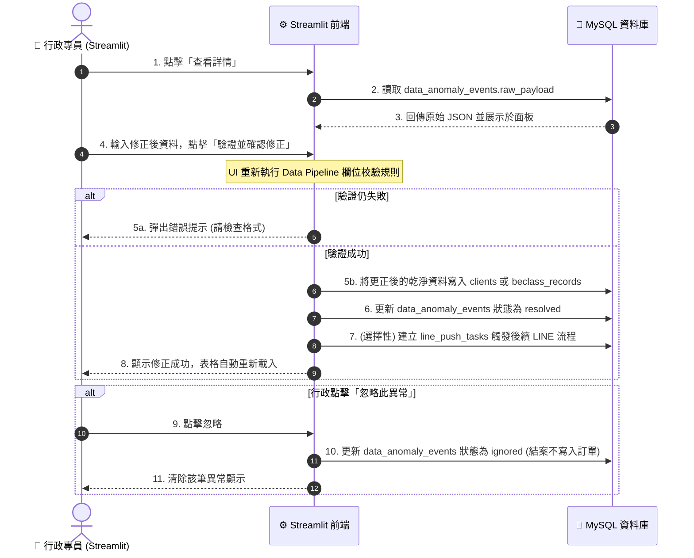

# Streamlit 管理後台 細部設計規格書

本文件基於 [[自動化系統設計規格書(綜覽)]] 的規劃，針對工會管理端使用的 **Streamlit 後台管理系統** 進行介面佈局、操作流程與後端/資料庫連動規格定義。

本文件採用 **UI 驅動設計 (UI-Driven Design)**，先定義前端介面與使用者操作流，再倒推後台資料讀寫需求。

---

## 1. 管理後台頁面大綱與架構

管理後台採用 Streamlit 內建的側邊欄導覽 (Sidebar Navigation)，共規劃以下四個核心功能頁面：

1.  **頁面一：📊 儀表板與資料異常處理 (Dashboard & Anomalies)**
    *   展示案件核心 KPI 指標，並提供 BeClass / 政府表單匯入髒資料的「隔離、檢視與人工修正」介面。
2.  **頁面二：👥 客戶與訂單管理 (Clients & Orders)**
    *   檢視政府登記案源、BeClass 詳細問卷，建立或修改服務訂單與金流狀態。
3.  **頁面三：📅 月嫂行事曆與排班 (Staff & Availability)**
    *   視覺化管理月嫂的可工作時間區間與已被預約排班區間，支援手動編輯回寫。
4.  **頁面四：🤝 智慧配對與派案 (Matching & Assignment)**
    *   根據案件需求比對空檔，排序推薦評分 9 分以上月嫂，實作一鍵派發履歷與電子合約。

---

## 2. 頁面一：儀表板與資料異常處理 (細部設計)

本頁面主要提供行政專員「全局業務概覽」以及「髒資料隔離更正」的核心操作介面。

### 2.1 介面佈局與元件設計

```
+---------------------------------------------------------------------------------+
|                                📊 儀表板與資料異常處理                          |
+---------------------------------------------------------------------------------+
|                                                                                 |
|  [ 當月新增登記: 12 件 ]  [ 進行中案件: 28 件 ]  [ ⚠️ 待處理資料異常: 3 筆 ]      |
|                                                                                 |
|  -----------------------------------------------------------------------------  |
|                                                                                 |
|  ⚠️ 資料填報異常隔離區 (Quarantine Area)                                         |
|                                                                                 |
|  +-----+----------+--------------------+----------------+--------------------+  |
|  | ID  | 來源平台 | 異常類型           | 錯誤欄位與值   | 操作               |  |
|  +-----+----------+--------------------+----------------+--------------------+  |
|  | 001 | BeClass  | PHONE_FORMAT_ERROR | phone: 0912-34 | [查看詳情] [手動修正] |  |
|  +-----+----------+--------------------+----------------+--------------------+  |
|                                                                                 |
|  [🔍 點擊 001 號異常展開修正面板]                                                |
|  +---------------------------------------------------------------------------+  |
|  | 原始完整 JSON 數據: { ... "name": "陳小姐", "phone": "0912-34" ... }       |  |
|  |                                                                           |  |
|  | 請輸入修正後的行動電話: [ 0912345678 ] (行政人員手動修正)                    |  |
|  |                                                                           |  |
|  |                     [ 💾 驗證並確認修正 ]   [ 🗑️ 忽略此異常 ]               |  |
|  +---------------------------------------------------------------------------+  |
|                                                                                 |
+---------------------------------------------------------------------------------+
```

### 2.2 業務流程與資料庫連動規格

當行政專員在 Streamlit 介面進行「確認修正」或「忽略」操作時，系統的後台連動邏輯如下：



### 2.3 資料表讀寫連動點 (與 Data Pipeline 對接)
*   **讀取標籤**：`🏷️ [資料庫讀取] MySQL: data_anomaly_events` (篩選條件 `process_status = 'pending'`)。
*   **寫入標籤**：`🏷️ [資料庫更新] MySQL: data_anomaly_events` (更新 `process_status = 'resolved'` 或 `'ignored'`)。
*   **寫入標籤**：`🏷️ [資料庫更新] MySQL: clients / beclass_records` (寫入人工修正後的潔淨數據)。
