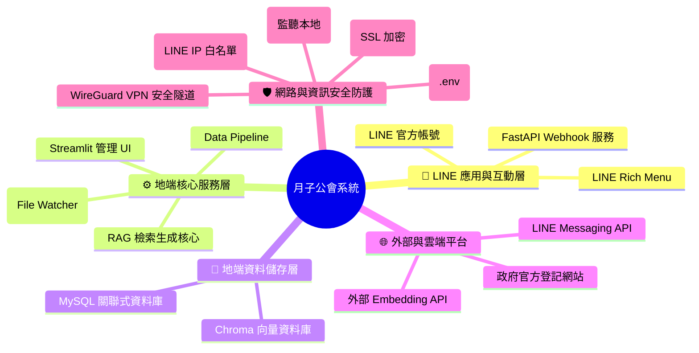

# line應用與行政流程自動化 需求規格書 (SRS)

本需求規格書旨在定義"新竹市月子照顧服務人員職業工會"line應用與行政流程自動化的功能性與非功能性需求，並規劃系統架構與實作路徑。

---

## 系統架構圖

---

## 第一部分：LINE 平台與客服系統

### 1.1 LINE 官方帳號功能與整合

#### 1.1.1 LINE Bot 基礎運營與訊息處理
*   **平台對接**：系統需對接 LINE Messaging API，透過 Webhook 接收使用者發送的文字訊息。
*   **訊息流處理**：
    *   接收使用者提問 -> 轉發至地端 RAG 核心 -> 取得 AI 生成之回答 -> 透過 LINE API 回覆使用者。
    *   非文字訊息（如貼圖、圖片、語音）需有預設的友善提示回應。

#### 1.1.2 客戶互動與業務流程 (半自動化)
*   **繳款相關操作**：引導用戶進行繳款（如發送匯款帳號、提供確認繳費通知等）。
*   **傳送服務人員資料**：依據配對結果，發送推薦的月嫂/服務人員履歷或狀態資料給使用者。
*   **【備註】**：此功能暫定為**半自動化**。由於自動化邊界尚未完全確定，目前規劃由系統提供預設範本與管道，具體哪些步驟需要管理員人工確認/觸發，將於後續細化流程時定義。

#### 1.1.3 LINE Rich Menu (圖文選單)
*   **選單設計**：於 LINE 官方帳號底部配置常駐圖文選單。
*   **導引連結**：設定特定選單區塊，當使用者點擊時，直接觸發 LINE 內建瀏覽器或引導開啟外部瀏覽器，導向**政府網站登記頁面**（例如：托育登記、公會申辦登記等官方頁面）。

### 1.2 RAG 與語意檢索核心需求

#### 1.2.1 知識庫與自動回覆機制 (無 LLM / 防幻覺)
*   **知識庫管理**：建置公會專屬知識庫（包含業務規章、常問問題 FAQ、服務流程等，格式為標準問題與預設答案之配對）。
*   **語意檢索回覆機制**：
    *   使用者提問時，系統先將提問內容進行向量運算。
    *   於地端向量資料庫中比對相似度最高的標準問題。
    *   若最高相似度超過設定閥值（Threshold），直接回覆對應的預設答案。
    *   若低於閥值，則回覆預設的客服導引提示，完全避免 AI 產生的「幻覺」（Hallucination）問題。

#### 1.2.2 Embedding 向量化與 API 串接
*   **向量化 (Embedding)**：可選擇串接外部 API（如 OpenAI Text-Embedding-3、Google Gemini Embedding）或採用地端輕量化模型（如 `sentence-transformers`），將知識庫問題與使用者提問轉化為高維度向量。
*   **相似度計算**：於向量資料庫中採用餘弦相似度（Cosine Similarity）進行檢索與閥值比對。

### 1.3 地端伺服器架設
*   **地端部署**：RAG 核心程式、向量資料庫（如 ChromaDB / Milvus / pgvector）與 LINE Webhook 的後端程式需架設於公會指定的**地端實體伺服器或私有雲環境**中。
*   **網路安全**：
    *   需設定地端伺服器的防火牆，僅允許 LINE 平台的 Webhook IP 區段進行 HTTPS 連線。
    *   設定反向代理（如 Nginx）並申請 SSL 憑證以進行加密傳輸。
    *   地端伺服器需具備外網連線能力以呼叫外部 Embedding/LLM API（需配置 API Key 安全儲存機制，避免外洩）。

---

## 第二分部：資料庫與自動化需求

### 2.1 Excel 轉型 MySQL 資料庫
*   **資料表設計**：
    *   分析公會現有的客戶/業務 Excel 表單結構，提取必要欄位（如客戶姓名、聯絡電話、地址、登記日期、狀態等）。
    *   於 MySQL 中設計合理的資料庫 Schema、資料表（Tables）以及主外鍵關係，並建立適當的索引（Indexes）以優化查詢效能。
    *   **資料庫核心欄位與中介表擴充規格**：
        1. **客戶資料表 (`clients`)**：
           * 新增 `line_user_id` (VARCHAR)：儲存客戶個人的 LINE 唯一識別碼，用於發送履歷、契約提醒。
        2. **服務人員/月嫂表 (`caregivers`)**：
           * 新增 `line_user_id` (VARCHAR)：儲存服務人員個人的 LINE 唯一識別碼，用於發送接案意願詢問。
           * 新增 `weekly_rest_days` (VARCHAR/JSON)：儲存固定休假偏好（如：`["Sunday"]`），用以驅動動態工作日排班算法。
           * 新增 `service_regions` (VARCHAR/JSON)：儲存該服務人員接受之服務區域。
           * 新增 `special_skills` (TEXT/JSON)：儲存技能與偏好標籤（如：會做大寶餐、接受寵物貓狗）。
        3. **專案與訂單資料表 (`orders`)**：
           * 新增 `line_group_id` (VARCHAR)：儲存三方服務群組 ID，用以進行服務生命週期的群組訊息推播。
           * 新增 `breezysign_contract_id` (VARCHAR)：綁定「好好簽」線上契約 ID，追蹤線上簽署狀態。==不確定要不要==
           * 新增 `actual_start_date` (DATE)：實際生產服務開始日（用於觸發排班日程平移）。
           * 新增 `project_status` (VARCHAR/ENUM)：專案狀態，限制為：`洽談中` (客戶在政府網填表時的預設狀態)、`訂單成立` (確認收取訂金時狀態)、`訂單取消` (行政專員手動取消狀態)。
           * 新增 `cancel_reason` (TEXT)：當狀態變更為「訂單取消」時，強置填寫的取消原因。
        4. **新增意願詢問中介表 (`matching_records`)**：
           * 用於步驟二與步驟三的意願確認。欄位包括：`id` (主鍵)、`order_id` (外鍵)、`caregiver_id` (外鍵)、`caregiver_accepted` (TINYINT/BOOLEAN，定義為 `NULL` 待回覆、`1` 願意、`0` 無意願)、`sent_at` (詢問發送時間)。==ai寫得有點看不懂==
*   **匯入與初始化**：由行政人員手動下載資料，撰寫python。
*   **【備註】**：此資料匯入與初始化邏輯，後續開發時可直接併入 **Data Pipeline** 模組中進行統一管理，避免重複開發寫入邏輯。

### 2.2 資料庫 UI 管理介面
*   **介面選型**：
    *   **正式管理介面 (讀寫/互動)**：採用 Python 輕量級 Web 框架 **Streamlit**，結合 **PyMySQL**（或 SQLAlchemy）連接 MySQL 資料庫，實作行事曆修改與月嫂業務配對等互動讀寫功能。
*   **功能需求**：
    *   **視覺化問答編輯器**：管理員與行政人員可透過點選欄位、設定過濾器與排序條件，即時進行資料查詢，無需編寫 SQL。
    *   **一鍵報表下載**：支援將查詢結果直接匯出並下載為 Excel (`.xlsx`) 或 CSV 格式。
    *   **儀表板與報表儲存**：可將常用查詢儲存為常規報表，並彙整至儀表板，提供一鍵即時查看與下載。
    *   **權限管控與安全隔離**：提供細粒度的權限管理，並使用資料庫唯讀帳號（Read-Only User）連線，確保資料安全性，防止誤刪改。
    *   **服務人員行事曆 (互動讀寫)**：
        *   **預設生成**：系統讀取 MySQL 中服務人員的工作時間備註，自動生成預設的工作行事曆。
        *   **手動調整**：管理者可直接於介面上修改行事曆（如調整工作天、修改請假與空檔狀態），並即時回寫更新至 MySQL。
    *   **案件與配對中心 (一站式管理與配對)**：
        *   **金流與狀態更新**：行政人員手動點擊確認收到訂金或尾款，或點擊取消案件並登載取消原因。
        *   **自訂配對工作流**：針對洽談中案件，一鍵展開四步條件篩選、意願詢問、履歷發送與 Breezysign 電子合約發送。

### 2.3 資料輸入與自動偵測載入 (File Watcher)
*   **手動下載與放置**：行政人員手動登入政府表單與 BeClass 系統，將最新的名冊 Excel 檔案下載，並放置於地端伺服器指定的目錄（如 `downloads/`）。
*   **地端檔案自動監控**：地端伺服器背景執行檔案監測服務（如使用 Python `watchdog` 庫），即時監控該目錄。當偵測到新檔案被寫入或現有檔案更新時，自動觸發並啟動 Data Pipeline 解析程序。
*   **自動寫入與去重**：
    *   解析 Excel 檔案內容。
    *   在寫入 MySQL 資料庫前進行資料比對（以唯一識別碼，如 `case_no` 或 `query_no` 進行對比）。
    *   **僅針對新產生的資料進行 Insert**，現有資料若有變更則進行 Update，避免重覆寫入與資料髒亂。

---

## 第三部分：地端部署與網絡安全規範

### 3.1 邊界網絡防護 (Network Boundary Protection)
*   **反向代理 (Reverse Proxy)**：
    *   地端伺服器僅暴露外網 Port 443 (HTTPS)，並使用 Nginx 或 Caddy 做為反向代理窗口。
    *   對外只允許加密流量 (SSL/TLS 1.3)，由反向代理伺服器進行 SSL 憑證卸載 (SSL Termination)，內部傳輸則使用本地迴圈 (Loopback) 連接 FastAPI 後端。
*   **防火牆來源 IP 過濾 (Firewall IP Whitelisting)**：
    *   地端防火牆或路由閘道器必須設定嚴格過濾規則。
    *   **Port 443 (HTTPS) 只允許來自 LINE Webhook 的官方 IP 網段**。非 LINE 官方之連線一律阻擋 (DROP)。
*   **管理端存取限制 (Internal Admin Only)**：
    *   管理員 UI (Streamlit, Port 8501) 預設嚴禁直接暴露於外網。
    *   外部存取必須先透過 VPN 安全隧道 (如 WireGuard) 連回公會私有內網，通過身份驗證後方能開啟網頁。

### 3.2 資料儲存安全隔離 (Data Isolation)
*   **資料庫本機監聽**：
    *   MySQL 與向量資料庫僅監聽本地 localhost (127.0.0.1) 或是 Docker 內部橋接網絡 (Bridge Network)，杜絕來自外網任何直連資料庫 Port 的可能性。
*   **資料庫存取權限最小化**：
    *   對外暴露之 LINE Bot FastAPI 以及 Data Pipeline 僅使用具備對應資料表 (Tables) 讀寫權限的專用帳戶，禁止使用 root 帳戶連接。

### 3.3 敏感金鑰管理 (Secret Management)
*   **環境變數隔離**：
    *   OpenAI / Gemini 的 API 金鑰、資料庫連線密碼及 LINE Token 嚴禁寫死在原始碼中。
    *   所有金鑰統一透過 `.env` 檔案儲存，並限制此設定檔僅伺服器運行帳號擁有讀取權限，且必須加入 `.gitignore` 防止意外提交至 Git 倉庫。

### 3.4 備份與災難復原 (Backup & Recovery)
*   **自動化備份排程**：
    *   設定地端定時工作 (Cron Job)，每日凌晨自動對 MySQL 與向量資料庫進行冷備份，並將備份檔加密儲存至獨立 the 本機磁碟或公會地端 NAS 中。

---

## 技術棧建議

| 模組 | 推薦技術 / 工具 | 說明 |
| :--- | :--- | :--- |
| **開發語言** | Python 3.10+ | 適合語意檢索開發與自動化資料處理 |
| **後端框架** | FastAPI / Flask | 用於開發 LINE Bot Webhook API |
| **管理員 UI** | Streamlit (原型) / React (評估) | 原型階段使用 Streamlit 快速迭代與工會對接；最終產品評估是否升級 React。 |

> [!NOTE]
> **關於管理端 UI 技術選型 (Streamlit vs React)**
> 1. **原型階段**：本專案開發 Prototype 與工會對接時，使用 **Streamlit** 是最優選擇，能以極少代碼快速修改介面，降低前期溝通成本。
> 2. **最終產品階段**：
>    - **React 具備優勢**：如果未來系統需要高頻互動（例如行事曆拖拽排班）、細緻的防呆設計（對無程式背景的行政人員極為重要） or 開放給月嫂/會員登入，則升級為 **React (前端) + FastAPI (後端)** 會有更好的性能、互動效率與安全性。
>    - **YAGNI 考量**：若最終僅有 2-3 名內部行政專員使用，且對介面流暢度無嚴苛要求，則繼續沿用 Streamlit 能最大化開發效益。詳情請參閱 [[設計規格書(Streamlit UI)]] 第 3 節。
| **反向代理與安全**| Nginx + Certbot / VPN | 用於 SSL 加密、反向代理與管理端 VPN 隧道建立 |
| **向量資料庫** | ChromaDB / pgvector | 輕量且易於在地端部署 |
| **關聯式資料庫**| MySQL 8.0+ | 儲存結構化客戶資料與名冊資料 |
| **檔案監控工具** | Watchdog / watchdog | 用於監控地端指定資料夾之檔案變更並觸發 Pipeline |
| **部署方式** | Docker / Docker Compose | 用於容器化部署 MySQL 與 Streamlit 服務，確保地端環境一致性 |

---

## 驗收標準 (Acceptance Criteria)

1.  **LINE Bot 交互**：輸入與知識庫相關的問題，LINE Bot 需在 3 秒內以語意比對直接回覆預設的正確答案；點擊 Rich Menu 可成功開啟政府登記網頁。
2.  **地端部署驗證**：確認所有向量資料與 MySQL 資料庫均儲存於地端伺服器，無外洩風險。
3.  **Excel 轉換**：現有 Excel 檔案能成功匯入 MySQL，且無亂碼與資料遺失。
4.  **檔案自動監測與載入**：行政人員手動將名冊檔案放置於指定資料夾後，地端監控服務能自動偵測到檔案變更並即時啟動 Data Pipeline，成功解析並更新至 MySQL 資料庫，無重覆資料。
5.  **UI 查詢**：管理員能透過網頁瀏覽、搜尋 MySQL 內的資料。
6.  **行事曆管理**：管理者能在 Streamlit 網頁上檢視自動生成的行事曆，手動調整狀態後能即時儲存回寫至 MySQL 中。
7.  **月嫂業務配對**：管理者輸入案件條件後，Streamlit UI 能顯示符合的服務人員名單，並正確依據空檔與符合度進行排序推薦。
8.  **網絡安全驗證**：確認從非公會內網且未連 VPN 的外部網絡，無法存取管理員 UI (Port 8501)；驗證除了 LINE 官方 Webhook 流量外，其餘外網 IP 嘗試連線 Port 443 皆被防火牆阻擋。

---

## 專案分工與開發協作規範 (FastAPI/UI 兩階段分工)

為了確保團隊分工明確，避免多人同時改動相同程式碼，本專案的後端 (FastAPI) 與 UI 開發將依據專案階段，明確劃分「主導人員」與「協作介面 (Interface)」：

### 階段一：LINE 機器人上線期 (以 LINE 互動為主)
此階段 FastAPI 主要作為 LINE 官方帳號的 Webhook 伺服器，負責接收並回覆 LINE 訊息。

*   **主導開發人員**：**LINE 功能開發人員**
*   **協作邊界與對接方式**：
    *   **LINE 開發人員**：負責架設 FastAPI 主程式、實作 Webhook 路由並解析 LINE 的事件。
    *   **資料庫與 RAG 開發人員**：不直接變更 Webhook 程式碼。請將你們的邏輯封裝成標準的 **Python 模組/函數**（例如提供 `query_knowledge_base(question)` 或 `save_user_data(data)` 函數）。
    *   **對接實作**：LINE 開發人員直接在 FastAPI 主程式中 `import` 這些外部模組，在收到訊息時呼叫它們，並將結果送回 LINE。

### 階段二：管理端後台開發期 (若從 Streamlit 升級為 React)
此階段 FastAPI 將擴充功能，成為 React 前端的資料庫 API 接口 (提供 RESTful JSON 數據)。

*   **主導開發人員**：**資料庫與資料處理人員** (或專職後端工程師)
*   **協作邊界與對接方式**：
    *   **資料庫人員**：負責在 FastAPI 中設計與 MySQL 資料庫連動的 API (如：`GET /api/orders`、`POST /api/match`)，利用 Pydantic 進行嚴格的欄位驗證與防呆。
    *   **React 前端人員**：完全不碰 Python 程式碼，僅閱讀 FastAPI 自動產生的 **Swagger API 文件 (OpenAPI Specification)**，以此為依據進行 React 前端畫面渲染與 API 串接。
