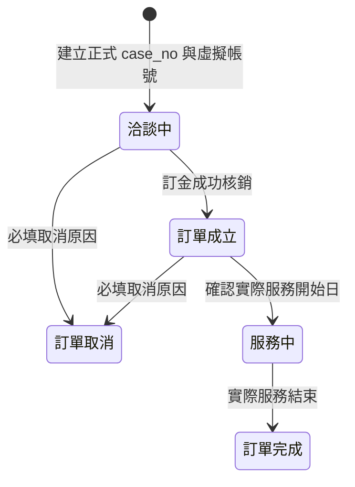

# 🪙 帳務與訂單業務規則定義（SSOT）

本文件定義月子服務的虛擬帳號、訂單狀態與新帳務模型。帳務關聯一律以 `case_no` 為準；不得以 `orders.id`、客戶姓名或月嫂姓名作為帳務主鍵。

---

## 1. 虛擬帳號編碼與綁定規則

月子服務虛擬帳號固定為 14 碼：

```text
997816 + 99 + 年度(3碼) + case_no 流水號後3碼
```

例：`case_no = 115000001`，縮寫為 `115001`，完整虛擬帳號為 `99781699115001`。

對帳時只接受前綴 `997816`、分類碼 `99` 的 14 碼帳號；將後 6 碼還原為 `case_no`，再關聯 `orders`、`clients` 與客戶帳務。課程、培訓、會員年費等其他分類碼必須略過，不得進入月子服務帳務。

---

## 2. 訂單狀態生命週期



客戶收款必須由銀行流水匯入後建立交易明細；不得直接修改帳務摘要金額。訂金成功核銷才可推進「洽談中 → 訂單成立」。

---

## 3. 帳務共同基礎與判斷公式

身分資格僅有一般市民、補助市民、非市民，作為業務資格與公式輸入；帳務程式不得依身分名稱分出互斥流程。帳務判斷以以下數值為準：

| 欄位／公式 | 定義 |
| --- | --- |
| `total_service_hours` | 實際或核定總服務時數 |
| `subsidy_hours` | 政府補助時數 |
| `client_payable_amount` | 客戶依合約應預付的總金額 |
| `staff_payable_amount` | 月嫂依服務指派應收的總薪資與已分配樓層費 |
| `subsidy_claim_amount` | 應向政府申請的補助金額 |
| `client_prepaid_subsidy_amount` | 客戶已預付、日後可能退還的補助段金額 |
| `requires_subsidy_claim` | `subsidy_hours > 0` |
| `subsidy_return_amount` | `client_prepaid_subsidy_amount`；僅保留欄位，現階段不執行退款 |

判斷規則：

1. `subsidy_hours = 0`：不申請補助、不產生退還補助金額。
2. `subsidy_hours > 0`：納入季度補助申請。
3. 補助市民全額補助時，客戶應付與客戶預付皆為 0；即使補助金額大於 0，也不得產生退還補助金額。
4. 只有客戶曾預付補助段時，`subsidy_return_amount` 才可能大於 0。這不是解約退款；解約退款必須使用獨立交易類型與流程。

---

## 4. 收款與核銷流程

1. 媒合簽約並取得正式 `case_no` 時，建立客戶帳務摘要並提供預先配置的虛擬帳號。
2. 客戶依訂金與合約期款匯至虛擬帳號；所有客戶應付金額須在月嫂結案發薪前完成預收。
3. 工會人員上傳新的銀行帳務明細；`file_watcher` 觸發匯入流程。
4. 匯入器以虛擬帳號解出 `case_no`，驗證案件存在、交易日期、金額、款項階段與外部交易識別。
5. 合法入款寫入 `client_payment_transactions`，再重算 `client_payments` 摘要。未知帳號、超收、重複交易或不符合案件狀態的入款必須列為待人工處理。

---

## 5. 月嫂一次發薪與待匯清單

月嫂每一服務指派只產生一筆應付摘要，並只進行一次正式發薪；不得再以補助段建立第二次月嫂發薪。

1. 客戶有應付金額的案件：結案後次月 15 日列入月嫂薪資待匯。
2. 客戶應付為 0 且由政府全額補助的案件：結案後次次月 15 日列入月嫂薪資待匯。
3. 每月 5 日產生當月待匯清單，列出月嫂、帳戶、`case_no`、服務指派、應匯金額與應匯日。
4. 系統不執行銀行匯款；產生清單、匯出檔或列入批次都不得標示為已付款。只有人工確認或匯入可辨識的實際支出明細後，才能寫入 `staff_payment_transactions`。

### 退還補助金額（暫不啟用）

系統保留以下欄位與未來交易能力，但目前不產生退款 UI、每月待匯清單或實際退款交易：

- `subsidy_return_amount`：退還補助金額
- `subsidy_returned_amount`：已退還補助金額
- `subsidy_return_due_date`：退還補助日期
- `subsidy_returned_at`：實際退還日期

未來啟用時，僅能處理「客戶預付補助段後退還」；不得與解約退款共用欄位或交易類型。

---

## 6. 季度補助申請與年度總覽

補助案件以 `actual_end_date`（無值時才使用 `end_date`）歸屬完工季度：

| 完工季度 | 申請月份 |
| --- | --- |
| Q1（01-01～03-31） | 4 月 |
| Q2（04-01～06-30） | 7 月 |
| Q3（07-01～09-30） | 10 月 |
| Q4（10-01～12-31） | 次年 1 月 |

每季清單只納入 `subsidy_hours > 0`、已完工且尚未列入同一申請批次的案件。年度補助總覽以完工年度統計案件與金額，至少區分：應申請、已送件、已核准、已撥款。

---

## 7. 最新金額、日期與歷史資料規則（優先於前文）

1. 核銷補助時數依資格與總服務時數計算：一般市民為 `min(40, total_service_hours)`；補助市民為 `min(120, total_service_hours)`；非市民為 0。
2. 補助申請總額為各月嫂實際服務時數比例分配後的「補助時數 × 該月嫂服務單價」合計；核銷清冊顯示案件合計。
3. 客戶三期帳務均保存應收金額、實收金額、應收日期、實收日期。訂金天數與訂金應收日期採訂單表單；第一期天數為 `min(15, max(0, 請款總日數 - 訂金天數))`，應收日期為服務開始日；第二期天數為剩餘日數，應收日期在第一期首次全額實收後才設定為「第一期實收日 + 15 天」。第二期天數為 0 時日期保持空值，畫面顯示 0。
4. 訂金、第一期、第二期的實收與實收日期只能由成功銀行交易重算。訂金首次全額核銷後，系統自動將案件由「洽談中」改為「訂單成立」。
5. 歷史資料可在單筆訂單頁人工建立或調整應收金額與排程快照，並保留調整原因與操作者；不得直接手改交易彙總的實收金額或實收日期。
6. 舊財務匯入建立客戶帳務時，應收總額與三期拆分必須由服務總天數、每日時數、身分單價、訂金天數與樓層費公式計算；不得使用舊 `v_order_details` 或固定金額。
7. 退還補助金額功能目前停用：不得建立退款交易、退款待匯清單或退款 UI。既有保留欄位不代表已啟用流程。
