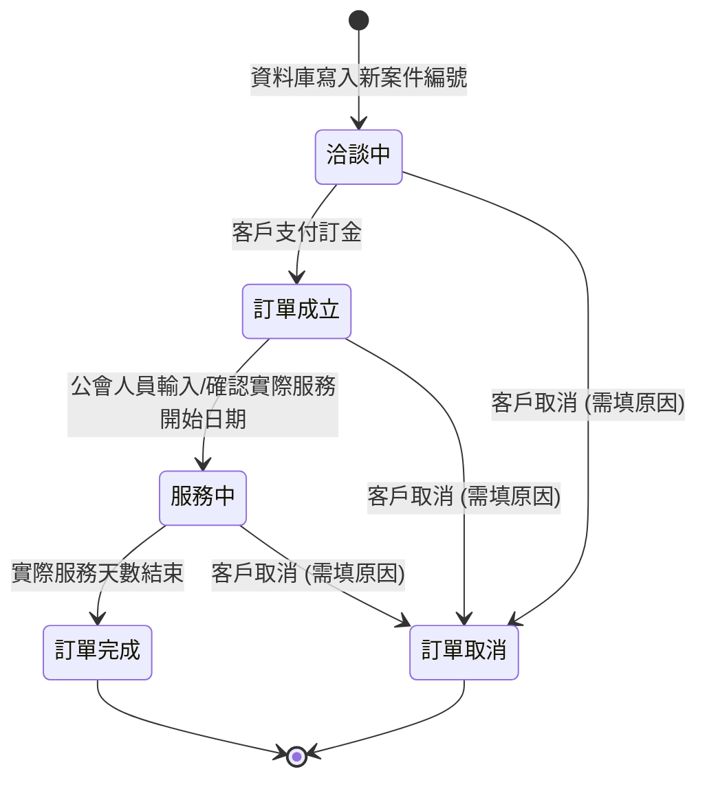

# 🪙 帳務與訂單業務規則定義 (SSOT)

本文件基於工會行政與財務系統需求，定義 **14 碼虛擬帳號編碼公式** 與 **訂單狀態生命週期狀態機**。未來在資料庫欄位設計、Data Pipeline、對帳核銷與 UI 開發時，必須嚴格遵守此規則。

---

## 1. 虛擬帳號編碼與綁定規則

虛擬帳號總長度為 **14 碼**，結構如下：

$$\text{虛擬帳號 (14碼)} = \text{997816 (前綴代碼 6碼)} + \text{分類代碼} + \text{流水號/帳號縮寫}$$

### 業務分類與後半部縮寫公式：

| 業務分類 | 分類代碼 | 後半部（後6碼）縮寫與計算公式 | 虛擬帳號完整範例 (共14碼) |
| :--- | :--- | :--- | :--- |
| **月子服務** | `99` | **案件編號縮寫**：`年度(3碼) + 流水號後3碼(3碼)` 例：案件編號 `115000001` $\rightarrow$ 縮寫為 `115001` | `997816` + `99` + `115001` $\rightarrow$ **`99781699115001`** |
| **托育課程** | - | `年度(3碼) + 班次(2碼) + 流水號(3碼)` | `997816` + `113` + `02` + `045` $\rightarrow$ **`99781611302045`** |
| **月子培訓** | `88` | `88 + 流水號(6碼)` | `997816` + `88` + `000123` $\rightarrow$ **`99781688000123`** |
| **會員年費** | `00` | `00 + 流水號(6碼)` | `997816` + `00` + `004567` $\rightarrow$ **`99781600004567`** |

### 資料庫 JOIN 對帳關聯邏輯：
1. **月子服務費對帳**：讀取 `合作社帳戶` 流水帳中的 14 碼虛擬帳號。
2. 過濾出前綴為 `997816` 且分類碼為 `99` 的帳號。
3. 提取最後 6 碼（如 `115001`），將其解碼/還原為系統主鍵的查詢序號（案件編號 `115000001`），進而 `JOIN` 關聯 `orders` / `clients` 進行財務核銷。

---

## 2. 訂單狀態生命週期狀態機 (Order State Machine)

所有媒合專案訂單的生命週期狀態，必須嚴格依照以下狀態轉移圖與規則變更。系統禁止不合規的跳躍變更。

### 狀態移轉說明與觸發點：

1. **`洽談中`** (預設初始狀態)
   * **觸發點**：當 Excel 名冊匯入，資料庫寫入全新的 **「查詢序號（案件編號）」** 時。
2. **`訂單成立`**
   * **觸發點**：對帳 Pipeline 偵測到該案件的虛擬帳號有收到**訂金帳款**，或管理員手動點擊確認收款。
3. **`服務中`**
   * **觸發點**：由於預產期不等於生產日，此狀態**只能由公會人員輸入「實際開始服務日期」時**，訂單狀態才從 `訂單成立` 轉為 `服務中`。
4. **`訂單完成`**
   * **觸發點**：當月嫂實際服務天數結束，系統或人員確認後轉為 `訂單完成`。
5. **`訂單取消`** (終止狀態)
   * **觸發點**：在 `洽談中`、`訂單成立` 或 `服務中` 階段，若客戶提出取消，行政專員可手動變更，**但系統強制要求必須輸入取消原因說明 (cancel_reason)**。

---

## 3. 主鍵識別碼重構規則 (PrimaryKey Refactoring Rules)

> [!IMPORTANT]
> **關於 `case_no` 欄位與 9 碼「查詢序號（案件編號）」的對齊政策：**
> 1. **主鍵欄位對齊**：為相容過往設計，現有資料庫（如 `clients`、`payments`）中的 `case_no` 欄位，實體儲存的內容已**全面強制寫入 9 碼的「查詢序號（案件編號）」**（例如：`115000001`）。
> 2. **棄用舊案號**：如 `HC115091` 格式的唯一案號在系統中**已不具備任何唯一識別與關聯意義，禁止繼續使用**。
> 3. **未來重構路線**：在下一階段大版本升級中，系統將統一發起資料庫 DDL 遷移，將所有 `case_no` 欄位重新命名為 `query_no` 或 `case_id`，以避免與舊業務邏輯混淆。程式設計時請做好相應的防護與抽象。
