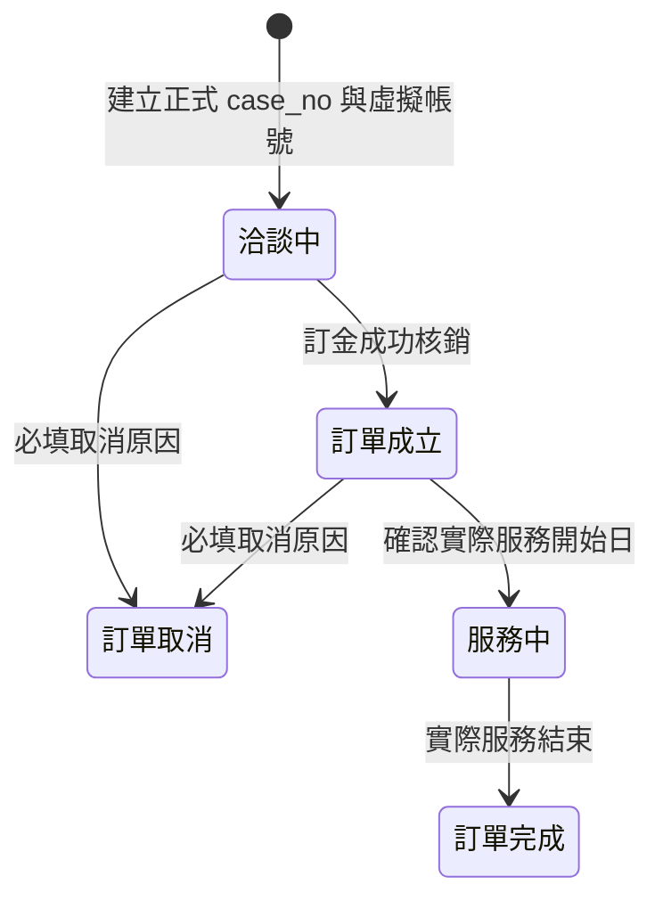

# 🪙 帳務與訂單業務規則定義（SSOT）

本文件定義月子服務的虛擬帳號、訂單狀態與新帳務模型。帳務關聯一律以 `case_no` 為準；不得以 `orders.id`、客戶姓名或月嫂姓名作為帳務主鍵。

---

## 1. 虛擬帳號編碼與綁定規則

月子服務虛擬帳號固定為 14 碼：

```text
997816 + 99 + 年度(3碼) + case_no 流水號後3碼
```

例：`case_no = 115000001`，縮寫為 `115001`，完整虛擬帳號為 `99781699115001`。

對帳時只接受前綴 `997816`、分類碼 `99` 的 14 碼帳號；將後 6 碼還原為 `case_no`，再關聯 `orders`、`clients` 與客戶帳務。課程、培訓、會員年費等其他分類碼必須略過，不得進入月子服務帳務。

---

## 2. 訂單狀態生命週期


```mermaid
stateDiagram-v2
    [*] --> 洽談中 : 建立正式 case_no 與虛擬帳號
    洽談中 --> 訂單成立 : 訂金成功核銷
    洽談中 --> 訂單取消 : 必填取消原因
    訂單成立 --> 服務中 : 確認實際服務開始日
    訂單成立 --> 訂單取消 : 必填取消原因
    服務中 --> 訂單完成 : 實際服務結束
```

客戶收款必須由銀行流水匯入後建立交易明細；不得直接修改帳務摘要金額。訂金成功核銷才可推進「洽談中 → 訂單成立」。

---

## 3. 帳務共同基礎與判斷公式

身分資格僅有一般市民、補助市民、非市民，作為業務資格與公式輸入；帳務程式不得依身分名稱分出互斥流程。帳務判斷以以下數值為準：

| 欄位／公式 | 定義 |
| --- | --- |
| `total_service_hours` | 實際或核定總服務時數 |
| `subsidy_hours` | 政府補助時數 |
| `client_payable_amount` | 客戶依合約應預付的總金額 |
| `staff_payable_amount` | 月嫂依服務指派應收的總薪資與已分配樓層費 |
| `subsidy_claim_amount` | 應向政府申請的補助金額 |
| `client_prepaid_subsidy_amount` | 客戶已預付、日後可能退還的補助段金額 |
| `requires_subsidy_claim` | `subsidy_hours > 0` |
| `subsidy_return_amount` | `client_prepaid_subsidy_amount`；僅保留欄位，現階段不執行退款 |

判斷規則：

1. `subsidy_hours = 0`：不申請補助、不產生退還補助金額。
2. `subsidy_hours > 0`：納入季度補助申請。
3. 補助市民全額補助時，客戶應付與客戶預付皆為 0；即使補助金額大於 0，也不得產生退還補助金額。
4. 只有客戶曾預付補助段時，`subsidy_return_amount` 才可能大於 0。這不是解約退款；解約退款必須使用獨立交易類型與流程。

---

## 4. 收款與核銷流程

1. 媒合簽約並取得正式 `case_no` 時，建立客戶帳務摘要並提供預先配置的虛擬帳號。
2. 客戶依訂金與合約期款匯至虛擬帳號；所有客戶應付金額須在月嫂結案發薪前完成預收。
3. 工會人員上傳新的銀行帳務明細；`file_watcher` 觸發匯入流程。
4. 匯入器以虛擬帳號解出 `case_no`，驗證案件存在、交易日期、金額、款項階段與外部交易識別。
5. 合法入款寫入 `client_payment_transactions`，再重算 `client_payments` 摘要。未知帳號、超收、重複交易或不符合案件狀態的入款必須列為待人工處理。

---

## 5. 月嫂一次發薪與待匯清單

月嫂每一服務指派只產生一筆應付摘要，並只進行一次正式發薪；不得再以補助段建立第二次月嫂發薪。

1. 客戶有應付金額的案件：結案後次月 15 日列入月嫂薪資待匯。
2. 客戶應付為 0 且由政府全額補助的案件：結案後次次月 15 日列入月嫂薪資待匯。
3. 每月約 5 日由人員下載當月 15 日待匯清單，列出月嫂、帳戶、`case_no`、服務指派、應匯金額與應匯日；5 日不是自動封存、建立月結或狀態轉移時點。
4. 系統不執行銀行匯款；產生清單、匯出檔或列入批次都不得標示為已付款。只有人工確認或匯入可辨識的實際支出明細後，才能寫入 `staff_payment_transactions`。

### 退還補助金額（暫不啟用）

系統保留以下欄位與未來交易能力，但目前不產生退款 UI、每月待匯清單或實際退款交易：

- `subsidy_return_amount`：退還補助金額
- `subsidy_returned_amount`：已退還補助金額
- `subsidy_return_due_date`：退還補助日期
- `subsidy_returned_at`：實際退還日期

未來啟用時，僅能處理「客戶預付補助段後退還」；不得與解約退款共用欄位或交易類型。

---

## 6. 季度補助申請與年度總覽

補助案件以 `actual_end_date`（無值時才使用 `end_date`）歸屬完工季度：

| 完工季度 | 申請月份 |
| --- | --- |
| Q1（01-01～03-31） | 4 月 |
| Q2（04-01～06-30） | 7 月 |
| Q3（07-01～09-30） | 10 月 |
| Q4（10-01～12-31） | 次年 1 月 |

每季清單只納入 `subsidy_hours > 0`、已完工且尚未列入同一申請批次的案件。年度補助總覽以完工年度統計案件與金額，至少區分：應申請、已送件、已核准、已撥款。

---

## 7. 最新金額、日期與歷史資料規則（優先於前文）

1. 核銷補助時數依資格與總服務時數計算：一般市民為 `min(40, total_service_hours)`；補助市民為 `min(120, total_service_hours)`；非市民為 0。
2. 補助申請總額為各月嫂實際服務時數比例分配後的「補助時數 × 該月嫂服務單價」合計；核銷清冊顯示案件合計。
3. 客戶三期帳務均保存應收金額、實收金額、應收日期、實收日期。訂金天數與訂金應收日期採訂單表單；第一期天數為 `min(15, max(0, 請款總日數 - 訂金天數))`，應收日期為服務開始日；第二期天數為剩餘日數，應收日期在第一期首次全額實收後才設定為「第一期實收日 + 15 天」。第二期天數為 0 時日期保持空值，畫面顯示 0。
4. 訂金、第一期、第二期的實收與實收日期只能由成功銀行交易重算。訂金首次全額核銷後，系統自動將案件由「洽談中」改為「訂單成立」。
5. 歷史資料可在單筆訂單頁人工建立或調整應收金額與排程快照，並保留調整原因與操作者；不得直接手改交易彙總的實收金額或實收日期。
6. 舊財務匯入建立客戶帳務時，應收總額與三期拆分必須由服務總天數、每日時數、身分單價、訂金天數與樓層費公式計算；不得使用舊 `v_order_details` 或固定金額。
7. 退還補助金額功能目前停用：不得建立退款交易、退款待匯清單或退款 UI。既有保留欄位不代表已啟用流程。

---

## 8. 付款狀態、取消訂單與一般客戶退款（已確認，待架構核准）

### 8.1 Canonical 狀態分離

付款相關狀態必須分成不同概念，不得再以單一 `payment_status` 同時表示付款進度、請款階段、人工審核與訂單流程：

| 狀態 | 合法值 | 定義 |
| --- | --- | --- |
| `payment_progress` | `unpaid`、`partially_paid`、`paid` | 依有效客戶收款與應收總額計算的付款進度 |
| `payment_stage` | `deposit`、`first_payment`、`second_payment`、`completed`、`NULL` | 下一個應收階段；取消訂單時必須為 `NULL` |
| `review_status` | `normal`、`review_required` | 是否需要人工帳務審核 |
| `workflow_status` | `active`、`cancelled` | 訂單帳務流程是否仍有效 |
| `refund_status` | `not_required`、`pending`、`partially_refunded`、`refunded`、`review_required` | 一般客戶解約退款義務的處理進度 |

有效收款可一次跨越多個應收階段，`payment_stage` 應依累計有效收款自動向前推進。取消訂單後不得依退款結果將 `payment_stage` 倒退至先前階段。

### 8.2 取消與一般客戶退款

1. 必須先成功取消訂單，才允許建立一般客戶退款；退款不得反向觸發或推測訂單取消。
2. 訂單取消後，`workflow_status = cancelled`、`payment_stage = NULL`，並停止後續催款及付款階段推進。
3. 取消前最後付款階段只由事件歷史查詢，不複製至目前狀態欄位。
4. 取消時有效客戶收款為 0，`refund_status = not_required`，且不建立退款單。
5. 取消時有效客戶收款大於 0，系統自動建立待退款義務並設定 `refund_status = pending`；不得自動執行銀行退款。
6. `refundable_amount = 有效客戶收款 - 已退款有效金額`。退款交易、失敗、退匯與沖銷必須保留完整事件歷史。
7. 一般客戶解約退款與「退還客戶預付補助款」是不同帳務領域，不得共用狀態、退款義務、交易類型或待辦清單；兩者只能透過 `case_no` 關聯。

### 8.3 待退款義務的 UI 顯示位置

一般客戶待退款義務必須同時出現在以下位置：

1. **全域財務待辦／警示中心**：顯示待退款案件數與待退款總額；可依逾期、`review_required` 及退款失敗篩選。
2. **一般客戶退款待辦清單**：作為確認退款帳戶、建立退款批次、記錄實際退款及處理失敗／退匯的主要操作入口；不得與退補助款待匯清單混合。
3. **單筆訂單的財務頁**：訂單取消後顯示退款摘要卡，至少包含原收款、已退款、待退款、`refund_status`、取消原因及事件歷史入口。

訂單列表可顯示「待退款」提示標籤供導流，但不得作為唯一顯示位置。`refund_status = not_required` 的案件不進入一般客戶退款待辦清單。

---

## 9. 整數金額、雙端守恆與精確核銷（已確認）

1. 所有應收、應付、退款、補收、補付及正式銀行交易均以新台幣整數元保存與計算；現有 `DECIMAL(..., 2)` 欄位可暫時保留相容，但新流程不得產生小數義務。
2. 比例計算使用確定性的 `ROUND_HALF_UP` 先得到全案整數金額，再以最大餘數法分配至 assignments；餘數相同時依固定 assignment 順序分配。尾差只改變歸屬，不得創造或消滅金額。
3. 客戶端與月嫂端是獨立帳務義務，不要求兩端總額彼此相等；但每一端正式核銷完成後，各自的有效義務減有效收付款淨額都必須精確為 `0`。
4. 任一端未打平只能留在匯入、異常或待處理層，不得建立部分正式核銷、不得標示完成，也不得人工直接修改衍生差額或狀態把資料「修成 0」。
5. 已發生的收款、付款、退款、退匯、adjustment、reversal 與 allocation 都是不可變事件；更正只能追加反向或補充事件。

## 10. 服務中途取消的帳務與排班交易（已確認）

### 10.1 實際服務根事實確認

本章只適用於全部約定服務完成前的中途取消。若有效正式服務日已完整履行合約服務量，系統不得再接受取消訂單命令；即使客戶尚未結清、服務資料鎖尚未成立也相同。此時訂單維持完成，月嫂薪資、樓層費與服務結算均按未取消時的完整履約結果計算，不得套用本章的按日縮減公式。後續爭議只能修正可證明有誤的服務根事實，或另走帳務 adjustment／refund／reversal，不得以取消名義減少月嫂既得應付。

服務已開始的訂單由人員按取消時，UI 必須先開啟逐日「實際服務日期＋實際服務月嫂」確認畫面：

- 既有日期依有效 assignment 預填月嫂。
- 新增日期必須指定實際服務月嫂。
- 日期未變只需確認；增刪或改派時必填更正原因。
- UI 不得輸入 `actual_hours`、客戶應收、月嫂薪資或樓層費分配結果。

Apply 必須在單一交易內追加服務日更正事件、取消並重建受影響 assignments、取消未來服務與 buffer locks、重算客戶應收／退款／補收、重算月嫂應付，最後寫入取消事件與訂單／帳務取消投影。任一步失敗整筆回滾。

### 10.2 樓層費按實際服務日縮減與分配

```text
取消後有效樓層費
= ROUND_HALF_UP(原合約樓層費 × 全案實際服務天數 ÷ 原合約服務天數)

各 assignment 樓層費
= 按該 assignment 實際服務天數占全案實際服務天數比例分配取消後有效樓層費
```

各 assignment 只保存整數元；除不盡的尾差依第 9 節最大餘數規則分配。客戶端已認列樓層費與所有有效 assignments 的樓層費分配合計必須完全相等。

例：原合約 20 天、樓層費 3,000 元，服務 5 天後取消，取消後有效樓層費為 750 元；月嫂 A 服務 3 天、B 服務 2 天時，A 分配 450 元、B 分配 300 元。

### 10.3 已發生帳務與應付日期

- 中途取消後依已確認實際服務日重新結算：有效實收大於新應收時建立退款義務；小於新應收時建立差額應收；相等時結清。
- 月嫂薪資只從有效 assignment 的正式服務日、訂單每日服務時數、費率、雙倍薪事實、樓層費與有效調整計算，不得 fallback 到 `planned_hours` 或 `orders.staff_id`。
- 取消或服務日更正後的月嫂應付款沿用原訂單既定應付日，不因取消改到下一個 15 日。
- 若重算時原應付日已過、付款資料在非正常時點才形成，或發生其他非正常時序，一律由異常中心交人員處理；系統不自動改期或新增另一套一般流程。

## 11. 月嫂應付款清單與 Excel 留存（已確認）

### 11.1 不建立月結狀態機

- 維持現行應付款清單／匯出機制，不建立人工「月結」、draft、finalized、按鈕定稿或「即時計算月結文件」Domain。
- `staff_payments` 是逐 assignment 的應付投影；顯示與匯出時依目標付款日期查詢，並按 `staff_id` 合併同一月嫂同月多訂單。
- 現有 `staff_monthly_settlements`、`staff_monthly_settlement_details` 及 production callers 在相容遷移完成前不得直接刪除；新架構不得再形成新的依賴。

### 11.2 應付與已完成

```text
有效實付淨額不足 → 應付
有效實付淨額精確等於完整義務 → 已完成
退匯／沖正使淨額再次不足 → 重新成為應付
```

- 交給會計的 Excel 只列「應付」；歷史 UI 可以顯示「已完成」。
- 下載 Excel 不改變狀態。只有正式銀行流水精確核銷後，明細才由應付轉為已完成。
- 不足額、超付、部分付款或金額不符不匯出「剩餘差額」作為正常付款；一律進異常處理。
- 月嫂缺少有效主要銀行帳戶等資料完整性問題，應由異常中心在付款義務形成前提早顯示並要求補正；匯出層只保留 fail-closed 一致性檢查，不另設略過／人工選擇分支。

### 11.3 每次下載保存同一份 XLSX

1. 每次下載依當下有效應付款資料產生一次 XLSX bytes。
2. 後端先將完全相同的 bytes 原子保存至 `downloads/accounts_payable_archive/YYYY/`，再回傳給使用者；資料夾不再細分月份。
3. 檔名包含目標付款日、實際產生日期時間與短雜湊，例如 `應付款_付款日2026-08-15_產生於2026-08-04_153012_a1b2c3.xlsx`。
4. 永不覆蓋同名檔案；保存失敗時不得提供下載。
5. 4 日與 5 日等不同時間下載的版本都保留，各自反映當時資料。
6. XLSX 本身就是當次輸出快照，不另建完整明細快照表或下載版本狀態機；`downloads/` 必須排除於 Git。
