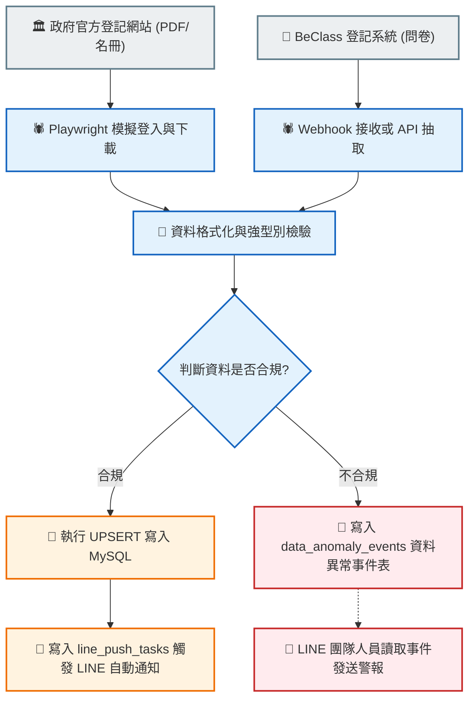

# Data Pipeline 細部設計規格書

本文件基於 [[自動化系統設計規格書(綜覽)]] 的規劃，針對 **Data Pipeline** 的資料爬取、資料清洗與檢驗、髒資料隔離機制、去重 UPSERT 邏輯以及排程日誌進行詳細定義。

本文件旨在為專案分工提供明確對接規格：**資料庫與 Data Pipeline 人員僅負責檢驗資料並寫入異常事件，具體的 LINE 警報推播由 LINE 客服開發人員讀取該事件表進行實作。**

---

## 1. 系統架構與資料流 (Data Pipeline 範疇)

Data Pipeline 的 ETL（抽取、轉換、寫入）流程與異常事件隔離機制如下：



---

## 2. 資料源爬取機制 (Extract)

### 2.1 政府表單系統
*   **工具技術**：使用 Python `Playwright` 進行模擬登入。
*   **爬取路徑**：
    *   登入地址：`https://hsinchu-nanny.hccg.gov.tw/admin/login`
    *   定期下載最新申報名冊（格式主要為 Excel 或 PDF）。
*   **欄位提取目標**：提取「項次、身分資格、服務開始日期、地址、客戶姓名、電話」等欄位。

### 2.2 BeClass 登記系統
*   **工具技術**：使用 Python `requests` 呼叫 BeClass API，或架設端點接收 BeClass 欄位 Webhook。
*   **爬取路徑**：
    *   BeClass 帳戶地址：`https://www.beclass.com/default.php?name=Your_Account`
*   **欄位提取目標**：提取「查詢序號(case_no)、飲食習慣、餐點烹煮工具、特殊計費、週報需求與客戶聯絡資料」。

---

## 3. 資料檢驗與隔離機制 (Transform)

為了防範客戶在前端表單（如 BeClass 或政府網站）輸入錯誤資料（例如電話號碼少一碼、身分證格式錯誤）導致系統崩潰，Data Pipeline 必須實作嚴格的**檢驗與隔離機制**。

### 3.1 欄位檢驗規則
資料寫入 MySQL 前，需經過以下強型別與正則表達式（Regex）驗證：

| 欄位名稱 | 檢驗規則 (Regex / Constraint) | 錯誤警報類型 |
| :--- | :--- | :--- |
| **行動電話 (phone)** | 必須為 10 位純數字，且以 `09` 開頭 (Regex: `^09\d{8}$`) | `PHONE_FORMAT_ERROR` |
| **身分證字號 (identity_card)**| 必須符合台灣身分證字號編碼邏輯 (首碼英文字母 + 9位數字 + 校驗碼) | `ID_FORMAT_ERROR` |
| **Email (email)** | 必須符合標準 Email 格式 (Regex: `^[a-zA-Z0-9._%+-]+@[a-zA-Z0-9.-]+\.[a-zA-Z]{2,}$`) | `EMAIL_FORMAT_ERROR` |
| **服務起訖日期 (date)** | 必須為標準日期格式 `YYYY-MM-DD` 且開始日期早於結束日期 | `DATE_FORMAT_ERROR` |

### 3.2 隔離區：資料異常事件表 (`data_anomaly_events`)
當資料檢驗失敗時，Data Pipeline **不中斷執行**，而是將錯誤資料隔離，並寫入此異常事件表。此表為**與 LINE 客服開發人員的分工對接介面**。

```sql
CREATE TABLE IF NOT EXISTS data_anomaly_events (
    id INT AUTO_INCREMENT PRIMARY KEY,
    order_no VARCHAR(50) NULL COMMENT '關聯之訂單編號或查詢序號',
    source_platform VARCHAR(50) NOT NULL COMMENT '來源平台 (government/beclass)',
    anomaly_type VARCHAR(50) NOT NULL COMMENT '異常類型 (如 PHONE_FORMAT_ERROR 等)',
    invalid_data JSON NOT NULL COMMENT '包含錯誤欄位與值的 JSON 數據 (例如 {"phone": "0912345"})',
    raw_payload JSON NOT NULL COMMENT '該筆案件的完整原始 JSON 資料，方便人工核對或重新解析',
    
    -- 狀態流轉欄位 (供 LINE 模組對接)
    process_status VARCHAR(20) DEFAULT 'pending' COMMENT '處理狀態 (pending:待發送警報/sent:警報已發送/resolved:行政已修正)',
    created_at TIMESTAMP DEFAULT CURRENT_TIMESTAMP,
    updated_at TIMESTAMP DEFAULT CURRENT_TIMESTAMP ON UPDATE CURRENT_TIMESTAMP,
    
    INDEX idx_status (process_status),
    INDEX idx_anomaly_type (anomaly_type)
) ENGINE=InnoDB DEFAULT CHARSET=utf8mb4 COLLATE=utf8mb4_unicode_ci;
```

*   **分工連動機制**：
    1.  **資料庫/Pipeline人員**：發現資料異常時，將錯誤資訊寫入本表，狀態設為 `pending`。
    2.  **LINE 客服人員**：定時輪詢或監聽此表。發現有 `pending` 的事件時，讀取錯誤資料並**負責實作 LINE 推播**（例如通知行政管理員有人填錯資料，或推播給填錯的用戶請其補件），發送後將狀態改為 `sent`。
    3.  **管理後台 (Streamlit)**：行政專員在 Streamlit 後台手動更正髒資料後，系統將狀態改為 `resolved`，並將更新後的乾淨資料同步回 `clients` 或 `beclass_records`。

---

## 4. 核心去重與寫入邏輯 (Load)

為防止重複爬取或接收 BeClass 資料導致資料庫髒亂，系統必須以 **唯一識別碼** 進行 `UPSERT` 寫入。

### 4.1 唯一識別碼定義
*   **政府登記資料**：以 `case_no` (查詢序號/案件編號) 為唯一主鍵。
*   **BeClass 登記資料**：以 `query_no` (查詢序號) 或 `order_no` (訂單編號) 為唯一主鍵。

### 4.2 UPSERT 判定邏輯
1.  **步驟一**：讀取一筆新爬取/接收的資料，提取其唯一識別碼。
2.  **步驟二**：檢索 MySQL 資料庫中是否已存在該識別碼。
3.  **步驟三**：
    *   **不存在 (INSERT)**：執行 `INSERT INTO` 寫入全新資料。
    *   **已存在但內容變更 (UPDATE)**：執行 `UPDATE` 更新資料庫對應欄位，保留原有歷史備註。
    *   **已存在且內容無變更 (SKIP)**：跳過此筆，避免無效寫入，降低資料庫 I/O 負擔。

---

## 5. 與 LINE 流程的連動觸發點 (對外接口)

當 Data Pipeline 成功執行並寫入一筆合規的新訂單後，需要通知 LINE 模組發送 `[提醒登記與契約]` 固定訊息。我們透過**「待推播任務表」**進行非同步解耦：

```sql
CREATE TABLE IF NOT EXISTS line_push_tasks (
    id INT AUTO_INCREMENT PRIMARY KEY,
    order_no VARCHAR(50) NOT NULL COMMENT '關聯之訂單編號',
    task_type VARCHAR(50) NOT NULL DEFAULT 'REMIND_REGISTRATION' COMMENT '推播任務類型',
    push_status VARCHAR(20) DEFAULT 'pending' COMMENT '推播狀態 (pending:待發送/sent:已發送/failed:發送失敗)',
    created_at TIMESTAMP DEFAULT CURRENT_TIMESTAMP,
    updated_at TIMESTAMP DEFAULT CURRENT_TIMESTAMP ON UPDATE CURRENT_TIMESTAMP,
    
    INDEX idx_push_status (push_status)
) ENGINE=InnoDB DEFAULT CHARSET=utf8mb4 COLLATE=utf8mb4_unicode_ci;
```

*   **分工連動機制**：
    *   **資料庫人員**：當 Data Pipeline 寫入新訂單成功，自動在此表插入一筆 `REMIND_REGISTRATION` 的 `pending` 任務。
    *   **LINE 客服人員**：LINE Webhook/FastAPI 服務會監聽此表，讀取 `pending` 的推播任務，向客戶發送對應的 LINE 訊息，完成後更新狀態為 `sent`。

---

## 6. 排程與日誌記錄規格

### 6.1 自動化排程
*   **執行頻率**：
    *   政府網站爬蟲：設定 Cron Job **每日凌晨 03:00** 執行。
    *   BeClass 同步：設定 Cron Job **每 30 分鐘** 執行一次，或採 Webhook 即時觸發。

### 6.2 爬蟲日誌表 (`crawler_logs`)
每次 Pipeline 執行完畢，無論成功或失敗，必須在 `crawler_logs` 表寫入日誌，以便於行政管理員在 Streamlit 後台進行稽核與系統除錯。

```sql
CREATE TABLE IF NOT EXISTS crawler_logs (
    id INT AUTO_INCREMENT PRIMARY KEY,
    crawled_at TIMESTAMP DEFAULT CURRENT_TIMESTAMP,
    status VARCHAR(50) NOT NULL COMMENT '執行狀態 (SUCCESS/FAILED)',
    records_inserted INT DEFAULT 0 COMMENT '本次新增筆數',
    records_updated INT DEFAULT 0 COMMENT '本次更新筆數',
    records_quarantined INT DEFAULT 0 COMMENT '本次被隔離(髒資料)筆數',
    error_message TEXT NULL COMMENT '當狀態為 FAILED 時，儲存完整的 Python Exception Traceback',
    
    INDEX idx_status (status)
) ENGINE=InnoDB DEFAULT CHARSET=utf8mb4 COLLATE=utf8mb4_unicode_ci;
```
