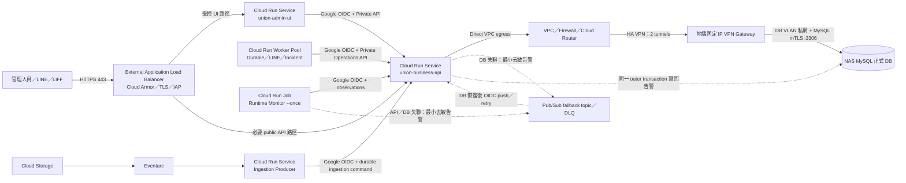

# Cloud Run Direct VPC＋HA VPN 雙 Tunnel 雲端部署規劃

- 文件性質：部署規劃／計畫，不是已部署證據或 production cutover 授權
- 規劃版本：v1
- 更新日期：2026-08-15
- 目標區域：Google Cloud `asia-east1`（台灣）
- 核心原則：MySQL 僅存在地端 NAS，只有 Business API 可取得 DB credential 並連線；所有 Worker、Monitor、UI 與 ingestion producer 都只能經 authenticated API 間接操作 DB。

## 一、摘要：規劃／計畫大綱

### 1.1 最終結論：採 5+1 runtime

本案採用 **5 個 Cloud Run runtime resource + 1 個地端 NAS MySQL**：

| 編號 | Runtime | Cloud Run 型態 | 常駐策略 | 職責 |
|---|---|---|---|---|
| 1 | `union-business-api` | Service | `min=1` | 唯一 DB connection owner；business API、LINE webhook、Private Operations API、readiness |
| 2 | `union-admin-ui` | Service | `min=0` | Streamlit 薄 UI，只呼叫 API |
| 3 | `union-runtime-workers` | Worker Pool | `instances=1` | 合併 Durable Job、LINE、Incident 三個 worker；不持有 DB credential |
| 4 | `union-runtime-monitor` | Job | 每 5 分鐘一次 | 以 `--once` 探測 API、UI、public edge、LIFF，再經 Private Operations API 回報 |
| 5 | `union-ingestion-producer` | Service | `min=0` | 接 Cloud Storage／Eventarc 事件，只建立 durable ingestion job，不直接入帳 |
| +1 | `nas-mysql-prod` | 地端 NAS | 地端常駐 | 正式 MySQL；只接受 API 經 VPN、mTLS 的私網連線 |

這是目前安全、穩定與費用的平衡點：

- 三個 worker 已具有相同的安全邊界：都不持有 MySQL credential，只以 Google-signed OIDC 呼叫 Private Operations API。因此合併成一個 Worker Pool，可少付兩個 24 小時常駐 runtime 的費用。
- Monitor 不與 workers 合併。若同一個 runtime、image process supervisor 或 service account 故障，監控也會同時消失；改成獨立排程 Job，最多約 5 分鐘發現異常，而且只在執行期間計費。
- UI 不與 API 合併。UI 是人員登入入口，API 是唯一 DB owner；拆開可使 UI `min=0`、獨立套用 IAP，且 UI 漏洞或流量尖峰不會直接擴大到 DB credential 邊界。合併只會少一個幾乎可縮到零的 Service，實際節省很小，安全代價較大。
- ingestion producer 不與 API 合併。上傳檔案與事件屬不可信輸入，獨立 runtime 不配置 DB secret；即使解析流程被攻擊，也只能呼叫受限 API operation。
- 不再拆成 7+1。現階段再把 Durable、LINE、Incident workers 分開，會增加常駐成本、image／IAM／告警維護量；在三者都無 DB credential、量體尚低時，收益不足。
- 不縮成「所有 worker 一個、其他全部一個」的 2+1。這會讓 public webhook、管理 UI、DB owner、檔案入口和監控共用故障域、權限與擴縮單位，不符合最小權限與獨立監督原則。

當任一 worker 的 CPU、queue lag、故障率或 release cadence 明顯不同，或需要不同 service account 才能限制跨 worker impersonation 時，再把該 worker 從 `union-runtime-workers` 拆出；這是未來擴充條件，不是 v1 預設成本。

### 1.2 正常與 DB 異常流程



實線是正常流程；虛線只在 API／地端 DB 異常時啟用。Pub/Sub 僅保存告警 envelope、correlation ID、錯誤類型、時間與重試資訊，不保存完整個資、銀行資料、webhook secret 或原始業務 payload。Push subscription 只有在 API 完成 DB transaction 後才回覆成功；DB 尚未恢復時回覆 retryable failure，由 Pub/Sub 保留並重送。超過重送上限進 DLQ，恢復時仍由 Incident worker 經 API replay，絕不直接連 DB。

此 fallback 目前屬部署前待完成能力：現行 Work Package 87 已明確把「DB outage Pub/Sub backup」列為後續工作。正式上線前必須另有已核准實作、idempotency key、retention、DLQ replay、去敏與 focused tests；未完成時不得宣稱具備告警回寫備援。

### 1.3 網路與資安結論

1. **NAS 的 3306 不公開。** NAS 不做 port forwarding，也不設定 `0.0.0.0/0` 或 Cloud Run 公網 IP allowlist。Cloud Run 執行個體沒有固定來源 IP並不影響此設計；API 透過 Direct VPC egress、VPC route、HA VPN 到 NAS 私有 DB VLAN。
2. **只讓 API 到 DB。** 只有 `union-business-api` 掛載 DB password、client certificate 與 private key；VPC revision network tag 使用 `cr-api-db-client`。雲端 firewall 與地端 firewall 都只允許該 API subnet／tag 對 NAS DB 私有 IP 的 TCP 3306；Worker、Monitor、UI、ingestion 不配置 DB secret。
3. **使用 HA VPN，不使用公開 3306。** `asia-east1` 建立一個 HA VPN gateway、兩條 IPsec tunnel 與 Cloud Router/BGP；地端使用固定公網 IP VPN gateway。兩條 tunnel 都正常且 peer 也符合拓樸時，才可主張 HA。若地端只有單一 ISP／單一 gateway，通道仍加密，但地端仍是單點故障，不能宣稱端到端 99.99%。
4. **MySQL 再加 mTLS。** VPN 提供網路層加密與私網路由；MySQL server 驗證 API client certificate，API 驗證 NAS server CA／hostname，並使用只具 application schema 必要權限的獨立 MySQL user。VPN 或 firewall 任一層被誤設時，mTLS 仍提供第二道身分驗證。
5. **Cloud NAT v1 不需要。** API 使用 `private-ranges-only`：NAS 私有 IP 經 VPC／VPN，LINE 等公網 HTTPS 走 Cloud Run 預設 egress。其他 runtime 呼叫內部 API 時，使用 Direct VPC egress、Private Google Access 與 private DNS，將 `run.app` 解析到 `private.googleapis.com`／`restricted.googleapis.com` VIP；一般公網 probe 仍走預設 egress。因此不需為固定出口 IP 支付 Cloud NAT。只有未來第三方明確要求固定 outbound IP，或資安政策要求所有公網 egress 經集中防火牆時，才新增 `all-traffic + Cloud NAT`。
6. **Cloud Run ingress 分層。** API 與 UI 使用 `internal-and-cloud-load-balancing`；外部只能經 External Application Load Balancer。API 的 default `run.app` URL 保留給同 VPC 的 service-to-service 呼叫，但外部網路會被 ingress 擋下。Load Balancer URL map 只公開 LINE webhook、LIFF callback、必要 public read 與最小 `/health`；Private Operations、debug、Data Browser、管理 mutation 不建立 public route。
7. **管理登入使用 Google 金鑰。** `union-admin-ui` 啟用 IAP，只授權 Google Group／Workspace 帳號；組織層強制 2-Step Verification，管理員採 passkey 或 FIDO2 hardware security key。IAP 是第一層 Google 身分，應用程式既有帳密／session 是第二層業務授權；兩者不能互相取代。高風險管理員建議加入 Google Advanced Protection 並準備一把離線備用安全金鑰。
8. **Public edge 防護。** 使用 Google-managed TLS certificate、Cloud Armor Standard、預設 deny／allow 規則、rate limit、常見 WAF 規則、request size／timeout 限制；LINE webhook 仍必須在應用層驗證 LINE signature。禁止 production ngrok。
9. **service-to-service 不用 shared key。** production 設定 `INTERNAL_SERVICE_AUTH_MODE=google_oidc`，精確驗證 issuer、audience、service account allowlist；`INTERNAL_SERVICE_SHARED_KEY` 不得配置為 production fallback。每個 runtime 使用獨立 service account，只有 worker pool 因三個 worker 合併而共用一個 runtime principal。
10. **Nginx 與 Tailscale 都不部署。** External Application Load Balancer 已負責 TLS／routing，Cloud Armor／IAP 負責 edge control；HA VPN 負責雲地私網。再加 Nginx 或 Tailscale 只會增加 patch、secret 與旁路風險，沒有必要。

Google 官方文件依據：Direct VPC egress 無 connector VM 固定費、可套 network tag，且為建議方案；Cloud Run `internal-and-cloud-load-balancing` 可阻擋直接公網 `run.app` 並強制外部流量經 Load Balancer；Cloud Run 間的 internal 呼叫可透過 Direct VPC、Private Google Access 與 private DNS 進入同一 VPC。參考 [Direct VPC egress 比較](https://docs.cloud.google.com/run/docs/configuring/connecting-vpc)、[Cloud Run private networking](https://docs.cloud.google.com/run/docs/securing/private-networking)、[Cloud Run ingress](https://docs.cloud.google.com/run/docs/securing/ingress)、[Cloud Run IAP](https://docs.cloud.google.com/run/docs/securing/identity-aware-proxy-cloud-run)。Google 帳號可用 passkey／FIDO2 security key，參考 [Google Advanced Protection](https://support.google.com/accounts/answer/7539956) 與 [安全金鑰 2-Step Verification](https://support.google.com/accounts/answer/6103523)。

### 1.4 預估月費

**v1 低流量正式環境預估：每月 USD 150～170，約 NT$4,950～5,610；建議先設 NT$6,000／月預算告警。**

估算匯率固定用 `USD 1 = NT$33` 作規劃，不代表 Google 實際帳單匯率；以每月 730 小時、每月不超過 200 萬 HTTP requests、Load Balancer 處理 10 GiB、VPN outbound 10 GiB、Cloud Storage 10 GiB、Artifact Registry 5 GiB、Cloud Logging ingestion 50 GiB 以下估算。未含稅、網域註冊、地端固定 IP／ISP、VPN gateway、NAS、UPS、NAS 硬碟與人工維運費。

| 細項 | 數量與計算基準 | 預估 USD／月 | 說明 |
|---|---:|---:|---|
| HA VPN tunnel | 2 × 730 小時 × USD 0.05 | 73.00 | 固定成本最大項；兩條 tunnel 保留 HA，資料傳輸另計 |
| External Application Load Balancer | 1 forwarding rule × 730 小時 × USD 0.025 + 10 GiB × USD 0.008 | 18.33 | Serverless NEG backend 的 Cloud Run compute 另計 |
| Cloud Armor Standard | 1 policy + 約 5 rules + 100 萬 requests | 10.75 | 約 USD 5／policy、USD 1／rule、USD 0.75／百萬 request |
| `union-business-api` | 1 vCPU／1 GiB、request-based、`min=1` | 13～20 | 完全 idle 的 min instance 約 USD 13.14；實際請求另增 active time |
| `union-admin-ui` | 1 vCPU／512 MiB、`min=0` | 0～2 | 低流量大多落在 Cloud Run free tier；冷啟動可接受 |
| `union-runtime-workers` | 1 vCPU／512 MiB Worker Pool、1 instance、730 小時 | 26～31 | 三 worker 共用；free tier 尚未被其他專案消耗時接近低值 |
| `union-runtime-monitor` | 1 vCPU／512 MiB Job、每 5 分鐘、每次最低計費 60 秒 | 0～5 | Job free tier 未被其他專案消耗時可接近 0；保守上限約 5 |
| `union-ingestion-producer` | 1 vCPU／512 MiB、`min=0` | 0～2 | 只在 Cloud Storage event 到達時執行 |
| Cloud Scheduler | 1 job | 0.00 | 每 billing account 前 3 個 job 免費 |
| Pub/Sub fallback + DLQ | 2 topics／2 subscriptions，低於 10 GiB throughput | 0～1 | 第一個 10 GiB／月 throughput 免費；長期 backlog storage 可能計費 |
| Cloud Storage | 2 buckets、合計 10 GiB Standard | 0.22～1 | `asia-east1` Standard 約 USD 0.022／GiB-month，另有少量 operations |
| Secret Manager | 約 10 個 active versions | 約 0.24 | 每 billing account 前 6 個 active versions 與前 10,000 次 access 免費 |
| Artifact Registry | 1 repo、4 images、合計 5 GiB | 約 0.45 | 前 0.5 GiB 免費，超過約 USD 0.10／GiB-month |
| Cloud Logging／Monitoring | logging ingestion 不超過 50 GiB | 0～2 | 先設 log exclusion、30 天 retention 與告警，避免敏感 payload／費用失控 |
| Cloud DNS | 1 managed zone | 約 0.20 | queries 量低時近似固定小額 |
| VPN／Internet data transfer | 假設 outbound 10 GiB | 1～3 | 依實際方向、目的地與 Cloud SKU 計費 |
| Direct VPC egress | 1 VPC／1 subnet | 0 固定費 | 只付實際 network traffic，沒有 connector VM 固定費 |
| Cloud NAT | 0 | 0.00 | v1 不建立 |
| Cloud SQL | 0 | 0.00 | 本方案只備援告警訊息，不建立第二套正式 DB |
| **合計** | 低流量、無 CUD | **約 150～170** | 約 **NT$4,950～5,610** |

估算採 Google 公開按量價格，實際 free tier 會在 billing account 各 project 間共享，不能把免費額度當 SLA 或固定折扣。主要依據：[Cloud Run pricing](https://cloud.google.com/run/pricing)、[Cloud VPN pricing](https://cloud.google.com/network-connectivity/pricing)、[Load Balancing pricing](https://cloud.google.com/load-balancing/pricing)、[Cloud Armor pricing](https://cloud.google.com/armor/pricing)、[Cloud Scheduler pricing](https://cloud.google.com/scheduler/pricing)、[Pub/Sub pricing](https://cloud.google.com/pubsub/pricing)、[Secret Manager pricing](https://cloud.google.com/secret-manager/pricing)、[Artifact Registry pricing](https://cloud.google.com/artifact-registry/pricing)、[Cloud Storage pricing](https://cloud.google.com/storage/pricing)、[Cloud Logging pricing](https://cloud.google.com/logging)。

若只使用單一 VPN tunnel，可約省 USD 36.50／月，但會失去 tunnel redundancy，不採用。若 v1 實測後 UI 冷啟動不可接受，可把 UI 改為 `min=1`，預估再增加約 USD 10～15／月。第一個月先不買 committed use discount；蒐集 30 天 billable instance time 後，再只對確定長期常駐的 Worker Pool 評估承諾折扣。

## 二、所需 Cloud 服務項目與數量

### 2.1 Cloud Run 與 container artifacts

| 項目 | 數量 | 規劃 |
|---|---:|---|
| Cloud Run Service | 3 | Business API、Admin UI、Ingestion Producer |
| Cloud Run Worker Pool | 1 | Durable／LINE／Incident workers 合併 |
| Cloud Run Job | 1 | Runtime Monitor `--once` |
| Artifact Registry repository | 1 | `asia-east1`、Docker format、immutable digest deploy |
| Container images | 4 | `union-api`、`union-ui`、`union-runtime-ops`、`union-ingestion` |

`union-runtime-ops` image 可同時供 Worker Pool 與 Monitor Job 使用，以不同 command／args 啟動；兩者仍是不同 Cloud Run resource、service account、env 與 release gate。API、UI、ingestion 不共用 image，避免把 DB driver／API code、UI dependencies 與不可信檔案處理器放進同一攻擊面。所有 image 必須 pin digest，禁止 production 使用 mutable `latest`。

### 2.2 網路、edge 與地端連線

| 項目 | 數量 | 規劃 |
|---|---:|---|
| Custom VPC | 1 | `union-prod-vpc` |
| Regional subnet | 1 | `asia-east1`，建議獨立 `/24`，啟用 Private Google Access |
| Private DNS policy／zone | 1 組 | `run.app` 指向 Private Google Access VIP；不得影響外部 public DNS |
| HA VPN gateway | 1 | Google 端兩個介面 |
| VPN tunnels | 2 | IKEv2／IPsec，兩條 BGP session |
| Cloud Router | 1 | 動態路由只宣告必要 prefix |
| 地端 VPN gateway | 1 組 | 固定公網 IP；建議雙 ISP／雙 peer，至少支援兩條 tunnel |
| NAS DB VLAN | 1 | 與一般使用者、管理、IoT、guest VLAN 分離 |
| External Application Load Balancer | 1 | HTTPS 443、Serverless NEGs、Google-managed certificate |
| Cloud Armor Standard policy | 1 | public API 與 UI edge policy；規則約 5～8 條 |
| IAP protected application | 1 | Admin UI；Google Group 授權 |
| Cloud DNS managed zone | 1 | 正式網域 |
| Cloud NAT | 0 | v1 不需要 |
| Serverless VPC Access connector | 0 | 使用 Direct VPC egress |
| Nginx／Tailscale／ngrok | 0 | 不部署 |

### 2.3 身分、secret、事件、備援與觀測

| 項目 | 數量 | 規劃 |
|---|---:|---|
| Runtime service accounts | 5 | API、UI、worker、monitor、ingestion 各一個 |
| Pub/Sub push service account | 1 | 只能 invoke 告警 replay endpoint |
| Eventarc service account | 1 | 只能 invoke ingestion producer |
| CI deploy service account | 1 | Workload Identity Federation；不建立長效 JSON key |
| Secret Manager secrets | 約 8～10 | DB password、MySQL CA／client cert／key、LINE secrets、IAP／應用必要 secrets；名稱可版本化，值不入 Git |
| Cloud Storage buckets | 2 | `union-prod-ingress` 與 `union-prod-archive`；Uniform bucket-level access、Public Access Prevention |
| Eventarc trigger | 1 | ingress bucket object finalized → ingestion producer |
| Pub/Sub topics | 2 | `runtime-alert-fallback`、`runtime-alert-dlq` |
| Pub/Sub subscriptions | 2 | OIDC push／replay subscription、DLQ review subscription |
| Cloud Scheduler jobs | 1 | 每 5 分鐘執行 Monitor Job |
| Logging／Monitoring alert policies | 1 組 | API 5xx、VPN tunnel、DB readiness、worker heartbeat、queue lag、Pub/Sub backlog、TLS、budget |
| Billing budget | 1 | NT$6,000／月，50%／80%／100% 通知；budget 只告警，不自動關服務 |

### 2.4 明確不建立的服務

- 不建立 Cloud SQL：本案正式資料根仍是 NAS MySQL；Pub/Sub 只作告警暫存與重送，不是第二套 business database。
- 不開放 NAS public 3306，也不建立「Cloud NAT 固定 IP → public 3306」規則。
- 不部署 Redis，除非後續正式 runtime evidence 證明現有 queue／lease 需要跨 instance Redis SSOT；不得只為了常見架構先增加服務。
- Knowledge Retrieval／Agents runtime 維持停用，不建立 Knowledge Worker Pool。未來啟用時因其外部模型權限、費用與資料外洩風險不同，應新增獨立 runtime、service account、budget 與核准 Work Package，不塞進現有 worker pool。

## 三、各服務與 Cloud Run 詳細配置

### 3.1 共用部署基線

| 設定 | v1 規格 |
|---|---|
| Region | 全部 `asia-east1`，避免跨區延遲與不必要 data transfer |
| Execution environment | Cloud Run 第二代 |
| Revision | image digest pinning；revision label 記錄 release version／Git commit，不放 secret |
| Runtime identity | 每個 resource 使用專屬 user-managed service account；禁止使用 default Compute service account |
| Authentication | private call 一律 Google OIDC ID token；exact audience／issuer／caller allowlist |
| VPC | Direct VPC egress；subnet 啟用 Private Google Access；依 resource 套 network tag |
| Secrets | Secret Manager 掛載／引用；不用明文 env、image layer、CLI argument 或 GitHub secret file |
| Logs | structured log：correlation ID、service、release、operation、typed error code；禁止 token／key／完整個資 |
| Deploy | CI 使用 Workload Identity Federation；build、test、scan、sign／attest、deploy、traffic migration 分階段 |
| Rollout | 新 revision 先 0% traffic smoke，再 5%／25%／100%；失敗切回上一個 immutable digest |
| Org policy | 限制允許的 ingress／egress、禁止 public bucket、限制 service account key creation；正式 deploy principal 與 runtime principal 分離 |

production 共用 env 至少設定：

```text
APP_ENV=production
INTERNAL_SERVICE_AUTH_MODE=google_oidc
INTERNAL_API_BASE_URL=https://<internal-business-api-run.app-url>
INTERNAL_SERVICE_OIDC_AUDIENCE=https://<internal-business-api-run.app-url>
INTERNAL_SERVICE_OIDC_ALLOWED_CALLERS=durable-job-worker=<worker-sa>,incident-worker=<worker-sa>,line-worker=<worker-sa>,runtime-monitor=<monitor-sa>
INTERNAL_API_MAX_ATTEMPTS=3
KNOWLEDGE_RETRIEVAL_RUNTIME_ENABLED=false
```

`<worker-sa>` 可因 v1 合併而相同，但 API 仍須把 endpoint 固定綁定允許的 service name；payload 自報名稱不能自行擴權。這是合併 workers 的已知 residual risk。若日後要做到每個 worker 都有不可互相冒用的 cryptographic identity，必須拆成不同 Cloud Run resource／service account。

### 3.2 `union-business-api`：Cloud Run Service

| 項目 | 配置 |
|---|---|
| Image | `union-api@sha256:<digest>` |
| CPU／Memory | 1 vCPU／1 GiB；先以 production profile 實測，如 Excel／報表峰值不足再升 2 GiB |
| Billing | request-based |
| Min／Max instances | `min=1`、`max=3` |
| Concurrency | 20；DB-heavy endpoint 另做 application semaphore，不以無上限 concurrency 壓 NAS |
| Timeout | 一般 API 60 秒；長作業改 durable job，不提高到長時間同步 request |
| Startup CPU boost | 啟用 |
| Port | `8080` |
| Ingress | `internal-and-cloud-load-balancing` |
| Default URL | 保留供同 VPC private calls；外部直接存取由 ingress 阻擋 |
| VPC egress | Direct VPC，`private-ranges-only`，tag `cr-api-db-client` |
| DB pool | 每 instance 建議 pool size 5、短 timeout、pre-ping；`max=3` 時最多約 15 條 application connections，須低於 NAS MySQL 保留上限 |
| DB transport | NAS 私有 DNS／IP、TCP 3306、MySQL mTLS、server certificate verification required |
| Health | `/health` 僅 liveness；authenticated Private Operations readiness 才檢查 MySQL、queue、Redis／media 實際設定 |
| IAM | public webhook 經 LB 可 unauthenticated；Private Operations 仍在 application 層強制 OIDC exact caller。不得因 public webhook 而放寬 private route |

Load Balancer URL map 採 allowlist，只轉送正式規格允許的 public path；default backend 回固定 404。Cloud Armor 先套 rate limit、geo／IP reputation（若業務允許）、OWASP 預設規則與 request size policy。LINE webhook 收到後只建立 committed durable inbox／delivery task；外部 LINE Reply API 不得在 DB transaction 內呼叫。

API service account 只授權：讀取指定 Secret Manager versions、必要 Storage object、發佈去敏 runtime alert、寫 Logging／Monitoring；不得有 project Editor／Owner。DB secret resource-level IAM 只給此帳號與受控 migration principal。

### 3.3 `union-admin-ui`：Cloud Run Service

| 項目 | 配置 |
|---|---|
| Image | `union-ui@sha256:<digest>` |
| CPU／Memory | 1 vCPU／512 MiB；Streamlit 實測 OOM 才升 1 GiB |
| Billing | request-based |
| Min／Max instances | `min=0`、`max=2` |
| Concurrency | 20 |
| Timeout | 300 秒；長操作仍由 API 回 durable operation id，不讓 browser request 持有 transaction |
| Ingress | `internal-and-cloud-load-balancing` |
| Access | Cloud Run IAP + Google Group；應用既有帳密／session 保留為業務授權層 |
| VPC egress | Direct VPC + Private Google Access／private DNS，只為呼叫 internal API；無 DB route permission |
| Secrets | 只持有 UI session／API audience 必要 secret；無 DB、LINE provider、MySQL certificate |
| Health | `/_stcore/health`，只回最小資訊 |

IAP policy 不直接授權個人清單，改授權 Google Group；人員異動只改 group membership。Workspace 強制 2-Step Verification；管理者註冊 passkey 或 FIDO2 security key，至少一把備用 key 離線保管。UI scale-to-zero 的冷啟動先接受，因 API 維持 `min=1`，登入後 business API 不需再冷啟動；若實測 UX 不合格才把 UI 調為 `min=1`。

### 3.4 `union-runtime-workers`：Cloud Run Worker Pool

| 項目 | 配置 |
|---|---|
| Image | `union-runtime-ops@sha256:<digest>` |
| CPU／Memory | 1 vCPU／512 MiB；三 process 壓測後如常態超過 70% CPU 或 400 MiB，再升 1 GiB |
| Instances | 固定 1；v1 不自動擴縮 |
| Processes | `run_durable_job_worker.py`、`run_line_worker.py`、`run_incident_worker.py` |
| Supervision | PID 1 supervisor；個別 child 可重啟。任一 child 連續 permanent failure 時整個 instance fail，交由 Cloud Run restart 並觸發告警 |
| VPC egress | Direct VPC、Private Google Access／private DNS；不允許 NAS DB VLAN 3306 |
| Authentication | worker pool service account 取得目標 API `run.invoker`；每次 request 取得短效 OIDC token |
| Secrets | 無 DB、MySQL、LINE channel access token；僅 runtime release／API audience 等非秘密設定 |
| Poll | Durable 2 秒、Incident 2 秒、LINE idle 60 秒；依 queue lag evidence 調整，不以 busy loop 增加費用 |
| Shutdown | 接 SIGTERM，停止 claim 新工作、讓目前 operation 完成或安全失敗；lease／idempotency 仍以 DB queue SSOT 為準 |

Worker Pool 沒有 public URL，不配置 ingress。三個 worker 可共用 image 與 service account，是本案最大的省錢合併；但 process 必須有獨立 log field、heartbeat service name、instance ID、restart counter 與 readiness。若其中一個 process 的 backlog 需要第二個 instance，先確認 operation lease／idempotency 與 API DB pool，再把該 worker 拆成自己的 Worker Pool；不得直接把整個三合一 pool 擴成多 instance 而不驗證三個 operation 的並行語意。

### 3.5 `union-runtime-monitor`：Cloud Run Job

| 項目 | 配置 |
|---|---|
| Image | 與 worker 共用 `union-runtime-ops@sha256:<digest>` |
| Command | `python scripts/run_service_monitor.py --once` |
| CPU／Memory | 1 vCPU／512 MiB |
| Tasks／Parallelism | 1／1 |
| Schedule | Cloud Scheduler `*/5 * * * *`，Asia/Taipei；每 5 分鐘 |
| Timeout／Retry | Job timeout 60 秒；Job retry 0～1。HTTP client 自身仍依 typed retryable 做 bounded retry，避免雙層重試風暴 |
| VPC egress | Direct VPC + Private Google Access／private DNS；無 NAS DB route permission |
| Authentication | monitor 專屬 service account；只可 invoke monitor record／dependency readiness endpoint與發佈 fallback alert |
| Probes | API、UI、public edge、LIFF；不得自己讀 DB、Redis 或 media path |

Monitoring alert 設定「連續兩次失敗」才 paging，以降低短暫網路抖動；單次失敗仍保留 log。Scheduler job 本身超過 10 分鐘未成功、API readiness critical、VPN 任一 tunnel down、worker heartbeat stale、Pub/Sub backlog age 超標都需獨立 alert。Monitor Job 的 image 可與 worker 共用，但 service account、command、schedule、log label 與 deploy resource 必須分開。

### 3.6 `union-ingestion-producer`：Cloud Run Service

| 項目 | 配置 |
|---|---|
| Image | `union-ingestion@sha256:<digest>` |
| CPU／Memory | 1 vCPU／512 MiB |
| Billing | request-based |
| Min／Max instances | `min=0`、`max=2` |
| Concurrency | 8，避免同時解析過多檔案造成記憶體尖峰 |
| Timeout | 60 秒；只驗證 event／metadata 並建立 durable job，不同步完成匯入 |
| Ingress | `internal`；只接受 Eventarc 與核准的 operator upload flow |
| VPC egress | Direct VPC + Private Google Access／private DNS；無 DB route permission |
| Authentication | Eventarc 專屬 service account invoke；producer 以自身 OIDC 呼叫 API |
| Storage | 只讀指定 ingress object；archive／delete 由已提交 job 與受控 API operation 決定 |

地端 `file_watcher.py` 不直接搬上 Cloud Run：Cloud Run ephemeral filesystem 不適合作為 NAS directory watcher。正式流程改為「檔案上傳 Cloud Storage → Eventarc → ingestion producer → Private API 建立 durable ingestion job」。上傳 bucket 啟用 Public Access Prevention、Uniform bucket-level access、retention／lifecycle、CMEK 是否需要依資料分級決定；object name 與 metadata 不得含完整個資。

### 3.7 Pub/Sub 告警備援配置

| 項目 | 配置 |
|---|---|
| Topic | `runtime-alert-fallback`，message schema 固定版本 |
| Message | `event_id`、`idempotency_key`、`correlation_id`、source service、typed error code、observed_at、redacted summary |
| Retention | 主 subscription 7 天；DLQ 14 天並設 backlog age alert |
| Delivery | OIDC push 到 API 專用 replay endpoint；只有 DB commit 成功才 2xx ack |
| Retry | exponential backoff；DB unavailable 回 typed retryable 503；auth／schema error fail closed 並進 DLQ |
| Replay | Incident worker 讀取待 review／DLQ identity後，仍只經 API 執行 idempotent write-back |
| IAM | API／Monitor 只可 publish；push SA 只可 invoke replay endpoint；worker 只可 consume 指定 subscription |

Pub/Sub 不是資料庫 mirror，也不能承接任意 business write。只有告警事件可以走 fallback；正常 business command 在 DB 不可用時必須明確失敗或保持既有 durable source，不得以告警 topic 偽造成交易成功。

### 3.8 HA VPN、VPC firewall 與 NAS 配置

| 層級 | 必要配置 |
|---|---|
| Cloud subnet | `asia-east1` 獨立 subnet；預留足夠 Direct VPC IP；開 Private Google Access；不與 NAS DB VLAN CIDR 重疊 |
| Routes | Cloud Router 只學習 NAS DB VLAN／必要管理 prefix；地端只學習 Cloud Run subnet，不宣告整個 LAN |
| Cloud egress firewall | 允許 `cr-api-db-client` → NAS DB private IP TCP 3306；其他 Cloud Run tags → DB VLAN deny；必要 DNS／HTTPS allow，最後 deny + logging |
| On-prem firewall | 只允許 Cloud Run API subnet → NAS DB private IP:3306；禁止其他 VLAN、VPN client、internet；management port 使用另一管理網段 |
| VPN | IKEv2、強 cipher suite、兩 tunnel、BGP authentication 若 peer 支援；tunnel 狀態與 route count 告警 |
| MySQL | `bind-address` 只綁 DB VLAN private IP；`require_secure_transport=ON`；server CA 驗證；application user 限 schema／來源；禁止 remote root |
| NAS | DB VLAN ACL、OS／DB patch、磁碟加密、UPS、3-2-1 backup、離線／不可變備份與定期 restore drill |

即使 HA VPN 有兩條 tunnel，NAS、地端電力與 ISP 仍可能故障。本 v1 只確保告警能暫存並於 DB 恢復後回寫，不把 Cloud Run／Pub/Sub 說成 business DB 高可用。若未來要求 DB RTO／RPO，必須另案評估 Cloud SQL migration／replication與資料主從裁決，不能在本部署計畫中暗自加入雙寫。

### 3.9 部署順序與上線驗收

1. 建立獨立 production project、billing budget、Audit Logs、Artifact Registry、runtime／deploy service accounts；先套最小 IAM 與禁止長效 service-account key 的政策。
2. 建立 VPC、subnet、Private Google Access、private DNS、firewall deny baseline；確認 CIDR 不與 NAS／其他 VPN 重疊。
3. 建立 Cloud Router、HA VPN 兩條 tunnel、地端 peer、BGP route；先只做 TCP connectivity test，不開 public 3306。
4. 在 disposable／staging DB 驗證 MySQL mTLS、server identity、API application user 最小權限與連線池上限；production secret 才寫入 Secret Manager。
5. Build 四個 image，完成 dependency／vulnerability scan、SBOM、digest pin；先部署 API staging revision，驗證 `/health`、authenticated readiness、OIDC caller mapping及 DB unavailable fail-closed。
6. 部署 UI、Worker Pool、Monitor Job、ingestion producer；逐一確認它們沒有 DB env、DB secret mount、MySQL route與 concrete DB connection。
7. 建立 Storage／Eventarc、Pub/Sub fallback／DLQ、Scheduler、Logging／Monitoring alerts；以 disposable event 驗證 DB down → Pub/Sub retained → DB restored → API idempotent write-back。
8. 建立 External Application Load Balancer、TLS、Cloud Armor、IAP、URL map allowlist；驗證外部 `run.app` 不能繞過 edge，Private Operations／debug／admin mutation 不可由 public path 到達。
9. 執行 release preflight、DB backup／restore evidence、migration gate與人工 release approval；此步驟不得由 `start_local_development` 或容器啟動隱式套 schema。
10. 以 0% → 5% → 25% → 100% traffic 漸進切換；驗證 LINE webhook durable task、UI login＋Google key、worker heartbeat、queue lag、Monitor、VPN failover、NAS DB mTLS、告警 fallback與 rollback。

上線交付必須至少 PASS：

| Gate | 驗收 |
|---|---|
| DB isolation | 從 internet、UI、worker、monitor、ingestion 均無法連 NAS:3306；只有 API 成功且必須 mTLS |
| Identity | 錯 issuer／audience／service account／service name 全部 fail closed；production shared key 無 fallback |
| Public edge | 只有 allowlist paths 可達；IAP 群組外使用者不能進 UI；Google passkey／security key 實測成功 |
| Transaction boundary | webhook／worker 外部 side effect 使用 committed durable task；外部呼叫不在 DB transaction |
| Runtime independence | 停 worker 不影響 API health；停 API 時 Monitor 能獨立告警；單一 worker child crash 可被 supervisor 偵測／重啟 |
| DB outage fallback | 去敏事件保留、重送、DLQ、DB 恢復後由 API idempotent 回寫；無 direct DB bypass |
| Network failover | 任一 VPN tunnel 中斷時路由可切換；若地端單 ISP／gateway，文件明示仍有單點 |
| Cost controls | Budget 50%／80%／100% 告警、log exclusion／retention、Cloud Run max instances、Pub/Sub backlog alert 已啟用 |
| Release／rollback | image digest、config、secret version、DB backup receipt、smoke與上一版 rollback 路徑可追溯 |

任何必要 gate 未通過都不得宣稱 production ready；尤其 Pub/Sub 告警 fallback 尚未完成正式實作前，只能把它標為規劃，不得以雲端資源已建立取代程式驗收。
