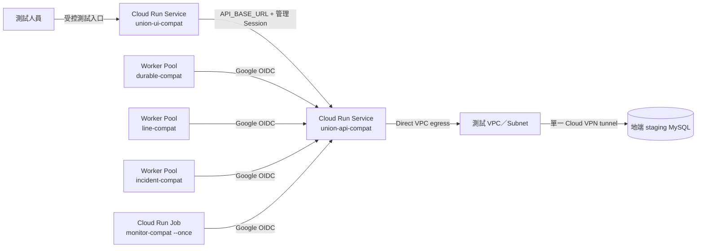

# Cloud Run 現況相容性部署測試封裝計畫

> 2026-08-20 更新：三個相容性映像改用各自的 `compat-api`、`compat-ui`、`compat-runtime-ops`
> dependency group；Redis client 與 Redis runtime 已移出本輪 Cloud Run 相容性測試。API／runtime-ops
> 的 `REDIS_URL` 預設為空，cache／wakeup 不構成啟動與 readiness 前置條件。

- 文件性質：獨立的 `TEST_ONLY` 相容性驗證計畫；不是正式容器規格、production readiness 證據或 cutover 授權
- 計畫狀態：`LOCAL_IMAGE_VALIDATED／CLOUD_RUN_STAGING_AUTOMATED_ACCEPTANCE_PASS／MANUAL_ACCEPTANCE_PENDING`
- 更新日期：2026-08-22
- 正式封裝基線：`document/雲端部署/計劃書/Cloud_Run_Dockerfile封裝計畫_v2.md`
- 正式部署基線：`document/雲端部署/計劃書/單一Cloud VPN計畫書.md`

## 一、目的與結論

本計畫的目的不是先完成正式容器，而是以現行程式碼建立三個隔離的相容性測試映像，提早驗證：

1. FastAPI、Streamlit、三種 worker 與 monitor 能否在 Linux container／Cloud Run 執行。
2. UI、API、Worker Pool、Monitor Job 之間的 URL、Google OIDC、timeout與重試能否正確串聯。
3. Business API 能否經 Direct VPC egress、單一 Cloud VPN tunnel 連到**測試用**地端 MySQL。
4. 現有本機檔案、動態 import、dependency、啟動命令與 Cloud Run filesystem 限制會在哪裡失敗。
5. VPN／DB 中斷、container restart、scale-to-zero 與 revision 更新是否暴露重大相容性問題。

**結論：可以在不修改業務程式的前提下先做測試封裝。** 但為了忠實執行現有 entry point，測試拓樸會使用 3 個 image、2 個 Service、3 個獨立 Worker Pool及 1 個 Monitor Job。正式方案仍維持 3 個 image、4 個 Cloud Run resource；正式 Worker Pool supervisor 完成前，不把測試拓樸升格為正式架構。

## 二、測試與正式封裝隔離

### 2.1 獨立檔案與 image identity

測試施工固定使用下列路徑，避免覆蓋正式規劃的 `docker/Dockerfile.*`：

| 測試檔案 | 測試 image | 用途 |
|---|---|---|
| `docker/compat/Dockerfile.api` | `union-api-compat:<test-id>` | 現況 FastAPI 與全部必要 runtime closure |
| `docker/compat/Dockerfile.ui` | `union-ui-compat:<test-id>` | 現況 Streamlit 與頁面／本機模板相容性 |
| `docker/compat/Dockerfile.runtime-ops` | `union-runtime-ops-compat:<test-id>` | Durable、LINE、Incident、Monitor 共用 image，不共用 process |
| `docker/compat/Dockerfile.api.dockerignore` | 不適用 | API build context 的 secret、個資、歷史與大型產物排除 |
| `docker/compat/Dockerfile.ui.dockerignore` | 不適用 | UI build context 的 secret、個資、歷史與大型產物排除 |
| `docker/compat/Dockerfile.runtime-ops.dockerignore` | 不適用 | runtime-ops build context 的 secret、個資、歷史與大型產物排除 |
| `docker/compat/README.md` | 不適用 | test-only 限制、build／run 命令與清理方式 |

Artifact Registry repository、image name、Cloud Run resource name與 label 都必須含 `compat`／`test`；禁止使用 `latest`、正式 service 名稱或 production traffic tag。測試 image 不得 retag、copy 或 promote 為正式 image。

### 2.2 不修改的內容

- 不修改 Domain、Subsystem、API、UI 或 worker 業務程式。
- 不新增或套用 schema、migration、seed、backfill。
- 不連正式 `union_db`；只允許 disposable／staging database。
- 不決定合約、LINE 媒體或附件的正式保存政策。
- 不建立正式 Pub/Sub fallback、Cloud Storage、NAS SFTP、雙 tunnel 或 production Load Balancer。
- 不把測試成功解讀為安全、HA、備份、rollback 或 production readiness 已完成。

## 三、測試拓樸與資源



| 資源 | 數量 | Image／command | 測試限制 |
|---|---:|---|---|
| API Service | 1 | `union-api-compat`；`uvicorn api.main:app` | `min=0`、`max=1`；唯一持有 staging DB secret／route |
| UI Service | 1 | `union-ui-compat`；`streamlit run ui/app.py` | `min=0`、`max=1`；不持有 DB secret |
| Durable Worker Pool | 1 | `union-runtime-ops-compat`；`python -m scripts.run_durable_job_worker` | 1 instance；只呼叫 Private API |
| LINE Worker Pool | 1 | 同 image；`python -m scripts.run_line_worker` | 1 instance；只使用測試 LINE channel |
| Incident Worker Pool | 1 | 同 image；`python -m scripts.run_incident_worker` | 1 instance；只呼叫 Private API |
| Monitor Job | 1 | 同 image；`python -m scripts.run_service_monitor --once` | 先人工執行；通過後才測 Scheduler |

以三個獨立 Worker Pool 取代尚未實作的多 process supervisor，是本次「不改業務程式」的測試性調整。它只驗證每個既有 worker entry point；不驗證正式方案的 child supervision、共同生命週期或成本。

## 四、三個測試 Dockerfile 規劃

### 4.1 共通規則

- 使用 repository 當下鎖定的 Python 3.11 相容 base image digest。
- 使用 multi-stage build及現有 lockfile；為提高現況相容性，可先安裝完整 non-dev dependency，不在此階段拆 production groups。
- 建立 non-root runtime user；只對現況確實會寫入的測試目錄給予最小寫入權限。
- 每份 Dockerfile使用同名 `.dockerignore`；不複製 `.env`、secret、service-account JSON、VPN 設定、Git history、文件、測試資料、正式資料、backup、log或下載檔。
- 不在 image 內寫入 DB host／password、LINE secret、OIDC token、NAS IP或 VPN PSK。
- 允許容器 root filesystem 在此相容性測試中維持 Cloud Run 預設可寫；正式 image 的 read-only filesystem gate另行處理。
- `APP_RELEASE_VERSION` 使用測試 commit SHA／test id；禁止 `latest`。

### 4.2 API image

測試目標：確認 `api.main:app` 可 import、全部現行 router 可載入、OpenAPI 可產生，並可連 staging MySQL。

啟動命令：

```text
python -m uvicorn api.main:app --host 0.0.0.0 --port ${PORT}
```

為避免先調整 import closure，測試 image 可包含 API 現況所需的 `api/`、`domains/`、`subsystems/`、`shared_kernel/`、`infrastructure/`、`line/`、必要 `config/`／`db/templates/` 與完整 non-dev dependency。這會使 image 偏大，也可能帶入 Redis、Knowledge／Chroma或開發期相依；本次將它記錄為掃描結果，不宣稱最小化完成。

本機 archive／media目錄使用 container ephemeral filesystem。任何寫入只供測試，revision 更新、重啟或 scale-to-zero 後遺失是**預期測試結果**，不得放入正式合約、正式 LINE 圖片或個資。

### 4.3 UI image

測試目標：確認 Streamlit 啟動、page registry 載入、API client可跨 Cloud Run service 操作現有功能。

啟動命令：

```text
python -m streamlit run ui/app.py --server.address=0.0.0.0 --server.port=${PORT}
```

由於現況表單管理仍讀寫 `db/form_templates.json` 與 `db/templates/`，測試 image 可放入**去敏的測試副本**並把對應目錄 owner 設為 runtime user。固定 `max=1`，避免兩個 instance 各自擁有不同內容。重啟遺失、revision 間不共享及多 instance 不一致必須列入測試報告，不能視為 bug 修復。

### 4.4 runtime-ops image

同一 image 必須能分別執行四個既有 module：

```text
python -m scripts.run_durable_job_worker --check
python -m scripts.run_durable_job_worker --once
python -m scripts.run_line_worker --once
python -m scripts.run_incident_worker --once
python -m scripts.run_service_monitor --once
```

每個 Worker Pool 只啟動一個長駐 module；Monitor Job 覆寫 command 並在一次 cycle 後結束。worker entry point 會主動移除 DB credential，因此部署設定與 image inventory 都必須證明它們沒有 DB secret。

## 五、Cloud Run 串聯與設定

### 5.1 API 與 UI

| 設定 | API compat | UI compat |
|---|---|---|
| Region | `asia-east1` | `asia-east1` |
| Instances | `min=0`、`max=1` | `min=0`、`max=1` |
| Port | Cloud Run 注入 `${PORT}` | Cloud Run 注入 `${PORT}` |
| VPC | Direct VPC，僅 API套 staging DB tag | Direct VPC，只為內部 API routing |
| DB secret | staging 專用 | 禁止 |
| `API_BASE_URL` | 不適用 | API compat 的內部 service URL |
| Local files | 測試用 ephemeral archive／media | 測試用 ephemeral template copy |

現行 UI 不會替一般管理 API 請求產生 Cloud Run IAM ID token，而是傳送應用自己的管理 Session。因此 compat API 的平台層 invocation不能假設 UI 已實作 service-to-service OIDC。測試環境採下列邊界：

1. API 使用 `internal-and-cloud-load-balancing` ingress並接入測試 VPC／Private Google Access。
2. UI server從同一測試 VPC呼叫 API service URL。
3. compat API平台層可允許 ingress 內的 unauthenticated invocation，但應用層管理 endpoint仍使用既有 admin Session；Private Operations endpoint仍驗證 Google OIDC。
4. 若步驟 1～3 無法讓 UI 穩定呼叫 API，結果記為 `CLOUD_RUN_UI_TO_API_AUTH_GAP`，不得改成公開 unrestricted API來取得假成功。

UI 測試入口優先使用受控 tester IAM／代理或測試 Load Balancer；若為排錯暫時公開，必須使用隔離專案、無正式資料、短時效、`max=1`、測試後立即移除，且不得把 URL 對外分享。

### 5.2 Worker／Monitor 到 Private API

Cloud Run staging 使用 Google OIDC，不使用 shared key：

```text
APP_ENV=staging
INTERNAL_SERVICE_AUTH_MODE=google_oidc
INTERNAL_API_BASE_URL=https://<api-compat-service-url>
INTERNAL_SERVICE_OIDC_AUDIENCE=https://<api-compat-service-url>
INTERNAL_SERVICE_OIDC_ALLOWED_CALLERS=durable-job-worker=<durable-sa>,line-worker=<line-sa>,incident-worker=<incident-sa>,runtime-monitor=<monitor-sa>
INTERNAL_API_MAX_ATTEMPTS=3
```

API 的 allowlist 必須精確對應四個 service name 與 service-account email。各 Worker Pool／Monitor SA只取得 API compat invoker；不得共用 API SA、DB secret或 project Editor。錯 audience、錯 email、錯 `X-Internal-Service-Name` 都必須得到 401／403。

Monitor 另需顯式設定：

```text
API_HEALTH_URL=https://<api-compat-service-url>/health
UI_HEALTH_URL=https://<ui-compat-service-url>/_stcore/health
LINE_PUBLIC_BASE_URL=https://<test-public-base-url>
LINE_LIFF_HEALTH_URL=https://<test-liff-health-url>
```

不得沿用程式的 localhost default。若 UI health或 public edge需要身份驗證而現況 monitor不能附加相應 token，記為 `MONITOR_AUTH_COMPAT_GAP`，不要為取得綠燈關閉正式邊界。

### 5.3 開發用 GCE＋IAP 反向 SSH DB bridge

> **本節是開發測試例外，嚴禁正式部署使用。** 目的只是在沒有固定公網 IP、尚未建立 Cloud VPN
> 的階段，讓 Cloud Run 測試 API 暫時連到開發電腦的 Docker MySQL。正式方案仍以核准的
> Cloud VPN → 地端 NAS／MySQL 為準，不得把此 bridge 升格為 production route。

連線路徑固定為：

```text
Cloud Run API
  → Direct VPC egress／compat subnet
  → 私有 GCE bridge VM:13306（無外部 IP）
  → IAP 承載的 reverse SSH Tunnel
  → 開發電腦 127.0.0.1:13307（localhost-only Docker port）
  → mysql_db:3306
```

- GCE只作TCP中繼，不保存DB資料、credential或application image；IAP提供SSH控制通道，但不是正式VPN或HA機制。
- 本機Docker forward只綁`127.0.0.1`，MySQL不得publish到`0.0.0.0`或路由器公網。
- Firewall只允許Cloud Run compat subnet到bridge VM TCP/13306，以及Google IAP來源到VM TCP/22。
- 使用者電腦、Docker、MySQL、forward及SSH process必須持續運作；休眠、斷網或程序退出都會使DB不可用。
- bridge manager只接受`environment=staging|test`且`deployment=compat`的Project；production label固定拒絕。
- 此開發Tunnel內可使用`DB_SSL_MODE=disabled`，因傳輸由SSH保護；不得把此設定沿用到正式Cloud VPN路徑。
- 啟動失敗或Tunnel中斷時，API process可存活，但DB operation必須fail closed；不得改連public 3306。
- 測試結束先執行bridge manager `stop`，再依receipt刪除Cloud Run、GCE與其他compat費用資源。

- 使用獨立 database名稱與最小權限 application user；不得指向 production `union_db`。
- staging schema必須由已核准、可追溯的既有 migration／bootstrap流程準備；container startup禁止自動 migration。
- 只有 API compat service取得 `DB_HOST`、`DB_PORT`、`DB_USER`、`DB_PASSWORD`與`DB_DATABASE`。
- Worker、Monitor、UI部署前必須掃描 env與 secret mount，確認沒有上述變數。

### 5.4 Redis、LINE 與外部副作用

- 測試預設 `REDIS_URL=`，驗證 LINE runtime 的 DB polling fallback；不部署 Redis。
- LINE webhook、push、rich-menu發布只使用測試 LINE channel與去識別測試對象。
- `DEV_REVIEW_NOTIFY_URL` 保持空值；若程式仍可觸發開發 callback，記為正式封裝 blocker。
- Knowledge／Agent runtime不建立資源、不執行 worker；若 API import仍載入相關 dependency，只記錄 image size／startup影響。
- 本次不建立 Pub/Sub告警 fallback；DB outage只驗證 typed failure與 log，不宣稱告警具 durability。

## 六、施工與驗證順序

### Phase 0：安全前置

1. 記錄 branch、HEAD、dirty paths與測試 ID。
2. 建立隔離 GCP test project／staging resources、開發用GCE bridge與費用上限。
3. 確認本機開發 DB identity、schema版本、backup及非production資料；不得以正式DB執行此測試。
4. 建立測試 LINE channel或完全停用 LINE provider side effect。
5. 先完成三份 Dockerfile-specific `.dockerignore` 與 build-context secret／PII scan，再允許任何 image build。

### Phase 1：本機 Docker 相容性

1. 建置三個 compat image，不推送 registry。
2. API在 disposable MySQL設定下啟動，驗證 `/health`、OpenAPI與 representative query。
3. UI連本機 API container，驗證登入、主要頁面、Excel／CSV preview及 typed error。
4. runtime-ops逐一執行 `--check`／`--once`，確認exit code與無 DB credential。
5. 重啟 API／UI container，確認本機模板／archive資料確實不具耐久性並記錄受影響功能。

### Phase 2：Artifact Registry 與 Cloud Run smoke

1. 對三個 image執行 dependency／vulnerability／secret scan，推送 immutable test digest。
2. 先部署 API compat但不導入使用者流量，驗證 process liveness與 staging DB readiness。
3. 部署 UI compat，驗證 UI → API path與 application Session。
4. 依序部署 Durable、LINE、Incident Worker Pool；先執行 one-shot／check，再啟動長駐 loop。
5. 部署 Monitor Job並人工執行一次；驗證 API、UI、public、LIFF observation。

### Phase 3：功能與故障驗證

1. 以去識別資料執行登入、query、preview、apply、Excel／CSV、LINE測試事件與背景 job。
2. 重啟、scale-to-zero、建立新 revision，記錄本機檔案功能的資料遺失／不一致。
3. 停止一個 worker，確認 API仍可用且 queue／heartbeat可觀測。
4. 停止IAP reverse SSH Tunnel，確認 API無 public DB fallback、worker bounded retry且 UI顯示 unavailable。
5. 恢復 route，確認連線池重建、fresh query、lease與 backlog不重複執行。
6. 回滾到前一個 test digest，確認 application rollback不修改 DB schema或 VPN。

### Phase 4：結果分類與清理

每個發現只能歸入一類：

| 分類 | 例子 | 後續 |
|---|---|---|
| `PACKAGING_GAP` | 缺檔、dependency、錯 command、權限 | 修正正式 Dockerfile計畫 |
| `CLOUD_RUN_COMPAT_GAP` | PORT、OIDC、ingress、filesystem、signal | 建立具 owner的修正工作包 |
| `APPLICATION_DEFECT` | API／UI／worker在正確設定下仍錯誤 | 另案修程式與測試 |
| `PRODUCTION_BLOCKER` | 本機耐久寫入、公開 DB、secret外洩、無 rollback | 正式封裝前必須完成 |
| `TEST_LIMITATION` | compat image較大、三個 Worker Pool、ephemeral資料 | 不當作正式架構缺陷 |

測試完成後刪除 compat Cloud Run resources、test image tags與短期 secret version；staging DB、receipt或測試資料依既有保留政策處理，不以 `git clean`／reset清理工作區。

## 七、驗收標準

| Gate | 通過條件 |
|---|---|
| Build | 三個 compat image由相同 HEAD可重建，secret／正式資料scan無命中 |
| API startup | `${PORT}`監聽、`/health`、OpenAPI、staging DB representative query成功 |
| UI startup | Streamlit health成功，主要頁面可載入並能呼叫 API |
| Private API auth | 四個 runtime使用各自 Google OIDC；錯 caller／audience固定拒絕 |
| Worker execution | 三個 worker各自可check／once／loop，無 DB credential且錯誤exit code可辨識 |
| Monitor | `--once`完成；所有 URL非localhost；權限缺口如實標示 |
| File behavior | Excel／CSV request tempfile清除；本機模板／archive重啟遺失風險被重現並記錄 |
| DB isolation | 只有 API compat可到 staging 3306；其他 resource與Internet均不可達 |
| Tunnel outage | DB操作fail closed、worker bounded retry、無公開旁路；恢復後無double apply |
| Rollback | 可切回上一個compat digest；不隱式 migration或改VPN |

以上 gate通過只代表 `CLOUD_RUN_COMPATIBILITY_TEST_PASS`，證明現行主服務可在所測拓樸運行並揭露已知缺口；不代表正式封裝完成。任何 secret／正式資料進 image、連到production DB、未授權外部副作用或公開 3306，結果直接為 `TEST_ABORTED_SECURITY_BOUNDARY`。

## 八、測試完成後的正式銜接

相容性測試報告至少輸出：image digest、部署設定（去敏）、測試 DB identity、每個 gate結果、log摘要、已知功能差異、成本與清理receipt。正式封裝只吸收已驗證的 entry point、dependency與Cloud Run設定；下列測試捷徑不得沿用：

- 完整 non-dev dependency與較大的 import closure。
- writable root filesystem與映像內可變 JSON／模板。
- 三個獨立 Worker Pool取代正式 supervisor。
- UI → API平台層暫時 invocation安排。
- ephemeral archive／media、`max=1`及人工重傳。
- 缺少正式 Pub/Sub fallback、NAS／檔案保存裁決、HA與production backup evidence。

本計畫已核准以「開發用 GCE＋IAP 反向 SSH Tunnel版」執行相容性測試，但嚴禁正式部署使用。
實際建立會產生費用的GCP資源或啟動可能造成LINE外部副作用的Worker前，操作人員仍須在腳本中確認
目標Project、Billing Account、月預算、本機非production DB及測試LINE channel；任一未確認即停止。

## 九、2026-08-20 本機執行結果

已依本計畫建立 `docker/compat/` 下的三份 Dockerfile、各自的 Dockerfile-specific `.dockerignore` 與操作說明，並完成下列本機驗證：

| Gate | 結果 | 證據摘要 |
|---|---|---|
| Dockerfile check | PASS | 三份 `docker build --check` 均無警告 |
| Image build | PASS | API、UI、runtime-ops 均由同一 lockfile及固定 Python 3.11 base digest建置成功 |
| Non-root | PASS | 三個 image runtime user皆為 `10001:10001` |
| Secret file scan | PASS | application closure無 `.env`、private key、credential JSON或 service-account JSON；套件 CA bundle不列為應用 secret |
| API startup | PASS | `/health`及`/openapi.json`皆為 HTTP 200，container health為 healthy |
| UI startup | PASS | `/_stcore/health`及首頁皆為 HTTP 200，container health為 healthy |
| UI → API | PASS | 從 UI container呼叫設定的 `API_BASE_URL/health`取得 HTTP 200／healthy |
| Runtime entrypoints | PASS_WITH_STUB | Durable `--check`／`--once`、LINE `--once`、Incident `--once`、Monitor `--once`皆正常退出；使用隔離 Private API stub，未連DB或LINE |
| Staging DB／VPN | NOT_RUN | 尚未取得隔離 staging DB、VPN route及操作授權 |
| Google OIDC／Cloud Run | NOT_RUN | 尚未建立 GCP測試資源、service account或費用資源 |

完整 pytest 結果為 `2437 passed, 136 skipped, 3 xfailed, 7 failed`。本次修正的應用層聚焦回歸為 `80 passed`；剩餘 7 項均為既有治理／驗證資產阻塞：6 個 entrypoint仍待人工 review、validation schema assembly digest與manifest不一致，以及writer inventory candidate freshness失效。這些不影響本機 API／UI／runtime image啟動，但在正式部署前仍必須由各自owner依正式治理流程處理，不能由本封裝任務重算雜湊或代替人工裁決。

三個 compat image目前因安裝完整 non-dev dependency，各約 1.34 GB；這是預期的 `TEST_LIMITATION`。正式 image仍必須依 v2封裝計畫拆分dependency group、移除Playwright／Chroma等非必要closure並執行弱點掃描。

## 十、2026-08-22 GCP開發環境實際部署結果

本次依人工確認建立`labor-union-dev-20260822`，Billing Account幣別為TWD，月預算警告為
TWD 3,000（50%／80%／100%門檻），region為`asia-east1`。此環境明確是
**開發用GCE＋IAP反向SSH Tunnel版，嚴禁正式部署使用**。

| Gate | 結果 | 證據摘要 |
|---|---|---|
| Project／費用邊界 | PASS | staging／compat labels、Billing已連結、Budget ID已建立 |
| Artifact Registry | PASS | `labor-union-compat` immutable-tag repository；三個image皆以digest部署 |
| API／UI Services | PASS | `union-api-compat`與`union-ui-compat`latest revision ready；health皆HTTP 200 |
| Public LINE endpoints | PASS | `/webhook/line` GET與`/liff-page`皆HTTP 200 |
| GCE＋IAP DB bridge | PASS | 無外部IP GCE；Windows OpenSSH reverse port與localhost-only Docker forward驗收通過 |
| Google OIDC runtime calls | PASS | Durable／LINE／Incident對Private Operations API均有持續HTTP 200證據 |
| Monitor Job | PASS | execution `union-monitor-compat-g8twc`成功完成，包含OIDC → API → MySQL cycle |
| Browser login＋TOTP | NOT_RUN | 需要帳號本人輸入密碼與Authenticator TOTP；不得由部署者代填 |
| LINE Console URL切換 | NOT_RUN | 需要channel owner到LINE Developers Console更新並Verify webhook／LIFF endpoint |

實際入口：

- Admin UI：`https://union-ui-compat-kiugq4tbnq-de.a.run.app`
- LINE Webhook：`https://union-api-compat-kiugq4tbnq-de.a.run.app/webhook/line`
- LIFF Endpoint：`https://union-api-compat-kiugq4tbnq-de.a.run.app/liff-page`

部署過程曾發現並修復三個operator-script缺口：Budget API quota project未鎖定compat Project、
PowerShell native output污染`DbHost`回傳值，以及Windows版gcloud預設PuTTY未能可靠建立reverse
forward。現行bridge manager固定使用Windows OpenSSH、獨立known-hosts與GCE端reverse-port驗收，
停止時終止整個SSH process tree。初次Tunnel失敗期間Worker依契約回報retryable 503；Tunnel恢復後
Durable、LINE、Incident呼叫均恢復HTTP 200，未走公開MySQL旁路。

目前API沿用本機`.env`的DB user；本次觀察值為`root`。這只接受於已核准的短期開發相容性環境，
不符合正式最小權限要求，固定列為`PRODUCTION_BLOCKER`；正式部署前必須改為獨立application user、
輪替DB secret並停用／銷毀含高權限credential的舊secret version。

### 10.1 UI OIDC dependency修復

首次人工開啟UI時發現`ModuleNotFoundError: google.auth`。根因是UI已使用Google OIDC identity-token
client，但`compat-ui` dependency group漏列直接相依`google-auth`；本機完整開發環境含該套件，故先前
pytest與一般環境未暴露缺口。已將`google-auth>=2.38.0`加入`compat-ui`並更新lockfile，重建後在
container內驗證`import google.auth`、`import ui.app`、health與首頁均通過，再只更新UI image digest，
未變更API、DB、VPC、OIDC audience、service account或其他Cloud Run資源。

修復後revision為`union-ui-compat-00002-pjw`，image digest為
`sha256:ecb3f94495fe460ad25a78d7e96934cbb3fbc3cc44bee3b2f5162d48b2598b01`；Cloud Run health與首頁
皆HTTP 200，新revision log無`ModuleNotFoundError`，UI聚焦回歸`11 passed`。

### 10.2 一鍵build／publish／deploy交付補強

首次部署不再要求操作人員先建立或挑選本機image。`setup_gcp_cloud_run_compat.ps1`會在任何GCP
resource mutation前呼叫`build_and_validate_cloud_run_compat_images.ps1`，從三份compat Dockerfile
建立API、UI、runtime-ops images；本機驗收包含Dockerfile check、non-root、`import google.auth`、
`import ui.app`、API health／OpenAPI、UI health／首頁、UI→API及runtime→Private API durable
check。API驗收會把主機用`DB_HOST=127.0.0.1`明確轉成Docker network內的`mysql_db:3306`；runtime
只取得短期Private API測試env，不取得任何DB credential。任一gate失敗即不push。

更新入口`publish_gcp_cloud_run_compat.ps1`預設同樣從source重新build並驗收，可用`-Roles`限制更新
角色；只有明確指定`-SelectExistingImages`才進入舊的人工複選模式。兩個入口均提供
`-PreflightOnly`，集中檢查PowerShell 7、Git、Docker CLI／daemon、gcloud、OpenSSH、ACL工具、
`.env`、lockfile及Dockerfiles。gcloud HTTP 429／`RESOURCE_EXHAUSTED`／rate limit／已分類API
propagation與Docker push短暫server error使用bounded exponential backoff；永久錯誤不重試。

bridge manager改用`scratch/cloud-run-db-bridge/<project-id>/`下的Project專用Ed25519 key，建立後以
`icacls`移除繼承ACL並只保留目前Windows使用者與SYSTEM，再登錄OS Login；不再依賴個人
`~/.ssh/google_compute_engine`。此key與bridge仍是開發測試例外，嚴禁正式部署。

| 補強gate | 目前結果 | 證據摘要 |
|---|---|---|
| 三個image自動build | PASS | 同一HEAD由三份Dockerfile重建完成 |
| built-image imports／non-root | PASS | 三個runtime user皆`10001:10001`；UI的`google.auth`／`ui.app`成功 |
| API／UI本機container | PASS | `/health`、`/openapi.json`、`/_stcore/health`及首頁HTTP 200 |
| runtime→Private API | PASS | durable check-only成功，runtime env不含DB變數 |
| 本機receipt | PASS | Git-ignored`scratch/cloud-run-compat-build/latest-image-acceptance.json` |
| 新電腦dry-run | READY_FOR_TEAM_ACCEPTANCE | 腳本已具preflight／dry-run；仍須由無既有狀態的組員電腦執行 |
| 新電腦實際GCP部署 | NOT_RUN | OAuth／MFA與新的付費staging target須由該組員本人確認；不得以本機重跑冒充 |

因此目前可宣稱`LOCAL_ONE_CLICK_IMAGE_BUILD_ACCEPTED`；只有組員在全新電腦完成preflight、dry-run、
實際staging部署及Cloud Run驗收後，才可宣稱`TEAM_ONE_CLICK_DEPLOYMENT_ACCEPTED`。

### 10.3 現有compat Project的一鍵更新實際驗收

2026-08-22以預設更新入口從目前source自動重建三個images，完成本機built-image gate後，推送到
既有Artifact Registry並以digest更新既有Cloud Run資源；全程未重建或清除既有VPC、service
account、Secret Manager、OIDC audience或DB bridge設定。

| 驗收項目 | 結果 | 實際證據 |
|---|---|---|
| API image／revision | PASS | `sha256:7e8b01ea06f76c820ba17907f9df2ab0017a079b0b1a1537a55c062cd42cff86`；`union-api-compat-00003-kx4` |
| UI image／revision | PASS | `sha256:5187c42182acb89ba3457c4db3705322e9f46aa822e2cee7e3498197834c74c6`；`union-ui-compat-00003-j6n` |
| runtime-ops image | PASS | registry manifest digest `sha256:977b12ee7816121bf35a479b123d916b0c74c0e0a1bec8964cd17b853ad34c85` |
| Worker Pools | PASS | Durable `00002-6kp`、LINE `00002-6m6`、Incident `00002-95t`，Ready皆為True |
| API／UI HTTP | PASS | API health、UI health、UI首頁皆HTTP 200；UI首頁已載入Streamlit |
| LINE public endpoints | PASS | `/webhook/line` GET與`/liff-page`皆HTTP 200 |
| Monitor Job | PASS | bridge重啟後execution `union-monitor-compat-2sbhs`成功，完成OIDC → API → 本機MySQL bridge |
| DB bridge | PASS | Project專用OpenSSH process仍為RUNNING，PID `3568`；private／public key與state目錄ACL只含目前使用者及SYSTEM |
| focused regression | PASS | launcher／bridge／UI啟動契約共`15 passed` |

這證明「既有compat Project的一鍵更新」已在目前開發機完成實際驗收。它不取代全新組員電腦的
OAuth／MFA、Docker／gcloud安裝及首次付費Project建立驗收；後者仍維持`NOT_RUN`，也不構成正式
Cloud VPN production部署證據。

bridge stop／start演練另發現Windows IAP transport異常中止後，GCE端TCP/13306可能短暫留下舊
`sshd` listener。bridge manager現會在停止及新建Tunnel前，透過Project專用OpenSSH設定精確清理
compat專用port listener並確認釋放；不掃描或終止其他port。修復後stop→start與Monitor Job皆PASS。
