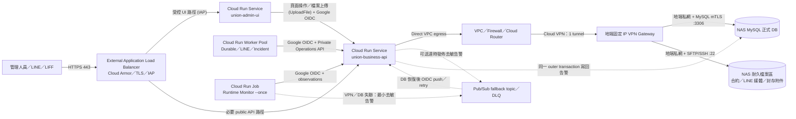

# Cloud Run Direct VPC＋單一 Cloud VPN Tunnel 雲端部署計畫

- 文件性質：部署規劃／計畫，不是已部署證據或 production cutover 授權
- 規劃版本：v1
- 更新日期：2026-08-20
- 目標區域：Google Cloud `asia-east1`（台灣）
- 核心原則：正式資料與長期檔案都以地端 NAS 為主儲存；MySQL 保存業務資料與檔案 metadata，NAS 檔案區保存合約、LINE 媒體與封存附件。只有 Business API 可經私網存取兩者；Worker、Monitor 與 UI 都只能透過 authenticated API 間接操作。
- 方案定位：以單一 Cloud VPN tunnel 降低固定月費，保留私網、VPC firewall、BGP 與 MySQL mTLS；明確接受 tunnel 維護或故障期間 NAS DB 不可達，且不宣稱具備 VPN 高可用或 99.99% SLA。

## 一、摘要與選型結論

### 1.1 最終結論：採 4+1 runtime＋單一 VPN tunnel

本案採用 **4 個 Cloud Run runtime resource + 1 個地端 NAS 資料平台（MySQL＋檔案區）**，雲地連線使用 **1 個 HA VPN gateway、1 條 IPsec tunnel、1 組 BGP session**：

| 編號 | Runtime | Cloud Run 型態 | 常駐策略 | 職責 |
|---|---|---|---|---|
| 1 | `union-business-api` | Service | `min=1` | 唯一 DB connection owner；business API、LINE webhook、Private Operations API、檔案接收解析、readiness |
| 2 | `union-admin-ui` | Service | `min=0` | Streamlit 薄 UI，支援管理操作與檔案上傳，只呼叫 API |
| 3 | `union-runtime-workers` | Worker Pool | `instances=1` | 合併 Durable Job、LINE、Incident 三個 worker；不持有 DB credential |
| 4 | `union-runtime-monitor` | Job | 每 5 分鐘一次 | 以 `--once` 探測 API、UI、public edge、LIFF，再經 Private Operations API 回報 |
| +1 | `nas-data-prod` | 地端 NAS | 地端常駐 | 正式 MySQL＋耐久檔案區；只接受 API 經 VPN 的受控私網連線 |

Cloud VPN 採用 **HA VPN gateway resource 的單 tunnel 拓樸**，而不是新建 Classic VPN 動態路由。理由如下：

- Cloud Router／BGP 可明確交換必要 prefix，日後增加第二條 tunnel 時不必把靜態路由方案整套重做。
- Classic VPN 的動態路由已退役；正式環境不建立新的 deprecated BGP架構。
- 使用 HA VPN gateway resource 不代表本拓樸具有 HA。只有一條 tunnel 時沒有介面冗餘，也不符合 Google Cloud 99.99% availability SLA 條件。
- 相較雙 tunnel 方案，每月少一條 tunnel 的固定費，約節省 USD 36.50；資料機密性與最小權限邊界不變，降低的是連線可用性。

本方案適合目前地端本來就是單 ISP、單 VPN gateway 或單 NAS，且可接受 VPN 維護／故障造成短暫 DB 中斷的情境。若業務要求 tunnel 維護不中斷、具可驗證自動切換或正式可用性 SLA，必須升級為雙 tunnel；不能只靠文件、監控或 Pub/Sub 把單 tunnel 描述成高可用。

### 1.2 正常流量與故障流程



正常流程只有 Business API 可經 Direct VPC egress、Cloud VPN 與地端私網到達 NAS MySQL 及耐久檔案區。MySQL 保存檔案 metadata、版本、content hash 與 storage key，不把大型檔案內容塞入資料表；檔案本體保存在 NAS。單一 tunnel 中斷時：

1. API liveness 可維持存活，但 authenticated readiness 必須回報 VPN／DB dependency unavailable。
2. 需要 DB 的 query、preview、apply 與 worker operation 必須 fail closed，回傳 typed `unavailable`；不得以 cache、UI state 或 Pub/Sub 偽造成功。
3. 已存在於外部 durable source 的事件維持原狀並依既有 idempotency／retry 契約重試；沒有 durable source 的同步命令由 caller 明確收到失敗。
4. Pub/Sub 只保存最小去敏告警 envelope，不保存完整個資、銀行資料、webhook secret 或原始業務 payload，也不是第二套 business database。
5. 合約、圖片及附件不得因 NAS 不可達而暫存在 Cloud Run 本機磁碟、Pub/Sub 或其他未核准雲端服務；對應操作回傳 typed `unavailable`。
6. Tunnel、DB 與 NAS 檔案服務恢復後，先通過 route、mTLS／SSH host-key、readiness 與 source freshness 檢查，再讓 worker 恢復 claim；所有 mutation 仍由 API 重新讀取 fresh facts 後執行。

Pub/Sub DB outage fallback 目前仍是部署前待完成能力。未取得核准、完成 idempotency、retention、DLQ replay、去敏與 focused tests 前，只能標示為規劃；不得因已建立 topic 就宣稱告警可可靠回寫。

### 1.3 安全與可用性結論

1. **NAS 服務永不公開。** MySQL `3306` 與檔案服務 `22` 都不做 port forwarding，也不設定 `0.0.0.0/0` 或 Cloud Run 公網 IP allowlist；流量只走 VPC route、Cloud VPN 與地端私網。
2. **只有 API 可到 NAS。** 只有 `union-business-api` 持有 DB credential、MySQL mTLS material 與 NAS 檔案服務 credential，並使用 revision network tag `cr-api-nas-client`；UI、Worker、Monitor 都沒有 NAS secret 與 NAS route permission。
3. **VPN 與 MySQL mTLS 疊加。** VPN 保護網路傳輸；MySQL server 驗證 API client certificate，API 驗證 NAS server CA／hostname，application user 只具必要 schema 權限。
4. **單 tunnel 是明確單點。** Cloud VPN tunnel、Google gateway interface、地端 peer interface、地端 ISP、VPN gateway、NAS、電力任一中斷，都可能使正式 DB 不可達。本計畫不配置自動 tunnel failover，也不宣稱 99.99% VPN SLA。
5. **保留升級空間。** VPC subnet、Cloud Router ASN、地端 ASN、BGP address range、peer gateway resource 與 firewall 規則命名需預留第二 tunnel；升級時新增第二 interface／tunnel／BGP session，再驗證 failover，不更換 DB owner。
6. **Cloud NAT v1 不建立。** NAS 私有 IP 以 `private-ranges-only` 走 VPC／VPN；公網 HTTPS 走 Cloud Run 預設 egress。只有第三方要求固定 outbound IP 或資安政策要求集中 egress 時才另案新增。
7. **Cloud Run ingress 分層。** API 與 UI 使用 `internal-and-cloud-load-balancing`；外部只能經 External Application Load Balancer。URL map 只公開 LINE webhook、LIFF callback、必要 public read 與最小 health path。
8. **管理登入雙層保護。** Admin UI 使用 IAP＋Google Group／Workspace 2-Step Verification；管理者使用 passkey 或 FIDO2 security key。應用既有 session／業務授權仍保留，不能由 IAP 取代。
9. **Service-to-service 只用 Google OIDC。** Production 精確驗證 issuer、audience、service account allowlist；不得以 `INTERNAL_SERVICE_SHARED_KEY` 作 fallback。
10. **不部署 Nginx、Tailscale 或 ngrok。** Load Balancer、Cloud Armor、IAP 與 Cloud VPN 已分別負責 edge、identity 與雲地私網；不增加旁路與額外 secret。

### 1.4 預估月費

**低流量正式環境預估每月 USD 115～130，約 NT$3,800～4,300；建議先設 NT$5,000／月預算告警。**

估算使用 `USD 1 = NT$33`、每月 730 小時、每月不超過 200 萬 HTTP requests、Load Balancer 處理 10 GiB、VPN outbound 10 GiB、Artifact Registry 5 GiB、Cloud Logging ingestion 50 GiB 以下。未含稅、網域註冊、地端固定 IP／ISP、VPN gateway、NAS、UPS、硬碟與人工維運費。

| 細項 | 數量與計算基準 | 預估 USD／月 | 說明 |
|---|---:|---:|---|
| Cloud VPN tunnel | 1 × 730 小時 × USD 0.05 | 36.50 | 單 tunnel，無 tunnel redundancy；資料傳輸另計 |
| External Application Load Balancer | 1 forwarding rule＋低流量處理量 | 約 18.33 | Serverless NEG backend 的 Cloud Run compute 另計 |
| Cloud Armor Standard | 1 policy＋約 5 rules＋低流量 requests | 約 10.75 | 依實際 policy、rule 與 request 數計費 |
| `union-business-api` | 1 vCPU／1 GiB、request-based、`min=1` | 13～20 | 實際請求與 active time 另增 |
| `union-admin-ui` | 1 vCPU／512 MiB、`min=0` | 0～2 | 接受低流量冷啟動 |
| `union-runtime-workers` | 1 vCPU／512 MiB Worker Pool、1 instance | 26～31 | 三 worker 共用；free tier 依 billing account 實際用量 |
| `union-runtime-monitor` | 1 vCPU／512 MiB Job、每 5 分鐘 | 0～5 | 依執行時間與 free tier 變動 |
| Scheduler／Pub/Sub／Secrets／Registry／DNS／Logging | 低流量基準 | 約 1～3 | backlog、retention、image、log 與 secret versions 會影響費用 |
| VPN／Internet data transfer | 假設 outbound 10 GiB | 1～3 | 依方向、目的地與實際 SKU 計費 |
| Direct VPC egress | 1 VPC／1 subnet | 0 固定費 | 無 connector VM 固定費；流量另計 |
| Cloud NAT／Cloud SQL／Cloud Storage | 0 | 0.00 | 正式資料與檔案回存地端 NAS；不建立 Cloud Storage／NAT |
| **合計** | 低流量、無 CUD | **約 115～130** | 約 **NT$3,800～4,300** |

Cloud VPN 依 tunnel 小時計費；單 tunnel 相較雙 tunnel 約少 USD 36.50／月。實際價格、匯率與 free tier 以帳單為準。第一個月不預買 committed use discount，蒐集 30 天 billable instance time 後，再只對確定長期常駐的 runtime 評估。

官方依據：[Cloud VPN pricing](https://cloud.google.com/network-connectivity/pricing)、[HA VPN topologies](https://docs.cloud.google.com/network-connectivity/docs/vpn/concepts/topologies)、[Classic VPN dynamic routing deprecation](https://docs.cloud.google.com/network-connectivity/docs/vpn/deprecations/classic-vpn-deprecation)、[Direct VPC egress](https://docs.cloud.google.com/run/docs/configuring/vpc-direct-vpc)、[Cloud Run pricing](https://cloud.google.com/run/pricing)、[Load Balancing pricing](https://cloud.google.com/load-balancing/pricing)、[Cloud Armor pricing](https://cloud.google.com/armor/pricing)。

## 二、所需 Cloud 服務與數量

### 2.1 Cloud Run 與 container artifacts

| 項目 | 數量 | 規劃 |
|---|---:|---|
| Cloud Run Service | 2 | Business API、Admin UI |
| Cloud Run Worker Pool | 1 | Durable／LINE／Incident workers 合併 |
| Cloud Run Job | 1 | Runtime Monitor `--once` |
| Artifact Registry repository | 1 | `asia-east1`、Docker format、immutable digest deploy |
| Container images | 3 | `union-api`、`union-ui`、`union-runtime-ops` |

`union-runtime-ops` image 可同時供 Worker Pool 與 Monitor Job 使用，但 resource、service account、command、env 與 release gate 必須分開。API 與 UI 不共用 image，避免 DB driver 與 UI dependencies 共用攻擊面。Production 全部 pin image digest，禁止使用 mutable `latest`。

### 2.2 網路、edge 與地端連線

| 項目 | 數量 | 規劃 |
|---|---|---|
| Custom VPC | 1 | `union-prod-vpc` |
| Regional subnet | 1 | `asia-east1` 獨立 `/24`；啟用 Private Google Access |
| Private DNS policy／zone | 1 組 | 內部 `run.app` 存取指向 Private Google Access VIP；不得污染外部 public DNS |
| HA VPN gateway resource | 1 | 只啟用一個 interface／tunnel；資源名稱不得暗示已有 HA SLA |
| VPN tunnel | 1 | IKEv2／IPsec，單一 BGP session |
| Cloud Router | 1 | 只宣告／學習必要 prefix；預留第二 BGP session |
| External peer VPN gateway resource | 1 | 描述地端單一 peer public IP／interface |
| 地端 VPN gateway | 1 | 固定公網 IP、支援 IKEv2 與 BGP |
| 地端私有網路 (LAN) | 1 | NAS MySQL 與檔案區位於地端私網，3306／22 永不公開 |
| External Application Load Balancer | 1 | HTTPS 443、Serverless NEGs、Google-managed certificate |
| Cloud Armor Standard policy | 1 | Public API 與 UI edge policy；約 5～8 條規則 |
| IAP protected application | 1 | Admin UI；Google Group 授權 |
| Cloud DNS managed zone | 1 | 正式網域 |
| Cloud NAT／VPC connector | 0 | 使用 Direct VPC egress；v1 不建 NAT |
| Nginx／Tailscale／ngrok | 0 | 不部署 |

### 2.3 身分、事件、備援與觀測

| 項目 | 數量 | 規劃 |
|---|---:|---|
| Runtime service accounts | 4 | API、UI、worker、monitor 各一個 |
| Pub/Sub push service account | 1 | 只可 invoke 告警 replay endpoint |
| CI deploy service account | 1 | Workload Identity Federation；不建立長效 JSON key |
| Secret Manager secrets | 約 10～12 | DB password、MySQL CA／client cert／key、NAS SFTP client key／host-key pin、LINE secrets 與應用必要 secret；值不入 Git |
| Pub/Sub topics／subscriptions | 2／2 | fallback、DLQ 與對應 replay／review subscription |
| Cloud Scheduler jobs | 1 | 每 5 分鐘執行 Monitor Job |
| Logging／Monitoring alert policies | 1 組 | API 5xx、VPN tunnel、route、DB readiness、worker heartbeat、queue lag、Pub/Sub backlog、TLS、budget |
| Billing budget | 1 | NT$5,000／月；50%／80%／100% 通知，只告警不自動停服務 |

### 2.4 明確不建立的服務

- 不建立 Cloud SQL；正式資料根仍是 NAS MySQL。
- 不建立 Cloud Storage；正式檔案根是地端 NAS，Pub/Sub 只保存去敏告警 envelope。
- 不開放 NAS public 3306，也不建立「Cloud NAT 固定 IP → public 3306」。
- 不建立第二條 tunnel，除非可用性需求變更並完成核准、成本與 failover 驗收。
- 不部署 Redis，除非 runtime evidence 證明 queue／lease 需要跨 instance Redis SSOT。
- Knowledge Retrieval／Agents runtime 維持停用；未來啟用需獨立 runtime、service account、budget 與核准 Work Package。

## 三、Cloud Run 與共用部署配置

### 3.1 共用基線

| 設定 | v1 規格 |
|---|---|
| Region | 全部 `asia-east1` |
| Execution environment | Cloud Run 第二代 |
| Revision | image digest pinning；label 記錄 release／Git commit，不放 secret |
| Runtime identity | 每個 resource 使用專屬 user-managed service account |
| Private authentication | Google OIDC ID token；exact issuer／audience／caller allowlist |
| VPC | Direct VPC egress；Private Google Access；依 resource 套 network tag |
| Secrets | Secret Manager 掛載／引用；不用明文 env、image layer、CLI argument 或 Git 檔案 |
| Logs | structured log：correlation ID、service、release、operation、typed error code；禁止 token、key、完整個資 |
| Deploy | Workload Identity Federation；build、test、scan、attest、deploy、traffic migration 分階段 |
| Rollout | 新 revision 先 0% smoke，再 5%／25%／100%；失敗切回上一個 immutable digest |
| Org policy | 限制 ingress／egress、禁止 public bucket 與 service account key creation；deploy 與 runtime principal 分離 |

Production 共用環境契約至少包含：

```text
APP_ENV=production
INTERNAL_SERVICE_AUTH_MODE=google_oidc
INTERNAL_API_BASE_URL=https://<internal-business-api-run.app-url>
INTERNAL_SERVICE_OIDC_AUDIENCE=https://<internal-business-api-run.app-url>
INTERNAL_SERVICE_OIDC_ALLOWED_CALLERS=durable-job-worker=<worker-sa>,incident-worker=<worker-sa>,line-worker=<worker-sa>,runtime-monitor=<monitor-sa>
INTERNAL_API_MAX_ATTEMPTS=3
KNOWLEDGE_RETRIEVAL_RUNTIME_ENABLED=false
```

Worker pool 內三個 worker 可共用一個 runtime principal，但 API endpoint 仍要綁定允許的 service name；payload 自報名稱不能擴權。若需 cryptographic identity 隔離，應拆成不同 Cloud Run resource／service account。

### 3.2 `union-business-api`

| 項目 | 配置 |
|---|---|
| Image | `union-api@sha256:<digest>` |
| CPU／Memory | 1 vCPU／1 GiB；production profile 不足再升 2 GiB |
| Billing／Instances | request-based；`min=1`、`max=3` |
| Concurrency | 20；DB-heavy endpoint 另做 application semaphore |
| Timeout | 一般 API 60 秒；長作業改 durable job |
| Ingress | `internal-and-cloud-load-balancing` |
| VPC egress | Direct VPC、`private-ranges-only`、tag `cr-api-nas-client` |
| DB pool | 每 instance 建議 pool size 5、短 timeout、pre-ping；總連線低於 NAS 保留上限 |
| DB transport | NAS private IP／DNS、TCP 3306、MySQL mTLS、server certificate verification required |
| File transport | NAS private IP／DNS、SFTP/SSH TCP 22、client key、pinned server host key、限定 chroot/root path |
| Health | `/health` 只做 liveness；authenticated dependency readiness 分別檢查 VPN route、MySQL 與 NAS file service，不因單一外部 dependency 故障停止整個 process |

Load Balancer URL map 採 allowlist；Private Operations、debug、Data Browser 與管理 mutation 不建立 public route。API service account 只讀指定 secret、發佈去敏告警及寫 observability；NAS 存取使用受控 SFTP client identity，不授予 Google Cloud Storage 權限，也不得具 project Editor／Owner。

### 3.3 `union-admin-ui`

| 項目 | 配置 |
|---|---|
| Image | `union-ui@sha256:<digest>` |
| CPU／Memory | 1 vCPU／512 MiB；OOM evidence 出現才升 1 GiB |
| Billing／Instances | request-based；`min=0`、`max=2` |
| Concurrency／Timeout | 20／300 秒；長操作仍使用 durable operation id |
| Ingress／Access | `internal-and-cloud-load-balancing`；IAP＋Google Group |
| VPC egress | Direct VPC＋Private Google Access，只呼叫 internal API |
| Secrets | 只持有 UI session／API audience 必要 secret；無 DB、LINE provider、MySQL certificate |
| Health | `/_stcore/health`，只回最小資訊 |

### 3.4 `union-runtime-workers`

| 項目 | 配置 |
|---|---|
| Image | `union-runtime-ops@sha256:<digest>` |
| CPU／Memory | 1 vCPU／512 MiB；壓測超過 70% CPU 或 400 MiB 才升級 |
| Instances | 固定 1；v1 不自動擴縮 |
| Processes | Durable Job、LINE、Incident workers |
| Supervision | PID 1 supervisor；個別 child 可重啟，連續 permanent failure 使 instance fail 並告警 |
| VPC egress | Direct VPC＋Private Google Access；無地端 3306 存取權限 |
| Authentication | Worker SA 取得 API `run.invoker`，每次 request 使用短效 OIDC token |
| Secrets | 無 DB／MySQL／LINE channel access token |
| Shutdown | SIGTERM 後停止 claim；目前 operation 依 lease／idempotency 安全完成或失敗 |

### 3.5 `union-runtime-monitor`

| 項目 | 配置 |
|---|---|
| Image／Command | `union-runtime-ops@sha256:<digest>`；`python scripts/run_service_monitor.py --once` |
| CPU／Memory | 1 vCPU／512 MiB |
| Tasks／Schedule | 1／1；每 5 分鐘，`Asia/Taipei` |
| Timeout／Retry | 60 秒；Job retry 0～1，避免雙層重試風暴 |
| VPC egress | Direct VPC＋Private Google Access；無 DB route |
| Authentication | Monitor 專屬 SA，只可 invoke readiness／observation endpoint 與發佈 fallback alert |
| Probes | API、UI、public edge、LIFF；不得直接讀 DB |

單 tunnel down 即代表雲地 DB 路徑失效，必須立即產生 critical alert；不得等待第二 tunnel 狀態或把 API process liveness 當成 DB ready。

### 3.6 檔案匯入處理架構（Admin UI 直傳 Business API）

依據現有程式碼架構（如 `api/routes/finance_import.py`、`hcm_import.py`、`client_beclass_import.py`），檔案匯入採用直傳與暫存清理機制：

1. **上傳管道**：管理人員在 `Admin UI` 透過網頁介面上傳 Excel／CSV 檔案。
2. **傳輸邊界**：UI 將檔案以 HTTP multipart 形式直接傳送至 `Business API` 的專屬匯入端點（如 `/batches/preview`、`/upload`）。
3. **本機暫存與解析**：API 接收 `UploadFile` 後寫入容器本機臨時檔案（`tempfile.NamedTemporaryFile`），完成格式校驗、去重與 Preview 預覽計算。
4. **即時清理**：在 API 請求生命週期的 `finally` 區塊中，立即呼叫 `unlink()` 刪除臨時檔案，容器內不保留任何業務檔案磁碟殘留。
5. **正式入帳**：管理人員確認 Preview 無誤後，發送 Apply 命令，由 Business API 在單一 Outer UoW 交易內將正規化數據寫入地端 NAS MySQL。

本案不部署獨立的檔案監聽服務或 Cloud Storage 轉發器，以保持代碼架構與容器邊界最簡化。

### 3.7 長期檔案保存架構（地端 NAS 為主儲存）

合約文件、LINE 媒體、rich-menu 圖片與封存附件是長期業務資料，不得依賴 Cloud Run ephemeral filesystem，也不得寫入 Pub/Sub。v1 固定由 Business API 經 VPN 以 SFTP/SSH 寫入 NAS 耐久檔案區：

1. **唯一 owner**：只有 Business API 可持有 NAS SFTP client key、host-key pin 與 root path；UI、Worker、Monitor 不得直接連線或取得 credential。
2. **資料分工**：MySQL 只保存檔案 metadata、版本、content hash、大小、MIME type、storage key 與業務關聯；檔案 bytes 保存於 NAS，避免大型 BLOB 膨脹 DB。
3. **安全寫入**：API 先在受限 `/tmp` 驗證檔案，再上傳至 NAS 隔離暫存 key，核對大小與 SHA-256 後以 NAS 端 atomic rename 發布；storage key 必須由伺服器產生且不能接受任意絕對路徑或 `..`。
4. **交易邊界**：NAS 網路呼叫不得放在 MySQL transaction 內。不可變內容以 content-addressed／idempotent key 寫入後，API 才在唯一 outer UoW 記錄 metadata；DB commit 失敗形成的未引用檔案，由具 grace period、dry-run 與 audit receipt 的清理作業處理。
5. **刪除邊界**：先在 DB transaction 標記刪除並提交 outbox／durable job，再由 API 執行 NAS 刪除；重送必須 idempotent，失敗保留待重試狀態，不得把 DB 成功回滾成未知狀態。
6. **讀取邊界**：API 先驗證應用身分與業務授權，再依 DB metadata 讀取 NAS 檔案並串流回傳；不得對外暴露 NAS hostname、實體路徑或可重用 credential。
7. **故障行為**：NAS 或 tunnel 不可達時，檔案新增、下載與刪除均 fail closed 並回 typed retryable `unavailable`；不得降級寫入容器磁碟、Cloud Storage、Pub/Sub 或 log。

正式封裝前必須把現有本機 filesystem archive／media adapter 替換為上述 NAS file-repository port 的 production SFTP adapter。若 NAS 不支援 SFTP、atomic rename、chroot/root 限制或 host-key pinning，部署狀態固定為 `BLOCKED_NAS_FILE_TRANSPORT`，不得臨時改開 SMB/NFS/public share。

## 四、單一 Cloud VPN 與地端配置

### 4.1 邏輯拓樸

| 元件 | 配置 |
|---|---|
| Google gateway | `asia-east1` HA VPN gateway resource，使用 interface 0 建立單一 tunnel |
| Peer resource | External VPN gateway resource，宣告地端固定 public IP 與單一 interface |
| Tunnel | IKEv2／IPsec；明確選定核准 cipher suite；secret 存 Secret Manager／受控地端 secret store |
| Routing | Cloud Router＋BGP；只交換 Cloud Run subnet 與地端私網必要 prefix |
| BGP addressing | 使用未重疊的 link-local `/30`；預留第二 tunnel 的獨立 `/30` |
| MTU／MSS | 依 Cloud VPN 與地端設備能力實測；必要時調整 TCP MSS，避免 large packet 黑洞 |
| Upgrade reserve | 保留 HA VPN interface 1、第二 peer interface、第二 BGP session 與 firewall naming |

不得使用「HA VPN」資源名稱推導拓樸已高可用。此版本的正式描述固定為「HA VPN gateway resource 上的單一 Cloud VPN tunnel（non-HA topology）」。

### 4.2 Firewall 與 route 邊界

| 層級 | 必要配置 |
|---|---|
| Cloud subnet | `asia-east1` 獨立 subnet；Private Google Access；不與 NAS／其他 VPN CIDR 重疊 |
| Cloud Router | 只學習地端 NAS 私網 prefix；只向地端宣告 Cloud Run API 所需 subnet |
| Cloud egress firewall | `cr-api-nas-client` → NAS DB private IP TCP 3306、NAS SFTP private IP TCP 22 allow；其他 runtime → 地端私網 deny；最後 deny＋logging |
| On-prem firewall | 只允許 Cloud Run API subnet／核准 tag 流量 → NAS private IP:3306／22；internet 與其他未授權連線全部禁止 |
| MySQL | `bind-address` 綁地端私網 private IP；`require_secure_transport=ON`；驗證 server／client certificate；禁止 remote root |
| NAS file service | SFTP-only account、pinned host key、chroot/root path、禁止 shell／port forwarding、最小讀寫權限、完整 audit log |
| NAS | 地端私網 ACL、patch、磁碟加密、UPS、MySQL＋檔案區 3-2-1 backup、離線／不可變備份與 restore drill |

Firewall 規則不能只靠來源 subnet 區分 API 與其他 runtime；Cloud 端同時使用 revision network tag／service identity，地端再限縮 NAS 目的 IP、3306／22 與 MySQL mTLS／SFTP identity。未知 route、額外 prefix、certificate 或 SSH host-key verification failure 一律 fail closed。

### 4.3 Tunnel 故障與人工復原 Runbook

單 tunnel 沒有可切換的備援路徑，故障處理採「偵測、隔離、復原、驗證、恢復流量」：

1. Monitoring 偵測 tunnel down、BGP session down、learned route 消失或 API DB／NAS dependency failure，立即通知值班人員。
2. 停止 release、migration、backfill 與需要 DB／NAS 的人工操作；不重啟或重送不明結果的 mutation。
3. 依序確認 Google tunnel、Cloud Router BGP、地端 peer、ISP、公網 IP、IKE／IPsec negotiation、route、NAS DB readiness 與 SFTP health／host key。
4. 只有在可證明原 tunnel 不可恢復且變更已核准時，才重建 tunnel；不得因重建改用 public 3306 作旁路。
5. Tunnel 恢復後先驗證 BGP route、VPC Connectivity Test、TCP 3306／22、MySQL mTLS、SFTP host key、受限檔案 smoke、authenticated readiness 與 DB server identity。
6. 檢查 durable queue、worker lease、Pub/Sub backlog／DLQ 與 LINE webhook source；依 idempotency key 恢復處理。
7. 先恢復 API read-only smoke，再恢復 worker claim 與 mutation traffic；確認沒有 double apply、stale receipt 或未解析 operation。
8. 保存 incident 時間線、影響範圍、root cause、恢復證據與是否觸發升級雙 tunnel 的判斷。

本計畫不承諾固定 RTO／RPO。上線前需以實際地端設備完成至少一次「停 tunnel → 告警 → 人工恢復 → backlog replay」演練，才可建立可量測的內部復原目標。

### 4.4 升級雙 tunnel 的觸發條件

符合任一條件時，建立新核准工作包升級為雙 tunnel：

- 單次 VPN／ISP 故障使核心業務超過人工可接受停機時間。
- 30 天內發生兩次以上 tunnel／BGP 中斷或維護造成服務中止。
- 業務要求可驗證自動 failover 或 Google Cloud 99.99% VPN availability SLA。
- 地端已具雙 ISP、雙 public IP 或可支援冗餘 peer topology，且成本可接受。
- Migration／release window 已無法容忍 VPN 維護中斷。

升級不是直接「多建一條 tunnel」即完成；必須配置另一 HA VPN interface、對應 peer interface、獨立 BGP session、route priority，並實測任一 tunnel 中斷時流量切換與恢復。

## 五、告警 fallback、可觀測性與備份

### 5.1 Pub/Sub 告警 fallback

| 項目 | 配置 |
|---|---|
| Topic | `runtime-alert-fallback`；message schema 固定版本 |
| Message | `event_id`、`idempotency_key`、`correlation_id`、source service、typed error code、observed_at、redacted summary |
| Retention | 主 subscription 7 天；DLQ 14 天 |
| Delivery | OIDC push 到 API replay endpoint；只有 DB commit 成功才 2xx ack |
| Retry | Exponential backoff；DB unavailable 回 typed retryable 503；auth／schema error fail closed |
| Replay | Incident worker 仍只經 API 執行 idempotent write-back，不直連 DB |

若 tunnel 中斷時 API／Monitor 仍能到 Google APIs，才可能成功 publish；因此不能把 Pub/Sub 當作無條件可用的業務備援。正常 business command 在 DB 不可用時必須失敗或保留於既有 durable source。

API 與 Monitor 各自使用 runtime service account 的 Application Default Credentials 發布，不建立 JSON key。Monitor 必須能在 API 不可用時直接發布最小告警；API 僅在仍可執行且偵測到 DB／NAS dependency failure 時發布。publisher 必須具 topic 級 `pubsub.publisher`，push principal 只具 private replay endpoint invoker。現在 repository 尚無此 publisher／replay transport 的完整實作，因此它是 production packaging 的必要前置，不是已完成能力。

### 5.2 必要監控

| 類別 | 指標／告警 |
|---|---|
| VPN | Tunnel established、BGP session、received／advertised routes、bytes、packet drop；任一 down 即 critical |
| API／DB | Liveness、authenticated readiness、DB connect latency、pool saturation、mTLS error、typed unavailable rate |
| Runtime | Worker heartbeat、restart count、queue lag、job age、Monitor execution freshness |
| Edge | LB 5xx、Cloud Armor deny／rate limit、IAP auth failure、certificate expiry |
| Pub/Sub | Oldest unacked age、delivery attempts、DLQ backlog、schema／auth rejection |
| Cost | Budget 50%／80%／100%、log ingestion、Cloud Run billable time、VPN data transfer |

### 5.3 NAS 備份與資料復原

- VPN 不是資料備份，也不改善 NAS 本身 RPO／RTO。
- NAS MySQL 與耐久檔案區都需有一致性 backup、異地或離線不可變副本、加密、定期 restore drill 與最小權限 restore operator。
- DB metadata 與檔案版本必須能以同一 backup window／manifest 對應；restore 驗證抽查 storage key、SHA-256、大小與內容可讀性，避免只恢復 DB 或只恢復檔案。
- Release 前保存 DB／file backup identity、digest、時間、operator 與 restore evidence；不得把應用 container 啟動當 migration 或 restore 入口。
- 若未來要求 DB 高可用，另案評估 Cloud SQL migration／replication與資料主從裁決；本計畫禁止暗自雙寫。

## 六、部署順序

1. 建立獨立 production project、billing budget、Audit Logs、Artifact Registry、runtime／deploy service accounts；先套最小 IAM 與禁止長效 key 政策。
2. 建立 VPC、subnet、Private Google Access、private DNS 與 firewall deny baseline；確認 Cloud／NAS／其他 VPN CIDR 不重疊。
3. 建立 Cloud Router、HA VPN gateway resource、external peer gateway resource、單一 tunnel 與 BGP session；驗證只出現核准 prefix。
4. 在 disposable／staging DB 與隔離 NAS 測試目錄驗證 route、TCP 3306／22、MySQL mTLS、SSH host key、SFTP chroot、application user 最小權限、檔案 atomic publish／idempotency、連線池上限與 tunnel interruption behavior。
5. 完成本機 filesystem archive／media 至 NAS file-repository adapter 的遷移，以及 Pub/Sub publisher／push replay transport；通過無 Cloud Storage fallback、無本機耐久寫入與去敏訊息測試。
6. Build 三個 image（`union-api`、`union-ui`、`union-runtime-ops`），完成 dependency／vulnerability scan、SBOM、digest pin；先部署 API staging revision，驗證 liveness、DB／NAS dependency readiness、OIDC caller mapping與 dependency unavailable fail-closed。
7. 部署 UI、Worker Pool、Monitor Job；逐一證明它們沒有 DB／NAS env、secret mount、地端 route 或 concrete storage connection。
8. 建立 Pub/Sub fallback／DLQ、Scheduler 與 alerts；以 disposable event 驗證 DB down → redacted alert retained／failed → DB restored → API idempotent replay，並證明一般業務 payload 與檔案無法進入 topic。
9. 建立 External Application Load Balancer、TLS、Cloud Armor、IAP 與 URL map allowlist；驗證外部 `run.app` 無法繞過 edge，Private Operations／debug／admin mutation 不可由 public path 到達。
10. 完成 tunnel outage drill、NAS MySQL＋檔案區 backup／restore evidence、release preflight、migration gate與人工 release approval；不得由 container startup 隱式套 schema。
11. 以 0% → 5% → 25% → 100% 漸進切換；驗證 LINE webhook durable task、UI login＋Google key、worker heartbeat、queue lag、Monitor、NAS DB mTLS、NAS 檔案存取、告警 fallback與 application rollback。

## 七、上線驗收 Gate

| Gate | 狀態要求 | 驗收內容 |
|---|---|---|
| DB isolation | `PASS` | Internet、UI、worker、monitor 均無法連 NAS:3306；只有 API 可經 VPN＋mTLS 連線 |
| File isolation | `PASS` | Internet、UI、worker、monitor 均無法連 NAS:22；只有 API 可用 pinned host key＋受限 SFTP identity 存取核准 root |
| Durable file storage | `PASS` | 合約／LINE 媒體／封存附件不寫 Cloud Run 本機或雲端 Storage；metadata／content hash 可對應 NAS 檔案，atomic publish、orphan cleanup、delete retry 與 restore smoke 通過 |
| VPN topology | `PASS` | 只有一條核准 tunnel／BGP session；文件與監控均標 non-HA，未宣稱 99.99% SLA |
| Route boundary | `PASS` | 只交換核准 Cloud Run subnet 與地端私網 prefix；未知／額外 route fail closed |
| Identity | `PASS` | 錯 issuer、audience、service account、service name、MySQL client certificate、SFTP client key／server host key 全部拒絕 |
| Public edge | `PASS` | 只有 allowlist path 可達；IAP 群組外不能進 UI；passkey／security key 實測成功 |
| Transaction boundary | `PASS` | 外部 side effect 使用 committed durable task；外部呼叫不在 DB transaction |
| Tunnel outage | `PASS` | Tunnel 中斷時 DB／NAS operation typed unavailable、無旁路／本機暫存假成功；告警、人工恢復與 backlog replay 有證據 |
| Runtime independence | `PASS` | 停 worker 不影響 API liveness；停 API 時 Monitor 可獨立告警；child crash 可被偵測／重啟 |
| Dependency outage fallback | `PASS` 或明確 `BLOCKED` | DB／NAS 失聯告警的去敏、retention、重送、DLQ、idempotent replay 已實作；未完成時不得宣稱 production-ready fallback |
| Cost controls | `PASS` | Budget、log exclusion／retention、Cloud Run max instances、Pub/Sub backlog 告警已啟用 |
| Release／rollback | `PASS` | Image digest、config、secret version、DB backup receipt、smoke與上一版 rollback 可追溯 |

任何必要 gate 未通過都不得宣稱 production ready。特別是單 tunnel outage drill、MySQL mTLS、DB isolation、OIDC exact caller 與 backup restore evidence，不得用設定截圖、mock test 或「資源已建立」取代實際驗收。

## 八、回復與變更控制

- Application revision 問題：流量切回上一個 immutable digest；不改 VPN、DB schema 或 secret identity。
- VPN 設定問題：依已驗證的 tunnel／BGP／firewall configuration export 回復；回復期間 DB operation 持續 fail closed。
- Secret rotation 問題：回到上一個仍有效且受控的 secret version；不得把 secret 貼入 log、CLI argument 或文件。
- DB migration 問題：只依核准 migration／rollback runbook 與 backup receipt 處理；Cloud Run deploy 不得隱式執行 migration。
- NAS file adapter 問題：停用檔案 mutation、保留 DB metadata 與 committed cleanup job，依上一版 adapter/config及 NAS backup manifest 回復；不得改存 Cloud Run 磁碟或臨時新增 Cloud Storage。
- 任何要新增第二 tunnel、Cloud NAT、公開 DB、Cloud SQL、Redis、Tailscale 或新的 external side effect，均超出本計畫範圍，必須重新取得架構與部署裁決。

## 九、完成定義

只有下列項目全部具備可追溯證據，才可宣告單一 Cloud VPN 方案完成：

1. Cloud Run 四個 runtime 的 image、identity、ingress／egress、secret 與 max instance 邊界完成驗證。
2. 單一 tunnel、BGP、route、firewall、地端私網、MySQL mTLS 與 NAS SFTP restricted root 通過實機測試。
3. Tunnel 中斷時所有 DB／NAS mutation fail closed，沒有 public 3306／22、direct bypass、optimistic success 或未授權資料暫存。
4. Tunnel 恢復後 readiness、fresh-fact validation、idempotent replay、worker lease 與 backlog reconciliation 通過。
5. IAP、Cloud Armor、OIDC、service account 最小權限與 Google 管理者金鑰完成驗收。
6. Monitoring、paging、budget、log retention、NAS MySQL＋檔案區一致性 backup／restore drill 與 incident runbook 可操作。
7. Pub/Sub／DLQ 僅保存去敏告警 envelope；publisher、retention、dead-letter、OIDC replay 與 DB 復原後 idempotent write-back 均有實測證據。
8. Release、migration、traffic rollout、application rollback 與 VPN configuration rollback 均有人工核准及 receipt。

本計畫只定義部署目標與驗收方式，不自動授權建立雲端資源、修改地端 firewall／VPN／NAS、套用 production migration、搬移正式資料或執行 cutover。
