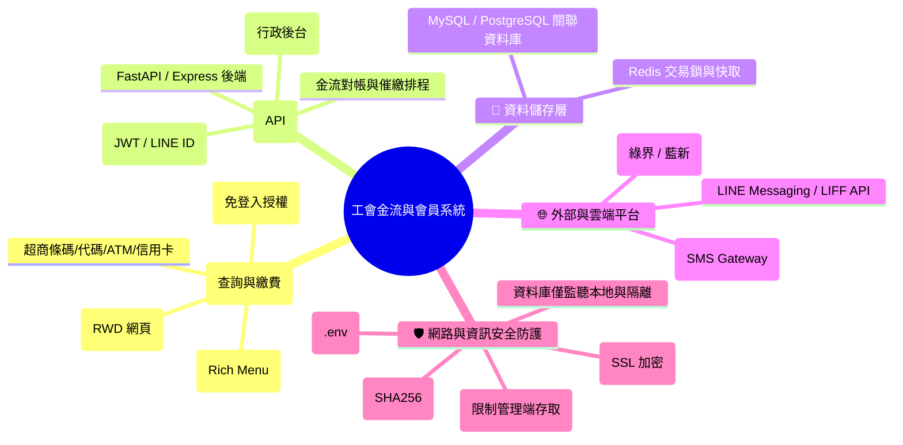

# 職業工會金流與多平台會員系統 系統設計規格書 (SRS)

本需求規格書旨在定義「職業工會金流與多平台會員系統」的功能性與非功能性需求，規劃能支援多平台（Android、iOS、LINE）的輕量化架構，並定義行政金流管理與對帳流程自動化之實作路徑。

---

## 系統架構圖

---

## 第一部分：多平台會員查詢與繳費系統

為了讓工會會員能在各式行動裝置（Android、iOS）與通訊軟體（LINE）上方便地查詢會費、健保費及進行繳費，系統採用 **響應式網頁 (Responsive Web App, RWA)** 結合 **LINE LIFF** 的統一前端架構。

### 1.1 平台對接與 LINE LIFF 整合
*   **LINE 官方帳號入口**：於 LINE 官方帳號設置圖文選單（Rich Menu），點擊後直接彈出 LINE LIFF 視窗。
*   **免登入驗證**：在 LINE 環境下，LIFF 透過 LINE 授權取得用戶的 `LINE UID`，若該 UID 已與會員資料綁定，則直接進入查詢頁面，免去重複輸入密碼的繁瑣步驟。
*   **跨平台網頁支援**：若會員透過非 LINE 管道（如 Android Chrome、iOS Safari），可直接開啟網頁，輸入「身分證字號 + 簡訊驗證碼 (OTP)」進行登入。

### 1.2 會員查詢與繳費流程
*   **應繳項目檢視**：登入後，系統自資料庫撈取該會員的待繳費項目（如：常年會費、勞保費、健保費、互助金）。
*   **金流對接與單據產生**：
    *   會員勾選欲繳納之項目，點擊「確認繳費」後，後端 API 呼叫第三方金流平台（如綠界或藍新），動態產生對應的**超商條碼、超商代碼、WebATM 轉帳帳號**或**信用卡/LINE Pay 支付連結**。
    *   頁面顯示繳費條碼或付款資訊，並提供「下載條碼」或「複製帳號」功能，方便會員至超商或透過網銀 App 繳費。

---

## 第二部分：工會金流與對帳管理系統

此部分為工會內部行政人員使用的核心系統，旨在簡化傳統人工對帳與催繳的行政流程，達成半自動化至全自動化金流管理。

### 2.1 工會行政管理後台 (Streamlit UI)
*   **會員資料維護**：支援新增、修改、刪除會員基本資料，並可綁定其 LINE 帳號。
*   **繳費紀錄與對帳看板**：
    *   整合顯示所有會員的繳費狀態（未繳、處理中、已繳費、已過期）。
    *   提供條件篩選（如依月份、會員類別、繳費管道）與即時報表匯出（Excel / CSV）。
*   **手動核帳與退費**：針對特殊臨櫃繳費或異常帳目，管理者可手動於後台調整其繳費狀態，並記錄備註。

### 2.2 金流自動對帳流程 (Webhook & IPN)
*   **即時入帳通知 (Instant Payment Notification)**：
    *   當會員於超商、ATM 或線上完成繳費，金流服務商的伺服器會即時向本系統發送 Webhook 通知。
    *   後端 API 接收通知，先進行**安全簽章驗證**，確認訊息來源合法性。
    *   驗證成功後，自動更新資料庫中對應訂單與會員的繳費狀態為「已繳費」，並寫入入帳時間與金流流水號。
*   **自動開立收據/通知**：對帳成功後，系統自動觸發 LINE 訊息或簡訊，通知會員「已成功入帳，感謝繳費」，並可提供電子收據連結。

### 2.3 欠費催繳自動化
*   **排程掃描 (Cron Job)**：系統設定排程，定期（如每月 5 號）掃描資料庫中逾期未繳費的會員。
*   **多管道催繳**：
    *   若該會員已綁定 LINE：優先透過 LINE Bot 自動發送催繳圖文訊息，並附上 LIFF 繳費連結。
    *   若該會員未綁定 LINE：自動呼叫簡訊 Gateway 發送催繳簡訊。

---

## 第三部分：地端部署與網絡安全規範

由於涉及會員的個人隱私與工會金流資料，系統安全性與對帳的防護為設計重點。

### 3.1 網路邊界防護與存取控制
*   **SSL 加密與反向代理**：對外僅開放 Port 443 (HTTPS)，使用 Nginx 作為反向代理，拒絕所有未加密的 HTTP 流量。
*   **API 來源 IP 過濾**：設定防火牆規則，針對金流 Webhook 接收端 API，僅允許金流服務商（如綠界）公告的官方 IP 網段進行連線，防範偽造入帳通知。
*   **管理後台安全隔離**：行政後台 (Streamlit) 不得直接暴露於外網，限制僅能透過工會內部實體網路，或外部經由 WireGuard VPN 隧道連回後方能進行存取。

### 3.2 金流防護與防止重複繳費
*   **Webhook 簽章校驗**：每次收到金流商的 Webhook 回傳時，必須使用 SHA256 / AES 金鑰對參數進行 Hash 驗證，防止惡意竄改繳費狀態。
*   **防重複交易鎖 (Idempotency)**：
    *   在建立訂單與接收 Webhook 時，使用資料庫唯一鍵（Unique Key）或 Redis 分散式鎖，確保同一筆繳費單不會被重複處理或重複入帳。
    *   一經繳費成功，立即作廢該筆超商條碼/代碼，避免會員重複繳款。

### 3.3 敏感金鑰管理與資料備份
*   **環境變數隔離**：金流 API HashKey、IV、LINE Channel Token、資料庫密碼等機密資訊，統一存於 `.env` 檔案中，严禁寫入 Git 版本控制。
*   **每日備份**：設定 Cron Job 於每日凌晨自動對資料庫進行備份，並加密上傳至備份儲存體（如地端 NAS 或雲端安全儲存桶）。

---

## 技術棧建議

| 模組 | 推薦技術 / 工具 | 說明 |
| :--- | :--- | :--- |
| **開發語言** | Python 3.10+ / Node.js | 用於快速開發 API 與自動化對帳邏輯 |
| **後端 API 框架** | FastAPI (Python) 或 Express (Node.js) | 高效能且具備自動產生 API 文件特性，便於對接 LINE & 金流 API |
| **會員前端** | React.js / Vue.js + Tailwind CSS | 輕量且 RWD 友善，極適合封裝為 LINE LIFF 網頁 |
| **管理員 UI** | Streamlit + PyMySQL / SQLAlchemy | 供行政人員使用，開發速度快，整合資料庫讀寫與報表匯出極為方便 |
| **關聯式資料庫** | MySQL 8.0+ 或 PostgreSQL 14+ | 儲存會員基本資料、會費應繳項目與金流對帳單 |
| **快取與鎖** | Redis (選配) | 用於防重複交易之分散式鎖與 session 快取 |
| **反向代理與安全**| Nginx + Let's Encrypt / WireGuard VPN | 處理 SSL 憑證、反向代理與管理端 VPN 隧道安全連線 |
| **部署方式** | Docker & Docker Compose | 容器化部署 API、管理後台與資料庫，降低地端與雲端環境差異，便於轉移 |

---

## 驗收標準 (Acceptance Criteria)

1.  **多平台查詢功能**：
    *   使用 iPhone (iOS) 或 Android 手機直接開啟網頁，可透過簡訊 OTP 驗證碼順利登入並查詢待繳金額。
    *   在 LINE 官方帳號內點擊圖文選單，能順利開啟 LIFF 視窗，並免手動輸入密碼直接帶出會員查詢資料。
2.  **金流單據產生**：會員點選待繳項目後，系統能在 3 秒內成功向第三方金流取得付款條碼或 ATM 虛擬帳號並顯示於畫面。
3.  **自動對帳驗證**：模擬金流商發送 Webhook 通知（附帶正確簽章），系統需在 2 秒內完成驗證、更新資料庫狀態為「已繳費」，並自動發送 LINE/簡訊入帳確認通知。
4.  **安全與防重繳**：
    *   已繳費成功的條碼，若再次收到 Webhook 繳款成功通知，系統需能識別為重複通知並安全忽略，不會重複累計金額或出錯。
    *   未透過 VPN 且不在工會內網的外部設備，嘗試連線管理後台 (Streamlit) 時，連線應被拒絕。
5.  **報表匯出與核帳**：工會行政人員能在管理介面上篩選特定月份的繳費紀錄，並一鍵下載無亂碼的 Excel 報表進行對帳。
6.  **定時催繳發送**：確認排程（如設定的每日/每週時間）能自動篩選出逾期會員，並正確透過 LINE（已綁定者）或簡訊（未綁定者）發出催繳訊息。
